cola Report for Consensus Partitioning
==================

**Date**: 2019-12-03 09:06:55 CET, **cola version**: 1.3.2

----------------------------------------------------------------

<style type='text/css'>

body, td, th {
   font-family: Arial,Helvetica,sans-serif;
   background-color: white;
   font-size: 13px;
  max-width: 800px;
  margin: auto;
  margin-left:210px;
  padding: 0px 10px 0px 10px;
  border-left: 1px solid #EEEEEE;
  line-height: 150%;
}

tt, code, pre {
   font-family: 'DejaVu Sans Mono', 'Droid Sans Mono', 'Lucida Console', Consolas, Monaco, 

monospace;
}

h1 {
   font-size:2.2em;
}

h2 {
   font-size:1.8em;
}

h3 {
   font-size:1.4em;
}

h4 {
   font-size:1.0em;
}

h5 {
   font-size:0.9em;
}

h6 {
   font-size:0.8em;
}

a {
  text-decoration: none;
  color: #0366d6;
}

a:hover {
  text-decoration: underline;
}

a:visited {
   color: #0366d6;
}

pre, img {
  max-width: 100%;
}
pre {
  overflow-x: auto;
}
pre code {
   display: block; padding: 0.5em;
}

code {
  font-size: 92%;
  border: 1px solid #ccc;
}

code[class] {
  background-color: #F8F8F8;
}

table, td, th {
  border: 1px solid #ccc;
}

blockquote {
   color:#666666;
   margin:0;
   padding-left: 1em;
   border-left: 0.5em #EEE solid;
}

hr {
   height: 0px;
   border-bottom: none;
   border-top-width: thin;
   border-top-style: dotted;
   border-top-color: #999999;
}

@media print {
   * {
      background: transparent !important;
      color: black !important;
      filter:none !important;
      -ms-filter: none !important;
   }

   body {
      font-size:12pt;
      max-width:100%;
   }

   a, a:visited {
      text-decoration: underline;
   }

   hr {
      visibility: hidden;
      page-break-before: always;
   }

   pre, blockquote {
      padding-right: 1em;
      page-break-inside: avoid;
   }

   tr, img {
      page-break-inside: avoid;
   }

   img {
      max-width: 100% !important;
   }

   @page :left {
      margin: 15mm 20mm 15mm 10mm;
   }

   @page :right {
      margin: 15mm 10mm 15mm 20mm;
   }

   p, h2, h3 {
      orphans: 3; widows: 3;
   }

   h2, h3 {
      page-break-after: avoid;
   }
}
</style>


## Summary


All available functions which can be applied to this `res_list` object:


```r
res_list
```

```
#> A 'ConsensusPartitionList' object with 24 methods.
#>   On a matrix with 51941 rows and 82 columns.
#>   Top rows are extracted by 'SD, CV, MAD, ATC' methods.
#>   Subgroups are detected by 'hclust, kmeans, skmeans, pam, mclust, NMF' method.
#>   Number of partitions are tried for k = 2, 3, 4, 5, 6.
#>   Performed in total 30000 partitions by row resampling.
#> 
#> Following methods can be applied to this 'ConsensusPartitionList' object:
#>  [1] "cola_report"           "collect_classes"       "collect_plots"         "collect_stats"        
#>  [5] "colnames"              "functional_enrichment" "get_anno_col"          "get_anno"             
#>  [9] "get_classes"           "get_matrix"            "get_membership"        "get_stats"            
#> [13] "is_best_k"             "is_stable_k"           "ncol"                  "nrow"                 
#> [17] "rownames"              "show"                  "suggest_best_k"        "test_to_known_factors"
#> [21] "top_rows_heatmap"      "top_rows_overlap"     
#> 
#> You can get result for a single method by, e.g. object["SD", "hclust"] or object["SD:hclust"]
#> or a subset of methods by object[c("SD", "CV")], c("hclust", "kmeans")]
```

The call of `run_all_consensus_partition_methods()` was:


```
#> run_all_consensus_partition_methods(data = mat, mc.cores = 4, anno = anno)
```

Dimension of the input matrix:


```r
mat = get_matrix(res_list)
dim(mat)
```

```
#> [1] 51941    82
```

### Density distribution

The density distribution for each sample is visualized as in one column in the
following heatmap. The clustering is based on the distance which is the
Kolmogorov-Smirnov statistic between two distributions.


```r
library(ComplexHeatmap)
densityHeatmap(mat, top_annotation = HeatmapAnnotation(df = get_anno(res_list), 
    col = get_anno_col(res_list)), ylab = "value", cluster_columns = TRUE, show_column_names = FALSE,
    mc.cores = 4)
```


### Suggest the best k


Folowing table shows the best `k` (number of partitions) for each combination
of top-value methods and partition methods. Clicking on the method name in
the table goes to the section for a single combination of methods.

[The cola vignette](http://bioconductor.org/packages/devel/bioc/vignettes/cola/inst/doc/cola.html#toc_13)
explains the definition of the metrics used for determining the best
number of partitions.


```r
suggest_best_k(res_list)
```


|                            | The best k| 1-PAC| Mean silhouette| Concordance|   |Optional k |
|:---------------------------|----------:|-----:|---------------:|-----------:|:--|:----------|
|[SD:kmeans](#SD-kmeans)     |          2| 1.000|           0.992|       0.996|** |           |
|[SD:mclust](#SD-mclust)     |          2| 1.000|           0.965|       0.987|** |           |
|[SD:NMF](#SD-NMF)           |          2| 1.000|           0.980|       0.992|** |           |
|[CV:kmeans](#CV-kmeans)     |          2| 1.000|           0.982|       0.994|** |           |
|[CV:NMF](#CV-NMF)           |          2| 1.000|           0.983|       0.993|** |           |
|[MAD:hclust](#MAD-hclust)   |          2| 1.000|           0.979|       0.990|** |           |
|[MAD:kmeans](#MAD-kmeans)   |          2| 1.000|           0.994|       0.997|** |           |
|[MAD:skmeans](#MAD-skmeans) |          3| 1.000|           0.969|       0.987|** |2          |
|[MAD:pam](#MAD-pam)         |          2| 1.000|           0.982|       0.992|** |           |
|[MAD:mclust](#MAD-mclust)   |          4| 1.000|           0.965|       0.983|** |2          |
|[ATC:kmeans](#ATC-kmeans)   |          2| 1.000|           1.000|       1.000|** |           |
|[ATC:mclust](#ATC-mclust)   |          2| 1.000|           0.983|       0.990|** |           |
|[CV:skmeans](#CV-skmeans)   |          4| 0.999|           0.969|       0.978|** |2,3        |
|[MAD:NMF](#MAD-NMF)         |          3| 0.996|           0.970|       0.984|** |2          |
|[SD:skmeans](#SD-skmeans)   |          4| 0.974|           0.956|       0.971|** |2,3        |
|[ATC:NMF](#ATC-NMF)         |          2| 0.949|           0.943|       0.976|*  |           |
|[CV:mclust](#CV-mclust)     |          5| 0.948|           0.913|       0.958|*  |2,3,4      |
|[ATC:skmeans](#ATC-skmeans) |          4| 0.946|           0.919|       0.948|*  |2,3        |
|[CV:pam](#CV-pam)           |          3| 0.940|           0.946|       0.974|*  |2          |
|[SD:pam](#SD-pam)           |          3| 0.904|           0.867|       0.944|*  |2          |
|[ATC:pam](#ATC-pam)         |          5| 0.901|           0.853|       0.910|*  |2,4        |
|[ATC:hclust](#ATC-hclust)   |          2| 0.877|           0.910|       0.963|   |           |
|[SD:hclust](#SD-hclust)     |          3| 0.857|           0.936|       0.953|   |           |
|[CV:hclust](#CV-hclust)     |          3| 0.721|           0.925|       0.924|   |           |

\*\*: 1-PAC > 0.95, \*: 1-PAC > 0.9


### CDF of consensus matrices

Cumulative distribution function curves of consensus matrix for all methods.


```r
collect_plots(res_list, fun = plot_ecdf)
```


### Consensus heatmap

Consensus heatmaps for all methods. ([What is a consensus heatmap?](http://bioconductor.org/packages/devel/bioc/vignettes/cola/inst/doc/cola.html#toc_9))


<style type='text/css'>


.ui-helper-hidden {
	display: none;
}
.ui-helper-hidden-accessible {
	border: 0;
	clip: rect(0 0 0 0);
	height: 1px;
	margin: -1px;
	overflow: hidden;
	padding: 0;
	position: absolute;
	width: 1px;
}
.ui-helper-reset {
	margin: 0;
	padding: 0;
	border: 0;
	outline: 0;
	line-height: 1.3;
	text-decoration: none;
	font-size: 100%;
	list-style: none;
}
.ui-helper-clearfix:before,
.ui-helper-clearfix:after {
	content: "";
	display: table;
	border-collapse: collapse;
}
.ui-helper-clearfix:after {
	clear: both;
}
.ui-helper-zfix {
	width: 100%;
	height: 100%;
	top: 0;
	left: 0;
	position: absolute;
	opacity: 0;
	filter:Alpha(Opacity=0); 
}

.ui-front {
	z-index: 100;
}


.ui-state-disabled {
	cursor: default !important;
	pointer-events: none;
}


.ui-icon {
	display: inline-block;
	vertical-align: middle;
	margin-top: -.25em;
	position: relative;
	text-indent: -99999px;
	overflow: hidden;
	background-repeat: no-repeat;
}

.ui-widget-icon-block {
	left: 50%;
	margin-left: -8px;
	display: block;
}


.ui-widget-overlay {
	position: fixed;
	top: 0;
	left: 0;
	width: 100%;
	height: 100%;
}
.ui-accordion .ui-accordion-header {
	display: block;
	cursor: pointer;
	position: relative;
	margin: 2px 0 0 0;
	padding: .5em .5em .5em .7em;
	font-size: 100%;
}
.ui-accordion .ui-accordion-content {
	padding: 1em 2.2em;
	border-top: 0;
	overflow: auto;
}
.ui-autocomplete {
	position: absolute;
	top: 0;
	left: 0;
	cursor: default;
}
.ui-menu {
	list-style: none;
	padding: 0;
	margin: 0;
	display: block;
	outline: 0;
}
.ui-menu .ui-menu {
	position: absolute;
}
.ui-menu .ui-menu-item {
	margin: 0;
	cursor: pointer;
	
	list-style-image: url("data:image/gif;base64,R0lGODlhAQABAIAAAAAAAP///yH5BAEAAAAALAAAAAABAAEAAAIBRAA7");
}
.ui-menu .ui-menu-item-wrapper {
	position: relative;
	padding: 3px 1em 3px .4em;
}
.ui-menu .ui-menu-divider {
	margin: 5px 0;
	height: 0;
	font-size: 0;
	line-height: 0;
	border-width: 1px 0 0 0;
}
.ui-menu .ui-state-focus,
.ui-menu .ui-state-active {
	margin: -1px;
}


.ui-menu-icons {
	position: relative;
}
.ui-menu-icons .ui-menu-item-wrapper {
	padding-left: 2em;
}


.ui-menu .ui-icon {
	position: absolute;
	top: 0;
	bottom: 0;
	left: .2em;
	margin: auto 0;
}


.ui-menu .ui-menu-icon {
	left: auto;
	right: 0;
}
.ui-button {
	padding: .4em 1em;
	display: inline-block;
	position: relative;
	line-height: normal;
	margin-right: .1em;
	cursor: pointer;
	vertical-align: middle;
	text-align: center;
	-webkit-user-select: none;
	-moz-user-select: none;
	-ms-user-select: none;
	user-select: none;

	
	overflow: visible;
}

.ui-button,
.ui-button:link,
.ui-button:visited,
.ui-button:hover,
.ui-button:active {
	text-decoration: none;
}


.ui-button-icon-only {
	width: 2em;
	box-sizing: border-box;
	text-indent: -9999px;
	white-space: nowrap;
}


input.ui-button.ui-button-icon-only {
	text-indent: 0;
}


.ui-button-icon-only .ui-icon {
	position: absolute;
	top: 50%;
	left: 50%;
	margin-top: -8px;
	margin-left: -8px;
}

.ui-button.ui-icon-notext .ui-icon {
	padding: 0;
	width: 2.1em;
	height: 2.1em;
	text-indent: -9999px;
	white-space: nowrap;

}

input.ui-button.ui-icon-notext .ui-icon {
	width: auto;
	height: auto;
	text-indent: 0;
	white-space: normal;
	padding: .4em 1em;
}


input.ui-button::-moz-focus-inner,
button.ui-button::-moz-focus-inner {
	border: 0;
	padding: 0;
}
.ui-controlgroup {
	vertical-align: middle;
	display: inline-block;
}
.ui-controlgroup > .ui-controlgroup-item {
	float: left;
	margin-left: 0;
	margin-right: 0;
}
.ui-controlgroup > .ui-controlgroup-item:focus,
.ui-controlgroup > .ui-controlgroup-item.ui-visual-focus {
	z-index: 9999;
}
.ui-controlgroup-vertical > .ui-controlgroup-item {
	display: block;
	float: none;
	width: 100%;
	margin-top: 0;
	margin-bottom: 0;
	text-align: left;
}
.ui-controlgroup-vertical .ui-controlgroup-item {
	box-sizing: border-box;
}
.ui-controlgroup .ui-controlgroup-label {
	padding: .4em 1em;
}
.ui-controlgroup .ui-controlgroup-label span {
	font-size: 80%;
}
.ui-controlgroup-horizontal .ui-controlgroup-label + .ui-controlgroup-item {
	border-left: none;
}
.ui-controlgroup-vertical .ui-controlgroup-label + .ui-controlgroup-item {
	border-top: none;
}
.ui-controlgroup-horizontal .ui-controlgroup-label.ui-widget-content {
	border-right: none;
}
.ui-controlgroup-vertical .ui-controlgroup-label.ui-widget-content {
	border-bottom: none;
}


.ui-controlgroup-vertical .ui-spinner-input {

	
	width: 75%;
	width: calc( 100% - 2.4em );
}
.ui-controlgroup-vertical .ui-spinner .ui-spinner-up {
	border-top-style: solid;
}

.ui-checkboxradio-label .ui-icon-background {
	box-shadow: inset 1px 1px 1px #ccc;
	border-radius: .12em;
	border: none;
}
.ui-checkboxradio-radio-label .ui-icon-background {
	width: 16px;
	height: 16px;
	border-radius: 1em;
	overflow: visible;
	border: none;
}
.ui-checkboxradio-radio-label.ui-checkboxradio-checked .ui-icon,
.ui-checkboxradio-radio-label.ui-checkboxradio-checked:hover .ui-icon {
	background-image: none;
	width: 8px;
	height: 8px;
	border-width: 4px;
	border-style: solid;
}
.ui-checkboxradio-disabled {
	pointer-events: none;
}
.ui-datepicker {
	width: 17em;
	padding: .2em .2em 0;
	display: none;
}
.ui-datepicker .ui-datepicker-header {
	position: relative;
	padding: .2em 0;
}
.ui-datepicker .ui-datepicker-prev,
.ui-datepicker .ui-datepicker-next {
	position: absolute;
	top: 2px;
	width: 1.8em;
	height: 1.8em;
}
.ui-datepicker .ui-datepicker-prev-hover,
.ui-datepicker .ui-datepicker-next-hover {
	top: 1px;
}
.ui-datepicker .ui-datepicker-prev {
	left: 2px;
}
.ui-datepicker .ui-datepicker-next {
	right: 2px;
}
.ui-datepicker .ui-datepicker-prev-hover {
	left: 1px;
}
.ui-datepicker .ui-datepicker-next-hover {
	right: 1px;
}
.ui-datepicker .ui-datepicker-prev span,
.ui-datepicker .ui-datepicker-next span {
	display: block;
	position: absolute;
	left: 50%;
	margin-left: -8px;
	top: 50%;
	margin-top: -8px;
}
.ui-datepicker .ui-datepicker-title {
	margin: 0 2.3em;
	line-height: 1.8em;
	text-align: center;
}
.ui-datepicker .ui-datepicker-title select {
	font-size: 1em;
	margin: 1px 0;
}
.ui-datepicker select.ui-datepicker-month,
.ui-datepicker select.ui-datepicker-year {
	width: 45%;
}
.ui-datepicker table {
	width: 100%;
	font-size: .9em;
	border-collapse: collapse;
	margin: 0 0 .4em;
}
.ui-datepicker th {
	padding: .7em .3em;
	text-align: center;
	font-weight: bold;
	border: 0;
}
.ui-datepicker td {
	border: 0;
	padding: 1px;
}
.ui-datepicker td span,
.ui-datepicker td a {
	display: block;
	padding: .2em;
	text-align: right;
	text-decoration: none;
}
.ui-datepicker .ui-datepicker-buttonpane {
	background-image: none;
	margin: .7em 0 0 0;
	padding: 0 .2em;
	border-left: 0;
	border-right: 0;
	border-bottom: 0;
}
.ui-datepicker .ui-datepicker-buttonpane button {
	float: right;
	margin: .5em .2em .4em;
	cursor: pointer;
	padding: .2em .6em .3em .6em;
	width: auto;
	overflow: visible;
}
.ui-datepicker .ui-datepicker-buttonpane button.ui-datepicker-current {
	float: left;
}


.ui-datepicker.ui-datepicker-multi {
	width: auto;
}
.ui-datepicker-multi .ui-datepicker-group {
	float: left;
}
.ui-datepicker-multi .ui-datepicker-group table {
	width: 95%;
	margin: 0 auto .4em;
}
.ui-datepicker-multi-2 .ui-datepicker-group {
	width: 50%;
}
.ui-datepicker-multi-3 .ui-datepicker-group {
	width: 33.3%;
}
.ui-datepicker-multi-4 .ui-datepicker-group {
	width: 25%;
}
.ui-datepicker-multi .ui-datepicker-group-last .ui-datepicker-header,
.ui-datepicker-multi .ui-datepicker-group-middle .ui-datepicker-header {
	border-left-width: 0;
}
.ui-datepicker-multi .ui-datepicker-buttonpane {
	clear: left;
}
.ui-datepicker-row-break {
	clear: both;
	width: 100%;
	font-size: 0;
}


.ui-datepicker-rtl {
	direction: rtl;
}
.ui-datepicker-rtl .ui-datepicker-prev {
	right: 2px;
	left: auto;
}
.ui-datepicker-rtl .ui-datepicker-next {
	left: 2px;
	right: auto;
}
.ui-datepicker-rtl .ui-datepicker-prev:hover {
	right: 1px;
	left: auto;
}
.ui-datepicker-rtl .ui-datepicker-next:hover {
	left: 1px;
	right: auto;
}
.ui-datepicker-rtl .ui-datepicker-buttonpane {
	clear: right;
}
.ui-datepicker-rtl .ui-datepicker-buttonpane button {
	float: left;
}
.ui-datepicker-rtl .ui-datepicker-buttonpane button.ui-datepicker-current,
.ui-datepicker-rtl .ui-datepicker-group {
	float: right;
}
.ui-datepicker-rtl .ui-datepicker-group-last .ui-datepicker-header,
.ui-datepicker-rtl .ui-datepicker-group-middle .ui-datepicker-header {
	border-right-width: 0;
	border-left-width: 1px;
}


.ui-datepicker .ui-icon {
	display: block;
	text-indent: -99999px;
	overflow: hidden;
	background-repeat: no-repeat;
	left: .5em;
	top: .3em;
}
.ui-dialog {
	position: absolute;
	top: 0;
	left: 0;
	padding: .2em;
	outline: 0;
}
.ui-dialog .ui-dialog-titlebar {
	padding: .4em 1em;
	position: relative;
}
.ui-dialog .ui-dialog-title {
	float: left;
	margin: .1em 0;
	white-space: nowrap;
	width: 90%;
	overflow: hidden;
	text-overflow: ellipsis;
}
.ui-dialog .ui-dialog-titlebar-close {
	position: absolute;
	right: .3em;
	top: 50%;
	width: 20px;
	margin: -10px 0 0 0;
	padding: 1px;
	height: 20px;
}
.ui-dialog .ui-dialog-content {
	position: relative;
	border: 0;
	padding: .5em 1em;
	background: none;
	overflow: auto;
}
.ui-dialog .ui-dialog-buttonpane {
	text-align: left;
	border-width: 1px 0 0 0;
	background-image: none;
	margin-top: .5em;
	padding: .3em 1em .5em .4em;
}
.ui-dialog .ui-dialog-buttonpane .ui-dialog-buttonset {
	float: right;
}
.ui-dialog .ui-dialog-buttonpane button {
	margin: .5em .4em .5em 0;
	cursor: pointer;
}
.ui-dialog .ui-resizable-n {
	height: 2px;
	top: 0;
}
.ui-dialog .ui-resizable-e {
	width: 2px;
	right: 0;
}
.ui-dialog .ui-resizable-s {
	height: 2px;
	bottom: 0;
}
.ui-dialog .ui-resizable-w {
	width: 2px;
	left: 0;
}
.ui-dialog .ui-resizable-se,
.ui-dialog .ui-resizable-sw,
.ui-dialog .ui-resizable-ne,
.ui-dialog .ui-resizable-nw {
	width: 7px;
	height: 7px;
}
.ui-dialog .ui-resizable-se {
	right: 0;
	bottom: 0;
}
.ui-dialog .ui-resizable-sw {
	left: 0;
	bottom: 0;
}
.ui-dialog .ui-resizable-ne {
	right: 0;
	top: 0;
}
.ui-dialog .ui-resizable-nw {
	left: 0;
	top: 0;
}
.ui-draggable .ui-dialog-titlebar {
	cursor: move;
}
.ui-draggable-handle {
	-ms-touch-action: none;
	touch-action: none;
}
.ui-resizable {
	position: relative;
}
.ui-resizable-handle {
	position: absolute;
	font-size: 0.1px;
	display: block;
	-ms-touch-action: none;
	touch-action: none;
}
.ui-resizable-disabled .ui-resizable-handle,
.ui-resizable-autohide .ui-resizable-handle {
	display: none;
}
.ui-resizable-n {
	cursor: n-resize;
	height: 7px;
	width: 100%;
	top: -5px;
	left: 0;
}
.ui-resizable-s {
	cursor: s-resize;
	height: 7px;
	width: 100%;
	bottom: -5px;
	left: 0;
}
.ui-resizable-e {
	cursor: e-resize;
	width: 7px;
	right: -5px;
	top: 0;
	height: 100%;
}
.ui-resizable-w {
	cursor: w-resize;
	width: 7px;
	left: -5px;
	top: 0;
	height: 100%;
}
.ui-resizable-se {
	cursor: se-resize;
	width: 12px;
	height: 12px;
	right: 1px;
	bottom: 1px;
}
.ui-resizable-sw {
	cursor: sw-resize;
	width: 9px;
	height: 9px;
	left: -5px;
	bottom: -5px;
}
.ui-resizable-nw {
	cursor: nw-resize;
	width: 9px;
	height: 9px;
	left: -5px;
	top: -5px;
}
.ui-resizable-ne {
	cursor: ne-resize;
	width: 9px;
	height: 9px;
	right: -5px;
	top: -5px;
}
.ui-progressbar {
	height: 2em;
	text-align: left;
	overflow: hidden;
}
.ui-progressbar .ui-progressbar-value {
	margin: -1px;
	height: 100%;
}
.ui-progressbar .ui-progressbar-overlay {
	background: url("data:image/gif;base64,R0lGODlhKAAoAIABAAAAAP///yH/C05FVFNDQVBFMi4wAwEAAAAh+QQJAQABACwAAAAAKAAoAAACkYwNqXrdC52DS06a7MFZI+4FHBCKoDeWKXqymPqGqxvJrXZbMx7Ttc+w9XgU2FB3lOyQRWET2IFGiU9m1frDVpxZZc6bfHwv4c1YXP6k1Vdy292Fb6UkuvFtXpvWSzA+HycXJHUXiGYIiMg2R6W459gnWGfHNdjIqDWVqemH2ekpObkpOlppWUqZiqr6edqqWQAAIfkECQEAAQAsAAAAACgAKAAAApSMgZnGfaqcg1E2uuzDmmHUBR8Qil95hiPKqWn3aqtLsS18y7G1SzNeowWBENtQd+T1JktP05nzPTdJZlR6vUxNWWjV+vUWhWNkWFwxl9VpZRedYcflIOLafaa28XdsH/ynlcc1uPVDZxQIR0K25+cICCmoqCe5mGhZOfeYSUh5yJcJyrkZWWpaR8doJ2o4NYq62lAAACH5BAkBAAEALAAAAAAoACgAAAKVDI4Yy22ZnINRNqosw0Bv7i1gyHUkFj7oSaWlu3ovC8GxNso5fluz3qLVhBVeT/Lz7ZTHyxL5dDalQWPVOsQWtRnuwXaFTj9jVVh8pma9JjZ4zYSj5ZOyma7uuolffh+IR5aW97cHuBUXKGKXlKjn+DiHWMcYJah4N0lYCMlJOXipGRr5qdgoSTrqWSq6WFl2ypoaUAAAIfkECQEAAQAsAAAAACgAKAAAApaEb6HLgd/iO7FNWtcFWe+ufODGjRfoiJ2akShbueb0wtI50zm02pbvwfWEMWBQ1zKGlLIhskiEPm9R6vRXxV4ZzWT2yHOGpWMyorblKlNp8HmHEb/lCXjcW7bmtXP8Xt229OVWR1fod2eWqNfHuMjXCPkIGNileOiImVmCOEmoSfn3yXlJWmoHGhqp6ilYuWYpmTqKUgAAIfkECQEAAQAsAAAAACgAKAAAApiEH6kb58biQ3FNWtMFWW3eNVcojuFGfqnZqSebuS06w5V80/X02pKe8zFwP6EFWOT1lDFk8rGERh1TTNOocQ61Hm4Xm2VexUHpzjymViHrFbiELsefVrn6XKfnt2Q9G/+Xdie499XHd2g4h7ioOGhXGJboGAnXSBnoBwKYyfioubZJ2Hn0RuRZaflZOil56Zp6iioKSXpUAAAh+QQJAQABACwAAAAAKAAoAAACkoQRqRvnxuI7kU1a1UU5bd5tnSeOZXhmn5lWK3qNTWvRdQxP8qvaC+/yaYQzXO7BMvaUEmJRd3TsiMAgswmNYrSgZdYrTX6tSHGZO73ezuAw2uxuQ+BbeZfMxsexY35+/Qe4J1inV0g4x3WHuMhIl2jXOKT2Q+VU5fgoSUI52VfZyfkJGkha6jmY+aaYdirq+lQAACH5BAkBAAEALAAAAAAoACgAAAKWBIKpYe0L3YNKToqswUlvznigd4wiR4KhZrKt9Upqip61i9E3vMvxRdHlbEFiEXfk9YARYxOZZD6VQ2pUunBmtRXo1Lf8hMVVcNl8JafV38aM2/Fu5V16Bn63r6xt97j09+MXSFi4BniGFae3hzbH9+hYBzkpuUh5aZmHuanZOZgIuvbGiNeomCnaxxap2upaCZsq+1kAACH5BAkBAAEALAAAAAAoACgAAAKXjI8By5zf4kOxTVrXNVlv1X0d8IGZGKLnNpYtm8Lr9cqVeuOSvfOW79D9aDHizNhDJidFZhNydEahOaDH6nomtJjp1tutKoNWkvA6JqfRVLHU/QUfau9l2x7G54d1fl995xcIGAdXqMfBNadoYrhH+Mg2KBlpVpbluCiXmMnZ2Sh4GBqJ+ckIOqqJ6LmKSllZmsoq6wpQAAAh+QQJAQABACwAAAAAKAAoAAAClYx/oLvoxuJDkU1a1YUZbJ59nSd2ZXhWqbRa2/gF8Gu2DY3iqs7yrq+xBYEkYvFSM8aSSObE+ZgRl1BHFZNr7pRCavZ5BW2142hY3AN/zWtsmf12p9XxxFl2lpLn1rseztfXZjdIWIf2s5dItwjYKBgo9yg5pHgzJXTEeGlZuenpyPmpGQoKOWkYmSpaSnqKileI2FAAACH5BAkBAAEALAAAAAAoACgAAAKVjB+gu+jG4kORTVrVhRlsnn2dJ3ZleFaptFrb+CXmO9OozeL5VfP99HvAWhpiUdcwkpBH3825AwYdU8xTqlLGhtCosArKMpvfa1mMRae9VvWZfeB2XfPkeLmm18lUcBj+p5dnN8jXZ3YIGEhYuOUn45aoCDkp16hl5IjYJvjWKcnoGQpqyPlpOhr3aElaqrq56Bq7VAAAOw==");
	height: 100%;
	filter: alpha(opacity=25); 
	opacity: 0.25;
}
.ui-progressbar-indeterminate .ui-progressbar-value {
	background-image: none;
}
.ui-selectable {
	-ms-touch-action: none;
	touch-action: none;
}
.ui-selectable-helper {
	position: absolute;
	z-index: 100;
	border: 1px dotted black;
}
.ui-selectmenu-menu {
	padding: 0;
	margin: 0;
	position: absolute;
	top: 0;
	left: 0;
	display: none;
}
.ui-selectmenu-menu .ui-menu {
	overflow: auto;
	overflow-x: hidden;
	padding-bottom: 1px;
}
.ui-selectmenu-menu .ui-menu .ui-selectmenu-optgroup {
	font-size: 1em;
	font-weight: bold;
	line-height: 1.5;
	padding: 2px 0.4em;
	margin: 0.5em 0 0 0;
	height: auto;
	border: 0;
}
.ui-selectmenu-open {
	display: block;
}
.ui-selectmenu-text {
	display: block;
	margin-right: 20px;
	overflow: hidden;
	text-overflow: ellipsis;
}
.ui-selectmenu-button.ui-button {
	text-align: left;
	white-space: nowrap;
	width: 14em;
}
.ui-selectmenu-icon.ui-icon {
	float: right;
	margin-top: 0;
}
.ui-slider {
	position: relative;
	text-align: left;
}
.ui-slider .ui-slider-handle {
	position: absolute;
	z-index: 2;
	width: 1.2em;
	height: 1.2em;
	cursor: default;
	-ms-touch-action: none;
	touch-action: none;
}
.ui-slider .ui-slider-range {
	position: absolute;
	z-index: 1;
	font-size: .7em;
	display: block;
	border: 0;
	background-position: 0 0;
}


.ui-slider.ui-state-disabled .ui-slider-handle,
.ui-slider.ui-state-disabled .ui-slider-range {
	filter: inherit;
}

.ui-slider-horizontal {
	height: .8em;
}
.ui-slider-horizontal .ui-slider-handle {
	top: -.3em;
	margin-left: -.6em;
}
.ui-slider-horizontal .ui-slider-range {
	top: 0;
	height: 100%;
}
.ui-slider-horizontal .ui-slider-range-min {
	left: 0;
}
.ui-slider-horizontal .ui-slider-range-max {
	right: 0;
}

.ui-slider-vertical {
	width: .8em;
	height: 100px;
}
.ui-slider-vertical .ui-slider-handle {
	left: -.3em;
	margin-left: 0;
	margin-bottom: -.6em;
}
.ui-slider-vertical .ui-slider-range {
	left: 0;
	width: 100%;
}
.ui-slider-vertical .ui-slider-range-min {
	bottom: 0;
}
.ui-slider-vertical .ui-slider-range-max {
	top: 0;
}
.ui-sortable-handle {
	-ms-touch-action: none;
	touch-action: none;
}
.ui-spinner {
	position: relative;
	display: inline-block;
	overflow: hidden;
	padding: 0;
	vertical-align: middle;
}
.ui-spinner-input {
	border: none;
	background: none;
	color: inherit;
	padding: .222em 0;
	margin: .2em 0;
	vertical-align: middle;
	margin-left: .4em;
	margin-right: 2em;
}
.ui-spinner-button {
	width: 1.6em;
	height: 50%;
	font-size: .5em;
	padding: 0;
	margin: 0;
	text-align: center;
	position: absolute;
	cursor: default;
	display: block;
	overflow: hidden;
	right: 0;
}

.ui-spinner a.ui-spinner-button {
	border-top-style: none;
	border-bottom-style: none;
	border-right-style: none;
}
.ui-spinner-up {
	top: 0;
}
.ui-spinner-down {
	bottom: 0;
}
.ui-tabs {
	position: relative;
	padding: .2em;
}
.ui-tabs .ui-tabs-nav {
	margin: 0;
	padding: .2em .2em 0;
}
.ui-tabs .ui-tabs-nav li {
	list-style: none;
	float: left;
	position: relative;
	top: 0;
	margin: 1px .2em 0 0;
	border-bottom-width: 0;
	padding: 0;
	white-space: nowrap;
}
.ui-tabs .ui-tabs-nav .ui-tabs-anchor {
	float: left;
	padding: .5em 1em;
	text-decoration: none;
}
.ui-tabs .ui-tabs-nav li.ui-tabs-active {
	margin-bottom: -1px;
	padding-bottom: 1px;
}
.ui-tabs .ui-tabs-nav li.ui-tabs-active .ui-tabs-anchor,
.ui-tabs .ui-tabs-nav li.ui-state-disabled .ui-tabs-anchor,
.ui-tabs .ui-tabs-nav li.ui-tabs-loading .ui-tabs-anchor {
	cursor: text;
}
.ui-tabs-collapsible .ui-tabs-nav li.ui-tabs-active .ui-tabs-anchor {
	cursor: pointer;
}
.ui-tabs .ui-tabs-panel {
	display: block;
	border-width: 0;
	padding: 1em 1.4em;
	background: none;
}
.ui-tooltip {
	padding: 8px;
	position: absolute;
	z-index: 9999;
	max-width: 300px;
}
body .ui-tooltip {
	border-width: 2px;
}

.ui-widget {
	font-family: Arial,Helvetica,sans-serif;
	font-size: 1em;
}
.ui-widget .ui-widget {
	font-size: 1em;
}
.ui-widget input,
.ui-widget select,
.ui-widget textarea,
.ui-widget button {
	font-family: Arial,Helvetica,sans-serif;
	font-size: 1em;
}
.ui-widget.ui-widget-content {
	border: 1px solid #c5c5c5;
}
.ui-widget-content {
	border: 1px solid #dddddd;
	background: #ffffff;
	color: #333333;
}
.ui-widget-content a {
	color: #333333;
}
.ui-widget-header {
	border: 1px solid #dddddd;
	background: #e9e9e9;
	color: #333333;
	font-weight: bold;
}
.ui-widget-header a {
	color: #333333;
}


.ui-state-default,
.ui-widget-content .ui-state-default,
.ui-widget-header .ui-state-default,
.ui-button,


html .ui-button.ui-state-disabled:hover,
html .ui-button.ui-state-disabled:active {
	border: 1px solid #c5c5c5;
	background: #f6f6f6;
	font-weight: normal;
	color: #454545;
}
.ui-state-default a,
.ui-state-default a:link,
.ui-state-default a:visited,
a.ui-button,
a:link.ui-button,
a:visited.ui-button,
.ui-button {
	color: #454545;
	text-decoration: none;
}
.ui-state-hover,
.ui-widget-content .ui-state-hover,
.ui-widget-header .ui-state-hover,
.ui-state-focus,
.ui-widget-content .ui-state-focus,
.ui-widget-header .ui-state-focus,
.ui-button:hover,
.ui-button:focus {
	border: 1px solid #cccccc;
	background: #ededed;
	font-weight: normal;
	color: #2b2b2b;
}
.ui-state-hover a,
.ui-state-hover a:hover,
.ui-state-hover a:link,
.ui-state-hover a:visited,
.ui-state-focus a,
.ui-state-focus a:hover,
.ui-state-focus a:link,
.ui-state-focus a:visited,
a.ui-button:hover,
a.ui-button:focus {
	color: #2b2b2b;
	text-decoration: none;
}

.ui-visual-focus {
	box-shadow: 0 0 3px 1px rgb(94, 158, 214);
}
.ui-state-active,
.ui-widget-content .ui-state-active,
.ui-widget-header .ui-state-active,
a.ui-button:active,
.ui-button:active,
.ui-button.ui-state-active:hover {
	border: 1px solid #003eff;
	background: #007fff;
	font-weight: normal;
	color: #ffffff;
}
.ui-icon-background,
.ui-state-active .ui-icon-background {
	border: #003eff;
	background-color: #ffffff;
}
.ui-state-active a,
.ui-state-active a:link,
.ui-state-active a:visited {
	color: #ffffff;
	text-decoration: none;
}


.ui-state-highlight,
.ui-widget-content .ui-state-highlight,
.ui-widget-header .ui-state-highlight {
	border: 1px solid #dad55e;
	background: #fffa90;
	color: #777620;
}
.ui-state-checked {
	border: 1px solid #dad55e;
	background: #fffa90;
}
.ui-state-highlight a,
.ui-widget-content .ui-state-highlight a,
.ui-widget-header .ui-state-highlight a {
	color: #777620;
}
.ui-state-error,
.ui-widget-content .ui-state-error,
.ui-widget-header .ui-state-error {
	border: 1px solid #f1a899;
	background: #fddfdf;
	color: #5f3f3f;
}
.ui-state-error a,
.ui-widget-content .ui-state-error a,
.ui-widget-header .ui-state-error a {
	color: #5f3f3f;
}
.ui-state-error-text,
.ui-widget-content .ui-state-error-text,
.ui-widget-header .ui-state-error-text {
	color: #5f3f3f;
}
.ui-priority-primary,
.ui-widget-content .ui-priority-primary,
.ui-widget-header .ui-priority-primary {
	font-weight: bold;
}
.ui-priority-secondary,
.ui-widget-content .ui-priority-secondary,
.ui-widget-header .ui-priority-secondary {
	opacity: .7;
	filter:Alpha(Opacity=70); 
	font-weight: normal;
}
.ui-state-disabled,
.ui-widget-content .ui-state-disabled,
.ui-widget-header .ui-state-disabled {
	opacity: .35;
	filter:Alpha(Opacity=35); 
	background-image: none;
}
.ui-state-disabled .ui-icon {
	filter:Alpha(Opacity=35); 
}


.ui-icon {
	width: 16px;
	height: 16px;
}
.ui-icon,
.ui-widget-content .ui-icon {
	background-image: url("images/ui-icons_444444_256x240.png");
}
.ui-widget-header .ui-icon {
	background-image: url("images/ui-icons_444444_256x240.png");
}
.ui-state-hover .ui-icon,
.ui-state-focus .ui-icon,
.ui-button:hover .ui-icon,
.ui-button:focus .ui-icon {
	background-image: url("images/ui-icons_555555_256x240.png");
}
.ui-state-active .ui-icon,
.ui-button:active .ui-icon {
	background-image: url("images/ui-icons_ffffff_256x240.png");
}
.ui-state-highlight .ui-icon,
.ui-button .ui-state-highlight.ui-icon {
	background-image: url("images/ui-icons_777620_256x240.png");
}
.ui-state-error .ui-icon,
.ui-state-error-text .ui-icon {
	background-image: url("images/ui-icons_cc0000_256x240.png");
}
.ui-button .ui-icon {
	background-image: url("images/ui-icons_777777_256x240.png");
}


.ui-icon-blank { background-position: 16px 16px; }
.ui-icon-caret-1-n { background-position: 0 0; }
.ui-icon-caret-1-ne { background-position: -16px 0; }
.ui-icon-caret-1-e { background-position: -32px 0; }
.ui-icon-caret-1-se { background-position: -48px 0; }
.ui-icon-caret-1-s { background-position: -65px 0; }
.ui-icon-caret-1-sw { background-position: -80px 0; }
.ui-icon-caret-1-w { background-position: -96px 0; }
.ui-icon-caret-1-nw { background-position: -112px 0; }
.ui-icon-caret-2-n-s { background-position: -128px 0; }
.ui-icon-caret-2-e-w { background-position: -144px 0; }
.ui-icon-triangle-1-n { background-position: 0 -16px; }
.ui-icon-triangle-1-ne { background-position: -16px -16px; }
.ui-icon-triangle-1-e { background-position: -32px -16px; }
.ui-icon-triangle-1-se { background-position: -48px -16px; }
.ui-icon-triangle-1-s { background-position: -65px -16px; }
.ui-icon-triangle-1-sw { background-position: -80px -16px; }
.ui-icon-triangle-1-w { background-position: -96px -16px; }
.ui-icon-triangle-1-nw { background-position: -112px -16px; }
.ui-icon-triangle-2-n-s { background-position: -128px -16px; }
.ui-icon-triangle-2-e-w { background-position: -144px -16px; }
.ui-icon-arrow-1-n { background-position: 0 -32px; }
.ui-icon-arrow-1-ne { background-position: -16px -32px; }
.ui-icon-arrow-1-e { background-position: -32px -32px; }
.ui-icon-arrow-1-se { background-position: -48px -32px; }
.ui-icon-arrow-1-s { background-position: -65px -32px; }
.ui-icon-arrow-1-sw { background-position: -80px -32px; }
.ui-icon-arrow-1-w { background-position: -96px -32px; }
.ui-icon-arrow-1-nw { background-position: -112px -32px; }
.ui-icon-arrow-2-n-s { background-position: -128px -32px; }
.ui-icon-arrow-2-ne-sw { background-position: -144px -32px; }
.ui-icon-arrow-2-e-w { background-position: -160px -32px; }
.ui-icon-arrow-2-se-nw { background-position: -176px -32px; }
.ui-icon-arrowstop-1-n { background-position: -192px -32px; }
.ui-icon-arrowstop-1-e { background-position: -208px -32px; }
.ui-icon-arrowstop-1-s { background-position: -224px -32px; }
.ui-icon-arrowstop-1-w { background-position: -240px -32px; }
.ui-icon-arrowthick-1-n { background-position: 1px -48px; }
.ui-icon-arrowthick-1-ne { background-position: -16px -48px; }
.ui-icon-arrowthick-1-e { background-position: -32px -48px; }
.ui-icon-arrowthick-1-se { background-position: -48px -48px; }
.ui-icon-arrowthick-1-s { background-position: -64px -48px; }
.ui-icon-arrowthick-1-sw { background-position: -80px -48px; }
.ui-icon-arrowthick-1-w { background-position: -96px -48px; }
.ui-icon-arrowthick-1-nw { background-position: -112px -48px; }
.ui-icon-arrowthick-2-n-s { background-position: -128px -48px; }
.ui-icon-arrowthick-2-ne-sw { background-position: -144px -48px; }
.ui-icon-arrowthick-2-e-w { background-position: -160px -48px; }
.ui-icon-arrowthick-2-se-nw { background-position: -176px -48px; }
.ui-icon-arrowthickstop-1-n { background-position: -192px -48px; }
.ui-icon-arrowthickstop-1-e { background-position: -208px -48px; }
.ui-icon-arrowthickstop-1-s { background-position: -224px -48px; }
.ui-icon-arrowthickstop-1-w { background-position: -240px -48px; }
.ui-icon-arrowreturnthick-1-w { background-position: 0 -64px; }
.ui-icon-arrowreturnthick-1-n { background-position: -16px -64px; }
.ui-icon-arrowreturnthick-1-e { background-position: -32px -64px; }
.ui-icon-arrowreturnthick-1-s { background-position: -48px -64px; }
.ui-icon-arrowreturn-1-w { background-position: -64px -64px; }
.ui-icon-arrowreturn-1-n { background-position: -80px -64px; }
.ui-icon-arrowreturn-1-e { background-position: -96px -64px; }
.ui-icon-arrowreturn-1-s { background-position: -112px -64px; }
.ui-icon-arrowrefresh-1-w { background-position: -128px -64px; }
.ui-icon-arrowrefresh-1-n { background-position: -144px -64px; }
.ui-icon-arrowrefresh-1-e { background-position: -160px -64px; }
.ui-icon-arrowrefresh-1-s { background-position: -176px -64px; }
.ui-icon-arrow-4 { background-position: 0 -80px; }
.ui-icon-arrow-4-diag { background-position: -16px -80px; }
.ui-icon-extlink { background-position: -32px -80px; }
.ui-icon-newwin { background-position: -48px -80px; }
.ui-icon-refresh { background-position: -64px -80px; }
.ui-icon-shuffle { background-position: -80px -80px; }
.ui-icon-transfer-e-w { background-position: -96px -80px; }
.ui-icon-transferthick-e-w { background-position: -112px -80px; }
.ui-icon-folder-collapsed { background-position: 0 -96px; }
.ui-icon-folder-open { background-position: -16px -96px; }
.ui-icon-document { background-position: -32px -96px; }
.ui-icon-document-b { background-position: -48px -96px; }
.ui-icon-note { background-position: -64px -96px; }
.ui-icon-mail-closed { background-position: -80px -96px; }
.ui-icon-mail-open { background-position: -96px -96px; }
.ui-icon-suitcase { background-position: -112px -96px; }
.ui-icon-comment { background-position: -128px -96px; }
.ui-icon-person { background-position: -144px -96px; }
.ui-icon-print { background-position: -160px -96px; }
.ui-icon-trash { background-position: -176px -96px; }
.ui-icon-locked { background-position: -192px -96px; }
.ui-icon-unlocked { background-position: -208px -96px; }
.ui-icon-bookmark { background-position: -224px -96px; }
.ui-icon-tag { background-position: -240px -96px; }
.ui-icon-home { background-position: 0 -112px; }
.ui-icon-flag { background-position: -16px -112px; }
.ui-icon-calendar { background-position: -32px -112px; }
.ui-icon-cart { background-position: -48px -112px; }
.ui-icon-pencil { background-position: -64px -112px; }
.ui-icon-clock { background-position: -80px -112px; }
.ui-icon-disk { background-position: -96px -112px; }
.ui-icon-calculator { background-position: -112px -112px; }
.ui-icon-zoomin { background-position: -128px -112px; }
.ui-icon-zoomout { background-position: -144px -112px; }
.ui-icon-search { background-position: -160px -112px; }
.ui-icon-wrench { background-position: -176px -112px; }
.ui-icon-gear { background-position: -192px -112px; }
.ui-icon-heart { background-position: -208px -112px; }
.ui-icon-star { background-position: -224px -112px; }
.ui-icon-link { background-position: -240px -112px; }
.ui-icon-cancel { background-position: 0 -128px; }
.ui-icon-plus { background-position: -16px -128px; }
.ui-icon-plusthick { background-position: -32px -128px; }
.ui-icon-minus { background-position: -48px -128px; }
.ui-icon-minusthick { background-position: -64px -128px; }
.ui-icon-close { background-position: -80px -128px; }
.ui-icon-closethick { background-position: -96px -128px; }
.ui-icon-key { background-position: -112px -128px; }
.ui-icon-lightbulb { background-position: -128px -128px; }
.ui-icon-scissors { background-position: -144px -128px; }
.ui-icon-clipboard { background-position: -160px -128px; }
.ui-icon-copy { background-position: -176px -128px; }
.ui-icon-contact { background-position: -192px -128px; }
.ui-icon-image { background-position: -208px -128px; }
.ui-icon-video { background-position: -224px -128px; }
.ui-icon-script { background-position: -240px -128px; }
.ui-icon-alert { background-position: 0 -144px; }
.ui-icon-info { background-position: -16px -144px; }
.ui-icon-notice { background-position: -32px -144px; }
.ui-icon-help { background-position: -48px -144px; }
.ui-icon-check { background-position: -64px -144px; }
.ui-icon-bullet { background-position: -80px -144px; }
.ui-icon-radio-on { background-position: -96px -144px; }
.ui-icon-radio-off { background-position: -112px -144px; }
.ui-icon-pin-w { background-position: -128px -144px; }
.ui-icon-pin-s { background-position: -144px -144px; }
.ui-icon-play { background-position: 0 -160px; }
.ui-icon-pause { background-position: -16px -160px; }
.ui-icon-seek-next { background-position: -32px -160px; }
.ui-icon-seek-prev { background-position: -48px -160px; }
.ui-icon-seek-end { background-position: -64px -160px; }
.ui-icon-seek-start { background-position: -80px -160px; }

.ui-icon-seek-first { background-position: -80px -160px; }
.ui-icon-stop { background-position: -96px -160px; }
.ui-icon-eject { background-position: -112px -160px; }
.ui-icon-volume-off { background-position: -128px -160px; }
.ui-icon-volume-on { background-position: -144px -160px; }
.ui-icon-power { background-position: 0 -176px; }
.ui-icon-signal-diag { background-position: -16px -176px; }
.ui-icon-signal { background-position: -32px -176px; }
.ui-icon-battery-0 { background-position: -48px -176px; }
.ui-icon-battery-1 { background-position: -64px -176px; }
.ui-icon-battery-2 { background-position: -80px -176px; }
.ui-icon-battery-3 { background-position: -96px -176px; }
.ui-icon-circle-plus { background-position: 0 -192px; }
.ui-icon-circle-minus { background-position: -16px -192px; }
.ui-icon-circle-close { background-position: -32px -192px; }
.ui-icon-circle-triangle-e { background-position: -48px -192px; }
.ui-icon-circle-triangle-s { background-position: -64px -192px; }
.ui-icon-circle-triangle-w { background-position: -80px -192px; }
.ui-icon-circle-triangle-n { background-position: -96px -192px; }
.ui-icon-circle-arrow-e { background-position: -112px -192px; }
.ui-icon-circle-arrow-s { background-position: -128px -192px; }
.ui-icon-circle-arrow-w { background-position: -144px -192px; }
.ui-icon-circle-arrow-n { background-position: -160px -192px; }
.ui-icon-circle-zoomin { background-position: -176px -192px; }
.ui-icon-circle-zoomout { background-position: -192px -192px; }
.ui-icon-circle-check { background-position: -208px -192px; }
.ui-icon-circlesmall-plus { background-position: 0 -208px; }
.ui-icon-circlesmall-minus { background-position: -16px -208px; }
.ui-icon-circlesmall-close { background-position: -32px -208px; }
.ui-icon-squaresmall-plus { background-position: -48px -208px; }
.ui-icon-squaresmall-minus { background-position: -64px -208px; }
.ui-icon-squaresmall-close { background-position: -80px -208px; }
.ui-icon-grip-dotted-vertical { background-position: 0 -224px; }
.ui-icon-grip-dotted-horizontal { background-position: -16px -224px; }
.ui-icon-grip-solid-vertical { background-position: -32px -224px; }
.ui-icon-grip-solid-horizontal { background-position: -48px -224px; }
.ui-icon-gripsmall-diagonal-se { background-position: -64px -224px; }
.ui-icon-grip-diagonal-se { background-position: -80px -224px; }


.ui-corner-all,
.ui-corner-top,
.ui-corner-left,
.ui-corner-tl {
	border-top-left-radius: 3px;
}
.ui-corner-all,
.ui-corner-top,
.ui-corner-right,
.ui-corner-tr {
	border-top-right-radius: 3px;
}
.ui-corner-all,
.ui-corner-bottom,
.ui-corner-left,
.ui-corner-bl {
	border-bottom-left-radius: 3px;
}
.ui-corner-all,
.ui-corner-bottom,
.ui-corner-right,
.ui-corner-br {
	border-bottom-right-radius: 3px;
}


.ui-widget-overlay {
	background: #aaaaaa;
	opacity: .3;
	filter: Alpha(Opacity=30); 
}
.ui-widget-shadow {
	-webkit-box-shadow: 0px 0px 5px #666666;
	box-shadow: 0px 0px 5px #666666;
} 
</style>
<script src='js/jquery-1.12.4.js'></script>
<script src='js/jquery-ui.js'></script>

<script>
$( function() {
	$( '#tabs-collect-consensus-heatmap' ).tabs();
} );
</script>
<div id='tabs-collect-consensus-heatmap'>
<ul>
<li><a href='#tab-collect-consensus-heatmap-1'>k = 2</a></li>
<li><a href='#tab-collect-consensus-heatmap-2'>k = 3</a></li>
<li><a href='#tab-collect-consensus-heatmap-3'>k = 4</a></li>
<li><a href='#tab-collect-consensus-heatmap-4'>k = 5</a></li>
<li><a href='#tab-collect-consensus-heatmap-5'>k = 6</a></li>
</ul>
<div id='tab-collect-consensus-heatmap-1'>
<pre><code class="r">collect_plots(res_list, k = 2, fun = consensus_heatmap, mc.cores = 4)
</code></pre>

<p></p>

</div>
<div id='tab-collect-consensus-heatmap-2'>
<pre><code class="r">collect_plots(res_list, k = 3, fun = consensus_heatmap, mc.cores = 4)
</code></pre>

<p></p>

</div>
<div id='tab-collect-consensus-heatmap-3'>
<pre><code class="r">collect_plots(res_list, k = 4, fun = consensus_heatmap, mc.cores = 4)
</code></pre>

<p></p>

</div>
<div id='tab-collect-consensus-heatmap-4'>
<pre><code class="r">collect_plots(res_list, k = 5, fun = consensus_heatmap, mc.cores = 4)
</code></pre>

<p></p>

</div>
<div id='tab-collect-consensus-heatmap-5'>
<pre><code class="r">collect_plots(res_list, k = 6, fun = consensus_heatmap, mc.cores = 4)
</code></pre>

<p></p>

</div>
</div>


### Membership heatmap

Membership heatmaps for all methods. ([What is a membership heatmap?](http://bioconductor.org/packages/devel/bioc/vignettes/cola/inst/doc/cola.html#toc_12))


<script>
$( function() {
	$( '#tabs-collect-membership-heatmap' ).tabs();
} );
</script>
<div id='tabs-collect-membership-heatmap'>
<ul>
<li><a href='#tab-collect-membership-heatmap-1'>k = 2</a></li>
<li><a href='#tab-collect-membership-heatmap-2'>k = 3</a></li>
<li><a href='#tab-collect-membership-heatmap-3'>k = 4</a></li>
<li><a href='#tab-collect-membership-heatmap-4'>k = 5</a></li>
<li><a href='#tab-collect-membership-heatmap-5'>k = 6</a></li>
</ul>
<div id='tab-collect-membership-heatmap-1'>
<pre><code class="r">collect_plots(res_list, k = 2, fun = membership_heatmap, mc.cores = 4)
</code></pre>

<p></p>

</div>
<div id='tab-collect-membership-heatmap-2'>
<pre><code class="r">collect_plots(res_list, k = 3, fun = membership_heatmap, mc.cores = 4)
</code></pre>

<p></p>

</div>
<div id='tab-collect-membership-heatmap-3'>
<pre><code class="r">collect_plots(res_list, k = 4, fun = membership_heatmap, mc.cores = 4)
</code></pre>

<p></p>

</div>
<div id='tab-collect-membership-heatmap-4'>
<pre><code class="r">collect_plots(res_list, k = 5, fun = membership_heatmap, mc.cores = 4)
</code></pre>

<p></p>

</div>
<div id='tab-collect-membership-heatmap-5'>
<pre><code class="r">collect_plots(res_list, k = 6, fun = membership_heatmap, mc.cores = 4)
</code></pre>

<p></p>

</div>
</div>


### Signature heatmap

Signature heatmaps for all methods. ([What is a signature heatmap?](http://bioconductor.org/packages/devel/bioc/vignettes/cola/inst/doc/cola.html#toc_22))


Note in following heatmaps, rows are scaled.


<script>
$( function() {
	$( '#tabs-collect-get-signatures' ).tabs();
} );
</script>
<div id='tabs-collect-get-signatures'>
<ul>
<li><a href='#tab-collect-get-signatures-1'>k = 2</a></li>
<li><a href='#tab-collect-get-signatures-2'>k = 3</a></li>
<li><a href='#tab-collect-get-signatures-3'>k = 4</a></li>
<li><a href='#tab-collect-get-signatures-4'>k = 5</a></li>
<li><a href='#tab-collect-get-signatures-5'>k = 6</a></li>
</ul>
<div id='tab-collect-get-signatures-1'>
<pre><code class="r">collect_plots(res_list, k = 2, fun = get_signatures, mc.cores = 4)
</code></pre>

<p></p>

</div>
<div id='tab-collect-get-signatures-2'>
<pre><code class="r">collect_plots(res_list, k = 3, fun = get_signatures, mc.cores = 4)
</code></pre>

<p></p>

</div>
<div id='tab-collect-get-signatures-3'>
<pre><code class="r">collect_plots(res_list, k = 4, fun = get_signatures, mc.cores = 4)
</code></pre>

<p></p>

</div>
<div id='tab-collect-get-signatures-4'>
<pre><code class="r">collect_plots(res_list, k = 5, fun = get_signatures, mc.cores = 4)
</code></pre>

<p></p>

</div>
<div id='tab-collect-get-signatures-5'>
<pre><code class="r">collect_plots(res_list, k = 6, fun = get_signatures, mc.cores = 4)
</code></pre>

<p></p>

</div>
</div>


### Statistics table

The statistics used for measuring the stability of consensus partitioning.
([How are they
defined?](http://bioconductor.org/packages/devel/bioc/vignettes/cola/inst/doc/cola.html#toc_13))


<script>
$( function() {
	$( '#tabs-get-stats-from-consensus-partition-list' ).tabs();
} );
</script>
<div id='tabs-get-stats-from-consensus-partition-list'>
<ul>
<li><a href='#tab-get-stats-from-consensus-partition-list-1'>k = 2</a></li>
<li><a href='#tab-get-stats-from-consensus-partition-list-2'>k = 3</a></li>
<li><a href='#tab-get-stats-from-consensus-partition-list-3'>k = 4</a></li>
<li><a href='#tab-get-stats-from-consensus-partition-list-4'>k = 5</a></li>
<li><a href='#tab-get-stats-from-consensus-partition-list-5'>k = 6</a></li>
</ul>
<div id='tab-get-stats-from-consensus-partition-list-1'>
<pre><code class="r">get_stats(res_list, k = 2)
</code></pre>

<pre><code>#&gt;             k 1-PAC mean_silhouette concordance area_increased  Rand Jaccard
#&gt; SD:NMF      2 1.000           0.980       0.992          0.482 0.518   0.518
#&gt; CV:NMF      2 1.000           0.983       0.993          0.484 0.518   0.518
#&gt; MAD:NMF     2 1.000           1.000       1.000          0.487 0.513   0.513
#&gt; ATC:NMF     2 0.949           0.943       0.976          0.501 0.499   0.499
#&gt; SD:skmeans  2 1.000           0.990       0.996          0.490 0.509   0.509
#&gt; CV:skmeans  2 1.000           0.996       0.998          0.491 0.509   0.509
#&gt; MAD:skmeans 2 1.000           0.985       0.995          0.489 0.513   0.513
#&gt; ATC:skmeans 2 1.000           0.988       0.995          0.493 0.509   0.509
#&gt; SD:mclust   2 1.000           0.965       0.987          0.470 0.537   0.537
#&gt; CV:mclust   2 1.000           0.986       0.994          0.483 0.518   0.518
#&gt; MAD:mclust  2 1.000           0.973       0.988          0.476 0.518   0.518
#&gt; ATC:mclust  2 1.000           0.983       0.990          0.474 0.530   0.530
#&gt; SD:kmeans   2 1.000           0.992       0.996          0.478 0.524   0.524
#&gt; CV:kmeans   2 1.000           0.982       0.994          0.479 0.524   0.524
#&gt; MAD:kmeans  2 1.000           0.994       0.997          0.486 0.513   0.513
#&gt; ATC:kmeans  2 1.000           1.000       1.000          0.492 0.509   0.509
#&gt; SD:pam      2 1.000           0.965       0.987          0.482 0.518   0.518
#&gt; CV:pam      2 0.949           0.960       0.982          0.487 0.513   0.513
#&gt; MAD:pam     2 1.000           0.982       0.992          0.485 0.513   0.513
#&gt; ATC:pam     2 1.000           0.970       0.988          0.498 0.505   0.505
#&gt; SD:hclust   2 0.561           0.837       0.899          0.470 0.518   0.518
#&gt; CV:hclust   2 0.582           0.781       0.880          0.469 0.513   0.513
#&gt; MAD:hclust  2 1.000           0.979       0.990          0.480 0.518   0.518
#&gt; ATC:hclust  2 0.877           0.910       0.963          0.479 0.518   0.518
</code></pre>

</div>
<div id='tab-get-stats-from-consensus-partition-list-2'>
<pre><code class="r">get_stats(res_list, k = 3)
</code></pre>

<pre><code>#&gt;             k 1-PAC mean_silhouette concordance area_increased  Rand Jaccard
#&gt; SD:NMF      3 0.893           0.919       0.963          0.389 0.796   0.611
#&gt; CV:NMF      3 0.883           0.907       0.951          0.384 0.780   0.588
#&gt; MAD:NMF     3 0.996           0.970       0.984          0.358 0.825   0.660
#&gt; ATC:NMF     3 0.848           0.862       0.937          0.305 0.755   0.552
#&gt; SD:skmeans  3 0.970           0.930       0.972          0.333 0.826   0.662
#&gt; CV:skmeans  3 0.971           0.930       0.971          0.335 0.822   0.654
#&gt; MAD:skmeans 3 1.000           0.969       0.987          0.338 0.828   0.665
#&gt; ATC:skmeans 3 0.944           0.882       0.954          0.301 0.851   0.707
#&gt; SD:mclust   3 0.737           0.758       0.836          0.376 0.790   0.610
#&gt; CV:mclust   3 1.000           0.961       0.985          0.359 0.808   0.635
#&gt; MAD:mclust  3 0.729           0.841       0.902          0.369 0.801   0.623
#&gt; ATC:mclust  3 0.753           0.801       0.877          0.283 0.874   0.761
#&gt; SD:kmeans   3 0.739           0.863       0.904          0.366 0.808   0.633
#&gt; CV:kmeans   3 0.865           0.880       0.927          0.381 0.804   0.626
#&gt; MAD:kmeans  3 0.691           0.850       0.889          0.334 0.795   0.609
#&gt; ATC:kmeans  3 0.890           0.911       0.961          0.369 0.741   0.526
#&gt; SD:pam      3 0.904           0.867       0.944          0.394 0.795   0.610
#&gt; CV:pam      3 0.940           0.946       0.974          0.378 0.786   0.595
#&gt; MAD:pam     3 0.860           0.926       0.964          0.386 0.787   0.597
#&gt; ATC:pam     3 0.833           0.916       0.960          0.348 0.720   0.496
#&gt; SD:hclust   3 0.857           0.936       0.953          0.401 0.813   0.639
#&gt; CV:hclust   3 0.721           0.925       0.924          0.387 0.805   0.625
#&gt; MAD:hclust  3 0.721           0.768       0.883          0.335 0.819   0.651
#&gt; ATC:hclust  3 0.659           0.738       0.874          0.341 0.822   0.662
</code></pre>

</div>
<div id='tab-get-stats-from-consensus-partition-list-3'>
<pre><code class="r">get_stats(res_list, k = 4)
</code></pre>

<pre><code>#&gt;             k 1-PAC mean_silhouette concordance area_increased  Rand Jaccard
#&gt; SD:NMF      4 0.853           0.861       0.920         0.1022 0.858   0.612
#&gt; CV:NMF      4 0.861           0.865       0.928         0.1008 0.852   0.602
#&gt; MAD:NMF     4 0.842           0.819       0.913         0.1142 0.843   0.585
#&gt; ATC:NMF     4 0.863           0.872       0.925         0.0958 0.845   0.609
#&gt; SD:skmeans  4 0.974           0.956       0.971         0.1221 0.867   0.641
#&gt; CV:skmeans  4 0.999           0.969       0.978         0.1195 0.874   0.655
#&gt; MAD:skmeans 4 0.888           0.882       0.933         0.1043 0.895   0.710
#&gt; ATC:skmeans 4 0.946           0.919       0.948         0.0647 0.933   0.817
#&gt; SD:mclust   4 0.789           0.869       0.852         0.1206 0.896   0.701
#&gt; CV:mclust   4 0.999           0.970       0.982         0.1178 0.922   0.773
#&gt; MAD:mclust  4 1.000           0.965       0.983         0.1258 0.918   0.762
#&gt; ATC:mclust  4 0.898           0.881       0.947         0.1605 0.833   0.612
#&gt; SD:kmeans   4 0.671           0.606       0.773         0.1206 0.969   0.908
#&gt; CV:kmeans   4 0.713           0.626       0.806         0.1097 0.961   0.884
#&gt; MAD:kmeans  4 0.684           0.686       0.769         0.1249 0.896   0.701
#&gt; ATC:kmeans  4 0.786           0.769       0.844         0.0981 0.854   0.594
#&gt; SD:pam      4 0.755           0.651       0.809         0.1067 0.928   0.785
#&gt; CV:pam      4 0.767           0.719       0.823         0.1053 0.914   0.747
#&gt; MAD:pam     4 0.762           0.767       0.840         0.1101 0.873   0.640
#&gt; ATC:pam     4 1.000           0.962       0.983         0.1192 0.850   0.585
#&gt; SD:hclust   4 0.803           0.844       0.900         0.0690 0.982   0.945
#&gt; CV:hclust   4 0.776           0.733       0.875         0.0935 0.978   0.935
#&gt; MAD:hclust  4 0.692           0.725       0.826         0.1024 0.921   0.787
#&gt; ATC:hclust  4 0.710           0.680       0.847         0.0791 0.853   0.633
</code></pre>

</div>
<div id='tab-get-stats-from-consensus-partition-list-4'>
<pre><code class="r">get_stats(res_list, k = 5)
</code></pre>

<pre><code>#&gt;             k 1-PAC mean_silhouette concordance area_increased  Rand Jaccard
#&gt; SD:NMF      5 0.786           0.716       0.863         0.0430 0.942   0.792
#&gt; CV:NMF      5 0.799           0.695       0.853         0.0463 0.948   0.811
#&gt; MAD:NMF     5 0.792           0.779       0.869         0.0379 0.946   0.805
#&gt; ATC:NMF     5 0.831           0.804       0.892         0.0531 0.932   0.773
#&gt; SD:skmeans  5 0.825           0.741       0.858         0.0581 0.986   0.948
#&gt; CV:skmeans  5 0.851           0.630       0.836         0.0530 0.985   0.945
#&gt; MAD:skmeans 5 0.808           0.659       0.824         0.0587 0.944   0.808
#&gt; ATC:skmeans 5 0.867           0.871       0.913         0.0506 0.980   0.935
#&gt; SD:mclust   5 0.680           0.700       0.806         0.0657 0.965   0.872
#&gt; CV:mclust   5 0.948           0.913       0.958         0.0857 0.924   0.721
#&gt; MAD:mclust  5 0.730           0.669       0.848         0.0502 0.945   0.807
#&gt; ATC:mclust  5 0.723           0.726       0.805         0.0855 0.926   0.750
#&gt; SD:kmeans   5 0.681           0.582       0.716         0.0694 0.819   0.467
#&gt; CV:kmeans   5 0.674           0.570       0.733         0.0660 0.787   0.401
#&gt; MAD:kmeans  5 0.673           0.504       0.700         0.0732 0.936   0.761
#&gt; ATC:kmeans  5 0.733           0.728       0.816         0.0568 0.913   0.687
#&gt; SD:pam      5 0.817           0.766       0.891         0.0798 0.871   0.567
#&gt; CV:pam      5 0.763           0.801       0.872         0.0755 0.895   0.630
#&gt; MAD:pam     5 0.861           0.845       0.924         0.0770 0.894   0.617
#&gt; ATC:pam     5 0.901           0.853       0.910         0.0407 0.945   0.788
#&gt; SD:hclust   5 0.784           0.778       0.853         0.0537 0.978   0.930
#&gt; CV:hclust   5 0.791           0.818       0.872         0.0429 0.932   0.784
#&gt; MAD:hclust  5 0.635           0.587       0.773         0.0742 0.890   0.680
#&gt; ATC:hclust  5 0.676           0.574       0.763         0.0575 0.886   0.649
</code></pre>

</div>
<div id='tab-get-stats-from-consensus-partition-list-5'>
<pre><code class="r">get_stats(res_list, k = 6)
</code></pre>

<pre><code>#&gt;             k 1-PAC mean_silhouette concordance area_increased  Rand Jaccard
#&gt; SD:NMF      6 0.778           0.685       0.829         0.0320 0.950   0.801
#&gt; CV:NMF      6 0.802           0.730       0.857         0.0337 0.950   0.798
#&gt; MAD:NMF     6 0.746           0.618       0.771         0.0427 0.933   0.734
#&gt; ATC:NMF     6 0.803           0.778       0.859         0.0551 0.927   0.718
#&gt; SD:skmeans  6 0.832           0.793       0.853         0.0446 0.906   0.657
#&gt; CV:skmeans  6 0.807           0.801       0.860         0.0471 0.900   0.634
#&gt; MAD:skmeans 6 0.769           0.732       0.826         0.0521 0.897   0.620
#&gt; ATC:skmeans 6 0.849           0.751       0.869         0.0455 0.991   0.969
#&gt; SD:mclust   6 0.770           0.614       0.793         0.0484 0.907   0.646
#&gt; CV:mclust   6 0.855           0.834       0.876         0.0315 1.000   1.000
#&gt; MAD:mclust  6 0.755           0.736       0.832         0.0692 0.856   0.482
#&gt; ATC:mclust  6 0.823           0.831       0.908         0.0671 0.896   0.594
#&gt; SD:kmeans   6 0.717           0.666       0.767         0.0475 0.943   0.733
#&gt; CV:kmeans   6 0.710           0.677       0.770         0.0439 0.902   0.574
#&gt; MAD:kmeans  6 0.695           0.625       0.703         0.0452 0.905   0.607
#&gt; ATC:kmeans  6 0.754           0.637       0.791         0.0380 0.979   0.905
#&gt; SD:pam      6 0.867           0.812       0.915         0.0344 0.971   0.854
#&gt; CV:pam      6 0.857           0.802       0.908         0.0365 0.943   0.727
#&gt; MAD:pam     6 0.867           0.759       0.894         0.0339 0.939   0.713
#&gt; ATC:pam     6 0.899           0.811       0.911         0.0365 0.951   0.786
#&gt; SD:hclust   6 0.793           0.686       0.835         0.0357 0.958   0.856
#&gt; CV:hclust   6 0.852           0.824       0.904         0.0293 0.987   0.950
#&gt; MAD:hclust  6 0.679           0.675       0.793         0.0293 0.955   0.820
#&gt; ATC:hclust  6 0.733           0.599       0.803         0.0677 0.918   0.690
</code></pre>

</div>
</div>

Following heatmap plots the partition for each combination of methods and the
lightness correspond to the silhouette scores for samples in each method. On
top the consensus subgroup is inferred from all methods by taking the mean
silhouette scores as weight.


<script>
$( function() {
	$( '#tabs-collect-stats-from-consensus-partition-list' ).tabs();
} );
</script>
<div id='tabs-collect-stats-from-consensus-partition-list'>
<ul>
<li><a href='#tab-collect-stats-from-consensus-partition-list-1'>k = 2</a></li>
<li><a href='#tab-collect-stats-from-consensus-partition-list-2'>k = 3</a></li>
<li><a href='#tab-collect-stats-from-consensus-partition-list-3'>k = 4</a></li>
<li><a href='#tab-collect-stats-from-consensus-partition-list-4'>k = 5</a></li>
<li><a href='#tab-collect-stats-from-consensus-partition-list-5'>k = 6</a></li>
</ul>
<div id='tab-collect-stats-from-consensus-partition-list-1'>
<pre><code class="r">collect_stats(res_list, k = 2)
</code></pre>

<p></p>

</div>
<div id='tab-collect-stats-from-consensus-partition-list-2'>
<pre><code class="r">collect_stats(res_list, k = 3)
</code></pre>

<p></p>

</div>
<div id='tab-collect-stats-from-consensus-partition-list-3'>
<pre><code class="r">collect_stats(res_list, k = 4)
</code></pre>

<p></p>

</div>
<div id='tab-collect-stats-from-consensus-partition-list-4'>
<pre><code class="r">collect_stats(res_list, k = 5)
</code></pre>

<p></p>

</div>
<div id='tab-collect-stats-from-consensus-partition-list-5'>
<pre><code class="r">collect_stats(res_list, k = 6)
</code></pre>

<p></p>

</div>
</div>

### Partition from all methods


Collect partitions from all methods:


<script>
$( function() {
	$( '#tabs-collect-classes-from-consensus-partition-list' ).tabs();
} );
</script>
<div id='tabs-collect-classes-from-consensus-partition-list'>
<ul>
<li><a href='#tab-collect-classes-from-consensus-partition-list-1'>k = 2</a></li>
<li><a href='#tab-collect-classes-from-consensus-partition-list-2'>k = 3</a></li>
<li><a href='#tab-collect-classes-from-consensus-partition-list-3'>k = 4</a></li>
<li><a href='#tab-collect-classes-from-consensus-partition-list-4'>k = 5</a></li>
<li><a href='#tab-collect-classes-from-consensus-partition-list-5'>k = 6</a></li>
</ul>
<div id='tab-collect-classes-from-consensus-partition-list-1'>
<pre><code class="r">collect_classes(res_list, k = 2)
</code></pre>

<p></p>

</div>
<div id='tab-collect-classes-from-consensus-partition-list-2'>
<pre><code class="r">collect_classes(res_list, k = 3)
</code></pre>

<p></p>

</div>
<div id='tab-collect-classes-from-consensus-partition-list-3'>
<pre><code class="r">collect_classes(res_list, k = 4)
</code></pre>

<p></p>

</div>
<div id='tab-collect-classes-from-consensus-partition-list-4'>
<pre><code class="r">collect_classes(res_list, k = 5)
</code></pre>

<p></p>

</div>
<div id='tab-collect-classes-from-consensus-partition-list-5'>
<pre><code class="r">collect_classes(res_list, k = 6)
</code></pre>

<p></p>

</div>
</div>


### Top rows overlap


Overlap of top rows from different top-row methods:


<script>
$( function() {
	$( '#tabs-top-rows-overlap-by-euler' ).tabs();
} );
</script>
<div id='tabs-top-rows-overlap-by-euler'>
<ul>
<li><a href='#tab-top-rows-overlap-by-euler-1'>top_n = 1000</a></li>
<li><a href='#tab-top-rows-overlap-by-euler-2'>top_n = 2000</a></li>
<li><a href='#tab-top-rows-overlap-by-euler-3'>top_n = 3000</a></li>
<li><a href='#tab-top-rows-overlap-by-euler-4'>top_n = 4000</a></li>
<li><a href='#tab-top-rows-overlap-by-euler-5'>top_n = 5000</a></li>
</ul>
<div id='tab-top-rows-overlap-by-euler-1'>
<pre><code class="r">top_rows_overlap(res_list, top_n = 1000, method = &quot;euler&quot;)
</code></pre>

<p></p>

</div>
<div id='tab-top-rows-overlap-by-euler-2'>
<pre><code class="r">top_rows_overlap(res_list, top_n = 2000, method = &quot;euler&quot;)
</code></pre>

<p>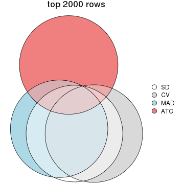</p>

</div>
<div id='tab-top-rows-overlap-by-euler-3'>
<pre><code class="r">top_rows_overlap(res_list, top_n = 3000, method = &quot;euler&quot;)
</code></pre>

<p></p>

</div>
<div id='tab-top-rows-overlap-by-euler-4'>
<pre><code class="r">top_rows_overlap(res_list, top_n = 4000, method = &quot;euler&quot;)
</code></pre>

<p></p>

</div>
<div id='tab-top-rows-overlap-by-euler-5'>
<pre><code class="r">top_rows_overlap(res_list, top_n = 5000, method = &quot;euler&quot;)
</code></pre>

<p></p>

</div>
</div>

Also visualize the correspondance of rankings between different top-row methods:


<script>
$( function() {
	$( '#tabs-top-rows-overlap-by-correspondance' ).tabs();
} );
</script>
<div id='tabs-top-rows-overlap-by-correspondance'>
<ul>
<li><a href='#tab-top-rows-overlap-by-correspondance-1'>top_n = 1000</a></li>
<li><a href='#tab-top-rows-overlap-by-correspondance-2'>top_n = 2000</a></li>
<li><a href='#tab-top-rows-overlap-by-correspondance-3'>top_n = 3000</a></li>
<li><a href='#tab-top-rows-overlap-by-correspondance-4'>top_n = 4000</a></li>
<li><a href='#tab-top-rows-overlap-by-correspondance-5'>top_n = 5000</a></li>
</ul>
<div id='tab-top-rows-overlap-by-correspondance-1'>
<pre><code class="r">top_rows_overlap(res_list, top_n = 1000, method = &quot;correspondance&quot;)
</code></pre>

<p></p>

</div>
<div id='tab-top-rows-overlap-by-correspondance-2'>
<pre><code class="r">top_rows_overlap(res_list, top_n = 2000, method = &quot;correspondance&quot;)
</code></pre>

<p></p>

</div>
<div id='tab-top-rows-overlap-by-correspondance-3'>
<pre><code class="r">top_rows_overlap(res_list, top_n = 3000, method = &quot;correspondance&quot;)
</code></pre>

<p></p>

</div>
<div id='tab-top-rows-overlap-by-correspondance-4'>
<pre><code class="r">top_rows_overlap(res_list, top_n = 4000, method = &quot;correspondance&quot;)
</code></pre>

<p></p>

</div>
<div id='tab-top-rows-overlap-by-correspondance-5'>
<pre><code class="r">top_rows_overlap(res_list, top_n = 5000, method = &quot;correspondance&quot;)
</code></pre>

<p></p>

</div>
</div>


Heatmaps of the top rows:


<script>
$( function() {
	$( '#tabs-top-rows-heatmap' ).tabs();
} );
</script>
<div id='tabs-top-rows-heatmap'>
<ul>
<li><a href='#tab-top-rows-heatmap-1'>top_n = 1000</a></li>
<li><a href='#tab-top-rows-heatmap-2'>top_n = 2000</a></li>
<li><a href='#tab-top-rows-heatmap-3'>top_n = 3000</a></li>
<li><a href='#tab-top-rows-heatmap-4'>top_n = 4000</a></li>
<li><a href='#tab-top-rows-heatmap-5'>top_n = 5000</a></li>
</ul>
<div id='tab-top-rows-heatmap-1'>
<pre><code class="r">top_rows_heatmap(res_list, top_n = 1000)
</code></pre>

<p></p>

</div>
<div id='tab-top-rows-heatmap-2'>
<pre><code class="r">top_rows_heatmap(res_list, top_n = 2000)
</code></pre>

<p></p>

</div>
<div id='tab-top-rows-heatmap-3'>
<pre><code class="r">top_rows_heatmap(res_list, top_n = 3000)
</code></pre>

<p></p>

</div>
<div id='tab-top-rows-heatmap-4'>
<pre><code class="r">top_rows_heatmap(res_list, top_n = 4000)
</code></pre>

<p></p>

</div>
<div id='tab-top-rows-heatmap-5'>
<pre><code class="r">top_rows_heatmap(res_list, top_n = 5000)
</code></pre>

<p></p>

</div>
</div>


### Test to known annotations


Test correlation between subgroups and known annotations. If the known
annotation is numeric, one-way ANOVA test is applied, and if the known
annotation is discrete, chi-squared contingency table test is applied.


<script>
$( function() {
	$( '#tabs-test-to-known-factors-from-consensus-partition-list' ).tabs();
} );
</script>
<div id='tabs-test-to-known-factors-from-consensus-partition-list'>
<ul>
<li><a href='#tab-test-to-known-factors-from-consensus-partition-list-1'>k = 2</a></li>
<li><a href='#tab-test-to-known-factors-from-consensus-partition-list-2'>k = 3</a></li>
<li><a href='#tab-test-to-known-factors-from-consensus-partition-list-3'>k = 4</a></li>
<li><a href='#tab-test-to-known-factors-from-consensus-partition-list-4'>k = 5</a></li>
<li><a href='#tab-test-to-known-factors-from-consensus-partition-list-5'>k = 6</a></li>
</ul>
<div id='tab-test-to-known-factors-from-consensus-partition-list-1'>
<pre><code class="r">test_to_known_factors(res_list, k = 2)
</code></pre>

<pre><code>#&gt;              n disease.state(p) specimen(p) individual(p) k
#&gt; SD:NMF      81         9.58e-05    1.96e-17         1.000 2
#&gt; CV:NMF      81         9.58e-05    1.96e-17         1.000 2
#&gt; MAD:NMF     82         3.35e-04    8.50e-17         0.999 2
#&gt; ATC:NMF     80         1.97e-04    1.23e-15         0.997 2
#&gt; SD:skmeans  81         2.72e-04    1.85e-17         1.000 2
#&gt; CV:skmeans  82         2.14e-04    1.11e-17         1.000 2
#&gt; MAD:skmeans 81         2.72e-04    1.85e-17         1.000 2
#&gt; ATC:skmeans 81         1.71e-04    1.32e-16         0.998 2
#&gt; SD:mclust   80         1.70e-04    2.43e-16         0.998 2
#&gt; CV:mclust   82         6.57e-05    1.20e-17         1.000 2
#&gt; MAD:mclust  81         8.44e-05    2.00e-17         0.999 2
#&gt; ATC:mclust  82         1.61e-04    5.58e-16         0.998 2
#&gt; SD:kmeans   82         1.04e-04    8.49e-17         0.999 2
#&gt; CV:kmeans   81         8.44e-05    2.00e-17         0.999 2
#&gt; MAD:kmeans  82         3.35e-04    8.50e-17         0.999 2
#&gt; ATC:kmeans  82         2.14e-04    5.97e-16         0.998 2
#&gt; SD:pam      80         1.22e-04    3.27e-17         0.999 2
#&gt; CV:pam      82         3.35e-04    8.50e-17         0.999 2
#&gt; MAD:pam     82         3.35e-04    8.50e-17         0.999 2
#&gt; ATC:pam     80         3.09e-04    2.07e-16         0.999 2
#&gt; SD:hclust   82         5.16e-04    5.99e-16         0.999 2
#&gt; CV:hclust   75         1.05e-04    3.63e-16         0.990 2
#&gt; MAD:hclust  82         5.16e-04    5.99e-16         0.999 2
#&gt; ATC:hclust  78         1.26e-04    8.92e-17         0.998 2
</code></pre>

</div>
<div id='tab-test-to-known-factors-from-consensus-partition-list-2'>
<pre><code class="r">test_to_known_factors(res_list, k = 3)
</code></pre>

<pre><code>#&gt;              n disease.state(p) specimen(p) individual(p) k
#&gt; SD:NMF      79         1.70e-06    8.58e-19         0.949 3
#&gt; CV:NMF      79         1.70e-06    8.58e-19         0.949 3
#&gt; MAD:NMF     82         6.72e-05    1.37e-16         0.972 3
#&gt; ATC:NMF     77         9.19e-04    1.50e-13         0.876 3
#&gt; SD:skmeans  78         1.16e-05    1.11e-16         0.943 3
#&gt; CV:skmeans  80         1.78e-05    2.20e-17         0.962 3
#&gt; MAD:skmeans 80         1.82e-05    1.33e-16         0.949 3
#&gt; ATC:skmeans 73         2.36e-04    2.01e-14         0.946 3
#&gt; SD:mclust   76         2.22e-12    1.36e-25         0.861 3
#&gt; CV:mclust   80         4.65e-15    1.09e-29         0.814 3
#&gt; MAD:mclust  78         1.07e-14    9.35e-28         0.743 3
#&gt; ATC:mclust  74         2.00e-03    1.61e-14         0.767 3
#&gt; SD:kmeans   79         1.32e-05    4.98e-16         0.894 3
#&gt; CV:kmeans   77         1.29e-06    2.39e-16         0.830 3
#&gt; MAD:kmeans  79         2.72e-05    6.42e-16         0.913 3
#&gt; ATC:kmeans  81         2.50e-04    2.61e-13         0.911 3
#&gt; SD:pam      72         3.33e-06    5.09e-15         0.850 3
#&gt; CV:pam      81         3.32e-04    3.66e-14         0.900 3
#&gt; MAD:pam     82         2.82e-04    2.77e-14         0.900 3
#&gt; ATC:pam     81         4.50e-05    2.60e-13         0.909 3
#&gt; SD:hclust   82         3.40e-04    7.97e-15         0.897 3
#&gt; CV:hclust   82         3.40e-04    7.97e-15         0.897 3
#&gt; MAD:hclust  71         3.87e-05    2.98e-14         0.842 3
#&gt; ATC:hclust  69         1.91e-04    1.74e-13         0.876 3
</code></pre>

</div>
<div id='tab-test-to-known-factors-from-consensus-partition-list-3'>
<pre><code class="r">test_to_known_factors(res_list, k = 4)
</code></pre>

<pre><code>#&gt;              n disease.state(p) specimen(p) individual(p) k
#&gt; SD:NMF      77         9.48e-14    1.61e-25         0.852 4
#&gt; CV:NMF      78         6.13e-14    1.15e-26         0.845 4
#&gt; MAD:NMF     74         2.92e-13    2.10e-24         0.865 4
#&gt; ATC:NMF     80         6.06e-05    9.14e-16         0.626 4
#&gt; SD:skmeans  81         5.54e-14    7.14e-26         0.701 4
#&gt; CV:skmeans  82         3.61e-14    2.63e-26         0.704 4
#&gt; MAD:skmeans 78         6.21e-12    6.60e-25         0.784 4
#&gt; ATC:skmeans 78         5.67e-04    1.54e-14         0.699 4
#&gt; SD:mclust   78         8.10e-12    3.39e-23         0.928 4
#&gt; CV:mclust   82         8.45e-15    1.99e-27         0.909 4
#&gt; MAD:mclust  81         1.12e-11    1.84e-23         0.943 4
#&gt; ATC:mclust  81         2.15e-04    1.09e-14         0.489 4
#&gt; SD:kmeans   57         2.64e-03    1.86e-13         0.974 4
#&gt; CV:kmeans   64         5.58e-08    1.08e-18         0.916 4
#&gt; MAD:kmeans  72         2.73e-04    1.45e-14         0.891 4
#&gt; ATC:kmeans  72         4.16e-04    1.57e-13         0.842 4
#&gt; SD:pam      62         4.24e-06    2.20e-16         0.472 4
#&gt; CV:pam      71         1.33e-09    2.24e-20         0.511 4
#&gt; MAD:pam     75         1.03e-03    3.20e-14         0.931 4
#&gt; ATC:pam     81         1.96e-04    7.74e-14         0.864 4
#&gt; SD:hclust   81         4.53e-04    6.01e-14         0.712 4
#&gt; CV:hclust   72         1.98e-04    9.06e-14         0.367 4
#&gt; MAD:hclust  72         3.28e-05    1.26e-14         0.854 4
#&gt; ATC:hclust  62         2.57e-04    3.33e-11         0.693 4
</code></pre>

</div>
<div id='tab-test-to-known-factors-from-consensus-partition-list-4'>
<pre><code class="r">test_to_known_factors(res_list, k = 5)
</code></pre>

<pre><code>#&gt;              n disease.state(p) specimen(p) individual(p) k
#&gt; SD:NMF      68         4.20e-12    9.80e-23         0.707 5
#&gt; CV:NMF      64         4.36e-11    1.05e-21         0.703 5
#&gt; MAD:NMF     77         2.43e-11    1.72e-21         0.289 5
#&gt; ATC:NMF     77         1.10e-08    3.37e-19         0.349 5
#&gt; SD:skmeans  77         3.08e-13    2.12e-26         0.826 5
#&gt; CV:skmeans  59         3.59e-02    5.23e-13         0.987 5
#&gt; MAD:skmeans 63         2.17e-10    4.60e-21         0.686 5
#&gt; ATC:skmeans 78         3.10e-06    1.21e-16         0.417 5
#&gt; SD:mclust   74         8.45e-11    2.18e-22         0.639 5
#&gt; CV:mclust   79         1.44e-13    1.13e-26         0.861 5
#&gt; MAD:mclust  70         2.64e-12    3.15e-24         0.750 5
#&gt; ATC:mclust  72         2.25e-03    1.43e-11         0.617 5
#&gt; SD:kmeans   59         3.52e-08    2.11e-17         0.551 5
#&gt; CV:kmeans   57         6.10e-09    6.12e-18         0.567 5
#&gt; MAD:kmeans  55         1.51e-05    1.01e-12         0.459 5
#&gt; ATC:kmeans  74         8.49e-04    1.26e-12         0.683 5
#&gt; SD:pam      68         1.60e-10    2.74e-21         0.794 5
#&gt; CV:pam      75         1.17e-11    7.57e-23         0.708 5
#&gt; MAD:pam     77         2.51e-10    2.68e-22         0.806 5
#&gt; ATC:pam     77         1.12e-03    1.01e-12         0.908 5
#&gt; SD:hclust   80         4.70e-05    1.58e-14         0.298 5
#&gt; CV:hclust   75         2.64e-07    3.46e-17         0.419 5
#&gt; MAD:hclust  52         6.36e-06    1.81e-10         0.467 5
#&gt; ATC:hclust  57         8.86e-04    1.64e-10         0.395 5
</code></pre>

</div>
<div id='tab-test-to-known-factors-from-consensus-partition-list-5'>
<pre><code class="r">test_to_known_factors(res_list, k = 6)
</code></pre>

<pre><code>#&gt;              n disease.state(p) specimen(p) individual(p) k
#&gt; SD:NMF      66         1.17e-09    6.05e-19        0.6485 6
#&gt; CV:NMF      70         1.39e-09    4.58e-18        0.1899 6
#&gt; MAD:NMF     59         1.20e-09    8.26e-18        0.3196 6
#&gt; ATC:NMF     75         1.04e-08    9.09e-19        0.4446 6
#&gt; SD:skmeans  79         5.83e-12    2.88e-23        0.6031 6
#&gt; CV:skmeans  78         1.07e-11    1.12e-23        0.6041 6
#&gt; MAD:skmeans 71         2.80e-10    6.74e-21        0.5731 6
#&gt; ATC:skmeans 74         1.18e-06    4.55e-16        0.4798 6
#&gt; SD:mclust   65         1.40e-10    1.71e-20        0.2771 6
#&gt; CV:mclust   79         1.34e-13    1.17e-26        0.8909 6
#&gt; MAD:mclust  71         1.83e-11    2.55e-22        0.5077 6
#&gt; ATC:mclust  77         2.35e-04    1.52e-13        0.5034 6
#&gt; SD:kmeans   65         7.66e-11    8.85e-21        0.4241 6
#&gt; CV:kmeans   72         7.05e-11    6.46e-22        0.4239 6
#&gt; MAD:kmeans  69         4.00e-10    2.31e-20        0.5203 6
#&gt; ATC:kmeans  68         7.37e-04    3.37e-10        0.3406 6
#&gt; SD:pam      71         1.55e-10    3.32e-21        0.5303 6
#&gt; CV:pam      76         3.08e-11    5.95e-23        0.4254 6
#&gt; MAD:pam     71         8.03e-10    1.83e-20        0.4857 6
#&gt; ATC:pam     73         2.11e-03    2.34e-12        0.6580 6
#&gt; SD:hclust   72         4.38e-07    8.74e-16        0.1370 6
#&gt; CV:hclust   76         8.55e-08    2.75e-17        0.0682 6
#&gt; MAD:hclust  72         4.70e-06    4.66e-15        0.3679 6
#&gt; ATC:hclust  67         8.40e-04    3.20e-11        0.9687 6
</code></pre>

</div>
</div>


 
## Results for each method


---------------------------------------------------


### SD:hclust


The object with results only for a single top-value method and a single partition method 
can be extracted as:

```r
res = res_list["SD", "hclust"]
# you can also extract it by
# res = res_list["SD:hclust"]
```

A summary of `res` and all the functions that can be applied to it:

```r
res
```

```
#> A 'ConsensusPartition' object with k = 2, 3, 4, 5, 6.
#>   On a matrix with 51941 rows and 82 columns.
#>   Top rows (1000, 2000, 3000, 4000, 5000) are extracted by 'SD' method.
#>   Subgroups are detected by 'hclust' method.
#>   Performed in total 1250 partitions by row resampling.
#>   Best k for subgroups seems to be 3.
#> 
#> Following methods can be applied to this 'ConsensusPartition' object:
#>  [1] "cola_report"             "collect_classes"         "collect_plots"          
#>  [4] "collect_stats"           "colnames"                "compare_signatures"     
#>  [7] "consensus_heatmap"       "dimension_reduction"     "functional_enrichment"  
#> [10] "get_anno_col"            "get_anno"                "get_classes"            
#> [13] "get_consensus"           "get_matrix"              "get_membership"         
#> [16] "get_param"               "get_signatures"          "get_stats"              
#> [19] "is_best_k"               "is_stable_k"             "membership_heatmap"     
#> [22] "ncol"                    "nrow"                    "plot_ecdf"              
#> [25] "rownames"                "select_partition_number" "show"                   
#> [28] "suggest_best_k"          "test_to_known_factors"
```

`collect_plots()` function collects all the plots made from `res` for all `k` (number of partitions)
into one single page to provide an easy and fast comparison between different `k`.

```r
collect_plots(res)
```


The plots are:

- The first row: a plot of the ECDF (Empirical cumulative distribution
  function) curves of the consensus matrix for each `k` and the heatmap of
  predicted classes for each `k`.
- The second row: heatmaps of the consensus matrix for each `k`.
- The third row: heatmaps of the membership matrix for each `k`.
- The fouth row: heatmaps of the signatures for each `k`.

All the plots in panels can be made by individual functions and they are
plotted later in this section.

`select_partition_number()` produces several plots showing different
statistics for choosing "optimized" `k`. There are following statistics:

- ECDF curves of the consensus matrix for each `k`;
- 1-PAC. [The PAC
  score](https://en.wikipedia.org/wiki/Consensus_clustering#Over-interpretation_potential_of_consensus_clustering)
  measures the proportion of the ambiguous subgrouping.
- Mean silhouette score.
- Concordance. The mean probability of fiting the consensus class ids in all
  partitions.
- Area increased. Denote $A_k$ as the area under the ECDF curve for current
  `k`, the area increased is defined as $A_k - A_{k-1}$.
- Rand index. The percent of pairs of samples that are both in a same cluster
  or both are not in a same cluster in the partition of k and k-1.
- Jaccard index. The ratio of pairs of samples are both in a same cluster in
  the partition of k and k-1 and the pairs of samples are both in a same
  cluster in the partition k or k-1.

The detailed explanations of these statistics can be found in [the cola
vignette](http://bioconductor.org/packages/devel/bioc/vignettes/cola/inst/doc/cola.html#toc_13).

Generally speaking, lower PAC score, higher mean silhouette score or higher
concordance corresponds to better partition. Rand index and Jaccard index
measure how similar the current partition is compared to partition with `k-1`.
If they are too similar, we won't accept `k` is better than `k-1`.

```r
select_partition_number(res)
```


The numeric values for all these statistics can be obtained by `get_stats()`.

```r
get_stats(res)
```

```
#>   k 1-PAC mean_silhouette concordance area_increased  Rand Jaccard
#> 2 2 0.561           0.837       0.899         0.4702 0.518   0.518
#> 3 3 0.857           0.936       0.953         0.4011 0.813   0.639
#> 4 4 0.803           0.844       0.900         0.0690 0.982   0.945
#> 5 5 0.784           0.778       0.853         0.0537 0.978   0.930
#> 6 6 0.793           0.686       0.835         0.0357 0.958   0.856
```

`suggest_best_k()` suggests the best $k$ based on these statistics. The rules are as follows:

- All $k$ with Jaccard index larger than 0.95 are removed because the increase of
  the partition number does not provides enough extra information. If all $k$ are removed,
  the best $k$ is assigned by `NA`.
- For $k$ with 1-PAC larger than 0.9, the maximal $k$ is taken as the "best k". Other $k$ is called "optional k".
- If it does not fit the second rule. The $k$ with the highest vote of highest
  1-PAC, mean silhouette and concordance is taken as the "best k".

```r
suggest_best_k(res)
```

```
#> [1] 3
```


Following shows the table of the partitions (You need to click the **show/hide
code output** link to see it). The membership matrix (columns with name `p*`)
is inferred by
[`clue::cl_consensus()`](https://www.rdocumentation.org/link/cl_consensus?package=clue)
function with the `SE` method. Basically the value in the membership matrix
represents the probability to belong to a certain group. The finall class
label for an item is determined with the group with highest probability it
belongs to.

In `get_classes()` function, the entropy is calculated from the membership
matrix and the silhouette score is calculated from the consensus matrix.


<script>
$( function() {
	$( '#tabs-SD-hclust-get-classes' ).tabs();
} );
</script>
<div id='tabs-SD-hclust-get-classes'>
<ul>
<li><a href='#tab-SD-hclust-get-classes-1'>k = 2</a></li>
<li><a href='#tab-SD-hclust-get-classes-2'>k = 3</a></li>
<li><a href='#tab-SD-hclust-get-classes-3'>k = 4</a></li>
<li><a href='#tab-SD-hclust-get-classes-4'>k = 5</a></li>
<li><a href='#tab-SD-hclust-get-classes-5'>k = 6</a></li>
</ul>

<div id='tab-SD-hclust-get-classes-1'>
<p><a id='tab-SD-hclust-get-classes-1-a' style='color:#0366d6' href='#'>show/hide code output</a></p>
<pre><code class="r">cbind(get_classes(res, k = 2), get_membership(res, k = 2))
</code></pre>

<pre><code>#&gt;           class entropy silhouette    p1    p2
#&gt; GSM372286     2  0.0000      0.817 0.000 1.000
#&gt; GSM372287     2  0.0000      0.817 0.000 1.000
#&gt; GSM372288     2  0.0000      0.817 0.000 1.000
#&gt; GSM372289     2  0.0000      0.817 0.000 1.000
#&gt; GSM372290     2  0.0000      0.817 0.000 1.000
#&gt; GSM372291     1  0.7950      0.577 0.760 0.240
#&gt; GSM372292     2  0.8555      0.731 0.280 0.720
#&gt; GSM372293     2  0.8861      0.720 0.304 0.696
#&gt; GSM372294     2  0.0000      0.817 0.000 1.000
#&gt; GSM372295     2  0.8861      0.719 0.304 0.696
#&gt; GSM372296     2  0.0000      0.817 0.000 1.000
#&gt; GSM372297     2  0.0000      0.817 0.000 1.000
#&gt; GSM372298     2  0.0000      0.817 0.000 1.000
#&gt; GSM372299     2  0.8861      0.719 0.304 0.696
#&gt; GSM372300     2  0.8861      0.720 0.304 0.696
#&gt; GSM372301     2  0.8555      0.731 0.280 0.720
#&gt; GSM372302     2  0.0000      0.817 0.000 1.000
#&gt; GSM372303     2  0.8861      0.720 0.304 0.696
#&gt; GSM372304     2  0.0000      0.817 0.000 1.000
#&gt; GSM372305     2  0.0000      0.817 0.000 1.000
#&gt; GSM372306     2  0.0000      0.817 0.000 1.000
#&gt; GSM372307     2  0.0000      0.817 0.000 1.000
#&gt; GSM372309     2  0.0000      0.817 0.000 1.000
#&gt; GSM372311     2  0.0000      0.817 0.000 1.000
#&gt; GSM372313     2  0.0000      0.817 0.000 1.000
#&gt; GSM372315     2  0.0000      0.817 0.000 1.000
#&gt; GSM372317     2  0.0000      0.817 0.000 1.000
#&gt; GSM372319     2  0.9248      0.692 0.340 0.660
#&gt; GSM372321     2  0.9248      0.692 0.340 0.660
#&gt; GSM372323     2  0.9393      0.677 0.356 0.644
#&gt; GSM372326     2  0.9248      0.692 0.340 0.660
#&gt; GSM372328     2  0.9393      0.677 0.356 0.644
#&gt; GSM372330     2  0.0000      0.817 0.000 1.000
#&gt; GSM372332     2  0.9393      0.677 0.356 0.644
#&gt; GSM372335     2  0.0376      0.816 0.004 0.996
#&gt; GSM372337     2  0.9393      0.677 0.356 0.644
#&gt; GSM372339     2  0.9393      0.677 0.356 0.644
#&gt; GSM372341     2  0.9393      0.677 0.356 0.644
#&gt; GSM372343     2  0.9393      0.677 0.356 0.644
#&gt; GSM372345     2  0.9393      0.677 0.356 0.644
#&gt; GSM372347     2  0.9393      0.677 0.356 0.644
#&gt; GSM372349     2  0.9393      0.677 0.356 0.644
#&gt; GSM372351     2  0.9248      0.692 0.340 0.660
#&gt; GSM372353     2  0.0376      0.816 0.004 0.996
#&gt; GSM372355     2  0.0000      0.817 0.000 1.000
#&gt; GSM372357     2  0.0000      0.817 0.000 1.000
#&gt; GSM372359     2  0.0376      0.816 0.004 0.996
#&gt; GSM372361     2  0.0000      0.817 0.000 1.000
#&gt; GSM372363     2  0.0000      0.817 0.000 1.000
#&gt; GSM372308     1  0.0672      0.974 0.992 0.008
#&gt; GSM372310     1  0.0672      0.974 0.992 0.008
#&gt; GSM372312     1  0.4690      0.857 0.900 0.100
#&gt; GSM372314     1  0.0672      0.974 0.992 0.008
#&gt; GSM372316     1  0.0000      0.980 1.000 0.000
#&gt; GSM372318     1  0.0000      0.980 1.000 0.000
#&gt; GSM372320     1  0.0000      0.980 1.000 0.000
#&gt; GSM372322     1  0.0000      0.980 1.000 0.000
#&gt; GSM372324     1  0.0672      0.974 0.992 0.008
#&gt; GSM372325     1  0.0672      0.974 0.992 0.008
#&gt; GSM372327     1  0.0000      0.980 1.000 0.000
#&gt; GSM372329     1  0.0000      0.980 1.000 0.000
#&gt; GSM372331     1  0.0672      0.974 0.992 0.008
#&gt; GSM372333     2  0.9635      0.623 0.388 0.612
#&gt; GSM372334     1  0.0000      0.980 1.000 0.000
#&gt; GSM372336     1  0.0000      0.980 1.000 0.000
#&gt; GSM372338     1  0.0000      0.980 1.000 0.000
#&gt; GSM372340     1  0.0000      0.980 1.000 0.000
#&gt; GSM372342     1  0.0000      0.980 1.000 0.000
#&gt; GSM372344     1  0.0000      0.980 1.000 0.000
#&gt; GSM372346     1  0.0000      0.980 1.000 0.000
#&gt; GSM372348     1  0.0000      0.980 1.000 0.000
#&gt; GSM372350     1  0.4690      0.857 0.900 0.100
#&gt; GSM372352     2  0.9393      0.677 0.356 0.644
#&gt; GSM372354     1  0.0000      0.980 1.000 0.000
#&gt; GSM372356     1  0.0000      0.980 1.000 0.000
#&gt; GSM372358     1  0.0000      0.980 1.000 0.000
#&gt; GSM372360     1  0.0000      0.980 1.000 0.000
#&gt; GSM372362     1  0.0000      0.980 1.000 0.000
#&gt; GSM372364     1  0.0000      0.980 1.000 0.000
#&gt; GSM372365     1  0.0000      0.980 1.000 0.000
#&gt; GSM372366     1  0.0000      0.980 1.000 0.000
#&gt; GSM372367     1  0.0000      0.980 1.000 0.000
</code></pre>

<script>
$('#tab-SD-hclust-get-classes-1-a').parent().next().next().hide();
$('#tab-SD-hclust-get-classes-1-a').click(function(){
  $('#tab-SD-hclust-get-classes-1-a').parent().next().next().toggle();
  return(false);
});
</script>
</div>

<div id='tab-SD-hclust-get-classes-2'>
<p><a id='tab-SD-hclust-get-classes-2-a' style='color:#0366d6' href='#'>show/hide code output</a></p>
<pre><code class="r">cbind(get_classes(res, k = 3), get_membership(res, k = 3))
</code></pre>

<pre><code>#&gt;           class entropy silhouette    p1    p2    p3
#&gt; GSM372286     2  0.2165      0.954 0.000 0.936 0.064
#&gt; GSM372287     2  0.0892      0.929 0.000 0.980 0.020
#&gt; GSM372288     2  0.0000      0.926 0.000 1.000 0.000
#&gt; GSM372289     2  0.0000      0.926 0.000 1.000 0.000
#&gt; GSM372290     2  0.1289      0.947 0.000 0.968 0.032
#&gt; GSM372291     1  0.5016      0.695 0.760 0.000 0.240
#&gt; GSM372292     3  0.4842      0.758 0.000 0.224 0.776
#&gt; GSM372293     3  0.3272      0.880 0.004 0.104 0.892
#&gt; GSM372294     2  0.3116      0.916 0.000 0.892 0.108
#&gt; GSM372295     3  0.5178      0.691 0.000 0.256 0.744
#&gt; GSM372296     2  0.1529      0.948 0.000 0.960 0.040
#&gt; GSM372297     2  0.1289      0.926 0.000 0.968 0.032
#&gt; GSM372298     2  0.1031      0.931 0.000 0.976 0.024
#&gt; GSM372299     3  0.5178      0.691 0.000 0.256 0.744
#&gt; GSM372300     3  0.3272      0.880 0.004 0.104 0.892
#&gt; GSM372301     3  0.4842      0.758 0.000 0.224 0.776
#&gt; GSM372302     2  0.1529      0.948 0.000 0.960 0.040
#&gt; GSM372303     3  0.3272      0.880 0.004 0.104 0.892
#&gt; GSM372304     2  0.1289      0.926 0.000 0.968 0.032
#&gt; GSM372305     2  0.2796      0.953 0.000 0.908 0.092
#&gt; GSM372306     2  0.2796      0.953 0.000 0.908 0.092
#&gt; GSM372307     2  0.1643      0.951 0.000 0.956 0.044
#&gt; GSM372309     2  0.2878      0.952 0.000 0.904 0.096
#&gt; GSM372311     2  0.2711      0.955 0.000 0.912 0.088
#&gt; GSM372313     2  0.2711      0.955 0.000 0.912 0.088
#&gt; GSM372315     2  0.2711      0.955 0.000 0.912 0.088
#&gt; GSM372317     2  0.2878      0.951 0.000 0.904 0.096
#&gt; GSM372319     3  0.1411      0.920 0.000 0.036 0.964
#&gt; GSM372321     3  0.1411      0.920 0.000 0.036 0.964
#&gt; GSM372323     3  0.1015      0.926 0.012 0.008 0.980
#&gt; GSM372326     3  0.1163      0.922 0.000 0.028 0.972
#&gt; GSM372328     3  0.0237      0.924 0.004 0.000 0.996
#&gt; GSM372330     2  0.2711      0.955 0.000 0.912 0.088
#&gt; GSM372332     3  0.0237      0.924 0.004 0.000 0.996
#&gt; GSM372335     2  0.3116      0.943 0.000 0.892 0.108
#&gt; GSM372337     3  0.1015      0.926 0.012 0.008 0.980
#&gt; GSM372339     3  0.0237      0.924 0.004 0.000 0.996
#&gt; GSM372341     3  0.0237      0.924 0.004 0.000 0.996
#&gt; GSM372343     3  0.0237      0.924 0.004 0.000 0.996
#&gt; GSM372345     3  0.1015      0.926 0.012 0.008 0.980
#&gt; GSM372347     3  0.1015      0.926 0.012 0.008 0.980
#&gt; GSM372349     3  0.0829      0.925 0.012 0.004 0.984
#&gt; GSM372351     3  0.1163      0.922 0.000 0.028 0.972
#&gt; GSM372353     2  0.3267      0.936 0.000 0.884 0.116
#&gt; GSM372355     2  0.2711      0.955 0.000 0.912 0.088
#&gt; GSM372357     2  0.2711      0.955 0.000 0.912 0.088
#&gt; GSM372359     2  0.3267      0.936 0.000 0.884 0.116
#&gt; GSM372361     2  0.1964      0.953 0.000 0.944 0.056
#&gt; GSM372363     2  0.2066      0.954 0.000 0.940 0.060
#&gt; GSM372308     1  0.0424      0.979 0.992 0.000 0.008
#&gt; GSM372310     1  0.0424      0.979 0.992 0.000 0.008
#&gt; GSM372312     1  0.2959      0.889 0.900 0.000 0.100
#&gt; GSM372314     1  0.0424      0.979 0.992 0.000 0.008
#&gt; GSM372316     1  0.0000      0.984 1.000 0.000 0.000
#&gt; GSM372318     1  0.0000      0.984 1.000 0.000 0.000
#&gt; GSM372320     1  0.0000      0.984 1.000 0.000 0.000
#&gt; GSM372322     1  0.0000      0.984 1.000 0.000 0.000
#&gt; GSM372324     1  0.0424      0.979 0.992 0.000 0.008
#&gt; GSM372325     1  0.0424      0.979 0.992 0.000 0.008
#&gt; GSM372327     1  0.0000      0.984 1.000 0.000 0.000
#&gt; GSM372329     1  0.0000      0.984 1.000 0.000 0.000
#&gt; GSM372331     1  0.0424      0.979 0.992 0.000 0.008
#&gt; GSM372333     3  0.2280      0.899 0.052 0.008 0.940
#&gt; GSM372334     1  0.0000      0.984 1.000 0.000 0.000
#&gt; GSM372336     1  0.0000      0.984 1.000 0.000 0.000
#&gt; GSM372338     1  0.0000      0.984 1.000 0.000 0.000
#&gt; GSM372340     1  0.0000      0.984 1.000 0.000 0.000
#&gt; GSM372342     1  0.0000      0.984 1.000 0.000 0.000
#&gt; GSM372344     1  0.0000      0.984 1.000 0.000 0.000
#&gt; GSM372346     1  0.0000      0.984 1.000 0.000 0.000
#&gt; GSM372348     1  0.0000      0.984 1.000 0.000 0.000
#&gt; GSM372350     1  0.2959      0.889 0.900 0.000 0.100
#&gt; GSM372352     3  0.1015      0.926 0.012 0.008 0.980
#&gt; GSM372354     1  0.0000      0.984 1.000 0.000 0.000
#&gt; GSM372356     1  0.0000      0.984 1.000 0.000 0.000
#&gt; GSM372358     1  0.0000      0.984 1.000 0.000 0.000
#&gt; GSM372360     1  0.0000      0.984 1.000 0.000 0.000
#&gt; GSM372362     1  0.0000      0.984 1.000 0.000 0.000
#&gt; GSM372364     1  0.0000      0.984 1.000 0.000 0.000
#&gt; GSM372365     1  0.0000      0.984 1.000 0.000 0.000
#&gt; GSM372366     1  0.0000      0.984 1.000 0.000 0.000
#&gt; GSM372367     1  0.0000      0.984 1.000 0.000 0.000
</code></pre>

<script>
$('#tab-SD-hclust-get-classes-2-a').parent().next().next().hide();
$('#tab-SD-hclust-get-classes-2-a').click(function(){
  $('#tab-SD-hclust-get-classes-2-a').parent().next().next().toggle();
  return(false);
});
</script>
</div>

<div id='tab-SD-hclust-get-classes-3'>
<p><a id='tab-SD-hclust-get-classes-3-a' style='color:#0366d6' href='#'>show/hide code output</a></p>
<pre><code class="r">cbind(get_classes(res, k = 4), get_membership(res, k = 4))
</code></pre>

<pre><code>#&gt;           class entropy silhouette    p1    p2    p3    p4
#&gt; GSM372286     2  0.3342      0.902 0.000 0.868 0.032 0.100
#&gt; GSM372287     2  0.3444      0.865 0.000 0.816 0.000 0.184
#&gt; GSM372288     2  0.3123      0.874 0.000 0.844 0.000 0.156
#&gt; GSM372289     2  0.3123      0.874 0.000 0.844 0.000 0.156
#&gt; GSM372290     2  0.3495      0.890 0.000 0.844 0.016 0.140
#&gt; GSM372291     4  0.6214      0.756 0.360 0.000 0.064 0.576
#&gt; GSM372292     3  0.5674      0.742 0.000 0.132 0.720 0.148
#&gt; GSM372293     3  0.3547      0.838 0.000 0.016 0.840 0.144
#&gt; GSM372294     2  0.4422      0.834 0.000 0.736 0.008 0.256
#&gt; GSM372295     3  0.6414      0.649 0.000 0.124 0.636 0.240
#&gt; GSM372296     2  0.4175      0.865 0.000 0.784 0.016 0.200
#&gt; GSM372297     2  0.4072      0.822 0.000 0.748 0.000 0.252
#&gt; GSM372298     2  0.4040      0.824 0.000 0.752 0.000 0.248
#&gt; GSM372299     3  0.6414      0.649 0.000 0.124 0.636 0.240
#&gt; GSM372300     3  0.3547      0.838 0.000 0.016 0.840 0.144
#&gt; GSM372301     3  0.5674      0.742 0.000 0.132 0.720 0.148
#&gt; GSM372302     2  0.4175      0.865 0.000 0.784 0.016 0.200
#&gt; GSM372303     3  0.3547      0.838 0.000 0.016 0.840 0.144
#&gt; GSM372304     2  0.4072      0.822 0.000 0.748 0.000 0.252
#&gt; GSM372305     2  0.1389      0.901 0.000 0.952 0.048 0.000
#&gt; GSM372306     2  0.1389      0.901 0.000 0.952 0.048 0.000
#&gt; GSM372307     2  0.3278      0.896 0.000 0.864 0.020 0.116
#&gt; GSM372309     2  0.3088      0.903 0.000 0.888 0.052 0.060
#&gt; GSM372311     2  0.1302      0.903 0.000 0.956 0.044 0.000
#&gt; GSM372313     2  0.1302      0.903 0.000 0.956 0.044 0.000
#&gt; GSM372315     2  0.1302      0.903 0.000 0.956 0.044 0.000
#&gt; GSM372317     2  0.1474      0.900 0.000 0.948 0.052 0.000
#&gt; GSM372319     3  0.1637      0.893 0.000 0.060 0.940 0.000
#&gt; GSM372321     3  0.1637      0.893 0.000 0.060 0.940 0.000
#&gt; GSM372323     3  0.1151      0.902 0.008 0.024 0.968 0.000
#&gt; GSM372326     3  0.1474      0.895 0.000 0.052 0.948 0.000
#&gt; GSM372328     3  0.0000      0.899 0.000 0.000 1.000 0.000
#&gt; GSM372330     2  0.1302      0.903 0.000 0.956 0.044 0.000
#&gt; GSM372332     3  0.0000      0.899 0.000 0.000 1.000 0.000
#&gt; GSM372335     2  0.1716      0.893 0.000 0.936 0.064 0.000
#&gt; GSM372337     3  0.1151      0.902 0.008 0.024 0.968 0.000
#&gt; GSM372339     3  0.0000      0.899 0.000 0.000 1.000 0.000
#&gt; GSM372341     3  0.0000      0.899 0.000 0.000 1.000 0.000
#&gt; GSM372343     3  0.0000      0.899 0.000 0.000 1.000 0.000
#&gt; GSM372345     3  0.1151      0.902 0.008 0.024 0.968 0.000
#&gt; GSM372347     3  0.1151      0.902 0.008 0.024 0.968 0.000
#&gt; GSM372349     3  0.1042      0.902 0.000 0.020 0.972 0.008
#&gt; GSM372351     3  0.1474      0.895 0.000 0.052 0.948 0.000
#&gt; GSM372353     2  0.1867      0.888 0.000 0.928 0.072 0.000
#&gt; GSM372355     2  0.1302      0.903 0.000 0.956 0.044 0.000
#&gt; GSM372357     2  0.1489      0.902 0.000 0.952 0.044 0.004
#&gt; GSM372359     2  0.1867      0.888 0.000 0.928 0.072 0.000
#&gt; GSM372361     2  0.3464      0.898 0.000 0.860 0.032 0.108
#&gt; GSM372363     2  0.3215      0.903 0.000 0.876 0.032 0.092
#&gt; GSM372308     1  0.3142      0.786 0.860 0.008 0.000 0.132
#&gt; GSM372310     1  0.3142      0.786 0.860 0.008 0.000 0.132
#&gt; GSM372312     1  0.5294     -0.810 0.508 0.000 0.008 0.484
#&gt; GSM372314     1  0.3351      0.767 0.844 0.008 0.000 0.148
#&gt; GSM372316     1  0.0000      0.898 1.000 0.000 0.000 0.000
#&gt; GSM372318     1  0.0000      0.898 1.000 0.000 0.000 0.000
#&gt; GSM372320     1  0.0469      0.894 0.988 0.000 0.000 0.012
#&gt; GSM372322     1  0.0188      0.898 0.996 0.000 0.000 0.004
#&gt; GSM372324     1  0.3351      0.767 0.844 0.008 0.000 0.148
#&gt; GSM372325     1  0.3351      0.767 0.844 0.008 0.000 0.148
#&gt; GSM372327     1  0.0188      0.898 0.996 0.000 0.000 0.004
#&gt; GSM372329     1  0.0188      0.898 0.996 0.000 0.000 0.004
#&gt; GSM372331     1  0.3351      0.767 0.844 0.008 0.000 0.148
#&gt; GSM372333     3  0.2418      0.880 0.032 0.024 0.928 0.016
#&gt; GSM372334     1  0.0469      0.894 0.988 0.000 0.000 0.012
#&gt; GSM372336     1  0.2216      0.835 0.908 0.000 0.000 0.092
#&gt; GSM372338     1  0.0469      0.894 0.988 0.000 0.000 0.012
#&gt; GSM372340     1  0.0469      0.894 0.988 0.000 0.000 0.012
#&gt; GSM372342     1  0.0188      0.898 0.996 0.000 0.000 0.004
#&gt; GSM372344     1  0.0469      0.894 0.988 0.000 0.000 0.012
#&gt; GSM372346     1  0.0188      0.898 0.996 0.000 0.000 0.004
#&gt; GSM372348     1  0.2216      0.835 0.908 0.000 0.000 0.092
#&gt; GSM372350     4  0.5296      0.693 0.492 0.000 0.008 0.500
#&gt; GSM372352     3  0.1191      0.902 0.004 0.024 0.968 0.004
#&gt; GSM372354     1  0.0188      0.898 0.996 0.000 0.000 0.004
#&gt; GSM372356     1  0.0188      0.899 0.996 0.000 0.000 0.004
#&gt; GSM372358     1  0.0188      0.899 0.996 0.000 0.000 0.004
#&gt; GSM372360     1  0.0336      0.898 0.992 0.000 0.000 0.008
#&gt; GSM372362     1  0.0336      0.898 0.992 0.000 0.000 0.008
#&gt; GSM372364     1  0.0336      0.898 0.992 0.000 0.000 0.008
#&gt; GSM372365     1  0.0336      0.898 0.992 0.000 0.000 0.008
#&gt; GSM372366     1  0.0000      0.898 1.000 0.000 0.000 0.000
#&gt; GSM372367     1  0.1474      0.870 0.948 0.000 0.000 0.052
</code></pre>

<script>
$('#tab-SD-hclust-get-classes-3-a').parent().next().next().hide();
$('#tab-SD-hclust-get-classes-3-a').click(function(){
  $('#tab-SD-hclust-get-classes-3-a').parent().next().next().toggle();
  return(false);
});
</script>
</div>

<div id='tab-SD-hclust-get-classes-4'>
<p><a id='tab-SD-hclust-get-classes-4-a' style='color:#0366d6' href='#'>show/hide code output</a></p>
<pre><code class="r">cbind(get_classes(res, k = 5), get_membership(res, k = 5))
</code></pre>

<pre><code>#&gt;           class entropy silhouette    p1    p2    p3    p4    p5
#&gt; GSM372286     2  0.3579      0.781 0.000 0.756 0.004 0.240 0.000
#&gt; GSM372287     2  0.4192      0.709 0.000 0.596 0.000 0.404 0.000
#&gt; GSM372288     2  0.4101      0.729 0.000 0.628 0.000 0.372 0.000
#&gt; GSM372289     2  0.4101      0.729 0.000 0.628 0.000 0.372 0.000
#&gt; GSM372290     2  0.3796      0.764 0.000 0.700 0.000 0.300 0.000
#&gt; GSM372291     5  0.4638      0.727 0.104 0.000 0.044 0.068 0.784
#&gt; GSM372292     3  0.5202      0.308 0.000 0.104 0.716 0.164 0.016
#&gt; GSM372293     3  0.3292      0.637 0.000 0.008 0.836 0.140 0.016
#&gt; GSM372294     2  0.5544      0.708 0.000 0.608 0.000 0.292 0.100
#&gt; GSM372295     4  0.7475      1.000 0.000 0.092 0.392 0.400 0.116
#&gt; GSM372296     2  0.4101      0.719 0.000 0.628 0.000 0.372 0.000
#&gt; GSM372297     2  0.4297      0.636 0.000 0.528 0.000 0.472 0.000
#&gt; GSM372298     2  0.4437      0.636 0.000 0.532 0.000 0.464 0.004
#&gt; GSM372299     4  0.7475      1.000 0.000 0.092 0.392 0.400 0.116
#&gt; GSM372300     3  0.3292      0.637 0.000 0.008 0.836 0.140 0.016
#&gt; GSM372301     3  0.5202      0.308 0.000 0.104 0.716 0.164 0.016
#&gt; GSM372302     2  0.4101      0.719 0.000 0.628 0.000 0.372 0.000
#&gt; GSM372303     3  0.3292      0.637 0.000 0.008 0.836 0.140 0.016
#&gt; GSM372304     2  0.4297      0.636 0.000 0.528 0.000 0.472 0.000
#&gt; GSM372305     2  0.0162      0.800 0.000 0.996 0.000 0.004 0.000
#&gt; GSM372306     2  0.0162      0.800 0.000 0.996 0.000 0.004 0.000
#&gt; GSM372307     2  0.3452      0.782 0.000 0.756 0.000 0.244 0.000
#&gt; GSM372309     2  0.2054      0.796 0.000 0.916 0.004 0.072 0.008
#&gt; GSM372311     2  0.0000      0.801 0.000 1.000 0.000 0.000 0.000
#&gt; GSM372313     2  0.0000      0.801 0.000 1.000 0.000 0.000 0.000
#&gt; GSM372315     2  0.0000      0.801 0.000 1.000 0.000 0.000 0.000
#&gt; GSM372317     2  0.0324      0.798 0.000 0.992 0.004 0.004 0.000
#&gt; GSM372319     3  0.1851      0.808 0.000 0.088 0.912 0.000 0.000
#&gt; GSM372321     3  0.1851      0.808 0.000 0.088 0.912 0.000 0.000
#&gt; GSM372323     3  0.1597      0.839 0.000 0.048 0.940 0.012 0.000
#&gt; GSM372326     3  0.1732      0.815 0.000 0.080 0.920 0.000 0.000
#&gt; GSM372328     3  0.0000      0.825 0.000 0.000 1.000 0.000 0.000
#&gt; GSM372330     2  0.0000      0.801 0.000 1.000 0.000 0.000 0.000
#&gt; GSM372332     3  0.0000      0.825 0.000 0.000 1.000 0.000 0.000
#&gt; GSM372335     2  0.0671      0.789 0.000 0.980 0.016 0.004 0.000
#&gt; GSM372337     3  0.1597      0.839 0.000 0.048 0.940 0.012 0.000
#&gt; GSM372339     3  0.0000      0.825 0.000 0.000 1.000 0.000 0.000
#&gt; GSM372341     3  0.0000      0.825 0.000 0.000 1.000 0.000 0.000
#&gt; GSM372343     3  0.0000      0.825 0.000 0.000 1.000 0.000 0.000
#&gt; GSM372345     3  0.1597      0.839 0.000 0.048 0.940 0.012 0.000
#&gt; GSM372347     3  0.1597      0.839 0.000 0.048 0.940 0.012 0.000
#&gt; GSM372349     3  0.1408      0.839 0.000 0.044 0.948 0.000 0.008
#&gt; GSM372351     3  0.1732      0.815 0.000 0.080 0.920 0.000 0.000
#&gt; GSM372353     2  0.0865      0.784 0.000 0.972 0.024 0.004 0.000
#&gt; GSM372355     2  0.0000      0.801 0.000 1.000 0.000 0.000 0.000
#&gt; GSM372357     2  0.0290      0.799 0.000 0.992 0.000 0.008 0.000
#&gt; GSM372359     2  0.0865      0.784 0.000 0.972 0.024 0.004 0.000
#&gt; GSM372361     2  0.3858      0.783 0.000 0.760 0.008 0.224 0.008
#&gt; GSM372363     2  0.2886      0.796 0.000 0.844 0.000 0.148 0.008
#&gt; GSM372308     1  0.4083      0.698 0.728 0.008 0.000 0.256 0.008
#&gt; GSM372310     1  0.4083      0.698 0.728 0.008 0.000 0.256 0.008
#&gt; GSM372312     5  0.3766      0.734 0.268 0.000 0.000 0.004 0.728
#&gt; GSM372314     1  0.4433      0.665 0.696 0.008 0.000 0.280 0.016
#&gt; GSM372316     1  0.0000      0.861 1.000 0.000 0.000 0.000 0.000
#&gt; GSM372318     1  0.0000      0.861 1.000 0.000 0.000 0.000 0.000
#&gt; GSM372320     1  0.2179      0.819 0.888 0.000 0.000 0.000 0.112
#&gt; GSM372322     1  0.1544      0.845 0.932 0.000 0.000 0.000 0.068
#&gt; GSM372324     1  0.4433      0.665 0.696 0.008 0.000 0.280 0.016
#&gt; GSM372325     1  0.4433      0.665 0.696 0.008 0.000 0.280 0.016
#&gt; GSM372327     1  0.1544      0.845 0.932 0.000 0.000 0.000 0.068
#&gt; GSM372329     1  0.1544      0.845 0.932 0.000 0.000 0.000 0.068
#&gt; GSM372331     1  0.4433      0.665 0.696 0.008 0.000 0.280 0.016
#&gt; GSM372333     3  0.2585      0.803 0.024 0.048 0.904 0.024 0.000
#&gt; GSM372334     1  0.2179      0.819 0.888 0.000 0.000 0.000 0.112
#&gt; GSM372336     1  0.3109      0.755 0.800 0.000 0.000 0.200 0.000
#&gt; GSM372338     1  0.2179      0.819 0.888 0.000 0.000 0.000 0.112
#&gt; GSM372340     1  0.2179      0.819 0.888 0.000 0.000 0.000 0.112
#&gt; GSM372342     1  0.1544      0.845 0.932 0.000 0.000 0.000 0.068
#&gt; GSM372344     1  0.2179      0.819 0.888 0.000 0.000 0.000 0.112
#&gt; GSM372346     1  0.1544      0.845 0.932 0.000 0.000 0.000 0.068
#&gt; GSM372348     1  0.3109      0.755 0.800 0.000 0.000 0.200 0.000
#&gt; GSM372350     5  0.2471      0.788 0.136 0.000 0.000 0.000 0.864
#&gt; GSM372352     3  0.1644      0.838 0.000 0.048 0.940 0.008 0.004
#&gt; GSM372354     1  0.0290      0.861 0.992 0.000 0.000 0.000 0.008
#&gt; GSM372356     1  0.0162      0.861 0.996 0.000 0.000 0.004 0.000
#&gt; GSM372358     1  0.0162      0.861 0.996 0.000 0.000 0.004 0.000
#&gt; GSM372360     1  0.0451      0.861 0.988 0.000 0.000 0.004 0.008
#&gt; GSM372362     1  0.0451      0.861 0.988 0.000 0.000 0.004 0.008
#&gt; GSM372364     1  0.0451      0.861 0.988 0.000 0.000 0.004 0.008
#&gt; GSM372365     1  0.0451      0.861 0.988 0.000 0.000 0.004 0.008
#&gt; GSM372366     1  0.0000      0.861 1.000 0.000 0.000 0.000 0.000
#&gt; GSM372367     1  0.1981      0.836 0.920 0.000 0.000 0.064 0.016
</code></pre>

<script>
$('#tab-SD-hclust-get-classes-4-a').parent().next().next().hide();
$('#tab-SD-hclust-get-classes-4-a').click(function(){
  $('#tab-SD-hclust-get-classes-4-a').parent().next().next().toggle();
  return(false);
});
</script>
</div>

<div id='tab-SD-hclust-get-classes-5'>
<p><a id='tab-SD-hclust-get-classes-5-a' style='color:#0366d6' href='#'>show/hide code output</a></p>
<pre><code class="r">cbind(get_classes(res, k = 6), get_membership(res, k = 6))
</code></pre>

<pre><code>#&gt;           class entropy silhouette    p1    p2    p3    p4    p5    p6
#&gt; GSM372286     2  0.3965     -0.318 0.000 0.616 0.004 0.376 0.000 0.004
#&gt; GSM372287     4  0.4039      0.837 0.000 0.424 0.000 0.568 0.000 0.008
#&gt; GSM372288     4  0.3847      0.819 0.000 0.456 0.000 0.544 0.000 0.000
#&gt; GSM372289     4  0.3847      0.819 0.000 0.456 0.000 0.544 0.000 0.000
#&gt; GSM372290     2  0.4428     -0.477 0.000 0.580 0.000 0.388 0.000 0.032
#&gt; GSM372291     5  0.2890      0.689 0.000 0.000 0.012 0.032 0.860 0.096
#&gt; GSM372292     3  0.5125      0.628 0.000 0.084 0.696 0.056 0.000 0.164
#&gt; GSM372293     3  0.3062      0.775 0.000 0.000 0.816 0.024 0.000 0.160
#&gt; GSM372294     4  0.5520      0.749 0.000 0.440 0.000 0.452 0.100 0.008
#&gt; GSM372295     6  0.2457      1.000 0.000 0.000 0.036 0.084 0.000 0.880
#&gt; GSM372296     2  0.5065     -0.652 0.000 0.524 0.000 0.396 0.000 0.080
#&gt; GSM372297     4  0.5265      0.826 0.000 0.400 0.000 0.500 0.000 0.100
#&gt; GSM372298     4  0.5478      0.800 0.000 0.424 0.000 0.452 0.000 0.124
#&gt; GSM372299     6  0.2457      1.000 0.000 0.000 0.036 0.084 0.000 0.880
#&gt; GSM372300     3  0.3062      0.775 0.000 0.000 0.816 0.024 0.000 0.160
#&gt; GSM372301     3  0.5125      0.628 0.000 0.084 0.696 0.056 0.000 0.164
#&gt; GSM372302     2  0.5065     -0.652 0.000 0.524 0.000 0.396 0.000 0.080
#&gt; GSM372303     3  0.3062      0.775 0.000 0.000 0.816 0.024 0.000 0.160
#&gt; GSM372304     4  0.5265      0.826 0.000 0.400 0.000 0.500 0.000 0.100
#&gt; GSM372305     2  0.0260      0.729 0.000 0.992 0.000 0.000 0.000 0.008
#&gt; GSM372306     2  0.0260      0.729 0.000 0.992 0.000 0.000 0.000 0.008
#&gt; GSM372307     2  0.3728     -0.157 0.000 0.652 0.000 0.344 0.000 0.004
#&gt; GSM372309     2  0.1908      0.661 0.000 0.916 0.000 0.056 0.000 0.028
#&gt; GSM372311     2  0.0000      0.730 0.000 1.000 0.000 0.000 0.000 0.000
#&gt; GSM372313     2  0.0000      0.730 0.000 1.000 0.000 0.000 0.000 0.000
#&gt; GSM372315     2  0.0000      0.730 0.000 1.000 0.000 0.000 0.000 0.000
#&gt; GSM372317     2  0.0291      0.728 0.000 0.992 0.004 0.000 0.000 0.004
#&gt; GSM372319     3  0.1663      0.879 0.000 0.088 0.912 0.000 0.000 0.000
#&gt; GSM372321     3  0.1663      0.879 0.000 0.088 0.912 0.000 0.000 0.000
#&gt; GSM372323     3  0.1523      0.897 0.000 0.044 0.940 0.008 0.000 0.008
#&gt; GSM372326     3  0.1556      0.883 0.000 0.080 0.920 0.000 0.000 0.000
#&gt; GSM372328     3  0.0000      0.888 0.000 0.000 1.000 0.000 0.000 0.000
#&gt; GSM372330     2  0.0000      0.730 0.000 1.000 0.000 0.000 0.000 0.000
#&gt; GSM372332     3  0.0000      0.888 0.000 0.000 1.000 0.000 0.000 0.000
#&gt; GSM372335     2  0.0717      0.716 0.000 0.976 0.016 0.000 0.000 0.008
#&gt; GSM372337     3  0.1523      0.897 0.000 0.044 0.940 0.008 0.000 0.008
#&gt; GSM372339     3  0.0000      0.888 0.000 0.000 1.000 0.000 0.000 0.000
#&gt; GSM372341     3  0.0000      0.888 0.000 0.000 1.000 0.000 0.000 0.000
#&gt; GSM372343     3  0.0000      0.888 0.000 0.000 1.000 0.000 0.000 0.000
#&gt; GSM372345     3  0.1523      0.897 0.000 0.044 0.940 0.008 0.000 0.008
#&gt; GSM372347     3  0.1523      0.897 0.000 0.044 0.940 0.008 0.000 0.008
#&gt; GSM372349     3  0.1265      0.897 0.000 0.044 0.948 0.000 0.008 0.000
#&gt; GSM372351     3  0.1556      0.883 0.000 0.080 0.920 0.000 0.000 0.000
#&gt; GSM372353     2  0.0891      0.708 0.000 0.968 0.024 0.000 0.000 0.008
#&gt; GSM372355     2  0.0000      0.730 0.000 1.000 0.000 0.000 0.000 0.000
#&gt; GSM372357     2  0.0260      0.728 0.000 0.992 0.000 0.000 0.000 0.008
#&gt; GSM372359     2  0.0891      0.708 0.000 0.968 0.024 0.000 0.000 0.008
#&gt; GSM372361     2  0.4040      0.111 0.000 0.688 0.000 0.280 0.000 0.032
#&gt; GSM372363     2  0.2830      0.533 0.000 0.836 0.000 0.144 0.000 0.020
#&gt; GSM372308     1  0.4058      0.569 0.616 0.008 0.000 0.372 0.000 0.004
#&gt; GSM372310     1  0.4058      0.569 0.616 0.008 0.000 0.372 0.000 0.004
#&gt; GSM372312     5  0.3707      0.629 0.144 0.000 0.000 0.016 0.796 0.044
#&gt; GSM372314     1  0.4947      0.466 0.528 0.008 0.000 0.416 0.000 0.048
#&gt; GSM372316     1  0.0000      0.815 1.000 0.000 0.000 0.000 0.000 0.000
#&gt; GSM372318     1  0.0000      0.815 1.000 0.000 0.000 0.000 0.000 0.000
#&gt; GSM372320     1  0.2300      0.769 0.856 0.000 0.000 0.000 0.144 0.000
#&gt; GSM372322     1  0.1714      0.797 0.908 0.000 0.000 0.000 0.092 0.000
#&gt; GSM372324     1  0.4947      0.466 0.528 0.008 0.000 0.416 0.000 0.048
#&gt; GSM372325     1  0.4947      0.466 0.528 0.008 0.000 0.416 0.000 0.048
#&gt; GSM372327     1  0.1714      0.797 0.908 0.000 0.000 0.000 0.092 0.000
#&gt; GSM372329     1  0.1714      0.797 0.908 0.000 0.000 0.000 0.092 0.000
#&gt; GSM372331     1  0.4947      0.466 0.528 0.008 0.000 0.416 0.000 0.048
#&gt; GSM372333     3  0.2334      0.881 0.004 0.044 0.904 0.040 0.000 0.008
#&gt; GSM372334     1  0.2300      0.769 0.856 0.000 0.000 0.000 0.144 0.000
#&gt; GSM372336     1  0.3508      0.647 0.704 0.000 0.000 0.292 0.000 0.004
#&gt; GSM372338     1  0.2300      0.769 0.856 0.000 0.000 0.000 0.144 0.000
#&gt; GSM372340     1  0.2300      0.769 0.856 0.000 0.000 0.000 0.144 0.000
#&gt; GSM372342     1  0.1714      0.797 0.908 0.000 0.000 0.000 0.092 0.000
#&gt; GSM372344     1  0.2300      0.769 0.856 0.000 0.000 0.000 0.144 0.000
#&gt; GSM372346     1  0.1714      0.797 0.908 0.000 0.000 0.000 0.092 0.000
#&gt; GSM372348     1  0.3508      0.647 0.704 0.000 0.000 0.292 0.000 0.004
#&gt; GSM372350     5  0.0000      0.697 0.000 0.000 0.000 0.000 1.000 0.000
#&gt; GSM372352     3  0.1554      0.897 0.000 0.044 0.940 0.004 0.004 0.008
#&gt; GSM372354     1  0.0260      0.815 0.992 0.000 0.000 0.008 0.000 0.000
#&gt; GSM372356     1  0.0260      0.816 0.992 0.000 0.000 0.008 0.000 0.000
#&gt; GSM372358     1  0.0260      0.816 0.992 0.000 0.000 0.008 0.000 0.000
#&gt; GSM372360     1  0.0363      0.815 0.988 0.000 0.000 0.012 0.000 0.000
#&gt; GSM372362     1  0.0363      0.815 0.988 0.000 0.000 0.012 0.000 0.000
#&gt; GSM372364     1  0.0458      0.814 0.984 0.000 0.000 0.016 0.000 0.000
#&gt; GSM372365     1  0.0363      0.815 0.988 0.000 0.000 0.012 0.000 0.000
#&gt; GSM372366     1  0.0000      0.815 1.000 0.000 0.000 0.000 0.000 0.000
#&gt; GSM372367     1  0.2842      0.755 0.852 0.000 0.000 0.104 0.000 0.044
</code></pre>

<script>
$('#tab-SD-hclust-get-classes-5-a').parent().next().next().hide();
$('#tab-SD-hclust-get-classes-5-a').click(function(){
  $('#tab-SD-hclust-get-classes-5-a').parent().next().next().toggle();
  return(false);
});
</script>
</div>
</div>

Heatmaps for the consensus matrix. It visualizes the probability of two
samples to be in a same group.


<script>
$( function() {
	$( '#tabs-SD-hclust-consensus-heatmap' ).tabs();
} );
</script>
<div id='tabs-SD-hclust-consensus-heatmap'>
<ul>
<li><a href='#tab-SD-hclust-consensus-heatmap-1'>k = 2</a></li>
<li><a href='#tab-SD-hclust-consensus-heatmap-2'>k = 3</a></li>
<li><a href='#tab-SD-hclust-consensus-heatmap-3'>k = 4</a></li>
<li><a href='#tab-SD-hclust-consensus-heatmap-4'>k = 5</a></li>
<li><a href='#tab-SD-hclust-consensus-heatmap-5'>k = 6</a></li>
</ul>
<div id='tab-SD-hclust-consensus-heatmap-1'>
<pre><code class="r">consensus_heatmap(res, k = 2)
</code></pre>

<p></p>

</div>
<div id='tab-SD-hclust-consensus-heatmap-2'>
<pre><code class="r">consensus_heatmap(res, k = 3)
</code></pre>

<p></p>

</div>
<div id='tab-SD-hclust-consensus-heatmap-3'>
<pre><code class="r">consensus_heatmap(res, k = 4)
</code></pre>

<p></p>

</div>
<div id='tab-SD-hclust-consensus-heatmap-4'>
<pre><code class="r">consensus_heatmap(res, k = 5)
</code></pre>

<p></p>

</div>
<div id='tab-SD-hclust-consensus-heatmap-5'>
<pre><code class="r">consensus_heatmap(res, k = 6)
</code></pre>

<p></p>

</div>
</div>

Heatmaps for the membership of samples in all partitions to see how consistent they are:


<script>
$( function() {
	$( '#tabs-SD-hclust-membership-heatmap' ).tabs();
} );
</script>
<div id='tabs-SD-hclust-membership-heatmap'>
<ul>
<li><a href='#tab-SD-hclust-membership-heatmap-1'>k = 2</a></li>
<li><a href='#tab-SD-hclust-membership-heatmap-2'>k = 3</a></li>
<li><a href='#tab-SD-hclust-membership-heatmap-3'>k = 4</a></li>
<li><a href='#tab-SD-hclust-membership-heatmap-4'>k = 5</a></li>
<li><a href='#tab-SD-hclust-membership-heatmap-5'>k = 6</a></li>
</ul>
<div id='tab-SD-hclust-membership-heatmap-1'>
<pre><code class="r">membership_heatmap(res, k = 2)
</code></pre>

<p></p>

</div>
<div id='tab-SD-hclust-membership-heatmap-2'>
<pre><code class="r">membership_heatmap(res, k = 3)
</code></pre>

<p></p>

</div>
<div id='tab-SD-hclust-membership-heatmap-3'>
<pre><code class="r">membership_heatmap(res, k = 4)
</code></pre>

<p></p>

</div>
<div id='tab-SD-hclust-membership-heatmap-4'>
<pre><code class="r">membership_heatmap(res, k = 5)
</code></pre>

<p></p>

</div>
<div id='tab-SD-hclust-membership-heatmap-5'>
<pre><code class="r">membership_heatmap(res, k = 6)
</code></pre>

<p></p>

</div>
</div>

As soon as we have had the classes for columns, we can look for signatures
which are significantly different between classes which can be candidate marks
for certain classes. Following are the heatmaps for signatures.


Signature heatmaps where rows are scaled:


<script>
$( function() {
	$( '#tabs-SD-hclust-get-signatures' ).tabs();
} );
</script>
<div id='tabs-SD-hclust-get-signatures'>
<ul>
<li><a href='#tab-SD-hclust-get-signatures-1'>k = 2</a></li>
<li><a href='#tab-SD-hclust-get-signatures-2'>k = 3</a></li>
<li><a href='#tab-SD-hclust-get-signatures-3'>k = 4</a></li>
<li><a href='#tab-SD-hclust-get-signatures-4'>k = 5</a></li>
<li><a href='#tab-SD-hclust-get-signatures-5'>k = 6</a></li>
</ul>
<div id='tab-SD-hclust-get-signatures-1'>
<pre><code class="r">get_signatures(res, k = 2)
</code></pre>

<p></p>

</div>
<div id='tab-SD-hclust-get-signatures-2'>
<pre><code class="r">get_signatures(res, k = 3)
</code></pre>

<p></p>

</div>
<div id='tab-SD-hclust-get-signatures-3'>
<pre><code class="r">get_signatures(res, k = 4)
</code></pre>

<p></p>

</div>
<div id='tab-SD-hclust-get-signatures-4'>
<pre><code class="r">get_signatures(res, k = 5)
</code></pre>

<p></p>

</div>
<div id='tab-SD-hclust-get-signatures-5'>
<pre><code class="r">get_signatures(res, k = 6)
</code></pre>

<p></p>

</div>
</div>


Signature heatmaps where rows are not scaled:


<script>
$( function() {
	$( '#tabs-SD-hclust-get-signatures-no-scale' ).tabs();
} );
</script>
<div id='tabs-SD-hclust-get-signatures-no-scale'>
<ul>
<li><a href='#tab-SD-hclust-get-signatures-no-scale-1'>k = 2</a></li>
<li><a href='#tab-SD-hclust-get-signatures-no-scale-2'>k = 3</a></li>
<li><a href='#tab-SD-hclust-get-signatures-no-scale-3'>k = 4</a></li>
<li><a href='#tab-SD-hclust-get-signatures-no-scale-4'>k = 5</a></li>
<li><a href='#tab-SD-hclust-get-signatures-no-scale-5'>k = 6</a></li>
</ul>
<div id='tab-SD-hclust-get-signatures-no-scale-1'>
<pre><code class="r">get_signatures(res, k = 2, scale_rows = FALSE)
</code></pre>

<p></p>

</div>
<div id='tab-SD-hclust-get-signatures-no-scale-2'>
<pre><code class="r">get_signatures(res, k = 3, scale_rows = FALSE)
</code></pre>

<p></p>

</div>
<div id='tab-SD-hclust-get-signatures-no-scale-3'>
<pre><code class="r">get_signatures(res, k = 4, scale_rows = FALSE)
</code></pre>

<p></p>

</div>
<div id='tab-SD-hclust-get-signatures-no-scale-4'>
<pre><code class="r">get_signatures(res, k = 5, scale_rows = FALSE)
</code></pre>

<p></p>

</div>
<div id='tab-SD-hclust-get-signatures-no-scale-5'>
<pre><code class="r">get_signatures(res, k = 6, scale_rows = FALSE)
</code></pre>

<p></p>

</div>
</div>


Compare the overlap of signatures from different k:

```r
compare_signatures(res)
```


`get_signature()` returns a data frame invisibly. TO get the list of signatures, the function
call should be assigned to a variable explicitly. In following code, if `plot` argument is set
to `FALSE`, no heatmap is plotted while only the differential analysis is performed.

```r
# code only for demonstration
tb = get_signature(res, k = ..., plot = FALSE)
```

An example of the output of `tb` is:

```
#>   which_row         fdr    mean_1    mean_2 scaled_mean_1 scaled_mean_2 km
#> 1        38 0.042760348  8.373488  9.131774    -0.5533452     0.5164555  1
#> 2        40 0.018707592  7.106213  8.469186    -0.6173731     0.5762149  1
#> 3        55 0.019134737 10.221463 11.207825    -0.6159697     0.5749050  1
#> 4        59 0.006059896  5.921854  7.869574    -0.6899429     0.6439467  1
#> 5        60 0.018055526  8.928898 10.211722    -0.6204761     0.5791110  1
#> 6        98 0.009384629 15.714769 14.887706     0.6635654    -0.6193277  2
...
```

The columns in `tb` are:

1. `which_row`: row indices corresponding to the input matrix.
2. `fdr`: FDR for the differential test. 
3. `mean_x`: The mean value in group x.
4. `scaled_mean_x`: The mean value in group x after rows are scaled.
5. `km`: Row groups if k-means clustering is applied to rows.


UMAP plot which shows how samples are separated.


<script>
$( function() {
	$( '#tabs-SD-hclust-dimension-reduction' ).tabs();
} );
</script>
<div id='tabs-SD-hclust-dimension-reduction'>
<ul>
<li><a href='#tab-SD-hclust-dimension-reduction-1'>k = 2</a></li>
<li><a href='#tab-SD-hclust-dimension-reduction-2'>k = 3</a></li>
<li><a href='#tab-SD-hclust-dimension-reduction-3'>k = 4</a></li>
<li><a href='#tab-SD-hclust-dimension-reduction-4'>k = 5</a></li>
<li><a href='#tab-SD-hclust-dimension-reduction-5'>k = 6</a></li>
</ul>
<div id='tab-SD-hclust-dimension-reduction-1'>
<pre><code class="r">dimension_reduction(res, k = 2, method = &quot;UMAP&quot;)
</code></pre>

<p></p>

</div>
<div id='tab-SD-hclust-dimension-reduction-2'>
<pre><code class="r">dimension_reduction(res, k = 3, method = &quot;UMAP&quot;)
</code></pre>

<p></p>

</div>
<div id='tab-SD-hclust-dimension-reduction-3'>
<pre><code class="r">dimension_reduction(res, k = 4, method = &quot;UMAP&quot;)
</code></pre>

<p></p>

</div>
<div id='tab-SD-hclust-dimension-reduction-4'>
<pre><code class="r">dimension_reduction(res, k = 5, method = &quot;UMAP&quot;)
</code></pre>

<p></p>

</div>
<div id='tab-SD-hclust-dimension-reduction-5'>
<pre><code class="r">dimension_reduction(res, k = 6, method = &quot;UMAP&quot;)
</code></pre>

<p></p>

</div>
</div>


Following heatmap shows how subgroups are split when increasing `k`:

```r
collect_classes(res)
```

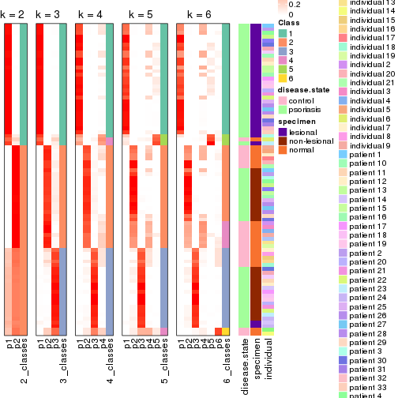


Test correlation between subgroups and known annotations. If the known
annotation is numeric, one-way ANOVA test is applied, and if the known
annotation is discrete, chi-squared contingency table test is applied.

```r
test_to_known_factors(res)
```

```
#>            n disease.state(p) specimen(p) individual(p) k
#> SD:hclust 82         5.16e-04    5.99e-16         0.999 2
#> SD:hclust 82         3.40e-04    7.97e-15         0.897 3
#> SD:hclust 81         4.53e-04    6.01e-14         0.712 4
#> SD:hclust 80         4.70e-05    1.58e-14         0.298 5
#> SD:hclust 72         4.38e-07    8.74e-16         0.137 6
```


If matrix rows can be associated to genes, consider to use `GO_Enrichment(res,
...)` to perform function enrichment for the signature genes.


 

---------------------------------------------------


### SD:kmeans**


The object with results only for a single top-value method and a single partition method 
can be extracted as:

```r
res = res_list["SD", "kmeans"]
# you can also extract it by
# res = res_list["SD:kmeans"]
```

A summary of `res` and all the functions that can be applied to it:

```r
res
```

```
#> A 'ConsensusPartition' object with k = 2, 3, 4, 5, 6.
#>   On a matrix with 51941 rows and 82 columns.
#>   Top rows (1000, 2000, 3000, 4000, 5000) are extracted by 'SD' method.
#>   Subgroups are detected by 'kmeans' method.
#>   Performed in total 1250 partitions by row resampling.
#>   Best k for subgroups seems to be 2.
#> 
#> Following methods can be applied to this 'ConsensusPartition' object:
#>  [1] "cola_report"             "collect_classes"         "collect_plots"          
#>  [4] "collect_stats"           "colnames"                "compare_signatures"     
#>  [7] "consensus_heatmap"       "dimension_reduction"     "functional_enrichment"  
#> [10] "get_anno_col"            "get_anno"                "get_classes"            
#> [13] "get_consensus"           "get_matrix"              "get_membership"         
#> [16] "get_param"               "get_signatures"          "get_stats"              
#> [19] "is_best_k"               "is_stable_k"             "membership_heatmap"     
#> [22] "ncol"                    "nrow"                    "plot_ecdf"              
#> [25] "rownames"                "select_partition_number" "show"                   
#> [28] "suggest_best_k"          "test_to_known_factors"
```

`collect_plots()` function collects all the plots made from `res` for all `k` (number of partitions)
into one single page to provide an easy and fast comparison between different `k`.

```r
collect_plots(res)
```


The plots are:

- The first row: a plot of the ECDF (Empirical cumulative distribution
  function) curves of the consensus matrix for each `k` and the heatmap of
  predicted classes for each `k`.
- The second row: heatmaps of the consensus matrix for each `k`.
- The third row: heatmaps of the membership matrix for each `k`.
- The fouth row: heatmaps of the signatures for each `k`.

All the plots in panels can be made by individual functions and they are
plotted later in this section.

`select_partition_number()` produces several plots showing different
statistics for choosing "optimized" `k`. There are following statistics:

- ECDF curves of the consensus matrix for each `k`;
- 1-PAC. [The PAC
  score](https://en.wikipedia.org/wiki/Consensus_clustering#Over-interpretation_potential_of_consensus_clustering)
  measures the proportion of the ambiguous subgrouping.
- Mean silhouette score.
- Concordance. The mean probability of fiting the consensus class ids in all
  partitions.
- Area increased. Denote $A_k$ as the area under the ECDF curve for current
  `k`, the area increased is defined as $A_k - A_{k-1}$.
- Rand index. The percent of pairs of samples that are both in a same cluster
  or both are not in a same cluster in the partition of k and k-1.
- Jaccard index. The ratio of pairs of samples are both in a same cluster in
  the partition of k and k-1 and the pairs of samples are both in a same
  cluster in the partition k or k-1.

The detailed explanations of these statistics can be found in [the cola
vignette](http://bioconductor.org/packages/devel/bioc/vignettes/cola/inst/doc/cola.html#toc_13).

Generally speaking, lower PAC score, higher mean silhouette score or higher
concordance corresponds to better partition. Rand index and Jaccard index
measure how similar the current partition is compared to partition with `k-1`.
If they are too similar, we won't accept `k` is better than `k-1`.

```r
select_partition_number(res)
```


The numeric values for all these statistics can be obtained by `get_stats()`.

```r
get_stats(res)
```

```
#>   k 1-PAC mean_silhouette concordance area_increased  Rand Jaccard
#> 2 2 1.000           0.992       0.996         0.4782 0.524   0.524
#> 3 3 0.739           0.863       0.904         0.3664 0.808   0.633
#> 4 4 0.671           0.606       0.773         0.1206 0.969   0.908
#> 5 5 0.681           0.582       0.716         0.0694 0.819   0.467
#> 6 6 0.717           0.666       0.767         0.0475 0.943   0.733
```

`suggest_best_k()` suggests the best $k$ based on these statistics. The rules are as follows:

- All $k$ with Jaccard index larger than 0.95 are removed because the increase of
  the partition number does not provides enough extra information. If all $k$ are removed,
  the best $k$ is assigned by `NA`.
- For $k$ with 1-PAC larger than 0.9, the maximal $k$ is taken as the "best k". Other $k$ is called "optional k".
- If it does not fit the second rule. The $k$ with the highest vote of highest
  1-PAC, mean silhouette and concordance is taken as the "best k".

```r
suggest_best_k(res)
```

```
#> [1] 2
```


Following shows the table of the partitions (You need to click the **show/hide
code output** link to see it). The membership matrix (columns with name `p*`)
is inferred by
[`clue::cl_consensus()`](https://www.rdocumentation.org/link/cl_consensus?package=clue)
function with the `SE` method. Basically the value in the membership matrix
represents the probability to belong to a certain group. The finall class
label for an item is determined with the group with highest probability it
belongs to.

In `get_classes()` function, the entropy is calculated from the membership
matrix and the silhouette score is calculated from the consensus matrix.


<script>
$( function() {
	$( '#tabs-SD-kmeans-get-classes' ).tabs();
} );
</script>
<div id='tabs-SD-kmeans-get-classes'>
<ul>
<li><a href='#tab-SD-kmeans-get-classes-1'>k = 2</a></li>
<li><a href='#tab-SD-kmeans-get-classes-2'>k = 3</a></li>
<li><a href='#tab-SD-kmeans-get-classes-3'>k = 4</a></li>
<li><a href='#tab-SD-kmeans-get-classes-4'>k = 5</a></li>
<li><a href='#tab-SD-kmeans-get-classes-5'>k = 6</a></li>
</ul>

<div id='tab-SD-kmeans-get-classes-1'>
<p><a id='tab-SD-kmeans-get-classes-1-a' style='color:#0366d6' href='#'>show/hide code output</a></p>
<pre><code class="r">cbind(get_classes(res, k = 2), get_membership(res, k = 2))
</code></pre>

<pre><code>#&gt;           class entropy silhouette    p1    p2
#&gt; GSM372286     2   0.000      0.994 0.000 1.000
#&gt; GSM372287     2   0.000      0.994 0.000 1.000
#&gt; GSM372288     2   0.000      0.994 0.000 1.000
#&gt; GSM372289     2   0.000      0.994 0.000 1.000
#&gt; GSM372290     2   0.000      0.994 0.000 1.000
#&gt; GSM372291     2   0.224      0.959 0.036 0.964
#&gt; GSM372292     2   0.000      0.994 0.000 1.000
#&gt; GSM372293     2   0.000      0.994 0.000 1.000
#&gt; GSM372294     2   0.000      0.994 0.000 1.000
#&gt; GSM372295     2   0.000      0.994 0.000 1.000
#&gt; GSM372296     2   0.000      0.994 0.000 1.000
#&gt; GSM372297     2   0.000      0.994 0.000 1.000
#&gt; GSM372298     2   0.000      0.994 0.000 1.000
#&gt; GSM372299     2   0.000      0.994 0.000 1.000
#&gt; GSM372300     2   0.000      0.994 0.000 1.000
#&gt; GSM372301     2   0.000      0.994 0.000 1.000
#&gt; GSM372302     2   0.000      0.994 0.000 1.000
#&gt; GSM372303     2   0.000      0.994 0.000 1.000
#&gt; GSM372304     2   0.000      0.994 0.000 1.000
#&gt; GSM372305     2   0.000      0.994 0.000 1.000
#&gt; GSM372306     2   0.000      0.994 0.000 1.000
#&gt; GSM372307     2   0.000      0.994 0.000 1.000
#&gt; GSM372309     2   0.000      0.994 0.000 1.000
#&gt; GSM372311     2   0.000      0.994 0.000 1.000
#&gt; GSM372313     2   0.000      0.994 0.000 1.000
#&gt; GSM372315     2   0.000      0.994 0.000 1.000
#&gt; GSM372317     2   0.000      0.994 0.000 1.000
#&gt; GSM372319     2   0.000      0.994 0.000 1.000
#&gt; GSM372321     2   0.000      0.994 0.000 1.000
#&gt; GSM372323     2   0.000      0.994 0.000 1.000
#&gt; GSM372326     2   0.000      0.994 0.000 1.000
#&gt; GSM372328     2   0.000      0.994 0.000 1.000
#&gt; GSM372330     2   0.000      0.994 0.000 1.000
#&gt; GSM372332     2   0.000      0.994 0.000 1.000
#&gt; GSM372335     2   0.000      0.994 0.000 1.000
#&gt; GSM372337     2   0.000      0.994 0.000 1.000
#&gt; GSM372339     2   0.000      0.994 0.000 1.000
#&gt; GSM372341     2   0.000      0.994 0.000 1.000
#&gt; GSM372343     2   0.000      0.994 0.000 1.000
#&gt; GSM372345     2   0.000      0.994 0.000 1.000
#&gt; GSM372347     2   0.000      0.994 0.000 1.000
#&gt; GSM372349     2   0.000      0.994 0.000 1.000
#&gt; GSM372351     2   0.000      0.994 0.000 1.000
#&gt; GSM372353     2   0.000      0.994 0.000 1.000
#&gt; GSM372355     2   0.000      0.994 0.000 1.000
#&gt; GSM372357     2   0.000      0.994 0.000 1.000
#&gt; GSM372359     2   0.000      0.994 0.000 1.000
#&gt; GSM372361     2   0.000      0.994 0.000 1.000
#&gt; GSM372363     2   0.000      0.994 0.000 1.000
#&gt; GSM372308     1   0.000      1.000 1.000 0.000
#&gt; GSM372310     1   0.000      1.000 1.000 0.000
#&gt; GSM372312     1   0.000      1.000 1.000 0.000
#&gt; GSM372314     1   0.000      1.000 1.000 0.000
#&gt; GSM372316     1   0.000      1.000 1.000 0.000
#&gt; GSM372318     1   0.000      1.000 1.000 0.000
#&gt; GSM372320     1   0.000      1.000 1.000 0.000
#&gt; GSM372322     1   0.000      1.000 1.000 0.000
#&gt; GSM372324     1   0.000      1.000 1.000 0.000
#&gt; GSM372325     1   0.000      1.000 1.000 0.000
#&gt; GSM372327     1   0.000      1.000 1.000 0.000
#&gt; GSM372329     1   0.000      1.000 1.000 0.000
#&gt; GSM372331     1   0.000      1.000 1.000 0.000
#&gt; GSM372333     2   0.827      0.651 0.260 0.740
#&gt; GSM372334     1   0.000      1.000 1.000 0.000
#&gt; GSM372336     1   0.000      1.000 1.000 0.000
#&gt; GSM372338     1   0.000      1.000 1.000 0.000
#&gt; GSM372340     1   0.000      1.000 1.000 0.000
#&gt; GSM372342     1   0.000      1.000 1.000 0.000
#&gt; GSM372344     1   0.000      1.000 1.000 0.000
#&gt; GSM372346     1   0.000      1.000 1.000 0.000
#&gt; GSM372348     1   0.000      1.000 1.000 0.000
#&gt; GSM372350     1   0.000      1.000 1.000 0.000
#&gt; GSM372352     2   0.000      0.994 0.000 1.000
#&gt; GSM372354     1   0.000      1.000 1.000 0.000
#&gt; GSM372356     1   0.000      1.000 1.000 0.000
#&gt; GSM372358     1   0.000      1.000 1.000 0.000
#&gt; GSM372360     1   0.000      1.000 1.000 0.000
#&gt; GSM372362     1   0.000      1.000 1.000 0.000
#&gt; GSM372364     1   0.000      1.000 1.000 0.000
#&gt; GSM372365     1   0.000      1.000 1.000 0.000
#&gt; GSM372366     1   0.000      1.000 1.000 0.000
#&gt; GSM372367     1   0.000      1.000 1.000 0.000
</code></pre>

<script>
$('#tab-SD-kmeans-get-classes-1-a').parent().next().next().hide();
$('#tab-SD-kmeans-get-classes-1-a').click(function(){
  $('#tab-SD-kmeans-get-classes-1-a').parent().next().next().toggle();
  return(false);
});
</script>
</div>

<div id='tab-SD-kmeans-get-classes-2'>
<p><a id='tab-SD-kmeans-get-classes-2-a' style='color:#0366d6' href='#'>show/hide code output</a></p>
<pre><code class="r">cbind(get_classes(res, k = 3), get_membership(res, k = 3))
</code></pre>

<pre><code>#&gt;           class entropy silhouette    p1    p2    p3
#&gt; GSM372286     2  0.0000      0.873 0.000 1.000 0.000
#&gt; GSM372287     2  0.0592      0.865 0.000 0.988 0.012
#&gt; GSM372288     2  0.0000      0.873 0.000 1.000 0.000
#&gt; GSM372289     2  0.0000      0.873 0.000 1.000 0.000
#&gt; GSM372290     2  0.0000      0.873 0.000 1.000 0.000
#&gt; GSM372291     3  0.7180      0.615 0.196 0.096 0.708
#&gt; GSM372292     2  0.5678      0.506 0.000 0.684 0.316
#&gt; GSM372293     3  0.4002      0.902 0.000 0.160 0.840
#&gt; GSM372294     2  0.0592      0.865 0.000 0.988 0.012
#&gt; GSM372295     2  0.0747      0.864 0.000 0.984 0.016
#&gt; GSM372296     2  0.0000      0.873 0.000 1.000 0.000
#&gt; GSM372297     2  0.0000      0.873 0.000 1.000 0.000
#&gt; GSM372298     2  0.0000      0.873 0.000 1.000 0.000
#&gt; GSM372299     2  0.5948      0.399 0.000 0.640 0.360
#&gt; GSM372300     3  0.4796      0.847 0.000 0.220 0.780
#&gt; GSM372301     3  0.6095      0.516 0.000 0.392 0.608
#&gt; GSM372302     2  0.0000      0.873 0.000 1.000 0.000
#&gt; GSM372303     3  0.3941      0.904 0.000 0.156 0.844
#&gt; GSM372304     2  0.0000      0.873 0.000 1.000 0.000
#&gt; GSM372305     2  0.1163      0.865 0.000 0.972 0.028
#&gt; GSM372306     2  0.6026      0.394 0.000 0.624 0.376
#&gt; GSM372307     2  0.0000      0.873 0.000 1.000 0.000
#&gt; GSM372309     2  0.5733      0.521 0.000 0.676 0.324
#&gt; GSM372311     2  0.1163      0.865 0.000 0.972 0.028
#&gt; GSM372313     2  0.1163      0.865 0.000 0.972 0.028
#&gt; GSM372315     2  0.0000      0.873 0.000 1.000 0.000
#&gt; GSM372317     2  0.4178      0.741 0.000 0.828 0.172
#&gt; GSM372319     3  0.5363      0.739 0.000 0.276 0.724
#&gt; GSM372321     3  0.3482      0.921 0.000 0.128 0.872
#&gt; GSM372323     3  0.3482      0.921 0.000 0.128 0.872
#&gt; GSM372326     3  0.3482      0.921 0.000 0.128 0.872
#&gt; GSM372328     3  0.3482      0.921 0.000 0.128 0.872
#&gt; GSM372330     2  0.1163      0.865 0.000 0.972 0.028
#&gt; GSM372332     3  0.3482      0.921 0.000 0.128 0.872
#&gt; GSM372335     2  0.6168      0.281 0.000 0.588 0.412
#&gt; GSM372337     3  0.3482      0.921 0.000 0.128 0.872
#&gt; GSM372339     3  0.3482      0.921 0.000 0.128 0.872
#&gt; GSM372341     3  0.3482      0.921 0.000 0.128 0.872
#&gt; GSM372343     3  0.3482      0.921 0.000 0.128 0.872
#&gt; GSM372345     3  0.3482      0.921 0.000 0.128 0.872
#&gt; GSM372347     3  0.2448      0.880 0.000 0.076 0.924
#&gt; GSM372349     3  0.3267      0.914 0.000 0.116 0.884
#&gt; GSM372351     3  0.3482      0.921 0.000 0.128 0.872
#&gt; GSM372353     3  0.5431      0.726 0.000 0.284 0.716
#&gt; GSM372355     2  0.1163      0.865 0.000 0.972 0.028
#&gt; GSM372357     2  0.5733      0.521 0.000 0.676 0.324
#&gt; GSM372359     2  0.5785      0.504 0.000 0.668 0.332
#&gt; GSM372361     2  0.0000      0.873 0.000 1.000 0.000
#&gt; GSM372363     2  0.1163      0.865 0.000 0.972 0.028
#&gt; GSM372308     1  0.2356      0.955 0.928 0.000 0.072
#&gt; GSM372310     1  0.2356      0.955 0.928 0.000 0.072
#&gt; GSM372312     1  0.2625      0.950 0.916 0.000 0.084
#&gt; GSM372314     1  0.2356      0.955 0.928 0.000 0.072
#&gt; GSM372316     1  0.0237      0.963 0.996 0.000 0.004
#&gt; GSM372318     1  0.1529      0.959 0.960 0.000 0.040
#&gt; GSM372320     1  0.1643      0.958 0.956 0.000 0.044
#&gt; GSM372322     1  0.1643      0.958 0.956 0.000 0.044
#&gt; GSM372324     1  0.2356      0.955 0.928 0.000 0.072
#&gt; GSM372325     1  0.2356      0.955 0.928 0.000 0.072
#&gt; GSM372327     1  0.1643      0.958 0.956 0.000 0.044
#&gt; GSM372329     1  0.1643      0.958 0.956 0.000 0.044
#&gt; GSM372331     1  0.2356      0.955 0.928 0.000 0.072
#&gt; GSM372333     3  0.2173      0.849 0.008 0.048 0.944
#&gt; GSM372334     1  0.1643      0.958 0.956 0.000 0.044
#&gt; GSM372336     1  0.1964      0.959 0.944 0.000 0.056
#&gt; GSM372338     1  0.1643      0.958 0.956 0.000 0.044
#&gt; GSM372340     1  0.1643      0.958 0.956 0.000 0.044
#&gt; GSM372342     1  0.1643      0.958 0.956 0.000 0.044
#&gt; GSM372344     1  0.1643      0.958 0.956 0.000 0.044
#&gt; GSM372346     1  0.1529      0.959 0.960 0.000 0.040
#&gt; GSM372348     1  0.2356      0.955 0.928 0.000 0.072
#&gt; GSM372350     1  0.2959      0.951 0.900 0.000 0.100
#&gt; GSM372352     3  0.2356      0.877 0.000 0.072 0.928
#&gt; GSM372354     1  0.0000      0.964 1.000 0.000 0.000
#&gt; GSM372356     1  0.0892      0.963 0.980 0.000 0.020
#&gt; GSM372358     1  0.0892      0.963 0.980 0.000 0.020
#&gt; GSM372360     1  0.0892      0.963 0.980 0.000 0.020
#&gt; GSM372362     1  0.0424      0.964 0.992 0.000 0.008
#&gt; GSM372364     1  0.0892      0.963 0.980 0.000 0.020
#&gt; GSM372365     1  0.2165      0.957 0.936 0.000 0.064
#&gt; GSM372366     1  0.0000      0.964 1.000 0.000 0.000
#&gt; GSM372367     1  0.2356      0.955 0.928 0.000 0.072
</code></pre>

<script>
$('#tab-SD-kmeans-get-classes-2-a').parent().next().next().hide();
$('#tab-SD-kmeans-get-classes-2-a').click(function(){
  $('#tab-SD-kmeans-get-classes-2-a').parent().next().next().toggle();
  return(false);
});
</script>
</div>

<div id='tab-SD-kmeans-get-classes-3'>
<p><a id='tab-SD-kmeans-get-classes-3-a' style='color:#0366d6' href='#'>show/hide code output</a></p>
<pre><code class="r">cbind(get_classes(res, k = 4), get_membership(res, k = 4))
</code></pre>

<pre><code>#&gt;           class entropy silhouette    p1    p2    p3    p4
#&gt; GSM372286     2  0.1557     0.6219 0.000 0.944 0.000 0.056
#&gt; GSM372287     2  0.4866     0.1717 0.000 0.596 0.000 0.404
#&gt; GSM372288     2  0.4431     0.3835 0.000 0.696 0.000 0.304
#&gt; GSM372289     2  0.2921     0.5746 0.000 0.860 0.000 0.140
#&gt; GSM372290     2  0.4431     0.3835 0.000 0.696 0.000 0.304
#&gt; GSM372291     4  0.3895     0.2229 0.000 0.012 0.184 0.804
#&gt; GSM372292     4  0.7740     0.4496 0.000 0.328 0.244 0.428
#&gt; GSM372293     3  0.5349     0.4023 0.000 0.024 0.640 0.336
#&gt; GSM372294     2  0.4830     0.2472 0.000 0.608 0.000 0.392
#&gt; GSM372295     4  0.5143    -0.0474 0.000 0.456 0.004 0.540
#&gt; GSM372296     2  0.4431     0.3835 0.000 0.696 0.000 0.304
#&gt; GSM372297     2  0.4916     0.1101 0.000 0.576 0.000 0.424
#&gt; GSM372298     2  0.4916     0.1101 0.000 0.576 0.000 0.424
#&gt; GSM372299     4  0.7756     0.4499 0.000 0.320 0.252 0.428
#&gt; GSM372300     3  0.6074     0.3045 0.000 0.060 0.600 0.340
#&gt; GSM372301     3  0.7421    -0.2281 0.000 0.172 0.456 0.372
#&gt; GSM372302     2  0.4830     0.1921 0.000 0.608 0.000 0.392
#&gt; GSM372303     3  0.5460     0.3850 0.000 0.028 0.632 0.340
#&gt; GSM372304     2  0.4830     0.1921 0.000 0.608 0.000 0.392
#&gt; GSM372305     2  0.0188     0.6322 0.000 0.996 0.004 0.000
#&gt; GSM372306     2  0.4567     0.3176 0.000 0.716 0.276 0.008
#&gt; GSM372307     2  0.2081     0.6100 0.000 0.916 0.000 0.084
#&gt; GSM372309     2  0.4775     0.3697 0.000 0.740 0.232 0.028
#&gt; GSM372311     2  0.0188     0.6322 0.000 0.996 0.004 0.000
#&gt; GSM372313     2  0.0188     0.6322 0.000 0.996 0.004 0.000
#&gt; GSM372315     2  0.0000     0.6319 0.000 1.000 0.000 0.000
#&gt; GSM372317     2  0.2466     0.5576 0.000 0.900 0.096 0.004
#&gt; GSM372319     3  0.2921     0.6772 0.000 0.140 0.860 0.000
#&gt; GSM372321     3  0.0707     0.7795 0.000 0.020 0.980 0.000
#&gt; GSM372323     3  0.0707     0.7795 0.000 0.020 0.980 0.000
#&gt; GSM372326     3  0.0707     0.7795 0.000 0.020 0.980 0.000
#&gt; GSM372328     3  0.1624     0.7806 0.000 0.020 0.952 0.028
#&gt; GSM372330     2  0.0376     0.6308 0.000 0.992 0.004 0.004
#&gt; GSM372332     3  0.1624     0.7806 0.000 0.020 0.952 0.028
#&gt; GSM372335     2  0.4804     0.3016 0.000 0.708 0.276 0.016
#&gt; GSM372337     3  0.0707     0.7795 0.000 0.020 0.980 0.000
#&gt; GSM372339     3  0.1624     0.7806 0.000 0.020 0.952 0.028
#&gt; GSM372341     3  0.1624     0.7806 0.000 0.020 0.952 0.028
#&gt; GSM372343     3  0.1624     0.7806 0.000 0.020 0.952 0.028
#&gt; GSM372345     3  0.0707     0.7795 0.000 0.020 0.980 0.000
#&gt; GSM372347     3  0.4215     0.6589 0.000 0.072 0.824 0.104
#&gt; GSM372349     3  0.2737     0.7236 0.000 0.008 0.888 0.104
#&gt; GSM372351     3  0.1624     0.7806 0.000 0.020 0.952 0.028
#&gt; GSM372353     3  0.5691     0.2023 0.000 0.408 0.564 0.028
#&gt; GSM372355     2  0.0188     0.6322 0.000 0.996 0.004 0.000
#&gt; GSM372357     2  0.4775     0.3697 0.000 0.740 0.232 0.028
#&gt; GSM372359     2  0.4502     0.3704 0.000 0.748 0.236 0.016
#&gt; GSM372361     2  0.2216     0.6113 0.000 0.908 0.000 0.092
#&gt; GSM372363     2  0.0657     0.6274 0.000 0.984 0.004 0.012
#&gt; GSM372308     1  0.4690     0.7662 0.724 0.000 0.016 0.260
#&gt; GSM372310     1  0.4690     0.7662 0.724 0.000 0.016 0.260
#&gt; GSM372312     1  0.4746     0.6856 0.632 0.000 0.000 0.368
#&gt; GSM372314     1  0.4576     0.7661 0.728 0.000 0.012 0.260
#&gt; GSM372316     1  0.0188     0.8353 0.996 0.000 0.000 0.004
#&gt; GSM372318     1  0.2868     0.8193 0.864 0.000 0.000 0.136
#&gt; GSM372320     1  0.3208     0.8154 0.848 0.000 0.004 0.148
#&gt; GSM372322     1  0.3074     0.8156 0.848 0.000 0.000 0.152
#&gt; GSM372324     1  0.4546     0.7684 0.732 0.000 0.012 0.256
#&gt; GSM372325     1  0.5256     0.7454 0.700 0.000 0.040 0.260
#&gt; GSM372327     1  0.3074     0.8156 0.848 0.000 0.000 0.152
#&gt; GSM372329     1  0.3074     0.8156 0.848 0.000 0.000 0.152
#&gt; GSM372331     1  0.4576     0.7661 0.728 0.000 0.012 0.260
#&gt; GSM372333     3  0.6112     0.4700 0.016 0.056 0.668 0.260
#&gt; GSM372334     1  0.3208     0.8154 0.848 0.000 0.004 0.148
#&gt; GSM372336     1  0.4098     0.7911 0.784 0.000 0.012 0.204
#&gt; GSM372338     1  0.3208     0.8154 0.848 0.000 0.004 0.148
#&gt; GSM372340     1  0.3208     0.8154 0.848 0.000 0.004 0.148
#&gt; GSM372342     1  0.3074     0.8156 0.848 0.000 0.000 0.152
#&gt; GSM372344     1  0.3208     0.8154 0.848 0.000 0.004 0.148
#&gt; GSM372346     1  0.2973     0.8175 0.856 0.000 0.000 0.144
#&gt; GSM372348     1  0.4485     0.7747 0.740 0.000 0.012 0.248
#&gt; GSM372350     1  0.5158     0.6883 0.524 0.000 0.004 0.472
#&gt; GSM372352     3  0.6215     0.4089 0.000 0.072 0.600 0.328
#&gt; GSM372354     1  0.0657     0.8349 0.984 0.000 0.004 0.012
#&gt; GSM372356     1  0.0592     0.8343 0.984 0.000 0.000 0.016
#&gt; GSM372358     1  0.0592     0.8350 0.984 0.000 0.000 0.016
#&gt; GSM372360     1  0.0779     0.8343 0.980 0.000 0.004 0.016
#&gt; GSM372362     1  0.0524     0.8348 0.988 0.000 0.004 0.008
#&gt; GSM372364     1  0.0779     0.8343 0.980 0.000 0.004 0.016
#&gt; GSM372365     1  0.4502     0.7779 0.748 0.000 0.016 0.236
#&gt; GSM372366     1  0.0657     0.8349 0.984 0.000 0.004 0.012
#&gt; GSM372367     1  0.4576     0.7661 0.728 0.000 0.012 0.260
</code></pre>

<script>
$('#tab-SD-kmeans-get-classes-3-a').parent().next().next().hide();
$('#tab-SD-kmeans-get-classes-3-a').click(function(){
  $('#tab-SD-kmeans-get-classes-3-a').parent().next().next().toggle();
  return(false);
});
</script>
</div>

<div id='tab-SD-kmeans-get-classes-4'>
<p><a id='tab-SD-kmeans-get-classes-4-a' style='color:#0366d6' href='#'>show/hide code output</a></p>
<pre><code class="r">cbind(get_classes(res, k = 5), get_membership(res, k = 5))
</code></pre>

<pre><code>#&gt;           class entropy silhouette    p1    p2    p3    p4    p5
#&gt; GSM372286     2  0.3305     0.5257 0.000 0.776 0.000 0.224 0.000
#&gt; GSM372287     4  0.4015     0.5085 0.000 0.348 0.000 0.652 0.000
#&gt; GSM372288     4  0.4249     0.3908 0.000 0.432 0.000 0.568 0.000
#&gt; GSM372289     2  0.4088     0.2141 0.000 0.632 0.000 0.368 0.000
#&gt; GSM372290     4  0.4249     0.3908 0.000 0.432 0.000 0.568 0.000
#&gt; GSM372291     5  0.4824    -0.3007 0.000 0.000 0.020 0.468 0.512
#&gt; GSM372292     4  0.7612     0.5009 0.000 0.124 0.216 0.504 0.156
#&gt; GSM372293     4  0.6659     0.2245 0.000 0.012 0.396 0.436 0.156
#&gt; GSM372294     4  0.5618     0.4375 0.000 0.280 0.000 0.608 0.112
#&gt; GSM372295     4  0.5550     0.4685 0.000 0.148 0.004 0.660 0.188
#&gt; GSM372296     4  0.4235     0.4027 0.000 0.424 0.000 0.576 0.000
#&gt; GSM372297     4  0.4522     0.5279 0.000 0.316 0.000 0.660 0.024
#&gt; GSM372298     4  0.5699     0.5125 0.000 0.308 0.000 0.584 0.108
#&gt; GSM372299     4  0.8089     0.4453 0.000 0.164 0.208 0.436 0.192
#&gt; GSM372300     4  0.6889     0.2543 0.000 0.024 0.384 0.436 0.156
#&gt; GSM372301     4  0.7295     0.3572 0.000 0.056 0.328 0.460 0.156
#&gt; GSM372302     4  0.4015     0.5085 0.000 0.348 0.000 0.652 0.000
#&gt; GSM372303     4  0.6659     0.2245 0.000 0.012 0.396 0.436 0.156
#&gt; GSM372304     4  0.3999     0.5115 0.000 0.344 0.000 0.656 0.000
#&gt; GSM372305     2  0.0324     0.7702 0.000 0.992 0.004 0.004 0.000
#&gt; GSM372306     2  0.4088     0.7161 0.000 0.812 0.116 0.040 0.032
#&gt; GSM372307     2  0.4130     0.3972 0.000 0.696 0.000 0.292 0.012
#&gt; GSM372309     2  0.4616     0.7152 0.000 0.788 0.096 0.060 0.056
#&gt; GSM372311     2  0.0162     0.7715 0.000 0.996 0.004 0.000 0.000
#&gt; GSM372313     2  0.0671     0.7732 0.000 0.980 0.004 0.000 0.016
#&gt; GSM372315     2  0.0404     0.7655 0.000 0.988 0.000 0.012 0.000
#&gt; GSM372317     2  0.2483     0.7611 0.000 0.908 0.048 0.028 0.016
#&gt; GSM372319     3  0.1430     0.8800 0.000 0.052 0.944 0.004 0.000
#&gt; GSM372321     3  0.0324     0.9203 0.000 0.004 0.992 0.000 0.004
#&gt; GSM372323     3  0.0162     0.9213 0.000 0.000 0.996 0.000 0.004
#&gt; GSM372326     3  0.0162     0.9216 0.000 0.000 0.996 0.004 0.000
#&gt; GSM372328     3  0.0510     0.9224 0.000 0.000 0.984 0.016 0.000
#&gt; GSM372330     2  0.0865     0.7717 0.000 0.972 0.004 0.024 0.000
#&gt; GSM372332     3  0.0510     0.9224 0.000 0.000 0.984 0.016 0.000
#&gt; GSM372335     2  0.4253     0.7099 0.000 0.804 0.112 0.052 0.032
#&gt; GSM372337     3  0.0703     0.9130 0.000 0.000 0.976 0.000 0.024
#&gt; GSM372339     3  0.0510     0.9224 0.000 0.000 0.984 0.016 0.000
#&gt; GSM372341     3  0.0510     0.9224 0.000 0.000 0.984 0.016 0.000
#&gt; GSM372343     3  0.0510     0.9224 0.000 0.000 0.984 0.016 0.000
#&gt; GSM372345     3  0.0703     0.9130 0.000 0.000 0.976 0.000 0.024
#&gt; GSM372347     3  0.5733     0.4406 0.000 0.096 0.588 0.004 0.312
#&gt; GSM372349     3  0.4801     0.6677 0.000 0.000 0.728 0.124 0.148
#&gt; GSM372351     3  0.0703     0.9191 0.000 0.000 0.976 0.024 0.000
#&gt; GSM372353     2  0.5743     0.4723 0.000 0.632 0.276 0.060 0.032
#&gt; GSM372355     2  0.0162     0.7715 0.000 0.996 0.004 0.000 0.000
#&gt; GSM372357     2  0.4410     0.7173 0.000 0.800 0.096 0.060 0.044
#&gt; GSM372359     2  0.4101     0.7199 0.000 0.816 0.100 0.052 0.032
#&gt; GSM372361     2  0.4054     0.5340 0.000 0.748 0.000 0.224 0.028
#&gt; GSM372363     2  0.1743     0.7550 0.000 0.940 0.004 0.028 0.028
#&gt; GSM372308     5  0.4874     0.5207 0.368 0.000 0.000 0.032 0.600
#&gt; GSM372310     5  0.4874     0.5207 0.368 0.000 0.000 0.032 0.600
#&gt; GSM372312     5  0.5295     0.4212 0.200 0.000 0.000 0.128 0.672
#&gt; GSM372314     5  0.4201     0.5570 0.328 0.008 0.000 0.000 0.664
#&gt; GSM372316     1  0.3551     0.6842 0.820 0.000 0.000 0.044 0.136
#&gt; GSM372318     1  0.0865     0.7542 0.972 0.000 0.000 0.004 0.024
#&gt; GSM372320     1  0.0727     0.7527 0.980 0.004 0.000 0.012 0.004
#&gt; GSM372322     1  0.0000     0.7550 1.000 0.000 0.000 0.000 0.000
#&gt; GSM372324     5  0.4088     0.5337 0.368 0.000 0.000 0.000 0.632
#&gt; GSM372325     5  0.4183     0.5570 0.324 0.008 0.000 0.000 0.668
#&gt; GSM372327     1  0.0000     0.7550 1.000 0.000 0.000 0.000 0.000
#&gt; GSM372329     1  0.0290     0.7553 0.992 0.000 0.000 0.008 0.000
#&gt; GSM372331     5  0.4235     0.5557 0.336 0.008 0.000 0.000 0.656
#&gt; GSM372333     5  0.5189    -0.1710 0.004 0.032 0.464 0.000 0.500
#&gt; GSM372334     1  0.0727     0.7527 0.980 0.004 0.000 0.012 0.004
#&gt; GSM372336     1  0.5346    -0.1872 0.496 0.000 0.000 0.052 0.452
#&gt; GSM372338     1  0.0727     0.7527 0.980 0.004 0.000 0.012 0.004
#&gt; GSM372340     1  0.0451     0.7518 0.988 0.004 0.000 0.008 0.000
#&gt; GSM372342     1  0.0000     0.7550 1.000 0.000 0.000 0.000 0.000
#&gt; GSM372344     1  0.0727     0.7527 0.980 0.004 0.000 0.012 0.004
#&gt; GSM372346     1  0.0566     0.7559 0.984 0.000 0.000 0.004 0.012
#&gt; GSM372348     5  0.4825     0.4588 0.408 0.000 0.000 0.024 0.568
#&gt; GSM372350     1  0.6121    -0.0749 0.488 0.000 0.000 0.132 0.380
#&gt; GSM372352     5  0.6298    -0.0792 0.000 0.044 0.352 0.064 0.540
#&gt; GSM372354     1  0.4409     0.6638 0.768 0.004 0.000 0.080 0.148
#&gt; GSM372356     1  0.5136     0.5042 0.660 0.000 0.000 0.080 0.260
#&gt; GSM372358     1  0.5013     0.5350 0.680 0.000 0.000 0.080 0.240
#&gt; GSM372360     1  0.5136     0.5042 0.660 0.000 0.000 0.080 0.260
#&gt; GSM372362     1  0.4449     0.6376 0.752 0.000 0.000 0.080 0.168
#&gt; GSM372364     1  0.5136     0.5042 0.660 0.000 0.000 0.080 0.260
#&gt; GSM372365     5  0.5684     0.2840 0.432 0.000 0.000 0.080 0.488
#&gt; GSM372366     1  0.4254     0.6582 0.772 0.000 0.000 0.080 0.148
#&gt; GSM372367     5  0.5480     0.4765 0.368 0.000 0.000 0.072 0.560
</code></pre>

<script>
$('#tab-SD-kmeans-get-classes-4-a').parent().next().next().hide();
$('#tab-SD-kmeans-get-classes-4-a').click(function(){
  $('#tab-SD-kmeans-get-classes-4-a').parent().next().next().toggle();
  return(false);
});
</script>
</div>

<div id='tab-SD-kmeans-get-classes-5'>
<p><a id='tab-SD-kmeans-get-classes-5-a' style='color:#0366d6' href='#'>show/hide code output</a></p>
<pre><code class="r">cbind(get_classes(res, k = 6), get_membership(res, k = 6))
</code></pre>

<pre><code>#&gt;           class entropy silhouette    p1    p2    p3    p4    p5    p6
#&gt; GSM372286     2  0.4214    -0.0798 0.000 0.528 0.000 0.460 0.004 0.008
#&gt; GSM372287     4  0.2673     0.7435 0.000 0.132 0.000 0.852 0.004 0.012
#&gt; GSM372288     4  0.2805     0.7544 0.000 0.184 0.000 0.812 0.004 0.000
#&gt; GSM372289     4  0.3699     0.5569 0.000 0.336 0.000 0.660 0.004 0.000
#&gt; GSM372290     4  0.2805     0.7544 0.000 0.184 0.000 0.812 0.004 0.000
#&gt; GSM372291     6  0.5992     0.2233 0.000 0.004 0.000 0.284 0.236 0.476
#&gt; GSM372292     6  0.6936     0.6403 0.000 0.084 0.176 0.320 0.000 0.420
#&gt; GSM372293     6  0.6499     0.7639 0.000 0.028 0.316 0.228 0.000 0.428
#&gt; GSM372294     4  0.5248     0.5023 0.000 0.100 0.000 0.684 0.052 0.164
#&gt; GSM372295     4  0.6011     0.1430 0.000 0.052 0.000 0.536 0.096 0.316
#&gt; GSM372296     4  0.2664     0.7546 0.000 0.184 0.000 0.816 0.000 0.000
#&gt; GSM372297     4  0.3748     0.6622 0.000 0.112 0.000 0.792 0.004 0.092
#&gt; GSM372298     4  0.5172     0.2829 0.000 0.124 0.000 0.592 0.000 0.284
#&gt; GSM372299     6  0.7694     0.6066 0.000 0.172 0.148 0.216 0.028 0.436
#&gt; GSM372300     6  0.6679     0.7736 0.000 0.040 0.300 0.240 0.000 0.420
#&gt; GSM372301     6  0.6811     0.7671 0.000 0.052 0.280 0.248 0.000 0.420
#&gt; GSM372302     4  0.2573     0.7435 0.000 0.132 0.000 0.856 0.004 0.008
#&gt; GSM372303     6  0.6506     0.7683 0.000 0.028 0.312 0.232 0.000 0.428
#&gt; GSM372304     4  0.2573     0.7435 0.000 0.132 0.000 0.856 0.004 0.008
#&gt; GSM372305     2  0.1757     0.8351 0.000 0.916 0.000 0.076 0.008 0.000
#&gt; GSM372306     2  0.1442     0.8244 0.000 0.944 0.040 0.000 0.004 0.012
#&gt; GSM372307     4  0.3975     0.4255 0.000 0.392 0.000 0.600 0.008 0.000
#&gt; GSM372309     2  0.1962     0.8213 0.000 0.924 0.028 0.000 0.028 0.020
#&gt; GSM372311     2  0.1643     0.8400 0.000 0.924 0.000 0.068 0.008 0.000
#&gt; GSM372313     2  0.1267     0.8451 0.000 0.940 0.000 0.060 0.000 0.000
#&gt; GSM372315     2  0.1701     0.8378 0.000 0.920 0.000 0.072 0.008 0.000
#&gt; GSM372317     2  0.0717     0.8430 0.000 0.976 0.000 0.016 0.000 0.008
#&gt; GSM372319     3  0.1285     0.9083 0.000 0.052 0.944 0.000 0.004 0.000
#&gt; GSM372321     3  0.0935     0.9251 0.000 0.032 0.964 0.000 0.004 0.000
#&gt; GSM372323     3  0.0865     0.9244 0.000 0.036 0.964 0.000 0.000 0.000
#&gt; GSM372326     3  0.0790     0.9257 0.000 0.032 0.968 0.000 0.000 0.000
#&gt; GSM372328     3  0.0508     0.9233 0.000 0.000 0.984 0.000 0.004 0.012
#&gt; GSM372330     2  0.1267     0.8451 0.000 0.940 0.000 0.060 0.000 0.000
#&gt; GSM372332     3  0.0508     0.9233 0.000 0.000 0.984 0.000 0.004 0.012
#&gt; GSM372335     2  0.1511     0.8209 0.000 0.940 0.044 0.000 0.004 0.012
#&gt; GSM372337     3  0.1010     0.9232 0.000 0.036 0.960 0.000 0.000 0.004
#&gt; GSM372339     3  0.0508     0.9233 0.000 0.000 0.984 0.000 0.004 0.012
#&gt; GSM372341     3  0.0508     0.9233 0.000 0.000 0.984 0.000 0.004 0.012
#&gt; GSM372343     3  0.0508     0.9233 0.000 0.000 0.984 0.000 0.004 0.012
#&gt; GSM372345     3  0.1010     0.9232 0.000 0.036 0.960 0.000 0.000 0.004
#&gt; GSM372347     5  0.5858     0.2818 0.000 0.140 0.312 0.004 0.532 0.012
#&gt; GSM372349     3  0.5912     0.4496 0.000 0.008 0.624 0.084 0.072 0.212
#&gt; GSM372351     3  0.0146     0.9250 0.000 0.004 0.996 0.000 0.000 0.000
#&gt; GSM372353     2  0.2699     0.7334 0.000 0.864 0.108 0.000 0.008 0.020
#&gt; GSM372355     2  0.1267     0.8451 0.000 0.940 0.000 0.060 0.000 0.000
#&gt; GSM372357     2  0.1313     0.8303 0.000 0.952 0.028 0.000 0.004 0.016
#&gt; GSM372359     2  0.1080     0.8305 0.000 0.960 0.032 0.000 0.004 0.004
#&gt; GSM372361     2  0.5029     0.1667 0.000 0.564 0.000 0.376 0.032 0.028
#&gt; GSM372363     2  0.2502     0.8222 0.000 0.884 0.000 0.084 0.020 0.012
#&gt; GSM372308     5  0.3637     0.7038 0.124 0.000 0.000 0.000 0.792 0.084
#&gt; GSM372310     5  0.3678     0.7016 0.128 0.000 0.000 0.000 0.788 0.084
#&gt; GSM372312     5  0.5587     0.4307 0.036 0.000 0.000 0.108 0.616 0.240
#&gt; GSM372314     5  0.2257     0.7191 0.116 0.008 0.000 0.000 0.876 0.000
#&gt; GSM372316     1  0.4256     0.6297 0.744 0.000 0.000 0.004 0.140 0.112
#&gt; GSM372318     1  0.1257     0.7310 0.952 0.000 0.000 0.000 0.028 0.020
#&gt; GSM372320     1  0.1461     0.7259 0.940 0.000 0.000 0.016 0.000 0.044
#&gt; GSM372322     1  0.0000     0.7334 1.000 0.000 0.000 0.000 0.000 0.000
#&gt; GSM372324     5  0.2278     0.7159 0.128 0.000 0.000 0.004 0.868 0.000
#&gt; GSM372325     5  0.2551     0.7180 0.108 0.012 0.004 0.004 0.872 0.000
#&gt; GSM372327     1  0.0000     0.7334 1.000 0.000 0.000 0.000 0.000 0.000
#&gt; GSM372329     1  0.0363     0.7336 0.988 0.000 0.000 0.000 0.000 0.012
#&gt; GSM372331     5  0.2400     0.7191 0.116 0.008 0.000 0.004 0.872 0.000
#&gt; GSM372333     5  0.4702     0.4747 0.000 0.052 0.256 0.004 0.676 0.012
#&gt; GSM372334     1  0.1461     0.7259 0.940 0.000 0.000 0.016 0.000 0.044
#&gt; GSM372336     5  0.5415     0.3788 0.304 0.000 0.000 0.004 0.564 0.128
#&gt; GSM372338     1  0.1461     0.7259 0.940 0.000 0.000 0.016 0.000 0.044
#&gt; GSM372340     1  0.1151     0.7267 0.956 0.000 0.000 0.012 0.000 0.032
#&gt; GSM372342     1  0.0000     0.7334 1.000 0.000 0.000 0.000 0.000 0.000
#&gt; GSM372344     1  0.1461     0.7259 0.940 0.000 0.000 0.016 0.000 0.044
#&gt; GSM372346     1  0.0862     0.7322 0.972 0.000 0.000 0.004 0.016 0.008
#&gt; GSM372348     5  0.4415     0.5906 0.236 0.000 0.000 0.004 0.696 0.064
#&gt; GSM372350     1  0.7364    -0.1092 0.352 0.000 0.000 0.116 0.292 0.240
#&gt; GSM372352     5  0.5533     0.4327 0.000 0.052 0.208 0.008 0.656 0.076
#&gt; GSM372354     1  0.5196     0.5876 0.616 0.000 0.000 0.004 0.128 0.252
#&gt; GSM372356     1  0.5783     0.3692 0.496 0.000 0.000 0.000 0.292 0.212
#&gt; GSM372358     1  0.5807     0.4070 0.520 0.000 0.000 0.004 0.272 0.204
#&gt; GSM372360     1  0.5805     0.3770 0.496 0.000 0.000 0.000 0.276 0.228
#&gt; GSM372362     1  0.5282     0.5355 0.600 0.000 0.000 0.000 0.172 0.228
#&gt; GSM372364     1  0.5818     0.3688 0.492 0.000 0.000 0.000 0.280 0.228
#&gt; GSM372365     5  0.5388     0.5121 0.188 0.000 0.000 0.000 0.584 0.228
#&gt; GSM372366     1  0.4977     0.5795 0.636 0.000 0.000 0.000 0.128 0.236
#&gt; GSM372367     5  0.4613     0.6351 0.128 0.000 0.000 0.000 0.692 0.180
</code></pre>

<script>
$('#tab-SD-kmeans-get-classes-5-a').parent().next().next().hide();
$('#tab-SD-kmeans-get-classes-5-a').click(function(){
  $('#tab-SD-kmeans-get-classes-5-a').parent().next().next().toggle();
  return(false);
});
</script>
</div>
</div>

Heatmaps for the consensus matrix. It visualizes the probability of two
samples to be in a same group.


<script>
$( function() {
	$( '#tabs-SD-kmeans-consensus-heatmap' ).tabs();
} );
</script>
<div id='tabs-SD-kmeans-consensus-heatmap'>
<ul>
<li><a href='#tab-SD-kmeans-consensus-heatmap-1'>k = 2</a></li>
<li><a href='#tab-SD-kmeans-consensus-heatmap-2'>k = 3</a></li>
<li><a href='#tab-SD-kmeans-consensus-heatmap-3'>k = 4</a></li>
<li><a href='#tab-SD-kmeans-consensus-heatmap-4'>k = 5</a></li>
<li><a href='#tab-SD-kmeans-consensus-heatmap-5'>k = 6</a></li>
</ul>
<div id='tab-SD-kmeans-consensus-heatmap-1'>
<pre><code class="r">consensus_heatmap(res, k = 2)
</code></pre>

<p></p>

</div>
<div id='tab-SD-kmeans-consensus-heatmap-2'>
<pre><code class="r">consensus_heatmap(res, k = 3)
</code></pre>

<p></p>

</div>
<div id='tab-SD-kmeans-consensus-heatmap-3'>
<pre><code class="r">consensus_heatmap(res, k = 4)
</code></pre>

<p></p>

</div>
<div id='tab-SD-kmeans-consensus-heatmap-4'>
<pre><code class="r">consensus_heatmap(res, k = 5)
</code></pre>

<p></p>

</div>
<div id='tab-SD-kmeans-consensus-heatmap-5'>
<pre><code class="r">consensus_heatmap(res, k = 6)
</code></pre>

<p></p>

</div>
</div>

Heatmaps for the membership of samples in all partitions to see how consistent they are:


<script>
$( function() {
	$( '#tabs-SD-kmeans-membership-heatmap' ).tabs();
} );
</script>
<div id='tabs-SD-kmeans-membership-heatmap'>
<ul>
<li><a href='#tab-SD-kmeans-membership-heatmap-1'>k = 2</a></li>
<li><a href='#tab-SD-kmeans-membership-heatmap-2'>k = 3</a></li>
<li><a href='#tab-SD-kmeans-membership-heatmap-3'>k = 4</a></li>
<li><a href='#tab-SD-kmeans-membership-heatmap-4'>k = 5</a></li>
<li><a href='#tab-SD-kmeans-membership-heatmap-5'>k = 6</a></li>
</ul>
<div id='tab-SD-kmeans-membership-heatmap-1'>
<pre><code class="r">membership_heatmap(res, k = 2)
</code></pre>

<p></p>

</div>
<div id='tab-SD-kmeans-membership-heatmap-2'>
<pre><code class="r">membership_heatmap(res, k = 3)
</code></pre>

<p></p>

</div>
<div id='tab-SD-kmeans-membership-heatmap-3'>
<pre><code class="r">membership_heatmap(res, k = 4)
</code></pre>

<p></p>

</div>
<div id='tab-SD-kmeans-membership-heatmap-4'>
<pre><code class="r">membership_heatmap(res, k = 5)
</code></pre>

<p></p>

</div>
<div id='tab-SD-kmeans-membership-heatmap-5'>
<pre><code class="r">membership_heatmap(res, k = 6)
</code></pre>

<p></p>

</div>
</div>

As soon as we have had the classes for columns, we can look for signatures
which are significantly different between classes which can be candidate marks
for certain classes. Following are the heatmaps for signatures.


Signature heatmaps where rows are scaled:


<script>
$( function() {
	$( '#tabs-SD-kmeans-get-signatures' ).tabs();
} );
</script>
<div id='tabs-SD-kmeans-get-signatures'>
<ul>
<li><a href='#tab-SD-kmeans-get-signatures-1'>k = 2</a></li>
<li><a href='#tab-SD-kmeans-get-signatures-2'>k = 3</a></li>
<li><a href='#tab-SD-kmeans-get-signatures-3'>k = 4</a></li>
<li><a href='#tab-SD-kmeans-get-signatures-4'>k = 5</a></li>
<li><a href='#tab-SD-kmeans-get-signatures-5'>k = 6</a></li>
</ul>
<div id='tab-SD-kmeans-get-signatures-1'>
<pre><code class="r">get_signatures(res, k = 2)
</code></pre>

<p></p>

</div>
<div id='tab-SD-kmeans-get-signatures-2'>
<pre><code class="r">get_signatures(res, k = 3)
</code></pre>

<p></p>

</div>
<div id='tab-SD-kmeans-get-signatures-3'>
<pre><code class="r">get_signatures(res, k = 4)
</code></pre>

<p></p>

</div>
<div id='tab-SD-kmeans-get-signatures-4'>
<pre><code class="r">get_signatures(res, k = 5)
</code></pre>

<p></p>

</div>
<div id='tab-SD-kmeans-get-signatures-5'>
<pre><code class="r">get_signatures(res, k = 6)
</code></pre>

<p></p>

</div>
</div>


Signature heatmaps where rows are not scaled:


<script>
$( function() {
	$( '#tabs-SD-kmeans-get-signatures-no-scale' ).tabs();
} );
</script>
<div id='tabs-SD-kmeans-get-signatures-no-scale'>
<ul>
<li><a href='#tab-SD-kmeans-get-signatures-no-scale-1'>k = 2</a></li>
<li><a href='#tab-SD-kmeans-get-signatures-no-scale-2'>k = 3</a></li>
<li><a href='#tab-SD-kmeans-get-signatures-no-scale-3'>k = 4</a></li>
<li><a href='#tab-SD-kmeans-get-signatures-no-scale-4'>k = 5</a></li>
<li><a href='#tab-SD-kmeans-get-signatures-no-scale-5'>k = 6</a></li>
</ul>
<div id='tab-SD-kmeans-get-signatures-no-scale-1'>
<pre><code class="r">get_signatures(res, k = 2, scale_rows = FALSE)
</code></pre>

<p></p>

</div>
<div id='tab-SD-kmeans-get-signatures-no-scale-2'>
<pre><code class="r">get_signatures(res, k = 3, scale_rows = FALSE)
</code></pre>

<p></p>

</div>
<div id='tab-SD-kmeans-get-signatures-no-scale-3'>
<pre><code class="r">get_signatures(res, k = 4, scale_rows = FALSE)
</code></pre>

<p></p>

</div>
<div id='tab-SD-kmeans-get-signatures-no-scale-4'>
<pre><code class="r">get_signatures(res, k = 5, scale_rows = FALSE)
</code></pre>

<p></p>

</div>
<div id='tab-SD-kmeans-get-signatures-no-scale-5'>
<pre><code class="r">get_signatures(res, k = 6, scale_rows = FALSE)
</code></pre>

<p></p>

</div>
</div>


Compare the overlap of signatures from different k:

```r
compare_signatures(res)
```


`get_signature()` returns a data frame invisibly. TO get the list of signatures, the function
call should be assigned to a variable explicitly. In following code, if `plot` argument is set
to `FALSE`, no heatmap is plotted while only the differential analysis is performed.

```r
# code only for demonstration
tb = get_signature(res, k = ..., plot = FALSE)
```

An example of the output of `tb` is:

```
#>   which_row         fdr    mean_1    mean_2 scaled_mean_1 scaled_mean_2 km
#> 1        38 0.042760348  8.373488  9.131774    -0.5533452     0.5164555  1
#> 2        40 0.018707592  7.106213  8.469186    -0.6173731     0.5762149  1
#> 3        55 0.019134737 10.221463 11.207825    -0.6159697     0.5749050  1
#> 4        59 0.006059896  5.921854  7.869574    -0.6899429     0.6439467  1
#> 5        60 0.018055526  8.928898 10.211722    -0.6204761     0.5791110  1
#> 6        98 0.009384629 15.714769 14.887706     0.6635654    -0.6193277  2
...
```

The columns in `tb` are:

1. `which_row`: row indices corresponding to the input matrix.
2. `fdr`: FDR for the differential test. 
3. `mean_x`: The mean value in group x.
4. `scaled_mean_x`: The mean value in group x after rows are scaled.
5. `km`: Row groups if k-means clustering is applied to rows.


UMAP plot which shows how samples are separated.


<script>
$( function() {
	$( '#tabs-SD-kmeans-dimension-reduction' ).tabs();
} );
</script>
<div id='tabs-SD-kmeans-dimension-reduction'>
<ul>
<li><a href='#tab-SD-kmeans-dimension-reduction-1'>k = 2</a></li>
<li><a href='#tab-SD-kmeans-dimension-reduction-2'>k = 3</a></li>
<li><a href='#tab-SD-kmeans-dimension-reduction-3'>k = 4</a></li>
<li><a href='#tab-SD-kmeans-dimension-reduction-4'>k = 5</a></li>
<li><a href='#tab-SD-kmeans-dimension-reduction-5'>k = 6</a></li>
</ul>
<div id='tab-SD-kmeans-dimension-reduction-1'>
<pre><code class="r">dimension_reduction(res, k = 2, method = &quot;UMAP&quot;)
</code></pre>

<p></p>

</div>
<div id='tab-SD-kmeans-dimension-reduction-2'>
<pre><code class="r">dimension_reduction(res, k = 3, method = &quot;UMAP&quot;)
</code></pre>

<p></p>

</div>
<div id='tab-SD-kmeans-dimension-reduction-3'>
<pre><code class="r">dimension_reduction(res, k = 4, method = &quot;UMAP&quot;)
</code></pre>

<p></p>

</div>
<div id='tab-SD-kmeans-dimension-reduction-4'>
<pre><code class="r">dimension_reduction(res, k = 5, method = &quot;UMAP&quot;)
</code></pre>

<p></p>

</div>
<div id='tab-SD-kmeans-dimension-reduction-5'>
<pre><code class="r">dimension_reduction(res, k = 6, method = &quot;UMAP&quot;)
</code></pre>

<p></p>

</div>
</div>


Following heatmap shows how subgroups are split when increasing `k`:

```r
collect_classes(res)
```


Test correlation between subgroups and known annotations. If the known
annotation is numeric, one-way ANOVA test is applied, and if the known
annotation is discrete, chi-squared contingency table test is applied.

```r
test_to_known_factors(res)
```

```
#>            n disease.state(p) specimen(p) individual(p) k
#> SD:kmeans 82         1.04e-04    8.49e-17         0.999 2
#> SD:kmeans 79         1.32e-05    4.98e-16         0.894 3
#> SD:kmeans 57         2.64e-03    1.86e-13         0.974 4
#> SD:kmeans 59         3.52e-08    2.11e-17         0.551 5
#> SD:kmeans 65         7.66e-11    8.85e-21         0.424 6
```


If matrix rows can be associated to genes, consider to use `GO_Enrichment(res,
...)` to perform function enrichment for the signature genes.


 

---------------------------------------------------


### SD:skmeans**


The object with results only for a single top-value method and a single partition method 
can be extracted as:

```r
res = res_list["SD", "skmeans"]
# you can also extract it by
# res = res_list["SD:skmeans"]
```

A summary of `res` and all the functions that can be applied to it:

```r
res
```

```
#> A 'ConsensusPartition' object with k = 2, 3, 4, 5, 6.
#>   On a matrix with 51941 rows and 82 columns.
#>   Top rows (1000, 2000, 3000, 4000, 5000) are extracted by 'SD' method.
#>   Subgroups are detected by 'skmeans' method.
#>   Performed in total 1250 partitions by row resampling.
#>   Best k for subgroups seems to be 4.
#> 
#> Following methods can be applied to this 'ConsensusPartition' object:
#>  [1] "cola_report"             "collect_classes"         "collect_plots"          
#>  [4] "collect_stats"           "colnames"                "compare_signatures"     
#>  [7] "consensus_heatmap"       "dimension_reduction"     "functional_enrichment"  
#> [10] "get_anno_col"            "get_anno"                "get_classes"            
#> [13] "get_consensus"           "get_matrix"              "get_membership"         
#> [16] "get_param"               "get_signatures"          "get_stats"              
#> [19] "is_best_k"               "is_stable_k"             "membership_heatmap"     
#> [22] "ncol"                    "nrow"                    "plot_ecdf"              
#> [25] "rownames"                "select_partition_number" "show"                   
#> [28] "suggest_best_k"          "test_to_known_factors"
```

`collect_plots()` function collects all the plots made from `res` for all `k` (number of partitions)
into one single page to provide an easy and fast comparison between different `k`.

```r
collect_plots(res)
```


The plots are:

- The first row: a plot of the ECDF (Empirical cumulative distribution
  function) curves of the consensus matrix for each `k` and the heatmap of
  predicted classes for each `k`.
- The second row: heatmaps of the consensus matrix for each `k`.
- The third row: heatmaps of the membership matrix for each `k`.
- The fouth row: heatmaps of the signatures for each `k`.

All the plots in panels can be made by individual functions and they are
plotted later in this section.

`select_partition_number()` produces several plots showing different
statistics for choosing "optimized" `k`. There are following statistics:

- ECDF curves of the consensus matrix for each `k`;
- 1-PAC. [The PAC
  score](https://en.wikipedia.org/wiki/Consensus_clustering#Over-interpretation_potential_of_consensus_clustering)
  measures the proportion of the ambiguous subgrouping.
- Mean silhouette score.
- Concordance. The mean probability of fiting the consensus class ids in all
  partitions.
- Area increased. Denote $A_k$ as the area under the ECDF curve for current
  `k`, the area increased is defined as $A_k - A_{k-1}$.
- Rand index. The percent of pairs of samples that are both in a same cluster
  or both are not in a same cluster in the partition of k and k-1.
- Jaccard index. The ratio of pairs of samples are both in a same cluster in
  the partition of k and k-1 and the pairs of samples are both in a same
  cluster in the partition k or k-1.

The detailed explanations of these statistics can be found in [the cola
vignette](http://bioconductor.org/packages/devel/bioc/vignettes/cola/inst/doc/cola.html#toc_13).

Generally speaking, lower PAC score, higher mean silhouette score or higher
concordance corresponds to better partition. Rand index and Jaccard index
measure how similar the current partition is compared to partition with `k-1`.
If they are too similar, we won't accept `k` is better than `k-1`.

```r
select_partition_number(res)
```


The numeric values for all these statistics can be obtained by `get_stats()`.

```r
get_stats(res)
```

```
#>   k 1-PAC mean_silhouette concordance area_increased  Rand Jaccard
#> 2 2 1.000           0.990       0.996         0.4904 0.509   0.509
#> 3 3 0.970           0.930       0.972         0.3334 0.826   0.662
#> 4 4 0.974           0.956       0.971         0.1221 0.867   0.641
#> 5 5 0.825           0.741       0.858         0.0581 0.986   0.948
#> 6 6 0.832           0.793       0.853         0.0446 0.906   0.657
```

`suggest_best_k()` suggests the best $k$ based on these statistics. The rules are as follows:

- All $k$ with Jaccard index larger than 0.95 are removed because the increase of
  the partition number does not provides enough extra information. If all $k$ are removed,
  the best $k$ is assigned by `NA`.
- For $k$ with 1-PAC larger than 0.9, the maximal $k$ is taken as the "best k". Other $k$ is called "optional k".
- If it does not fit the second rule. The $k$ with the highest vote of highest
  1-PAC, mean silhouette and concordance is taken as the "best k".

```r
suggest_best_k(res)
```

```
#> [1] 4
#> attr(,"optional")
#> [1] 2 3
```

There is also optional best $k$ = 2 3 that is worth to check.

Following shows the table of the partitions (You need to click the **show/hide
code output** link to see it). The membership matrix (columns with name `p*`)
is inferred by
[`clue::cl_consensus()`](https://www.rdocumentation.org/link/cl_consensus?package=clue)
function with the `SE` method. Basically the value in the membership matrix
represents the probability to belong to a certain group. The finall class
label for an item is determined with the group with highest probability it
belongs to.

In `get_classes()` function, the entropy is calculated from the membership
matrix and the silhouette score is calculated from the consensus matrix.


<script>
$( function() {
	$( '#tabs-SD-skmeans-get-classes' ).tabs();
} );
</script>
<div id='tabs-SD-skmeans-get-classes'>
<ul>
<li><a href='#tab-SD-skmeans-get-classes-1'>k = 2</a></li>
<li><a href='#tab-SD-skmeans-get-classes-2'>k = 3</a></li>
<li><a href='#tab-SD-skmeans-get-classes-3'>k = 4</a></li>
<li><a href='#tab-SD-skmeans-get-classes-4'>k = 5</a></li>
<li><a href='#tab-SD-skmeans-get-classes-5'>k = 6</a></li>
</ul>

<div id='tab-SD-skmeans-get-classes-1'>
<p><a id='tab-SD-skmeans-get-classes-1-a' style='color:#0366d6' href='#'>show/hide code output</a></p>
<pre><code class="r">cbind(get_classes(res, k = 2), get_membership(res, k = 2))
</code></pre>

<pre><code>#&gt;           class entropy silhouette    p1    p2
#&gt; GSM372286     2  0.0000      1.000 0.000 1.000
#&gt; GSM372287     2  0.0000      1.000 0.000 1.000
#&gt; GSM372288     2  0.0000      1.000 0.000 1.000
#&gt; GSM372289     2  0.0000      1.000 0.000 1.000
#&gt; GSM372290     2  0.0000      1.000 0.000 1.000
#&gt; GSM372291     1  0.0000      0.990 1.000 0.000
#&gt; GSM372292     2  0.0000      1.000 0.000 1.000
#&gt; GSM372293     2  0.0000      1.000 0.000 1.000
#&gt; GSM372294     2  0.0000      1.000 0.000 1.000
#&gt; GSM372295     2  0.0000      1.000 0.000 1.000
#&gt; GSM372296     2  0.0000      1.000 0.000 1.000
#&gt; GSM372297     2  0.0000      1.000 0.000 1.000
#&gt; GSM372298     2  0.0000      1.000 0.000 1.000
#&gt; GSM372299     2  0.0000      1.000 0.000 1.000
#&gt; GSM372300     2  0.0000      1.000 0.000 1.000
#&gt; GSM372301     2  0.0000      1.000 0.000 1.000
#&gt; GSM372302     2  0.0000      1.000 0.000 1.000
#&gt; GSM372303     2  0.0000      1.000 0.000 1.000
#&gt; GSM372304     2  0.0000      1.000 0.000 1.000
#&gt; GSM372305     2  0.0000      1.000 0.000 1.000
#&gt; GSM372306     2  0.0000      1.000 0.000 1.000
#&gt; GSM372307     2  0.0000      1.000 0.000 1.000
#&gt; GSM372309     2  0.0000      1.000 0.000 1.000
#&gt; GSM372311     2  0.0000      1.000 0.000 1.000
#&gt; GSM372313     2  0.0000      1.000 0.000 1.000
#&gt; GSM372315     2  0.0000      1.000 0.000 1.000
#&gt; GSM372317     2  0.0000      1.000 0.000 1.000
#&gt; GSM372319     2  0.0000      1.000 0.000 1.000
#&gt; GSM372321     2  0.0000      1.000 0.000 1.000
#&gt; GSM372323     2  0.0000      1.000 0.000 1.000
#&gt; GSM372326     2  0.0000      1.000 0.000 1.000
#&gt; GSM372328     2  0.0000      1.000 0.000 1.000
#&gt; GSM372330     2  0.0000      1.000 0.000 1.000
#&gt; GSM372332     2  0.0000      1.000 0.000 1.000
#&gt; GSM372335     2  0.0000      1.000 0.000 1.000
#&gt; GSM372337     2  0.0000      1.000 0.000 1.000
#&gt; GSM372339     2  0.0000      1.000 0.000 1.000
#&gt; GSM372341     2  0.0000      1.000 0.000 1.000
#&gt; GSM372343     2  0.0000      1.000 0.000 1.000
#&gt; GSM372345     2  0.0000      1.000 0.000 1.000
#&gt; GSM372347     2  0.0000      1.000 0.000 1.000
#&gt; GSM372349     2  0.0000      1.000 0.000 1.000
#&gt; GSM372351     2  0.0000      1.000 0.000 1.000
#&gt; GSM372353     2  0.0000      1.000 0.000 1.000
#&gt; GSM372355     2  0.0000      1.000 0.000 1.000
#&gt; GSM372357     2  0.0000      1.000 0.000 1.000
#&gt; GSM372359     2  0.0000      1.000 0.000 1.000
#&gt; GSM372361     2  0.0000      1.000 0.000 1.000
#&gt; GSM372363     2  0.0000      1.000 0.000 1.000
#&gt; GSM372308     1  0.0000      0.990 1.000 0.000
#&gt; GSM372310     1  0.0000      0.990 1.000 0.000
#&gt; GSM372312     1  0.0000      0.990 1.000 0.000
#&gt; GSM372314     1  0.0000      0.990 1.000 0.000
#&gt; GSM372316     1  0.0000      0.990 1.000 0.000
#&gt; GSM372318     1  0.0000      0.990 1.000 0.000
#&gt; GSM372320     1  0.0000      0.990 1.000 0.000
#&gt; GSM372322     1  0.0000      0.990 1.000 0.000
#&gt; GSM372324     1  0.0000      0.990 1.000 0.000
#&gt; GSM372325     1  0.0000      0.990 1.000 0.000
#&gt; GSM372327     1  0.0000      0.990 1.000 0.000
#&gt; GSM372329     1  0.0000      0.990 1.000 0.000
#&gt; GSM372331     1  0.0000      0.990 1.000 0.000
#&gt; GSM372333     1  0.0672      0.982 0.992 0.008
#&gt; GSM372334     1  0.0000      0.990 1.000 0.000
#&gt; GSM372336     1  0.0000      0.990 1.000 0.000
#&gt; GSM372338     1  0.0000      0.990 1.000 0.000
#&gt; GSM372340     1  0.0000      0.990 1.000 0.000
#&gt; GSM372342     1  0.0000      0.990 1.000 0.000
#&gt; GSM372344     1  0.0000      0.990 1.000 0.000
#&gt; GSM372346     1  0.0000      0.990 1.000 0.000
#&gt; GSM372348     1  0.0000      0.990 1.000 0.000
#&gt; GSM372350     1  0.0000      0.990 1.000 0.000
#&gt; GSM372352     1  0.9209      0.495 0.664 0.336
#&gt; GSM372354     1  0.0000      0.990 1.000 0.000
#&gt; GSM372356     1  0.0000      0.990 1.000 0.000
#&gt; GSM372358     1  0.0000      0.990 1.000 0.000
#&gt; GSM372360     1  0.0000      0.990 1.000 0.000
#&gt; GSM372362     1  0.0000      0.990 1.000 0.000
#&gt; GSM372364     1  0.0000      0.990 1.000 0.000
#&gt; GSM372365     1  0.0000      0.990 1.000 0.000
#&gt; GSM372366     1  0.0000      0.990 1.000 0.000
#&gt; GSM372367     1  0.0000      0.990 1.000 0.000
</code></pre>

<script>
$('#tab-SD-skmeans-get-classes-1-a').parent().next().next().hide();
$('#tab-SD-skmeans-get-classes-1-a').click(function(){
  $('#tab-SD-skmeans-get-classes-1-a').parent().next().next().toggle();
  return(false);
});
</script>
</div>

<div id='tab-SD-skmeans-get-classes-2'>
<p><a id='tab-SD-skmeans-get-classes-2-a' style='color:#0366d6' href='#'>show/hide code output</a></p>
<pre><code class="r">cbind(get_classes(res, k = 3), get_membership(res, k = 3))
</code></pre>

<pre><code>#&gt;           class entropy silhouette    p1    p2    p3
#&gt; GSM372286     2  0.0000      0.977 0.000 1.000 0.000
#&gt; GSM372287     2  0.0000      0.977 0.000 1.000 0.000
#&gt; GSM372288     2  0.0000      0.977 0.000 1.000 0.000
#&gt; GSM372289     2  0.0000      0.977 0.000 1.000 0.000
#&gt; GSM372290     2  0.0000      0.977 0.000 1.000 0.000
#&gt; GSM372291     1  0.0237      0.984 0.996 0.000 0.004
#&gt; GSM372292     2  0.0000      0.977 0.000 1.000 0.000
#&gt; GSM372293     3  0.4887      0.708 0.000 0.228 0.772
#&gt; GSM372294     2  0.0000      0.977 0.000 1.000 0.000
#&gt; GSM372295     2  0.0000      0.977 0.000 1.000 0.000
#&gt; GSM372296     2  0.0000      0.977 0.000 1.000 0.000
#&gt; GSM372297     2  0.0000      0.977 0.000 1.000 0.000
#&gt; GSM372298     2  0.0000      0.977 0.000 1.000 0.000
#&gt; GSM372299     2  0.0000      0.977 0.000 1.000 0.000
#&gt; GSM372300     3  0.6095      0.408 0.000 0.392 0.608
#&gt; GSM372301     2  0.6225      0.130 0.000 0.568 0.432
#&gt; GSM372302     2  0.0000      0.977 0.000 1.000 0.000
#&gt; GSM372303     3  0.3340      0.832 0.000 0.120 0.880
#&gt; GSM372304     2  0.0000      0.977 0.000 1.000 0.000
#&gt; GSM372305     2  0.0000      0.977 0.000 1.000 0.000
#&gt; GSM372306     2  0.0000      0.977 0.000 1.000 0.000
#&gt; GSM372307     2  0.0000      0.977 0.000 1.000 0.000
#&gt; GSM372309     2  0.0000      0.977 0.000 1.000 0.000
#&gt; GSM372311     2  0.0000      0.977 0.000 1.000 0.000
#&gt; GSM372313     2  0.0000      0.977 0.000 1.000 0.000
#&gt; GSM372315     2  0.0000      0.977 0.000 1.000 0.000
#&gt; GSM372317     2  0.0000      0.977 0.000 1.000 0.000
#&gt; GSM372319     2  0.4605      0.722 0.000 0.796 0.204
#&gt; GSM372321     3  0.0000      0.923 0.000 0.000 1.000
#&gt; GSM372323     3  0.0000      0.923 0.000 0.000 1.000
#&gt; GSM372326     3  0.0000      0.923 0.000 0.000 1.000
#&gt; GSM372328     3  0.0000      0.923 0.000 0.000 1.000
#&gt; GSM372330     2  0.0000      0.977 0.000 1.000 0.000
#&gt; GSM372332     3  0.0000      0.923 0.000 0.000 1.000
#&gt; GSM372335     2  0.0000      0.977 0.000 1.000 0.000
#&gt; GSM372337     3  0.0000      0.923 0.000 0.000 1.000
#&gt; GSM372339     3  0.0000      0.923 0.000 0.000 1.000
#&gt; GSM372341     3  0.0000      0.923 0.000 0.000 1.000
#&gt; GSM372343     3  0.0000      0.923 0.000 0.000 1.000
#&gt; GSM372345     3  0.0000      0.923 0.000 0.000 1.000
#&gt; GSM372347     3  0.0000      0.923 0.000 0.000 1.000
#&gt; GSM372349     3  0.0000      0.923 0.000 0.000 1.000
#&gt; GSM372351     3  0.0000      0.923 0.000 0.000 1.000
#&gt; GSM372353     3  0.6140      0.378 0.000 0.404 0.596
#&gt; GSM372355     2  0.0000      0.977 0.000 1.000 0.000
#&gt; GSM372357     2  0.0000      0.977 0.000 1.000 0.000
#&gt; GSM372359     2  0.0000      0.977 0.000 1.000 0.000
#&gt; GSM372361     2  0.0000      0.977 0.000 1.000 0.000
#&gt; GSM372363     2  0.0000      0.977 0.000 1.000 0.000
#&gt; GSM372308     1  0.0000      0.987 1.000 0.000 0.000
#&gt; GSM372310     1  0.0000      0.987 1.000 0.000 0.000
#&gt; GSM372312     1  0.0000      0.987 1.000 0.000 0.000
#&gt; GSM372314     1  0.0000      0.987 1.000 0.000 0.000
#&gt; GSM372316     1  0.0000      0.987 1.000 0.000 0.000
#&gt; GSM372318     1  0.0000      0.987 1.000 0.000 0.000
#&gt; GSM372320     1  0.0000      0.987 1.000 0.000 0.000
#&gt; GSM372322     1  0.0000      0.987 1.000 0.000 0.000
#&gt; GSM372324     1  0.0000      0.987 1.000 0.000 0.000
#&gt; GSM372325     1  0.0000      0.987 1.000 0.000 0.000
#&gt; GSM372327     1  0.0000      0.987 1.000 0.000 0.000
#&gt; GSM372329     1  0.0000      0.987 1.000 0.000 0.000
#&gt; GSM372331     1  0.0000      0.987 1.000 0.000 0.000
#&gt; GSM372333     1  0.6126      0.354 0.600 0.000 0.400
#&gt; GSM372334     1  0.0000      0.987 1.000 0.000 0.000
#&gt; GSM372336     1  0.0000      0.987 1.000 0.000 0.000
#&gt; GSM372338     1  0.0000      0.987 1.000 0.000 0.000
#&gt; GSM372340     1  0.0000      0.987 1.000 0.000 0.000
#&gt; GSM372342     1  0.0000      0.987 1.000 0.000 0.000
#&gt; GSM372344     1  0.0000      0.987 1.000 0.000 0.000
#&gt; GSM372346     1  0.0000      0.987 1.000 0.000 0.000
#&gt; GSM372348     1  0.0000      0.987 1.000 0.000 0.000
#&gt; GSM372350     1  0.0000      0.987 1.000 0.000 0.000
#&gt; GSM372352     3  0.2796      0.842 0.092 0.000 0.908
#&gt; GSM372354     1  0.0000      0.987 1.000 0.000 0.000
#&gt; GSM372356     1  0.0000      0.987 1.000 0.000 0.000
#&gt; GSM372358     1  0.0000      0.987 1.000 0.000 0.000
#&gt; GSM372360     1  0.0000      0.987 1.000 0.000 0.000
#&gt; GSM372362     1  0.0000      0.987 1.000 0.000 0.000
#&gt; GSM372364     1  0.0000      0.987 1.000 0.000 0.000
#&gt; GSM372365     1  0.0000      0.987 1.000 0.000 0.000
#&gt; GSM372366     1  0.0000      0.987 1.000 0.000 0.000
#&gt; GSM372367     1  0.0000      0.987 1.000 0.000 0.000
</code></pre>

<script>
$('#tab-SD-skmeans-get-classes-2-a').parent().next().next().hide();
$('#tab-SD-skmeans-get-classes-2-a').click(function(){
  $('#tab-SD-skmeans-get-classes-2-a').parent().next().next().toggle();
  return(false);
});
</script>
</div>

<div id='tab-SD-skmeans-get-classes-3'>
<p><a id='tab-SD-skmeans-get-classes-3-a' style='color:#0366d6' href='#'>show/hide code output</a></p>
<pre><code class="r">cbind(get_classes(res, k = 4), get_membership(res, k = 4))
</code></pre>

<pre><code>#&gt;           class entropy silhouette    p1    p2    p3    p4
#&gt; GSM372286     2  0.0817      0.949 0.000 0.976 0.000 0.024
#&gt; GSM372287     4  0.1557      0.957 0.000 0.056 0.000 0.944
#&gt; GSM372288     4  0.2921      0.900 0.000 0.140 0.000 0.860
#&gt; GSM372289     2  0.1211      0.935 0.000 0.960 0.000 0.040
#&gt; GSM372290     4  0.2921      0.900 0.000 0.140 0.000 0.860
#&gt; GSM372291     4  0.0817      0.930 0.024 0.000 0.000 0.976
#&gt; GSM372292     4  0.1474      0.958 0.000 0.052 0.000 0.948
#&gt; GSM372293     4  0.1716      0.924 0.000 0.000 0.064 0.936
#&gt; GSM372294     4  0.2216      0.926 0.000 0.092 0.000 0.908
#&gt; GSM372295     4  0.0817      0.948 0.000 0.024 0.000 0.976
#&gt; GSM372296     4  0.2704      0.915 0.000 0.124 0.000 0.876
#&gt; GSM372297     4  0.1474      0.958 0.000 0.052 0.000 0.948
#&gt; GSM372298     4  0.1474      0.958 0.000 0.052 0.000 0.948
#&gt; GSM372299     4  0.1474      0.958 0.000 0.052 0.000 0.948
#&gt; GSM372300     4  0.1576      0.935 0.000 0.004 0.048 0.948
#&gt; GSM372301     4  0.1635      0.938 0.000 0.008 0.044 0.948
#&gt; GSM372302     4  0.1557      0.957 0.000 0.056 0.000 0.944
#&gt; GSM372303     4  0.1474      0.932 0.000 0.000 0.052 0.948
#&gt; GSM372304     4  0.1474      0.958 0.000 0.052 0.000 0.948
#&gt; GSM372305     2  0.0000      0.965 0.000 1.000 0.000 0.000
#&gt; GSM372306     2  0.0000      0.965 0.000 1.000 0.000 0.000
#&gt; GSM372307     2  0.0336      0.960 0.000 0.992 0.000 0.008
#&gt; GSM372309     2  0.0000      0.965 0.000 1.000 0.000 0.000
#&gt; GSM372311     2  0.0000      0.965 0.000 1.000 0.000 0.000
#&gt; GSM372313     2  0.0000      0.965 0.000 1.000 0.000 0.000
#&gt; GSM372315     2  0.0000      0.965 0.000 1.000 0.000 0.000
#&gt; GSM372317     2  0.0000      0.965 0.000 1.000 0.000 0.000
#&gt; GSM372319     2  0.4877      0.329 0.000 0.592 0.408 0.000
#&gt; GSM372321     3  0.0000      0.970 0.000 0.000 1.000 0.000
#&gt; GSM372323     3  0.0000      0.970 0.000 0.000 1.000 0.000
#&gt; GSM372326     3  0.0000      0.970 0.000 0.000 1.000 0.000
#&gt; GSM372328     3  0.0000      0.970 0.000 0.000 1.000 0.000
#&gt; GSM372330     2  0.0000      0.965 0.000 1.000 0.000 0.000
#&gt; GSM372332     3  0.0000      0.970 0.000 0.000 1.000 0.000
#&gt; GSM372335     2  0.0000      0.965 0.000 1.000 0.000 0.000
#&gt; GSM372337     3  0.0000      0.970 0.000 0.000 1.000 0.000
#&gt; GSM372339     3  0.0000      0.970 0.000 0.000 1.000 0.000
#&gt; GSM372341     3  0.0000      0.970 0.000 0.000 1.000 0.000
#&gt; GSM372343     3  0.0000      0.970 0.000 0.000 1.000 0.000
#&gt; GSM372345     3  0.0000      0.970 0.000 0.000 1.000 0.000
#&gt; GSM372347     3  0.1520      0.945 0.000 0.020 0.956 0.024
#&gt; GSM372349     3  0.0921      0.953 0.000 0.000 0.972 0.028
#&gt; GSM372351     3  0.0000      0.970 0.000 0.000 1.000 0.000
#&gt; GSM372353     2  0.2281      0.872 0.000 0.904 0.096 0.000
#&gt; GSM372355     2  0.0000      0.965 0.000 1.000 0.000 0.000
#&gt; GSM372357     2  0.0000      0.965 0.000 1.000 0.000 0.000
#&gt; GSM372359     2  0.0000      0.965 0.000 1.000 0.000 0.000
#&gt; GSM372361     2  0.0817      0.949 0.000 0.976 0.000 0.024
#&gt; GSM372363     2  0.0000      0.965 0.000 1.000 0.000 0.000
#&gt; GSM372308     1  0.0000      0.995 1.000 0.000 0.000 0.000
#&gt; GSM372310     1  0.0000      0.995 1.000 0.000 0.000 0.000
#&gt; GSM372312     1  0.1389      0.963 0.952 0.000 0.000 0.048
#&gt; GSM372314     1  0.0817      0.980 0.976 0.000 0.000 0.024
#&gt; GSM372316     1  0.0000      0.995 1.000 0.000 0.000 0.000
#&gt; GSM372318     1  0.0000      0.995 1.000 0.000 0.000 0.000
#&gt; GSM372320     1  0.0000      0.995 1.000 0.000 0.000 0.000
#&gt; GSM372322     1  0.0000      0.995 1.000 0.000 0.000 0.000
#&gt; GSM372324     1  0.0817      0.980 0.976 0.000 0.000 0.024
#&gt; GSM372325     1  0.0817      0.980 0.976 0.000 0.000 0.024
#&gt; GSM372327     1  0.0000      0.995 1.000 0.000 0.000 0.000
#&gt; GSM372329     1  0.0000      0.995 1.000 0.000 0.000 0.000
#&gt; GSM372331     1  0.0817      0.980 0.976 0.000 0.000 0.024
#&gt; GSM372333     3  0.4050      0.775 0.168 0.000 0.808 0.024
#&gt; GSM372334     1  0.0000      0.995 1.000 0.000 0.000 0.000
#&gt; GSM372336     1  0.0000      0.995 1.000 0.000 0.000 0.000
#&gt; GSM372338     1  0.0000      0.995 1.000 0.000 0.000 0.000
#&gt; GSM372340     1  0.0000      0.995 1.000 0.000 0.000 0.000
#&gt; GSM372342     1  0.0000      0.995 1.000 0.000 0.000 0.000
#&gt; GSM372344     1  0.0000      0.995 1.000 0.000 0.000 0.000
#&gt; GSM372346     1  0.0000      0.995 1.000 0.000 0.000 0.000
#&gt; GSM372348     1  0.0000      0.995 1.000 0.000 0.000 0.000
#&gt; GSM372350     1  0.0921      0.974 0.972 0.000 0.000 0.028
#&gt; GSM372352     3  0.4595      0.853 0.060 0.056 0.832 0.052
#&gt; GSM372354     1  0.0000      0.995 1.000 0.000 0.000 0.000
#&gt; GSM372356     1  0.0000      0.995 1.000 0.000 0.000 0.000
#&gt; GSM372358     1  0.0000      0.995 1.000 0.000 0.000 0.000
#&gt; GSM372360     1  0.0000      0.995 1.000 0.000 0.000 0.000
#&gt; GSM372362     1  0.0000      0.995 1.000 0.000 0.000 0.000
#&gt; GSM372364     1  0.0000      0.995 1.000 0.000 0.000 0.000
#&gt; GSM372365     1  0.0000      0.995 1.000 0.000 0.000 0.000
#&gt; GSM372366     1  0.0000      0.995 1.000 0.000 0.000 0.000
#&gt; GSM372367     1  0.0000      0.995 1.000 0.000 0.000 0.000
</code></pre>

<script>
$('#tab-SD-skmeans-get-classes-3-a').parent().next().next().hide();
$('#tab-SD-skmeans-get-classes-3-a').click(function(){
  $('#tab-SD-skmeans-get-classes-3-a').parent().next().next().toggle();
  return(false);
});
</script>
</div>

<div id='tab-SD-skmeans-get-classes-4'>
<p><a id='tab-SD-skmeans-get-classes-4-a' style='color:#0366d6' href='#'>show/hide code output</a></p>
<pre><code class="r">cbind(get_classes(res, k = 5), get_membership(res, k = 5))
</code></pre>

<pre><code>#&gt;           class entropy silhouette    p1    p2    p3    p4    p5
#&gt; GSM372286     2  0.4030      0.561 0.000 0.648 0.000 0.352 0.000
#&gt; GSM372287     4  0.1043      0.756 0.000 0.040 0.000 0.960 0.000
#&gt; GSM372288     4  0.1908      0.724 0.000 0.092 0.000 0.908 0.000
#&gt; GSM372289     2  0.4101      0.541 0.000 0.628 0.000 0.372 0.000
#&gt; GSM372290     4  0.1908      0.724 0.000 0.092 0.000 0.908 0.000
#&gt; GSM372291     4  0.4273      0.662 0.000 0.000 0.000 0.552 0.448
#&gt; GSM372292     4  0.4135      0.736 0.000 0.004 0.000 0.656 0.340
#&gt; GSM372293     4  0.4252      0.733 0.000 0.000 0.008 0.652 0.340
#&gt; GSM372294     4  0.3551      0.667 0.000 0.044 0.000 0.820 0.136
#&gt; GSM372295     4  0.2377      0.704 0.000 0.000 0.000 0.872 0.128
#&gt; GSM372296     4  0.1792      0.730 0.000 0.084 0.000 0.916 0.000
#&gt; GSM372297     4  0.1571      0.767 0.000 0.004 0.000 0.936 0.060
#&gt; GSM372298     4  0.3790      0.752 0.000 0.004 0.000 0.724 0.272
#&gt; GSM372299     4  0.4151      0.735 0.000 0.004 0.000 0.652 0.344
#&gt; GSM372300     4  0.4252      0.733 0.000 0.000 0.008 0.652 0.340
#&gt; GSM372301     4  0.4252      0.733 0.000 0.000 0.008 0.652 0.340
#&gt; GSM372302     4  0.0963      0.757 0.000 0.036 0.000 0.964 0.000
#&gt; GSM372303     4  0.4252      0.733 0.000 0.000 0.008 0.652 0.340
#&gt; GSM372304     4  0.0963      0.757 0.000 0.036 0.000 0.964 0.000
#&gt; GSM372305     2  0.0000      0.866 0.000 1.000 0.000 0.000 0.000
#&gt; GSM372306     2  0.0000      0.866 0.000 1.000 0.000 0.000 0.000
#&gt; GSM372307     2  0.3966      0.584 0.000 0.664 0.000 0.336 0.000
#&gt; GSM372309     2  0.0807      0.858 0.000 0.976 0.000 0.012 0.012
#&gt; GSM372311     2  0.0000      0.866 0.000 1.000 0.000 0.000 0.000
#&gt; GSM372313     2  0.0000      0.866 0.000 1.000 0.000 0.000 0.000
#&gt; GSM372315     2  0.0703      0.857 0.000 0.976 0.000 0.024 0.000
#&gt; GSM372317     2  0.0000      0.866 0.000 1.000 0.000 0.000 0.000
#&gt; GSM372319     3  0.3048      0.506 0.000 0.176 0.820 0.004 0.000
#&gt; GSM372321     3  0.0000      0.841 0.000 0.000 1.000 0.000 0.000
#&gt; GSM372323     3  0.0000      0.841 0.000 0.000 1.000 0.000 0.000
#&gt; GSM372326     3  0.0290      0.834 0.000 0.000 0.992 0.000 0.008
#&gt; GSM372328     3  0.0000      0.841 0.000 0.000 1.000 0.000 0.000
#&gt; GSM372330     2  0.0000      0.866 0.000 1.000 0.000 0.000 0.000
#&gt; GSM372332     3  0.0000      0.841 0.000 0.000 1.000 0.000 0.000
#&gt; GSM372335     2  0.0000      0.866 0.000 1.000 0.000 0.000 0.000
#&gt; GSM372337     3  0.0162      0.838 0.000 0.000 0.996 0.000 0.004
#&gt; GSM372339     3  0.0000      0.841 0.000 0.000 1.000 0.000 0.000
#&gt; GSM372341     3  0.0000      0.841 0.000 0.000 1.000 0.000 0.000
#&gt; GSM372343     3  0.0000      0.841 0.000 0.000 1.000 0.000 0.000
#&gt; GSM372345     3  0.0162      0.838 0.000 0.000 0.996 0.000 0.004
#&gt; GSM372347     3  0.6273     -0.561 0.000 0.172 0.512 0.000 0.316
#&gt; GSM372349     3  0.2806      0.619 0.000 0.000 0.844 0.004 0.152
#&gt; GSM372351     3  0.0162      0.838 0.000 0.000 0.996 0.000 0.004
#&gt; GSM372353     2  0.1430      0.800 0.000 0.944 0.052 0.000 0.004
#&gt; GSM372355     2  0.0000      0.866 0.000 1.000 0.000 0.000 0.000
#&gt; GSM372357     2  0.0404      0.861 0.000 0.988 0.000 0.000 0.012
#&gt; GSM372359     2  0.0000      0.866 0.000 1.000 0.000 0.000 0.000
#&gt; GSM372361     2  0.4371      0.570 0.000 0.644 0.000 0.344 0.012
#&gt; GSM372363     2  0.2189      0.811 0.000 0.904 0.000 0.084 0.012
#&gt; GSM372308     1  0.0510      0.831 0.984 0.000 0.000 0.000 0.016
#&gt; GSM372310     1  0.0404      0.833 0.988 0.000 0.000 0.000 0.012
#&gt; GSM372312     1  0.4448      0.572 0.516 0.000 0.000 0.004 0.480
#&gt; GSM372314     1  0.3876      0.496 0.684 0.000 0.000 0.000 0.316
#&gt; GSM372316     1  0.2929      0.860 0.820 0.000 0.000 0.000 0.180
#&gt; GSM372318     1  0.2929      0.860 0.820 0.000 0.000 0.000 0.180
#&gt; GSM372320     1  0.2929      0.860 0.820 0.000 0.000 0.000 0.180
#&gt; GSM372322     1  0.2929      0.860 0.820 0.000 0.000 0.000 0.180
#&gt; GSM372324     1  0.4304      0.548 0.516 0.000 0.000 0.000 0.484
#&gt; GSM372325     1  0.4304      0.541 0.516 0.000 0.000 0.000 0.484
#&gt; GSM372327     1  0.2929      0.860 0.820 0.000 0.000 0.000 0.180
#&gt; GSM372329     1  0.2929      0.860 0.820 0.000 0.000 0.000 0.180
#&gt; GSM372331     1  0.3876      0.496 0.684 0.000 0.000 0.000 0.316
#&gt; GSM372333     3  0.6182     -0.278 0.156 0.000 0.520 0.000 0.324
#&gt; GSM372334     1  0.2929      0.860 0.820 0.000 0.000 0.000 0.180
#&gt; GSM372336     1  0.2690      0.859 0.844 0.000 0.000 0.000 0.156
#&gt; GSM372338     1  0.2929      0.860 0.820 0.000 0.000 0.000 0.180
#&gt; GSM372340     1  0.2929      0.860 0.820 0.000 0.000 0.000 0.180
#&gt; GSM372342     1  0.2929      0.860 0.820 0.000 0.000 0.000 0.180
#&gt; GSM372344     1  0.2929      0.860 0.820 0.000 0.000 0.000 0.180
#&gt; GSM372346     1  0.2929      0.860 0.820 0.000 0.000 0.000 0.180
#&gt; GSM372348     1  0.2852      0.860 0.828 0.000 0.000 0.000 0.172
#&gt; GSM372350     1  0.4084      0.737 0.668 0.000 0.000 0.004 0.328
#&gt; GSM372352     5  0.6724      0.000 0.000 0.228 0.316 0.004 0.452
#&gt; GSM372354     1  0.0162      0.838 0.996 0.000 0.000 0.000 0.004
#&gt; GSM372356     1  0.0000      0.837 1.000 0.000 0.000 0.000 0.000
#&gt; GSM372358     1  0.0000      0.837 1.000 0.000 0.000 0.000 0.000
#&gt; GSM372360     1  0.0000      0.837 1.000 0.000 0.000 0.000 0.000
#&gt; GSM372362     1  0.0000      0.837 1.000 0.000 0.000 0.000 0.000
#&gt; GSM372364     1  0.0000      0.837 1.000 0.000 0.000 0.000 0.000
#&gt; GSM372365     1  0.0000      0.837 1.000 0.000 0.000 0.000 0.000
#&gt; GSM372366     1  0.0162      0.838 0.996 0.000 0.000 0.000 0.004
#&gt; GSM372367     1  0.0162      0.836 0.996 0.000 0.000 0.000 0.004
</code></pre>

<script>
$('#tab-SD-skmeans-get-classes-4-a').parent().next().next().hide();
$('#tab-SD-skmeans-get-classes-4-a').click(function(){
  $('#tab-SD-skmeans-get-classes-4-a').parent().next().next().toggle();
  return(false);
});
</script>
</div>

<div id='tab-SD-skmeans-get-classes-5'>
<p><a id='tab-SD-skmeans-get-classes-5-a' style='color:#0366d6' href='#'>show/hide code output</a></p>
<pre><code class="r">cbind(get_classes(res, k = 6), get_membership(res, k = 6))
</code></pre>

<pre><code>#&gt;           class entropy silhouette    p1    p2    p3    p4    p5    p6
#&gt; GSM372286     4  0.3288      0.651 0.000 0.276 0.000 0.724 0.000 0.000
#&gt; GSM372287     4  0.0405      0.750 0.000 0.008 0.000 0.988 0.000 0.004
#&gt; GSM372288     4  0.0632      0.761 0.000 0.024 0.000 0.976 0.000 0.000
#&gt; GSM372289     4  0.3198      0.660 0.000 0.260 0.000 0.740 0.000 0.000
#&gt; GSM372290     4  0.0632      0.761 0.000 0.024 0.000 0.976 0.000 0.000
#&gt; GSM372291     6  0.5762      0.528 0.012 0.000 0.000 0.280 0.160 0.548
#&gt; GSM372292     6  0.3409      0.885 0.000 0.000 0.000 0.300 0.000 0.700
#&gt; GSM372293     6  0.3690      0.881 0.000 0.000 0.012 0.288 0.000 0.700
#&gt; GSM372294     4  0.3608      0.649 0.000 0.016 0.000 0.816 0.096 0.072
#&gt; GSM372295     4  0.3321      0.647 0.000 0.000 0.000 0.820 0.080 0.100
#&gt; GSM372296     4  0.0632      0.761 0.000 0.024 0.000 0.976 0.000 0.000
#&gt; GSM372297     4  0.2053      0.609 0.000 0.004 0.000 0.888 0.000 0.108
#&gt; GSM372298     6  0.3869      0.601 0.000 0.000 0.000 0.500 0.000 0.500
#&gt; GSM372299     6  0.3428      0.851 0.000 0.000 0.000 0.304 0.000 0.696
#&gt; GSM372300     6  0.3528      0.888 0.000 0.000 0.004 0.296 0.000 0.700
#&gt; GSM372301     6  0.3528      0.888 0.000 0.000 0.004 0.296 0.000 0.700
#&gt; GSM372302     4  0.0520      0.748 0.000 0.008 0.000 0.984 0.000 0.008
#&gt; GSM372303     6  0.3528      0.888 0.000 0.000 0.004 0.296 0.000 0.700
#&gt; GSM372304     4  0.0520      0.748 0.000 0.008 0.000 0.984 0.000 0.008
#&gt; GSM372305     2  0.0458      0.977 0.000 0.984 0.000 0.016 0.000 0.000
#&gt; GSM372306     2  0.0260      0.972 0.000 0.992 0.000 0.000 0.000 0.008
#&gt; GSM372307     4  0.3672      0.618 0.000 0.304 0.000 0.688 0.000 0.008
#&gt; GSM372309     2  0.1391      0.956 0.000 0.944 0.000 0.016 0.000 0.040
#&gt; GSM372311     2  0.0458      0.977 0.000 0.984 0.000 0.016 0.000 0.000
#&gt; GSM372313     2  0.0458      0.977 0.000 0.984 0.000 0.016 0.000 0.000
#&gt; GSM372315     2  0.1007      0.959 0.000 0.956 0.000 0.044 0.000 0.000
#&gt; GSM372317     2  0.0458      0.977 0.000 0.984 0.000 0.016 0.000 0.000
#&gt; GSM372319     3  0.1826      0.890 0.000 0.052 0.924 0.020 0.000 0.004
#&gt; GSM372321     3  0.0000      0.959 0.000 0.000 1.000 0.000 0.000 0.000
#&gt; GSM372323     3  0.0458      0.954 0.000 0.000 0.984 0.000 0.016 0.000
#&gt; GSM372326     3  0.0363      0.954 0.000 0.000 0.988 0.000 0.000 0.012
#&gt; GSM372328     3  0.0000      0.959 0.000 0.000 1.000 0.000 0.000 0.000
#&gt; GSM372330     2  0.0458      0.977 0.000 0.984 0.000 0.016 0.000 0.000
#&gt; GSM372332     3  0.0000      0.959 0.000 0.000 1.000 0.000 0.000 0.000
#&gt; GSM372335     2  0.0146      0.973 0.000 0.996 0.000 0.000 0.000 0.004
#&gt; GSM372337     3  0.0547      0.951 0.000 0.000 0.980 0.000 0.020 0.000
#&gt; GSM372339     3  0.0000      0.959 0.000 0.000 1.000 0.000 0.000 0.000
#&gt; GSM372341     3  0.0000      0.959 0.000 0.000 1.000 0.000 0.000 0.000
#&gt; GSM372343     3  0.0000      0.959 0.000 0.000 1.000 0.000 0.000 0.000
#&gt; GSM372345     3  0.0790      0.945 0.000 0.000 0.968 0.000 0.032 0.000
#&gt; GSM372347     5  0.4865      0.516 0.000 0.096 0.248 0.000 0.652 0.004
#&gt; GSM372349     3  0.4388      0.656 0.000 0.000 0.732 0.008 0.168 0.092
#&gt; GSM372351     3  0.0632      0.947 0.000 0.000 0.976 0.000 0.000 0.024
#&gt; GSM372353     2  0.0806      0.963 0.000 0.972 0.008 0.000 0.000 0.020
#&gt; GSM372355     2  0.0458      0.977 0.000 0.984 0.000 0.016 0.000 0.000
#&gt; GSM372357     2  0.0713      0.964 0.000 0.972 0.000 0.000 0.000 0.028
#&gt; GSM372359     2  0.0260      0.971 0.000 0.992 0.000 0.000 0.000 0.008
#&gt; GSM372361     4  0.4229      0.602 0.000 0.292 0.000 0.668 0.000 0.040
#&gt; GSM372363     2  0.2164      0.918 0.000 0.900 0.000 0.068 0.000 0.032
#&gt; GSM372308     1  0.4871      0.698 0.660 0.000 0.000 0.000 0.196 0.144
#&gt; GSM372310     1  0.4757      0.716 0.676 0.000 0.000 0.000 0.180 0.144
#&gt; GSM372312     1  0.5616     -0.263 0.440 0.000 0.000 0.008 0.440 0.112
#&gt; GSM372314     5  0.3377      0.684 0.188 0.000 0.000 0.000 0.784 0.028
#&gt; GSM372316     1  0.0891      0.809 0.968 0.000 0.000 0.000 0.024 0.008
#&gt; GSM372318     1  0.0000      0.811 1.000 0.000 0.000 0.000 0.000 0.000
#&gt; GSM372320     1  0.0000      0.811 1.000 0.000 0.000 0.000 0.000 0.000
#&gt; GSM372322     1  0.0000      0.811 1.000 0.000 0.000 0.000 0.000 0.000
#&gt; GSM372324     5  0.3446      0.653 0.308 0.000 0.000 0.000 0.692 0.000
#&gt; GSM372325     5  0.3151      0.705 0.252 0.000 0.000 0.000 0.748 0.000
#&gt; GSM372327     1  0.0000      0.811 1.000 0.000 0.000 0.000 0.000 0.000
#&gt; GSM372329     1  0.0146      0.811 0.996 0.000 0.000 0.000 0.004 0.000
#&gt; GSM372331     5  0.3301      0.687 0.188 0.000 0.000 0.000 0.788 0.024
#&gt; GSM372333     5  0.3924      0.632 0.052 0.000 0.208 0.000 0.740 0.000
#&gt; GSM372334     1  0.0000      0.811 1.000 0.000 0.000 0.000 0.000 0.000
#&gt; GSM372336     1  0.2164      0.797 0.900 0.000 0.000 0.000 0.068 0.032
#&gt; GSM372338     1  0.0000      0.811 1.000 0.000 0.000 0.000 0.000 0.000
#&gt; GSM372340     1  0.0000      0.811 1.000 0.000 0.000 0.000 0.000 0.000
#&gt; GSM372342     1  0.0000      0.811 1.000 0.000 0.000 0.000 0.000 0.000
#&gt; GSM372344     1  0.0000      0.811 1.000 0.000 0.000 0.000 0.000 0.000
#&gt; GSM372346     1  0.0363      0.811 0.988 0.000 0.000 0.000 0.012 0.000
#&gt; GSM372348     1  0.1584      0.794 0.928 0.000 0.000 0.000 0.064 0.008
#&gt; GSM372350     1  0.4670      0.425 0.704 0.000 0.000 0.008 0.176 0.112
#&gt; GSM372352     5  0.5900      0.465 0.004 0.040 0.180 0.012 0.640 0.124
#&gt; GSM372354     1  0.4030      0.765 0.756 0.000 0.000 0.000 0.104 0.140
#&gt; GSM372356     1  0.4196      0.763 0.740 0.000 0.000 0.000 0.116 0.144
#&gt; GSM372358     1  0.4196      0.763 0.740 0.000 0.000 0.000 0.116 0.144
#&gt; GSM372360     1  0.4354      0.754 0.724 0.000 0.000 0.000 0.132 0.144
#&gt; GSM372362     1  0.4111      0.763 0.748 0.000 0.000 0.000 0.108 0.144
#&gt; GSM372364     1  0.4354      0.754 0.724 0.000 0.000 0.000 0.132 0.144
#&gt; GSM372365     1  0.4354      0.754 0.724 0.000 0.000 0.000 0.132 0.144
#&gt; GSM372366     1  0.3893      0.770 0.768 0.000 0.000 0.000 0.092 0.140
#&gt; GSM372367     1  0.4602      0.734 0.696 0.000 0.000 0.000 0.160 0.144
</code></pre>

<script>
$('#tab-SD-skmeans-get-classes-5-a').parent().next().next().hide();
$('#tab-SD-skmeans-get-classes-5-a').click(function(){
  $('#tab-SD-skmeans-get-classes-5-a').parent().next().next().toggle();
  return(false);
});
</script>
</div>
</div>

Heatmaps for the consensus matrix. It visualizes the probability of two
samples to be in a same group.


<script>
$( function() {
	$( '#tabs-SD-skmeans-consensus-heatmap' ).tabs();
} );
</script>
<div id='tabs-SD-skmeans-consensus-heatmap'>
<ul>
<li><a href='#tab-SD-skmeans-consensus-heatmap-1'>k = 2</a></li>
<li><a href='#tab-SD-skmeans-consensus-heatmap-2'>k = 3</a></li>
<li><a href='#tab-SD-skmeans-consensus-heatmap-3'>k = 4</a></li>
<li><a href='#tab-SD-skmeans-consensus-heatmap-4'>k = 5</a></li>
<li><a href='#tab-SD-skmeans-consensus-heatmap-5'>k = 6</a></li>
</ul>
<div id='tab-SD-skmeans-consensus-heatmap-1'>
<pre><code class="r">consensus_heatmap(res, k = 2)
</code></pre>

<p></p>

</div>
<div id='tab-SD-skmeans-consensus-heatmap-2'>
<pre><code class="r">consensus_heatmap(res, k = 3)
</code></pre>

<p></p>

</div>
<div id='tab-SD-skmeans-consensus-heatmap-3'>
<pre><code class="r">consensus_heatmap(res, k = 4)
</code></pre>

<p></p>

</div>
<div id='tab-SD-skmeans-consensus-heatmap-4'>
<pre><code class="r">consensus_heatmap(res, k = 5)
</code></pre>

<p></p>

</div>
<div id='tab-SD-skmeans-consensus-heatmap-5'>
<pre><code class="r">consensus_heatmap(res, k = 6)
</code></pre>

<p></p>

</div>
</div>

Heatmaps for the membership of samples in all partitions to see how consistent they are:


<script>
$( function() {
	$( '#tabs-SD-skmeans-membership-heatmap' ).tabs();
} );
</script>
<div id='tabs-SD-skmeans-membership-heatmap'>
<ul>
<li><a href='#tab-SD-skmeans-membership-heatmap-1'>k = 2</a></li>
<li><a href='#tab-SD-skmeans-membership-heatmap-2'>k = 3</a></li>
<li><a href='#tab-SD-skmeans-membership-heatmap-3'>k = 4</a></li>
<li><a href='#tab-SD-skmeans-membership-heatmap-4'>k = 5</a></li>
<li><a href='#tab-SD-skmeans-membership-heatmap-5'>k = 6</a></li>
</ul>
<div id='tab-SD-skmeans-membership-heatmap-1'>
<pre><code class="r">membership_heatmap(res, k = 2)
</code></pre>

<p></p>

</div>
<div id='tab-SD-skmeans-membership-heatmap-2'>
<pre><code class="r">membership_heatmap(res, k = 3)
</code></pre>

<p></p>

</div>
<div id='tab-SD-skmeans-membership-heatmap-3'>
<pre><code class="r">membership_heatmap(res, k = 4)
</code></pre>

<p></p>

</div>
<div id='tab-SD-skmeans-membership-heatmap-4'>
<pre><code class="r">membership_heatmap(res, k = 5)
</code></pre>

<p></p>

</div>
<div id='tab-SD-skmeans-membership-heatmap-5'>
<pre><code class="r">membership_heatmap(res, k = 6)
</code></pre>

<p></p>

</div>
</div>

As soon as we have had the classes for columns, we can look for signatures
which are significantly different between classes which can be candidate marks
for certain classes. Following are the heatmaps for signatures.


Signature heatmaps where rows are scaled:


<script>
$( function() {
	$( '#tabs-SD-skmeans-get-signatures' ).tabs();
} );
</script>
<div id='tabs-SD-skmeans-get-signatures'>
<ul>
<li><a href='#tab-SD-skmeans-get-signatures-1'>k = 2</a></li>
<li><a href='#tab-SD-skmeans-get-signatures-2'>k = 3</a></li>
<li><a href='#tab-SD-skmeans-get-signatures-3'>k = 4</a></li>
<li><a href='#tab-SD-skmeans-get-signatures-4'>k = 5</a></li>
<li><a href='#tab-SD-skmeans-get-signatures-5'>k = 6</a></li>
</ul>
<div id='tab-SD-skmeans-get-signatures-1'>
<pre><code class="r">get_signatures(res, k = 2)
</code></pre>

<p></p>

</div>
<div id='tab-SD-skmeans-get-signatures-2'>
<pre><code class="r">get_signatures(res, k = 3)
</code></pre>

<p></p>

</div>
<div id='tab-SD-skmeans-get-signatures-3'>
<pre><code class="r">get_signatures(res, k = 4)
</code></pre>

<p></p>

</div>
<div id='tab-SD-skmeans-get-signatures-4'>
<pre><code class="r">get_signatures(res, k = 5)
</code></pre>

<p></p>

</div>
<div id='tab-SD-skmeans-get-signatures-5'>
<pre><code class="r">get_signatures(res, k = 6)
</code></pre>

<p></p>

</div>
</div>


Signature heatmaps where rows are not scaled:


<script>
$( function() {
	$( '#tabs-SD-skmeans-get-signatures-no-scale' ).tabs();
} );
</script>
<div id='tabs-SD-skmeans-get-signatures-no-scale'>
<ul>
<li><a href='#tab-SD-skmeans-get-signatures-no-scale-1'>k = 2</a></li>
<li><a href='#tab-SD-skmeans-get-signatures-no-scale-2'>k = 3</a></li>
<li><a href='#tab-SD-skmeans-get-signatures-no-scale-3'>k = 4</a></li>
<li><a href='#tab-SD-skmeans-get-signatures-no-scale-4'>k = 5</a></li>
<li><a href='#tab-SD-skmeans-get-signatures-no-scale-5'>k = 6</a></li>
</ul>
<div id='tab-SD-skmeans-get-signatures-no-scale-1'>
<pre><code class="r">get_signatures(res, k = 2, scale_rows = FALSE)
</code></pre>

<p></p>

</div>
<div id='tab-SD-skmeans-get-signatures-no-scale-2'>
<pre><code class="r">get_signatures(res, k = 3, scale_rows = FALSE)
</code></pre>

<p></p>

</div>
<div id='tab-SD-skmeans-get-signatures-no-scale-3'>
<pre><code class="r">get_signatures(res, k = 4, scale_rows = FALSE)
</code></pre>

<p></p>

</div>
<div id='tab-SD-skmeans-get-signatures-no-scale-4'>
<pre><code class="r">get_signatures(res, k = 5, scale_rows = FALSE)
</code></pre>

<p></p>

</div>
<div id='tab-SD-skmeans-get-signatures-no-scale-5'>
<pre><code class="r">get_signatures(res, k = 6, scale_rows = FALSE)
</code></pre>

<p></p>

</div>
</div>


Compare the overlap of signatures from different k:

```r
compare_signatures(res)
```


`get_signature()` returns a data frame invisibly. TO get the list of signatures, the function
call should be assigned to a variable explicitly. In following code, if `plot` argument is set
to `FALSE`, no heatmap is plotted while only the differential analysis is performed.

```r
# code only for demonstration
tb = get_signature(res, k = ..., plot = FALSE)
```

An example of the output of `tb` is:

```
#>   which_row         fdr    mean_1    mean_2 scaled_mean_1 scaled_mean_2 km
#> 1        38 0.042760348  8.373488  9.131774    -0.5533452     0.5164555  1
#> 2        40 0.018707592  7.106213  8.469186    -0.6173731     0.5762149  1
#> 3        55 0.019134737 10.221463 11.207825    -0.6159697     0.5749050  1
#> 4        59 0.006059896  5.921854  7.869574    -0.6899429     0.6439467  1
#> 5        60 0.018055526  8.928898 10.211722    -0.6204761     0.5791110  1
#> 6        98 0.009384629 15.714769 14.887706     0.6635654    -0.6193277  2
...
```

The columns in `tb` are:

1. `which_row`: row indices corresponding to the input matrix.
2. `fdr`: FDR for the differential test. 
3. `mean_x`: The mean value in group x.
4. `scaled_mean_x`: The mean value in group x after rows are scaled.
5. `km`: Row groups if k-means clustering is applied to rows.


UMAP plot which shows how samples are separated.


<script>
$( function() {
	$( '#tabs-SD-skmeans-dimension-reduction' ).tabs();
} );
</script>
<div id='tabs-SD-skmeans-dimension-reduction'>
<ul>
<li><a href='#tab-SD-skmeans-dimension-reduction-1'>k = 2</a></li>
<li><a href='#tab-SD-skmeans-dimension-reduction-2'>k = 3</a></li>
<li><a href='#tab-SD-skmeans-dimension-reduction-3'>k = 4</a></li>
<li><a href='#tab-SD-skmeans-dimension-reduction-4'>k = 5</a></li>
<li><a href='#tab-SD-skmeans-dimension-reduction-5'>k = 6</a></li>
</ul>
<div id='tab-SD-skmeans-dimension-reduction-1'>
<pre><code class="r">dimension_reduction(res, k = 2, method = &quot;UMAP&quot;)
</code></pre>

<p></p>

</div>
<div id='tab-SD-skmeans-dimension-reduction-2'>
<pre><code class="r">dimension_reduction(res, k = 3, method = &quot;UMAP&quot;)
</code></pre>

<p></p>

</div>
<div id='tab-SD-skmeans-dimension-reduction-3'>
<pre><code class="r">dimension_reduction(res, k = 4, method = &quot;UMAP&quot;)
</code></pre>

<p></p>

</div>
<div id='tab-SD-skmeans-dimension-reduction-4'>
<pre><code class="r">dimension_reduction(res, k = 5, method = &quot;UMAP&quot;)
</code></pre>

<p></p>

</div>
<div id='tab-SD-skmeans-dimension-reduction-5'>
<pre><code class="r">dimension_reduction(res, k = 6, method = &quot;UMAP&quot;)
</code></pre>

<p></p>

</div>
</div>


Following heatmap shows how subgroups are split when increasing `k`:

```r
collect_classes(res)
```


Test correlation between subgroups and known annotations. If the known
annotation is numeric, one-way ANOVA test is applied, and if the known
annotation is discrete, chi-squared contingency table test is applied.

```r
test_to_known_factors(res)
```

```
#>             n disease.state(p) specimen(p) individual(p) k
#> SD:skmeans 81         2.72e-04    1.85e-17         1.000 2
#> SD:skmeans 78         1.16e-05    1.11e-16         0.943 3
#> SD:skmeans 81         5.54e-14    7.14e-26         0.701 4
#> SD:skmeans 77         3.08e-13    2.12e-26         0.826 5
#> SD:skmeans 79         5.83e-12    2.88e-23         0.603 6
```


If matrix rows can be associated to genes, consider to use `GO_Enrichment(res,
...)` to perform function enrichment for the signature genes.


 

---------------------------------------------------


### SD:pam*


The object with results only for a single top-value method and a single partition method 
can be extracted as:

```r
res = res_list["SD", "pam"]
# you can also extract it by
# res = res_list["SD:pam"]
```

A summary of `res` and all the functions that can be applied to it:

```r
res
```

```
#> A 'ConsensusPartition' object with k = 2, 3, 4, 5, 6.
#>   On a matrix with 51941 rows and 82 columns.
#>   Top rows (1000, 2000, 3000, 4000, 5000) are extracted by 'SD' method.
#>   Subgroups are detected by 'pam' method.
#>   Performed in total 1250 partitions by row resampling.
#>   Best k for subgroups seems to be 3.
#> 
#> Following methods can be applied to this 'ConsensusPartition' object:
#>  [1] "cola_report"             "collect_classes"         "collect_plots"          
#>  [4] "collect_stats"           "colnames"                "compare_signatures"     
#>  [7] "consensus_heatmap"       "dimension_reduction"     "functional_enrichment"  
#> [10] "get_anno_col"            "get_anno"                "get_classes"            
#> [13] "get_consensus"           "get_matrix"              "get_membership"         
#> [16] "get_param"               "get_signatures"          "get_stats"              
#> [19] "is_best_k"               "is_stable_k"             "membership_heatmap"     
#> [22] "ncol"                    "nrow"                    "plot_ecdf"              
#> [25] "rownames"                "select_partition_number" "show"                   
#> [28] "suggest_best_k"          "test_to_known_factors"
```

`collect_plots()` function collects all the plots made from `res` for all `k` (number of partitions)
into one single page to provide an easy and fast comparison between different `k`.

```r
collect_plots(res)
```


The plots are:

- The first row: a plot of the ECDF (Empirical cumulative distribution
  function) curves of the consensus matrix for each `k` and the heatmap of
  predicted classes for each `k`.
- The second row: heatmaps of the consensus matrix for each `k`.
- The third row: heatmaps of the membership matrix for each `k`.
- The fouth row: heatmaps of the signatures for each `k`.

All the plots in panels can be made by individual functions and they are
plotted later in this section.

`select_partition_number()` produces several plots showing different
statistics for choosing "optimized" `k`. There are following statistics:

- ECDF curves of the consensus matrix for each `k`;
- 1-PAC. [The PAC
  score](https://en.wikipedia.org/wiki/Consensus_clustering#Over-interpretation_potential_of_consensus_clustering)
  measures the proportion of the ambiguous subgrouping.
- Mean silhouette score.
- Concordance. The mean probability of fiting the consensus class ids in all
  partitions.
- Area increased. Denote $A_k$ as the area under the ECDF curve for current
  `k`, the area increased is defined as $A_k - A_{k-1}$.
- Rand index. The percent of pairs of samples that are both in a same cluster
  or both are not in a same cluster in the partition of k and k-1.
- Jaccard index. The ratio of pairs of samples are both in a same cluster in
  the partition of k and k-1 and the pairs of samples are both in a same
  cluster in the partition k or k-1.

The detailed explanations of these statistics can be found in [the cola
vignette](http://bioconductor.org/packages/devel/bioc/vignettes/cola/inst/doc/cola.html#toc_13).

Generally speaking, lower PAC score, higher mean silhouette score or higher
concordance corresponds to better partition. Rand index and Jaccard index
measure how similar the current partition is compared to partition with `k-1`.
If they are too similar, we won't accept `k` is better than `k-1`.

```r
select_partition_number(res)
```


The numeric values for all these statistics can be obtained by `get_stats()`.

```r
get_stats(res)
```

```
#>   k 1-PAC mean_silhouette concordance area_increased  Rand Jaccard
#> 2 2 1.000           0.965       0.987         0.4824 0.518   0.518
#> 3 3 0.904           0.867       0.944         0.3943 0.795   0.610
#> 4 4 0.755           0.651       0.809         0.1067 0.928   0.785
#> 5 5 0.817           0.766       0.891         0.0798 0.871   0.567
#> 6 6 0.867           0.812       0.915         0.0344 0.971   0.854
```

`suggest_best_k()` suggests the best $k$ based on these statistics. The rules are as follows:

- All $k$ with Jaccard index larger than 0.95 are removed because the increase of
  the partition number does not provides enough extra information. If all $k$ are removed,
  the best $k$ is assigned by `NA`.
- For $k$ with 1-PAC larger than 0.9, the maximal $k$ is taken as the "best k". Other $k$ is called "optional k".
- If it does not fit the second rule. The $k$ with the highest vote of highest
  1-PAC, mean silhouette and concordance is taken as the "best k".

```r
suggest_best_k(res)
```

```
#> [1] 3
#> attr(,"optional")
#> [1] 2
```

There is also optional best $k$ = 2 that is worth to check.

Following shows the table of the partitions (You need to click the **show/hide
code output** link to see it). The membership matrix (columns with name `p*`)
is inferred by
[`clue::cl_consensus()`](https://www.rdocumentation.org/link/cl_consensus?package=clue)
function with the `SE` method. Basically the value in the membership matrix
represents the probability to belong to a certain group. The finall class
label for an item is determined with the group with highest probability it
belongs to.

In `get_classes()` function, the entropy is calculated from the membership
matrix and the silhouette score is calculated from the consensus matrix.


<script>
$( function() {
	$( '#tabs-SD-pam-get-classes' ).tabs();
} );
</script>
<div id='tabs-SD-pam-get-classes'>
<ul>
<li><a href='#tab-SD-pam-get-classes-1'>k = 2</a></li>
<li><a href='#tab-SD-pam-get-classes-2'>k = 3</a></li>
<li><a href='#tab-SD-pam-get-classes-3'>k = 4</a></li>
<li><a href='#tab-SD-pam-get-classes-4'>k = 5</a></li>
<li><a href='#tab-SD-pam-get-classes-5'>k = 6</a></li>
</ul>

<div id='tab-SD-pam-get-classes-1'>
<p><a id='tab-SD-pam-get-classes-1-a' style='color:#0366d6' href='#'>show/hide code output</a></p>
<pre><code class="r">cbind(get_classes(res, k = 2), get_membership(res, k = 2))
</code></pre>

<pre><code>#&gt;           class entropy silhouette    p1    p2
#&gt; GSM372286     2  0.0000      0.988 0.000 1.000
#&gt; GSM372287     2  0.0000      0.988 0.000 1.000
#&gt; GSM372288     2  0.0000      0.988 0.000 1.000
#&gt; GSM372289     2  0.0000      0.988 0.000 1.000
#&gt; GSM372290     2  0.0000      0.988 0.000 1.000
#&gt; GSM372291     1  0.9954      0.123 0.540 0.460
#&gt; GSM372292     2  0.0000      0.988 0.000 1.000
#&gt; GSM372293     2  0.0000      0.988 0.000 1.000
#&gt; GSM372294     2  0.0000      0.988 0.000 1.000
#&gt; GSM372295     2  0.0000      0.988 0.000 1.000
#&gt; GSM372296     2  0.0000      0.988 0.000 1.000
#&gt; GSM372297     2  0.0000      0.988 0.000 1.000
#&gt; GSM372298     2  0.0000      0.988 0.000 1.000
#&gt; GSM372299     2  0.0000      0.988 0.000 1.000
#&gt; GSM372300     2  0.0376      0.986 0.004 0.996
#&gt; GSM372301     2  0.0000      0.988 0.000 1.000
#&gt; GSM372302     2  0.0000      0.988 0.000 1.000
#&gt; GSM372303     2  0.0000      0.988 0.000 1.000
#&gt; GSM372304     2  0.0000      0.988 0.000 1.000
#&gt; GSM372305     2  0.0000      0.988 0.000 1.000
#&gt; GSM372306     2  0.0000      0.988 0.000 1.000
#&gt; GSM372307     2  0.0000      0.988 0.000 1.000
#&gt; GSM372309     2  0.0000      0.988 0.000 1.000
#&gt; GSM372311     2  0.0000      0.988 0.000 1.000
#&gt; GSM372313     2  0.0000      0.988 0.000 1.000
#&gt; GSM372315     2  0.0000      0.988 0.000 1.000
#&gt; GSM372317     2  0.0000      0.988 0.000 1.000
#&gt; GSM372319     2  0.0000      0.988 0.000 1.000
#&gt; GSM372321     2  0.0000      0.988 0.000 1.000
#&gt; GSM372323     2  0.0672      0.983 0.008 0.992
#&gt; GSM372326     2  0.0376      0.986 0.004 0.996
#&gt; GSM372328     2  0.0000      0.988 0.000 1.000
#&gt; GSM372330     2  0.0000      0.988 0.000 1.000
#&gt; GSM372332     2  0.0672      0.983 0.008 0.992
#&gt; GSM372335     2  0.0000      0.988 0.000 1.000
#&gt; GSM372337     2  0.0672      0.983 0.008 0.992
#&gt; GSM372339     2  0.0672      0.983 0.008 0.992
#&gt; GSM372341     2  0.1184      0.976 0.016 0.984
#&gt; GSM372343     2  0.2603      0.948 0.044 0.956
#&gt; GSM372345     2  0.0672      0.983 0.008 0.992
#&gt; GSM372347     2  0.0672      0.983 0.008 0.992
#&gt; GSM372349     2  0.0672      0.983 0.008 0.992
#&gt; GSM372351     2  0.0000      0.988 0.000 1.000
#&gt; GSM372353     2  0.0000      0.988 0.000 1.000
#&gt; GSM372355     2  0.0000      0.988 0.000 1.000
#&gt; GSM372357     2  0.0000      0.988 0.000 1.000
#&gt; GSM372359     2  0.0000      0.988 0.000 1.000
#&gt; GSM372361     2  0.0000      0.988 0.000 1.000
#&gt; GSM372363     2  0.0000      0.988 0.000 1.000
#&gt; GSM372308     1  0.0000      0.985 1.000 0.000
#&gt; GSM372310     1  0.0000      0.985 1.000 0.000
#&gt; GSM372312     1  0.0000      0.985 1.000 0.000
#&gt; GSM372314     1  0.0000      0.985 1.000 0.000
#&gt; GSM372316     1  0.0000      0.985 1.000 0.000
#&gt; GSM372318     1  0.0000      0.985 1.000 0.000
#&gt; GSM372320     1  0.0000      0.985 1.000 0.000
#&gt; GSM372322     1  0.0000      0.985 1.000 0.000
#&gt; GSM372324     1  0.0000      0.985 1.000 0.000
#&gt; GSM372325     1  0.0000      0.985 1.000 0.000
#&gt; GSM372327     1  0.0000      0.985 1.000 0.000
#&gt; GSM372329     1  0.0000      0.985 1.000 0.000
#&gt; GSM372331     1  0.0000      0.985 1.000 0.000
#&gt; GSM372333     2  0.9954      0.134 0.460 0.540
#&gt; GSM372334     1  0.0000      0.985 1.000 0.000
#&gt; GSM372336     1  0.0000      0.985 1.000 0.000
#&gt; GSM372338     1  0.0000      0.985 1.000 0.000
#&gt; GSM372340     1  0.0000      0.985 1.000 0.000
#&gt; GSM372342     1  0.0000      0.985 1.000 0.000
#&gt; GSM372344     1  0.0000      0.985 1.000 0.000
#&gt; GSM372346     1  0.0000      0.985 1.000 0.000
#&gt; GSM372348     1  0.0000      0.985 1.000 0.000
#&gt; GSM372350     1  0.0000      0.985 1.000 0.000
#&gt; GSM372352     2  0.0672      0.983 0.008 0.992
#&gt; GSM372354     1  0.0000      0.985 1.000 0.000
#&gt; GSM372356     1  0.0000      0.985 1.000 0.000
#&gt; GSM372358     1  0.0000      0.985 1.000 0.000
#&gt; GSM372360     1  0.0000      0.985 1.000 0.000
#&gt; GSM372362     1  0.0000      0.985 1.000 0.000
#&gt; GSM372364     1  0.0000      0.985 1.000 0.000
#&gt; GSM372365     1  0.0000      0.985 1.000 0.000
#&gt; GSM372366     1  0.0000      0.985 1.000 0.000
#&gt; GSM372367     1  0.0000      0.985 1.000 0.000
</code></pre>

<script>
$('#tab-SD-pam-get-classes-1-a').parent().next().next().hide();
$('#tab-SD-pam-get-classes-1-a').click(function(){
  $('#tab-SD-pam-get-classes-1-a').parent().next().next().toggle();
  return(false);
});
</script>
</div>

<div id='tab-SD-pam-get-classes-2'>
<p><a id='tab-SD-pam-get-classes-2-a' style='color:#0366d6' href='#'>show/hide code output</a></p>
<pre><code class="r">cbind(get_classes(res, k = 3), get_membership(res, k = 3))
</code></pre>

<pre><code>#&gt;           class entropy silhouette    p1    p2    p3
#&gt; GSM372286     2  0.0000      0.908 0.000 1.000 0.000
#&gt; GSM372287     2  0.0000      0.908 0.000 1.000 0.000
#&gt; GSM372288     2  0.0000      0.908 0.000 1.000 0.000
#&gt; GSM372289     2  0.0000      0.908 0.000 1.000 0.000
#&gt; GSM372290     2  0.0000      0.908 0.000 1.000 0.000
#&gt; GSM372291     1  0.8536      0.369 0.576 0.124 0.300
#&gt; GSM372292     3  0.6045      0.469 0.000 0.380 0.620
#&gt; GSM372293     3  0.2261      0.845 0.000 0.068 0.932
#&gt; GSM372294     2  0.0000      0.908 0.000 1.000 0.000
#&gt; GSM372295     3  0.6062      0.462 0.000 0.384 0.616
#&gt; GSM372296     2  0.0000      0.908 0.000 1.000 0.000
#&gt; GSM372297     2  0.0000      0.908 0.000 1.000 0.000
#&gt; GSM372298     2  0.0000      0.908 0.000 1.000 0.000
#&gt; GSM372299     3  0.6079      0.455 0.000 0.388 0.612
#&gt; GSM372300     3  0.5560      0.591 0.000 0.300 0.700
#&gt; GSM372301     3  0.6045      0.469 0.000 0.380 0.620
#&gt; GSM372302     2  0.0000      0.908 0.000 1.000 0.000
#&gt; GSM372303     3  0.0000      0.892 0.000 0.000 1.000
#&gt; GSM372304     2  0.0000      0.908 0.000 1.000 0.000
#&gt; GSM372305     2  0.0000      0.908 0.000 1.000 0.000
#&gt; GSM372306     2  0.6045      0.453 0.000 0.620 0.380
#&gt; GSM372307     2  0.0000      0.908 0.000 1.000 0.000
#&gt; GSM372309     2  0.0424      0.902 0.000 0.992 0.008
#&gt; GSM372311     2  0.0000      0.908 0.000 1.000 0.000
#&gt; GSM372313     2  0.0000      0.908 0.000 1.000 0.000
#&gt; GSM372315     2  0.0000      0.908 0.000 1.000 0.000
#&gt; GSM372317     2  0.6045      0.453 0.000 0.620 0.380
#&gt; GSM372319     3  0.0000      0.892 0.000 0.000 1.000
#&gt; GSM372321     3  0.0000      0.892 0.000 0.000 1.000
#&gt; GSM372323     3  0.0000      0.892 0.000 0.000 1.000
#&gt; GSM372326     3  0.0000      0.892 0.000 0.000 1.000
#&gt; GSM372328     3  0.0000      0.892 0.000 0.000 1.000
#&gt; GSM372330     2  0.5968      0.481 0.000 0.636 0.364
#&gt; GSM372332     3  0.0000      0.892 0.000 0.000 1.000
#&gt; GSM372335     3  0.5650      0.444 0.000 0.312 0.688
#&gt; GSM372337     3  0.0000      0.892 0.000 0.000 1.000
#&gt; GSM372339     3  0.0000      0.892 0.000 0.000 1.000
#&gt; GSM372341     3  0.0000      0.892 0.000 0.000 1.000
#&gt; GSM372343     3  0.0000      0.892 0.000 0.000 1.000
#&gt; GSM372345     3  0.0000      0.892 0.000 0.000 1.000
#&gt; GSM372347     3  0.0000      0.892 0.000 0.000 1.000
#&gt; GSM372349     3  0.0000      0.892 0.000 0.000 1.000
#&gt; GSM372351     3  0.0000      0.892 0.000 0.000 1.000
#&gt; GSM372353     3  0.1163      0.873 0.000 0.028 0.972
#&gt; GSM372355     2  0.0000      0.908 0.000 1.000 0.000
#&gt; GSM372357     2  0.5835      0.520 0.000 0.660 0.340
#&gt; GSM372359     2  0.6045      0.453 0.000 0.620 0.380
#&gt; GSM372361     2  0.0000      0.908 0.000 1.000 0.000
#&gt; GSM372363     2  0.0000      0.908 0.000 1.000 0.000
#&gt; GSM372308     1  0.0000      0.987 1.000 0.000 0.000
#&gt; GSM372310     1  0.0000      0.987 1.000 0.000 0.000
#&gt; GSM372312     1  0.0000      0.987 1.000 0.000 0.000
#&gt; GSM372314     1  0.0000      0.987 1.000 0.000 0.000
#&gt; GSM372316     1  0.0000      0.987 1.000 0.000 0.000
#&gt; GSM372318     1  0.0000      0.987 1.000 0.000 0.000
#&gt; GSM372320     1  0.0000      0.987 1.000 0.000 0.000
#&gt; GSM372322     1  0.0000      0.987 1.000 0.000 0.000
#&gt; GSM372324     1  0.0237      0.983 0.996 0.000 0.004
#&gt; GSM372325     3  0.1643      0.856 0.044 0.000 0.956
#&gt; GSM372327     1  0.0000      0.987 1.000 0.000 0.000
#&gt; GSM372329     1  0.0000      0.987 1.000 0.000 0.000
#&gt; GSM372331     1  0.0000      0.987 1.000 0.000 0.000
#&gt; GSM372333     3  0.0000      0.892 0.000 0.000 1.000
#&gt; GSM372334     1  0.0000      0.987 1.000 0.000 0.000
#&gt; GSM372336     1  0.0000      0.987 1.000 0.000 0.000
#&gt; GSM372338     1  0.0000      0.987 1.000 0.000 0.000
#&gt; GSM372340     1  0.0000      0.987 1.000 0.000 0.000
#&gt; GSM372342     1  0.0000      0.987 1.000 0.000 0.000
#&gt; GSM372344     1  0.0000      0.987 1.000 0.000 0.000
#&gt; GSM372346     1  0.0000      0.987 1.000 0.000 0.000
#&gt; GSM372348     1  0.0000      0.987 1.000 0.000 0.000
#&gt; GSM372350     1  0.0000      0.987 1.000 0.000 0.000
#&gt; GSM372352     3  0.0000      0.892 0.000 0.000 1.000
#&gt; GSM372354     1  0.0000      0.987 1.000 0.000 0.000
#&gt; GSM372356     1  0.0000      0.987 1.000 0.000 0.000
#&gt; GSM372358     1  0.0000      0.987 1.000 0.000 0.000
#&gt; GSM372360     1  0.0000      0.987 1.000 0.000 0.000
#&gt; GSM372362     1  0.0000      0.987 1.000 0.000 0.000
#&gt; GSM372364     1  0.0000      0.987 1.000 0.000 0.000
#&gt; GSM372365     1  0.0000      0.987 1.000 0.000 0.000
#&gt; GSM372366     1  0.0000      0.987 1.000 0.000 0.000
#&gt; GSM372367     1  0.0000      0.987 1.000 0.000 0.000
</code></pre>

<script>
$('#tab-SD-pam-get-classes-2-a').parent().next().next().hide();
$('#tab-SD-pam-get-classes-2-a').click(function(){
  $('#tab-SD-pam-get-classes-2-a').parent().next().next().toggle();
  return(false);
});
</script>
</div>

<div id='tab-SD-pam-get-classes-3'>
<p><a id='tab-SD-pam-get-classes-3-a' style='color:#0366d6' href='#'>show/hide code output</a></p>
<pre><code class="r">cbind(get_classes(res, k = 4), get_membership(res, k = 4))
</code></pre>

<pre><code>#&gt;           class entropy silhouette    p1    p2    p3    p4
#&gt; GSM372286     2  0.0000     0.8776 0.000 1.000 0.000 0.000
#&gt; GSM372287     4  0.5366     0.4880 0.000 0.440 0.012 0.548
#&gt; GSM372288     2  0.4382     0.3808 0.000 0.704 0.000 0.296
#&gt; GSM372289     2  0.1302     0.8481 0.000 0.956 0.000 0.044
#&gt; GSM372290     4  0.4948     0.4916 0.000 0.440 0.000 0.560
#&gt; GSM372291     4  0.1598     0.3462 0.020 0.004 0.020 0.956
#&gt; GSM372292     4  0.5112     0.0462 0.000 0.004 0.436 0.560
#&gt; GSM372293     3  0.4961     0.1585 0.000 0.000 0.552 0.448
#&gt; GSM372294     2  0.4972    -0.2767 0.000 0.544 0.000 0.456
#&gt; GSM372295     4  0.3105     0.3802 0.000 0.004 0.140 0.856
#&gt; GSM372296     4  0.5000     0.3452 0.000 0.496 0.000 0.504
#&gt; GSM372297     4  0.5345     0.5056 0.000 0.428 0.012 0.560
#&gt; GSM372298     2  0.4981    -0.3616 0.000 0.536 0.000 0.464
#&gt; GSM372299     4  0.4655     0.2306 0.000 0.004 0.312 0.684
#&gt; GSM372300     3  0.4981     0.1181 0.000 0.000 0.536 0.464
#&gt; GSM372301     3  0.5167     0.0359 0.000 0.004 0.508 0.488
#&gt; GSM372302     4  0.5345     0.5056 0.000 0.428 0.012 0.560
#&gt; GSM372303     3  0.4955     0.1677 0.000 0.000 0.556 0.444
#&gt; GSM372304     4  0.4948     0.4916 0.000 0.440 0.000 0.560
#&gt; GSM372305     2  0.0000     0.8776 0.000 1.000 0.000 0.000
#&gt; GSM372306     2  0.0188     0.8760 0.000 0.996 0.004 0.000
#&gt; GSM372307     2  0.1302     0.8481 0.000 0.956 0.000 0.044
#&gt; GSM372309     2  0.0469     0.8688 0.000 0.988 0.012 0.000
#&gt; GSM372311     2  0.0000     0.8776 0.000 1.000 0.000 0.000
#&gt; GSM372313     2  0.0000     0.8776 0.000 1.000 0.000 0.000
#&gt; GSM372315     2  0.0000     0.8776 0.000 1.000 0.000 0.000
#&gt; GSM372317     2  0.1022     0.8509 0.000 0.968 0.032 0.000
#&gt; GSM372319     3  0.0000     0.7730 0.000 0.000 1.000 0.000
#&gt; GSM372321     3  0.0000     0.7730 0.000 0.000 1.000 0.000
#&gt; GSM372323     3  0.0469     0.7694 0.000 0.000 0.988 0.012
#&gt; GSM372326     3  0.0000     0.7730 0.000 0.000 1.000 0.000
#&gt; GSM372328     3  0.0000     0.7730 0.000 0.000 1.000 0.000
#&gt; GSM372330     2  0.0188     0.8760 0.000 0.996 0.004 0.000
#&gt; GSM372332     3  0.0000     0.7730 0.000 0.000 1.000 0.000
#&gt; GSM372335     3  0.4817     0.2812 0.000 0.388 0.612 0.000
#&gt; GSM372337     3  0.0469     0.7694 0.000 0.000 0.988 0.012
#&gt; GSM372339     3  0.0000     0.7730 0.000 0.000 1.000 0.000
#&gt; GSM372341     3  0.0000     0.7730 0.000 0.000 1.000 0.000
#&gt; GSM372343     3  0.0000     0.7730 0.000 0.000 1.000 0.000
#&gt; GSM372345     3  0.0469     0.7694 0.000 0.000 0.988 0.012
#&gt; GSM372347     3  0.0469     0.7694 0.000 0.000 0.988 0.012
#&gt; GSM372349     3  0.0000     0.7730 0.000 0.000 1.000 0.000
#&gt; GSM372351     3  0.0000     0.7730 0.000 0.000 1.000 0.000
#&gt; GSM372353     3  0.4790     0.3536 0.000 0.380 0.620 0.000
#&gt; GSM372355     2  0.0000     0.8776 0.000 1.000 0.000 0.000
#&gt; GSM372357     2  0.0188     0.8760 0.000 0.996 0.004 0.000
#&gt; GSM372359     2  0.0188     0.8760 0.000 0.996 0.004 0.000
#&gt; GSM372361     2  0.3047     0.7542 0.000 0.872 0.012 0.116
#&gt; GSM372363     2  0.0000     0.8776 0.000 1.000 0.000 0.000
#&gt; GSM372308     1  0.4948     0.7525 0.560 0.000 0.000 0.440
#&gt; GSM372310     1  0.4948     0.7525 0.560 0.000 0.000 0.440
#&gt; GSM372312     1  0.4948     0.7525 0.560 0.000 0.000 0.440
#&gt; GSM372314     1  0.4948     0.7525 0.560 0.000 0.000 0.440
#&gt; GSM372316     1  0.0000     0.7684 1.000 0.000 0.000 0.000
#&gt; GSM372318     1  0.0000     0.7684 1.000 0.000 0.000 0.000
#&gt; GSM372320     1  0.0000     0.7684 1.000 0.000 0.000 0.000
#&gt; GSM372322     1  0.0000     0.7684 1.000 0.000 0.000 0.000
#&gt; GSM372324     1  0.5119     0.7496 0.556 0.000 0.004 0.440
#&gt; GSM372325     3  0.5112     0.3661 0.004 0.000 0.560 0.436
#&gt; GSM372327     1  0.0000     0.7684 1.000 0.000 0.000 0.000
#&gt; GSM372329     1  0.0000     0.7684 1.000 0.000 0.000 0.000
#&gt; GSM372331     1  0.4948     0.7525 0.560 0.000 0.000 0.440
#&gt; GSM372333     3  0.4776     0.4344 0.000 0.000 0.624 0.376
#&gt; GSM372334     1  0.0000     0.7684 1.000 0.000 0.000 0.000
#&gt; GSM372336     1  0.4933     0.7557 0.568 0.000 0.000 0.432
#&gt; GSM372338     1  0.0000     0.7684 1.000 0.000 0.000 0.000
#&gt; GSM372340     1  0.0000     0.7684 1.000 0.000 0.000 0.000
#&gt; GSM372342     1  0.0000     0.7684 1.000 0.000 0.000 0.000
#&gt; GSM372344     1  0.0000     0.7684 1.000 0.000 0.000 0.000
#&gt; GSM372346     1  0.0000     0.7684 1.000 0.000 0.000 0.000
#&gt; GSM372348     1  0.4948     0.7525 0.560 0.000 0.000 0.440
#&gt; GSM372350     1  0.4817     0.7603 0.612 0.000 0.000 0.388
#&gt; GSM372352     3  0.4916     0.3768 0.000 0.000 0.576 0.424
#&gt; GSM372354     1  0.0188     0.7685 0.996 0.000 0.000 0.004
#&gt; GSM372356     1  0.4925     0.7571 0.572 0.000 0.000 0.428
#&gt; GSM372358     1  0.3688     0.7711 0.792 0.000 0.000 0.208
#&gt; GSM372360     1  0.4925     0.7571 0.572 0.000 0.000 0.428
#&gt; GSM372362     1  0.3975     0.7706 0.760 0.000 0.000 0.240
#&gt; GSM372364     1  0.4925     0.7571 0.572 0.000 0.000 0.428
#&gt; GSM372365     1  0.4925     0.7571 0.572 0.000 0.000 0.428
#&gt; GSM372366     1  0.0188     0.7685 0.996 0.000 0.000 0.004
#&gt; GSM372367     1  0.4925     0.7571 0.572 0.000 0.000 0.428
</code></pre>

<script>
$('#tab-SD-pam-get-classes-3-a').parent().next().next().hide();
$('#tab-SD-pam-get-classes-3-a').click(function(){
  $('#tab-SD-pam-get-classes-3-a').parent().next().next().toggle();
  return(false);
});
</script>
</div>

<div id='tab-SD-pam-get-classes-4'>
<p><a id='tab-SD-pam-get-classes-4-a' style='color:#0366d6' href='#'>show/hide code output</a></p>
<pre><code class="r">cbind(get_classes(res, k = 5), get_membership(res, k = 5))
</code></pre>

<pre><code>#&gt;           class entropy silhouette    p1    p2    p3    p4    p5
#&gt; GSM372286     2  0.0000      0.960 0.000 1.000 0.000 0.000 0.000
#&gt; GSM372287     4  0.1478      0.749 0.000 0.064 0.000 0.936 0.000
#&gt; GSM372288     4  0.4219      0.171 0.000 0.416 0.000 0.584 0.000
#&gt; GSM372289     2  0.1270      0.920 0.000 0.948 0.000 0.052 0.000
#&gt; GSM372290     4  0.0000      0.774 0.000 0.000 0.000 1.000 0.000
#&gt; GSM372291     4  0.3277      0.679 0.148 0.000 0.012 0.832 0.008
#&gt; GSM372292     4  0.0290      0.774 0.008 0.000 0.000 0.992 0.000
#&gt; GSM372293     4  0.4436      0.446 0.008 0.000 0.396 0.596 0.000
#&gt; GSM372294     4  0.3452      0.559 0.000 0.244 0.000 0.756 0.000
#&gt; GSM372295     4  0.0290      0.774 0.008 0.000 0.000 0.992 0.000
#&gt; GSM372296     4  0.1965      0.727 0.000 0.096 0.000 0.904 0.000
#&gt; GSM372297     4  0.0162      0.774 0.004 0.000 0.000 0.996 0.000
#&gt; GSM372298     4  0.4126      0.391 0.000 0.380 0.000 0.620 0.000
#&gt; GSM372299     4  0.4820      0.611 0.068 0.000 0.236 0.696 0.000
#&gt; GSM372300     4  0.4392      0.473 0.008 0.000 0.380 0.612 0.000
#&gt; GSM372301     4  0.4327      0.503 0.008 0.000 0.360 0.632 0.000
#&gt; GSM372302     4  0.0000      0.774 0.000 0.000 0.000 1.000 0.000
#&gt; GSM372303     4  0.4455      0.430 0.008 0.000 0.404 0.588 0.000
#&gt; GSM372304     4  0.0000      0.774 0.000 0.000 0.000 1.000 0.000
#&gt; GSM372305     2  0.0000      0.960 0.000 1.000 0.000 0.000 0.000
#&gt; GSM372306     2  0.0000      0.960 0.000 1.000 0.000 0.000 0.000
#&gt; GSM372307     2  0.1270      0.920 0.000 0.948 0.000 0.052 0.000
#&gt; GSM372309     2  0.0000      0.960 0.000 1.000 0.000 0.000 0.000
#&gt; GSM372311     2  0.0000      0.960 0.000 1.000 0.000 0.000 0.000
#&gt; GSM372313     2  0.0000      0.960 0.000 1.000 0.000 0.000 0.000
#&gt; GSM372315     2  0.0000      0.960 0.000 1.000 0.000 0.000 0.000
#&gt; GSM372317     2  0.0794      0.934 0.000 0.972 0.028 0.000 0.000
#&gt; GSM372319     3  0.0000      0.850 0.000 0.000 1.000 0.000 0.000
#&gt; GSM372321     3  0.0000      0.850 0.000 0.000 1.000 0.000 0.000
#&gt; GSM372323     3  0.0000      0.850 0.000 0.000 1.000 0.000 0.000
#&gt; GSM372326     3  0.0000      0.850 0.000 0.000 1.000 0.000 0.000
#&gt; GSM372328     3  0.0000      0.850 0.000 0.000 1.000 0.000 0.000
#&gt; GSM372330     2  0.0000      0.960 0.000 1.000 0.000 0.000 0.000
#&gt; GSM372332     3  0.0000      0.850 0.000 0.000 1.000 0.000 0.000
#&gt; GSM372335     3  0.4126      0.371 0.000 0.380 0.620 0.000 0.000
#&gt; GSM372337     3  0.0000      0.850 0.000 0.000 1.000 0.000 0.000
#&gt; GSM372339     3  0.0000      0.850 0.000 0.000 1.000 0.000 0.000
#&gt; GSM372341     3  0.0000      0.850 0.000 0.000 1.000 0.000 0.000
#&gt; GSM372343     3  0.0000      0.850 0.000 0.000 1.000 0.000 0.000
#&gt; GSM372345     3  0.0000      0.850 0.000 0.000 1.000 0.000 0.000
#&gt; GSM372347     3  0.0703      0.835 0.024 0.000 0.976 0.000 0.000
#&gt; GSM372349     3  0.0000      0.850 0.000 0.000 1.000 0.000 0.000
#&gt; GSM372351     3  0.0000      0.850 0.000 0.000 1.000 0.000 0.000
#&gt; GSM372353     3  0.4171      0.341 0.000 0.396 0.604 0.000 0.000
#&gt; GSM372355     2  0.0000      0.960 0.000 1.000 0.000 0.000 0.000
#&gt; GSM372357     2  0.0000      0.960 0.000 1.000 0.000 0.000 0.000
#&gt; GSM372359     2  0.0000      0.960 0.000 1.000 0.000 0.000 0.000
#&gt; GSM372361     2  0.4192      0.324 0.000 0.596 0.000 0.404 0.000
#&gt; GSM372363     2  0.0000      0.960 0.000 1.000 0.000 0.000 0.000
#&gt; GSM372308     1  0.0290      0.821 0.992 0.000 0.000 0.000 0.008
#&gt; GSM372310     1  0.0404      0.822 0.988 0.000 0.000 0.000 0.012
#&gt; GSM372312     1  0.0290      0.821 0.992 0.000 0.000 0.000 0.008
#&gt; GSM372314     1  0.0290      0.821 0.992 0.000 0.000 0.000 0.008
#&gt; GSM372316     5  0.0000      0.962 0.000 0.000 0.000 0.000 1.000
#&gt; GSM372318     5  0.0000      0.962 0.000 0.000 0.000 0.000 1.000
#&gt; GSM372320     5  0.0000      0.962 0.000 0.000 0.000 0.000 1.000
#&gt; GSM372322     5  0.0000      0.962 0.000 0.000 0.000 0.000 1.000
#&gt; GSM372324     1  0.2228      0.784 0.912 0.000 0.048 0.000 0.040
#&gt; GSM372325     3  0.4300      0.279 0.476 0.000 0.524 0.000 0.000
#&gt; GSM372327     5  0.0000      0.962 0.000 0.000 0.000 0.000 1.000
#&gt; GSM372329     5  0.0000      0.962 0.000 0.000 0.000 0.000 1.000
#&gt; GSM372331     1  0.0290      0.821 0.992 0.000 0.000 0.000 0.008
#&gt; GSM372333     3  0.4278      0.333 0.452 0.000 0.548 0.000 0.000
#&gt; GSM372334     5  0.0000      0.962 0.000 0.000 0.000 0.000 1.000
#&gt; GSM372336     1  0.1851      0.832 0.912 0.000 0.000 0.000 0.088
#&gt; GSM372338     5  0.0000      0.962 0.000 0.000 0.000 0.000 1.000
#&gt; GSM372340     5  0.0000      0.962 0.000 0.000 0.000 0.000 1.000
#&gt; GSM372342     5  0.0000      0.962 0.000 0.000 0.000 0.000 1.000
#&gt; GSM372344     5  0.0000      0.962 0.000 0.000 0.000 0.000 1.000
#&gt; GSM372346     5  0.0000      0.962 0.000 0.000 0.000 0.000 1.000
#&gt; GSM372348     1  0.2329      0.764 0.876 0.000 0.000 0.000 0.124
#&gt; GSM372350     5  0.3983      0.310 0.340 0.000 0.000 0.000 0.660
#&gt; GSM372352     3  0.4300      0.279 0.476 0.000 0.524 0.000 0.000
#&gt; GSM372354     1  0.4304      0.305 0.516 0.000 0.000 0.000 0.484
#&gt; GSM372356     1  0.2424      0.829 0.868 0.000 0.000 0.000 0.132
#&gt; GSM372358     1  0.4015      0.599 0.652 0.000 0.000 0.000 0.348
#&gt; GSM372360     1  0.2424      0.829 0.868 0.000 0.000 0.000 0.132
#&gt; GSM372362     1  0.3913      0.636 0.676 0.000 0.000 0.000 0.324
#&gt; GSM372364     1  0.2424      0.829 0.868 0.000 0.000 0.000 0.132
#&gt; GSM372365     1  0.2424      0.829 0.868 0.000 0.000 0.000 0.132
#&gt; GSM372366     1  0.4304      0.305 0.516 0.000 0.000 0.000 0.484
#&gt; GSM372367     1  0.2424      0.829 0.868 0.000 0.000 0.000 0.132
</code></pre>

<script>
$('#tab-SD-pam-get-classes-4-a').parent().next().next().hide();
$('#tab-SD-pam-get-classes-4-a').click(function(){
  $('#tab-SD-pam-get-classes-4-a').parent().next().next().toggle();
  return(false);
});
</script>
</div>

<div id='tab-SD-pam-get-classes-5'>
<p><a id='tab-SD-pam-get-classes-5-a' style='color:#0366d6' href='#'>show/hide code output</a></p>
<pre><code class="r">cbind(get_classes(res, k = 6), get_membership(res, k = 6))
</code></pre>

<pre><code>#&gt;           class entropy silhouette    p1    p2    p3    p4    p5    p6
#&gt; GSM372286     2  0.0000      0.934 0.000 1.000 0.000 0.000 0.000 0.000
#&gt; GSM372287     4  0.0000      0.877 0.000 0.000 0.000 1.000 0.000 0.000
#&gt; GSM372288     4  0.0000      0.877 0.000 0.000 0.000 1.000 0.000 0.000
#&gt; GSM372289     2  0.3789      0.367 0.000 0.584 0.000 0.416 0.000 0.000
#&gt; GSM372290     4  0.0000      0.877 0.000 0.000 0.000 1.000 0.000 0.000
#&gt; GSM372291     4  0.4199      0.359 0.000 0.000 0.000 0.568 0.016 0.416
#&gt; GSM372292     6  0.0000      0.960 0.000 0.000 0.000 0.000 0.000 1.000
#&gt; GSM372293     6  0.0000      0.960 0.000 0.000 0.000 0.000 0.000 1.000
#&gt; GSM372294     4  0.0000      0.877 0.000 0.000 0.000 1.000 0.000 0.000
#&gt; GSM372295     4  0.2730      0.738 0.000 0.000 0.000 0.808 0.000 0.192
#&gt; GSM372296     4  0.0000      0.877 0.000 0.000 0.000 1.000 0.000 0.000
#&gt; GSM372297     4  0.3175      0.635 0.000 0.000 0.000 0.744 0.000 0.256
#&gt; GSM372298     6  0.2730      0.731 0.000 0.000 0.000 0.192 0.000 0.808
#&gt; GSM372299     6  0.0260      0.954 0.000 0.000 0.000 0.008 0.000 0.992
#&gt; GSM372300     6  0.0000      0.960 0.000 0.000 0.000 0.000 0.000 1.000
#&gt; GSM372301     6  0.0000      0.960 0.000 0.000 0.000 0.000 0.000 1.000
#&gt; GSM372302     4  0.0260      0.875 0.000 0.000 0.000 0.992 0.000 0.008
#&gt; GSM372303     6  0.0000      0.960 0.000 0.000 0.000 0.000 0.000 1.000
#&gt; GSM372304     4  0.0000      0.877 0.000 0.000 0.000 1.000 0.000 0.000
#&gt; GSM372305     2  0.0000      0.934 0.000 1.000 0.000 0.000 0.000 0.000
#&gt; GSM372306     2  0.0000      0.934 0.000 1.000 0.000 0.000 0.000 0.000
#&gt; GSM372307     2  0.3789      0.367 0.000 0.584 0.000 0.416 0.000 0.000
#&gt; GSM372309     2  0.0000      0.934 0.000 1.000 0.000 0.000 0.000 0.000
#&gt; GSM372311     2  0.0000      0.934 0.000 1.000 0.000 0.000 0.000 0.000
#&gt; GSM372313     2  0.0000      0.934 0.000 1.000 0.000 0.000 0.000 0.000
#&gt; GSM372315     2  0.0000      0.934 0.000 1.000 0.000 0.000 0.000 0.000
#&gt; GSM372317     2  0.0713      0.907 0.000 0.972 0.028 0.000 0.000 0.000
#&gt; GSM372319     3  0.0000      0.865 0.000 0.000 1.000 0.000 0.000 0.000
#&gt; GSM372321     3  0.0000      0.865 0.000 0.000 1.000 0.000 0.000 0.000
#&gt; GSM372323     3  0.0000      0.865 0.000 0.000 1.000 0.000 0.000 0.000
#&gt; GSM372326     3  0.0000      0.865 0.000 0.000 1.000 0.000 0.000 0.000
#&gt; GSM372328     3  0.0000      0.865 0.000 0.000 1.000 0.000 0.000 0.000
#&gt; GSM372330     2  0.0000      0.934 0.000 1.000 0.000 0.000 0.000 0.000
#&gt; GSM372332     3  0.0000      0.865 0.000 0.000 1.000 0.000 0.000 0.000
#&gt; GSM372335     3  0.3706      0.370 0.000 0.380 0.620 0.000 0.000 0.000
#&gt; GSM372337     3  0.0000      0.865 0.000 0.000 1.000 0.000 0.000 0.000
#&gt; GSM372339     3  0.0000      0.865 0.000 0.000 1.000 0.000 0.000 0.000
#&gt; GSM372341     3  0.0000      0.865 0.000 0.000 1.000 0.000 0.000 0.000
#&gt; GSM372343     3  0.0000      0.865 0.000 0.000 1.000 0.000 0.000 0.000
#&gt; GSM372345     3  0.0000      0.865 0.000 0.000 1.000 0.000 0.000 0.000
#&gt; GSM372347     3  0.0547      0.853 0.000 0.000 0.980 0.000 0.020 0.000
#&gt; GSM372349     3  0.0000      0.865 0.000 0.000 1.000 0.000 0.000 0.000
#&gt; GSM372351     3  0.0000      0.865 0.000 0.000 1.000 0.000 0.000 0.000
#&gt; GSM372353     3  0.3747      0.345 0.000 0.396 0.604 0.000 0.000 0.000
#&gt; GSM372355     2  0.0000      0.934 0.000 1.000 0.000 0.000 0.000 0.000
#&gt; GSM372357     2  0.0000      0.934 0.000 1.000 0.000 0.000 0.000 0.000
#&gt; GSM372359     2  0.0000      0.934 0.000 1.000 0.000 0.000 0.000 0.000
#&gt; GSM372361     4  0.2730      0.706 0.000 0.192 0.000 0.808 0.000 0.000
#&gt; GSM372363     2  0.0000      0.934 0.000 1.000 0.000 0.000 0.000 0.000
#&gt; GSM372308     5  0.0000      0.827 0.000 0.000 0.000 0.000 1.000 0.000
#&gt; GSM372310     5  0.0000      0.827 0.000 0.000 0.000 0.000 1.000 0.000
#&gt; GSM372312     5  0.0000      0.827 0.000 0.000 0.000 0.000 1.000 0.000
#&gt; GSM372314     5  0.0000      0.827 0.000 0.000 0.000 0.000 1.000 0.000
#&gt; GSM372316     1  0.0000      0.964 1.000 0.000 0.000 0.000 0.000 0.000
#&gt; GSM372318     1  0.0000      0.964 1.000 0.000 0.000 0.000 0.000 0.000
#&gt; GSM372320     1  0.0000      0.964 1.000 0.000 0.000 0.000 0.000 0.000
#&gt; GSM372322     1  0.0000      0.964 1.000 0.000 0.000 0.000 0.000 0.000
#&gt; GSM372324     5  0.1930      0.789 0.036 0.000 0.048 0.000 0.916 0.000
#&gt; GSM372325     3  0.3833      0.365 0.000 0.000 0.556 0.000 0.444 0.000
#&gt; GSM372327     1  0.0000      0.964 1.000 0.000 0.000 0.000 0.000 0.000
#&gt; GSM372329     1  0.0000      0.964 1.000 0.000 0.000 0.000 0.000 0.000
#&gt; GSM372331     5  0.0000      0.827 0.000 0.000 0.000 0.000 1.000 0.000
#&gt; GSM372333     3  0.3823      0.381 0.000 0.000 0.564 0.000 0.436 0.000
#&gt; GSM372334     1  0.0000      0.964 1.000 0.000 0.000 0.000 0.000 0.000
#&gt; GSM372336     5  0.1501      0.845 0.076 0.000 0.000 0.000 0.924 0.000
#&gt; GSM372338     1  0.0000      0.964 1.000 0.000 0.000 0.000 0.000 0.000
#&gt; GSM372340     1  0.0000      0.964 1.000 0.000 0.000 0.000 0.000 0.000
#&gt; GSM372342     1  0.0000      0.964 1.000 0.000 0.000 0.000 0.000 0.000
#&gt; GSM372344     1  0.0000      0.964 1.000 0.000 0.000 0.000 0.000 0.000
#&gt; GSM372346     1  0.0000      0.964 1.000 0.000 0.000 0.000 0.000 0.000
#&gt; GSM372348     5  0.2092      0.769 0.124 0.000 0.000 0.000 0.876 0.000
#&gt; GSM372350     1  0.3547      0.359 0.668 0.000 0.000 0.000 0.332 0.000
#&gt; GSM372352     3  0.3833      0.365 0.000 0.000 0.556 0.000 0.444 0.000
#&gt; GSM372354     5  0.3833      0.397 0.444 0.000 0.000 0.000 0.556 0.000
#&gt; GSM372356     5  0.1957      0.843 0.112 0.000 0.000 0.000 0.888 0.000
#&gt; GSM372358     5  0.3515      0.632 0.324 0.000 0.000 0.000 0.676 0.000
#&gt; GSM372360     5  0.1957      0.843 0.112 0.000 0.000 0.000 0.888 0.000
#&gt; GSM372362     5  0.3428      0.661 0.304 0.000 0.000 0.000 0.696 0.000
#&gt; GSM372364     5  0.1957      0.843 0.112 0.000 0.000 0.000 0.888 0.000
#&gt; GSM372365     5  0.1957      0.843 0.112 0.000 0.000 0.000 0.888 0.000
#&gt; GSM372366     5  0.3833      0.397 0.444 0.000 0.000 0.000 0.556 0.000
#&gt; GSM372367     5  0.1957      0.843 0.112 0.000 0.000 0.000 0.888 0.000
</code></pre>

<script>
$('#tab-SD-pam-get-classes-5-a').parent().next().next().hide();
$('#tab-SD-pam-get-classes-5-a').click(function(){
  $('#tab-SD-pam-get-classes-5-a').parent().next().next().toggle();
  return(false);
});
</script>
</div>
</div>

Heatmaps for the consensus matrix. It visualizes the probability of two
samples to be in a same group.


<script>
$( function() {
	$( '#tabs-SD-pam-consensus-heatmap' ).tabs();
} );
</script>
<div id='tabs-SD-pam-consensus-heatmap'>
<ul>
<li><a href='#tab-SD-pam-consensus-heatmap-1'>k = 2</a></li>
<li><a href='#tab-SD-pam-consensus-heatmap-2'>k = 3</a></li>
<li><a href='#tab-SD-pam-consensus-heatmap-3'>k = 4</a></li>
<li><a href='#tab-SD-pam-consensus-heatmap-4'>k = 5</a></li>
<li><a href='#tab-SD-pam-consensus-heatmap-5'>k = 6</a></li>
</ul>
<div id='tab-SD-pam-consensus-heatmap-1'>
<pre><code class="r">consensus_heatmap(res, k = 2)
</code></pre>

<p></p>

</div>
<div id='tab-SD-pam-consensus-heatmap-2'>
<pre><code class="r">consensus_heatmap(res, k = 3)
</code></pre>

<p></p>

</div>
<div id='tab-SD-pam-consensus-heatmap-3'>
<pre><code class="r">consensus_heatmap(res, k = 4)
</code></pre>

<p></p>

</div>
<div id='tab-SD-pam-consensus-heatmap-4'>
<pre><code class="r">consensus_heatmap(res, k = 5)
</code></pre>

<p></p>

</div>
<div id='tab-SD-pam-consensus-heatmap-5'>
<pre><code class="r">consensus_heatmap(res, k = 6)
</code></pre>

<p></p>

</div>
</div>

Heatmaps for the membership of samples in all partitions to see how consistent they are:


<script>
$( function() {
	$( '#tabs-SD-pam-membership-heatmap' ).tabs();
} );
</script>
<div id='tabs-SD-pam-membership-heatmap'>
<ul>
<li><a href='#tab-SD-pam-membership-heatmap-1'>k = 2</a></li>
<li><a href='#tab-SD-pam-membership-heatmap-2'>k = 3</a></li>
<li><a href='#tab-SD-pam-membership-heatmap-3'>k = 4</a></li>
<li><a href='#tab-SD-pam-membership-heatmap-4'>k = 5</a></li>
<li><a href='#tab-SD-pam-membership-heatmap-5'>k = 6</a></li>
</ul>
<div id='tab-SD-pam-membership-heatmap-1'>
<pre><code class="r">membership_heatmap(res, k = 2)
</code></pre>

<p></p>

</div>
<div id='tab-SD-pam-membership-heatmap-2'>
<pre><code class="r">membership_heatmap(res, k = 3)
</code></pre>

<p></p>

</div>
<div id='tab-SD-pam-membership-heatmap-3'>
<pre><code class="r">membership_heatmap(res, k = 4)
</code></pre>

<p></p>

</div>
<div id='tab-SD-pam-membership-heatmap-4'>
<pre><code class="r">membership_heatmap(res, k = 5)
</code></pre>

<p></p>

</div>
<div id='tab-SD-pam-membership-heatmap-5'>
<pre><code class="r">membership_heatmap(res, k = 6)
</code></pre>

<p></p>

</div>
</div>

As soon as we have had the classes for columns, we can look for signatures
which are significantly different between classes which can be candidate marks
for certain classes. Following are the heatmaps for signatures.


Signature heatmaps where rows are scaled:


<script>
$( function() {
	$( '#tabs-SD-pam-get-signatures' ).tabs();
} );
</script>
<div id='tabs-SD-pam-get-signatures'>
<ul>
<li><a href='#tab-SD-pam-get-signatures-1'>k = 2</a></li>
<li><a href='#tab-SD-pam-get-signatures-2'>k = 3</a></li>
<li><a href='#tab-SD-pam-get-signatures-3'>k = 4</a></li>
<li><a href='#tab-SD-pam-get-signatures-4'>k = 5</a></li>
<li><a href='#tab-SD-pam-get-signatures-5'>k = 6</a></li>
</ul>
<div id='tab-SD-pam-get-signatures-1'>
<pre><code class="r">get_signatures(res, k = 2)
</code></pre>

<p></p>

</div>
<div id='tab-SD-pam-get-signatures-2'>
<pre><code class="r">get_signatures(res, k = 3)
</code></pre>

<p></p>

</div>
<div id='tab-SD-pam-get-signatures-3'>
<pre><code class="r">get_signatures(res, k = 4)
</code></pre>

<p></p>

</div>
<div id='tab-SD-pam-get-signatures-4'>
<pre><code class="r">get_signatures(res, k = 5)
</code></pre>

<p></p>

</div>
<div id='tab-SD-pam-get-signatures-5'>
<pre><code class="r">get_signatures(res, k = 6)
</code></pre>

<p></p>

</div>
</div>


Signature heatmaps where rows are not scaled:


<script>
$( function() {
	$( '#tabs-SD-pam-get-signatures-no-scale' ).tabs();
} );
</script>
<div id='tabs-SD-pam-get-signatures-no-scale'>
<ul>
<li><a href='#tab-SD-pam-get-signatures-no-scale-1'>k = 2</a></li>
<li><a href='#tab-SD-pam-get-signatures-no-scale-2'>k = 3</a></li>
<li><a href='#tab-SD-pam-get-signatures-no-scale-3'>k = 4</a></li>
<li><a href='#tab-SD-pam-get-signatures-no-scale-4'>k = 5</a></li>
<li><a href='#tab-SD-pam-get-signatures-no-scale-5'>k = 6</a></li>
</ul>
<div id='tab-SD-pam-get-signatures-no-scale-1'>
<pre><code class="r">get_signatures(res, k = 2, scale_rows = FALSE)
</code></pre>

<p></p>

</div>
<div id='tab-SD-pam-get-signatures-no-scale-2'>
<pre><code class="r">get_signatures(res, k = 3, scale_rows = FALSE)
</code></pre>

<p></p>

</div>
<div id='tab-SD-pam-get-signatures-no-scale-3'>
<pre><code class="r">get_signatures(res, k = 4, scale_rows = FALSE)
</code></pre>

<p></p>

</div>
<div id='tab-SD-pam-get-signatures-no-scale-4'>
<pre><code class="r">get_signatures(res, k = 5, scale_rows = FALSE)
</code></pre>

<p></p>

</div>
<div id='tab-SD-pam-get-signatures-no-scale-5'>
<pre><code class="r">get_signatures(res, k = 6, scale_rows = FALSE)
</code></pre>

<p></p>

</div>
</div>


Compare the overlap of signatures from different k:

```r
compare_signatures(res)
```


`get_signature()` returns a data frame invisibly. TO get the list of signatures, the function
call should be assigned to a variable explicitly. In following code, if `plot` argument is set
to `FALSE`, no heatmap is plotted while only the differential analysis is performed.

```r
# code only for demonstration
tb = get_signature(res, k = ..., plot = FALSE)
```

An example of the output of `tb` is:

```
#>   which_row         fdr    mean_1    mean_2 scaled_mean_1 scaled_mean_2 km
#> 1        38 0.042760348  8.373488  9.131774    -0.5533452     0.5164555  1
#> 2        40 0.018707592  7.106213  8.469186    -0.6173731     0.5762149  1
#> 3        55 0.019134737 10.221463 11.207825    -0.6159697     0.5749050  1
#> 4        59 0.006059896  5.921854  7.869574    -0.6899429     0.6439467  1
#> 5        60 0.018055526  8.928898 10.211722    -0.6204761     0.5791110  1
#> 6        98 0.009384629 15.714769 14.887706     0.6635654    -0.6193277  2
...
```

The columns in `tb` are:

1. `which_row`: row indices corresponding to the input matrix.
2. `fdr`: FDR for the differential test. 
3. `mean_x`: The mean value in group x.
4. `scaled_mean_x`: The mean value in group x after rows are scaled.
5. `km`: Row groups if k-means clustering is applied to rows.


UMAP plot which shows how samples are separated.


<script>
$( function() {
	$( '#tabs-SD-pam-dimension-reduction' ).tabs();
} );
</script>
<div id='tabs-SD-pam-dimension-reduction'>
<ul>
<li><a href='#tab-SD-pam-dimension-reduction-1'>k = 2</a></li>
<li><a href='#tab-SD-pam-dimension-reduction-2'>k = 3</a></li>
<li><a href='#tab-SD-pam-dimension-reduction-3'>k = 4</a></li>
<li><a href='#tab-SD-pam-dimension-reduction-4'>k = 5</a></li>
<li><a href='#tab-SD-pam-dimension-reduction-5'>k = 6</a></li>
</ul>
<div id='tab-SD-pam-dimension-reduction-1'>
<pre><code class="r">dimension_reduction(res, k = 2, method = &quot;UMAP&quot;)
</code></pre>

<p></p>

</div>
<div id='tab-SD-pam-dimension-reduction-2'>
<pre><code class="r">dimension_reduction(res, k = 3, method = &quot;UMAP&quot;)
</code></pre>

<p>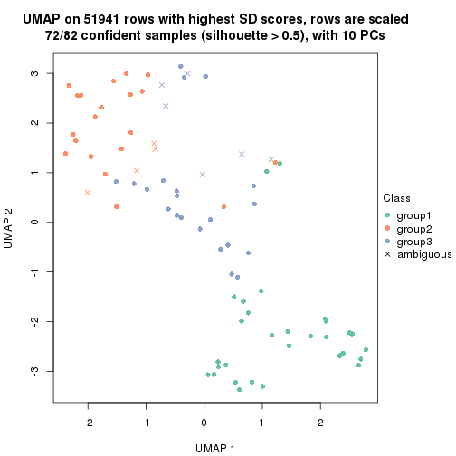</p>

</div>
<div id='tab-SD-pam-dimension-reduction-3'>
<pre><code class="r">dimension_reduction(res, k = 4, method = &quot;UMAP&quot;)
</code></pre>

<p></p>

</div>
<div id='tab-SD-pam-dimension-reduction-4'>
<pre><code class="r">dimension_reduction(res, k = 5, method = &quot;UMAP&quot;)
</code></pre>

<p></p>

</div>
<div id='tab-SD-pam-dimension-reduction-5'>
<pre><code class="r">dimension_reduction(res, k = 6, method = &quot;UMAP&quot;)
</code></pre>

<p></p>

</div>
</div>


Following heatmap shows how subgroups are split when increasing `k`:

```r
collect_classes(res)
```


Test correlation between subgroups and known annotations. If the known
annotation is numeric, one-way ANOVA test is applied, and if the known
annotation is discrete, chi-squared contingency table test is applied.

```r
test_to_known_factors(res)
```

```
#>         n disease.state(p) specimen(p) individual(p) k
#> SD:pam 80         1.22e-04    3.27e-17         0.999 2
#> SD:pam 72         3.33e-06    5.09e-15         0.850 3
#> SD:pam 62         4.24e-06    2.20e-16         0.472 4
#> SD:pam 68         1.60e-10    2.74e-21         0.794 5
#> SD:pam 71         1.55e-10    3.32e-21         0.530 6
```


If matrix rows can be associated to genes, consider to use `GO_Enrichment(res,
...)` to perform function enrichment for the signature genes.


 

---------------------------------------------------


### SD:mclust**


The object with results only for a single top-value method and a single partition method 
can be extracted as:

```r
res = res_list["SD", "mclust"]
# you can also extract it by
# res = res_list["SD:mclust"]
```

A summary of `res` and all the functions that can be applied to it:

```r
res
```

```
#> A 'ConsensusPartition' object with k = 2, 3, 4, 5, 6.
#>   On a matrix with 51941 rows and 82 columns.
#>   Top rows (1000, 2000, 3000, 4000, 5000) are extracted by 'SD' method.
#>   Subgroups are detected by 'mclust' method.
#>   Performed in total 1250 partitions by row resampling.
#>   Best k for subgroups seems to be 2.
#> 
#> Following methods can be applied to this 'ConsensusPartition' object:
#>  [1] "cola_report"             "collect_classes"         "collect_plots"          
#>  [4] "collect_stats"           "colnames"                "compare_signatures"     
#>  [7] "consensus_heatmap"       "dimension_reduction"     "functional_enrichment"  
#> [10] "get_anno_col"            "get_anno"                "get_classes"            
#> [13] "get_consensus"           "get_matrix"              "get_membership"         
#> [16] "get_param"               "get_signatures"          "get_stats"              
#> [19] "is_best_k"               "is_stable_k"             "membership_heatmap"     
#> [22] "ncol"                    "nrow"                    "plot_ecdf"              
#> [25] "rownames"                "select_partition_number" "show"                   
#> [28] "suggest_best_k"          "test_to_known_factors"
```

`collect_plots()` function collects all the plots made from `res` for all `k` (number of partitions)
into one single page to provide an easy and fast comparison between different `k`.

```r
collect_plots(res)
```


The plots are:

- The first row: a plot of the ECDF (Empirical cumulative distribution
  function) curves of the consensus matrix for each `k` and the heatmap of
  predicted classes for each `k`.
- The second row: heatmaps of the consensus matrix for each `k`.
- The third row: heatmaps of the membership matrix for each `k`.
- The fouth row: heatmaps of the signatures for each `k`.

All the plots in panels can be made by individual functions and they are
plotted later in this section.

`select_partition_number()` produces several plots showing different
statistics for choosing "optimized" `k`. There are following statistics:

- ECDF curves of the consensus matrix for each `k`;
- 1-PAC. [The PAC
  score](https://en.wikipedia.org/wiki/Consensus_clustering#Over-interpretation_potential_of_consensus_clustering)
  measures the proportion of the ambiguous subgrouping.
- Mean silhouette score.
- Concordance. The mean probability of fiting the consensus class ids in all
  partitions.
- Area increased. Denote $A_k$ as the area under the ECDF curve for current
  `k`, the area increased is defined as $A_k - A_{k-1}$.
- Rand index. The percent of pairs of samples that are both in a same cluster
  or both are not in a same cluster in the partition of k and k-1.
- Jaccard index. The ratio of pairs of samples are both in a same cluster in
  the partition of k and k-1 and the pairs of samples are both in a same
  cluster in the partition k or k-1.

The detailed explanations of these statistics can be found in [the cola
vignette](http://bioconductor.org/packages/devel/bioc/vignettes/cola/inst/doc/cola.html#toc_13).

Generally speaking, lower PAC score, higher mean silhouette score or higher
concordance corresponds to better partition. Rand index and Jaccard index
measure how similar the current partition is compared to partition with `k-1`.
If they are too similar, we won't accept `k` is better than `k-1`.

```r
select_partition_number(res)
```


The numeric values for all these statistics can be obtained by `get_stats()`.

```r
get_stats(res)
```

```
#>   k 1-PAC mean_silhouette concordance area_increased  Rand Jaccard
#> 2 2 1.000           0.965       0.987         0.4696 0.537   0.537
#> 3 3 0.737           0.758       0.836         0.3757 0.790   0.610
#> 4 4 0.789           0.869       0.852         0.1206 0.896   0.701
#> 5 5 0.680           0.700       0.806         0.0657 0.965   0.872
#> 6 6 0.770           0.614       0.793         0.0484 0.907   0.646
```

`suggest_best_k()` suggests the best $k$ based on these statistics. The rules are as follows:

- All $k$ with Jaccard index larger than 0.95 are removed because the increase of
  the partition number does not provides enough extra information. If all $k$ are removed,
  the best $k$ is assigned by `NA`.
- For $k$ with 1-PAC larger than 0.9, the maximal $k$ is taken as the "best k". Other $k$ is called "optional k".
- If it does not fit the second rule. The $k$ with the highest vote of highest
  1-PAC, mean silhouette and concordance is taken as the "best k".

```r
suggest_best_k(res)
```

```
#> [1] 2
```


Following shows the table of the partitions (You need to click the **show/hide
code output** link to see it). The membership matrix (columns with name `p*`)
is inferred by
[`clue::cl_consensus()`](https://www.rdocumentation.org/link/cl_consensus?package=clue)
function with the `SE` method. Basically the value in the membership matrix
represents the probability to belong to a certain group. The finall class
label for an item is determined with the group with highest probability it
belongs to.

In `get_classes()` function, the entropy is calculated from the membership
matrix and the silhouette score is calculated from the consensus matrix.


<script>
$( function() {
	$( '#tabs-SD-mclust-get-classes' ).tabs();
} );
</script>
<div id='tabs-SD-mclust-get-classes'>
<ul>
<li><a href='#tab-SD-mclust-get-classes-1'>k = 2</a></li>
<li><a href='#tab-SD-mclust-get-classes-2'>k = 3</a></li>
<li><a href='#tab-SD-mclust-get-classes-3'>k = 4</a></li>
<li><a href='#tab-SD-mclust-get-classes-4'>k = 5</a></li>
<li><a href='#tab-SD-mclust-get-classes-5'>k = 6</a></li>
</ul>

<div id='tab-SD-mclust-get-classes-1'>
<p><a id='tab-SD-mclust-get-classes-1-a' style='color:#0366d6' href='#'>show/hide code output</a></p>
<pre><code class="r">cbind(get_classes(res, k = 2), get_membership(res, k = 2))
</code></pre>

<pre><code>#&gt;           class entropy silhouette    p1    p2
#&gt; GSM372286     2  0.0000      0.980 0.000 1.000
#&gt; GSM372287     2  0.0000      0.980 0.000 1.000
#&gt; GSM372288     2  0.0000      0.980 0.000 1.000
#&gt; GSM372289     2  0.0000      0.980 0.000 1.000
#&gt; GSM372290     2  0.0000      0.980 0.000 1.000
#&gt; GSM372291     2  0.1184      0.966 0.016 0.984
#&gt; GSM372292     2  0.0000      0.980 0.000 1.000
#&gt; GSM372293     2  0.0000      0.980 0.000 1.000
#&gt; GSM372294     2  0.0000      0.980 0.000 1.000
#&gt; GSM372295     2  0.0000      0.980 0.000 1.000
#&gt; GSM372296     2  0.0000      0.980 0.000 1.000
#&gt; GSM372297     2  0.0000      0.980 0.000 1.000
#&gt; GSM372298     2  0.0000      0.980 0.000 1.000
#&gt; GSM372299     2  0.0000      0.980 0.000 1.000
#&gt; GSM372300     2  0.0000      0.980 0.000 1.000
#&gt; GSM372301     2  0.0000      0.980 0.000 1.000
#&gt; GSM372302     2  0.0000      0.980 0.000 1.000
#&gt; GSM372303     2  0.0000      0.980 0.000 1.000
#&gt; GSM372304     2  0.0000      0.980 0.000 1.000
#&gt; GSM372305     2  0.0000      0.980 0.000 1.000
#&gt; GSM372306     2  0.0000      0.980 0.000 1.000
#&gt; GSM372307     2  0.0000      0.980 0.000 1.000
#&gt; GSM372309     2  0.0000      0.980 0.000 1.000
#&gt; GSM372311     2  0.0000      0.980 0.000 1.000
#&gt; GSM372313     2  0.0000      0.980 0.000 1.000
#&gt; GSM372315     2  0.0000      0.980 0.000 1.000
#&gt; GSM372317     2  0.0000      0.980 0.000 1.000
#&gt; GSM372319     2  0.0000      0.980 0.000 1.000
#&gt; GSM372321     2  0.0000      0.980 0.000 1.000
#&gt; GSM372323     2  0.0000      0.980 0.000 1.000
#&gt; GSM372326     2  0.0000      0.980 0.000 1.000
#&gt; GSM372328     2  0.0000      0.980 0.000 1.000
#&gt; GSM372330     2  0.0000      0.980 0.000 1.000
#&gt; GSM372332     2  0.0000      0.980 0.000 1.000
#&gt; GSM372335     2  0.0000      0.980 0.000 1.000
#&gt; GSM372337     2  0.0000      0.980 0.000 1.000
#&gt; GSM372339     2  0.0000      0.980 0.000 1.000
#&gt; GSM372341     2  0.0000      0.980 0.000 1.000
#&gt; GSM372343     2  0.0000      0.980 0.000 1.000
#&gt; GSM372345     2  0.0000      0.980 0.000 1.000
#&gt; GSM372347     2  0.0000      0.980 0.000 1.000
#&gt; GSM372349     2  0.0000      0.980 0.000 1.000
#&gt; GSM372351     2  0.0000      0.980 0.000 1.000
#&gt; GSM372353     2  0.0000      0.980 0.000 1.000
#&gt; GSM372355     2  0.0000      0.980 0.000 1.000
#&gt; GSM372357     2  0.0000      0.980 0.000 1.000
#&gt; GSM372359     2  0.0000      0.980 0.000 1.000
#&gt; GSM372361     2  0.0000      0.980 0.000 1.000
#&gt; GSM372363     2  0.0000      0.980 0.000 1.000
#&gt; GSM372308     1  0.0000      0.998 1.000 0.000
#&gt; GSM372310     1  0.0000      0.998 1.000 0.000
#&gt; GSM372312     2  0.9881      0.249 0.436 0.564
#&gt; GSM372314     1  0.0000      0.998 1.000 0.000
#&gt; GSM372316     1  0.0000      0.998 1.000 0.000
#&gt; GSM372318     1  0.0000      0.998 1.000 0.000
#&gt; GSM372320     1  0.0000      0.998 1.000 0.000
#&gt; GSM372322     1  0.0000      0.998 1.000 0.000
#&gt; GSM372324     1  0.0938      0.987 0.988 0.012
#&gt; GSM372325     1  0.2603      0.953 0.956 0.044
#&gt; GSM372327     1  0.0000      0.998 1.000 0.000
#&gt; GSM372329     1  0.0000      0.998 1.000 0.000
#&gt; GSM372331     1  0.0000      0.998 1.000 0.000
#&gt; GSM372333     2  0.5629      0.840 0.132 0.868
#&gt; GSM372334     1  0.0000      0.998 1.000 0.000
#&gt; GSM372336     1  0.0000      0.998 1.000 0.000
#&gt; GSM372338     1  0.0000      0.998 1.000 0.000
#&gt; GSM372340     1  0.0000      0.998 1.000 0.000
#&gt; GSM372342     1  0.0000      0.998 1.000 0.000
#&gt; GSM372344     1  0.0000      0.998 1.000 0.000
#&gt; GSM372346     1  0.0000      0.998 1.000 0.000
#&gt; GSM372348     1  0.0000      0.998 1.000 0.000
#&gt; GSM372350     2  0.9881      0.249 0.436 0.564
#&gt; GSM372352     2  0.1633      0.958 0.024 0.976
#&gt; GSM372354     1  0.0000      0.998 1.000 0.000
#&gt; GSM372356     1  0.0000      0.998 1.000 0.000
#&gt; GSM372358     1  0.0000      0.998 1.000 0.000
#&gt; GSM372360     1  0.0000      0.998 1.000 0.000
#&gt; GSM372362     1  0.0000      0.998 1.000 0.000
#&gt; GSM372364     1  0.0000      0.998 1.000 0.000
#&gt; GSM372365     1  0.0000      0.998 1.000 0.000
#&gt; GSM372366     1  0.0000      0.998 1.000 0.000
#&gt; GSM372367     1  0.0000      0.998 1.000 0.000
</code></pre>

<script>
$('#tab-SD-mclust-get-classes-1-a').parent().next().next().hide();
$('#tab-SD-mclust-get-classes-1-a').click(function(){
  $('#tab-SD-mclust-get-classes-1-a').parent().next().next().toggle();
  return(false);
});
</script>
</div>

<div id='tab-SD-mclust-get-classes-2'>
<p><a id='tab-SD-mclust-get-classes-2-a' style='color:#0366d6' href='#'>show/hide code output</a></p>
<pre><code class="r">cbind(get_classes(res, k = 3), get_membership(res, k = 3))
</code></pre>

<pre><code>#&gt;           class entropy silhouette    p1    p2    p3
#&gt; GSM372286     3  0.6111     0.5012 0.000 0.396 0.604
#&gt; GSM372287     2  0.0000     0.7442 0.000 1.000 0.000
#&gt; GSM372288     2  0.3038     0.7637 0.000 0.896 0.104
#&gt; GSM372289     2  0.4121     0.7500 0.000 0.832 0.168
#&gt; GSM372290     2  0.4121     0.7500 0.000 0.832 0.168
#&gt; GSM372291     2  0.1031     0.7339 0.000 0.976 0.024
#&gt; GSM372292     2  0.4062     0.7517 0.000 0.836 0.164
#&gt; GSM372293     2  0.4887     0.6841 0.000 0.772 0.228
#&gt; GSM372294     2  0.0000     0.7442 0.000 1.000 0.000
#&gt; GSM372295     2  0.0000     0.7442 0.000 1.000 0.000
#&gt; GSM372296     2  0.4178     0.7471 0.000 0.828 0.172
#&gt; GSM372297     2  0.0000     0.7442 0.000 1.000 0.000
#&gt; GSM372298     2  0.2878     0.7641 0.000 0.904 0.096
#&gt; GSM372299     2  0.1031     0.7339 0.000 0.976 0.024
#&gt; GSM372300     2  0.4555     0.7204 0.000 0.800 0.200
#&gt; GSM372301     2  0.4235     0.7446 0.000 0.824 0.176
#&gt; GSM372302     2  0.2448     0.7623 0.000 0.924 0.076
#&gt; GSM372303     2  0.4235     0.7475 0.000 0.824 0.176
#&gt; GSM372304     2  0.0000     0.7442 0.000 1.000 0.000
#&gt; GSM372305     3  0.0592     0.7248 0.000 0.012 0.988
#&gt; GSM372306     3  0.0424     0.7230 0.000 0.008 0.992
#&gt; GSM372307     2  0.4504     0.7260 0.000 0.804 0.196
#&gt; GSM372309     3  0.0592     0.7248 0.000 0.012 0.988
#&gt; GSM372311     3  0.0592     0.7248 0.000 0.012 0.988
#&gt; GSM372313     3  0.0592     0.7248 0.000 0.012 0.988
#&gt; GSM372315     2  0.6286     0.0164 0.000 0.536 0.464
#&gt; GSM372317     3  0.0592     0.7248 0.000 0.012 0.988
#&gt; GSM372319     3  0.5810     0.6182 0.000 0.336 0.664
#&gt; GSM372321     3  0.5810     0.6182 0.000 0.336 0.664
#&gt; GSM372323     3  0.5810     0.6182 0.000 0.336 0.664
#&gt; GSM372326     3  0.5810     0.6182 0.000 0.336 0.664
#&gt; GSM372328     3  0.5882     0.5984 0.000 0.348 0.652
#&gt; GSM372330     3  0.0592     0.7248 0.000 0.012 0.988
#&gt; GSM372332     3  0.5926     0.5835 0.000 0.356 0.644
#&gt; GSM372335     3  0.0424     0.7230 0.000 0.008 0.992
#&gt; GSM372337     3  0.5810     0.6182 0.000 0.336 0.664
#&gt; GSM372339     3  0.5810     0.6182 0.000 0.336 0.664
#&gt; GSM372341     3  0.5810     0.6182 0.000 0.336 0.664
#&gt; GSM372343     3  0.5810     0.6182 0.000 0.336 0.664
#&gt; GSM372345     3  0.5810     0.6182 0.000 0.336 0.664
#&gt; GSM372347     3  0.0000     0.7211 0.000 0.000 1.000
#&gt; GSM372349     3  0.6154     0.4674 0.000 0.408 0.592
#&gt; GSM372351     3  0.5835     0.6154 0.000 0.340 0.660
#&gt; GSM372353     3  0.1163     0.7046 0.000 0.028 0.972
#&gt; GSM372355     3  0.0592     0.7248 0.000 0.012 0.988
#&gt; GSM372357     3  0.0237     0.7221 0.000 0.004 0.996
#&gt; GSM372359     3  0.0424     0.7230 0.000 0.008 0.992
#&gt; GSM372361     2  0.4504     0.7256 0.000 0.804 0.196
#&gt; GSM372363     3  0.0592     0.7248 0.000 0.012 0.988
#&gt; GSM372308     1  0.0000     0.9923 1.000 0.000 0.000
#&gt; GSM372310     1  0.0000     0.9923 1.000 0.000 0.000
#&gt; GSM372312     2  0.7164     0.1179 0.452 0.524 0.024
#&gt; GSM372314     1  0.0237     0.9891 0.996 0.000 0.004
#&gt; GSM372316     1  0.0000     0.9923 1.000 0.000 0.000
#&gt; GSM372318     1  0.0237     0.9895 0.996 0.004 0.000
#&gt; GSM372320     1  0.0000     0.9923 1.000 0.000 0.000
#&gt; GSM372322     1  0.0000     0.9923 1.000 0.000 0.000
#&gt; GSM372324     1  0.3755     0.8737 0.872 0.120 0.008
#&gt; GSM372325     1  0.2680     0.9264 0.924 0.068 0.008
#&gt; GSM372327     1  0.0000     0.9923 1.000 0.000 0.000
#&gt; GSM372329     1  0.0000     0.9923 1.000 0.000 0.000
#&gt; GSM372331     1  0.0000     0.9923 1.000 0.000 0.000
#&gt; GSM372333     3  0.9626     0.2537 0.264 0.264 0.472
#&gt; GSM372334     1  0.0000     0.9923 1.000 0.000 0.000
#&gt; GSM372336     1  0.0000     0.9923 1.000 0.000 0.000
#&gt; GSM372338     1  0.0000     0.9923 1.000 0.000 0.000
#&gt; GSM372340     1  0.0000     0.9923 1.000 0.000 0.000
#&gt; GSM372342     1  0.0000     0.9923 1.000 0.000 0.000
#&gt; GSM372344     1  0.0892     0.9771 0.980 0.020 0.000
#&gt; GSM372346     1  0.0000     0.9923 1.000 0.000 0.000
#&gt; GSM372348     1  0.0000     0.9923 1.000 0.000 0.000
#&gt; GSM372350     2  0.7164     0.1179 0.452 0.524 0.024
#&gt; GSM372352     2  0.7722    -0.2136 0.048 0.520 0.432
#&gt; GSM372354     1  0.0000     0.9923 1.000 0.000 0.000
#&gt; GSM372356     1  0.0000     0.9923 1.000 0.000 0.000
#&gt; GSM372358     1  0.0000     0.9923 1.000 0.000 0.000
#&gt; GSM372360     1  0.0000     0.9923 1.000 0.000 0.000
#&gt; GSM372362     1  0.0000     0.9923 1.000 0.000 0.000
#&gt; GSM372364     1  0.0000     0.9923 1.000 0.000 0.000
#&gt; GSM372365     1  0.0000     0.9923 1.000 0.000 0.000
#&gt; GSM372366     1  0.0000     0.9923 1.000 0.000 0.000
#&gt; GSM372367     1  0.0000     0.9923 1.000 0.000 0.000
</code></pre>

<script>
$('#tab-SD-mclust-get-classes-2-a').parent().next().next().hide();
$('#tab-SD-mclust-get-classes-2-a').click(function(){
  $('#tab-SD-mclust-get-classes-2-a').parent().next().next().toggle();
  return(false);
});
</script>
</div>

<div id='tab-SD-mclust-get-classes-3'>
<p><a id='tab-SD-mclust-get-classes-3-a' style='color:#0366d6' href='#'>show/hide code output</a></p>
<pre><code class="r">cbind(get_classes(res, k = 4), get_membership(res, k = 4))
</code></pre>

<pre><code>#&gt;           class entropy silhouette    p1    p2    p3    p4
#&gt; GSM372286     2  0.6136      0.404 0.000 0.584 0.060 0.356
#&gt; GSM372287     4  0.2412      0.861 0.000 0.008 0.084 0.908
#&gt; GSM372288     4  0.1151      0.877 0.000 0.008 0.024 0.968
#&gt; GSM372289     4  0.0000      0.878 0.000 0.000 0.000 1.000
#&gt; GSM372290     4  0.1302      0.863 0.000 0.044 0.000 0.956
#&gt; GSM372291     4  0.4697      0.614 0.000 0.000 0.356 0.644
#&gt; GSM372292     4  0.0336      0.876 0.000 0.000 0.008 0.992
#&gt; GSM372293     4  0.4697      0.156 0.000 0.000 0.356 0.644
#&gt; GSM372294     4  0.3024      0.819 0.000 0.000 0.148 0.852
#&gt; GSM372295     4  0.2675      0.853 0.000 0.008 0.100 0.892
#&gt; GSM372296     4  0.0469      0.877 0.000 0.012 0.000 0.988
#&gt; GSM372297     4  0.2342      0.862 0.000 0.008 0.080 0.912
#&gt; GSM372298     4  0.0336      0.878 0.000 0.008 0.000 0.992
#&gt; GSM372299     4  0.5010      0.650 0.000 0.024 0.276 0.700
#&gt; GSM372300     4  0.0921      0.871 0.000 0.000 0.028 0.972
#&gt; GSM372301     4  0.0592      0.875 0.000 0.000 0.016 0.984
#&gt; GSM372302     4  0.0336      0.878 0.000 0.008 0.000 0.992
#&gt; GSM372303     4  0.1211      0.864 0.000 0.000 0.040 0.960
#&gt; GSM372304     4  0.2011      0.859 0.000 0.000 0.080 0.920
#&gt; GSM372305     2  0.0592      0.903 0.000 0.984 0.000 0.016
#&gt; GSM372306     2  0.0000      0.907 0.000 1.000 0.000 0.000
#&gt; GSM372307     4  0.1637      0.854 0.000 0.060 0.000 0.940
#&gt; GSM372309     2  0.0817      0.887 0.000 0.976 0.000 0.024
#&gt; GSM372311     2  0.0592      0.903 0.000 0.984 0.000 0.016
#&gt; GSM372313     2  0.2483      0.853 0.000 0.916 0.032 0.052
#&gt; GSM372315     4  0.3982      0.653 0.000 0.220 0.004 0.776
#&gt; GSM372317     2  0.0000      0.907 0.000 1.000 0.000 0.000
#&gt; GSM372319     3  0.6457      0.939 0.000 0.156 0.644 0.200
#&gt; GSM372321     3  0.6457      0.939 0.000 0.156 0.644 0.200
#&gt; GSM372323     3  0.6457      0.939 0.000 0.156 0.644 0.200
#&gt; GSM372326     3  0.7227      0.845 0.000 0.256 0.544 0.200
#&gt; GSM372328     3  0.6449      0.939 0.000 0.152 0.644 0.204
#&gt; GSM372330     2  0.0336      0.906 0.000 0.992 0.000 0.008
#&gt; GSM372332     3  0.6028      0.846 0.000 0.076 0.644 0.280
#&gt; GSM372335     2  0.0000      0.907 0.000 1.000 0.000 0.000
#&gt; GSM372337     3  0.6457      0.939 0.000 0.156 0.644 0.200
#&gt; GSM372339     3  0.6449      0.939 0.000 0.152 0.644 0.204
#&gt; GSM372341     3  0.6449      0.939 0.000 0.152 0.644 0.204
#&gt; GSM372343     3  0.6449      0.939 0.000 0.152 0.644 0.204
#&gt; GSM372345     3  0.6457      0.939 0.000 0.156 0.644 0.200
#&gt; GSM372347     2  0.0000      0.907 0.000 1.000 0.000 0.000
#&gt; GSM372349     3  0.4888      0.594 0.000 0.000 0.588 0.412
#&gt; GSM372351     3  0.7277      0.838 0.000 0.260 0.536 0.204
#&gt; GSM372353     2  0.0000      0.907 0.000 1.000 0.000 0.000
#&gt; GSM372355     2  0.0469      0.905 0.000 0.988 0.000 0.012
#&gt; GSM372357     2  0.0000      0.907 0.000 1.000 0.000 0.000
#&gt; GSM372359     2  0.0000      0.907 0.000 1.000 0.000 0.000
#&gt; GSM372361     4  0.1474      0.859 0.000 0.052 0.000 0.948
#&gt; GSM372363     2  0.0592      0.903 0.000 0.984 0.000 0.016
#&gt; GSM372308     1  0.0000      0.965 1.000 0.000 0.000 0.000
#&gt; GSM372310     1  0.0000      0.965 1.000 0.000 0.000 0.000
#&gt; GSM372312     1  0.6549      0.498 0.556 0.000 0.356 0.088
#&gt; GSM372314     1  0.0000      0.965 1.000 0.000 0.000 0.000
#&gt; GSM372316     1  0.0000      0.965 1.000 0.000 0.000 0.000
#&gt; GSM372318     1  0.0336      0.960 0.992 0.000 0.008 0.000
#&gt; GSM372320     1  0.0000      0.965 1.000 0.000 0.000 0.000
#&gt; GSM372322     1  0.0000      0.965 1.000 0.000 0.000 0.000
#&gt; GSM372324     1  0.2345      0.889 0.900 0.000 0.100 0.000
#&gt; GSM372325     1  0.4364      0.802 0.808 0.056 0.136 0.000
#&gt; GSM372327     1  0.0000      0.965 1.000 0.000 0.000 0.000
#&gt; GSM372329     1  0.0000      0.965 1.000 0.000 0.000 0.000
#&gt; GSM372331     1  0.0000      0.965 1.000 0.000 0.000 0.000
#&gt; GSM372333     2  0.7368      0.587 0.144 0.616 0.204 0.036
#&gt; GSM372334     1  0.0000      0.965 1.000 0.000 0.000 0.000
#&gt; GSM372336     1  0.0000      0.965 1.000 0.000 0.000 0.000
#&gt; GSM372338     1  0.0000      0.965 1.000 0.000 0.000 0.000
#&gt; GSM372340     1  0.0000      0.965 1.000 0.000 0.000 0.000
#&gt; GSM372342     1  0.0000      0.965 1.000 0.000 0.000 0.000
#&gt; GSM372344     1  0.0336      0.960 0.992 0.000 0.008 0.000
#&gt; GSM372346     1  0.0000      0.965 1.000 0.000 0.000 0.000
#&gt; GSM372348     1  0.0000      0.965 1.000 0.000 0.000 0.000
#&gt; GSM372350     1  0.6549      0.498 0.556 0.000 0.356 0.088
#&gt; GSM372352     2  0.6285      0.611 0.000 0.624 0.284 0.092
#&gt; GSM372354     1  0.0000      0.965 1.000 0.000 0.000 0.000
#&gt; GSM372356     1  0.0000      0.965 1.000 0.000 0.000 0.000
#&gt; GSM372358     1  0.0000      0.965 1.000 0.000 0.000 0.000
#&gt; GSM372360     1  0.0000      0.965 1.000 0.000 0.000 0.000
#&gt; GSM372362     1  0.0000      0.965 1.000 0.000 0.000 0.000
#&gt; GSM372364     1  0.0000      0.965 1.000 0.000 0.000 0.000
#&gt; GSM372365     1  0.0188      0.962 0.996 0.000 0.004 0.000
#&gt; GSM372366     1  0.0000      0.965 1.000 0.000 0.000 0.000
#&gt; GSM372367     1  0.0000      0.965 1.000 0.000 0.000 0.000
</code></pre>

<script>
$('#tab-SD-mclust-get-classes-3-a').parent().next().next().hide();
$('#tab-SD-mclust-get-classes-3-a').click(function(){
  $('#tab-SD-mclust-get-classes-3-a').parent().next().next().toggle();
  return(false);
});
</script>
</div>

<div id='tab-SD-mclust-get-classes-4'>
<p><a id='tab-SD-mclust-get-classes-4-a' style='color:#0366d6' href='#'>show/hide code output</a></p>
<pre><code class="r">cbind(get_classes(res, k = 5), get_membership(res, k = 5))
</code></pre>

<pre><code>#&gt;           class entropy silhouette    p1    p2    p3    p4    p5
#&gt; GSM372286     2  0.3916      0.573 0.000 0.732 0.000 0.256 0.012
#&gt; GSM372287     4  0.2074      0.657 0.000 0.000 0.000 0.896 0.104
#&gt; GSM372288     4  0.0566      0.702 0.000 0.004 0.000 0.984 0.012
#&gt; GSM372289     4  0.1478      0.698 0.000 0.064 0.000 0.936 0.000
#&gt; GSM372290     4  0.3210      0.691 0.000 0.212 0.000 0.788 0.000
#&gt; GSM372291     5  0.4640      0.537 0.000 0.000 0.048 0.256 0.696
#&gt; GSM372292     4  0.4099      0.695 0.000 0.200 0.032 0.764 0.004
#&gt; GSM372293     4  0.3966      0.475 0.000 0.000 0.336 0.664 0.000
#&gt; GSM372294     4  0.3670      0.626 0.000 0.060 0.008 0.832 0.100
#&gt; GSM372295     4  0.3115      0.641 0.000 0.000 0.036 0.852 0.112
#&gt; GSM372296     4  0.3003      0.703 0.000 0.188 0.000 0.812 0.000
#&gt; GSM372297     4  0.2074      0.657 0.000 0.000 0.000 0.896 0.104
#&gt; GSM372298     4  0.0162      0.703 0.000 0.004 0.000 0.996 0.000
#&gt; GSM372299     4  0.6852      0.239 0.000 0.336 0.048 0.504 0.112
#&gt; GSM372300     4  0.5164      0.675 0.000 0.172 0.112 0.708 0.008
#&gt; GSM372301     4  0.4868      0.685 0.000 0.128 0.124 0.740 0.008
#&gt; GSM372302     4  0.1270      0.721 0.000 0.052 0.000 0.948 0.000
#&gt; GSM372303     4  0.5166      0.619 0.000 0.108 0.212 0.680 0.000
#&gt; GSM372304     4  0.2020      0.661 0.000 0.000 0.000 0.900 0.100
#&gt; GSM372305     2  0.1195      0.846 0.000 0.960 0.012 0.028 0.000
#&gt; GSM372306     2  0.0703      0.846 0.000 0.976 0.024 0.000 0.000
#&gt; GSM372307     4  0.4138      0.461 0.000 0.384 0.000 0.616 0.000
#&gt; GSM372309     2  0.0000      0.852 0.000 1.000 0.000 0.000 0.000
#&gt; GSM372311     2  0.1197      0.833 0.000 0.952 0.000 0.048 0.000
#&gt; GSM372313     2  0.0955      0.846 0.000 0.968 0.004 0.000 0.028
#&gt; GSM372315     2  0.4302     -0.148 0.000 0.520 0.000 0.480 0.000
#&gt; GSM372317     2  0.0510      0.849 0.000 0.984 0.016 0.000 0.000
#&gt; GSM372319     3  0.4276      0.874 0.000 0.168 0.764 0.068 0.000
#&gt; GSM372321     3  0.4049      0.876 0.000 0.164 0.780 0.056 0.000
#&gt; GSM372323     3  0.3616      0.869 0.000 0.164 0.804 0.032 0.000
#&gt; GSM372326     3  0.3876      0.851 0.000 0.192 0.776 0.032 0.000
#&gt; GSM372328     3  0.3526      0.862 0.000 0.096 0.832 0.072 0.000
#&gt; GSM372330     2  0.0609      0.847 0.000 0.980 0.000 0.020 0.000
#&gt; GSM372332     3  0.3283      0.772 0.000 0.028 0.832 0.140 0.000
#&gt; GSM372335     2  0.0404      0.851 0.000 0.988 0.012 0.000 0.000
#&gt; GSM372337     3  0.3656      0.868 0.000 0.168 0.800 0.032 0.000
#&gt; GSM372339     3  0.3527      0.874 0.000 0.116 0.828 0.056 0.000
#&gt; GSM372341     3  0.3442      0.869 0.000 0.104 0.836 0.060 0.000
#&gt; GSM372343     3  0.3622      0.877 0.000 0.124 0.820 0.056 0.000
#&gt; GSM372345     3  0.3694      0.866 0.000 0.172 0.796 0.032 0.000
#&gt; GSM372347     2  0.4130      0.624 0.000 0.696 0.292 0.000 0.012
#&gt; GSM372349     3  0.4562     -0.102 0.000 0.008 0.496 0.496 0.000
#&gt; GSM372351     3  0.5109      0.822 0.000 0.172 0.696 0.132 0.000
#&gt; GSM372353     2  0.1608      0.824 0.000 0.928 0.072 0.000 0.000
#&gt; GSM372355     2  0.0000      0.852 0.000 1.000 0.000 0.000 0.000
#&gt; GSM372357     2  0.0162      0.852 0.000 0.996 0.004 0.000 0.000
#&gt; GSM372359     2  0.0162      0.852 0.000 0.996 0.004 0.000 0.000
#&gt; GSM372361     4  0.3857      0.600 0.000 0.312 0.000 0.688 0.000
#&gt; GSM372363     2  0.1197      0.833 0.000 0.952 0.000 0.048 0.000
#&gt; GSM372308     1  0.5510      0.590 0.648 0.000 0.144 0.000 0.208
#&gt; GSM372310     1  0.5296      0.623 0.676 0.000 0.144 0.000 0.180
#&gt; GSM372312     5  0.4190      0.677 0.140 0.000 0.012 0.056 0.792
#&gt; GSM372314     1  0.5329      0.619 0.672 0.000 0.144 0.000 0.184
#&gt; GSM372316     1  0.0162      0.796 0.996 0.000 0.000 0.000 0.004
#&gt; GSM372318     1  0.3838      0.567 0.716 0.000 0.004 0.000 0.280
#&gt; GSM372320     1  0.2583      0.766 0.864 0.000 0.004 0.000 0.132
#&gt; GSM372322     1  0.2424      0.768 0.868 0.000 0.000 0.000 0.132
#&gt; GSM372324     1  0.5486      0.633 0.684 0.012 0.132 0.000 0.172
#&gt; GSM372325     1  0.6075      0.549 0.612 0.012 0.160 0.000 0.216
#&gt; GSM372327     1  0.2424      0.768 0.868 0.000 0.000 0.000 0.132
#&gt; GSM372329     1  0.2424      0.768 0.868 0.000 0.000 0.000 0.132
#&gt; GSM372331     1  0.2966      0.724 0.816 0.000 0.000 0.000 0.184
#&gt; GSM372333     2  0.6564      0.424 0.028 0.548 0.292 0.000 0.132
#&gt; GSM372334     1  0.2583      0.766 0.864 0.000 0.004 0.000 0.132
#&gt; GSM372336     1  0.0290      0.796 0.992 0.000 0.008 0.000 0.000
#&gt; GSM372338     1  0.2583      0.766 0.864 0.000 0.004 0.000 0.132
#&gt; GSM372340     1  0.2424      0.768 0.868 0.000 0.000 0.000 0.132
#&gt; GSM372342     1  0.2424      0.768 0.868 0.000 0.000 0.000 0.132
#&gt; GSM372344     1  0.4410      0.289 0.556 0.000 0.004 0.000 0.440
#&gt; GSM372346     1  0.3395      0.658 0.764 0.000 0.000 0.000 0.236
#&gt; GSM372348     1  0.0794      0.794 0.972 0.000 0.028 0.000 0.000
#&gt; GSM372350     5  0.3634      0.690 0.080 0.000 0.020 0.056 0.844
#&gt; GSM372352     2  0.6762      0.457 0.000 0.556 0.276 0.056 0.112
#&gt; GSM372354     1  0.0000      0.797 1.000 0.000 0.000 0.000 0.000
#&gt; GSM372356     1  0.4194      0.701 0.780 0.000 0.132 0.000 0.088
#&gt; GSM372358     1  0.0162      0.797 0.996 0.000 0.004 0.000 0.000
#&gt; GSM372360     1  0.0609      0.795 0.980 0.000 0.020 0.000 0.000
#&gt; GSM372362     1  0.0000      0.797 1.000 0.000 0.000 0.000 0.000
#&gt; GSM372364     1  0.0794      0.794 0.972 0.000 0.028 0.000 0.000
#&gt; GSM372365     1  0.5159      0.633 0.692 0.000 0.144 0.000 0.164
#&gt; GSM372366     1  0.0000      0.797 1.000 0.000 0.000 0.000 0.000
#&gt; GSM372367     1  0.5329      0.619 0.672 0.000 0.144 0.000 0.184
</code></pre>

<script>
$('#tab-SD-mclust-get-classes-4-a').parent().next().next().hide();
$('#tab-SD-mclust-get-classes-4-a').click(function(){
  $('#tab-SD-mclust-get-classes-4-a').parent().next().next().toggle();
  return(false);
});
</script>
</div>

<div id='tab-SD-mclust-get-classes-5'>
<p><a id='tab-SD-mclust-get-classes-5-a' style='color:#0366d6' href='#'>show/hide code output</a></p>
<pre><code class="r">cbind(get_classes(res, k = 6), get_membership(res, k = 6))
</code></pre>

<pre><code>#&gt;           class entropy silhouette    p1    p2    p3    p4    p5    p6
#&gt; GSM372286     2  0.3866    -0.1202 0.000 0.516 0.000 0.000 0.000 0.484
#&gt; GSM372287     4  0.3843     0.8729 0.000 0.000 0.000 0.548 0.000 0.452
#&gt; GSM372288     6  0.3823    -0.6774 0.000 0.000 0.000 0.436 0.000 0.564
#&gt; GSM372289     6  0.4367    -0.4875 0.000 0.032 0.000 0.364 0.000 0.604
#&gt; GSM372290     6  0.1866     0.5748 0.000 0.084 0.000 0.008 0.000 0.908
#&gt; GSM372291     4  0.3284     0.5989 0.000 0.000 0.000 0.784 0.020 0.196
#&gt; GSM372292     6  0.2002     0.5798 0.000 0.076 0.012 0.004 0.000 0.908
#&gt; GSM372293     6  0.4355     0.4942 0.000 0.024 0.156 0.052 0.008 0.760
#&gt; GSM372294     6  0.4083    -0.7215 0.000 0.000 0.008 0.460 0.000 0.532
#&gt; GSM372295     4  0.4136     0.8491 0.000 0.000 0.000 0.560 0.012 0.428
#&gt; GSM372296     6  0.1802     0.5697 0.000 0.072 0.000 0.012 0.000 0.916
#&gt; GSM372297     4  0.3843     0.8729 0.000 0.000 0.000 0.548 0.000 0.452
#&gt; GSM372298     6  0.3101    -0.0759 0.000 0.000 0.000 0.244 0.000 0.756
#&gt; GSM372299     6  0.2825     0.5179 0.000 0.008 0.016 0.024 0.076 0.876
#&gt; GSM372300     6  0.3379     0.5816 0.000 0.072 0.028 0.044 0.008 0.848
#&gt; GSM372301     6  0.2965     0.5837 0.000 0.076 0.024 0.036 0.000 0.864
#&gt; GSM372302     6  0.1863     0.3458 0.000 0.000 0.000 0.104 0.000 0.896
#&gt; GSM372303     6  0.3714     0.5768 0.000 0.072 0.036 0.056 0.008 0.828
#&gt; GSM372304     4  0.3843     0.8729 0.000 0.000 0.000 0.548 0.000 0.452
#&gt; GSM372305     2  0.0363     0.8646 0.000 0.988 0.000 0.000 0.000 0.012
#&gt; GSM372306     2  0.0291     0.8686 0.000 0.992 0.004 0.004 0.000 0.000
#&gt; GSM372307     6  0.3774     0.4651 0.000 0.328 0.000 0.008 0.000 0.664
#&gt; GSM372309     2  0.0291     0.8689 0.000 0.992 0.000 0.004 0.000 0.004
#&gt; GSM372311     2  0.0363     0.8646 0.000 0.988 0.000 0.000 0.000 0.012
#&gt; GSM372313     2  0.0000     0.8695 0.000 1.000 0.000 0.000 0.000 0.000
#&gt; GSM372315     6  0.3789     0.3200 0.000 0.416 0.000 0.000 0.000 0.584
#&gt; GSM372317     2  0.0146     0.8695 0.000 0.996 0.000 0.004 0.000 0.000
#&gt; GSM372319     3  0.0858     0.9202 0.000 0.028 0.968 0.000 0.004 0.000
#&gt; GSM372321     3  0.0458     0.9198 0.000 0.016 0.984 0.000 0.000 0.000
#&gt; GSM372323     3  0.1265     0.9157 0.000 0.044 0.948 0.008 0.000 0.000
#&gt; GSM372326     3  0.1333     0.9134 0.000 0.048 0.944 0.008 0.000 0.000
#&gt; GSM372328     3  0.2260     0.8963 0.000 0.000 0.860 0.140 0.000 0.000
#&gt; GSM372330     2  0.0146     0.8686 0.000 0.996 0.000 0.000 0.000 0.004
#&gt; GSM372332     3  0.2219     0.8980 0.000 0.000 0.864 0.136 0.000 0.000
#&gt; GSM372335     2  0.0692     0.8609 0.000 0.976 0.020 0.004 0.000 0.000
#&gt; GSM372337     3  0.1265     0.9157 0.000 0.044 0.948 0.008 0.000 0.000
#&gt; GSM372339     3  0.2704     0.9015 0.000 0.016 0.844 0.140 0.000 0.000
#&gt; GSM372341     3  0.2260     0.8963 0.000 0.000 0.860 0.140 0.000 0.000
#&gt; GSM372343     3  0.2613     0.9008 0.000 0.012 0.848 0.140 0.000 0.000
#&gt; GSM372345     3  0.1462     0.9085 0.000 0.056 0.936 0.008 0.000 0.000
#&gt; GSM372347     2  0.4655     0.6519 0.000 0.720 0.184 0.032 0.064 0.000
#&gt; GSM372349     6  0.6529     0.2162 0.000 0.072 0.352 0.104 0.004 0.468
#&gt; GSM372351     3  0.0777     0.9206 0.000 0.024 0.972 0.000 0.004 0.000
#&gt; GSM372353     2  0.0692     0.8597 0.000 0.976 0.020 0.004 0.000 0.000
#&gt; GSM372355     2  0.0000     0.8695 0.000 1.000 0.000 0.000 0.000 0.000
#&gt; GSM372357     2  0.0146     0.8695 0.000 0.996 0.000 0.004 0.000 0.000
#&gt; GSM372359     2  0.0146     0.8695 0.000 0.996 0.000 0.004 0.000 0.000
#&gt; GSM372361     6  0.3482     0.4754 0.000 0.316 0.000 0.000 0.000 0.684
#&gt; GSM372363     2  0.0363     0.8646 0.000 0.988 0.000 0.000 0.000 0.012
#&gt; GSM372308     5  0.3288     0.8397 0.276 0.000 0.000 0.000 0.724 0.000
#&gt; GSM372310     5  0.3371     0.8435 0.292 0.000 0.000 0.000 0.708 0.000
#&gt; GSM372312     5  0.4289     0.3369 0.216 0.000 0.000 0.044 0.724 0.016
#&gt; GSM372314     5  0.3464     0.8235 0.312 0.000 0.000 0.000 0.688 0.000
#&gt; GSM372316     1  0.2664     0.6487 0.816 0.000 0.000 0.000 0.184 0.000
#&gt; GSM372318     1  0.3417     0.5811 0.796 0.000 0.000 0.160 0.044 0.000
#&gt; GSM372320     1  0.1049     0.6915 0.960 0.000 0.000 0.032 0.008 0.000
#&gt; GSM372322     1  0.0146     0.6986 0.996 0.000 0.000 0.000 0.004 0.000
#&gt; GSM372324     5  0.3993     0.6298 0.400 0.000 0.008 0.000 0.592 0.000
#&gt; GSM372325     5  0.3979     0.8148 0.264 0.000 0.008 0.020 0.708 0.000
#&gt; GSM372327     1  0.0790     0.6947 0.968 0.000 0.000 0.032 0.000 0.000
#&gt; GSM372329     1  0.0405     0.6986 0.988 0.000 0.000 0.004 0.008 0.000
#&gt; GSM372331     1  0.3862    -0.2935 0.524 0.000 0.000 0.000 0.476 0.000
#&gt; GSM372333     2  0.6329     0.4398 0.000 0.520 0.184 0.032 0.260 0.004
#&gt; GSM372334     1  0.1856     0.6680 0.920 0.000 0.000 0.032 0.048 0.000
#&gt; GSM372336     1  0.3103     0.6282 0.784 0.000 0.000 0.008 0.208 0.000
#&gt; GSM372338     1  0.1049     0.6915 0.960 0.000 0.000 0.032 0.008 0.000
#&gt; GSM372340     1  0.0972     0.6931 0.964 0.000 0.000 0.028 0.008 0.000
#&gt; GSM372342     1  0.0547     0.6970 0.980 0.000 0.000 0.020 0.000 0.000
#&gt; GSM372344     1  0.2790     0.5979 0.844 0.000 0.000 0.132 0.024 0.000
#&gt; GSM372346     1  0.3138     0.6226 0.832 0.000 0.000 0.108 0.060 0.000
#&gt; GSM372348     1  0.3103     0.6282 0.784 0.000 0.000 0.008 0.208 0.000
#&gt; GSM372350     1  0.6378     0.1049 0.476 0.000 0.000 0.224 0.272 0.028
#&gt; GSM372352     2  0.6911     0.2661 0.000 0.408 0.192 0.032 0.348 0.020
#&gt; GSM372354     1  0.3694     0.6089 0.740 0.000 0.000 0.028 0.232 0.000
#&gt; GSM372356     1  0.3854    -0.2386 0.536 0.000 0.000 0.000 0.464 0.000
#&gt; GSM372358     1  0.3103     0.6282 0.784 0.000 0.000 0.008 0.208 0.000
#&gt; GSM372360     1  0.3103     0.6282 0.784 0.000 0.000 0.008 0.208 0.000
#&gt; GSM372362     1  0.3073     0.6320 0.788 0.000 0.000 0.008 0.204 0.000
#&gt; GSM372364     1  0.3103     0.6282 0.784 0.000 0.000 0.008 0.208 0.000
#&gt; GSM372365     5  0.3409     0.8374 0.300 0.000 0.000 0.000 0.700 0.000
#&gt; GSM372366     1  0.2762     0.6416 0.804 0.000 0.000 0.000 0.196 0.000
#&gt; GSM372367     5  0.3351     0.8439 0.288 0.000 0.000 0.000 0.712 0.000
</code></pre>

<script>
$('#tab-SD-mclust-get-classes-5-a').parent().next().next().hide();
$('#tab-SD-mclust-get-classes-5-a').click(function(){
  $('#tab-SD-mclust-get-classes-5-a').parent().next().next().toggle();
  return(false);
});
</script>
</div>
</div>

Heatmaps for the consensus matrix. It visualizes the probability of two
samples to be in a same group.


<script>
$( function() {
	$( '#tabs-SD-mclust-consensus-heatmap' ).tabs();
} );
</script>
<div id='tabs-SD-mclust-consensus-heatmap'>
<ul>
<li><a href='#tab-SD-mclust-consensus-heatmap-1'>k = 2</a></li>
<li><a href='#tab-SD-mclust-consensus-heatmap-2'>k = 3</a></li>
<li><a href='#tab-SD-mclust-consensus-heatmap-3'>k = 4</a></li>
<li><a href='#tab-SD-mclust-consensus-heatmap-4'>k = 5</a></li>
<li><a href='#tab-SD-mclust-consensus-heatmap-5'>k = 6</a></li>
</ul>
<div id='tab-SD-mclust-consensus-heatmap-1'>
<pre><code class="r">consensus_heatmap(res, k = 2)
</code></pre>

<p></p>

</div>
<div id='tab-SD-mclust-consensus-heatmap-2'>
<pre><code class="r">consensus_heatmap(res, k = 3)
</code></pre>

<p></p>

</div>
<div id='tab-SD-mclust-consensus-heatmap-3'>
<pre><code class="r">consensus_heatmap(res, k = 4)
</code></pre>

<p></p>

</div>
<div id='tab-SD-mclust-consensus-heatmap-4'>
<pre><code class="r">consensus_heatmap(res, k = 5)
</code></pre>

<p></p>

</div>
<div id='tab-SD-mclust-consensus-heatmap-5'>
<pre><code class="r">consensus_heatmap(res, k = 6)
</code></pre>

<p>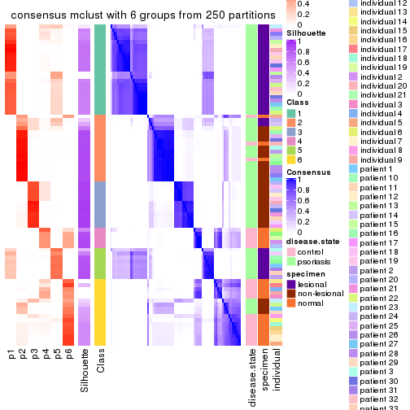</p>

</div>
</div>

Heatmaps for the membership of samples in all partitions to see how consistent they are:


<script>
$( function() {
	$( '#tabs-SD-mclust-membership-heatmap' ).tabs();
} );
</script>
<div id='tabs-SD-mclust-membership-heatmap'>
<ul>
<li><a href='#tab-SD-mclust-membership-heatmap-1'>k = 2</a></li>
<li><a href='#tab-SD-mclust-membership-heatmap-2'>k = 3</a></li>
<li><a href='#tab-SD-mclust-membership-heatmap-3'>k = 4</a></li>
<li><a href='#tab-SD-mclust-membership-heatmap-4'>k = 5</a></li>
<li><a href='#tab-SD-mclust-membership-heatmap-5'>k = 6</a></li>
</ul>
<div id='tab-SD-mclust-membership-heatmap-1'>
<pre><code class="r">membership_heatmap(res, k = 2)
</code></pre>

<p></p>

</div>
<div id='tab-SD-mclust-membership-heatmap-2'>
<pre><code class="r">membership_heatmap(res, k = 3)
</code></pre>

<p></p>

</div>
<div id='tab-SD-mclust-membership-heatmap-3'>
<pre><code class="r">membership_heatmap(res, k = 4)
</code></pre>

<p></p>

</div>
<div id='tab-SD-mclust-membership-heatmap-4'>
<pre><code class="r">membership_heatmap(res, k = 5)
</code></pre>

<p></p>

</div>
<div id='tab-SD-mclust-membership-heatmap-5'>
<pre><code class="r">membership_heatmap(res, k = 6)
</code></pre>

<p></p>

</div>
</div>

As soon as we have had the classes for columns, we can look for signatures
which are significantly different between classes which can be candidate marks
for certain classes. Following are the heatmaps for signatures.


Signature heatmaps where rows are scaled:


<script>
$( function() {
	$( '#tabs-SD-mclust-get-signatures' ).tabs();
} );
</script>
<div id='tabs-SD-mclust-get-signatures'>
<ul>
<li><a href='#tab-SD-mclust-get-signatures-1'>k = 2</a></li>
<li><a href='#tab-SD-mclust-get-signatures-2'>k = 3</a></li>
<li><a href='#tab-SD-mclust-get-signatures-3'>k = 4</a></li>
<li><a href='#tab-SD-mclust-get-signatures-4'>k = 5</a></li>
<li><a href='#tab-SD-mclust-get-signatures-5'>k = 6</a></li>
</ul>
<div id='tab-SD-mclust-get-signatures-1'>
<pre><code class="r">get_signatures(res, k = 2)
</code></pre>

<p></p>

</div>
<div id='tab-SD-mclust-get-signatures-2'>
<pre><code class="r">get_signatures(res, k = 3)
</code></pre>

<p></p>

</div>
<div id='tab-SD-mclust-get-signatures-3'>
<pre><code class="r">get_signatures(res, k = 4)
</code></pre>

<p></p>

</div>
<div id='tab-SD-mclust-get-signatures-4'>
<pre><code class="r">get_signatures(res, k = 5)
</code></pre>

<p></p>

</div>
<div id='tab-SD-mclust-get-signatures-5'>
<pre><code class="r">get_signatures(res, k = 6)
</code></pre>

<p>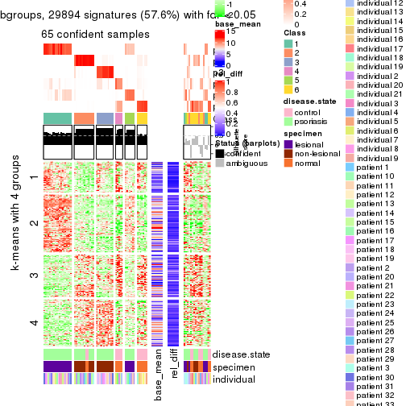</p>

</div>
</div>


Signature heatmaps where rows are not scaled:


<script>
$( function() {
	$( '#tabs-SD-mclust-get-signatures-no-scale' ).tabs();
} );
</script>
<div id='tabs-SD-mclust-get-signatures-no-scale'>
<ul>
<li><a href='#tab-SD-mclust-get-signatures-no-scale-1'>k = 2</a></li>
<li><a href='#tab-SD-mclust-get-signatures-no-scale-2'>k = 3</a></li>
<li><a href='#tab-SD-mclust-get-signatures-no-scale-3'>k = 4</a></li>
<li><a href='#tab-SD-mclust-get-signatures-no-scale-4'>k = 5</a></li>
<li><a href='#tab-SD-mclust-get-signatures-no-scale-5'>k = 6</a></li>
</ul>
<div id='tab-SD-mclust-get-signatures-no-scale-1'>
<pre><code class="r">get_signatures(res, k = 2, scale_rows = FALSE)
</code></pre>

<p></p>

</div>
<div id='tab-SD-mclust-get-signatures-no-scale-2'>
<pre><code class="r">get_signatures(res, k = 3, scale_rows = FALSE)
</code></pre>

<p></p>

</div>
<div id='tab-SD-mclust-get-signatures-no-scale-3'>
<pre><code class="r">get_signatures(res, k = 4, scale_rows = FALSE)
</code></pre>

<p></p>

</div>
<div id='tab-SD-mclust-get-signatures-no-scale-4'>
<pre><code class="r">get_signatures(res, k = 5, scale_rows = FALSE)
</code></pre>

<p></p>

</div>
<div id='tab-SD-mclust-get-signatures-no-scale-5'>
<pre><code class="r">get_signatures(res, k = 6, scale_rows = FALSE)
</code></pre>

<p></p>

</div>
</div>


Compare the overlap of signatures from different k:

```r
compare_signatures(res)
```


`get_signature()` returns a data frame invisibly. TO get the list of signatures, the function
call should be assigned to a variable explicitly. In following code, if `plot` argument is set
to `FALSE`, no heatmap is plotted while only the differential analysis is performed.

```r
# code only for demonstration
tb = get_signature(res, k = ..., plot = FALSE)
```

An example of the output of `tb` is:

```
#>   which_row         fdr    mean_1    mean_2 scaled_mean_1 scaled_mean_2 km
#> 1        38 0.042760348  8.373488  9.131774    -0.5533452     0.5164555  1
#> 2        40 0.018707592  7.106213  8.469186    -0.6173731     0.5762149  1
#> 3        55 0.019134737 10.221463 11.207825    -0.6159697     0.5749050  1
#> 4        59 0.006059896  5.921854  7.869574    -0.6899429     0.6439467  1
#> 5        60 0.018055526  8.928898 10.211722    -0.6204761     0.5791110  1
#> 6        98 0.009384629 15.714769 14.887706     0.6635654    -0.6193277  2
...
```

The columns in `tb` are:

1. `which_row`: row indices corresponding to the input matrix.
2. `fdr`: FDR for the differential test. 
3. `mean_x`: The mean value in group x.
4. `scaled_mean_x`: The mean value in group x after rows are scaled.
5. `km`: Row groups if k-means clustering is applied to rows.


UMAP plot which shows how samples are separated.


<script>
$( function() {
	$( '#tabs-SD-mclust-dimension-reduction' ).tabs();
} );
</script>
<div id='tabs-SD-mclust-dimension-reduction'>
<ul>
<li><a href='#tab-SD-mclust-dimension-reduction-1'>k = 2</a></li>
<li><a href='#tab-SD-mclust-dimension-reduction-2'>k = 3</a></li>
<li><a href='#tab-SD-mclust-dimension-reduction-3'>k = 4</a></li>
<li><a href='#tab-SD-mclust-dimension-reduction-4'>k = 5</a></li>
<li><a href='#tab-SD-mclust-dimension-reduction-5'>k = 6</a></li>
</ul>
<div id='tab-SD-mclust-dimension-reduction-1'>
<pre><code class="r">dimension_reduction(res, k = 2, method = &quot;UMAP&quot;)
</code></pre>

<p></p>

</div>
<div id='tab-SD-mclust-dimension-reduction-2'>
<pre><code class="r">dimension_reduction(res, k = 3, method = &quot;UMAP&quot;)
</code></pre>

<p></p>

</div>
<div id='tab-SD-mclust-dimension-reduction-3'>
<pre><code class="r">dimension_reduction(res, k = 4, method = &quot;UMAP&quot;)
</code></pre>

<p></p>

</div>
<div id='tab-SD-mclust-dimension-reduction-4'>
<pre><code class="r">dimension_reduction(res, k = 5, method = &quot;UMAP&quot;)
</code></pre>

<p></p>

</div>
<div id='tab-SD-mclust-dimension-reduction-5'>
<pre><code class="r">dimension_reduction(res, k = 6, method = &quot;UMAP&quot;)
</code></pre>

<p></p>

</div>
</div>


Following heatmap shows how subgroups are split when increasing `k`:

```r
collect_classes(res)
```


Test correlation between subgroups and known annotations. If the known
annotation is numeric, one-way ANOVA test is applied, and if the known
annotation is discrete, chi-squared contingency table test is applied.

```r
test_to_known_factors(res)
```

```
#>            n disease.state(p) specimen(p) individual(p) k
#> SD:mclust 80         1.70e-04    2.43e-16         0.998 2
#> SD:mclust 76         2.22e-12    1.36e-25         0.861 3
#> SD:mclust 78         8.10e-12    3.39e-23         0.928 4
#> SD:mclust 74         8.45e-11    2.18e-22         0.639 5
#> SD:mclust 65         1.40e-10    1.71e-20         0.277 6
```


If matrix rows can be associated to genes, consider to use `GO_Enrichment(res,
...)` to perform function enrichment for the signature genes.


 

---------------------------------------------------


### SD:NMF**


The object with results only for a single top-value method and a single partition method 
can be extracted as:

```r
res = res_list["SD", "NMF"]
# you can also extract it by
# res = res_list["SD:NMF"]
```

A summary of `res` and all the functions that can be applied to it:

```r
res
```

```
#> A 'ConsensusPartition' object with k = 2, 3, 4, 5, 6.
#>   On a matrix with 51941 rows and 82 columns.
#>   Top rows (1000, 2000, 3000, 4000, 5000) are extracted by 'SD' method.
#>   Subgroups are detected by 'NMF' method.
#>   Performed in total 1250 partitions by row resampling.
#>   Best k for subgroups seems to be 2.
#> 
#> Following methods can be applied to this 'ConsensusPartition' object:
#>  [1] "cola_report"             "collect_classes"         "collect_plots"          
#>  [4] "collect_stats"           "colnames"                "compare_signatures"     
#>  [7] "consensus_heatmap"       "dimension_reduction"     "functional_enrichment"  
#> [10] "get_anno_col"            "get_anno"                "get_classes"            
#> [13] "get_consensus"           "get_matrix"              "get_membership"         
#> [16] "get_param"               "get_signatures"          "get_stats"              
#> [19] "is_best_k"               "is_stable_k"             "membership_heatmap"     
#> [22] "ncol"                    "nrow"                    "plot_ecdf"              
#> [25] "rownames"                "select_partition_number" "show"                   
#> [28] "suggest_best_k"          "test_to_known_factors"
```

`collect_plots()` function collects all the plots made from `res` for all `k` (number of partitions)
into one single page to provide an easy and fast comparison between different `k`.

```r
collect_plots(res)
```


The plots are:

- The first row: a plot of the ECDF (Empirical cumulative distribution
  function) curves of the consensus matrix for each `k` and the heatmap of
  predicted classes for each `k`.
- The second row: heatmaps of the consensus matrix for each `k`.
- The third row: heatmaps of the membership matrix for each `k`.
- The fouth row: heatmaps of the signatures for each `k`.

All the plots in panels can be made by individual functions and they are
plotted later in this section.

`select_partition_number()` produces several plots showing different
statistics for choosing "optimized" `k`. There are following statistics:

- ECDF curves of the consensus matrix for each `k`;
- 1-PAC. [The PAC
  score](https://en.wikipedia.org/wiki/Consensus_clustering#Over-interpretation_potential_of_consensus_clustering)
  measures the proportion of the ambiguous subgrouping.
- Mean silhouette score.
- Concordance. The mean probability of fiting the consensus class ids in all
  partitions.
- Area increased. Denote $A_k$ as the area under the ECDF curve for current
  `k`, the area increased is defined as $A_k - A_{k-1}$.
- Rand index. The percent of pairs of samples that are both in a same cluster
  or both are not in a same cluster in the partition of k and k-1.
- Jaccard index. The ratio of pairs of samples are both in a same cluster in
  the partition of k and k-1 and the pairs of samples are both in a same
  cluster in the partition k or k-1.

The detailed explanations of these statistics can be found in [the cola
vignette](http://bioconductor.org/packages/devel/bioc/vignettes/cola/inst/doc/cola.html#toc_13).

Generally speaking, lower PAC score, higher mean silhouette score or higher
concordance corresponds to better partition. Rand index and Jaccard index
measure how similar the current partition is compared to partition with `k-1`.
If they are too similar, we won't accept `k` is better than `k-1`.

```r
select_partition_number(res)
```


The numeric values for all these statistics can be obtained by `get_stats()`.

```r
get_stats(res)
```

```
#>   k 1-PAC mean_silhouette concordance area_increased  Rand Jaccard
#> 2 2 1.000           0.980       0.992          0.482 0.518   0.518
#> 3 3 0.893           0.919       0.963          0.389 0.796   0.611
#> 4 4 0.853           0.861       0.920          0.102 0.858   0.612
#> 5 5 0.786           0.716       0.863          0.043 0.942   0.792
#> 6 6 0.778           0.685       0.829          0.032 0.950   0.801
```

`suggest_best_k()` suggests the best $k$ based on these statistics. The rules are as follows:

- All $k$ with Jaccard index larger than 0.95 are removed because the increase of
  the partition number does not provides enough extra information. If all $k$ are removed,
  the best $k$ is assigned by `NA`.
- For $k$ with 1-PAC larger than 0.9, the maximal $k$ is taken as the "best k". Other $k$ is called "optional k".
- If it does not fit the second rule. The $k$ with the highest vote of highest
  1-PAC, mean silhouette and concordance is taken as the "best k".

```r
suggest_best_k(res)
```

```
#> [1] 2
```


Following shows the table of the partitions (You need to click the **show/hide
code output** link to see it). The membership matrix (columns with name `p*`)
is inferred by
[`clue::cl_consensus()`](https://www.rdocumentation.org/link/cl_consensus?package=clue)
function with the `SE` method. Basically the value in the membership matrix
represents the probability to belong to a certain group. The finall class
label for an item is determined with the group with highest probability it
belongs to.

In `get_classes()` function, the entropy is calculated from the membership
matrix and the silhouette score is calculated from the consensus matrix.


<script>
$( function() {
	$( '#tabs-SD-NMF-get-classes' ).tabs();
} );
</script>
<div id='tabs-SD-NMF-get-classes'>
<ul>
<li><a href='#tab-SD-NMF-get-classes-1'>k = 2</a></li>
<li><a href='#tab-SD-NMF-get-classes-2'>k = 3</a></li>
<li><a href='#tab-SD-NMF-get-classes-3'>k = 4</a></li>
<li><a href='#tab-SD-NMF-get-classes-4'>k = 5</a></li>
<li><a href='#tab-SD-NMF-get-classes-5'>k = 6</a></li>
</ul>

<div id='tab-SD-NMF-get-classes-1'>
<p><a id='tab-SD-NMF-get-classes-1-a' style='color:#0366d6' href='#'>show/hide code output</a></p>
<pre><code class="r">cbind(get_classes(res, k = 2), get_membership(res, k = 2))
</code></pre>

<pre><code>#&gt;           class entropy silhouette    p1    p2
#&gt; GSM372286     2  0.0000      0.993 0.000 1.000
#&gt; GSM372287     2  0.0000      0.993 0.000 1.000
#&gt; GSM372288     2  0.0000      0.993 0.000 1.000
#&gt; GSM372289     2  0.0000      0.993 0.000 1.000
#&gt; GSM372290     2  0.0000      0.993 0.000 1.000
#&gt; GSM372291     2  0.9393      0.440 0.356 0.644
#&gt; GSM372292     2  0.0000      0.993 0.000 1.000
#&gt; GSM372293     2  0.0000      0.993 0.000 1.000
#&gt; GSM372294     2  0.0000      0.993 0.000 1.000
#&gt; GSM372295     2  0.0000      0.993 0.000 1.000
#&gt; GSM372296     2  0.0000      0.993 0.000 1.000
#&gt; GSM372297     2  0.0000      0.993 0.000 1.000
#&gt; GSM372298     2  0.0000      0.993 0.000 1.000
#&gt; GSM372299     2  0.0000      0.993 0.000 1.000
#&gt; GSM372300     2  0.0000      0.993 0.000 1.000
#&gt; GSM372301     2  0.0000      0.993 0.000 1.000
#&gt; GSM372302     2  0.0000      0.993 0.000 1.000
#&gt; GSM372303     2  0.0000      0.993 0.000 1.000
#&gt; GSM372304     2  0.0000      0.993 0.000 1.000
#&gt; GSM372305     2  0.0000      0.993 0.000 1.000
#&gt; GSM372306     2  0.0000      0.993 0.000 1.000
#&gt; GSM372307     2  0.0000      0.993 0.000 1.000
#&gt; GSM372309     2  0.0000      0.993 0.000 1.000
#&gt; GSM372311     2  0.0000      0.993 0.000 1.000
#&gt; GSM372313     2  0.0000      0.993 0.000 1.000
#&gt; GSM372315     2  0.0000      0.993 0.000 1.000
#&gt; GSM372317     2  0.0000      0.993 0.000 1.000
#&gt; GSM372319     2  0.0000      0.993 0.000 1.000
#&gt; GSM372321     2  0.0000      0.993 0.000 1.000
#&gt; GSM372323     2  0.0000      0.993 0.000 1.000
#&gt; GSM372326     2  0.0000      0.993 0.000 1.000
#&gt; GSM372328     2  0.0000      0.993 0.000 1.000
#&gt; GSM372330     2  0.0000      0.993 0.000 1.000
#&gt; GSM372332     2  0.0000      0.993 0.000 1.000
#&gt; GSM372335     2  0.0000      0.993 0.000 1.000
#&gt; GSM372337     2  0.0000      0.993 0.000 1.000
#&gt; GSM372339     2  0.0000      0.993 0.000 1.000
#&gt; GSM372341     2  0.0000      0.993 0.000 1.000
#&gt; GSM372343     2  0.0000      0.993 0.000 1.000
#&gt; GSM372345     2  0.0000      0.993 0.000 1.000
#&gt; GSM372347     2  0.0000      0.993 0.000 1.000
#&gt; GSM372349     2  0.0000      0.993 0.000 1.000
#&gt; GSM372351     2  0.0000      0.993 0.000 1.000
#&gt; GSM372353     2  0.0000      0.993 0.000 1.000
#&gt; GSM372355     2  0.0000      0.993 0.000 1.000
#&gt; GSM372357     2  0.0000      0.993 0.000 1.000
#&gt; GSM372359     2  0.0000      0.993 0.000 1.000
#&gt; GSM372361     2  0.0000      0.993 0.000 1.000
#&gt; GSM372363     2  0.0000      0.993 0.000 1.000
#&gt; GSM372308     1  0.0000      0.990 1.000 0.000
#&gt; GSM372310     1  0.0000      0.990 1.000 0.000
#&gt; GSM372312     1  0.0000      0.990 1.000 0.000
#&gt; GSM372314     1  0.0376      0.986 0.996 0.004
#&gt; GSM372316     1  0.0000      0.990 1.000 0.000
#&gt; GSM372318     1  0.0000      0.990 1.000 0.000
#&gt; GSM372320     1  0.0000      0.990 1.000 0.000
#&gt; GSM372322     1  0.0000      0.990 1.000 0.000
#&gt; GSM372324     1  0.0000      0.990 1.000 0.000
#&gt; GSM372325     1  0.0000      0.990 1.000 0.000
#&gt; GSM372327     1  0.0000      0.990 1.000 0.000
#&gt; GSM372329     1  0.0000      0.990 1.000 0.000
#&gt; GSM372331     1  0.0000      0.990 1.000 0.000
#&gt; GSM372333     1  0.8861      0.560 0.696 0.304
#&gt; GSM372334     1  0.0000      0.990 1.000 0.000
#&gt; GSM372336     1  0.0000      0.990 1.000 0.000
#&gt; GSM372338     1  0.0000      0.990 1.000 0.000
#&gt; GSM372340     1  0.0000      0.990 1.000 0.000
#&gt; GSM372342     1  0.0000      0.990 1.000 0.000
#&gt; GSM372344     1  0.0000      0.990 1.000 0.000
#&gt; GSM372346     1  0.0000      0.990 1.000 0.000
#&gt; GSM372348     1  0.0000      0.990 1.000 0.000
#&gt; GSM372350     1  0.0000      0.990 1.000 0.000
#&gt; GSM372352     2  0.0000      0.993 0.000 1.000
#&gt; GSM372354     1  0.0000      0.990 1.000 0.000
#&gt; GSM372356     1  0.0000      0.990 1.000 0.000
#&gt; GSM372358     1  0.0000      0.990 1.000 0.000
#&gt; GSM372360     1  0.0000      0.990 1.000 0.000
#&gt; GSM372362     1  0.0000      0.990 1.000 0.000
#&gt; GSM372364     1  0.0000      0.990 1.000 0.000
#&gt; GSM372365     1  0.0000      0.990 1.000 0.000
#&gt; GSM372366     1  0.0000      0.990 1.000 0.000
#&gt; GSM372367     1  0.0000      0.990 1.000 0.000
</code></pre>

<script>
$('#tab-SD-NMF-get-classes-1-a').parent().next().next().hide();
$('#tab-SD-NMF-get-classes-1-a').click(function(){
  $('#tab-SD-NMF-get-classes-1-a').parent().next().next().toggle();
  return(false);
});
</script>
</div>

<div id='tab-SD-NMF-get-classes-2'>
<p><a id='tab-SD-NMF-get-classes-2-a' style='color:#0366d6' href='#'>show/hide code output</a></p>
<pre><code class="r">cbind(get_classes(res, k = 3), get_membership(res, k = 3))
</code></pre>

<pre><code>#&gt;           class entropy silhouette    p1    p2    p3
#&gt; GSM372286     2  0.3192      0.858 0.000 0.888 0.112
#&gt; GSM372287     2  0.0000      0.951 0.000 1.000 0.000
#&gt; GSM372288     2  0.0000      0.951 0.000 1.000 0.000
#&gt; GSM372289     2  0.0000      0.951 0.000 1.000 0.000
#&gt; GSM372290     2  0.0237      0.950 0.000 0.996 0.004
#&gt; GSM372291     2  0.4551      0.805 0.140 0.840 0.020
#&gt; GSM372292     3  0.5968      0.449 0.000 0.364 0.636
#&gt; GSM372293     3  0.1643      0.902 0.000 0.044 0.956
#&gt; GSM372294     2  0.0237      0.950 0.000 0.996 0.004
#&gt; GSM372295     2  0.0000      0.951 0.000 1.000 0.000
#&gt; GSM372296     2  0.0000      0.951 0.000 1.000 0.000
#&gt; GSM372297     2  0.0892      0.942 0.000 0.980 0.020
#&gt; GSM372298     2  0.0592      0.947 0.000 0.988 0.012
#&gt; GSM372299     2  0.0237      0.950 0.000 0.996 0.004
#&gt; GSM372300     3  0.3551      0.825 0.000 0.132 0.868
#&gt; GSM372301     3  0.2165      0.889 0.000 0.064 0.936
#&gt; GSM372302     2  0.0747      0.944 0.000 0.984 0.016
#&gt; GSM372303     3  0.0000      0.925 0.000 0.000 1.000
#&gt; GSM372304     2  0.0592      0.947 0.000 0.988 0.012
#&gt; GSM372305     2  0.3816      0.816 0.000 0.852 0.148
#&gt; GSM372306     3  0.4796      0.725 0.000 0.220 0.780
#&gt; GSM372307     2  0.0000      0.951 0.000 1.000 0.000
#&gt; GSM372309     2  0.0000      0.951 0.000 1.000 0.000
#&gt; GSM372311     2  0.0000      0.951 0.000 1.000 0.000
#&gt; GSM372313     2  0.0237      0.950 0.000 0.996 0.004
#&gt; GSM372315     2  0.0000      0.951 0.000 1.000 0.000
#&gt; GSM372317     3  0.4346      0.773 0.000 0.184 0.816
#&gt; GSM372319     3  0.0424      0.922 0.000 0.008 0.992
#&gt; GSM372321     3  0.0000      0.925 0.000 0.000 1.000
#&gt; GSM372323     3  0.0000      0.925 0.000 0.000 1.000
#&gt; GSM372326     3  0.0000      0.925 0.000 0.000 1.000
#&gt; GSM372328     3  0.0000      0.925 0.000 0.000 1.000
#&gt; GSM372330     2  0.4178      0.785 0.000 0.828 0.172
#&gt; GSM372332     3  0.0000      0.925 0.000 0.000 1.000
#&gt; GSM372335     3  0.3551      0.835 0.000 0.132 0.868
#&gt; GSM372337     3  0.0000      0.925 0.000 0.000 1.000
#&gt; GSM372339     3  0.0000      0.925 0.000 0.000 1.000
#&gt; GSM372341     3  0.0000      0.925 0.000 0.000 1.000
#&gt; GSM372343     3  0.0000      0.925 0.000 0.000 1.000
#&gt; GSM372345     3  0.0000      0.925 0.000 0.000 1.000
#&gt; GSM372347     3  0.0892      0.918 0.000 0.020 0.980
#&gt; GSM372349     3  0.0000      0.925 0.000 0.000 1.000
#&gt; GSM372351     3  0.0000      0.925 0.000 0.000 1.000
#&gt; GSM372353     3  0.0892      0.918 0.000 0.020 0.980
#&gt; GSM372355     2  0.0000      0.951 0.000 1.000 0.000
#&gt; GSM372357     2  0.0892      0.940 0.000 0.980 0.020
#&gt; GSM372359     3  0.1529      0.909 0.000 0.040 0.960
#&gt; GSM372361     2  0.0000      0.951 0.000 1.000 0.000
#&gt; GSM372363     2  0.0000      0.951 0.000 1.000 0.000
#&gt; GSM372308     1  0.0000      0.994 1.000 0.000 0.000
#&gt; GSM372310     1  0.0000      0.994 1.000 0.000 0.000
#&gt; GSM372312     1  0.0237      0.990 0.996 0.004 0.000
#&gt; GSM372314     1  0.0000      0.994 1.000 0.000 0.000
#&gt; GSM372316     1  0.0000      0.994 1.000 0.000 0.000
#&gt; GSM372318     1  0.0000      0.994 1.000 0.000 0.000
#&gt; GSM372320     1  0.0000      0.994 1.000 0.000 0.000
#&gt; GSM372322     1  0.0000      0.994 1.000 0.000 0.000
#&gt; GSM372324     1  0.0000      0.994 1.000 0.000 0.000
#&gt; GSM372325     1  0.4178      0.779 0.828 0.000 0.172
#&gt; GSM372327     1  0.0000      0.994 1.000 0.000 0.000
#&gt; GSM372329     1  0.0000      0.994 1.000 0.000 0.000
#&gt; GSM372331     1  0.0000      0.994 1.000 0.000 0.000
#&gt; GSM372333     3  0.6625      0.206 0.440 0.008 0.552
#&gt; GSM372334     1  0.0000      0.994 1.000 0.000 0.000
#&gt; GSM372336     1  0.0000      0.994 1.000 0.000 0.000
#&gt; GSM372338     1  0.0000      0.994 1.000 0.000 0.000
#&gt; GSM372340     1  0.0000      0.994 1.000 0.000 0.000
#&gt; GSM372342     1  0.0000      0.994 1.000 0.000 0.000
#&gt; GSM372344     1  0.0000      0.994 1.000 0.000 0.000
#&gt; GSM372346     1  0.0000      0.994 1.000 0.000 0.000
#&gt; GSM372348     1  0.0000      0.994 1.000 0.000 0.000
#&gt; GSM372350     1  0.0000      0.994 1.000 0.000 0.000
#&gt; GSM372352     2  0.9062      0.280 0.152 0.512 0.336
#&gt; GSM372354     1  0.0000      0.994 1.000 0.000 0.000
#&gt; GSM372356     1  0.0000      0.994 1.000 0.000 0.000
#&gt; GSM372358     1  0.0000      0.994 1.000 0.000 0.000
#&gt; GSM372360     1  0.0000      0.994 1.000 0.000 0.000
#&gt; GSM372362     1  0.0000      0.994 1.000 0.000 0.000
#&gt; GSM372364     1  0.0000      0.994 1.000 0.000 0.000
#&gt; GSM372365     1  0.0000      0.994 1.000 0.000 0.000
#&gt; GSM372366     1  0.0000      0.994 1.000 0.000 0.000
#&gt; GSM372367     1  0.0000      0.994 1.000 0.000 0.000
</code></pre>

<script>
$('#tab-SD-NMF-get-classes-2-a').parent().next().next().hide();
$('#tab-SD-NMF-get-classes-2-a').click(function(){
  $('#tab-SD-NMF-get-classes-2-a').parent().next().next().toggle();
  return(false);
});
</script>
</div>

<div id='tab-SD-NMF-get-classes-3'>
<p><a id='tab-SD-NMF-get-classes-3-a' style='color:#0366d6' href='#'>show/hide code output</a></p>
<pre><code class="r">cbind(get_classes(res, k = 4), get_membership(res, k = 4))
</code></pre>

<pre><code>#&gt;           class entropy silhouette    p1    p2    p3    p4
#&gt; GSM372286     2  0.2943      0.820 0.000 0.892 0.076 0.032
#&gt; GSM372287     4  0.2216      0.896 0.000 0.092 0.000 0.908
#&gt; GSM372288     4  0.2530      0.883 0.000 0.112 0.000 0.888
#&gt; GSM372289     2  0.4564      0.481 0.000 0.672 0.000 0.328
#&gt; GSM372290     4  0.2149      0.898 0.000 0.088 0.000 0.912
#&gt; GSM372291     4  0.0336      0.905 0.000 0.000 0.008 0.992
#&gt; GSM372292     4  0.0817      0.901 0.000 0.000 0.024 0.976
#&gt; GSM372293     4  0.4961      0.193 0.000 0.000 0.448 0.552
#&gt; GSM372294     4  0.1792      0.904 0.000 0.068 0.000 0.932
#&gt; GSM372295     4  0.2149      0.897 0.000 0.088 0.000 0.912
#&gt; GSM372296     4  0.2589      0.882 0.000 0.116 0.000 0.884
#&gt; GSM372297     4  0.0188      0.906 0.000 0.000 0.004 0.996
#&gt; GSM372298     4  0.0336      0.908 0.000 0.008 0.000 0.992
#&gt; GSM372299     4  0.2944      0.872 0.000 0.128 0.004 0.868
#&gt; GSM372300     4  0.1474      0.887 0.000 0.000 0.052 0.948
#&gt; GSM372301     4  0.1557      0.885 0.000 0.000 0.056 0.944
#&gt; GSM372302     4  0.1118      0.909 0.000 0.036 0.000 0.964
#&gt; GSM372303     4  0.2081      0.865 0.000 0.000 0.084 0.916
#&gt; GSM372304     4  0.0469      0.909 0.000 0.012 0.000 0.988
#&gt; GSM372305     2  0.0188      0.836 0.000 0.996 0.004 0.000
#&gt; GSM372306     2  0.2814      0.788 0.000 0.868 0.132 0.000
#&gt; GSM372307     2  0.3074      0.745 0.000 0.848 0.000 0.152
#&gt; GSM372309     2  0.2281      0.795 0.000 0.904 0.000 0.096
#&gt; GSM372311     2  0.0336      0.835 0.000 0.992 0.000 0.008
#&gt; GSM372313     2  0.0188      0.836 0.000 0.996 0.004 0.000
#&gt; GSM372315     2  0.1940      0.809 0.000 0.924 0.000 0.076
#&gt; GSM372317     2  0.3266      0.766 0.000 0.832 0.168 0.000
#&gt; GSM372319     3  0.1637      0.923 0.000 0.060 0.940 0.000
#&gt; GSM372321     3  0.1389      0.932 0.000 0.048 0.952 0.000
#&gt; GSM372323     3  0.1022      0.940 0.000 0.032 0.968 0.000
#&gt; GSM372326     3  0.0188      0.947 0.000 0.004 0.996 0.000
#&gt; GSM372328     3  0.2216      0.862 0.000 0.000 0.908 0.092
#&gt; GSM372330     2  0.2216      0.811 0.000 0.908 0.092 0.000
#&gt; GSM372332     3  0.0188      0.947 0.000 0.004 0.996 0.000
#&gt; GSM372335     2  0.4072      0.683 0.000 0.748 0.252 0.000
#&gt; GSM372337     3  0.0469      0.946 0.000 0.012 0.988 0.000
#&gt; GSM372339     3  0.0188      0.947 0.000 0.004 0.996 0.000
#&gt; GSM372341     3  0.0469      0.939 0.000 0.000 0.988 0.012
#&gt; GSM372343     3  0.0188      0.944 0.000 0.000 0.996 0.004
#&gt; GSM372345     3  0.1211      0.937 0.000 0.040 0.960 0.000
#&gt; GSM372347     3  0.3610      0.751 0.000 0.200 0.800 0.000
#&gt; GSM372349     3  0.0524      0.947 0.000 0.008 0.988 0.004
#&gt; GSM372351     3  0.0188      0.944 0.000 0.000 0.996 0.004
#&gt; GSM372353     3  0.3311      0.820 0.000 0.172 0.828 0.000
#&gt; GSM372355     2  0.0000      0.836 0.000 1.000 0.000 0.000
#&gt; GSM372357     2  0.0000      0.836 0.000 1.000 0.000 0.000
#&gt; GSM372359     2  0.4830      0.404 0.000 0.608 0.392 0.000
#&gt; GSM372361     2  0.4250      0.571 0.000 0.724 0.000 0.276
#&gt; GSM372363     2  0.1211      0.825 0.000 0.960 0.000 0.040
#&gt; GSM372308     1  0.0000      0.962 1.000 0.000 0.000 0.000
#&gt; GSM372310     1  0.0000      0.962 1.000 0.000 0.000 0.000
#&gt; GSM372312     1  0.0188      0.959 0.996 0.004 0.000 0.000
#&gt; GSM372314     1  0.4679      0.469 0.648 0.352 0.000 0.000
#&gt; GSM372316     1  0.0000      0.962 1.000 0.000 0.000 0.000
#&gt; GSM372318     1  0.0000      0.962 1.000 0.000 0.000 0.000
#&gt; GSM372320     1  0.0000      0.962 1.000 0.000 0.000 0.000
#&gt; GSM372322     1  0.0000      0.962 1.000 0.000 0.000 0.000
#&gt; GSM372324     1  0.1867      0.892 0.928 0.000 0.072 0.000
#&gt; GSM372325     1  0.5913      0.599 0.696 0.180 0.124 0.000
#&gt; GSM372327     1  0.0000      0.962 1.000 0.000 0.000 0.000
#&gt; GSM372329     1  0.0000      0.962 1.000 0.000 0.000 0.000
#&gt; GSM372331     1  0.4713      0.449 0.640 0.360 0.000 0.000
#&gt; GSM372333     2  0.3764      0.725 0.000 0.784 0.216 0.000
#&gt; GSM372334     1  0.0000      0.962 1.000 0.000 0.000 0.000
#&gt; GSM372336     1  0.0000      0.962 1.000 0.000 0.000 0.000
#&gt; GSM372338     1  0.0000      0.962 1.000 0.000 0.000 0.000
#&gt; GSM372340     1  0.0000      0.962 1.000 0.000 0.000 0.000
#&gt; GSM372342     1  0.0000      0.962 1.000 0.000 0.000 0.000
#&gt; GSM372344     1  0.0000      0.962 1.000 0.000 0.000 0.000
#&gt; GSM372346     1  0.0000      0.962 1.000 0.000 0.000 0.000
#&gt; GSM372348     1  0.0000      0.962 1.000 0.000 0.000 0.000
#&gt; GSM372350     1  0.0000      0.962 1.000 0.000 0.000 0.000
#&gt; GSM372352     2  0.6567      0.567 0.128 0.616 0.256 0.000
#&gt; GSM372354     1  0.0000      0.962 1.000 0.000 0.000 0.000
#&gt; GSM372356     1  0.0000      0.962 1.000 0.000 0.000 0.000
#&gt; GSM372358     1  0.0000      0.962 1.000 0.000 0.000 0.000
#&gt; GSM372360     1  0.0000      0.962 1.000 0.000 0.000 0.000
#&gt; GSM372362     1  0.0000      0.962 1.000 0.000 0.000 0.000
#&gt; GSM372364     1  0.0000      0.962 1.000 0.000 0.000 0.000
#&gt; GSM372365     1  0.0000      0.962 1.000 0.000 0.000 0.000
#&gt; GSM372366     1  0.0000      0.962 1.000 0.000 0.000 0.000
#&gt; GSM372367     1  0.0000      0.962 1.000 0.000 0.000 0.000
</code></pre>

<script>
$('#tab-SD-NMF-get-classes-3-a').parent().next().next().hide();
$('#tab-SD-NMF-get-classes-3-a').click(function(){
  $('#tab-SD-NMF-get-classes-3-a').parent().next().next().toggle();
  return(false);
});
</script>
</div>

<div id='tab-SD-NMF-get-classes-4'>
<p><a id='tab-SD-NMF-get-classes-4-a' style='color:#0366d6' href='#'>show/hide code output</a></p>
<pre><code class="r">cbind(get_classes(res, k = 5), get_membership(res, k = 5))
</code></pre>

<pre><code>#&gt;           class entropy silhouette    p1    p2    p3    p4    p5
#&gt; GSM372286     2  0.1670     0.7203 0.000 0.936 0.000 0.052 0.012
#&gt; GSM372287     4  0.0865     0.7895 0.000 0.004 0.000 0.972 0.024
#&gt; GSM372288     4  0.1300     0.7840 0.000 0.028 0.000 0.956 0.016
#&gt; GSM372289     4  0.5173    -0.0137 0.000 0.460 0.000 0.500 0.040
#&gt; GSM372290     4  0.1331     0.7832 0.000 0.008 0.000 0.952 0.040
#&gt; GSM372291     4  0.1121     0.7835 0.000 0.000 0.000 0.956 0.044
#&gt; GSM372292     4  0.1410     0.7803 0.000 0.000 0.000 0.940 0.060
#&gt; GSM372293     4  0.6801     0.0750 0.000 0.000 0.312 0.376 0.312
#&gt; GSM372294     4  0.2124     0.7574 0.000 0.004 0.000 0.900 0.096
#&gt; GSM372295     5  0.4297     0.1461 0.000 0.000 0.000 0.472 0.528
#&gt; GSM372296     4  0.2110     0.7484 0.000 0.072 0.000 0.912 0.016
#&gt; GSM372297     4  0.0000     0.7933 0.000 0.000 0.000 1.000 0.000
#&gt; GSM372298     4  0.1638     0.7790 0.000 0.004 0.000 0.932 0.064
#&gt; GSM372299     5  0.4367     0.2583 0.000 0.008 0.000 0.372 0.620
#&gt; GSM372300     4  0.4339     0.5938 0.000 0.000 0.020 0.684 0.296
#&gt; GSM372301     4  0.3550     0.6625 0.000 0.000 0.004 0.760 0.236
#&gt; GSM372302     4  0.0451     0.7927 0.000 0.004 0.000 0.988 0.008
#&gt; GSM372303     4  0.4223     0.6294 0.000 0.000 0.028 0.724 0.248
#&gt; GSM372304     4  0.0000     0.7933 0.000 0.000 0.000 1.000 0.000
#&gt; GSM372305     2  0.0703     0.7440 0.000 0.976 0.000 0.000 0.024
#&gt; GSM372306     2  0.1444     0.7423 0.000 0.948 0.040 0.000 0.012
#&gt; GSM372307     2  0.6621    -0.2989 0.000 0.428 0.000 0.224 0.348
#&gt; GSM372309     5  0.4760     0.3443 0.000 0.416 0.000 0.020 0.564
#&gt; GSM372311     2  0.0510     0.7454 0.000 0.984 0.000 0.000 0.016
#&gt; GSM372313     2  0.0000     0.7455 0.000 1.000 0.000 0.000 0.000
#&gt; GSM372315     2  0.2983     0.6358 0.000 0.864 0.000 0.096 0.040
#&gt; GSM372317     2  0.2280     0.6992 0.000 0.880 0.120 0.000 0.000
#&gt; GSM372319     3  0.2416     0.7955 0.000 0.100 0.888 0.000 0.012
#&gt; GSM372321     3  0.0703     0.8528 0.000 0.024 0.976 0.000 0.000
#&gt; GSM372323     3  0.1549     0.8594 0.000 0.016 0.944 0.000 0.040
#&gt; GSM372326     3  0.3816     0.7029 0.000 0.000 0.696 0.000 0.304
#&gt; GSM372328     3  0.2462     0.8373 0.000 0.000 0.880 0.008 0.112
#&gt; GSM372330     2  0.0404     0.7455 0.000 0.988 0.000 0.000 0.012
#&gt; GSM372332     3  0.0404     0.8589 0.000 0.000 0.988 0.000 0.012
#&gt; GSM372335     2  0.2305     0.7143 0.000 0.896 0.092 0.000 0.012
#&gt; GSM372337     3  0.0290     0.8561 0.000 0.008 0.992 0.000 0.000
#&gt; GSM372339     3  0.0290     0.8579 0.000 0.000 0.992 0.000 0.008
#&gt; GSM372341     3  0.2329     0.8350 0.000 0.000 0.876 0.000 0.124
#&gt; GSM372343     3  0.3177     0.7853 0.000 0.000 0.792 0.000 0.208
#&gt; GSM372345     3  0.0771     0.8533 0.000 0.020 0.976 0.000 0.004
#&gt; GSM372347     3  0.4494     0.2895 0.000 0.380 0.608 0.000 0.012
#&gt; GSM372349     3  0.2249     0.7972 0.000 0.000 0.896 0.008 0.096
#&gt; GSM372351     3  0.3366     0.7677 0.000 0.000 0.768 0.000 0.232
#&gt; GSM372353     5  0.6415    -0.3272 0.000 0.172 0.400 0.000 0.428
#&gt; GSM372355     2  0.0510     0.7454 0.000 0.984 0.000 0.000 0.016
#&gt; GSM372357     5  0.4291     0.2685 0.000 0.464 0.000 0.000 0.536
#&gt; GSM372359     2  0.4701     0.5108 0.000 0.720 0.204 0.000 0.076
#&gt; GSM372361     5  0.6043     0.4422 0.000 0.128 0.004 0.308 0.560
#&gt; GSM372363     5  0.4542     0.2894 0.000 0.456 0.000 0.008 0.536
#&gt; GSM372308     1  0.3003     0.7755 0.812 0.000 0.000 0.000 0.188
#&gt; GSM372310     1  0.0000     0.9541 1.000 0.000 0.000 0.000 0.000
#&gt; GSM372312     1  0.4242     0.7952 0.816 0.016 0.028 0.032 0.108
#&gt; GSM372314     1  0.3508     0.6534 0.748 0.252 0.000 0.000 0.000
#&gt; GSM372316     1  0.0000     0.9541 1.000 0.000 0.000 0.000 0.000
#&gt; GSM372318     1  0.0000     0.9541 1.000 0.000 0.000 0.000 0.000
#&gt; GSM372320     1  0.0000     0.9541 1.000 0.000 0.000 0.000 0.000
#&gt; GSM372322     1  0.0000     0.9541 1.000 0.000 0.000 0.000 0.000
#&gt; GSM372324     1  0.0324     0.9495 0.992 0.004 0.000 0.000 0.004
#&gt; GSM372325     1  0.5100     0.3452 0.592 0.372 0.024 0.000 0.012
#&gt; GSM372327     1  0.0000     0.9541 1.000 0.000 0.000 0.000 0.000
#&gt; GSM372329     1  0.0000     0.9541 1.000 0.000 0.000 0.000 0.000
#&gt; GSM372331     2  0.2848     0.5838 0.156 0.840 0.000 0.000 0.004
#&gt; GSM372333     2  0.5294     0.1664 0.004 0.524 0.432 0.000 0.040
#&gt; GSM372334     1  0.0000     0.9541 1.000 0.000 0.000 0.000 0.000
#&gt; GSM372336     1  0.0000     0.9541 1.000 0.000 0.000 0.000 0.000
#&gt; GSM372338     1  0.0000     0.9541 1.000 0.000 0.000 0.000 0.000
#&gt; GSM372340     1  0.0000     0.9541 1.000 0.000 0.000 0.000 0.000
#&gt; GSM372342     1  0.0000     0.9541 1.000 0.000 0.000 0.000 0.000
#&gt; GSM372344     1  0.0000     0.9541 1.000 0.000 0.000 0.000 0.000
#&gt; GSM372346     1  0.0000     0.9541 1.000 0.000 0.000 0.000 0.000
#&gt; GSM372348     1  0.0000     0.9541 1.000 0.000 0.000 0.000 0.000
#&gt; GSM372350     1  0.2897     0.8641 0.884 0.000 0.020 0.024 0.072
#&gt; GSM372352     2  0.6833     0.3825 0.132 0.588 0.204 0.000 0.076
#&gt; GSM372354     1  0.0290     0.9499 0.992 0.000 0.000 0.000 0.008
#&gt; GSM372356     1  0.0000     0.9541 1.000 0.000 0.000 0.000 0.000
#&gt; GSM372358     1  0.0000     0.9541 1.000 0.000 0.000 0.000 0.000
#&gt; GSM372360     1  0.0162     0.9521 0.996 0.000 0.000 0.000 0.004
#&gt; GSM372362     1  0.0162     0.9520 0.996 0.000 0.000 0.000 0.004
#&gt; GSM372364     1  0.0000     0.9541 1.000 0.000 0.000 0.000 0.000
#&gt; GSM372365     1  0.2074     0.8698 0.896 0.000 0.000 0.000 0.104
#&gt; GSM372366     1  0.0000     0.9541 1.000 0.000 0.000 0.000 0.000
#&gt; GSM372367     1  0.0000     0.9541 1.000 0.000 0.000 0.000 0.000
</code></pre>

<script>
$('#tab-SD-NMF-get-classes-4-a').parent().next().next().hide();
$('#tab-SD-NMF-get-classes-4-a').click(function(){
  $('#tab-SD-NMF-get-classes-4-a').parent().next().next().toggle();
  return(false);
});
</script>
</div>

<div id='tab-SD-NMF-get-classes-5'>
<p><a id='tab-SD-NMF-get-classes-5-a' style='color:#0366d6' href='#'>show/hide code output</a></p>
<pre><code class="r">cbind(get_classes(res, k = 6), get_membership(res, k = 6))
</code></pre>

<pre><code>#&gt;           class entropy silhouette    p1    p2    p3    p4    p5    p6
#&gt; GSM372286     2  0.1799     0.6939 0.000 0.936 0.008 0.016 0.016 0.024
#&gt; GSM372287     4  0.2917     0.7347 0.000 0.016 0.000 0.840 0.136 0.008
#&gt; GSM372288     4  0.3765     0.7010 0.000 0.060 0.000 0.780 0.156 0.004
#&gt; GSM372289     2  0.6327     0.1073 0.000 0.460 0.000 0.284 0.236 0.020
#&gt; GSM372290     4  0.3960     0.6541 0.000 0.032 0.000 0.736 0.224 0.008
#&gt; GSM372291     4  0.3224     0.6838 0.000 0.000 0.004 0.824 0.040 0.132
#&gt; GSM372292     4  0.1285     0.7252 0.000 0.000 0.004 0.944 0.000 0.052
#&gt; GSM372293     6  0.6032    -0.0250 0.000 0.000 0.104 0.424 0.036 0.436
#&gt; GSM372294     4  0.4910     0.5764 0.000 0.048 0.000 0.688 0.048 0.216
#&gt; GSM372295     5  0.3619     0.6058 0.000 0.000 0.000 0.232 0.744 0.024
#&gt; GSM372296     4  0.3634     0.7287 0.000 0.060 0.000 0.820 0.092 0.028
#&gt; GSM372297     4  0.0260     0.7514 0.000 0.000 0.000 0.992 0.008 0.000
#&gt; GSM372298     4  0.1275     0.7509 0.000 0.016 0.000 0.956 0.012 0.016
#&gt; GSM372299     5  0.3582     0.6271 0.000 0.000 0.000 0.196 0.768 0.036
#&gt; GSM372300     4  0.5316    -0.1880 0.000 0.000 0.040 0.528 0.036 0.396
#&gt; GSM372301     4  0.3509     0.5635 0.000 0.000 0.016 0.788 0.016 0.180
#&gt; GSM372302     4  0.2252     0.7561 0.000 0.016 0.000 0.900 0.072 0.012
#&gt; GSM372303     4  0.4173     0.4505 0.000 0.000 0.044 0.732 0.012 0.212
#&gt; GSM372304     4  0.1082     0.7591 0.000 0.000 0.000 0.956 0.040 0.004
#&gt; GSM372305     2  0.2151     0.6884 0.000 0.904 0.008 0.000 0.072 0.016
#&gt; GSM372306     2  0.3596     0.6236 0.000 0.792 0.164 0.000 0.012 0.032
#&gt; GSM372307     5  0.5268     0.5891 0.000 0.224 0.020 0.068 0.668 0.020
#&gt; GSM372309     5  0.2070     0.7798 0.000 0.100 0.008 0.000 0.892 0.000
#&gt; GSM372311     2  0.2316     0.6861 0.000 0.900 0.004 0.004 0.064 0.028
#&gt; GSM372313     2  0.1148     0.6932 0.000 0.960 0.000 0.004 0.016 0.020
#&gt; GSM372315     2  0.5006     0.4827 0.000 0.680 0.000 0.084 0.208 0.028
#&gt; GSM372317     2  0.4502     0.5123 0.000 0.664 0.288 0.000 0.032 0.016
#&gt; GSM372319     3  0.2669     0.7077 0.000 0.072 0.880 0.000 0.016 0.032
#&gt; GSM372321     3  0.1857     0.7302 0.000 0.028 0.928 0.000 0.012 0.032
#&gt; GSM372323     3  0.2712     0.7155 0.000 0.012 0.864 0.000 0.016 0.108
#&gt; GSM372326     3  0.5527     0.3087 0.000 0.000 0.564 0.004 0.156 0.276
#&gt; GSM372328     3  0.3023     0.6481 0.000 0.000 0.808 0.008 0.004 0.180
#&gt; GSM372330     2  0.2046     0.6872 0.000 0.916 0.000 0.008 0.044 0.032
#&gt; GSM372332     3  0.1349     0.7337 0.000 0.000 0.940 0.000 0.004 0.056
#&gt; GSM372335     2  0.4404     0.6232 0.000 0.760 0.080 0.000 0.036 0.124
#&gt; GSM372337     3  0.1606     0.7327 0.000 0.008 0.932 0.000 0.004 0.056
#&gt; GSM372339     3  0.0692     0.7341 0.000 0.000 0.976 0.000 0.004 0.020
#&gt; GSM372341     3  0.1806     0.7191 0.000 0.000 0.908 0.000 0.004 0.088
#&gt; GSM372343     3  0.3925     0.4885 0.000 0.000 0.656 0.004 0.008 0.332
#&gt; GSM372345     3  0.2609     0.7088 0.000 0.036 0.868 0.000 0.000 0.096
#&gt; GSM372347     2  0.5691     0.1657 0.000 0.492 0.380 0.000 0.012 0.116
#&gt; GSM372349     3  0.4648     0.4433 0.000 0.004 0.636 0.004 0.044 0.312
#&gt; GSM372351     3  0.4235     0.5073 0.000 0.000 0.672 0.004 0.032 0.292
#&gt; GSM372353     6  0.7550     0.0632 0.000 0.120 0.264 0.004 0.300 0.312
#&gt; GSM372355     2  0.1838     0.6857 0.000 0.916 0.000 0.000 0.068 0.016
#&gt; GSM372357     5  0.3139     0.7191 0.000 0.152 0.032 0.000 0.816 0.000
#&gt; GSM372359     2  0.5844     0.4008 0.000 0.592 0.084 0.004 0.052 0.268
#&gt; GSM372361     5  0.2240     0.7697 0.000 0.032 0.016 0.044 0.908 0.000
#&gt; GSM372363     5  0.2053     0.7797 0.000 0.108 0.004 0.000 0.888 0.000
#&gt; GSM372308     1  0.2048     0.8484 0.880 0.000 0.000 0.000 0.120 0.000
#&gt; GSM372310     1  0.0146     0.9450 0.996 0.000 0.000 0.000 0.000 0.004
#&gt; GSM372312     1  0.6784     0.3902 0.540 0.044 0.032 0.044 0.044 0.296
#&gt; GSM372314     1  0.3817     0.7321 0.780 0.172 0.008 0.000 0.008 0.032
#&gt; GSM372316     1  0.0146     0.9442 0.996 0.000 0.000 0.000 0.000 0.004
#&gt; GSM372318     1  0.0000     0.9451 1.000 0.000 0.000 0.000 0.000 0.000
#&gt; GSM372320     1  0.0146     0.9450 0.996 0.000 0.000 0.000 0.000 0.004
#&gt; GSM372322     1  0.0000     0.9451 1.000 0.000 0.000 0.000 0.000 0.000
#&gt; GSM372324     1  0.2755     0.8615 0.880 0.032 0.016 0.000 0.004 0.068
#&gt; GSM372325     2  0.6440     0.3333 0.268 0.544 0.076 0.000 0.008 0.104
#&gt; GSM372327     1  0.0146     0.9450 0.996 0.000 0.000 0.000 0.000 0.004
#&gt; GSM372329     1  0.0260     0.9441 0.992 0.000 0.000 0.000 0.000 0.008
#&gt; GSM372331     2  0.3447     0.5841 0.148 0.804 0.000 0.000 0.004 0.044
#&gt; GSM372333     3  0.5548     0.1622 0.000 0.368 0.504 0.000 0.004 0.124
#&gt; GSM372334     1  0.0146     0.9450 0.996 0.000 0.000 0.000 0.000 0.004
#&gt; GSM372336     1  0.0363     0.9424 0.988 0.000 0.000 0.000 0.000 0.012
#&gt; GSM372338     1  0.0146     0.9450 0.996 0.000 0.000 0.000 0.000 0.004
#&gt; GSM372340     1  0.0146     0.9450 0.996 0.000 0.000 0.000 0.000 0.004
#&gt; GSM372342     1  0.0146     0.9450 0.996 0.000 0.000 0.000 0.000 0.004
#&gt; GSM372344     1  0.0146     0.9450 0.996 0.000 0.000 0.000 0.000 0.004
#&gt; GSM372346     1  0.0260     0.9425 0.992 0.000 0.000 0.000 0.000 0.008
#&gt; GSM372348     1  0.2220     0.8857 0.908 0.020 0.000 0.000 0.020 0.052
#&gt; GSM372350     1  0.5927     0.4712 0.588 0.000 0.028 0.052 0.044 0.288
#&gt; GSM372352     2  0.6073     0.4048 0.004 0.540 0.068 0.008 0.048 0.332
#&gt; GSM372354     1  0.0405     0.9404 0.988 0.000 0.000 0.000 0.004 0.008
#&gt; GSM372356     1  0.0000     0.9451 1.000 0.000 0.000 0.000 0.000 0.000
#&gt; GSM372358     1  0.0000     0.9451 1.000 0.000 0.000 0.000 0.000 0.000
#&gt; GSM372360     1  0.0000     0.9451 1.000 0.000 0.000 0.000 0.000 0.000
#&gt; GSM372362     1  0.0000     0.9451 1.000 0.000 0.000 0.000 0.000 0.000
#&gt; GSM372364     1  0.0000     0.9451 1.000 0.000 0.000 0.000 0.000 0.000
#&gt; GSM372365     1  0.1444     0.8947 0.928 0.000 0.000 0.000 0.072 0.000
#&gt; GSM372366     1  0.0000     0.9451 1.000 0.000 0.000 0.000 0.000 0.000
#&gt; GSM372367     1  0.0000     0.9451 1.000 0.000 0.000 0.000 0.000 0.000
</code></pre>

<script>
$('#tab-SD-NMF-get-classes-5-a').parent().next().next().hide();
$('#tab-SD-NMF-get-classes-5-a').click(function(){
  $('#tab-SD-NMF-get-classes-5-a').parent().next().next().toggle();
  return(false);
});
</script>
</div>
</div>

Heatmaps for the consensus matrix. It visualizes the probability of two
samples to be in a same group.


<script>
$( function() {
	$( '#tabs-SD-NMF-consensus-heatmap' ).tabs();
} );
</script>
<div id='tabs-SD-NMF-consensus-heatmap'>
<ul>
<li><a href='#tab-SD-NMF-consensus-heatmap-1'>k = 2</a></li>
<li><a href='#tab-SD-NMF-consensus-heatmap-2'>k = 3</a></li>
<li><a href='#tab-SD-NMF-consensus-heatmap-3'>k = 4</a></li>
<li><a href='#tab-SD-NMF-consensus-heatmap-4'>k = 5</a></li>
<li><a href='#tab-SD-NMF-consensus-heatmap-5'>k = 6</a></li>
</ul>
<div id='tab-SD-NMF-consensus-heatmap-1'>
<pre><code class="r">consensus_heatmap(res, k = 2)
</code></pre>

<p></p>

</div>
<div id='tab-SD-NMF-consensus-heatmap-2'>
<pre><code class="r">consensus_heatmap(res, k = 3)
</code></pre>

<p></p>

</div>
<div id='tab-SD-NMF-consensus-heatmap-3'>
<pre><code class="r">consensus_heatmap(res, k = 4)
</code></pre>

<p></p>

</div>
<div id='tab-SD-NMF-consensus-heatmap-4'>
<pre><code class="r">consensus_heatmap(res, k = 5)
</code></pre>

<p></p>

</div>
<div id='tab-SD-NMF-consensus-heatmap-5'>
<pre><code class="r">consensus_heatmap(res, k = 6)
</code></pre>

<p></p>

</div>
</div>

Heatmaps for the membership of samples in all partitions to see how consistent they are:


<script>
$( function() {
	$( '#tabs-SD-NMF-membership-heatmap' ).tabs();
} );
</script>
<div id='tabs-SD-NMF-membership-heatmap'>
<ul>
<li><a href='#tab-SD-NMF-membership-heatmap-1'>k = 2</a></li>
<li><a href='#tab-SD-NMF-membership-heatmap-2'>k = 3</a></li>
<li><a href='#tab-SD-NMF-membership-heatmap-3'>k = 4</a></li>
<li><a href='#tab-SD-NMF-membership-heatmap-4'>k = 5</a></li>
<li><a href='#tab-SD-NMF-membership-heatmap-5'>k = 6</a></li>
</ul>
<div id='tab-SD-NMF-membership-heatmap-1'>
<pre><code class="r">membership_heatmap(res, k = 2)
</code></pre>

<p></p>

</div>
<div id='tab-SD-NMF-membership-heatmap-2'>
<pre><code class="r">membership_heatmap(res, k = 3)
</code></pre>

<p></p>

</div>
<div id='tab-SD-NMF-membership-heatmap-3'>
<pre><code class="r">membership_heatmap(res, k = 4)
</code></pre>

<p></p>

</div>
<div id='tab-SD-NMF-membership-heatmap-4'>
<pre><code class="r">membership_heatmap(res, k = 5)
</code></pre>

<p></p>

</div>
<div id='tab-SD-NMF-membership-heatmap-5'>
<pre><code class="r">membership_heatmap(res, k = 6)
</code></pre>

<p></p>

</div>
</div>

As soon as we have had the classes for columns, we can look for signatures
which are significantly different between classes which can be candidate marks
for certain classes. Following are the heatmaps for signatures.


Signature heatmaps where rows are scaled:


<script>
$( function() {
	$( '#tabs-SD-NMF-get-signatures' ).tabs();
} );
</script>
<div id='tabs-SD-NMF-get-signatures'>
<ul>
<li><a href='#tab-SD-NMF-get-signatures-1'>k = 2</a></li>
<li><a href='#tab-SD-NMF-get-signatures-2'>k = 3</a></li>
<li><a href='#tab-SD-NMF-get-signatures-3'>k = 4</a></li>
<li><a href='#tab-SD-NMF-get-signatures-4'>k = 5</a></li>
<li><a href='#tab-SD-NMF-get-signatures-5'>k = 6</a></li>
</ul>
<div id='tab-SD-NMF-get-signatures-1'>
<pre><code class="r">get_signatures(res, k = 2)
</code></pre>

<p></p>

</div>
<div id='tab-SD-NMF-get-signatures-2'>
<pre><code class="r">get_signatures(res, k = 3)
</code></pre>

<p></p>

</div>
<div id='tab-SD-NMF-get-signatures-3'>
<pre><code class="r">get_signatures(res, k = 4)
</code></pre>

<p></p>

</div>
<div id='tab-SD-NMF-get-signatures-4'>
<pre><code class="r">get_signatures(res, k = 5)
</code></pre>

<p></p>

</div>
<div id='tab-SD-NMF-get-signatures-5'>
<pre><code class="r">get_signatures(res, k = 6)
</code></pre>

<p></p>

</div>
</div>


Signature heatmaps where rows are not scaled:


<script>
$( function() {
	$( '#tabs-SD-NMF-get-signatures-no-scale' ).tabs();
} );
</script>
<div id='tabs-SD-NMF-get-signatures-no-scale'>
<ul>
<li><a href='#tab-SD-NMF-get-signatures-no-scale-1'>k = 2</a></li>
<li><a href='#tab-SD-NMF-get-signatures-no-scale-2'>k = 3</a></li>
<li><a href='#tab-SD-NMF-get-signatures-no-scale-3'>k = 4</a></li>
<li><a href='#tab-SD-NMF-get-signatures-no-scale-4'>k = 5</a></li>
<li><a href='#tab-SD-NMF-get-signatures-no-scale-5'>k = 6</a></li>
</ul>
<div id='tab-SD-NMF-get-signatures-no-scale-1'>
<pre><code class="r">get_signatures(res, k = 2, scale_rows = FALSE)
</code></pre>

<p></p>

</div>
<div id='tab-SD-NMF-get-signatures-no-scale-2'>
<pre><code class="r">get_signatures(res, k = 3, scale_rows = FALSE)
</code></pre>

<p></p>

</div>
<div id='tab-SD-NMF-get-signatures-no-scale-3'>
<pre><code class="r">get_signatures(res, k = 4, scale_rows = FALSE)
</code></pre>

<p></p>

</div>
<div id='tab-SD-NMF-get-signatures-no-scale-4'>
<pre><code class="r">get_signatures(res, k = 5, scale_rows = FALSE)
</code></pre>

<p></p>

</div>
<div id='tab-SD-NMF-get-signatures-no-scale-5'>
<pre><code class="r">get_signatures(res, k = 6, scale_rows = FALSE)
</code></pre>

<p></p>

</div>
</div>


Compare the overlap of signatures from different k:

```r
compare_signatures(res)
```


`get_signature()` returns a data frame invisibly. TO get the list of signatures, the function
call should be assigned to a variable explicitly. In following code, if `plot` argument is set
to `FALSE`, no heatmap is plotted while only the differential analysis is performed.

```r
# code only for demonstration
tb = get_signature(res, k = ..., plot = FALSE)
```

An example of the output of `tb` is:

```
#>   which_row         fdr    mean_1    mean_2 scaled_mean_1 scaled_mean_2 km
#> 1        38 0.042760348  8.373488  9.131774    -0.5533452     0.5164555  1
#> 2        40 0.018707592  7.106213  8.469186    -0.6173731     0.5762149  1
#> 3        55 0.019134737 10.221463 11.207825    -0.6159697     0.5749050  1
#> 4        59 0.006059896  5.921854  7.869574    -0.6899429     0.6439467  1
#> 5        60 0.018055526  8.928898 10.211722    -0.6204761     0.5791110  1
#> 6        98 0.009384629 15.714769 14.887706     0.6635654    -0.6193277  2
...
```

The columns in `tb` are:

1. `which_row`: row indices corresponding to the input matrix.
2. `fdr`: FDR for the differential test. 
3. `mean_x`: The mean value in group x.
4. `scaled_mean_x`: The mean value in group x after rows are scaled.
5. `km`: Row groups if k-means clustering is applied to rows.


UMAP plot which shows how samples are separated.


<script>
$( function() {
	$( '#tabs-SD-NMF-dimension-reduction' ).tabs();
} );
</script>
<div id='tabs-SD-NMF-dimension-reduction'>
<ul>
<li><a href='#tab-SD-NMF-dimension-reduction-1'>k = 2</a></li>
<li><a href='#tab-SD-NMF-dimension-reduction-2'>k = 3</a></li>
<li><a href='#tab-SD-NMF-dimension-reduction-3'>k = 4</a></li>
<li><a href='#tab-SD-NMF-dimension-reduction-4'>k = 5</a></li>
<li><a href='#tab-SD-NMF-dimension-reduction-5'>k = 6</a></li>
</ul>
<div id='tab-SD-NMF-dimension-reduction-1'>
<pre><code class="r">dimension_reduction(res, k = 2, method = &quot;UMAP&quot;)
</code></pre>

<p></p>

</div>
<div id='tab-SD-NMF-dimension-reduction-2'>
<pre><code class="r">dimension_reduction(res, k = 3, method = &quot;UMAP&quot;)
</code></pre>

<p></p>

</div>
<div id='tab-SD-NMF-dimension-reduction-3'>
<pre><code class="r">dimension_reduction(res, k = 4, method = &quot;UMAP&quot;)
</code></pre>

<p></p>

</div>
<div id='tab-SD-NMF-dimension-reduction-4'>
<pre><code class="r">dimension_reduction(res, k = 5, method = &quot;UMAP&quot;)
</code></pre>

<p></p>

</div>
<div id='tab-SD-NMF-dimension-reduction-5'>
<pre><code class="r">dimension_reduction(res, k = 6, method = &quot;UMAP&quot;)
</code></pre>

<p></p>

</div>
</div>


Following heatmap shows how subgroups are split when increasing `k`:

```r
collect_classes(res)
```


Test correlation between subgroups and known annotations. If the known
annotation is numeric, one-way ANOVA test is applied, and if the known
annotation is discrete, chi-squared contingency table test is applied.

```r
test_to_known_factors(res)
```

```
#>         n disease.state(p) specimen(p) individual(p) k
#> SD:NMF 81         9.58e-05    1.96e-17         1.000 2
#> SD:NMF 79         1.70e-06    8.58e-19         0.949 3
#> SD:NMF 77         9.48e-14    1.61e-25         0.852 4
#> SD:NMF 68         4.20e-12    9.80e-23         0.707 5
#> SD:NMF 66         1.17e-09    6.05e-19         0.649 6
```


If matrix rows can be associated to genes, consider to use `GO_Enrichment(res,
...)` to perform function enrichment for the signature genes.


 

---------------------------------------------------


### CV:hclust


The object with results only for a single top-value method and a single partition method 
can be extracted as:

```r
res = res_list["CV", "hclust"]
# you can also extract it by
# res = res_list["CV:hclust"]
```

A summary of `res` and all the functions that can be applied to it:

```r
res
```

```
#> A 'ConsensusPartition' object with k = 2, 3, 4, 5, 6.
#>   On a matrix with 51941 rows and 82 columns.
#>   Top rows (1000, 2000, 3000, 4000, 5000) are extracted by 'CV' method.
#>   Subgroups are detected by 'hclust' method.
#>   Performed in total 1250 partitions by row resampling.
#>   Best k for subgroups seems to be 3.
#> 
#> Following methods can be applied to this 'ConsensusPartition' object:
#>  [1] "cola_report"             "collect_classes"         "collect_plots"          
#>  [4] "collect_stats"           "colnames"                "compare_signatures"     
#>  [7] "consensus_heatmap"       "dimension_reduction"     "functional_enrichment"  
#> [10] "get_anno_col"            "get_anno"                "get_classes"            
#> [13] "get_consensus"           "get_matrix"              "get_membership"         
#> [16] "get_param"               "get_signatures"          "get_stats"              
#> [19] "is_best_k"               "is_stable_k"             "membership_heatmap"     
#> [22] "ncol"                    "nrow"                    "plot_ecdf"              
#> [25] "rownames"                "select_partition_number" "show"                   
#> [28] "suggest_best_k"          "test_to_known_factors"
```

`collect_plots()` function collects all the plots made from `res` for all `k` (number of partitions)
into one single page to provide an easy and fast comparison between different `k`.

```r
collect_plots(res)
```

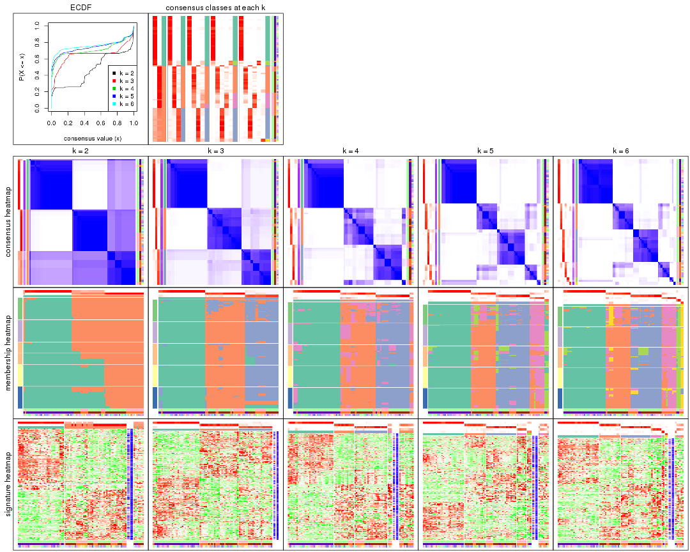

The plots are:

- The first row: a plot of the ECDF (Empirical cumulative distribution
  function) curves of the consensus matrix for each `k` and the heatmap of
  predicted classes for each `k`.
- The second row: heatmaps of the consensus matrix for each `k`.
- The third row: heatmaps of the membership matrix for each `k`.
- The fouth row: heatmaps of the signatures for each `k`.

All the plots in panels can be made by individual functions and they are
plotted later in this section.

`select_partition_number()` produces several plots showing different
statistics for choosing "optimized" `k`. There are following statistics:

- ECDF curves of the consensus matrix for each `k`;
- 1-PAC. [The PAC
  score](https://en.wikipedia.org/wiki/Consensus_clustering#Over-interpretation_potential_of_consensus_clustering)
  measures the proportion of the ambiguous subgrouping.
- Mean silhouette score.
- Concordance. The mean probability of fiting the consensus class ids in all
  partitions.
- Area increased. Denote $A_k$ as the area under the ECDF curve for current
  `k`, the area increased is defined as $A_k - A_{k-1}$.
- Rand index. The percent of pairs of samples that are both in a same cluster
  or both are not in a same cluster in the partition of k and k-1.
- Jaccard index. The ratio of pairs of samples are both in a same cluster in
  the partition of k and k-1 and the pairs of samples are both in a same
  cluster in the partition k or k-1.

The detailed explanations of these statistics can be found in [the cola
vignette](http://bioconductor.org/packages/devel/bioc/vignettes/cola/inst/doc/cola.html#toc_13).

Generally speaking, lower PAC score, higher mean silhouette score or higher
concordance corresponds to better partition. Rand index and Jaccard index
measure how similar the current partition is compared to partition with `k-1`.
If they are too similar, we won't accept `k` is better than `k-1`.

```r
select_partition_number(res)
```


The numeric values for all these statistics can be obtained by `get_stats()`.

```r
get_stats(res)
```

```
#>   k 1-PAC mean_silhouette concordance area_increased  Rand Jaccard
#> 2 2 0.582           0.781       0.880         0.4692 0.513   0.513
#> 3 3 0.721           0.925       0.924         0.3869 0.805   0.625
#> 4 4 0.776           0.733       0.875         0.0935 0.978   0.935
#> 5 5 0.791           0.818       0.872         0.0429 0.932   0.784
#> 6 6 0.852           0.824       0.904         0.0293 0.987   0.950
```

`suggest_best_k()` suggests the best $k$ based on these statistics. The rules are as follows:

- All $k$ with Jaccard index larger than 0.95 are removed because the increase of
  the partition number does not provides enough extra information. If all $k$ are removed,
  the best $k$ is assigned by `NA`.
- For $k$ with 1-PAC larger than 0.9, the maximal $k$ is taken as the "best k". Other $k$ is called "optional k".
- If it does not fit the second rule. The $k$ with the highest vote of highest
  1-PAC, mean silhouette and concordance is taken as the "best k".

```r
suggest_best_k(res)
```

```
#> [1] 3
```


Following shows the table of the partitions (You need to click the **show/hide
code output** link to see it). The membership matrix (columns with name `p*`)
is inferred by
[`clue::cl_consensus()`](https://www.rdocumentation.org/link/cl_consensus?package=clue)
function with the `SE` method. Basically the value in the membership matrix
represents the probability to belong to a certain group. The finall class
label for an item is determined with the group with highest probability it
belongs to.

In `get_classes()` function, the entropy is calculated from the membership
matrix and the silhouette score is calculated from the consensus matrix.


<script>
$( function() {
	$( '#tabs-CV-hclust-get-classes' ).tabs();
} );
</script>
<div id='tabs-CV-hclust-get-classes'>
<ul>
<li><a href='#tab-CV-hclust-get-classes-1'>k = 2</a></li>
<li><a href='#tab-CV-hclust-get-classes-2'>k = 3</a></li>
<li><a href='#tab-CV-hclust-get-classes-3'>k = 4</a></li>
<li><a href='#tab-CV-hclust-get-classes-4'>k = 5</a></li>
<li><a href='#tab-CV-hclust-get-classes-5'>k = 6</a></li>
</ul>

<div id='tab-CV-hclust-get-classes-1'>
<p><a id='tab-CV-hclust-get-classes-1-a' style='color:#0366d6' href='#'>show/hide code output</a></p>
<pre><code class="r">cbind(get_classes(res, k = 2), get_membership(res, k = 2))
</code></pre>

<pre><code>#&gt;           class entropy silhouette    p1    p2
#&gt; GSM372286     2  0.0000      0.777 0.000 1.000
#&gt; GSM372287     2  0.0000      0.777 0.000 1.000
#&gt; GSM372288     2  0.0000      0.777 0.000 1.000
#&gt; GSM372289     2  0.0000      0.777 0.000 1.000
#&gt; GSM372290     2  0.0000      0.777 0.000 1.000
#&gt; GSM372291     1  0.1633      0.949 0.976 0.024
#&gt; GSM372292     2  0.9393      0.633 0.356 0.644
#&gt; GSM372293     2  0.9393      0.633 0.356 0.644
#&gt; GSM372294     2  0.6343      0.723 0.160 0.840
#&gt; GSM372295     2  0.9686      0.599 0.396 0.604
#&gt; GSM372296     2  0.0000      0.777 0.000 1.000
#&gt; GSM372297     2  0.0000      0.777 0.000 1.000
#&gt; GSM372298     2  0.0000      0.777 0.000 1.000
#&gt; GSM372299     2  0.9686      0.599 0.396 0.604
#&gt; GSM372300     2  0.9393      0.633 0.356 0.644
#&gt; GSM372301     2  0.9393      0.633 0.356 0.644
#&gt; GSM372302     2  0.0000      0.777 0.000 1.000
#&gt; GSM372303     2  0.9393      0.633 0.356 0.644
#&gt; GSM372304     2  0.0000      0.777 0.000 1.000
#&gt; GSM372305     2  0.0000      0.777 0.000 1.000
#&gt; GSM372306     2  0.0000      0.777 0.000 1.000
#&gt; GSM372307     2  0.0000      0.777 0.000 1.000
#&gt; GSM372309     2  0.1184      0.775 0.016 0.984
#&gt; GSM372311     2  0.0000      0.777 0.000 1.000
#&gt; GSM372313     2  0.0000      0.777 0.000 1.000
#&gt; GSM372315     2  0.0000      0.777 0.000 1.000
#&gt; GSM372317     2  0.0000      0.777 0.000 1.000
#&gt; GSM372319     2  0.9686      0.599 0.396 0.604
#&gt; GSM372321     2  0.9686      0.599 0.396 0.604
#&gt; GSM372323     2  0.9963      0.476 0.464 0.536
#&gt; GSM372326     2  0.9686      0.599 0.396 0.604
#&gt; GSM372328     2  0.9686      0.599 0.396 0.604
#&gt; GSM372330     2  0.0000      0.777 0.000 1.000
#&gt; GSM372332     2  0.9686      0.599 0.396 0.604
#&gt; GSM372335     2  0.0376      0.777 0.004 0.996
#&gt; GSM372337     2  0.9963      0.476 0.464 0.536
#&gt; GSM372339     2  0.9686      0.599 0.396 0.604
#&gt; GSM372341     2  0.9686      0.599 0.396 0.604
#&gt; GSM372343     2  0.9686      0.599 0.396 0.604
#&gt; GSM372345     2  0.9963      0.476 0.464 0.536
#&gt; GSM372347     2  0.9963      0.476 0.464 0.536
#&gt; GSM372349     2  0.9963      0.476 0.464 0.536
#&gt; GSM372351     2  0.9686      0.599 0.396 0.604
#&gt; GSM372353     2  0.0376      0.777 0.004 0.996
#&gt; GSM372355     2  0.0000      0.777 0.000 1.000
#&gt; GSM372357     2  0.0376      0.777 0.004 0.996
#&gt; GSM372359     2  0.0000      0.777 0.000 1.000
#&gt; GSM372361     2  0.1184      0.775 0.016 0.984
#&gt; GSM372363     2  0.1184      0.775 0.016 0.984
#&gt; GSM372308     1  0.0376      0.969 0.996 0.004
#&gt; GSM372310     1  0.0376      0.969 0.996 0.004
#&gt; GSM372312     1  0.1633      0.952 0.976 0.024
#&gt; GSM372314     1  0.2236      0.938 0.964 0.036
#&gt; GSM372316     1  0.0000      0.971 1.000 0.000
#&gt; GSM372318     1  0.0000      0.971 1.000 0.000
#&gt; GSM372320     1  0.0000      0.971 1.000 0.000
#&gt; GSM372322     1  0.0000      0.971 1.000 0.000
#&gt; GSM372324     1  0.2236      0.938 0.964 0.036
#&gt; GSM372325     1  0.2236      0.938 0.964 0.036
#&gt; GSM372327     1  0.0000      0.971 1.000 0.000
#&gt; GSM372329     1  0.0000      0.971 1.000 0.000
#&gt; GSM372331     1  0.1414      0.956 0.980 0.020
#&gt; GSM372333     1  0.9970     -0.318 0.532 0.468
#&gt; GSM372334     1  0.0000      0.971 1.000 0.000
#&gt; GSM372336     1  0.0000      0.971 1.000 0.000
#&gt; GSM372338     1  0.0000      0.971 1.000 0.000
#&gt; GSM372340     1  0.0000      0.971 1.000 0.000
#&gt; GSM372342     1  0.0000      0.971 1.000 0.000
#&gt; GSM372344     1  0.0000      0.971 1.000 0.000
#&gt; GSM372346     1  0.0000      0.971 1.000 0.000
#&gt; GSM372348     1  0.0000      0.971 1.000 0.000
#&gt; GSM372350     1  0.0000      0.971 1.000 0.000
#&gt; GSM372352     2  1.0000      0.395 0.496 0.504
#&gt; GSM372354     1  0.0000      0.971 1.000 0.000
#&gt; GSM372356     1  0.0000      0.971 1.000 0.000
#&gt; GSM372358     1  0.0000      0.971 1.000 0.000
#&gt; GSM372360     1  0.0000      0.971 1.000 0.000
#&gt; GSM372362     1  0.0000      0.971 1.000 0.000
#&gt; GSM372364     1  0.0000      0.971 1.000 0.000
#&gt; GSM372365     1  0.0000      0.971 1.000 0.000
#&gt; GSM372366     1  0.0000      0.971 1.000 0.000
#&gt; GSM372367     1  0.1184      0.959 0.984 0.016
</code></pre>

<script>
$('#tab-CV-hclust-get-classes-1-a').parent().next().next().hide();
$('#tab-CV-hclust-get-classes-1-a').click(function(){
  $('#tab-CV-hclust-get-classes-1-a').parent().next().next().toggle();
  return(false);
});
</script>
</div>

<div id='tab-CV-hclust-get-classes-2'>
<p><a id='tab-CV-hclust-get-classes-2-a' style='color:#0366d6' href='#'>show/hide code output</a></p>
<pre><code class="r">cbind(get_classes(res, k = 3), get_membership(res, k = 3))
</code></pre>

<pre><code>#&gt;           class entropy silhouette    p1    p2    p3
#&gt; GSM372286     2  0.2448      0.924 0.000 0.924 0.076
#&gt; GSM372287     2  0.0424      0.930 0.000 0.992 0.008
#&gt; GSM372288     2  0.0237      0.931 0.000 0.996 0.004
#&gt; GSM372289     2  0.0237      0.931 0.000 0.996 0.004
#&gt; GSM372290     2  0.1031      0.935 0.000 0.976 0.024
#&gt; GSM372291     1  0.4645      0.826 0.816 0.008 0.176
#&gt; GSM372292     3  0.5407      0.875 0.040 0.156 0.804
#&gt; GSM372293     3  0.5407      0.875 0.040 0.156 0.804
#&gt; GSM372294     2  0.4062      0.824 0.000 0.836 0.164
#&gt; GSM372295     3  0.6000      0.833 0.040 0.200 0.760
#&gt; GSM372296     2  0.0237      0.931 0.000 0.996 0.004
#&gt; GSM372297     2  0.0592      0.931 0.000 0.988 0.012
#&gt; GSM372298     2  0.0747      0.931 0.000 0.984 0.016
#&gt; GSM372299     3  0.6000      0.833 0.040 0.200 0.760
#&gt; GSM372300     3  0.5407      0.875 0.040 0.156 0.804
#&gt; GSM372301     3  0.5407      0.875 0.040 0.156 0.804
#&gt; GSM372302     2  0.0237      0.931 0.000 0.996 0.004
#&gt; GSM372303     3  0.5407      0.875 0.040 0.156 0.804
#&gt; GSM372304     2  0.0592      0.931 0.000 0.988 0.012
#&gt; GSM372305     2  0.3192      0.913 0.000 0.888 0.112
#&gt; GSM372306     2  0.3192      0.913 0.000 0.888 0.112
#&gt; GSM372307     2  0.1031      0.935 0.000 0.976 0.024
#&gt; GSM372309     2  0.3941      0.855 0.000 0.844 0.156
#&gt; GSM372311     2  0.1411      0.937 0.000 0.964 0.036
#&gt; GSM372313     2  0.1411      0.937 0.000 0.964 0.036
#&gt; GSM372315     2  0.1411      0.937 0.000 0.964 0.036
#&gt; GSM372317     2  0.3192      0.913 0.000 0.888 0.112
#&gt; GSM372319     3  0.3572      0.914 0.040 0.060 0.900
#&gt; GSM372321     3  0.3472      0.914 0.040 0.056 0.904
#&gt; GSM372323     3  0.4964      0.892 0.116 0.048 0.836
#&gt; GSM372326     3  0.3472      0.915 0.040 0.056 0.904
#&gt; GSM372328     3  0.3369      0.915 0.040 0.052 0.908
#&gt; GSM372330     2  0.1411      0.937 0.000 0.964 0.036
#&gt; GSM372332     3  0.3369      0.915 0.040 0.052 0.908
#&gt; GSM372335     2  0.3267      0.910 0.000 0.884 0.116
#&gt; GSM372337     3  0.4964      0.894 0.116 0.048 0.836
#&gt; GSM372339     3  0.3369      0.915 0.040 0.052 0.908
#&gt; GSM372341     3  0.3369      0.915 0.040 0.052 0.908
#&gt; GSM372343     3  0.3369      0.915 0.040 0.052 0.908
#&gt; GSM372345     3  0.4964      0.892 0.116 0.048 0.836
#&gt; GSM372347     3  0.4964      0.892 0.116 0.048 0.836
#&gt; GSM372349     3  0.5067      0.894 0.116 0.052 0.832
#&gt; GSM372351     3  0.3856      0.912 0.040 0.072 0.888
#&gt; GSM372353     2  0.3879      0.881 0.000 0.848 0.152
#&gt; GSM372355     2  0.1411      0.937 0.000 0.964 0.036
#&gt; GSM372357     2  0.3116      0.917 0.000 0.892 0.108
#&gt; GSM372359     2  0.3816      0.885 0.000 0.852 0.148
#&gt; GSM372361     2  0.3879      0.858 0.000 0.848 0.152
#&gt; GSM372363     2  0.3941      0.855 0.000 0.844 0.156
#&gt; GSM372308     1  0.0237      0.977 0.996 0.000 0.004
#&gt; GSM372310     1  0.0237      0.977 0.996 0.000 0.004
#&gt; GSM372312     1  0.4521      0.833 0.816 0.004 0.180
#&gt; GSM372314     1  0.1878      0.945 0.952 0.004 0.044
#&gt; GSM372316     1  0.0000      0.979 1.000 0.000 0.000
#&gt; GSM372318     1  0.0000      0.979 1.000 0.000 0.000
#&gt; GSM372320     1  0.0000      0.979 1.000 0.000 0.000
#&gt; GSM372322     1  0.0000      0.979 1.000 0.000 0.000
#&gt; GSM372324     1  0.1878      0.945 0.952 0.004 0.044
#&gt; GSM372325     1  0.1878      0.945 0.952 0.004 0.044
#&gt; GSM372327     1  0.0000      0.979 1.000 0.000 0.000
#&gt; GSM372329     1  0.0000      0.979 1.000 0.000 0.000
#&gt; GSM372331     1  0.0983      0.967 0.980 0.004 0.016
#&gt; GSM372333     3  0.6446      0.800 0.212 0.052 0.736
#&gt; GSM372334     1  0.0000      0.979 1.000 0.000 0.000
#&gt; GSM372336     1  0.0000      0.979 1.000 0.000 0.000
#&gt; GSM372338     1  0.0000      0.979 1.000 0.000 0.000
#&gt; GSM372340     1  0.0000      0.979 1.000 0.000 0.000
#&gt; GSM372342     1  0.0000      0.979 1.000 0.000 0.000
#&gt; GSM372344     1  0.0000      0.979 1.000 0.000 0.000
#&gt; GSM372346     1  0.0000      0.979 1.000 0.000 0.000
#&gt; GSM372348     1  0.0000      0.979 1.000 0.000 0.000
#&gt; GSM372350     1  0.4002      0.851 0.840 0.000 0.160
#&gt; GSM372352     3  0.6034      0.856 0.152 0.068 0.780
#&gt; GSM372354     1  0.0000      0.979 1.000 0.000 0.000
#&gt; GSM372356     1  0.0000      0.979 1.000 0.000 0.000
#&gt; GSM372358     1  0.0000      0.979 1.000 0.000 0.000
#&gt; GSM372360     1  0.0000      0.979 1.000 0.000 0.000
#&gt; GSM372362     1  0.0000      0.979 1.000 0.000 0.000
#&gt; GSM372364     1  0.0000      0.979 1.000 0.000 0.000
#&gt; GSM372365     1  0.0000      0.979 1.000 0.000 0.000
#&gt; GSM372366     1  0.0000      0.979 1.000 0.000 0.000
#&gt; GSM372367     1  0.0829      0.970 0.984 0.004 0.012
</code></pre>

<script>
$('#tab-CV-hclust-get-classes-2-a').parent().next().next().hide();
$('#tab-CV-hclust-get-classes-2-a').click(function(){
  $('#tab-CV-hclust-get-classes-2-a').parent().next().next().toggle();
  return(false);
});
</script>
</div>

<div id='tab-CV-hclust-get-classes-3'>
<p><a id='tab-CV-hclust-get-classes-3-a' style='color:#0366d6' href='#'>show/hide code output</a></p>
<pre><code class="r">cbind(get_classes(res, k = 4), get_membership(res, k = 4))
</code></pre>

<pre><code>#&gt;           class entropy silhouette    p1    p2    p3    p4
#&gt; GSM372286     2  0.6089    -0.0756 0.000 0.608 0.064 0.328
#&gt; GSM372287     2  0.4981    -0.7417 0.000 0.536 0.000 0.464
#&gt; GSM372288     2  0.4925    -0.6528 0.000 0.572 0.000 0.428
#&gt; GSM372289     2  0.4925    -0.6528 0.000 0.572 0.000 0.428
#&gt; GSM372290     2  0.3105     0.5305 0.000 0.868 0.012 0.120
#&gt; GSM372291     1  0.5228     0.7073 0.696 0.000 0.036 0.268
#&gt; GSM372292     3  0.3372     0.8631 0.000 0.036 0.868 0.096
#&gt; GSM372293     3  0.3372     0.8631 0.000 0.036 0.868 0.096
#&gt; GSM372294     2  0.5685    -0.4880 0.000 0.516 0.024 0.460
#&gt; GSM372295     3  0.4995     0.7286 0.000 0.032 0.720 0.248
#&gt; GSM372296     2  0.4193     0.0673 0.000 0.732 0.000 0.268
#&gt; GSM372297     4  0.5388     0.9673 0.000 0.456 0.012 0.532
#&gt; GSM372298     4  0.5771     0.9345 0.000 0.460 0.028 0.512
#&gt; GSM372299     3  0.4995     0.7286 0.000 0.032 0.720 0.248
#&gt; GSM372300     3  0.3372     0.8631 0.000 0.036 0.868 0.096
#&gt; GSM372301     3  0.3372     0.8631 0.000 0.036 0.868 0.096
#&gt; GSM372302     2  0.4193     0.0673 0.000 0.732 0.000 0.268
#&gt; GSM372303     3  0.3372     0.8631 0.000 0.036 0.868 0.096
#&gt; GSM372304     4  0.5388     0.9673 0.000 0.456 0.012 0.532
#&gt; GSM372305     2  0.2996     0.6253 0.000 0.892 0.064 0.044
#&gt; GSM372306     2  0.2996     0.6253 0.000 0.892 0.064 0.044
#&gt; GSM372307     2  0.3217     0.5224 0.000 0.860 0.012 0.128
#&gt; GSM372309     2  0.5361     0.4910 0.000 0.724 0.068 0.208
#&gt; GSM372311     2  0.0524     0.6116 0.000 0.988 0.004 0.008
#&gt; GSM372313     2  0.0524     0.6116 0.000 0.988 0.004 0.008
#&gt; GSM372315     2  0.0524     0.6116 0.000 0.988 0.004 0.008
#&gt; GSM372317     2  0.2996     0.6253 0.000 0.892 0.064 0.044
#&gt; GSM372319     3  0.1174     0.9039 0.000 0.020 0.968 0.012
#&gt; GSM372321     3  0.1059     0.9045 0.000 0.016 0.972 0.012
#&gt; GSM372323     3  0.3215     0.8845 0.020 0.024 0.892 0.064
#&gt; GSM372326     3  0.0376     0.9062 0.000 0.004 0.992 0.004
#&gt; GSM372328     3  0.0000     0.9063 0.000 0.000 1.000 0.000
#&gt; GSM372330     2  0.0524     0.6116 0.000 0.988 0.004 0.008
#&gt; GSM372332     3  0.0000     0.9063 0.000 0.000 1.000 0.000
#&gt; GSM372335     2  0.3144     0.6217 0.000 0.884 0.072 0.044
#&gt; GSM372337     3  0.2667     0.8884 0.020 0.008 0.912 0.060
#&gt; GSM372339     3  0.0000     0.9063 0.000 0.000 1.000 0.000
#&gt; GSM372341     3  0.0000     0.9063 0.000 0.000 1.000 0.000
#&gt; GSM372343     3  0.0000     0.9063 0.000 0.000 1.000 0.000
#&gt; GSM372345     3  0.3215     0.8845 0.020 0.024 0.892 0.064
#&gt; GSM372347     3  0.3215     0.8845 0.020 0.024 0.892 0.064
#&gt; GSM372349     3  0.2587     0.8894 0.020 0.008 0.916 0.056
#&gt; GSM372351     3  0.1624     0.9001 0.000 0.028 0.952 0.020
#&gt; GSM372353     2  0.3523     0.5927 0.000 0.856 0.112 0.032
#&gt; GSM372355     2  0.0524     0.6116 0.000 0.988 0.004 0.008
#&gt; GSM372357     2  0.3245     0.6216 0.000 0.880 0.056 0.064
#&gt; GSM372359     2  0.3464     0.5974 0.000 0.860 0.108 0.032
#&gt; GSM372361     2  0.5528     0.4716 0.000 0.700 0.064 0.236
#&gt; GSM372363     2  0.5328     0.4942 0.000 0.724 0.064 0.212
#&gt; GSM372308     1  0.0336     0.9602 0.992 0.000 0.000 0.008
#&gt; GSM372310     1  0.0336     0.9602 0.992 0.000 0.000 0.008
#&gt; GSM372312     1  0.5298     0.7154 0.696 0.008 0.024 0.272
#&gt; GSM372314     1  0.3072     0.8960 0.892 0.008 0.024 0.076
#&gt; GSM372316     1  0.0000     0.9628 1.000 0.000 0.000 0.000
#&gt; GSM372318     1  0.0000     0.9628 1.000 0.000 0.000 0.000
#&gt; GSM372320     1  0.0000     0.9628 1.000 0.000 0.000 0.000
#&gt; GSM372322     1  0.0000     0.9628 1.000 0.000 0.000 0.000
#&gt; GSM372324     1  0.3072     0.8960 0.892 0.008 0.024 0.076
#&gt; GSM372325     1  0.3072     0.8960 0.892 0.008 0.024 0.076
#&gt; GSM372327     1  0.0000     0.9628 1.000 0.000 0.000 0.000
#&gt; GSM372329     1  0.0000     0.9628 1.000 0.000 0.000 0.000
#&gt; GSM372331     1  0.1209     0.9460 0.964 0.004 0.000 0.032
#&gt; GSM372333     3  0.4419     0.7988 0.116 0.008 0.820 0.056
#&gt; GSM372334     1  0.0000     0.9628 1.000 0.000 0.000 0.000
#&gt; GSM372336     1  0.0592     0.9565 0.984 0.000 0.000 0.016
#&gt; GSM372338     1  0.0000     0.9628 1.000 0.000 0.000 0.000
#&gt; GSM372340     1  0.0000     0.9628 1.000 0.000 0.000 0.000
#&gt; GSM372342     1  0.0000     0.9628 1.000 0.000 0.000 0.000
#&gt; GSM372344     1  0.0000     0.9628 1.000 0.000 0.000 0.000
#&gt; GSM372346     1  0.0000     0.9628 1.000 0.000 0.000 0.000
#&gt; GSM372348     1  0.0592     0.9565 0.984 0.000 0.000 0.016
#&gt; GSM372350     1  0.4868     0.7347 0.720 0.000 0.024 0.256
#&gt; GSM372352     3  0.4612     0.8485 0.056 0.036 0.828 0.080
#&gt; GSM372354     1  0.0000     0.9628 1.000 0.000 0.000 0.000
#&gt; GSM372356     1  0.0000     0.9628 1.000 0.000 0.000 0.000
#&gt; GSM372358     1  0.0000     0.9628 1.000 0.000 0.000 0.000
#&gt; GSM372360     1  0.0000     0.9628 1.000 0.000 0.000 0.000
#&gt; GSM372362     1  0.0000     0.9628 1.000 0.000 0.000 0.000
#&gt; GSM372364     1  0.0000     0.9628 1.000 0.000 0.000 0.000
#&gt; GSM372365     1  0.0000     0.9628 1.000 0.000 0.000 0.000
#&gt; GSM372366     1  0.0000     0.9628 1.000 0.000 0.000 0.000
#&gt; GSM372367     1  0.0592     0.9549 0.984 0.000 0.000 0.016
</code></pre>

<script>
$('#tab-CV-hclust-get-classes-3-a').parent().next().next().hide();
$('#tab-CV-hclust-get-classes-3-a').click(function(){
  $('#tab-CV-hclust-get-classes-3-a').parent().next().next().toggle();
  return(false);
});
</script>
</div>

<div id='tab-CV-hclust-get-classes-4'>
<p><a id='tab-CV-hclust-get-classes-4-a' style='color:#0366d6' href='#'>show/hide code output</a></p>
<pre><code class="r">cbind(get_classes(res, k = 5), get_membership(res, k = 5))
</code></pre>

<pre><code>#&gt;           class entropy silhouette    p1    p2    p3    p4    p5
#&gt; GSM372286     4  0.5385      0.418 0.000 0.432 0.056 0.512 0.000
#&gt; GSM372287     4  0.2773      0.759 0.000 0.164 0.000 0.836 0.000
#&gt; GSM372288     4  0.3143      0.756 0.000 0.204 0.000 0.796 0.000
#&gt; GSM372289     4  0.3143      0.756 0.000 0.204 0.000 0.796 0.000
#&gt; GSM372290     2  0.4556      0.440 0.000 0.680 0.004 0.292 0.024
#&gt; GSM372291     5  0.4216      0.853 0.260 0.000 0.012 0.008 0.720
#&gt; GSM372292     3  0.3304      0.822 0.000 0.004 0.840 0.128 0.028
#&gt; GSM372293     3  0.3304      0.822 0.000 0.004 0.840 0.128 0.028
#&gt; GSM372294     4  0.6000      0.599 0.000 0.268 0.000 0.572 0.160
#&gt; GSM372295     3  0.7080      0.481 0.000 0.080 0.544 0.124 0.252
#&gt; GSM372296     4  0.4300      0.346 0.000 0.476 0.000 0.524 0.000
#&gt; GSM372297     4  0.2669      0.741 0.000 0.104 0.000 0.876 0.020
#&gt; GSM372298     4  0.2915      0.734 0.000 0.116 0.000 0.860 0.024
#&gt; GSM372299     3  0.7080      0.481 0.000 0.080 0.544 0.124 0.252
#&gt; GSM372300     3  0.3304      0.822 0.000 0.004 0.840 0.128 0.028
#&gt; GSM372301     3  0.3304      0.822 0.000 0.004 0.840 0.128 0.028
#&gt; GSM372302     4  0.4300      0.346 0.000 0.476 0.000 0.524 0.000
#&gt; GSM372303     3  0.3304      0.822 0.000 0.004 0.840 0.128 0.028
#&gt; GSM372304     4  0.2669      0.741 0.000 0.104 0.000 0.876 0.020
#&gt; GSM372305     2  0.1341      0.799 0.000 0.944 0.056 0.000 0.000
#&gt; GSM372306     2  0.1341      0.799 0.000 0.944 0.056 0.000 0.000
#&gt; GSM372307     2  0.4636      0.410 0.000 0.664 0.004 0.308 0.024
#&gt; GSM372309     2  0.4411      0.638 0.000 0.772 0.004 0.096 0.128
#&gt; GSM372311     2  0.2286      0.775 0.000 0.888 0.004 0.108 0.000
#&gt; GSM372313     2  0.2286      0.775 0.000 0.888 0.004 0.108 0.000
#&gt; GSM372315     2  0.2286      0.775 0.000 0.888 0.004 0.108 0.000
#&gt; GSM372317     2  0.1341      0.799 0.000 0.944 0.056 0.000 0.000
#&gt; GSM372319     3  0.0963      0.876 0.000 0.036 0.964 0.000 0.000
#&gt; GSM372321     3  0.0880      0.877 0.000 0.032 0.968 0.000 0.000
#&gt; GSM372323     3  0.2616      0.854 0.000 0.036 0.888 0.000 0.076
#&gt; GSM372326     3  0.0451      0.878 0.000 0.004 0.988 0.000 0.008
#&gt; GSM372328     3  0.0000      0.879 0.000 0.000 1.000 0.000 0.000
#&gt; GSM372330     2  0.2286      0.775 0.000 0.888 0.004 0.108 0.000
#&gt; GSM372332     3  0.0000      0.879 0.000 0.000 1.000 0.000 0.000
#&gt; GSM372335     2  0.1478      0.796 0.000 0.936 0.064 0.000 0.000
#&gt; GSM372337     3  0.2069      0.859 0.000 0.012 0.912 0.000 0.076
#&gt; GSM372339     3  0.0000      0.879 0.000 0.000 1.000 0.000 0.000
#&gt; GSM372341     3  0.0000      0.879 0.000 0.000 1.000 0.000 0.000
#&gt; GSM372343     3  0.0000      0.879 0.000 0.000 1.000 0.000 0.000
#&gt; GSM372345     3  0.2616      0.854 0.000 0.036 0.888 0.000 0.076
#&gt; GSM372347     3  0.2616      0.854 0.000 0.036 0.888 0.000 0.076
#&gt; GSM372349     3  0.1956      0.860 0.000 0.008 0.916 0.000 0.076
#&gt; GSM372351     3  0.1357      0.873 0.000 0.048 0.948 0.000 0.004
#&gt; GSM372353     2  0.2074      0.766 0.000 0.896 0.104 0.000 0.000
#&gt; GSM372355     2  0.2286      0.775 0.000 0.888 0.004 0.108 0.000
#&gt; GSM372357     2  0.1844      0.794 0.000 0.936 0.040 0.012 0.012
#&gt; GSM372359     2  0.2020      0.770 0.000 0.900 0.100 0.000 0.000
#&gt; GSM372361     2  0.5102      0.555 0.000 0.696 0.000 0.176 0.128
#&gt; GSM372363     2  0.4747      0.619 0.000 0.744 0.004 0.124 0.128
#&gt; GSM372308     1  0.0324      0.967 0.992 0.004 0.000 0.000 0.004
#&gt; GSM372310     1  0.0324      0.967 0.992 0.004 0.000 0.000 0.004
#&gt; GSM372312     5  0.4817      0.738 0.404 0.024 0.000 0.000 0.572
#&gt; GSM372314     1  0.3110      0.793 0.872 0.024 0.024 0.000 0.080
#&gt; GSM372316     1  0.0000      0.973 1.000 0.000 0.000 0.000 0.000
#&gt; GSM372318     1  0.0000      0.973 1.000 0.000 0.000 0.000 0.000
#&gt; GSM372320     1  0.0000      0.973 1.000 0.000 0.000 0.000 0.000
#&gt; GSM372322     1  0.0000      0.973 1.000 0.000 0.000 0.000 0.000
#&gt; GSM372324     1  0.3110      0.793 0.872 0.024 0.024 0.000 0.080
#&gt; GSM372325     1  0.3110      0.793 0.872 0.024 0.024 0.000 0.080
#&gt; GSM372327     1  0.0000      0.973 1.000 0.000 0.000 0.000 0.000
#&gt; GSM372329     1  0.0000      0.973 1.000 0.000 0.000 0.000 0.000
#&gt; GSM372331     1  0.1216      0.933 0.960 0.020 0.000 0.000 0.020
#&gt; GSM372333     3  0.3866      0.758 0.096 0.008 0.820 0.000 0.076
#&gt; GSM372334     1  0.0000      0.973 1.000 0.000 0.000 0.000 0.000
#&gt; GSM372336     1  0.0609      0.955 0.980 0.000 0.000 0.000 0.020
#&gt; GSM372338     1  0.0000      0.973 1.000 0.000 0.000 0.000 0.000
#&gt; GSM372340     1  0.0000      0.973 1.000 0.000 0.000 0.000 0.000
#&gt; GSM372342     1  0.0000      0.973 1.000 0.000 0.000 0.000 0.000
#&gt; GSM372344     1  0.0000      0.973 1.000 0.000 0.000 0.000 0.000
#&gt; GSM372346     1  0.0000      0.973 1.000 0.000 0.000 0.000 0.000
#&gt; GSM372348     1  0.0609      0.955 0.980 0.000 0.000 0.000 0.020
#&gt; GSM372350     5  0.3707      0.873 0.284 0.000 0.000 0.000 0.716
#&gt; GSM372352     3  0.4045      0.815 0.036 0.064 0.824 0.000 0.076
#&gt; GSM372354     1  0.0000      0.973 1.000 0.000 0.000 0.000 0.000
#&gt; GSM372356     1  0.0000      0.973 1.000 0.000 0.000 0.000 0.000
#&gt; GSM372358     1  0.0000      0.973 1.000 0.000 0.000 0.000 0.000
#&gt; GSM372360     1  0.0000      0.973 1.000 0.000 0.000 0.000 0.000
#&gt; GSM372362     1  0.0000      0.973 1.000 0.000 0.000 0.000 0.000
#&gt; GSM372364     1  0.0000      0.973 1.000 0.000 0.000 0.000 0.000
#&gt; GSM372365     1  0.0000      0.973 1.000 0.000 0.000 0.000 0.000
#&gt; GSM372366     1  0.0000      0.973 1.000 0.000 0.000 0.000 0.000
#&gt; GSM372367     1  0.0510      0.957 0.984 0.016 0.000 0.000 0.000
</code></pre>

<script>
$('#tab-CV-hclust-get-classes-4-a').parent().next().next().hide();
$('#tab-CV-hclust-get-classes-4-a').click(function(){
  $('#tab-CV-hclust-get-classes-4-a').parent().next().next().toggle();
  return(false);
});
</script>
</div>

<div id='tab-CV-hclust-get-classes-5'>
<p><a id='tab-CV-hclust-get-classes-5-a' style='color:#0366d6' href='#'>show/hide code output</a></p>
<pre><code class="r">cbind(get_classes(res, k = 6), get_membership(res, k = 6))
</code></pre>

<pre><code>#&gt;           class entropy silhouette    p1    p2    p3    p4    p5    p6
#&gt; GSM372286     4  0.4184      0.403 0.000 0.408 0.016 0.576 0.000 0.000
#&gt; GSM372287     4  0.0717      0.731 0.000 0.016 0.000 0.976 0.008 0.000
#&gt; GSM372288     4  0.1327      0.740 0.000 0.064 0.000 0.936 0.000 0.000
#&gt; GSM372289     4  0.1327      0.740 0.000 0.064 0.000 0.936 0.000 0.000
#&gt; GSM372290     2  0.4676      0.255 0.000 0.544 0.004 0.416 0.000 0.036
#&gt; GSM372291     5  0.0653      0.667 0.004 0.000 0.012 0.000 0.980 0.004
#&gt; GSM372292     3  0.3350      0.819 0.000 0.004 0.836 0.064 0.008 0.088
#&gt; GSM372293     3  0.3350      0.819 0.000 0.004 0.836 0.064 0.008 0.088
#&gt; GSM372294     4  0.5027      0.617 0.000 0.200 0.000 0.640 0.160 0.000
#&gt; GSM372295     6  0.1753      1.000 0.000 0.004 0.084 0.000 0.000 0.912
#&gt; GSM372296     4  0.3578      0.455 0.000 0.340 0.000 0.660 0.000 0.000
#&gt; GSM372297     4  0.1584      0.706 0.000 0.000 0.000 0.928 0.008 0.064
#&gt; GSM372298     4  0.2670      0.709 0.000 0.040 0.000 0.872 0.004 0.084
#&gt; GSM372299     6  0.1753      1.000 0.000 0.004 0.084 0.000 0.000 0.912
#&gt; GSM372300     3  0.3350      0.819 0.000 0.004 0.836 0.064 0.008 0.088
#&gt; GSM372301     3  0.3350      0.819 0.000 0.004 0.836 0.064 0.008 0.088
#&gt; GSM372302     4  0.3578      0.455 0.000 0.340 0.000 0.660 0.000 0.000
#&gt; GSM372303     3  0.3350      0.819 0.000 0.004 0.836 0.064 0.008 0.088
#&gt; GSM372304     4  0.1584      0.706 0.000 0.000 0.000 0.928 0.008 0.064
#&gt; GSM372305     2  0.0458      0.803 0.000 0.984 0.016 0.000 0.000 0.000
#&gt; GSM372306     2  0.0458      0.803 0.000 0.984 0.016 0.000 0.000 0.000
#&gt; GSM372307     2  0.4701      0.207 0.000 0.524 0.004 0.436 0.000 0.036
#&gt; GSM372309     2  0.3390      0.643 0.000 0.704 0.000 0.000 0.000 0.296
#&gt; GSM372311     2  0.1863      0.791 0.000 0.896 0.000 0.104 0.000 0.000
#&gt; GSM372313     2  0.1863      0.791 0.000 0.896 0.000 0.104 0.000 0.000
#&gt; GSM372315     2  0.1863      0.791 0.000 0.896 0.000 0.104 0.000 0.000
#&gt; GSM372317     2  0.0458      0.803 0.000 0.984 0.016 0.000 0.000 0.000
#&gt; GSM372319     3  0.1267      0.878 0.000 0.060 0.940 0.000 0.000 0.000
#&gt; GSM372321     3  0.1204      0.879 0.000 0.056 0.944 0.000 0.000 0.000
#&gt; GSM372323     3  0.2554      0.859 0.000 0.048 0.876 0.000 0.076 0.000
#&gt; GSM372326     3  0.0363      0.888 0.000 0.000 0.988 0.000 0.000 0.012
#&gt; GSM372328     3  0.0000      0.890 0.000 0.000 1.000 0.000 0.000 0.000
#&gt; GSM372330     2  0.1863      0.791 0.000 0.896 0.000 0.104 0.000 0.000
#&gt; GSM372332     3  0.0000      0.890 0.000 0.000 1.000 0.000 0.000 0.000
#&gt; GSM372335     2  0.0632      0.801 0.000 0.976 0.024 0.000 0.000 0.000
#&gt; GSM372337     3  0.1951      0.869 0.000 0.016 0.908 0.000 0.076 0.000
#&gt; GSM372339     3  0.0000      0.890 0.000 0.000 1.000 0.000 0.000 0.000
#&gt; GSM372341     3  0.0000      0.890 0.000 0.000 1.000 0.000 0.000 0.000
#&gt; GSM372343     3  0.0000      0.890 0.000 0.000 1.000 0.000 0.000 0.000
#&gt; GSM372345     3  0.2554      0.859 0.000 0.048 0.876 0.000 0.076 0.000
#&gt; GSM372347     3  0.2554      0.859 0.000 0.048 0.876 0.000 0.076 0.000
#&gt; GSM372349     3  0.1757      0.870 0.000 0.008 0.916 0.000 0.076 0.000
#&gt; GSM372351     3  0.1531      0.876 0.000 0.068 0.928 0.000 0.000 0.004
#&gt; GSM372353     2  0.1327      0.780 0.000 0.936 0.064 0.000 0.000 0.000
#&gt; GSM372355     2  0.1863      0.791 0.000 0.896 0.000 0.104 0.000 0.000
#&gt; GSM372357     2  0.1196      0.800 0.000 0.952 0.008 0.000 0.000 0.040
#&gt; GSM372359     2  0.1267      0.784 0.000 0.940 0.060 0.000 0.000 0.000
#&gt; GSM372361     2  0.5286      0.514 0.000 0.572 0.000 0.132 0.000 0.296
#&gt; GSM372363     2  0.4463      0.609 0.000 0.652 0.000 0.056 0.000 0.292
#&gt; GSM372308     1  0.0291      0.972 0.992 0.004 0.000 0.000 0.000 0.004
#&gt; GSM372310     1  0.0291      0.972 0.992 0.004 0.000 0.000 0.000 0.004
#&gt; GSM372312     5  0.3670      0.469 0.240 0.024 0.000 0.000 0.736 0.000
#&gt; GSM372314     1  0.2882      0.849 0.872 0.024 0.024 0.000 0.076 0.004
#&gt; GSM372316     1  0.0000      0.975 1.000 0.000 0.000 0.000 0.000 0.000
#&gt; GSM372318     1  0.0000      0.975 1.000 0.000 0.000 0.000 0.000 0.000
#&gt; GSM372320     1  0.0458      0.971 0.984 0.000 0.000 0.000 0.016 0.000
#&gt; GSM372322     1  0.0260      0.974 0.992 0.000 0.000 0.000 0.008 0.000
#&gt; GSM372324     1  0.2882      0.849 0.872 0.024 0.024 0.000 0.076 0.004
#&gt; GSM372325     1  0.2882      0.849 0.872 0.024 0.024 0.000 0.076 0.004
#&gt; GSM372327     1  0.0363      0.972 0.988 0.000 0.000 0.000 0.012 0.000
#&gt; GSM372329     1  0.0363      0.972 0.988 0.000 0.000 0.000 0.012 0.000
#&gt; GSM372331     1  0.1148      0.950 0.960 0.020 0.000 0.000 0.016 0.004
#&gt; GSM372333     3  0.3472      0.763 0.096 0.008 0.820 0.000 0.076 0.000
#&gt; GSM372334     1  0.0458      0.971 0.984 0.000 0.000 0.000 0.016 0.000
#&gt; GSM372336     1  0.0603      0.965 0.980 0.000 0.000 0.000 0.016 0.004
#&gt; GSM372338     1  0.0458      0.971 0.984 0.000 0.000 0.000 0.016 0.000
#&gt; GSM372340     1  0.0458      0.971 0.984 0.000 0.000 0.000 0.016 0.000
#&gt; GSM372342     1  0.0260      0.974 0.992 0.000 0.000 0.000 0.008 0.000
#&gt; GSM372344     1  0.0458      0.971 0.984 0.000 0.000 0.000 0.016 0.000
#&gt; GSM372346     1  0.0260      0.974 0.992 0.000 0.000 0.000 0.008 0.000
#&gt; GSM372348     1  0.0603      0.965 0.980 0.000 0.000 0.000 0.016 0.004
#&gt; GSM372350     5  0.0363      0.682 0.012 0.000 0.000 0.000 0.988 0.000
#&gt; GSM372352     3  0.3901      0.809 0.036 0.084 0.804 0.000 0.076 0.000
#&gt; GSM372354     1  0.0000      0.975 1.000 0.000 0.000 0.000 0.000 0.000
#&gt; GSM372356     1  0.0000      0.975 1.000 0.000 0.000 0.000 0.000 0.000
#&gt; GSM372358     1  0.0000      0.975 1.000 0.000 0.000 0.000 0.000 0.000
#&gt; GSM372360     1  0.0000      0.975 1.000 0.000 0.000 0.000 0.000 0.000
#&gt; GSM372362     1  0.0000      0.975 1.000 0.000 0.000 0.000 0.000 0.000
#&gt; GSM372364     1  0.0000      0.975 1.000 0.000 0.000 0.000 0.000 0.000
#&gt; GSM372365     1  0.0000      0.975 1.000 0.000 0.000 0.000 0.000 0.000
#&gt; GSM372366     1  0.0000      0.975 1.000 0.000 0.000 0.000 0.000 0.000
#&gt; GSM372367     1  0.0458      0.966 0.984 0.016 0.000 0.000 0.000 0.000
</code></pre>

<script>
$('#tab-CV-hclust-get-classes-5-a').parent().next().next().hide();
$('#tab-CV-hclust-get-classes-5-a').click(function(){
  $('#tab-CV-hclust-get-classes-5-a').parent().next().next().toggle();
  return(false);
});
</script>
</div>
</div>

Heatmaps for the consensus matrix. It visualizes the probability of two
samples to be in a same group.


<script>
$( function() {
	$( '#tabs-CV-hclust-consensus-heatmap' ).tabs();
} );
</script>
<div id='tabs-CV-hclust-consensus-heatmap'>
<ul>
<li><a href='#tab-CV-hclust-consensus-heatmap-1'>k = 2</a></li>
<li><a href='#tab-CV-hclust-consensus-heatmap-2'>k = 3</a></li>
<li><a href='#tab-CV-hclust-consensus-heatmap-3'>k = 4</a></li>
<li><a href='#tab-CV-hclust-consensus-heatmap-4'>k = 5</a></li>
<li><a href='#tab-CV-hclust-consensus-heatmap-5'>k = 6</a></li>
</ul>
<div id='tab-CV-hclust-consensus-heatmap-1'>
<pre><code class="r">consensus_heatmap(res, k = 2)
</code></pre>

<p></p>

</div>
<div id='tab-CV-hclust-consensus-heatmap-2'>
<pre><code class="r">consensus_heatmap(res, k = 3)
</code></pre>

<p></p>

</div>
<div id='tab-CV-hclust-consensus-heatmap-3'>
<pre><code class="r">consensus_heatmap(res, k = 4)
</code></pre>

<p></p>

</div>
<div id='tab-CV-hclust-consensus-heatmap-4'>
<pre><code class="r">consensus_heatmap(res, k = 5)
</code></pre>

<p></p>

</div>
<div id='tab-CV-hclust-consensus-heatmap-5'>
<pre><code class="r">consensus_heatmap(res, k = 6)
</code></pre>

<p></p>

</div>
</div>

Heatmaps for the membership of samples in all partitions to see how consistent they are:


<script>
$( function() {
	$( '#tabs-CV-hclust-membership-heatmap' ).tabs();
} );
</script>
<div id='tabs-CV-hclust-membership-heatmap'>
<ul>
<li><a href='#tab-CV-hclust-membership-heatmap-1'>k = 2</a></li>
<li><a href='#tab-CV-hclust-membership-heatmap-2'>k = 3</a></li>
<li><a href='#tab-CV-hclust-membership-heatmap-3'>k = 4</a></li>
<li><a href='#tab-CV-hclust-membership-heatmap-4'>k = 5</a></li>
<li><a href='#tab-CV-hclust-membership-heatmap-5'>k = 6</a></li>
</ul>
<div id='tab-CV-hclust-membership-heatmap-1'>
<pre><code class="r">membership_heatmap(res, k = 2)
</code></pre>

<p></p>

</div>
<div id='tab-CV-hclust-membership-heatmap-2'>
<pre><code class="r">membership_heatmap(res, k = 3)
</code></pre>

<p></p>

</div>
<div id='tab-CV-hclust-membership-heatmap-3'>
<pre><code class="r">membership_heatmap(res, k = 4)
</code></pre>

<p></p>

</div>
<div id='tab-CV-hclust-membership-heatmap-4'>
<pre><code class="r">membership_heatmap(res, k = 5)
</code></pre>

<p></p>

</div>
<div id='tab-CV-hclust-membership-heatmap-5'>
<pre><code class="r">membership_heatmap(res, k = 6)
</code></pre>

<p></p>

</div>
</div>

As soon as we have had the classes for columns, we can look for signatures
which are significantly different between classes which can be candidate marks
for certain classes. Following are the heatmaps for signatures.


Signature heatmaps where rows are scaled:


<script>
$( function() {
	$( '#tabs-CV-hclust-get-signatures' ).tabs();
} );
</script>
<div id='tabs-CV-hclust-get-signatures'>
<ul>
<li><a href='#tab-CV-hclust-get-signatures-1'>k = 2</a></li>
<li><a href='#tab-CV-hclust-get-signatures-2'>k = 3</a></li>
<li><a href='#tab-CV-hclust-get-signatures-3'>k = 4</a></li>
<li><a href='#tab-CV-hclust-get-signatures-4'>k = 5</a></li>
<li><a href='#tab-CV-hclust-get-signatures-5'>k = 6</a></li>
</ul>
<div id='tab-CV-hclust-get-signatures-1'>
<pre><code class="r">get_signatures(res, k = 2)
</code></pre>

<p></p>

</div>
<div id='tab-CV-hclust-get-signatures-2'>
<pre><code class="r">get_signatures(res, k = 3)
</code></pre>

<p></p>

</div>
<div id='tab-CV-hclust-get-signatures-3'>
<pre><code class="r">get_signatures(res, k = 4)
</code></pre>

<p></p>

</div>
<div id='tab-CV-hclust-get-signatures-4'>
<pre><code class="r">get_signatures(res, k = 5)
</code></pre>

<p></p>

</div>
<div id='tab-CV-hclust-get-signatures-5'>
<pre><code class="r">get_signatures(res, k = 6)
</code></pre>

<p></p>

</div>
</div>


Signature heatmaps where rows are not scaled:


<script>
$( function() {
	$( '#tabs-CV-hclust-get-signatures-no-scale' ).tabs();
} );
</script>
<div id='tabs-CV-hclust-get-signatures-no-scale'>
<ul>
<li><a href='#tab-CV-hclust-get-signatures-no-scale-1'>k = 2</a></li>
<li><a href='#tab-CV-hclust-get-signatures-no-scale-2'>k = 3</a></li>
<li><a href='#tab-CV-hclust-get-signatures-no-scale-3'>k = 4</a></li>
<li><a href='#tab-CV-hclust-get-signatures-no-scale-4'>k = 5</a></li>
<li><a href='#tab-CV-hclust-get-signatures-no-scale-5'>k = 6</a></li>
</ul>
<div id='tab-CV-hclust-get-signatures-no-scale-1'>
<pre><code class="r">get_signatures(res, k = 2, scale_rows = FALSE)
</code></pre>

<p></p>

</div>
<div id='tab-CV-hclust-get-signatures-no-scale-2'>
<pre><code class="r">get_signatures(res, k = 3, scale_rows = FALSE)
</code></pre>

<p></p>

</div>
<div id='tab-CV-hclust-get-signatures-no-scale-3'>
<pre><code class="r">get_signatures(res, k = 4, scale_rows = FALSE)
</code></pre>

<p></p>

</div>
<div id='tab-CV-hclust-get-signatures-no-scale-4'>
<pre><code class="r">get_signatures(res, k = 5, scale_rows = FALSE)
</code></pre>

<p></p>

</div>
<div id='tab-CV-hclust-get-signatures-no-scale-5'>
<pre><code class="r">get_signatures(res, k = 6, scale_rows = FALSE)
</code></pre>

<p></p>

</div>
</div>


Compare the overlap of signatures from different k:

```r
compare_signatures(res)
```


`get_signature()` returns a data frame invisibly. TO get the list of signatures, the function
call should be assigned to a variable explicitly. In following code, if `plot` argument is set
to `FALSE`, no heatmap is plotted while only the differential analysis is performed.

```r
# code only for demonstration
tb = get_signature(res, k = ..., plot = FALSE)
```

An example of the output of `tb` is:

```
#>   which_row         fdr    mean_1    mean_2 scaled_mean_1 scaled_mean_2 km
#> 1        38 0.042760348  8.373488  9.131774    -0.5533452     0.5164555  1
#> 2        40 0.018707592  7.106213  8.469186    -0.6173731     0.5762149  1
#> 3        55 0.019134737 10.221463 11.207825    -0.6159697     0.5749050  1
#> 4        59 0.006059896  5.921854  7.869574    -0.6899429     0.6439467  1
#> 5        60 0.018055526  8.928898 10.211722    -0.6204761     0.5791110  1
#> 6        98 0.009384629 15.714769 14.887706     0.6635654    -0.6193277  2
...
```

The columns in `tb` are:

1. `which_row`: row indices corresponding to the input matrix.
2. `fdr`: FDR for the differential test. 
3. `mean_x`: The mean value in group x.
4. `scaled_mean_x`: The mean value in group x after rows are scaled.
5. `km`: Row groups if k-means clustering is applied to rows.


UMAP plot which shows how samples are separated.


<script>
$( function() {
	$( '#tabs-CV-hclust-dimension-reduction' ).tabs();
} );
</script>
<div id='tabs-CV-hclust-dimension-reduction'>
<ul>
<li><a href='#tab-CV-hclust-dimension-reduction-1'>k = 2</a></li>
<li><a href='#tab-CV-hclust-dimension-reduction-2'>k = 3</a></li>
<li><a href='#tab-CV-hclust-dimension-reduction-3'>k = 4</a></li>
<li><a href='#tab-CV-hclust-dimension-reduction-4'>k = 5</a></li>
<li><a href='#tab-CV-hclust-dimension-reduction-5'>k = 6</a></li>
</ul>
<div id='tab-CV-hclust-dimension-reduction-1'>
<pre><code class="r">dimension_reduction(res, k = 2, method = &quot;UMAP&quot;)
</code></pre>

<p></p>

</div>
<div id='tab-CV-hclust-dimension-reduction-2'>
<pre><code class="r">dimension_reduction(res, k = 3, method = &quot;UMAP&quot;)
</code></pre>

<p></p>

</div>
<div id='tab-CV-hclust-dimension-reduction-3'>
<pre><code class="r">dimension_reduction(res, k = 4, method = &quot;UMAP&quot;)
</code></pre>

<p></p>

</div>
<div id='tab-CV-hclust-dimension-reduction-4'>
<pre><code class="r">dimension_reduction(res, k = 5, method = &quot;UMAP&quot;)
</code></pre>

<p></p>

</div>
<div id='tab-CV-hclust-dimension-reduction-5'>
<pre><code class="r">dimension_reduction(res, k = 6, method = &quot;UMAP&quot;)
</code></pre>

<p></p>

</div>
</div>


Following heatmap shows how subgroups are split when increasing `k`:

```r
collect_classes(res)
```


Test correlation between subgroups and known annotations. If the known
annotation is numeric, one-way ANOVA test is applied, and if the known
annotation is discrete, chi-squared contingency table test is applied.

```r
test_to_known_factors(res)
```

```
#>            n disease.state(p) specimen(p) individual(p) k
#> CV:hclust 75         1.05e-04    3.63e-16        0.9898 2
#> CV:hclust 82         3.40e-04    7.97e-15        0.8970 3
#> CV:hclust 72         1.98e-04    9.06e-14        0.3666 4
#> CV:hclust 75         2.64e-07    3.46e-17        0.4188 5
#> CV:hclust 76         8.55e-08    2.75e-17        0.0682 6
```


If matrix rows can be associated to genes, consider to use `GO_Enrichment(res,
...)` to perform function enrichment for the signature genes.


 

---------------------------------------------------


### CV:kmeans**


The object with results only for a single top-value method and a single partition method 
can be extracted as:

```r
res = res_list["CV", "kmeans"]
# you can also extract it by
# res = res_list["CV:kmeans"]
```

A summary of `res` and all the functions that can be applied to it:

```r
res
```

```
#> A 'ConsensusPartition' object with k = 2, 3, 4, 5, 6.
#>   On a matrix with 51941 rows and 82 columns.
#>   Top rows (1000, 2000, 3000, 4000, 5000) are extracted by 'CV' method.
#>   Subgroups are detected by 'kmeans' method.
#>   Performed in total 1250 partitions by row resampling.
#>   Best k for subgroups seems to be 2.
#> 
#> Following methods can be applied to this 'ConsensusPartition' object:
#>  [1] "cola_report"             "collect_classes"         "collect_plots"          
#>  [4] "collect_stats"           "colnames"                "compare_signatures"     
#>  [7] "consensus_heatmap"       "dimension_reduction"     "functional_enrichment"  
#> [10] "get_anno_col"            "get_anno"                "get_classes"            
#> [13] "get_consensus"           "get_matrix"              "get_membership"         
#> [16] "get_param"               "get_signatures"          "get_stats"              
#> [19] "is_best_k"               "is_stable_k"             "membership_heatmap"     
#> [22] "ncol"                    "nrow"                    "plot_ecdf"              
#> [25] "rownames"                "select_partition_number" "show"                   
#> [28] "suggest_best_k"          "test_to_known_factors"
```

`collect_plots()` function collects all the plots made from `res` for all `k` (number of partitions)
into one single page to provide an easy and fast comparison between different `k`.

```r
collect_plots(res)
```


The plots are:

- The first row: a plot of the ECDF (Empirical cumulative distribution
  function) curves of the consensus matrix for each `k` and the heatmap of
  predicted classes for each `k`.
- The second row: heatmaps of the consensus matrix for each `k`.
- The third row: heatmaps of the membership matrix for each `k`.
- The fouth row: heatmaps of the signatures for each `k`.

All the plots in panels can be made by individual functions and they are
plotted later in this section.

`select_partition_number()` produces several plots showing different
statistics for choosing "optimized" `k`. There are following statistics:

- ECDF curves of the consensus matrix for each `k`;
- 1-PAC. [The PAC
  score](https://en.wikipedia.org/wiki/Consensus_clustering#Over-interpretation_potential_of_consensus_clustering)
  measures the proportion of the ambiguous subgrouping.
- Mean silhouette score.
- Concordance. The mean probability of fiting the consensus class ids in all
  partitions.
- Area increased. Denote $A_k$ as the area under the ECDF curve for current
  `k`, the area increased is defined as $A_k - A_{k-1}$.
- Rand index. The percent of pairs of samples that are both in a same cluster
  or both are not in a same cluster in the partition of k and k-1.
- Jaccard index. The ratio of pairs of samples are both in a same cluster in
  the partition of k and k-1 and the pairs of samples are both in a same
  cluster in the partition k or k-1.

The detailed explanations of these statistics can be found in [the cola
vignette](http://bioconductor.org/packages/devel/bioc/vignettes/cola/inst/doc/cola.html#toc_13).

Generally speaking, lower PAC score, higher mean silhouette score or higher
concordance corresponds to better partition. Rand index and Jaccard index
measure how similar the current partition is compared to partition with `k-1`.
If they are too similar, we won't accept `k` is better than `k-1`.

```r
select_partition_number(res)
```


The numeric values for all these statistics can be obtained by `get_stats()`.

```r
get_stats(res)
```

```
#>   k 1-PAC mean_silhouette concordance area_increased  Rand Jaccard
#> 2 2 1.000           0.982       0.994         0.4794 0.524   0.524
#> 3 3 0.865           0.880       0.927         0.3813 0.804   0.626
#> 4 4 0.713           0.626       0.806         0.1097 0.961   0.884
#> 5 5 0.674           0.570       0.733         0.0660 0.787   0.401
#> 6 6 0.710           0.677       0.770         0.0439 0.902   0.574
```

`suggest_best_k()` suggests the best $k$ based on these statistics. The rules are as follows:

- All $k$ with Jaccard index larger than 0.95 are removed because the increase of
  the partition number does not provides enough extra information. If all $k$ are removed,
  the best $k$ is assigned by `NA`.
- For $k$ with 1-PAC larger than 0.9, the maximal $k$ is taken as the "best k". Other $k$ is called "optional k".
- If it does not fit the second rule. The $k$ with the highest vote of highest
  1-PAC, mean silhouette and concordance is taken as the "best k".

```r
suggest_best_k(res)
```

```
#> [1] 2
```


Following shows the table of the partitions (You need to click the **show/hide
code output** link to see it). The membership matrix (columns with name `p*`)
is inferred by
[`clue::cl_consensus()`](https://www.rdocumentation.org/link/cl_consensus?package=clue)
function with the `SE` method. Basically the value in the membership matrix
represents the probability to belong to a certain group. The finall class
label for an item is determined with the group with highest probability it
belongs to.

In `get_classes()` function, the entropy is calculated from the membership
matrix and the silhouette score is calculated from the consensus matrix.


<script>
$( function() {
	$( '#tabs-CV-kmeans-get-classes' ).tabs();
} );
</script>
<div id='tabs-CV-kmeans-get-classes'>
<ul>
<li><a href='#tab-CV-kmeans-get-classes-1'>k = 2</a></li>
<li><a href='#tab-CV-kmeans-get-classes-2'>k = 3</a></li>
<li><a href='#tab-CV-kmeans-get-classes-3'>k = 4</a></li>
<li><a href='#tab-CV-kmeans-get-classes-4'>k = 5</a></li>
<li><a href='#tab-CV-kmeans-get-classes-5'>k = 6</a></li>
</ul>

<div id='tab-CV-kmeans-get-classes-1'>
<p><a id='tab-CV-kmeans-get-classes-1-a' style='color:#0366d6' href='#'>show/hide code output</a></p>
<pre><code class="r">cbind(get_classes(res, k = 2), get_membership(res, k = 2))
</code></pre>

<pre><code>#&gt;           class entropy silhouette    p1    p2
#&gt; GSM372286     2       0     0.9902 0.000 1.000
#&gt; GSM372287     2       0     0.9902 0.000 1.000
#&gt; GSM372288     2       0     0.9902 0.000 1.000
#&gt; GSM372289     2       0     0.9902 0.000 1.000
#&gt; GSM372290     2       0     0.9902 0.000 1.000
#&gt; GSM372291     2       0     0.9902 0.000 1.000
#&gt; GSM372292     2       0     0.9902 0.000 1.000
#&gt; GSM372293     2       0     0.9902 0.000 1.000
#&gt; GSM372294     2       0     0.9902 0.000 1.000
#&gt; GSM372295     2       0     0.9902 0.000 1.000
#&gt; GSM372296     2       0     0.9902 0.000 1.000
#&gt; GSM372297     2       0     0.9902 0.000 1.000
#&gt; GSM372298     2       0     0.9902 0.000 1.000
#&gt; GSM372299     2       0     0.9902 0.000 1.000
#&gt; GSM372300     2       0     0.9902 0.000 1.000
#&gt; GSM372301     2       0     0.9902 0.000 1.000
#&gt; GSM372302     2       0     0.9902 0.000 1.000
#&gt; GSM372303     2       0     0.9902 0.000 1.000
#&gt; GSM372304     2       0     0.9902 0.000 1.000
#&gt; GSM372305     2       0     0.9902 0.000 1.000
#&gt; GSM372306     2       0     0.9902 0.000 1.000
#&gt; GSM372307     2       0     0.9902 0.000 1.000
#&gt; GSM372309     2       0     0.9902 0.000 1.000
#&gt; GSM372311     2       0     0.9902 0.000 1.000
#&gt; GSM372313     2       0     0.9902 0.000 1.000
#&gt; GSM372315     2       0     0.9902 0.000 1.000
#&gt; GSM372317     2       0     0.9902 0.000 1.000
#&gt; GSM372319     2       0     0.9902 0.000 1.000
#&gt; GSM372321     2       0     0.9902 0.000 1.000
#&gt; GSM372323     2       0     0.9902 0.000 1.000
#&gt; GSM372326     2       0     0.9902 0.000 1.000
#&gt; GSM372328     2       0     0.9902 0.000 1.000
#&gt; GSM372330     2       0     0.9902 0.000 1.000
#&gt; GSM372332     2       0     0.9902 0.000 1.000
#&gt; GSM372335     2       0     0.9902 0.000 1.000
#&gt; GSM372337     2       0     0.9902 0.000 1.000
#&gt; GSM372339     2       0     0.9902 0.000 1.000
#&gt; GSM372341     2       0     0.9902 0.000 1.000
#&gt; GSM372343     2       0     0.9902 0.000 1.000
#&gt; GSM372345     2       0     0.9902 0.000 1.000
#&gt; GSM372347     2       0     0.9902 0.000 1.000
#&gt; GSM372349     2       0     0.9902 0.000 1.000
#&gt; GSM372351     2       0     0.9902 0.000 1.000
#&gt; GSM372353     2       0     0.9902 0.000 1.000
#&gt; GSM372355     2       0     0.9902 0.000 1.000
#&gt; GSM372357     2       0     0.9902 0.000 1.000
#&gt; GSM372359     2       0     0.9902 0.000 1.000
#&gt; GSM372361     2       0     0.9902 0.000 1.000
#&gt; GSM372363     2       0     0.9902 0.000 1.000
#&gt; GSM372308     1       0     1.0000 1.000 0.000
#&gt; GSM372310     1       0     1.0000 1.000 0.000
#&gt; GSM372312     1       0     1.0000 1.000 0.000
#&gt; GSM372314     1       0     1.0000 1.000 0.000
#&gt; GSM372316     1       0     1.0000 1.000 0.000
#&gt; GSM372318     1       0     1.0000 1.000 0.000
#&gt; GSM372320     1       0     1.0000 1.000 0.000
#&gt; GSM372322     1       0     1.0000 1.000 0.000
#&gt; GSM372324     1       0     1.0000 1.000 0.000
#&gt; GSM372325     1       0     1.0000 1.000 0.000
#&gt; GSM372327     1       0     1.0000 1.000 0.000
#&gt; GSM372329     1       0     1.0000 1.000 0.000
#&gt; GSM372331     1       0     1.0000 1.000 0.000
#&gt; GSM372333     2       1     0.0469 0.488 0.512
#&gt; GSM372334     1       0     1.0000 1.000 0.000
#&gt; GSM372336     1       0     1.0000 1.000 0.000
#&gt; GSM372338     1       0     1.0000 1.000 0.000
#&gt; GSM372340     1       0     1.0000 1.000 0.000
#&gt; GSM372342     1       0     1.0000 1.000 0.000
#&gt; GSM372344     1       0     1.0000 1.000 0.000
#&gt; GSM372346     1       0     1.0000 1.000 0.000
#&gt; GSM372348     1       0     1.0000 1.000 0.000
#&gt; GSM372350     1       0     1.0000 1.000 0.000
#&gt; GSM372352     2       0     0.9902 0.000 1.000
#&gt; GSM372354     1       0     1.0000 1.000 0.000
#&gt; GSM372356     1       0     1.0000 1.000 0.000
#&gt; GSM372358     1       0     1.0000 1.000 0.000
#&gt; GSM372360     1       0     1.0000 1.000 0.000
#&gt; GSM372362     1       0     1.0000 1.000 0.000
#&gt; GSM372364     1       0     1.0000 1.000 0.000
#&gt; GSM372365     1       0     1.0000 1.000 0.000
#&gt; GSM372366     1       0     1.0000 1.000 0.000
#&gt; GSM372367     1       0     1.0000 1.000 0.000
</code></pre>

<script>
$('#tab-CV-kmeans-get-classes-1-a').parent().next().next().hide();
$('#tab-CV-kmeans-get-classes-1-a').click(function(){
  $('#tab-CV-kmeans-get-classes-1-a').parent().next().next().toggle();
  return(false);
});
</script>
</div>

<div id='tab-CV-kmeans-get-classes-2'>
<p><a id='tab-CV-kmeans-get-classes-2-a' style='color:#0366d6' href='#'>show/hide code output</a></p>
<pre><code class="r">cbind(get_classes(res, k = 3), get_membership(res, k = 3))
</code></pre>

<pre><code>#&gt;           class entropy silhouette    p1    p2    p3
#&gt; GSM372286     2  0.0237     0.8941 0.000 0.996 0.004
#&gt; GSM372287     2  0.0237     0.8941 0.000 0.996 0.004
#&gt; GSM372288     2  0.0237     0.8941 0.000 0.996 0.004
#&gt; GSM372289     2  0.0237     0.8941 0.000 0.996 0.004
#&gt; GSM372290     2  0.0237     0.8941 0.000 0.996 0.004
#&gt; GSM372291     3  0.7712     0.6022 0.196 0.128 0.676
#&gt; GSM372292     2  0.1529     0.8760 0.000 0.960 0.040
#&gt; GSM372293     3  0.5254     0.7366 0.000 0.264 0.736
#&gt; GSM372294     2  0.1163     0.8777 0.000 0.972 0.028
#&gt; GSM372295     2  0.1031     0.8757 0.000 0.976 0.024
#&gt; GSM372296     2  0.0237     0.8941 0.000 0.996 0.004
#&gt; GSM372297     2  0.0237     0.8941 0.000 0.996 0.004
#&gt; GSM372298     2  0.0237     0.8941 0.000 0.996 0.004
#&gt; GSM372299     2  0.5882     0.3875 0.000 0.652 0.348
#&gt; GSM372300     3  0.5363     0.7193 0.000 0.276 0.724
#&gt; GSM372301     3  0.5431     0.7066 0.000 0.284 0.716
#&gt; GSM372302     2  0.0237     0.8941 0.000 0.996 0.004
#&gt; GSM372303     3  0.4062     0.8408 0.000 0.164 0.836
#&gt; GSM372304     2  0.0237     0.8941 0.000 0.996 0.004
#&gt; GSM372305     2  0.2796     0.8559 0.000 0.908 0.092
#&gt; GSM372306     3  0.2261     0.9192 0.000 0.068 0.932
#&gt; GSM372307     2  0.0237     0.8941 0.000 0.996 0.004
#&gt; GSM372309     2  0.6154     0.3277 0.000 0.592 0.408
#&gt; GSM372311     2  0.2796     0.8559 0.000 0.908 0.092
#&gt; GSM372313     2  0.2796     0.8559 0.000 0.908 0.092
#&gt; GSM372315     2  0.0424     0.8933 0.000 0.992 0.008
#&gt; GSM372317     3  0.6274     0.0994 0.000 0.456 0.544
#&gt; GSM372319     3  0.2165     0.9209 0.000 0.064 0.936
#&gt; GSM372321     3  0.2165     0.9209 0.000 0.064 0.936
#&gt; GSM372323     3  0.2165     0.9209 0.000 0.064 0.936
#&gt; GSM372326     3  0.2261     0.9191 0.000 0.068 0.932
#&gt; GSM372328     3  0.2165     0.9209 0.000 0.064 0.936
#&gt; GSM372330     2  0.2796     0.8559 0.000 0.908 0.092
#&gt; GSM372332     3  0.2165     0.9209 0.000 0.064 0.936
#&gt; GSM372335     3  0.2261     0.9192 0.000 0.068 0.932
#&gt; GSM372337     3  0.2165     0.9209 0.000 0.064 0.936
#&gt; GSM372339     3  0.2165     0.9209 0.000 0.064 0.936
#&gt; GSM372341     3  0.2165     0.9209 0.000 0.064 0.936
#&gt; GSM372343     3  0.2165     0.9209 0.000 0.064 0.936
#&gt; GSM372345     3  0.2165     0.9209 0.000 0.064 0.936
#&gt; GSM372347     3  0.1964     0.9161 0.000 0.056 0.944
#&gt; GSM372349     3  0.1529     0.9053 0.000 0.040 0.960
#&gt; GSM372351     3  0.2165     0.9209 0.000 0.064 0.936
#&gt; GSM372353     3  0.2625     0.9079 0.000 0.084 0.916
#&gt; GSM372355     2  0.2796     0.8559 0.000 0.908 0.092
#&gt; GSM372357     2  0.6168     0.3161 0.000 0.588 0.412
#&gt; GSM372359     2  0.6235     0.2516 0.000 0.564 0.436
#&gt; GSM372361     2  0.0000     0.8920 0.000 1.000 0.000
#&gt; GSM372363     2  0.2711     0.8554 0.000 0.912 0.088
#&gt; GSM372308     1  0.0892     0.9820 0.980 0.000 0.020
#&gt; GSM372310     1  0.0892     0.9820 0.980 0.000 0.020
#&gt; GSM372312     1  0.1643     0.9706 0.956 0.000 0.044
#&gt; GSM372314     1  0.0892     0.9820 0.980 0.000 0.020
#&gt; GSM372316     1  0.0592     0.9839 0.988 0.000 0.012
#&gt; GSM372318     1  0.0747     0.9835 0.984 0.000 0.016
#&gt; GSM372320     1  0.0892     0.9829 0.980 0.000 0.020
#&gt; GSM372322     1  0.0892     0.9829 0.980 0.000 0.020
#&gt; GSM372324     1  0.0892     0.9820 0.980 0.000 0.020
#&gt; GSM372325     1  0.2878     0.9126 0.904 0.000 0.096
#&gt; GSM372327     1  0.0892     0.9829 0.980 0.000 0.020
#&gt; GSM372329     1  0.0892     0.9829 0.980 0.000 0.020
#&gt; GSM372331     1  0.0892     0.9820 0.980 0.000 0.020
#&gt; GSM372333     3  0.1774     0.8801 0.024 0.016 0.960
#&gt; GSM372334     1  0.0892     0.9829 0.980 0.000 0.020
#&gt; GSM372336     1  0.0424     0.9839 0.992 0.000 0.008
#&gt; GSM372338     1  0.0892     0.9829 0.980 0.000 0.020
#&gt; GSM372340     1  0.0892     0.9829 0.980 0.000 0.020
#&gt; GSM372342     1  0.0892     0.9829 0.980 0.000 0.020
#&gt; GSM372344     1  0.0892     0.9829 0.980 0.000 0.020
#&gt; GSM372346     1  0.0892     0.9829 0.980 0.000 0.020
#&gt; GSM372348     1  0.0424     0.9839 0.992 0.000 0.008
#&gt; GSM372350     1  0.1860     0.9702 0.948 0.000 0.052
#&gt; GSM372352     3  0.1289     0.8991 0.000 0.032 0.968
#&gt; GSM372354     1  0.0592     0.9836 0.988 0.000 0.012
#&gt; GSM372356     1  0.0592     0.9836 0.988 0.000 0.012
#&gt; GSM372358     1  0.0000     0.9842 1.000 0.000 0.000
#&gt; GSM372360     1  0.0592     0.9836 0.988 0.000 0.012
#&gt; GSM372362     1  0.0592     0.9836 0.988 0.000 0.012
#&gt; GSM372364     1  0.0592     0.9836 0.988 0.000 0.012
#&gt; GSM372365     1  0.0592     0.9836 0.988 0.000 0.012
#&gt; GSM372366     1  0.0592     0.9839 0.988 0.000 0.012
#&gt; GSM372367     1  0.0892     0.9820 0.980 0.000 0.020
</code></pre>

<script>
$('#tab-CV-kmeans-get-classes-2-a').parent().next().next().hide();
$('#tab-CV-kmeans-get-classes-2-a').click(function(){
  $('#tab-CV-kmeans-get-classes-2-a').parent().next().next().toggle();
  return(false);
});
</script>
</div>

<div id='tab-CV-kmeans-get-classes-3'>
<p><a id='tab-CV-kmeans-get-classes-3-a' style='color:#0366d6' href='#'>show/hide code output</a></p>
<pre><code class="r">cbind(get_classes(res, k = 4), get_membership(res, k = 4))
</code></pre>

<pre><code>#&gt;           class entropy silhouette    p1    p2    p3    p4
#&gt; GSM372286     2  0.2589     0.7169 0.000 0.884 0.000 0.116
#&gt; GSM372287     2  0.4454     0.6464 0.000 0.692 0.000 0.308
#&gt; GSM372288     2  0.4072     0.6795 0.000 0.748 0.000 0.252
#&gt; GSM372289     2  0.2345     0.7165 0.000 0.900 0.000 0.100
#&gt; GSM372290     2  0.4103     0.6776 0.000 0.744 0.000 0.256
#&gt; GSM372291     4  0.4444     0.0805 0.008 0.020 0.184 0.788
#&gt; GSM372292     2  0.7113     0.3633 0.000 0.456 0.128 0.416
#&gt; GSM372293     3  0.6568     0.3600 0.000 0.096 0.572 0.332
#&gt; GSM372294     2  0.4781     0.6367 0.000 0.660 0.004 0.336
#&gt; GSM372295     2  0.5137     0.5440 0.000 0.544 0.004 0.452
#&gt; GSM372296     2  0.4072     0.6795 0.000 0.748 0.000 0.252
#&gt; GSM372297     2  0.4843     0.5728 0.000 0.604 0.000 0.396
#&gt; GSM372298     2  0.4888     0.5685 0.000 0.588 0.000 0.412
#&gt; GSM372299     4  0.7785    -0.3721 0.000 0.348 0.248 0.404
#&gt; GSM372300     3  0.6717     0.3378 0.000 0.108 0.560 0.332
#&gt; GSM372301     3  0.6925     0.3000 0.000 0.128 0.544 0.328
#&gt; GSM372302     2  0.4454     0.6464 0.000 0.692 0.000 0.308
#&gt; GSM372303     3  0.6005     0.4207 0.000 0.060 0.616 0.324
#&gt; GSM372304     2  0.4643     0.6171 0.000 0.656 0.000 0.344
#&gt; GSM372305     2  0.1118     0.7014 0.000 0.964 0.036 0.000
#&gt; GSM372306     3  0.5565     0.4860 0.000 0.344 0.624 0.032
#&gt; GSM372307     2  0.1867     0.7172 0.000 0.928 0.000 0.072
#&gt; GSM372309     2  0.5627     0.4685 0.000 0.692 0.240 0.068
#&gt; GSM372311     2  0.1584     0.7002 0.000 0.952 0.036 0.012
#&gt; GSM372313     2  0.1584     0.7002 0.000 0.952 0.036 0.012
#&gt; GSM372315     2  0.0469     0.7085 0.000 0.988 0.000 0.012
#&gt; GSM372317     2  0.5666     0.2738 0.000 0.616 0.348 0.036
#&gt; GSM372319     3  0.0376     0.7782 0.000 0.004 0.992 0.004
#&gt; GSM372321     3  0.0188     0.7782 0.000 0.004 0.996 0.000
#&gt; GSM372323     3  0.0188     0.7782 0.000 0.004 0.996 0.000
#&gt; GSM372326     3  0.0524     0.7777 0.000 0.004 0.988 0.008
#&gt; GSM372328     3  0.0524     0.7786 0.000 0.004 0.988 0.008
#&gt; GSM372330     2  0.1706     0.6990 0.000 0.948 0.036 0.016
#&gt; GSM372332     3  0.0524     0.7786 0.000 0.004 0.988 0.008
#&gt; GSM372335     3  0.5754     0.5077 0.000 0.316 0.636 0.048
#&gt; GSM372337     3  0.1209     0.7684 0.000 0.004 0.964 0.032
#&gt; GSM372339     3  0.0524     0.7786 0.000 0.004 0.988 0.008
#&gt; GSM372341     3  0.0524     0.7786 0.000 0.004 0.988 0.008
#&gt; GSM372343     3  0.0524     0.7786 0.000 0.004 0.988 0.008
#&gt; GSM372345     3  0.1209     0.7684 0.000 0.004 0.964 0.032
#&gt; GSM372347     3  0.3533     0.7170 0.000 0.056 0.864 0.080
#&gt; GSM372349     3  0.2704     0.7078 0.000 0.000 0.876 0.124
#&gt; GSM372351     3  0.0657     0.7781 0.000 0.004 0.984 0.012
#&gt; GSM372353     3  0.5519     0.5639 0.000 0.264 0.684 0.052
#&gt; GSM372355     2  0.1584     0.7002 0.000 0.952 0.036 0.012
#&gt; GSM372357     2  0.5657     0.4629 0.000 0.688 0.244 0.068
#&gt; GSM372359     2  0.5055     0.4715 0.000 0.712 0.256 0.032
#&gt; GSM372361     2  0.2469     0.7132 0.000 0.892 0.000 0.108
#&gt; GSM372363     2  0.2227     0.6884 0.000 0.928 0.036 0.036
#&gt; GSM372308     1  0.4888     0.5384 0.588 0.000 0.000 0.412
#&gt; GSM372310     1  0.4888     0.5384 0.588 0.000 0.000 0.412
#&gt; GSM372312     4  0.5158    -0.5392 0.472 0.000 0.004 0.524
#&gt; GSM372314     1  0.4941     0.4997 0.564 0.000 0.000 0.436
#&gt; GSM372316     1  0.0000     0.8216 1.000 0.000 0.000 0.000
#&gt; GSM372318     1  0.0000     0.8216 1.000 0.000 0.000 0.000
#&gt; GSM372320     1  0.0336     0.8210 0.992 0.000 0.000 0.008
#&gt; GSM372322     1  0.0336     0.8210 0.992 0.000 0.000 0.008
#&gt; GSM372324     1  0.4877     0.5412 0.592 0.000 0.000 0.408
#&gt; GSM372325     1  0.6130     0.3958 0.512 0.000 0.048 0.440
#&gt; GSM372327     1  0.0336     0.8210 0.992 0.000 0.000 0.008
#&gt; GSM372329     1  0.0336     0.8210 0.992 0.000 0.000 0.008
#&gt; GSM372331     1  0.4925     0.5133 0.572 0.000 0.000 0.428
#&gt; GSM372333     3  0.6181     0.2567 0.048 0.004 0.568 0.380
#&gt; GSM372334     1  0.0336     0.8210 0.992 0.000 0.000 0.008
#&gt; GSM372336     1  0.2589     0.7937 0.884 0.000 0.000 0.116
#&gt; GSM372338     1  0.0336     0.8210 0.992 0.000 0.000 0.008
#&gt; GSM372340     1  0.0336     0.8210 0.992 0.000 0.000 0.008
#&gt; GSM372342     1  0.0336     0.8210 0.992 0.000 0.000 0.008
#&gt; GSM372344     1  0.0336     0.8210 0.992 0.000 0.000 0.008
#&gt; GSM372346     1  0.0336     0.8210 0.992 0.000 0.000 0.008
#&gt; GSM372348     1  0.2589     0.7937 0.884 0.000 0.000 0.116
#&gt; GSM372350     1  0.4978     0.4821 0.612 0.000 0.004 0.384
#&gt; GSM372352     3  0.6079     0.3307 0.000 0.052 0.568 0.380
#&gt; GSM372354     1  0.1716     0.8138 0.936 0.000 0.000 0.064
#&gt; GSM372356     1  0.2149     0.8075 0.912 0.000 0.000 0.088
#&gt; GSM372358     1  0.1022     0.8195 0.968 0.000 0.000 0.032
#&gt; GSM372360     1  0.2216     0.8061 0.908 0.000 0.000 0.092
#&gt; GSM372362     1  0.1716     0.8138 0.936 0.000 0.000 0.064
#&gt; GSM372364     1  0.2216     0.8061 0.908 0.000 0.000 0.092
#&gt; GSM372365     1  0.4679     0.6045 0.648 0.000 0.000 0.352
#&gt; GSM372366     1  0.0188     0.8216 0.996 0.000 0.000 0.004
#&gt; GSM372367     1  0.4888     0.5384 0.588 0.000 0.000 0.412
</code></pre>

<script>
$('#tab-CV-kmeans-get-classes-3-a').parent().next().next().hide();
$('#tab-CV-kmeans-get-classes-3-a').click(function(){
  $('#tab-CV-kmeans-get-classes-3-a').parent().next().next().toggle();
  return(false);
});
</script>
</div>

<div id='tab-CV-kmeans-get-classes-4'>
<p><a id='tab-CV-kmeans-get-classes-4-a' style='color:#0366d6' href='#'>show/hide code output</a></p>
<pre><code class="r">cbind(get_classes(res, k = 5), get_membership(res, k = 5))
</code></pre>

<pre><code>#&gt;           class entropy silhouette    p1    p2    p3    p4    p5
#&gt; GSM372286     2  0.5816     0.2375 0.164 0.608 0.000 0.228 0.000
#&gt; GSM372287     4  0.6268     0.5323 0.204 0.260 0.000 0.536 0.000
#&gt; GSM372288     4  0.6476     0.4712 0.208 0.312 0.000 0.480 0.000
#&gt; GSM372289     2  0.6255     0.0948 0.208 0.540 0.000 0.252 0.000
#&gt; GSM372290     4  0.6444     0.4804 0.204 0.308 0.000 0.488 0.000
#&gt; GSM372291     4  0.6279     0.3921 0.116 0.004 0.036 0.632 0.212
#&gt; GSM372292     4  0.4170     0.5515 0.000 0.140 0.080 0.780 0.000
#&gt; GSM372293     4  0.5016     0.3377 0.000 0.044 0.348 0.608 0.000
#&gt; GSM372294     4  0.6694     0.4905 0.304 0.228 0.004 0.464 0.000
#&gt; GSM372295     4  0.6223     0.5241 0.320 0.144 0.004 0.532 0.000
#&gt; GSM372296     4  0.6552     0.4150 0.208 0.348 0.000 0.444 0.000
#&gt; GSM372297     4  0.4647     0.5797 0.084 0.184 0.000 0.732 0.000
#&gt; GSM372298     4  0.3909     0.5615 0.024 0.216 0.000 0.760 0.000
#&gt; GSM372299     4  0.6260     0.4376 0.048 0.208 0.112 0.632 0.000
#&gt; GSM372300     4  0.5066     0.3459 0.000 0.048 0.344 0.608 0.000
#&gt; GSM372301     4  0.5084     0.3655 0.000 0.052 0.332 0.616 0.000
#&gt; GSM372302     4  0.6286     0.5306 0.204 0.264 0.000 0.532 0.000
#&gt; GSM372303     4  0.4849     0.3085 0.000 0.032 0.360 0.608 0.000
#&gt; GSM372304     4  0.6030     0.5574 0.196 0.224 0.000 0.580 0.000
#&gt; GSM372305     2  0.1310     0.7368 0.000 0.956 0.020 0.024 0.000
#&gt; GSM372306     2  0.3797     0.6290 0.000 0.756 0.232 0.004 0.008
#&gt; GSM372307     2  0.5979     0.2108 0.192 0.588 0.000 0.220 0.000
#&gt; GSM372309     2  0.4123     0.7081 0.048 0.816 0.108 0.024 0.004
#&gt; GSM372311     2  0.0854     0.7402 0.008 0.976 0.012 0.004 0.000
#&gt; GSM372313     2  0.0693     0.7413 0.008 0.980 0.012 0.000 0.000
#&gt; GSM372315     2  0.0798     0.7318 0.008 0.976 0.000 0.016 0.000
#&gt; GSM372317     2  0.2911     0.7098 0.000 0.852 0.136 0.004 0.008
#&gt; GSM372319     3  0.0162     0.9392 0.000 0.004 0.996 0.000 0.000
#&gt; GSM372321     3  0.0162     0.9392 0.000 0.004 0.996 0.000 0.000
#&gt; GSM372323     3  0.0162     0.9392 0.000 0.004 0.996 0.000 0.000
#&gt; GSM372326     3  0.0833     0.9326 0.004 0.004 0.976 0.016 0.000
#&gt; GSM372328     3  0.0451     0.9401 0.000 0.004 0.988 0.008 0.000
#&gt; GSM372330     2  0.0854     0.7413 0.008 0.976 0.012 0.004 0.000
#&gt; GSM372332     3  0.0451     0.9401 0.000 0.004 0.988 0.008 0.000
#&gt; GSM372335     2  0.3947     0.6189 0.000 0.748 0.236 0.008 0.008
#&gt; GSM372337     3  0.0451     0.9355 0.000 0.008 0.988 0.000 0.004
#&gt; GSM372339     3  0.0451     0.9401 0.000 0.004 0.988 0.008 0.000
#&gt; GSM372341     3  0.0451     0.9401 0.000 0.004 0.988 0.008 0.000
#&gt; GSM372343     3  0.0451     0.9401 0.000 0.004 0.988 0.008 0.000
#&gt; GSM372345     3  0.0451     0.9355 0.000 0.008 0.988 0.000 0.004
#&gt; GSM372347     3  0.6054     0.4384 0.000 0.092 0.564 0.016 0.328
#&gt; GSM372349     3  0.4068     0.7618 0.100 0.004 0.820 0.056 0.020
#&gt; GSM372351     3  0.0671     0.9349 0.000 0.004 0.980 0.016 0.000
#&gt; GSM372353     2  0.4181     0.6069 0.000 0.736 0.240 0.016 0.008
#&gt; GSM372355     2  0.0727     0.7409 0.004 0.980 0.012 0.004 0.000
#&gt; GSM372357     2  0.3978     0.7088 0.040 0.824 0.108 0.024 0.004
#&gt; GSM372359     2  0.2729     0.7218 0.004 0.876 0.108 0.008 0.004
#&gt; GSM372361     2  0.6083     0.2692 0.224 0.572 0.000 0.204 0.000
#&gt; GSM372363     2  0.2846     0.7140 0.048 0.888 0.012 0.052 0.000
#&gt; GSM372308     5  0.0693     0.5381 0.008 0.000 0.000 0.012 0.980
#&gt; GSM372310     5  0.0693     0.5365 0.012 0.000 0.000 0.008 0.980
#&gt; GSM372312     5  0.4423     0.4715 0.120 0.004 0.004 0.092 0.780
#&gt; GSM372314     5  0.0671     0.5433 0.000 0.004 0.000 0.016 0.980
#&gt; GSM372316     1  0.4610     0.9054 0.596 0.000 0.000 0.016 0.388
#&gt; GSM372318     1  0.4438     0.9205 0.608 0.004 0.000 0.004 0.384
#&gt; GSM372320     1  0.4402     0.9234 0.620 0.004 0.000 0.004 0.372
#&gt; GSM372322     1  0.4088     0.9241 0.632 0.000 0.000 0.000 0.368
#&gt; GSM372324     5  0.1012     0.5393 0.012 0.000 0.000 0.020 0.968
#&gt; GSM372325     5  0.1646     0.5363 0.000 0.004 0.032 0.020 0.944
#&gt; GSM372327     1  0.4088     0.9241 0.632 0.000 0.000 0.000 0.368
#&gt; GSM372329     1  0.4354     0.9229 0.624 0.000 0.000 0.008 0.368
#&gt; GSM372331     5  0.1059     0.5422 0.008 0.004 0.000 0.020 0.968
#&gt; GSM372333     5  0.5152    -0.1583 0.000 0.016 0.432 0.016 0.536
#&gt; GSM372334     1  0.4402     0.9234 0.620 0.004 0.000 0.004 0.372
#&gt; GSM372336     5  0.4689    -0.5701 0.424 0.000 0.000 0.016 0.560
#&gt; GSM372338     1  0.4402     0.9234 0.620 0.004 0.000 0.004 0.372
#&gt; GSM372340     1  0.4389     0.9222 0.624 0.004 0.000 0.004 0.368
#&gt; GSM372342     1  0.4354     0.9229 0.624 0.000 0.000 0.008 0.368
#&gt; GSM372344     1  0.4402     0.9234 0.620 0.004 0.000 0.004 0.372
#&gt; GSM372346     1  0.4251     0.9230 0.624 0.000 0.000 0.004 0.372
#&gt; GSM372348     5  0.4666    -0.5356 0.412 0.000 0.000 0.016 0.572
#&gt; GSM372350     5  0.5794     0.3005 0.336 0.008 0.004 0.072 0.580
#&gt; GSM372352     5  0.7896    -0.1069 0.096 0.060 0.332 0.052 0.460
#&gt; GSM372354     1  0.5547     0.7595 0.484 0.008 0.000 0.048 0.460
#&gt; GSM372356     5  0.5407    -0.6364 0.424 0.004 0.000 0.048 0.524
#&gt; GSM372358     1  0.5440     0.7186 0.476 0.004 0.000 0.048 0.472
#&gt; GSM372360     5  0.5460    -0.6274 0.420 0.004 0.000 0.052 0.524
#&gt; GSM372362     1  0.5494     0.7517 0.484 0.004 0.000 0.052 0.460
#&gt; GSM372364     5  0.5460    -0.6274 0.420 0.004 0.000 0.052 0.524
#&gt; GSM372365     5  0.3664     0.3446 0.120 0.004 0.000 0.052 0.824
#&gt; GSM372366     1  0.5488     0.8544 0.540 0.008 0.000 0.048 0.404
#&gt; GSM372367     5  0.1442     0.5214 0.012 0.004 0.000 0.032 0.952
</code></pre>

<script>
$('#tab-CV-kmeans-get-classes-4-a').parent().next().next().hide();
$('#tab-CV-kmeans-get-classes-4-a').click(function(){
  $('#tab-CV-kmeans-get-classes-4-a').parent().next().next().toggle();
  return(false);
});
</script>
</div>

<div id='tab-CV-kmeans-get-classes-5'>
<p><a id='tab-CV-kmeans-get-classes-5-a' style='color:#0366d6' href='#'>show/hide code output</a></p>
<pre><code class="r">cbind(get_classes(res, k = 6), get_membership(res, k = 6))
</code></pre>

<pre><code>#&gt;           class entropy silhouette    p1    p2    p3    p4    p5    p6
#&gt; GSM372286     2  0.4717     -0.496 0.000 0.504 0.000 0.456 0.004 0.036
#&gt; GSM372287     4  0.6031      0.682 0.000 0.216 0.000 0.536 0.020 0.228
#&gt; GSM372288     4  0.5689      0.722 0.000 0.264 0.000 0.556 0.008 0.172
#&gt; GSM372289     4  0.4057      0.587 0.000 0.436 0.000 0.556 0.008 0.000
#&gt; GSM372290     4  0.5490      0.721 0.000 0.260 0.000 0.560 0.000 0.180
#&gt; GSM372291     6  0.5666      0.271 0.000 0.000 0.016 0.136 0.280 0.568
#&gt; GSM372292     6  0.4782      0.577 0.000 0.084 0.060 0.120 0.000 0.736
#&gt; GSM372293     6  0.3668      0.688 0.000 0.028 0.228 0.000 0.000 0.744
#&gt; GSM372294     4  0.6406      0.468 0.000 0.132 0.000 0.540 0.080 0.248
#&gt; GSM372295     4  0.6206      0.271 0.000 0.056 0.000 0.524 0.116 0.304
#&gt; GSM372296     4  0.5410      0.721 0.000 0.280 0.000 0.564 0.000 0.156
#&gt; GSM372297     6  0.6154     -0.272 0.000 0.152 0.000 0.372 0.024 0.452
#&gt; GSM372298     6  0.5232      0.333 0.000 0.144 0.000 0.200 0.012 0.644
#&gt; GSM372299     6  0.6013      0.565 0.000 0.124 0.080 0.096 0.036 0.664
#&gt; GSM372300     6  0.3713      0.689 0.000 0.032 0.224 0.000 0.000 0.744
#&gt; GSM372301     6  0.4002      0.688 0.000 0.036 0.220 0.008 0.000 0.736
#&gt; GSM372302     4  0.5874      0.688 0.000 0.220 0.000 0.544 0.012 0.224
#&gt; GSM372303     6  0.3673      0.675 0.000 0.016 0.244 0.004 0.000 0.736
#&gt; GSM372304     4  0.6112      0.657 0.000 0.204 0.000 0.528 0.024 0.244
#&gt; GSM372305     2  0.0837      0.783 0.000 0.972 0.000 0.020 0.004 0.004
#&gt; GSM372306     2  0.3661      0.743 0.000 0.796 0.160 0.024 0.012 0.008
#&gt; GSM372307     4  0.4224      0.517 0.000 0.476 0.000 0.512 0.004 0.008
#&gt; GSM372309     2  0.4265      0.760 0.000 0.800 0.080 0.052 0.032 0.036
#&gt; GSM372311     2  0.0603      0.784 0.000 0.980 0.000 0.016 0.004 0.000
#&gt; GSM372313     2  0.0603      0.784 0.000 0.980 0.000 0.016 0.004 0.000
#&gt; GSM372315     2  0.0692      0.780 0.000 0.976 0.000 0.020 0.004 0.000
#&gt; GSM372317     2  0.3243      0.778 0.000 0.844 0.108 0.016 0.012 0.020
#&gt; GSM372319     3  0.0912      0.948 0.000 0.004 0.972 0.012 0.008 0.004
#&gt; GSM372321     3  0.0146      0.961 0.000 0.004 0.996 0.000 0.000 0.000
#&gt; GSM372323     3  0.0146      0.961 0.000 0.004 0.996 0.000 0.000 0.000
#&gt; GSM372326     3  0.0696      0.953 0.000 0.004 0.980 0.008 0.004 0.004
#&gt; GSM372328     3  0.0146      0.962 0.000 0.000 0.996 0.000 0.000 0.004
#&gt; GSM372330     2  0.1059      0.786 0.000 0.964 0.000 0.016 0.004 0.016
#&gt; GSM372332     3  0.0146      0.962 0.000 0.000 0.996 0.000 0.000 0.004
#&gt; GSM372335     2  0.4037      0.724 0.000 0.772 0.172 0.024 0.012 0.020
#&gt; GSM372337     3  0.0291      0.960 0.000 0.004 0.992 0.000 0.004 0.000
#&gt; GSM372339     3  0.0146      0.962 0.000 0.000 0.996 0.000 0.000 0.004
#&gt; GSM372341     3  0.0146      0.962 0.000 0.000 0.996 0.000 0.000 0.004
#&gt; GSM372343     3  0.0146      0.962 0.000 0.000 0.996 0.000 0.000 0.004
#&gt; GSM372345     3  0.0291      0.960 0.000 0.004 0.992 0.000 0.004 0.000
#&gt; GSM372347     5  0.4845      0.266 0.000 0.028 0.400 0.012 0.556 0.004
#&gt; GSM372349     3  0.5147      0.604 0.000 0.000 0.704 0.096 0.068 0.132
#&gt; GSM372351     3  0.0551      0.958 0.000 0.000 0.984 0.004 0.004 0.008
#&gt; GSM372353     2  0.4197      0.699 0.000 0.752 0.192 0.020 0.012 0.024
#&gt; GSM372355     2  0.0603      0.784 0.000 0.980 0.000 0.016 0.004 0.000
#&gt; GSM372357     2  0.3561      0.780 0.000 0.836 0.080 0.044 0.008 0.032
#&gt; GSM372359     2  0.2604      0.792 0.000 0.884 0.080 0.008 0.008 0.020
#&gt; GSM372361     4  0.5071      0.408 0.000 0.460 0.000 0.484 0.028 0.028
#&gt; GSM372363     2  0.2793      0.729 0.000 0.872 0.000 0.080 0.024 0.024
#&gt; GSM372308     5  0.4440      0.718 0.156 0.000 0.000 0.116 0.724 0.004
#&gt; GSM372310     5  0.4433      0.716 0.160 0.000 0.000 0.112 0.724 0.004
#&gt; GSM372312     5  0.5697      0.536 0.072 0.000 0.000 0.112 0.644 0.172
#&gt; GSM372314     5  0.2963      0.749 0.152 0.004 0.000 0.016 0.828 0.000
#&gt; GSM372316     1  0.2322      0.782 0.904 0.000 0.000 0.048 0.024 0.024
#&gt; GSM372318     1  0.1699      0.793 0.936 0.000 0.000 0.032 0.016 0.016
#&gt; GSM372320     1  0.1616      0.782 0.932 0.000 0.000 0.048 0.000 0.020
#&gt; GSM372322     1  0.0363      0.789 0.988 0.000 0.000 0.012 0.000 0.000
#&gt; GSM372324     5  0.2595      0.744 0.160 0.000 0.000 0.004 0.836 0.000
#&gt; GSM372325     5  0.2907      0.749 0.148 0.004 0.004 0.004 0.836 0.004
#&gt; GSM372327     1  0.0363      0.789 0.988 0.000 0.000 0.012 0.000 0.000
#&gt; GSM372329     1  0.0508      0.791 0.984 0.000 0.000 0.012 0.000 0.004
#&gt; GSM372331     5  0.2662      0.748 0.152 0.004 0.000 0.004 0.840 0.000
#&gt; GSM372333     5  0.3829      0.563 0.000 0.008 0.260 0.008 0.720 0.004
#&gt; GSM372334     1  0.1616      0.782 0.932 0.000 0.000 0.048 0.000 0.020
#&gt; GSM372336     1  0.4951      0.592 0.660 0.000 0.000 0.064 0.252 0.024
#&gt; GSM372338     1  0.1616      0.782 0.932 0.000 0.000 0.048 0.000 0.020
#&gt; GSM372340     1  0.1549      0.782 0.936 0.000 0.000 0.044 0.000 0.020
#&gt; GSM372342     1  0.0508      0.791 0.984 0.000 0.000 0.012 0.000 0.004
#&gt; GSM372344     1  0.1616      0.782 0.932 0.000 0.000 0.048 0.000 0.020
#&gt; GSM372346     1  0.1262      0.790 0.956 0.000 0.000 0.016 0.020 0.008
#&gt; GSM372348     1  0.4906      0.580 0.656 0.000 0.000 0.056 0.264 0.024
#&gt; GSM372350     1  0.7296     -0.236 0.348 0.000 0.000 0.124 0.340 0.188
#&gt; GSM372352     5  0.5031      0.530 0.000 0.020 0.196 0.064 0.700 0.020
#&gt; GSM372354     1  0.5250      0.690 0.660 0.000 0.000 0.220 0.076 0.044
#&gt; GSM372356     1  0.5570      0.635 0.636 0.000 0.000 0.144 0.184 0.036
#&gt; GSM372358     1  0.5080      0.687 0.696 0.000 0.000 0.140 0.128 0.036
#&gt; GSM372360     1  0.5628      0.617 0.624 0.000 0.000 0.188 0.156 0.032
#&gt; GSM372362     1  0.4995      0.684 0.688 0.000 0.000 0.196 0.084 0.032
#&gt; GSM372364     1  0.5662      0.609 0.620 0.000 0.000 0.184 0.164 0.032
#&gt; GSM372365     5  0.6095      0.486 0.236 0.000 0.000 0.184 0.548 0.032
#&gt; GSM372366     1  0.4046      0.739 0.748 0.000 0.000 0.200 0.016 0.036
#&gt; GSM372367     5  0.4882      0.689 0.160 0.000 0.000 0.128 0.696 0.016
</code></pre>

<script>
$('#tab-CV-kmeans-get-classes-5-a').parent().next().next().hide();
$('#tab-CV-kmeans-get-classes-5-a').click(function(){
  $('#tab-CV-kmeans-get-classes-5-a').parent().next().next().toggle();
  return(false);
});
</script>
</div>
</div>

Heatmaps for the consensus matrix. It visualizes the probability of two
samples to be in a same group.


<script>
$( function() {
	$( '#tabs-CV-kmeans-consensus-heatmap' ).tabs();
} );
</script>
<div id='tabs-CV-kmeans-consensus-heatmap'>
<ul>
<li><a href='#tab-CV-kmeans-consensus-heatmap-1'>k = 2</a></li>
<li><a href='#tab-CV-kmeans-consensus-heatmap-2'>k = 3</a></li>
<li><a href='#tab-CV-kmeans-consensus-heatmap-3'>k = 4</a></li>
<li><a href='#tab-CV-kmeans-consensus-heatmap-4'>k = 5</a></li>
<li><a href='#tab-CV-kmeans-consensus-heatmap-5'>k = 6</a></li>
</ul>
<div id='tab-CV-kmeans-consensus-heatmap-1'>
<pre><code class="r">consensus_heatmap(res, k = 2)
</code></pre>

<p></p>

</div>
<div id='tab-CV-kmeans-consensus-heatmap-2'>
<pre><code class="r">consensus_heatmap(res, k = 3)
</code></pre>

<p></p>

</div>
<div id='tab-CV-kmeans-consensus-heatmap-3'>
<pre><code class="r">consensus_heatmap(res, k = 4)
</code></pre>

<p></p>

</div>
<div id='tab-CV-kmeans-consensus-heatmap-4'>
<pre><code class="r">consensus_heatmap(res, k = 5)
</code></pre>

<p></p>

</div>
<div id='tab-CV-kmeans-consensus-heatmap-5'>
<pre><code class="r">consensus_heatmap(res, k = 6)
</code></pre>

<p></p>

</div>
</div>

Heatmaps for the membership of samples in all partitions to see how consistent they are:


<script>
$( function() {
	$( '#tabs-CV-kmeans-membership-heatmap' ).tabs();
} );
</script>
<div id='tabs-CV-kmeans-membership-heatmap'>
<ul>
<li><a href='#tab-CV-kmeans-membership-heatmap-1'>k = 2</a></li>
<li><a href='#tab-CV-kmeans-membership-heatmap-2'>k = 3</a></li>
<li><a href='#tab-CV-kmeans-membership-heatmap-3'>k = 4</a></li>
<li><a href='#tab-CV-kmeans-membership-heatmap-4'>k = 5</a></li>
<li><a href='#tab-CV-kmeans-membership-heatmap-5'>k = 6</a></li>
</ul>
<div id='tab-CV-kmeans-membership-heatmap-1'>
<pre><code class="r">membership_heatmap(res, k = 2)
</code></pre>

<p></p>

</div>
<div id='tab-CV-kmeans-membership-heatmap-2'>
<pre><code class="r">membership_heatmap(res, k = 3)
</code></pre>

<p></p>

</div>
<div id='tab-CV-kmeans-membership-heatmap-3'>
<pre><code class="r">membership_heatmap(res, k = 4)
</code></pre>

<p></p>

</div>
<div id='tab-CV-kmeans-membership-heatmap-4'>
<pre><code class="r">membership_heatmap(res, k = 5)
</code></pre>

<p></p>

</div>
<div id='tab-CV-kmeans-membership-heatmap-5'>
<pre><code class="r">membership_heatmap(res, k = 6)
</code></pre>

<p></p>

</div>
</div>

As soon as we have had the classes for columns, we can look for signatures
which are significantly different between classes which can be candidate marks
for certain classes. Following are the heatmaps for signatures.


Signature heatmaps where rows are scaled:


<script>
$( function() {
	$( '#tabs-CV-kmeans-get-signatures' ).tabs();
} );
</script>
<div id='tabs-CV-kmeans-get-signatures'>
<ul>
<li><a href='#tab-CV-kmeans-get-signatures-1'>k = 2</a></li>
<li><a href='#tab-CV-kmeans-get-signatures-2'>k = 3</a></li>
<li><a href='#tab-CV-kmeans-get-signatures-3'>k = 4</a></li>
<li><a href='#tab-CV-kmeans-get-signatures-4'>k = 5</a></li>
<li><a href='#tab-CV-kmeans-get-signatures-5'>k = 6</a></li>
</ul>
<div id='tab-CV-kmeans-get-signatures-1'>
<pre><code class="r">get_signatures(res, k = 2)
</code></pre>

<p></p>

</div>
<div id='tab-CV-kmeans-get-signatures-2'>
<pre><code class="r">get_signatures(res, k = 3)
</code></pre>

<p></p>

</div>
<div id='tab-CV-kmeans-get-signatures-3'>
<pre><code class="r">get_signatures(res, k = 4)
</code></pre>

<p></p>

</div>
<div id='tab-CV-kmeans-get-signatures-4'>
<pre><code class="r">get_signatures(res, k = 5)
</code></pre>

<p></p>

</div>
<div id='tab-CV-kmeans-get-signatures-5'>
<pre><code class="r">get_signatures(res, k = 6)
</code></pre>

<p></p>

</div>
</div>


Signature heatmaps where rows are not scaled:


<script>
$( function() {
	$( '#tabs-CV-kmeans-get-signatures-no-scale' ).tabs();
} );
</script>
<div id='tabs-CV-kmeans-get-signatures-no-scale'>
<ul>
<li><a href='#tab-CV-kmeans-get-signatures-no-scale-1'>k = 2</a></li>
<li><a href='#tab-CV-kmeans-get-signatures-no-scale-2'>k = 3</a></li>
<li><a href='#tab-CV-kmeans-get-signatures-no-scale-3'>k = 4</a></li>
<li><a href='#tab-CV-kmeans-get-signatures-no-scale-4'>k = 5</a></li>
<li><a href='#tab-CV-kmeans-get-signatures-no-scale-5'>k = 6</a></li>
</ul>
<div id='tab-CV-kmeans-get-signatures-no-scale-1'>
<pre><code class="r">get_signatures(res, k = 2, scale_rows = FALSE)
</code></pre>

<p></p>

</div>
<div id='tab-CV-kmeans-get-signatures-no-scale-2'>
<pre><code class="r">get_signatures(res, k = 3, scale_rows = FALSE)
</code></pre>

<p></p>

</div>
<div id='tab-CV-kmeans-get-signatures-no-scale-3'>
<pre><code class="r">get_signatures(res, k = 4, scale_rows = FALSE)
</code></pre>

<p></p>

</div>
<div id='tab-CV-kmeans-get-signatures-no-scale-4'>
<pre><code class="r">get_signatures(res, k = 5, scale_rows = FALSE)
</code></pre>

<p></p>

</div>
<div id='tab-CV-kmeans-get-signatures-no-scale-5'>
<pre><code class="r">get_signatures(res, k = 6, scale_rows = FALSE)
</code></pre>

<p></p>

</div>
</div>


Compare the overlap of signatures from different k:

```r
compare_signatures(res)
```


`get_signature()` returns a data frame invisibly. TO get the list of signatures, the function
call should be assigned to a variable explicitly. In following code, if `plot` argument is set
to `FALSE`, no heatmap is plotted while only the differential analysis is performed.

```r
# code only for demonstration
tb = get_signature(res, k = ..., plot = FALSE)
```

An example of the output of `tb` is:

```
#>   which_row         fdr    mean_1    mean_2 scaled_mean_1 scaled_mean_2 km
#> 1        38 0.042760348  8.373488  9.131774    -0.5533452     0.5164555  1
#> 2        40 0.018707592  7.106213  8.469186    -0.6173731     0.5762149  1
#> 3        55 0.019134737 10.221463 11.207825    -0.6159697     0.5749050  1
#> 4        59 0.006059896  5.921854  7.869574    -0.6899429     0.6439467  1
#> 5        60 0.018055526  8.928898 10.211722    -0.6204761     0.5791110  1
#> 6        98 0.009384629 15.714769 14.887706     0.6635654    -0.6193277  2
...
```

The columns in `tb` are:

1. `which_row`: row indices corresponding to the input matrix.
2. `fdr`: FDR for the differential test. 
3. `mean_x`: The mean value in group x.
4. `scaled_mean_x`: The mean value in group x after rows are scaled.
5. `km`: Row groups if k-means clustering is applied to rows.


UMAP plot which shows how samples are separated.


<script>
$( function() {
	$( '#tabs-CV-kmeans-dimension-reduction' ).tabs();
} );
</script>
<div id='tabs-CV-kmeans-dimension-reduction'>
<ul>
<li><a href='#tab-CV-kmeans-dimension-reduction-1'>k = 2</a></li>
<li><a href='#tab-CV-kmeans-dimension-reduction-2'>k = 3</a></li>
<li><a href='#tab-CV-kmeans-dimension-reduction-3'>k = 4</a></li>
<li><a href='#tab-CV-kmeans-dimension-reduction-4'>k = 5</a></li>
<li><a href='#tab-CV-kmeans-dimension-reduction-5'>k = 6</a></li>
</ul>
<div id='tab-CV-kmeans-dimension-reduction-1'>
<pre><code class="r">dimension_reduction(res, k = 2, method = &quot;UMAP&quot;)
</code></pre>

<p></p>

</div>
<div id='tab-CV-kmeans-dimension-reduction-2'>
<pre><code class="r">dimension_reduction(res, k = 3, method = &quot;UMAP&quot;)
</code></pre>

<p></p>

</div>
<div id='tab-CV-kmeans-dimension-reduction-3'>
<pre><code class="r">dimension_reduction(res, k = 4, method = &quot;UMAP&quot;)
</code></pre>

<p></p>

</div>
<div id='tab-CV-kmeans-dimension-reduction-4'>
<pre><code class="r">dimension_reduction(res, k = 5, method = &quot;UMAP&quot;)
</code></pre>

<p></p>

</div>
<div id='tab-CV-kmeans-dimension-reduction-5'>
<pre><code class="r">dimension_reduction(res, k = 6, method = &quot;UMAP&quot;)
</code></pre>

<p></p>

</div>
</div>


Following heatmap shows how subgroups are split when increasing `k`:

```r
collect_classes(res)
```


Test correlation between subgroups and known annotations. If the known
annotation is numeric, one-way ANOVA test is applied, and if the known
annotation is discrete, chi-squared contingency table test is applied.

```r
test_to_known_factors(res)
```

```
#>            n disease.state(p) specimen(p) individual(p) k
#> CV:kmeans 81         8.44e-05    2.00e-17         0.999 2
#> CV:kmeans 77         1.29e-06    2.39e-16         0.830 3
#> CV:kmeans 64         5.58e-08    1.08e-18         0.916 4
#> CV:kmeans 57         6.10e-09    6.12e-18         0.567 5
#> CV:kmeans 72         7.05e-11    6.46e-22         0.424 6
```


If matrix rows can be associated to genes, consider to use `GO_Enrichment(res,
...)` to perform function enrichment for the signature genes.


 

---------------------------------------------------


### CV:skmeans**


The object with results only for a single top-value method and a single partition method 
can be extracted as:

```r
res = res_list["CV", "skmeans"]
# you can also extract it by
# res = res_list["CV:skmeans"]
```

A summary of `res` and all the functions that can be applied to it:

```r
res
```

```
#> A 'ConsensusPartition' object with k = 2, 3, 4, 5, 6.
#>   On a matrix with 51941 rows and 82 columns.
#>   Top rows (1000, 2000, 3000, 4000, 5000) are extracted by 'CV' method.
#>   Subgroups are detected by 'skmeans' method.
#>   Performed in total 1250 partitions by row resampling.
#>   Best k for subgroups seems to be 4.
#> 
#> Following methods can be applied to this 'ConsensusPartition' object:
#>  [1] "cola_report"             "collect_classes"         "collect_plots"          
#>  [4] "collect_stats"           "colnames"                "compare_signatures"     
#>  [7] "consensus_heatmap"       "dimension_reduction"     "functional_enrichment"  
#> [10] "get_anno_col"            "get_anno"                "get_classes"            
#> [13] "get_consensus"           "get_matrix"              "get_membership"         
#> [16] "get_param"               "get_signatures"          "get_stats"              
#> [19] "is_best_k"               "is_stable_k"             "membership_heatmap"     
#> [22] "ncol"                    "nrow"                    "plot_ecdf"              
#> [25] "rownames"                "select_partition_number" "show"                   
#> [28] "suggest_best_k"          "test_to_known_factors"
```

`collect_plots()` function collects all the plots made from `res` for all `k` (number of partitions)
into one single page to provide an easy and fast comparison between different `k`.

```r
collect_plots(res)
```


The plots are:

- The first row: a plot of the ECDF (Empirical cumulative distribution
  function) curves of the consensus matrix for each `k` and the heatmap of
  predicted classes for each `k`.
- The second row: heatmaps of the consensus matrix for each `k`.
- The third row: heatmaps of the membership matrix for each `k`.
- The fouth row: heatmaps of the signatures for each `k`.

All the plots in panels can be made by individual functions and they are
plotted later in this section.

`select_partition_number()` produces several plots showing different
statistics for choosing "optimized" `k`. There are following statistics:

- ECDF curves of the consensus matrix for each `k`;
- 1-PAC. [The PAC
  score](https://en.wikipedia.org/wiki/Consensus_clustering#Over-interpretation_potential_of_consensus_clustering)
  measures the proportion of the ambiguous subgrouping.
- Mean silhouette score.
- Concordance. The mean probability of fiting the consensus class ids in all
  partitions.
- Area increased. Denote $A_k$ as the area under the ECDF curve for current
  `k`, the area increased is defined as $A_k - A_{k-1}$.
- Rand index. The percent of pairs of samples that are both in a same cluster
  or both are not in a same cluster in the partition of k and k-1.
- Jaccard index. The ratio of pairs of samples are both in a same cluster in
  the partition of k and k-1 and the pairs of samples are both in a same
  cluster in the partition k or k-1.

The detailed explanations of these statistics can be found in [the cola
vignette](http://bioconductor.org/packages/devel/bioc/vignettes/cola/inst/doc/cola.html#toc_13).

Generally speaking, lower PAC score, higher mean silhouette score or higher
concordance corresponds to better partition. Rand index and Jaccard index
measure how similar the current partition is compared to partition with `k-1`.
If they are too similar, we won't accept `k` is better than `k-1`.

```r
select_partition_number(res)
```


The numeric values for all these statistics can be obtained by `get_stats()`.

```r
get_stats(res)
```

```
#>   k 1-PAC mean_silhouette concordance area_increased  Rand Jaccard
#> 2 2 1.000           0.996       0.998         0.4913 0.509   0.509
#> 3 3 0.971           0.930       0.971         0.3354 0.822   0.654
#> 4 4 0.999           0.969       0.978         0.1195 0.874   0.655
#> 5 5 0.851           0.630       0.836         0.0530 0.985   0.945
#> 6 6 0.807           0.801       0.860         0.0471 0.900   0.634
```

`suggest_best_k()` suggests the best $k$ based on these statistics. The rules are as follows:

- All $k$ with Jaccard index larger than 0.95 are removed because the increase of
  the partition number does not provides enough extra information. If all $k$ are removed,
  the best $k$ is assigned by `NA`.
- For $k$ with 1-PAC larger than 0.9, the maximal $k$ is taken as the "best k". Other $k$ is called "optional k".
- If it does not fit the second rule. The $k$ with the highest vote of highest
  1-PAC, mean silhouette and concordance is taken as the "best k".

```r
suggest_best_k(res)
```

```
#> [1] 4
#> attr(,"optional")
#> [1] 2 3
```

There is also optional best $k$ = 2 3 that is worth to check.

Following shows the table of the partitions (You need to click the **show/hide
code output** link to see it). The membership matrix (columns with name `p*`)
is inferred by
[`clue::cl_consensus()`](https://www.rdocumentation.org/link/cl_consensus?package=clue)
function with the `SE` method. Basically the value in the membership matrix
represents the probability to belong to a certain group. The finall class
label for an item is determined with the group with highest probability it
belongs to.

In `get_classes()` function, the entropy is calculated from the membership
matrix and the silhouette score is calculated from the consensus matrix.


<script>
$( function() {
	$( '#tabs-CV-skmeans-get-classes' ).tabs();
} );
</script>
<div id='tabs-CV-skmeans-get-classes'>
<ul>
<li><a href='#tab-CV-skmeans-get-classes-1'>k = 2</a></li>
<li><a href='#tab-CV-skmeans-get-classes-2'>k = 3</a></li>
<li><a href='#tab-CV-skmeans-get-classes-3'>k = 4</a></li>
<li><a href='#tab-CV-skmeans-get-classes-4'>k = 5</a></li>
<li><a href='#tab-CV-skmeans-get-classes-5'>k = 6</a></li>
</ul>

<div id='tab-CV-skmeans-get-classes-1'>
<p><a id='tab-CV-skmeans-get-classes-1-a' style='color:#0366d6' href='#'>show/hide code output</a></p>
<pre><code class="r">cbind(get_classes(res, k = 2), get_membership(res, k = 2))
</code></pre>

<pre><code>#&gt;           class entropy silhouette    p1    p2
#&gt; GSM372286     2   0.000      1.000 0.000 1.000
#&gt; GSM372287     2   0.000      1.000 0.000 1.000
#&gt; GSM372288     2   0.000      1.000 0.000 1.000
#&gt; GSM372289     2   0.000      1.000 0.000 1.000
#&gt; GSM372290     2   0.000      1.000 0.000 1.000
#&gt; GSM372291     1   0.000      0.996 1.000 0.000
#&gt; GSM372292     2   0.000      1.000 0.000 1.000
#&gt; GSM372293     2   0.000      1.000 0.000 1.000
#&gt; GSM372294     2   0.000      1.000 0.000 1.000
#&gt; GSM372295     2   0.000      1.000 0.000 1.000
#&gt; GSM372296     2   0.000      1.000 0.000 1.000
#&gt; GSM372297     2   0.000      1.000 0.000 1.000
#&gt; GSM372298     2   0.000      1.000 0.000 1.000
#&gt; GSM372299     2   0.000      1.000 0.000 1.000
#&gt; GSM372300     2   0.000      1.000 0.000 1.000
#&gt; GSM372301     2   0.000      1.000 0.000 1.000
#&gt; GSM372302     2   0.000      1.000 0.000 1.000
#&gt; GSM372303     2   0.000      1.000 0.000 1.000
#&gt; GSM372304     2   0.000      1.000 0.000 1.000
#&gt; GSM372305     2   0.000      1.000 0.000 1.000
#&gt; GSM372306     2   0.000      1.000 0.000 1.000
#&gt; GSM372307     2   0.000      1.000 0.000 1.000
#&gt; GSM372309     2   0.000      1.000 0.000 1.000
#&gt; GSM372311     2   0.000      1.000 0.000 1.000
#&gt; GSM372313     2   0.000      1.000 0.000 1.000
#&gt; GSM372315     2   0.000      1.000 0.000 1.000
#&gt; GSM372317     2   0.000      1.000 0.000 1.000
#&gt; GSM372319     2   0.000      1.000 0.000 1.000
#&gt; GSM372321     2   0.000      1.000 0.000 1.000
#&gt; GSM372323     2   0.000      1.000 0.000 1.000
#&gt; GSM372326     2   0.000      1.000 0.000 1.000
#&gt; GSM372328     2   0.000      1.000 0.000 1.000
#&gt; GSM372330     2   0.000      1.000 0.000 1.000
#&gt; GSM372332     2   0.000      1.000 0.000 1.000
#&gt; GSM372335     2   0.000      1.000 0.000 1.000
#&gt; GSM372337     2   0.000      1.000 0.000 1.000
#&gt; GSM372339     2   0.000      1.000 0.000 1.000
#&gt; GSM372341     2   0.000      1.000 0.000 1.000
#&gt; GSM372343     2   0.000      1.000 0.000 1.000
#&gt; GSM372345     2   0.000      1.000 0.000 1.000
#&gt; GSM372347     2   0.000      1.000 0.000 1.000
#&gt; GSM372349     2   0.000      1.000 0.000 1.000
#&gt; GSM372351     2   0.000      1.000 0.000 1.000
#&gt; GSM372353     2   0.000      1.000 0.000 1.000
#&gt; GSM372355     2   0.000      1.000 0.000 1.000
#&gt; GSM372357     2   0.000      1.000 0.000 1.000
#&gt; GSM372359     2   0.000      1.000 0.000 1.000
#&gt; GSM372361     2   0.000      1.000 0.000 1.000
#&gt; GSM372363     2   0.000      1.000 0.000 1.000
#&gt; GSM372308     1   0.000      0.996 1.000 0.000
#&gt; GSM372310     1   0.000      0.996 1.000 0.000
#&gt; GSM372312     1   0.000      0.996 1.000 0.000
#&gt; GSM372314     1   0.000      0.996 1.000 0.000
#&gt; GSM372316     1   0.000      0.996 1.000 0.000
#&gt; GSM372318     1   0.000      0.996 1.000 0.000
#&gt; GSM372320     1   0.000      0.996 1.000 0.000
#&gt; GSM372322     1   0.000      0.996 1.000 0.000
#&gt; GSM372324     1   0.000      0.996 1.000 0.000
#&gt; GSM372325     1   0.000      0.996 1.000 0.000
#&gt; GSM372327     1   0.000      0.996 1.000 0.000
#&gt; GSM372329     1   0.000      0.996 1.000 0.000
#&gt; GSM372331     1   0.000      0.996 1.000 0.000
#&gt; GSM372333     1   0.000      0.996 1.000 0.000
#&gt; GSM372334     1   0.000      0.996 1.000 0.000
#&gt; GSM372336     1   0.000      0.996 1.000 0.000
#&gt; GSM372338     1   0.000      0.996 1.000 0.000
#&gt; GSM372340     1   0.000      0.996 1.000 0.000
#&gt; GSM372342     1   0.000      0.996 1.000 0.000
#&gt; GSM372344     1   0.000      0.996 1.000 0.000
#&gt; GSM372346     1   0.000      0.996 1.000 0.000
#&gt; GSM372348     1   0.000      0.996 1.000 0.000
#&gt; GSM372350     1   0.000      0.996 1.000 0.000
#&gt; GSM372352     1   0.605      0.826 0.852 0.148
#&gt; GSM372354     1   0.000      0.996 1.000 0.000
#&gt; GSM372356     1   0.000      0.996 1.000 0.000
#&gt; GSM372358     1   0.000      0.996 1.000 0.000
#&gt; GSM372360     1   0.000      0.996 1.000 0.000
#&gt; GSM372362     1   0.000      0.996 1.000 0.000
#&gt; GSM372364     1   0.000      0.996 1.000 0.000
#&gt; GSM372365     1   0.000      0.996 1.000 0.000
#&gt; GSM372366     1   0.000      0.996 1.000 0.000
#&gt; GSM372367     1   0.000      0.996 1.000 0.000
</code></pre>

<script>
$('#tab-CV-skmeans-get-classes-1-a').parent().next().next().hide();
$('#tab-CV-skmeans-get-classes-1-a').click(function(){
  $('#tab-CV-skmeans-get-classes-1-a').parent().next().next().toggle();
  return(false);
});
</script>
</div>

<div id='tab-CV-skmeans-get-classes-2'>
<p><a id='tab-CV-skmeans-get-classes-2-a' style='color:#0366d6' href='#'>show/hide code output</a></p>
<pre><code class="r">cbind(get_classes(res, k = 3), get_membership(res, k = 3))
</code></pre>

<pre><code>#&gt;           class entropy silhouette    p1    p2    p3
#&gt; GSM372286     2   0.000    0.97687 0.000 1.000 0.000
#&gt; GSM372287     2   0.000    0.97687 0.000 1.000 0.000
#&gt; GSM372288     2   0.000    0.97687 0.000 1.000 0.000
#&gt; GSM372289     2   0.000    0.97687 0.000 1.000 0.000
#&gt; GSM372290     2   0.000    0.97687 0.000 1.000 0.000
#&gt; GSM372291     1   0.153    0.95126 0.964 0.032 0.004
#&gt; GSM372292     2   0.000    0.97687 0.000 1.000 0.000
#&gt; GSM372293     3   0.525    0.66961 0.000 0.264 0.736
#&gt; GSM372294     2   0.000    0.97687 0.000 1.000 0.000
#&gt; GSM372295     2   0.000    0.97687 0.000 1.000 0.000
#&gt; GSM372296     2   0.000    0.97687 0.000 1.000 0.000
#&gt; GSM372297     2   0.000    0.97687 0.000 1.000 0.000
#&gt; GSM372298     2   0.000    0.97687 0.000 1.000 0.000
#&gt; GSM372299     2   0.000    0.97687 0.000 1.000 0.000
#&gt; GSM372300     3   0.546    0.63270 0.000 0.288 0.712
#&gt; GSM372301     3   0.556    0.61190 0.000 0.300 0.700
#&gt; GSM372302     2   0.000    0.97687 0.000 1.000 0.000
#&gt; GSM372303     3   0.489    0.71586 0.000 0.228 0.772
#&gt; GSM372304     2   0.000    0.97687 0.000 1.000 0.000
#&gt; GSM372305     2   0.000    0.97687 0.000 1.000 0.000
#&gt; GSM372306     2   0.226    0.90708 0.000 0.932 0.068
#&gt; GSM372307     2   0.000    0.97687 0.000 1.000 0.000
#&gt; GSM372309     2   0.000    0.97687 0.000 1.000 0.000
#&gt; GSM372311     2   0.000    0.97687 0.000 1.000 0.000
#&gt; GSM372313     2   0.000    0.97687 0.000 1.000 0.000
#&gt; GSM372315     2   0.000    0.97687 0.000 1.000 0.000
#&gt; GSM372317     2   0.000    0.97687 0.000 1.000 0.000
#&gt; GSM372319     3   0.000    0.91372 0.000 0.000 1.000
#&gt; GSM372321     3   0.000    0.91372 0.000 0.000 1.000
#&gt; GSM372323     3   0.000    0.91372 0.000 0.000 1.000
#&gt; GSM372326     3   0.000    0.91372 0.000 0.000 1.000
#&gt; GSM372328     3   0.000    0.91372 0.000 0.000 1.000
#&gt; GSM372330     2   0.000    0.97687 0.000 1.000 0.000
#&gt; GSM372332     3   0.000    0.91372 0.000 0.000 1.000
#&gt; GSM372335     2   0.226    0.90708 0.000 0.932 0.068
#&gt; GSM372337     3   0.000    0.91372 0.000 0.000 1.000
#&gt; GSM372339     3   0.000    0.91372 0.000 0.000 1.000
#&gt; GSM372341     3   0.000    0.91372 0.000 0.000 1.000
#&gt; GSM372343     3   0.000    0.91372 0.000 0.000 1.000
#&gt; GSM372345     3   0.000    0.91372 0.000 0.000 1.000
#&gt; GSM372347     3   0.000    0.91372 0.000 0.000 1.000
#&gt; GSM372349     3   0.000    0.91372 0.000 0.000 1.000
#&gt; GSM372351     3   0.000    0.91372 0.000 0.000 1.000
#&gt; GSM372353     2   0.629   -0.00729 0.000 0.532 0.468
#&gt; GSM372355     2   0.000    0.97687 0.000 1.000 0.000
#&gt; GSM372357     2   0.000    0.97687 0.000 1.000 0.000
#&gt; GSM372359     2   0.000    0.97687 0.000 1.000 0.000
#&gt; GSM372361     2   0.000    0.97687 0.000 1.000 0.000
#&gt; GSM372363     2   0.000    0.97687 0.000 1.000 0.000
#&gt; GSM372308     1   0.000    0.98971 1.000 0.000 0.000
#&gt; GSM372310     1   0.000    0.98971 1.000 0.000 0.000
#&gt; GSM372312     1   0.000    0.98971 1.000 0.000 0.000
#&gt; GSM372314     1   0.000    0.98971 1.000 0.000 0.000
#&gt; GSM372316     1   0.000    0.98971 1.000 0.000 0.000
#&gt; GSM372318     1   0.000    0.98971 1.000 0.000 0.000
#&gt; GSM372320     1   0.000    0.98971 1.000 0.000 0.000
#&gt; GSM372322     1   0.000    0.98971 1.000 0.000 0.000
#&gt; GSM372324     1   0.000    0.98971 1.000 0.000 0.000
#&gt; GSM372325     1   0.000    0.98971 1.000 0.000 0.000
#&gt; GSM372327     1   0.000    0.98971 1.000 0.000 0.000
#&gt; GSM372329     1   0.000    0.98971 1.000 0.000 0.000
#&gt; GSM372331     1   0.000    0.98971 1.000 0.000 0.000
#&gt; GSM372333     1   0.543    0.60772 0.716 0.000 0.284
#&gt; GSM372334     1   0.000    0.98971 1.000 0.000 0.000
#&gt; GSM372336     1   0.000    0.98971 1.000 0.000 0.000
#&gt; GSM372338     1   0.000    0.98971 1.000 0.000 0.000
#&gt; GSM372340     1   0.000    0.98971 1.000 0.000 0.000
#&gt; GSM372342     1   0.000    0.98971 1.000 0.000 0.000
#&gt; GSM372344     1   0.000    0.98971 1.000 0.000 0.000
#&gt; GSM372346     1   0.000    0.98971 1.000 0.000 0.000
#&gt; GSM372348     1   0.000    0.98971 1.000 0.000 0.000
#&gt; GSM372350     1   0.000    0.98971 1.000 0.000 0.000
#&gt; GSM372352     3   0.595    0.38422 0.360 0.000 0.640
#&gt; GSM372354     1   0.000    0.98971 1.000 0.000 0.000
#&gt; GSM372356     1   0.000    0.98971 1.000 0.000 0.000
#&gt; GSM372358     1   0.000    0.98971 1.000 0.000 0.000
#&gt; GSM372360     1   0.000    0.98971 1.000 0.000 0.000
#&gt; GSM372362     1   0.000    0.98971 1.000 0.000 0.000
#&gt; GSM372364     1   0.000    0.98971 1.000 0.000 0.000
#&gt; GSM372365     1   0.000    0.98971 1.000 0.000 0.000
#&gt; GSM372366     1   0.000    0.98971 1.000 0.000 0.000
#&gt; GSM372367     1   0.000    0.98971 1.000 0.000 0.000
</code></pre>

<script>
$('#tab-CV-skmeans-get-classes-2-a').parent().next().next().hide();
$('#tab-CV-skmeans-get-classes-2-a').click(function(){
  $('#tab-CV-skmeans-get-classes-2-a').parent().next().next().toggle();
  return(false);
});
</script>
</div>

<div id='tab-CV-skmeans-get-classes-3'>
<p><a id='tab-CV-skmeans-get-classes-3-a' style='color:#0366d6' href='#'>show/hide code output</a></p>
<pre><code class="r">cbind(get_classes(res, k = 4), get_membership(res, k = 4))
</code></pre>

<pre><code>#&gt;           class entropy silhouette    p1    p2    p3    p4
#&gt; GSM372286     2  0.3907      0.703 0.000 0.768 0.000 0.232
#&gt; GSM372287     4  0.1557      0.965 0.000 0.056 0.000 0.944
#&gt; GSM372288     4  0.1940      0.953 0.000 0.076 0.000 0.924
#&gt; GSM372289     2  0.1637      0.937 0.000 0.940 0.000 0.060
#&gt; GSM372290     4  0.1867      0.956 0.000 0.072 0.000 0.928
#&gt; GSM372291     4  0.0672      0.958 0.008 0.000 0.008 0.984
#&gt; GSM372292     4  0.1022      0.967 0.000 0.032 0.000 0.968
#&gt; GSM372293     4  0.1174      0.959 0.000 0.012 0.020 0.968
#&gt; GSM372294     4  0.1637      0.959 0.000 0.060 0.000 0.940
#&gt; GSM372295     4  0.1211      0.967 0.000 0.040 0.000 0.960
#&gt; GSM372296     4  0.1867      0.956 0.000 0.072 0.000 0.928
#&gt; GSM372297     4  0.0921      0.969 0.000 0.028 0.000 0.972
#&gt; GSM372298     4  0.1211      0.968 0.000 0.040 0.000 0.960
#&gt; GSM372299     4  0.1118      0.967 0.000 0.036 0.000 0.964
#&gt; GSM372300     4  0.1174      0.959 0.000 0.012 0.020 0.968
#&gt; GSM372301     4  0.1174      0.959 0.000 0.012 0.020 0.968
#&gt; GSM372302     4  0.1474      0.966 0.000 0.052 0.000 0.948
#&gt; GSM372303     4  0.1174      0.959 0.000 0.012 0.020 0.968
#&gt; GSM372304     4  0.1302      0.968 0.000 0.044 0.000 0.956
#&gt; GSM372305     2  0.0469      0.970 0.000 0.988 0.000 0.012
#&gt; GSM372306     2  0.0469      0.968 0.000 0.988 0.012 0.000
#&gt; GSM372307     2  0.0592      0.969 0.000 0.984 0.000 0.016
#&gt; GSM372309     2  0.0000      0.973 0.000 1.000 0.000 0.000
#&gt; GSM372311     2  0.0188      0.974 0.000 0.996 0.000 0.004
#&gt; GSM372313     2  0.0188      0.974 0.000 0.996 0.000 0.004
#&gt; GSM372315     2  0.0188      0.974 0.000 0.996 0.000 0.004
#&gt; GSM372317     2  0.0000      0.973 0.000 1.000 0.000 0.000
#&gt; GSM372319     3  0.0672      0.964 0.000 0.008 0.984 0.008
#&gt; GSM372321     3  0.0336      0.967 0.000 0.000 0.992 0.008
#&gt; GSM372323     3  0.0336      0.967 0.000 0.000 0.992 0.008
#&gt; GSM372326     3  0.0524      0.966 0.000 0.004 0.988 0.008
#&gt; GSM372328     3  0.0336      0.967 0.000 0.000 0.992 0.008
#&gt; GSM372330     2  0.0188      0.974 0.000 0.996 0.000 0.004
#&gt; GSM372332     3  0.0336      0.967 0.000 0.000 0.992 0.008
#&gt; GSM372335     2  0.0188      0.972 0.000 0.996 0.000 0.004
#&gt; GSM372337     3  0.0000      0.965 0.000 0.000 1.000 0.000
#&gt; GSM372339     3  0.0336      0.967 0.000 0.000 0.992 0.008
#&gt; GSM372341     3  0.0336      0.967 0.000 0.000 0.992 0.008
#&gt; GSM372343     3  0.0336      0.967 0.000 0.000 0.992 0.008
#&gt; GSM372345     3  0.0000      0.965 0.000 0.000 1.000 0.000
#&gt; GSM372347     3  0.1042      0.950 0.000 0.020 0.972 0.008
#&gt; GSM372349     3  0.0469      0.959 0.000 0.000 0.988 0.012
#&gt; GSM372351     3  0.0672      0.964 0.000 0.008 0.984 0.008
#&gt; GSM372353     2  0.1510      0.939 0.000 0.956 0.028 0.016
#&gt; GSM372355     2  0.0188      0.974 0.000 0.996 0.000 0.004
#&gt; GSM372357     2  0.0000      0.973 0.000 1.000 0.000 0.000
#&gt; GSM372359     2  0.0336      0.972 0.000 0.992 0.000 0.008
#&gt; GSM372361     2  0.1118      0.956 0.000 0.964 0.000 0.036
#&gt; GSM372363     2  0.0469      0.970 0.000 0.988 0.000 0.012
#&gt; GSM372308     1  0.0000      0.997 1.000 0.000 0.000 0.000
#&gt; GSM372310     1  0.0000      0.997 1.000 0.000 0.000 0.000
#&gt; GSM372312     1  0.1042      0.978 0.972 0.000 0.008 0.020
#&gt; GSM372314     1  0.0336      0.993 0.992 0.000 0.000 0.008
#&gt; GSM372316     1  0.0000      0.997 1.000 0.000 0.000 0.000
#&gt; GSM372318     1  0.0000      0.997 1.000 0.000 0.000 0.000
#&gt; GSM372320     1  0.0000      0.997 1.000 0.000 0.000 0.000
#&gt; GSM372322     1  0.0000      0.997 1.000 0.000 0.000 0.000
#&gt; GSM372324     1  0.0336      0.993 0.992 0.000 0.000 0.008
#&gt; GSM372325     1  0.0672      0.987 0.984 0.000 0.008 0.008
#&gt; GSM372327     1  0.0000      0.997 1.000 0.000 0.000 0.000
#&gt; GSM372329     1  0.0000      0.997 1.000 0.000 0.000 0.000
#&gt; GSM372331     1  0.0336      0.993 0.992 0.000 0.000 0.008
#&gt; GSM372333     3  0.3088      0.835 0.128 0.000 0.864 0.008
#&gt; GSM372334     1  0.0000      0.997 1.000 0.000 0.000 0.000
#&gt; GSM372336     1  0.0000      0.997 1.000 0.000 0.000 0.000
#&gt; GSM372338     1  0.0000      0.997 1.000 0.000 0.000 0.000
#&gt; GSM372340     1  0.0000      0.997 1.000 0.000 0.000 0.000
#&gt; GSM372342     1  0.0000      0.997 1.000 0.000 0.000 0.000
#&gt; GSM372344     1  0.0000      0.997 1.000 0.000 0.000 0.000
#&gt; GSM372346     1  0.0000      0.997 1.000 0.000 0.000 0.000
#&gt; GSM372348     1  0.0000      0.997 1.000 0.000 0.000 0.000
#&gt; GSM372350     1  0.0804      0.983 0.980 0.000 0.008 0.012
#&gt; GSM372352     3  0.5308      0.735 0.180 0.044 0.756 0.020
#&gt; GSM372354     1  0.0000      0.997 1.000 0.000 0.000 0.000
#&gt; GSM372356     1  0.0000      0.997 1.000 0.000 0.000 0.000
#&gt; GSM372358     1  0.0000      0.997 1.000 0.000 0.000 0.000
#&gt; GSM372360     1  0.0000      0.997 1.000 0.000 0.000 0.000
#&gt; GSM372362     1  0.0000      0.997 1.000 0.000 0.000 0.000
#&gt; GSM372364     1  0.0000      0.997 1.000 0.000 0.000 0.000
#&gt; GSM372365     1  0.0000      0.997 1.000 0.000 0.000 0.000
#&gt; GSM372366     1  0.0000      0.997 1.000 0.000 0.000 0.000
#&gt; GSM372367     1  0.0000      0.997 1.000 0.000 0.000 0.000
</code></pre>

<script>
$('#tab-CV-skmeans-get-classes-3-a').parent().next().next().hide();
$('#tab-CV-skmeans-get-classes-3-a').click(function(){
  $('#tab-CV-skmeans-get-classes-3-a').parent().next().next().toggle();
  return(false);
});
</script>
</div>

<div id='tab-CV-skmeans-get-classes-4'>
<p><a id='tab-CV-skmeans-get-classes-4-a' style='color:#0366d6' href='#'>show/hide code output</a></p>
<pre><code class="r">cbind(get_classes(res, k = 5), get_membership(res, k = 5))
</code></pre>

<pre><code>#&gt;           class entropy silhouette    p1    p2    p3    p4    p5
#&gt; GSM372286     4  0.4235     -0.126 0.000 0.424 0.000 0.576 0.000
#&gt; GSM372287     4  0.0162      0.424 0.000 0.004 0.000 0.996 0.000
#&gt; GSM372288     4  0.0609      0.429 0.000 0.020 0.000 0.980 0.000
#&gt; GSM372289     2  0.4287      0.373 0.000 0.540 0.000 0.460 0.000
#&gt; GSM372290     4  0.0609      0.429 0.000 0.020 0.000 0.980 0.000
#&gt; GSM372291     5  0.4305      0.000 0.000 0.000 0.000 0.488 0.512
#&gt; GSM372292     4  0.4420     -0.728 0.000 0.004 0.000 0.548 0.448
#&gt; GSM372293     4  0.4567     -0.728 0.000 0.004 0.004 0.544 0.448
#&gt; GSM372294     4  0.2079      0.384 0.000 0.020 0.000 0.916 0.064
#&gt; GSM372295     4  0.2124      0.369 0.000 0.004 0.000 0.900 0.096
#&gt; GSM372296     4  0.0703      0.428 0.000 0.024 0.000 0.976 0.000
#&gt; GSM372297     4  0.2763      0.166 0.000 0.004 0.000 0.848 0.148
#&gt; GSM372298     4  0.4331     -0.684 0.000 0.004 0.000 0.596 0.400
#&gt; GSM372299     4  0.4450     -0.754 0.000 0.004 0.000 0.508 0.488
#&gt; GSM372300     4  0.4567     -0.728 0.000 0.004 0.004 0.544 0.448
#&gt; GSM372301     4  0.4567     -0.728 0.000 0.004 0.004 0.544 0.448
#&gt; GSM372302     4  0.0290      0.426 0.000 0.008 0.000 0.992 0.000
#&gt; GSM372303     4  0.4567     -0.728 0.000 0.004 0.004 0.544 0.448
#&gt; GSM372304     4  0.0162      0.424 0.000 0.004 0.000 0.996 0.000
#&gt; GSM372305     2  0.0162      0.889 0.000 0.996 0.000 0.004 0.000
#&gt; GSM372306     2  0.0162      0.889 0.000 0.996 0.004 0.000 0.000
#&gt; GSM372307     2  0.4283      0.380 0.000 0.544 0.000 0.456 0.000
#&gt; GSM372309     2  0.1357      0.866 0.000 0.948 0.000 0.004 0.048
#&gt; GSM372311     2  0.0000      0.890 0.000 1.000 0.000 0.000 0.000
#&gt; GSM372313     2  0.0000      0.890 0.000 1.000 0.000 0.000 0.000
#&gt; GSM372315     2  0.0000      0.890 0.000 1.000 0.000 0.000 0.000
#&gt; GSM372317     2  0.0000      0.890 0.000 1.000 0.000 0.000 0.000
#&gt; GSM372319     3  0.0510      0.889 0.000 0.016 0.984 0.000 0.000
#&gt; GSM372321     3  0.0000      0.896 0.000 0.000 1.000 0.000 0.000
#&gt; GSM372323     3  0.0162      0.895 0.000 0.000 0.996 0.000 0.004
#&gt; GSM372326     3  0.1197      0.873 0.000 0.000 0.952 0.000 0.048
#&gt; GSM372328     3  0.0000      0.896 0.000 0.000 1.000 0.000 0.000
#&gt; GSM372330     2  0.0000      0.890 0.000 1.000 0.000 0.000 0.000
#&gt; GSM372332     3  0.0162      0.895 0.000 0.000 0.996 0.000 0.004
#&gt; GSM372335     2  0.0000      0.890 0.000 1.000 0.000 0.000 0.000
#&gt; GSM372337     3  0.0290      0.894 0.000 0.000 0.992 0.000 0.008
#&gt; GSM372339     3  0.0000      0.896 0.000 0.000 1.000 0.000 0.000
#&gt; GSM372341     3  0.0000      0.896 0.000 0.000 1.000 0.000 0.000
#&gt; GSM372343     3  0.0000      0.896 0.000 0.000 1.000 0.000 0.000
#&gt; GSM372345     3  0.0404      0.894 0.000 0.000 0.988 0.000 0.012
#&gt; GSM372347     3  0.5575      0.614 0.000 0.108 0.612 0.000 0.280
#&gt; GSM372349     3  0.1851      0.851 0.000 0.000 0.912 0.000 0.088
#&gt; GSM372351     3  0.1197      0.875 0.000 0.000 0.952 0.000 0.048
#&gt; GSM372353     2  0.0451      0.886 0.000 0.988 0.000 0.004 0.008
#&gt; GSM372355     2  0.0000      0.890 0.000 1.000 0.000 0.000 0.000
#&gt; GSM372357     2  0.1121      0.870 0.000 0.956 0.000 0.000 0.044
#&gt; GSM372359     2  0.0162      0.888 0.000 0.996 0.000 0.004 0.000
#&gt; GSM372361     2  0.5291      0.341 0.000 0.496 0.000 0.456 0.048
#&gt; GSM372363     2  0.3339      0.794 0.000 0.840 0.000 0.112 0.048
#&gt; GSM372308     1  0.1671      0.907 0.924 0.000 0.000 0.000 0.076
#&gt; GSM372310     1  0.1671      0.907 0.924 0.000 0.000 0.000 0.076
#&gt; GSM372312     1  0.4182      0.597 0.600 0.000 0.000 0.000 0.400
#&gt; GSM372314     1  0.4192      0.641 0.596 0.000 0.000 0.000 0.404
#&gt; GSM372316     1  0.0000      0.920 1.000 0.000 0.000 0.000 0.000
#&gt; GSM372318     1  0.0162      0.920 0.996 0.000 0.000 0.000 0.004
#&gt; GSM372320     1  0.0162      0.920 0.996 0.000 0.000 0.000 0.004
#&gt; GSM372322     1  0.0162      0.920 0.996 0.000 0.000 0.000 0.004
#&gt; GSM372324     1  0.3932      0.672 0.672 0.000 0.000 0.000 0.328
#&gt; GSM372325     1  0.4060      0.639 0.640 0.000 0.000 0.000 0.360
#&gt; GSM372327     1  0.0162      0.920 0.996 0.000 0.000 0.000 0.004
#&gt; GSM372329     1  0.0000      0.920 1.000 0.000 0.000 0.000 0.000
#&gt; GSM372331     1  0.4182      0.642 0.600 0.000 0.000 0.000 0.400
#&gt; GSM372333     3  0.6146      0.458 0.136 0.000 0.488 0.000 0.376
#&gt; GSM372334     1  0.0162      0.920 0.996 0.000 0.000 0.000 0.004
#&gt; GSM372336     1  0.0290      0.920 0.992 0.000 0.000 0.000 0.008
#&gt; GSM372338     1  0.0162      0.920 0.996 0.000 0.000 0.000 0.004
#&gt; GSM372340     1  0.0162      0.920 0.996 0.000 0.000 0.000 0.004
#&gt; GSM372342     1  0.0162      0.920 0.996 0.000 0.000 0.000 0.004
#&gt; GSM372344     1  0.0162      0.920 0.996 0.000 0.000 0.000 0.004
#&gt; GSM372346     1  0.0000      0.920 1.000 0.000 0.000 0.000 0.000
#&gt; GSM372348     1  0.0162      0.919 0.996 0.000 0.000 0.000 0.004
#&gt; GSM372350     1  0.2020      0.863 0.900 0.000 0.000 0.000 0.100
#&gt; GSM372352     3  0.7296      0.394 0.040 0.184 0.404 0.000 0.372
#&gt; GSM372354     1  0.1544      0.909 0.932 0.000 0.000 0.000 0.068
#&gt; GSM372356     1  0.0963      0.916 0.964 0.000 0.000 0.000 0.036
#&gt; GSM372358     1  0.0963      0.916 0.964 0.000 0.000 0.000 0.036
#&gt; GSM372360     1  0.1478      0.909 0.936 0.000 0.000 0.000 0.064
#&gt; GSM372362     1  0.1478      0.909 0.936 0.000 0.000 0.000 0.064
#&gt; GSM372364     1  0.1478      0.909 0.936 0.000 0.000 0.000 0.064
#&gt; GSM372365     1  0.1478      0.909 0.936 0.000 0.000 0.000 0.064
#&gt; GSM372366     1  0.0963      0.916 0.964 0.000 0.000 0.000 0.036
#&gt; GSM372367     1  0.2179      0.890 0.888 0.000 0.000 0.000 0.112
</code></pre>

<script>
$('#tab-CV-skmeans-get-classes-4-a').parent().next().next().hide();
$('#tab-CV-skmeans-get-classes-4-a').click(function(){
  $('#tab-CV-skmeans-get-classes-4-a').parent().next().next().toggle();
  return(false);
});
</script>
</div>

<div id='tab-CV-skmeans-get-classes-5'>
<p><a id='tab-CV-skmeans-get-classes-5-a' style='color:#0366d6' href='#'>show/hide code output</a></p>
<pre><code class="r">cbind(get_classes(res, k = 6), get_membership(res, k = 6))
</code></pre>

<pre><code>#&gt;           class entropy silhouette    p1    p2    p3    p4    p5    p6
#&gt; GSM372286     4  0.3301      0.679 0.000 0.216 0.000 0.772 0.004 0.008
#&gt; GSM372287     4  0.0622      0.744 0.000 0.008 0.000 0.980 0.000 0.012
#&gt; GSM372288     4  0.0547      0.753 0.000 0.020 0.000 0.980 0.000 0.000
#&gt; GSM372289     4  0.3288      0.639 0.000 0.276 0.000 0.724 0.000 0.000
#&gt; GSM372290     4  0.0653      0.750 0.000 0.012 0.000 0.980 0.004 0.004
#&gt; GSM372291     6  0.5237      0.629 0.004 0.000 0.000 0.268 0.124 0.604
#&gt; GSM372292     6  0.3390      0.889 0.000 0.000 0.000 0.296 0.000 0.704
#&gt; GSM372293     6  0.3738      0.894 0.000 0.000 0.016 0.280 0.000 0.704
#&gt; GSM372294     4  0.2537      0.685 0.000 0.000 0.000 0.872 0.032 0.096
#&gt; GSM372295     4  0.2925      0.695 0.000 0.004 0.000 0.832 0.016 0.148
#&gt; GSM372296     4  0.0713      0.754 0.000 0.028 0.000 0.972 0.000 0.000
#&gt; GSM372297     4  0.3244      0.190 0.000 0.000 0.000 0.732 0.000 0.268
#&gt; GSM372298     6  0.3823      0.721 0.000 0.000 0.000 0.436 0.000 0.564
#&gt; GSM372299     6  0.3329      0.800 0.000 0.004 0.000 0.236 0.004 0.756
#&gt; GSM372300     6  0.3670      0.896 0.000 0.000 0.012 0.284 0.000 0.704
#&gt; GSM372301     6  0.3670      0.896 0.000 0.000 0.012 0.284 0.000 0.704
#&gt; GSM372302     4  0.0717      0.741 0.000 0.008 0.000 0.976 0.000 0.016
#&gt; GSM372303     6  0.3670      0.896 0.000 0.000 0.012 0.284 0.000 0.704
#&gt; GSM372304     4  0.0935      0.727 0.000 0.004 0.000 0.964 0.000 0.032
#&gt; GSM372305     2  0.0622      0.960 0.000 0.980 0.000 0.012 0.008 0.000
#&gt; GSM372306     2  0.0725      0.957 0.000 0.976 0.000 0.000 0.012 0.012
#&gt; GSM372307     4  0.4077      0.572 0.000 0.320 0.000 0.660 0.012 0.008
#&gt; GSM372309     2  0.2449      0.897 0.000 0.888 0.000 0.020 0.012 0.080
#&gt; GSM372311     2  0.0363      0.960 0.000 0.988 0.000 0.012 0.000 0.000
#&gt; GSM372313     2  0.0363      0.960 0.000 0.988 0.000 0.012 0.000 0.000
#&gt; GSM372315     2  0.0632      0.955 0.000 0.976 0.000 0.024 0.000 0.000
#&gt; GSM372317     2  0.0291      0.961 0.000 0.992 0.000 0.004 0.004 0.000
#&gt; GSM372319     3  0.0972      0.921 0.000 0.028 0.964 0.000 0.008 0.000
#&gt; GSM372321     3  0.0000      0.940 0.000 0.000 1.000 0.000 0.000 0.000
#&gt; GSM372323     3  0.0291      0.939 0.000 0.000 0.992 0.000 0.004 0.004
#&gt; GSM372326     3  0.1806      0.881 0.000 0.004 0.908 0.000 0.000 0.088
#&gt; GSM372328     3  0.0000      0.940 0.000 0.000 1.000 0.000 0.000 0.000
#&gt; GSM372330     2  0.0363      0.960 0.000 0.988 0.000 0.012 0.000 0.000
#&gt; GSM372332     3  0.0146      0.940 0.000 0.000 0.996 0.000 0.000 0.004
#&gt; GSM372335     2  0.0622      0.957 0.000 0.980 0.000 0.000 0.008 0.012
#&gt; GSM372337     3  0.1700      0.895 0.000 0.000 0.916 0.000 0.080 0.004
#&gt; GSM372339     3  0.0000      0.940 0.000 0.000 1.000 0.000 0.000 0.000
#&gt; GSM372341     3  0.0000      0.940 0.000 0.000 1.000 0.000 0.000 0.000
#&gt; GSM372343     3  0.0000      0.940 0.000 0.000 1.000 0.000 0.000 0.000
#&gt; GSM372345     3  0.1812      0.893 0.000 0.000 0.912 0.000 0.080 0.008
#&gt; GSM372347     5  0.4930      0.269 0.000 0.044 0.352 0.000 0.588 0.016
#&gt; GSM372349     3  0.4574      0.662 0.000 0.000 0.720 0.012 0.168 0.100
#&gt; GSM372351     3  0.1644      0.896 0.000 0.004 0.920 0.000 0.000 0.076
#&gt; GSM372353     2  0.1036      0.949 0.000 0.964 0.004 0.000 0.008 0.024
#&gt; GSM372355     2  0.0260      0.961 0.000 0.992 0.000 0.008 0.000 0.000
#&gt; GSM372357     2  0.1701      0.919 0.000 0.920 0.000 0.000 0.008 0.072
#&gt; GSM372359     2  0.0146      0.960 0.000 0.996 0.000 0.004 0.000 0.000
#&gt; GSM372361     4  0.5007      0.573 0.000 0.272 0.000 0.636 0.012 0.080
#&gt; GSM372363     2  0.3849      0.795 0.000 0.792 0.000 0.116 0.012 0.080
#&gt; GSM372308     1  0.4144      0.734 0.728 0.000 0.000 0.000 0.200 0.072
#&gt; GSM372310     1  0.4075      0.751 0.740 0.000 0.000 0.000 0.184 0.076
#&gt; GSM372312     5  0.5520      0.530 0.332 0.000 0.000 0.012 0.548 0.108
#&gt; GSM372314     5  0.3290      0.621 0.252 0.000 0.000 0.000 0.744 0.004
#&gt; GSM372316     1  0.0458      0.872 0.984 0.000 0.000 0.000 0.016 0.000
#&gt; GSM372318     1  0.0000      0.874 1.000 0.000 0.000 0.000 0.000 0.000
#&gt; GSM372320     1  0.0000      0.874 1.000 0.000 0.000 0.000 0.000 0.000
#&gt; GSM372322     1  0.0000      0.874 1.000 0.000 0.000 0.000 0.000 0.000
#&gt; GSM372324     5  0.3727      0.549 0.388 0.000 0.000 0.000 0.612 0.000
#&gt; GSM372325     5  0.3314      0.681 0.256 0.000 0.000 0.000 0.740 0.004
#&gt; GSM372327     1  0.0000      0.874 1.000 0.000 0.000 0.000 0.000 0.000
#&gt; GSM372329     1  0.0000      0.874 1.000 0.000 0.000 0.000 0.000 0.000
#&gt; GSM372331     5  0.3337      0.622 0.260 0.000 0.000 0.000 0.736 0.004
#&gt; GSM372333     5  0.3852      0.561 0.052 0.000 0.180 0.000 0.764 0.004
#&gt; GSM372334     1  0.0000      0.874 1.000 0.000 0.000 0.000 0.000 0.000
#&gt; GSM372336     1  0.1082      0.867 0.956 0.000 0.000 0.000 0.040 0.004
#&gt; GSM372338     1  0.0000      0.874 1.000 0.000 0.000 0.000 0.000 0.000
#&gt; GSM372340     1  0.0000      0.874 1.000 0.000 0.000 0.000 0.000 0.000
#&gt; GSM372342     1  0.0000      0.874 1.000 0.000 0.000 0.000 0.000 0.000
#&gt; GSM372344     1  0.0000      0.874 1.000 0.000 0.000 0.000 0.000 0.000
#&gt; GSM372346     1  0.0146      0.873 0.996 0.000 0.000 0.000 0.004 0.000
#&gt; GSM372348     1  0.1010      0.865 0.960 0.000 0.000 0.000 0.036 0.004
#&gt; GSM372350     1  0.4526      0.484 0.728 0.000 0.000 0.012 0.152 0.108
#&gt; GSM372352     5  0.6162      0.424 0.032 0.004 0.220 0.012 0.592 0.140
#&gt; GSM372354     1  0.3627      0.802 0.792 0.000 0.000 0.000 0.128 0.080
#&gt; GSM372356     1  0.2457      0.850 0.880 0.000 0.000 0.000 0.084 0.036
#&gt; GSM372358     1  0.2436      0.850 0.880 0.000 0.000 0.000 0.088 0.032
#&gt; GSM372360     1  0.3784      0.795 0.776 0.000 0.000 0.000 0.144 0.080
#&gt; GSM372362     1  0.3707      0.799 0.784 0.000 0.000 0.000 0.136 0.080
#&gt; GSM372364     1  0.3796      0.795 0.776 0.000 0.000 0.000 0.140 0.084
#&gt; GSM372365     1  0.3834      0.792 0.772 0.000 0.000 0.000 0.144 0.084
#&gt; GSM372366     1  0.2794      0.841 0.860 0.000 0.000 0.000 0.080 0.060
#&gt; GSM372367     1  0.4550      0.686 0.676 0.000 0.000 0.000 0.240 0.084
</code></pre>

<script>
$('#tab-CV-skmeans-get-classes-5-a').parent().next().next().hide();
$('#tab-CV-skmeans-get-classes-5-a').click(function(){
  $('#tab-CV-skmeans-get-classes-5-a').parent().next().next().toggle();
  return(false);
});
</script>
</div>
</div>

Heatmaps for the consensus matrix. It visualizes the probability of two
samples to be in a same group.


<script>
$( function() {
	$( '#tabs-CV-skmeans-consensus-heatmap' ).tabs();
} );
</script>
<div id='tabs-CV-skmeans-consensus-heatmap'>
<ul>
<li><a href='#tab-CV-skmeans-consensus-heatmap-1'>k = 2</a></li>
<li><a href='#tab-CV-skmeans-consensus-heatmap-2'>k = 3</a></li>
<li><a href='#tab-CV-skmeans-consensus-heatmap-3'>k = 4</a></li>
<li><a href='#tab-CV-skmeans-consensus-heatmap-4'>k = 5</a></li>
<li><a href='#tab-CV-skmeans-consensus-heatmap-5'>k = 6</a></li>
</ul>
<div id='tab-CV-skmeans-consensus-heatmap-1'>
<pre><code class="r">consensus_heatmap(res, k = 2)
</code></pre>

<p></p>

</div>
<div id='tab-CV-skmeans-consensus-heatmap-2'>
<pre><code class="r">consensus_heatmap(res, k = 3)
</code></pre>

<p></p>

</div>
<div id='tab-CV-skmeans-consensus-heatmap-3'>
<pre><code class="r">consensus_heatmap(res, k = 4)
</code></pre>

<p></p>

</div>
<div id='tab-CV-skmeans-consensus-heatmap-4'>
<pre><code class="r">consensus_heatmap(res, k = 5)
</code></pre>

<p></p>

</div>
<div id='tab-CV-skmeans-consensus-heatmap-5'>
<pre><code class="r">consensus_heatmap(res, k = 6)
</code></pre>

<p>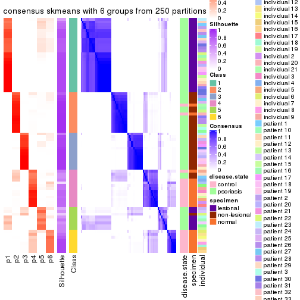</p>

</div>
</div>

Heatmaps for the membership of samples in all partitions to see how consistent they are:


<script>
$( function() {
	$( '#tabs-CV-skmeans-membership-heatmap' ).tabs();
} );
</script>
<div id='tabs-CV-skmeans-membership-heatmap'>
<ul>
<li><a href='#tab-CV-skmeans-membership-heatmap-1'>k = 2</a></li>
<li><a href='#tab-CV-skmeans-membership-heatmap-2'>k = 3</a></li>
<li><a href='#tab-CV-skmeans-membership-heatmap-3'>k = 4</a></li>
<li><a href='#tab-CV-skmeans-membership-heatmap-4'>k = 5</a></li>
<li><a href='#tab-CV-skmeans-membership-heatmap-5'>k = 6</a></li>
</ul>
<div id='tab-CV-skmeans-membership-heatmap-1'>
<pre><code class="r">membership_heatmap(res, k = 2)
</code></pre>

<p></p>

</div>
<div id='tab-CV-skmeans-membership-heatmap-2'>
<pre><code class="r">membership_heatmap(res, k = 3)
</code></pre>

<p></p>

</div>
<div id='tab-CV-skmeans-membership-heatmap-3'>
<pre><code class="r">membership_heatmap(res, k = 4)
</code></pre>

<p></p>

</div>
<div id='tab-CV-skmeans-membership-heatmap-4'>
<pre><code class="r">membership_heatmap(res, k = 5)
</code></pre>

<p></p>

</div>
<div id='tab-CV-skmeans-membership-heatmap-5'>
<pre><code class="r">membership_heatmap(res, k = 6)
</code></pre>

<p></p>

</div>
</div>

As soon as we have had the classes for columns, we can look for signatures
which are significantly different between classes which can be candidate marks
for certain classes. Following are the heatmaps for signatures.


Signature heatmaps where rows are scaled:


<script>
$( function() {
	$( '#tabs-CV-skmeans-get-signatures' ).tabs();
} );
</script>
<div id='tabs-CV-skmeans-get-signatures'>
<ul>
<li><a href='#tab-CV-skmeans-get-signatures-1'>k = 2</a></li>
<li><a href='#tab-CV-skmeans-get-signatures-2'>k = 3</a></li>
<li><a href='#tab-CV-skmeans-get-signatures-3'>k = 4</a></li>
<li><a href='#tab-CV-skmeans-get-signatures-4'>k = 5</a></li>
<li><a href='#tab-CV-skmeans-get-signatures-5'>k = 6</a></li>
</ul>
<div id='tab-CV-skmeans-get-signatures-1'>
<pre><code class="r">get_signatures(res, k = 2)
</code></pre>

<p></p>

</div>
<div id='tab-CV-skmeans-get-signatures-2'>
<pre><code class="r">get_signatures(res, k = 3)
</code></pre>

<p></p>

</div>
<div id='tab-CV-skmeans-get-signatures-3'>
<pre><code class="r">get_signatures(res, k = 4)
</code></pre>

<p></p>

</div>
<div id='tab-CV-skmeans-get-signatures-4'>
<pre><code class="r">get_signatures(res, k = 5)
</code></pre>

<p></p>

</div>
<div id='tab-CV-skmeans-get-signatures-5'>
<pre><code class="r">get_signatures(res, k = 6)
</code></pre>

<p></p>

</div>
</div>


Signature heatmaps where rows are not scaled:


<script>
$( function() {
	$( '#tabs-CV-skmeans-get-signatures-no-scale' ).tabs();
} );
</script>
<div id='tabs-CV-skmeans-get-signatures-no-scale'>
<ul>
<li><a href='#tab-CV-skmeans-get-signatures-no-scale-1'>k = 2</a></li>
<li><a href='#tab-CV-skmeans-get-signatures-no-scale-2'>k = 3</a></li>
<li><a href='#tab-CV-skmeans-get-signatures-no-scale-3'>k = 4</a></li>
<li><a href='#tab-CV-skmeans-get-signatures-no-scale-4'>k = 5</a></li>
<li><a href='#tab-CV-skmeans-get-signatures-no-scale-5'>k = 6</a></li>
</ul>
<div id='tab-CV-skmeans-get-signatures-no-scale-1'>
<pre><code class="r">get_signatures(res, k = 2, scale_rows = FALSE)
</code></pre>

<p></p>

</div>
<div id='tab-CV-skmeans-get-signatures-no-scale-2'>
<pre><code class="r">get_signatures(res, k = 3, scale_rows = FALSE)
</code></pre>

<p></p>

</div>
<div id='tab-CV-skmeans-get-signatures-no-scale-3'>
<pre><code class="r">get_signatures(res, k = 4, scale_rows = FALSE)
</code></pre>

<p></p>

</div>
<div id='tab-CV-skmeans-get-signatures-no-scale-4'>
<pre><code class="r">get_signatures(res, k = 5, scale_rows = FALSE)
</code></pre>

<p></p>

</div>
<div id='tab-CV-skmeans-get-signatures-no-scale-5'>
<pre><code class="r">get_signatures(res, k = 6, scale_rows = FALSE)
</code></pre>

<p></p>

</div>
</div>


Compare the overlap of signatures from different k:

```r
compare_signatures(res)
```


`get_signature()` returns a data frame invisibly. TO get the list of signatures, the function
call should be assigned to a variable explicitly. In following code, if `plot` argument is set
to `FALSE`, no heatmap is plotted while only the differential analysis is performed.

```r
# code only for demonstration
tb = get_signature(res, k = ..., plot = FALSE)
```

An example of the output of `tb` is:

```
#>   which_row         fdr    mean_1    mean_2 scaled_mean_1 scaled_mean_2 km
#> 1        38 0.042760348  8.373488  9.131774    -0.5533452     0.5164555  1
#> 2        40 0.018707592  7.106213  8.469186    -0.6173731     0.5762149  1
#> 3        55 0.019134737 10.221463 11.207825    -0.6159697     0.5749050  1
#> 4        59 0.006059896  5.921854  7.869574    -0.6899429     0.6439467  1
#> 5        60 0.018055526  8.928898 10.211722    -0.6204761     0.5791110  1
#> 6        98 0.009384629 15.714769 14.887706     0.6635654    -0.6193277  2
...
```

The columns in `tb` are:

1. `which_row`: row indices corresponding to the input matrix.
2. `fdr`: FDR for the differential test. 
3. `mean_x`: The mean value in group x.
4. `scaled_mean_x`: The mean value in group x after rows are scaled.
5. `km`: Row groups if k-means clustering is applied to rows.


UMAP plot which shows how samples are separated.


<script>
$( function() {
	$( '#tabs-CV-skmeans-dimension-reduction' ).tabs();
} );
</script>
<div id='tabs-CV-skmeans-dimension-reduction'>
<ul>
<li><a href='#tab-CV-skmeans-dimension-reduction-1'>k = 2</a></li>
<li><a href='#tab-CV-skmeans-dimension-reduction-2'>k = 3</a></li>
<li><a href='#tab-CV-skmeans-dimension-reduction-3'>k = 4</a></li>
<li><a href='#tab-CV-skmeans-dimension-reduction-4'>k = 5</a></li>
<li><a href='#tab-CV-skmeans-dimension-reduction-5'>k = 6</a></li>
</ul>
<div id='tab-CV-skmeans-dimension-reduction-1'>
<pre><code class="r">dimension_reduction(res, k = 2, method = &quot;UMAP&quot;)
</code></pre>

<p></p>

</div>
<div id='tab-CV-skmeans-dimension-reduction-2'>
<pre><code class="r">dimension_reduction(res, k = 3, method = &quot;UMAP&quot;)
</code></pre>

<p></p>

</div>
<div id='tab-CV-skmeans-dimension-reduction-3'>
<pre><code class="r">dimension_reduction(res, k = 4, method = &quot;UMAP&quot;)
</code></pre>

<p></p>

</div>
<div id='tab-CV-skmeans-dimension-reduction-4'>
<pre><code class="r">dimension_reduction(res, k = 5, method = &quot;UMAP&quot;)
</code></pre>

<p></p>

</div>
<div id='tab-CV-skmeans-dimension-reduction-5'>
<pre><code class="r">dimension_reduction(res, k = 6, method = &quot;UMAP&quot;)
</code></pre>

<p></p>

</div>
</div>


Following heatmap shows how subgroups are split when increasing `k`:

```r
collect_classes(res)
```


Test correlation between subgroups and known annotations. If the known
annotation is numeric, one-way ANOVA test is applied, and if the known
annotation is discrete, chi-squared contingency table test is applied.

```r
test_to_known_factors(res)
```

```
#>             n disease.state(p) specimen(p) individual(p) k
#> CV:skmeans 82         2.14e-04    1.11e-17         1.000 2
#> CV:skmeans 80         1.78e-05    2.20e-17         0.962 3
#> CV:skmeans 82         3.61e-14    2.63e-26         0.704 4
#> CV:skmeans 59         3.59e-02    5.23e-13         0.987 5
#> CV:skmeans 78         1.07e-11    1.12e-23         0.604 6
```


If matrix rows can be associated to genes, consider to use `GO_Enrichment(res,
...)` to perform function enrichment for the signature genes.


 

---------------------------------------------------


### CV:pam*


The object with results only for a single top-value method and a single partition method 
can be extracted as:

```r
res = res_list["CV", "pam"]
# you can also extract it by
# res = res_list["CV:pam"]
```

A summary of `res` and all the functions that can be applied to it:

```r
res
```

```
#> A 'ConsensusPartition' object with k = 2, 3, 4, 5, 6.
#>   On a matrix with 51941 rows and 82 columns.
#>   Top rows (1000, 2000, 3000, 4000, 5000) are extracted by 'CV' method.
#>   Subgroups are detected by 'pam' method.
#>   Performed in total 1250 partitions by row resampling.
#>   Best k for subgroups seems to be 3.
#> 
#> Following methods can be applied to this 'ConsensusPartition' object:
#>  [1] "cola_report"             "collect_classes"         "collect_plots"          
#>  [4] "collect_stats"           "colnames"                "compare_signatures"     
#>  [7] "consensus_heatmap"       "dimension_reduction"     "functional_enrichment"  
#> [10] "get_anno_col"            "get_anno"                "get_classes"            
#> [13] "get_consensus"           "get_matrix"              "get_membership"         
#> [16] "get_param"               "get_signatures"          "get_stats"              
#> [19] "is_best_k"               "is_stable_k"             "membership_heatmap"     
#> [22] "ncol"                    "nrow"                    "plot_ecdf"              
#> [25] "rownames"                "select_partition_number" "show"                   
#> [28] "suggest_best_k"          "test_to_known_factors"
```

`collect_plots()` function collects all the plots made from `res` for all `k` (number of partitions)
into one single page to provide an easy and fast comparison between different `k`.

```r
collect_plots(res)
```


The plots are:

- The first row: a plot of the ECDF (Empirical cumulative distribution
  function) curves of the consensus matrix for each `k` and the heatmap of
  predicted classes for each `k`.
- The second row: heatmaps of the consensus matrix for each `k`.
- The third row: heatmaps of the membership matrix for each `k`.
- The fouth row: heatmaps of the signatures for each `k`.

All the plots in panels can be made by individual functions and they are
plotted later in this section.

`select_partition_number()` produces several plots showing different
statistics for choosing "optimized" `k`. There are following statistics:

- ECDF curves of the consensus matrix for each `k`;
- 1-PAC. [The PAC
  score](https://en.wikipedia.org/wiki/Consensus_clustering#Over-interpretation_potential_of_consensus_clustering)
  measures the proportion of the ambiguous subgrouping.
- Mean silhouette score.
- Concordance. The mean probability of fiting the consensus class ids in all
  partitions.
- Area increased. Denote $A_k$ as the area under the ECDF curve for current
  `k`, the area increased is defined as $A_k - A_{k-1}$.
- Rand index. The percent of pairs of samples that are both in a same cluster
  or both are not in a same cluster in the partition of k and k-1.
- Jaccard index. The ratio of pairs of samples are both in a same cluster in
  the partition of k and k-1 and the pairs of samples are both in a same
  cluster in the partition k or k-1.

The detailed explanations of these statistics can be found in [the cola
vignette](http://bioconductor.org/packages/devel/bioc/vignettes/cola/inst/doc/cola.html#toc_13).

Generally speaking, lower PAC score, higher mean silhouette score or higher
concordance corresponds to better partition. Rand index and Jaccard index
measure how similar the current partition is compared to partition with `k-1`.
If they are too similar, we won't accept `k` is better than `k-1`.

```r
select_partition_number(res)
```


The numeric values for all these statistics can be obtained by `get_stats()`.

```r
get_stats(res)
```

```
#>   k 1-PAC mean_silhouette concordance area_increased  Rand Jaccard
#> 2 2 0.949           0.960       0.982         0.4875 0.513   0.513
#> 3 3 0.940           0.946       0.974         0.3785 0.786   0.595
#> 4 4 0.767           0.719       0.823         0.1053 0.914   0.747
#> 5 5 0.763           0.801       0.872         0.0755 0.895   0.630
#> 6 6 0.857           0.802       0.908         0.0365 0.943   0.727
```

`suggest_best_k()` suggests the best $k$ based on these statistics. The rules are as follows:

- All $k$ with Jaccard index larger than 0.95 are removed because the increase of
  the partition number does not provides enough extra information. If all $k$ are removed,
  the best $k$ is assigned by `NA`.
- For $k$ with 1-PAC larger than 0.9, the maximal $k$ is taken as the "best k". Other $k$ is called "optional k".
- If it does not fit the second rule. The $k$ with the highest vote of highest
  1-PAC, mean silhouette and concordance is taken as the "best k".

```r
suggest_best_k(res)
```

```
#> [1] 3
#> attr(,"optional")
#> [1] 2
```

There is also optional best $k$ = 2 that is worth to check.

Following shows the table of the partitions (You need to click the **show/hide
code output** link to see it). The membership matrix (columns with name `p*`)
is inferred by
[`clue::cl_consensus()`](https://www.rdocumentation.org/link/cl_consensus?package=clue)
function with the `SE` method. Basically the value in the membership matrix
represents the probability to belong to a certain group. The finall class
label for an item is determined with the group with highest probability it
belongs to.

In `get_classes()` function, the entropy is calculated from the membership
matrix and the silhouette score is calculated from the consensus matrix.


<script>
$( function() {
	$( '#tabs-CV-pam-get-classes' ).tabs();
} );
</script>
<div id='tabs-CV-pam-get-classes'>
<ul>
<li><a href='#tab-CV-pam-get-classes-1'>k = 2</a></li>
<li><a href='#tab-CV-pam-get-classes-2'>k = 3</a></li>
<li><a href='#tab-CV-pam-get-classes-3'>k = 4</a></li>
<li><a href='#tab-CV-pam-get-classes-4'>k = 5</a></li>
<li><a href='#tab-CV-pam-get-classes-5'>k = 6</a></li>
</ul>

<div id='tab-CV-pam-get-classes-1'>
<p><a id='tab-CV-pam-get-classes-1-a' style='color:#0366d6' href='#'>show/hide code output</a></p>
<pre><code class="r">cbind(get_classes(res, k = 2), get_membership(res, k = 2))
</code></pre>

<pre><code>#&gt;           class entropy silhouette    p1    p2
#&gt; GSM372286     2  0.0000      0.980 0.000 1.000
#&gt; GSM372287     2  0.0000      0.980 0.000 1.000
#&gt; GSM372288     2  0.0000      0.980 0.000 1.000
#&gt; GSM372289     2  0.0000      0.980 0.000 1.000
#&gt; GSM372290     2  0.0000      0.980 0.000 1.000
#&gt; GSM372291     1  0.8955      0.537 0.688 0.312
#&gt; GSM372292     2  0.0000      0.980 0.000 1.000
#&gt; GSM372293     2  0.0000      0.980 0.000 1.000
#&gt; GSM372294     2  0.7299      0.755 0.204 0.796
#&gt; GSM372295     2  0.0000      0.980 0.000 1.000
#&gt; GSM372296     2  0.0000      0.980 0.000 1.000
#&gt; GSM372297     2  0.0000      0.980 0.000 1.000
#&gt; GSM372298     2  0.0000      0.980 0.000 1.000
#&gt; GSM372299     2  0.0000      0.980 0.000 1.000
#&gt; GSM372300     2  0.0376      0.978 0.004 0.996
#&gt; GSM372301     2  0.0000      0.980 0.000 1.000
#&gt; GSM372302     2  0.0000      0.980 0.000 1.000
#&gt; GSM372303     2  0.0376      0.978 0.004 0.996
#&gt; GSM372304     2  0.0000      0.980 0.000 1.000
#&gt; GSM372305     2  0.0000      0.980 0.000 1.000
#&gt; GSM372306     2  0.0000      0.980 0.000 1.000
#&gt; GSM372307     2  0.0000      0.980 0.000 1.000
#&gt; GSM372309     2  0.2948      0.934 0.052 0.948
#&gt; GSM372311     2  0.0000      0.980 0.000 1.000
#&gt; GSM372313     2  0.7299      0.755 0.204 0.796
#&gt; GSM372315     2  0.0000      0.980 0.000 1.000
#&gt; GSM372317     2  0.0000      0.980 0.000 1.000
#&gt; GSM372319     2  0.0000      0.980 0.000 1.000
#&gt; GSM372321     2  0.0000      0.980 0.000 1.000
#&gt; GSM372323     2  0.0376      0.978 0.004 0.996
#&gt; GSM372326     2  0.0376      0.978 0.004 0.996
#&gt; GSM372328     2  0.0000      0.980 0.000 1.000
#&gt; GSM372330     2  0.0000      0.980 0.000 1.000
#&gt; GSM372332     2  0.0376      0.978 0.004 0.996
#&gt; GSM372335     2  0.0000      0.980 0.000 1.000
#&gt; GSM372337     2  0.0376      0.978 0.004 0.996
#&gt; GSM372339     2  0.0376      0.978 0.004 0.996
#&gt; GSM372341     2  0.0376      0.978 0.004 0.996
#&gt; GSM372343     2  0.0376      0.978 0.004 0.996
#&gt; GSM372345     2  0.0376      0.978 0.004 0.996
#&gt; GSM372347     2  0.7376      0.750 0.208 0.792
#&gt; GSM372349     2  0.0376      0.978 0.004 0.996
#&gt; GSM372351     2  0.0000      0.980 0.000 1.000
#&gt; GSM372353     2  0.0000      0.980 0.000 1.000
#&gt; GSM372355     2  0.0000      0.980 0.000 1.000
#&gt; GSM372357     2  0.0000      0.980 0.000 1.000
#&gt; GSM372359     2  0.0000      0.980 0.000 1.000
#&gt; GSM372361     2  0.0000      0.980 0.000 1.000
#&gt; GSM372363     2  0.0000      0.980 0.000 1.000
#&gt; GSM372308     1  0.0000      0.982 1.000 0.000
#&gt; GSM372310     1  0.0000      0.982 1.000 0.000
#&gt; GSM372312     1  0.0000      0.982 1.000 0.000
#&gt; GSM372314     1  0.0000      0.982 1.000 0.000
#&gt; GSM372316     1  0.0000      0.982 1.000 0.000
#&gt; GSM372318     1  0.0000      0.982 1.000 0.000
#&gt; GSM372320     1  0.0000      0.982 1.000 0.000
#&gt; GSM372322     1  0.0000      0.982 1.000 0.000
#&gt; GSM372324     1  0.0000      0.982 1.000 0.000
#&gt; GSM372325     1  0.0000      0.982 1.000 0.000
#&gt; GSM372327     1  0.0000      0.982 1.000 0.000
#&gt; GSM372329     1  0.0000      0.982 1.000 0.000
#&gt; GSM372331     1  0.0000      0.982 1.000 0.000
#&gt; GSM372333     1  0.8081      0.662 0.752 0.248
#&gt; GSM372334     1  0.0000      0.982 1.000 0.000
#&gt; GSM372336     1  0.0000      0.982 1.000 0.000
#&gt; GSM372338     1  0.0000      0.982 1.000 0.000
#&gt; GSM372340     1  0.0000      0.982 1.000 0.000
#&gt; GSM372342     1  0.0000      0.982 1.000 0.000
#&gt; GSM372344     1  0.0000      0.982 1.000 0.000
#&gt; GSM372346     1  0.0000      0.982 1.000 0.000
#&gt; GSM372348     1  0.0000      0.982 1.000 0.000
#&gt; GSM372350     1  0.0000      0.982 1.000 0.000
#&gt; GSM372352     2  0.7376      0.750 0.208 0.792
#&gt; GSM372354     1  0.0000      0.982 1.000 0.000
#&gt; GSM372356     1  0.0000      0.982 1.000 0.000
#&gt; GSM372358     1  0.0000      0.982 1.000 0.000
#&gt; GSM372360     1  0.0000      0.982 1.000 0.000
#&gt; GSM372362     1  0.0000      0.982 1.000 0.000
#&gt; GSM372364     1  0.0000      0.982 1.000 0.000
#&gt; GSM372365     1  0.0000      0.982 1.000 0.000
#&gt; GSM372366     1  0.0000      0.982 1.000 0.000
#&gt; GSM372367     1  0.0000      0.982 1.000 0.000
</code></pre>

<script>
$('#tab-CV-pam-get-classes-1-a').parent().next().next().hide();
$('#tab-CV-pam-get-classes-1-a').click(function(){
  $('#tab-CV-pam-get-classes-1-a').parent().next().next().toggle();
  return(false);
});
</script>
</div>

<div id='tab-CV-pam-get-classes-2'>
<p><a id='tab-CV-pam-get-classes-2-a' style='color:#0366d6' href='#'>show/hide code output</a></p>
<pre><code class="r">cbind(get_classes(res, k = 3), get_membership(res, k = 3))
</code></pre>

<pre><code>#&gt;           class entropy silhouette    p1    p2    p3
#&gt; GSM372286     2  0.0000      0.966 0.000 1.000 0.000
#&gt; GSM372287     2  0.0000      0.966 0.000 1.000 0.000
#&gt; GSM372288     2  0.0000      0.966 0.000 1.000 0.000
#&gt; GSM372289     2  0.0000      0.966 0.000 1.000 0.000
#&gt; GSM372290     2  0.0000      0.966 0.000 1.000 0.000
#&gt; GSM372291     1  0.7072      0.680 0.724 0.116 0.160
#&gt; GSM372292     3  0.3340      0.873 0.000 0.120 0.880
#&gt; GSM372293     3  0.0237      0.962 0.000 0.004 0.996
#&gt; GSM372294     2  0.0000      0.966 0.000 1.000 0.000
#&gt; GSM372295     3  0.5222      0.826 0.040 0.144 0.816
#&gt; GSM372296     2  0.0000      0.966 0.000 1.000 0.000
#&gt; GSM372297     2  0.0000      0.966 0.000 1.000 0.000
#&gt; GSM372298     2  0.0000      0.966 0.000 1.000 0.000
#&gt; GSM372299     3  0.3752      0.849 0.000 0.144 0.856
#&gt; GSM372300     3  0.1163      0.949 0.000 0.028 0.972
#&gt; GSM372301     3  0.3340      0.873 0.000 0.120 0.880
#&gt; GSM372302     2  0.0000      0.966 0.000 1.000 0.000
#&gt; GSM372303     3  0.0237      0.962 0.000 0.004 0.996
#&gt; GSM372304     2  0.0000      0.966 0.000 1.000 0.000
#&gt; GSM372305     2  0.0000      0.966 0.000 1.000 0.000
#&gt; GSM372306     2  0.6192      0.318 0.000 0.580 0.420
#&gt; GSM372307     2  0.0000      0.966 0.000 1.000 0.000
#&gt; GSM372309     2  0.1753      0.926 0.000 0.952 0.048
#&gt; GSM372311     2  0.0000      0.966 0.000 1.000 0.000
#&gt; GSM372313     2  0.0000      0.966 0.000 1.000 0.000
#&gt; GSM372315     2  0.0000      0.966 0.000 1.000 0.000
#&gt; GSM372317     2  0.4750      0.740 0.000 0.784 0.216
#&gt; GSM372319     3  0.0000      0.963 0.000 0.000 1.000
#&gt; GSM372321     3  0.0000      0.963 0.000 0.000 1.000
#&gt; GSM372323     3  0.0000      0.963 0.000 0.000 1.000
#&gt; GSM372326     3  0.0000      0.963 0.000 0.000 1.000
#&gt; GSM372328     3  0.0000      0.963 0.000 0.000 1.000
#&gt; GSM372330     2  0.0000      0.966 0.000 1.000 0.000
#&gt; GSM372332     3  0.0000      0.963 0.000 0.000 1.000
#&gt; GSM372335     3  0.0000      0.963 0.000 0.000 1.000
#&gt; GSM372337     3  0.0000      0.963 0.000 0.000 1.000
#&gt; GSM372339     3  0.0000      0.963 0.000 0.000 1.000
#&gt; GSM372341     3  0.0000      0.963 0.000 0.000 1.000
#&gt; GSM372343     3  0.0000      0.963 0.000 0.000 1.000
#&gt; GSM372345     3  0.0000      0.963 0.000 0.000 1.000
#&gt; GSM372347     3  0.0000      0.963 0.000 0.000 1.000
#&gt; GSM372349     3  0.0000      0.963 0.000 0.000 1.000
#&gt; GSM372351     3  0.0000      0.963 0.000 0.000 1.000
#&gt; GSM372353     3  0.3752      0.834 0.000 0.144 0.856
#&gt; GSM372355     2  0.0000      0.966 0.000 1.000 0.000
#&gt; GSM372357     2  0.3340      0.853 0.000 0.880 0.120
#&gt; GSM372359     2  0.0000      0.966 0.000 1.000 0.000
#&gt; GSM372361     2  0.0000      0.966 0.000 1.000 0.000
#&gt; GSM372363     2  0.0000      0.966 0.000 1.000 0.000
#&gt; GSM372308     1  0.0000      0.986 1.000 0.000 0.000
#&gt; GSM372310     1  0.0000      0.986 1.000 0.000 0.000
#&gt; GSM372312     1  0.0000      0.986 1.000 0.000 0.000
#&gt; GSM372314     1  0.2878      0.894 0.904 0.000 0.096
#&gt; GSM372316     1  0.0000      0.986 1.000 0.000 0.000
#&gt; GSM372318     1  0.0000      0.986 1.000 0.000 0.000
#&gt; GSM372320     1  0.0000      0.986 1.000 0.000 0.000
#&gt; GSM372322     1  0.0000      0.986 1.000 0.000 0.000
#&gt; GSM372324     1  0.2537      0.911 0.920 0.000 0.080
#&gt; GSM372325     3  0.1753      0.932 0.048 0.000 0.952
#&gt; GSM372327     1  0.0000      0.986 1.000 0.000 0.000
#&gt; GSM372329     1  0.0000      0.986 1.000 0.000 0.000
#&gt; GSM372331     1  0.0000      0.986 1.000 0.000 0.000
#&gt; GSM372333     3  0.1529      0.938 0.040 0.000 0.960
#&gt; GSM372334     1  0.0000      0.986 1.000 0.000 0.000
#&gt; GSM372336     1  0.0000      0.986 1.000 0.000 0.000
#&gt; GSM372338     1  0.0000      0.986 1.000 0.000 0.000
#&gt; GSM372340     1  0.0000      0.986 1.000 0.000 0.000
#&gt; GSM372342     1  0.0000      0.986 1.000 0.000 0.000
#&gt; GSM372344     1  0.0000      0.986 1.000 0.000 0.000
#&gt; GSM372346     1  0.0000      0.986 1.000 0.000 0.000
#&gt; GSM372348     1  0.0000      0.986 1.000 0.000 0.000
#&gt; GSM372350     1  0.0000      0.986 1.000 0.000 0.000
#&gt; GSM372352     3  0.1643      0.935 0.044 0.000 0.956
#&gt; GSM372354     1  0.0000      0.986 1.000 0.000 0.000
#&gt; GSM372356     1  0.0000      0.986 1.000 0.000 0.000
#&gt; GSM372358     1  0.0000      0.986 1.000 0.000 0.000
#&gt; GSM372360     1  0.0000      0.986 1.000 0.000 0.000
#&gt; GSM372362     1  0.0000      0.986 1.000 0.000 0.000
#&gt; GSM372364     1  0.0000      0.986 1.000 0.000 0.000
#&gt; GSM372365     1  0.0000      0.986 1.000 0.000 0.000
#&gt; GSM372366     1  0.0000      0.986 1.000 0.000 0.000
#&gt; GSM372367     1  0.0000      0.986 1.000 0.000 0.000
</code></pre>

<script>
$('#tab-CV-pam-get-classes-2-a').parent().next().next().hide();
$('#tab-CV-pam-get-classes-2-a').click(function(){
  $('#tab-CV-pam-get-classes-2-a').parent().next().next().toggle();
  return(false);
});
</script>
</div>

<div id='tab-CV-pam-get-classes-3'>
<p><a id='tab-CV-pam-get-classes-3-a' style='color:#0366d6' href='#'>show/hide code output</a></p>
<pre><code class="r">cbind(get_classes(res, k = 4), get_membership(res, k = 4))
</code></pre>

<pre><code>#&gt;           class entropy silhouette    p1    p2    p3    p4
#&gt; GSM372286     2  0.0000      0.869 0.000 1.000 0.000 0.000
#&gt; GSM372287     2  0.4713      0.406 0.000 0.640 0.000 0.360
#&gt; GSM372288     2  0.3444      0.719 0.000 0.816 0.000 0.184
#&gt; GSM372289     2  0.0000      0.869 0.000 1.000 0.000 0.000
#&gt; GSM372290     4  0.4877      0.225 0.000 0.408 0.000 0.592
#&gt; GSM372291     4  0.5268      0.320 0.452 0.008 0.000 0.540
#&gt; GSM372292     4  0.5150      0.544 0.000 0.008 0.396 0.596
#&gt; GSM372293     4  0.4967      0.501 0.000 0.000 0.452 0.548
#&gt; GSM372294     2  0.4103      0.619 0.000 0.744 0.000 0.256
#&gt; GSM372295     4  0.6970      0.506 0.240 0.004 0.160 0.596
#&gt; GSM372296     2  0.2149      0.818 0.000 0.912 0.000 0.088
#&gt; GSM372297     4  0.4866      0.233 0.000 0.404 0.000 0.596
#&gt; GSM372298     4  0.4955      0.170 0.000 0.444 0.000 0.556
#&gt; GSM372299     4  0.4925      0.525 0.000 0.000 0.428 0.572
#&gt; GSM372300     4  0.4967      0.501 0.000 0.000 0.452 0.548
#&gt; GSM372301     4  0.5250      0.517 0.000 0.008 0.440 0.552
#&gt; GSM372302     2  0.5000     -0.026 0.000 0.504 0.000 0.496
#&gt; GSM372303     4  0.4967      0.501 0.000 0.000 0.452 0.548
#&gt; GSM372304     4  0.4877      0.225 0.000 0.408 0.000 0.592
#&gt; GSM372305     2  0.0000      0.869 0.000 1.000 0.000 0.000
#&gt; GSM372306     2  0.4907      0.299 0.000 0.580 0.420 0.000
#&gt; GSM372307     2  0.0188      0.868 0.000 0.996 0.000 0.004
#&gt; GSM372309     2  0.0672      0.861 0.008 0.984 0.000 0.008
#&gt; GSM372311     2  0.0000      0.869 0.000 1.000 0.000 0.000
#&gt; GSM372313     2  0.0000      0.869 0.000 1.000 0.000 0.000
#&gt; GSM372315     2  0.0000      0.869 0.000 1.000 0.000 0.000
#&gt; GSM372317     2  0.3764      0.638 0.000 0.784 0.216 0.000
#&gt; GSM372319     3  0.0000      0.894 0.000 0.000 1.000 0.000
#&gt; GSM372321     3  0.0000      0.894 0.000 0.000 1.000 0.000
#&gt; GSM372323     3  0.0000      0.894 0.000 0.000 1.000 0.000
#&gt; GSM372326     3  0.0000      0.894 0.000 0.000 1.000 0.000
#&gt; GSM372328     3  0.0000      0.894 0.000 0.000 1.000 0.000
#&gt; GSM372330     2  0.0000      0.869 0.000 1.000 0.000 0.000
#&gt; GSM372332     3  0.0000      0.894 0.000 0.000 1.000 0.000
#&gt; GSM372335     3  0.0000      0.894 0.000 0.000 1.000 0.000
#&gt; GSM372337     3  0.0000      0.894 0.000 0.000 1.000 0.000
#&gt; GSM372339     3  0.0000      0.894 0.000 0.000 1.000 0.000
#&gt; GSM372341     3  0.0000      0.894 0.000 0.000 1.000 0.000
#&gt; GSM372343     3  0.0000      0.894 0.000 0.000 1.000 0.000
#&gt; GSM372345     3  0.0000      0.894 0.000 0.000 1.000 0.000
#&gt; GSM372347     3  0.0000      0.894 0.000 0.000 1.000 0.000
#&gt; GSM372349     3  0.0000      0.894 0.000 0.000 1.000 0.000
#&gt; GSM372351     3  0.0000      0.894 0.000 0.000 1.000 0.000
#&gt; GSM372353     3  0.4103      0.499 0.000 0.256 0.744 0.000
#&gt; GSM372355     2  0.0000      0.869 0.000 1.000 0.000 0.000
#&gt; GSM372357     2  0.0336      0.866 0.000 0.992 0.000 0.008
#&gt; GSM372359     2  0.0000      0.869 0.000 1.000 0.000 0.000
#&gt; GSM372361     2  0.1557      0.844 0.000 0.944 0.000 0.056
#&gt; GSM372363     2  0.0336      0.866 0.000 0.992 0.000 0.008
#&gt; GSM372308     1  0.0000      0.768 1.000 0.000 0.000 0.000
#&gt; GSM372310     1  0.0000      0.768 1.000 0.000 0.000 0.000
#&gt; GSM372312     1  0.0000      0.768 1.000 0.000 0.000 0.000
#&gt; GSM372314     1  0.2281      0.678 0.904 0.000 0.096 0.000
#&gt; GSM372316     1  0.4843      0.790 0.604 0.000 0.000 0.396
#&gt; GSM372318     1  0.4843      0.790 0.604 0.000 0.000 0.396
#&gt; GSM372320     1  0.4843      0.790 0.604 0.000 0.000 0.396
#&gt; GSM372322     1  0.4843      0.790 0.604 0.000 0.000 0.396
#&gt; GSM372324     1  0.2011      0.697 0.920 0.000 0.080 0.000
#&gt; GSM372325     3  0.4843      0.402 0.396 0.000 0.604 0.000
#&gt; GSM372327     1  0.4843      0.790 0.604 0.000 0.000 0.396
#&gt; GSM372329     1  0.4843      0.790 0.604 0.000 0.000 0.396
#&gt; GSM372331     1  0.0000      0.768 1.000 0.000 0.000 0.000
#&gt; GSM372333     3  0.3400      0.679 0.180 0.000 0.820 0.000
#&gt; GSM372334     1  0.4843      0.790 0.604 0.000 0.000 0.396
#&gt; GSM372336     1  0.0000      0.768 1.000 0.000 0.000 0.000
#&gt; GSM372338     1  0.4843      0.790 0.604 0.000 0.000 0.396
#&gt; GSM372340     1  0.4843      0.790 0.604 0.000 0.000 0.396
#&gt; GSM372342     1  0.4843      0.790 0.604 0.000 0.000 0.396
#&gt; GSM372344     1  0.4843      0.790 0.604 0.000 0.000 0.396
#&gt; GSM372346     1  0.4843      0.790 0.604 0.000 0.000 0.396
#&gt; GSM372348     1  0.0188      0.769 0.996 0.000 0.000 0.004
#&gt; GSM372350     1  0.1022      0.772 0.968 0.000 0.000 0.032
#&gt; GSM372352     3  0.4843      0.402 0.396 0.000 0.604 0.000
#&gt; GSM372354     1  0.4830      0.791 0.608 0.000 0.000 0.392
#&gt; GSM372356     1  0.0000      0.768 1.000 0.000 0.000 0.000
#&gt; GSM372358     1  0.4746      0.791 0.632 0.000 0.000 0.368
#&gt; GSM372360     1  0.0000      0.768 1.000 0.000 0.000 0.000
#&gt; GSM372362     1  0.2868      0.781 0.864 0.000 0.000 0.136
#&gt; GSM372364     1  0.0000      0.768 1.000 0.000 0.000 0.000
#&gt; GSM372365     1  0.0000      0.768 1.000 0.000 0.000 0.000
#&gt; GSM372366     1  0.4843      0.790 0.604 0.000 0.000 0.396
#&gt; GSM372367     1  0.0000      0.768 1.000 0.000 0.000 0.000
</code></pre>

<script>
$('#tab-CV-pam-get-classes-3-a').parent().next().next().hide();
$('#tab-CV-pam-get-classes-3-a').click(function(){
  $('#tab-CV-pam-get-classes-3-a').parent().next().next().toggle();
  return(false);
});
</script>
</div>

<div id='tab-CV-pam-get-classes-4'>
<p><a id='tab-CV-pam-get-classes-4-a' style='color:#0366d6' href='#'>show/hide code output</a></p>
<pre><code class="r">cbind(get_classes(res, k = 5), get_membership(res, k = 5))
</code></pre>

<pre><code>#&gt;           class entropy silhouette    p1    p2    p3    p4    p5
#&gt; GSM372286     2  0.0000      0.846 0.000 1.000 0.000 0.000 0.000
#&gt; GSM372287     2  0.6097      0.209 0.000 0.456 0.000 0.420 0.124
#&gt; GSM372288     2  0.5720      0.531 0.000 0.600 0.000 0.276 0.124
#&gt; GSM372289     2  0.0162      0.844 0.000 0.996 0.000 0.000 0.004
#&gt; GSM372290     4  0.2329      0.833 0.000 0.000 0.000 0.876 0.124
#&gt; GSM372291     5  0.3913      0.473 0.000 0.000 0.000 0.324 0.676
#&gt; GSM372292     4  0.0000      0.857 0.000 0.000 0.000 1.000 0.000
#&gt; GSM372293     4  0.2516      0.852 0.000 0.000 0.140 0.860 0.000
#&gt; GSM372294     2  0.5953      0.428 0.000 0.540 0.000 0.336 0.124
#&gt; GSM372295     4  0.2488      0.832 0.000 0.000 0.004 0.872 0.124
#&gt; GSM372296     2  0.5941      0.406 0.000 0.544 0.000 0.332 0.124
#&gt; GSM372297     4  0.0880      0.856 0.000 0.000 0.000 0.968 0.032
#&gt; GSM372298     4  0.2516      0.776 0.000 0.140 0.000 0.860 0.000
#&gt; GSM372299     4  0.2424      0.857 0.000 0.000 0.132 0.868 0.000
#&gt; GSM372300     4  0.2516      0.852 0.000 0.000 0.140 0.860 0.000
#&gt; GSM372301     4  0.2424      0.857 0.000 0.000 0.132 0.868 0.000
#&gt; GSM372302     4  0.3262      0.805 0.000 0.036 0.000 0.840 0.124
#&gt; GSM372303     4  0.2516      0.852 0.000 0.000 0.140 0.860 0.000
#&gt; GSM372304     4  0.2329      0.833 0.000 0.000 0.000 0.876 0.124
#&gt; GSM372305     2  0.0000      0.846 0.000 1.000 0.000 0.000 0.000
#&gt; GSM372306     2  0.4227      0.298 0.000 0.580 0.420 0.000 0.000
#&gt; GSM372307     2  0.2249      0.800 0.000 0.896 0.000 0.008 0.096
#&gt; GSM372309     2  0.0290      0.841 0.000 0.992 0.000 0.000 0.008
#&gt; GSM372311     2  0.0000      0.846 0.000 1.000 0.000 0.000 0.000
#&gt; GSM372313     2  0.0000      0.846 0.000 1.000 0.000 0.000 0.000
#&gt; GSM372315     2  0.0000      0.846 0.000 1.000 0.000 0.000 0.000
#&gt; GSM372317     2  0.3242      0.672 0.000 0.784 0.216 0.000 0.000
#&gt; GSM372319     3  0.0000      0.959 0.000 0.000 1.000 0.000 0.000
#&gt; GSM372321     3  0.0000      0.959 0.000 0.000 1.000 0.000 0.000
#&gt; GSM372323     3  0.0000      0.959 0.000 0.000 1.000 0.000 0.000
#&gt; GSM372326     3  0.0000      0.959 0.000 0.000 1.000 0.000 0.000
#&gt; GSM372328     3  0.0000      0.959 0.000 0.000 1.000 0.000 0.000
#&gt; GSM372330     2  0.0000      0.846 0.000 1.000 0.000 0.000 0.000
#&gt; GSM372332     3  0.0000      0.959 0.000 0.000 1.000 0.000 0.000
#&gt; GSM372335     3  0.0000      0.959 0.000 0.000 1.000 0.000 0.000
#&gt; GSM372337     3  0.0000      0.959 0.000 0.000 1.000 0.000 0.000
#&gt; GSM372339     3  0.0000      0.959 0.000 0.000 1.000 0.000 0.000
#&gt; GSM372341     3  0.0000      0.959 0.000 0.000 1.000 0.000 0.000
#&gt; GSM372343     3  0.0000      0.959 0.000 0.000 1.000 0.000 0.000
#&gt; GSM372345     3  0.0000      0.959 0.000 0.000 1.000 0.000 0.000
#&gt; GSM372347     3  0.0290      0.953 0.000 0.000 0.992 0.000 0.008
#&gt; GSM372349     3  0.0000      0.959 0.000 0.000 1.000 0.000 0.000
#&gt; GSM372351     3  0.0000      0.959 0.000 0.000 1.000 0.000 0.000
#&gt; GSM372353     3  0.3586      0.611 0.000 0.264 0.736 0.000 0.000
#&gt; GSM372355     2  0.0000      0.846 0.000 1.000 0.000 0.000 0.000
#&gt; GSM372357     2  0.0000      0.846 0.000 1.000 0.000 0.000 0.000
#&gt; GSM372359     2  0.0000      0.846 0.000 1.000 0.000 0.000 0.000
#&gt; GSM372361     2  0.4720      0.684 0.000 0.736 0.000 0.140 0.124
#&gt; GSM372363     2  0.0000      0.846 0.000 1.000 0.000 0.000 0.000
#&gt; GSM372308     5  0.2424      0.771 0.132 0.000 0.000 0.000 0.868
#&gt; GSM372310     5  0.2605      0.774 0.148 0.000 0.000 0.000 0.852
#&gt; GSM372312     5  0.3730      0.738 0.288 0.000 0.000 0.000 0.712
#&gt; GSM372314     5  0.2669      0.763 0.104 0.000 0.020 0.000 0.876
#&gt; GSM372316     1  0.0000      0.948 1.000 0.000 0.000 0.000 0.000
#&gt; GSM372318     1  0.0000      0.948 1.000 0.000 0.000 0.000 0.000
#&gt; GSM372320     1  0.0000      0.948 1.000 0.000 0.000 0.000 0.000
#&gt; GSM372322     1  0.0000      0.948 1.000 0.000 0.000 0.000 0.000
#&gt; GSM372324     5  0.4563      0.730 0.244 0.000 0.048 0.000 0.708
#&gt; GSM372325     5  0.3816      0.509 0.000 0.000 0.304 0.000 0.696
#&gt; GSM372327     1  0.0000      0.948 1.000 0.000 0.000 0.000 0.000
#&gt; GSM372329     1  0.0000      0.948 1.000 0.000 0.000 0.000 0.000
#&gt; GSM372331     5  0.3612      0.751 0.268 0.000 0.000 0.000 0.732
#&gt; GSM372333     3  0.3707      0.585 0.000 0.000 0.716 0.000 0.284
#&gt; GSM372334     1  0.0000      0.948 1.000 0.000 0.000 0.000 0.000
#&gt; GSM372336     5  0.4114      0.692 0.376 0.000 0.000 0.000 0.624
#&gt; GSM372338     1  0.0000      0.948 1.000 0.000 0.000 0.000 0.000
#&gt; GSM372340     1  0.0000      0.948 1.000 0.000 0.000 0.000 0.000
#&gt; GSM372342     1  0.0000      0.948 1.000 0.000 0.000 0.000 0.000
#&gt; GSM372344     1  0.0000      0.948 1.000 0.000 0.000 0.000 0.000
#&gt; GSM372346     1  0.0000      0.948 1.000 0.000 0.000 0.000 0.000
#&gt; GSM372348     5  0.3913      0.714 0.324 0.000 0.000 0.000 0.676
#&gt; GSM372350     5  0.4307      0.493 0.496 0.000 0.000 0.000 0.504
#&gt; GSM372352     5  0.3816      0.509 0.000 0.000 0.304 0.000 0.696
#&gt; GSM372354     1  0.3177      0.725 0.792 0.000 0.000 0.000 0.208
#&gt; GSM372356     5  0.3661      0.752 0.276 0.000 0.000 0.000 0.724
#&gt; GSM372358     1  0.2852      0.774 0.828 0.000 0.000 0.000 0.172
#&gt; GSM372360     5  0.3336      0.759 0.228 0.000 0.000 0.000 0.772
#&gt; GSM372362     5  0.4182      0.499 0.400 0.000 0.000 0.000 0.600
#&gt; GSM372364     5  0.3336      0.759 0.228 0.000 0.000 0.000 0.772
#&gt; GSM372365     5  0.3336      0.759 0.228 0.000 0.000 0.000 0.772
#&gt; GSM372366     1  0.2929      0.758 0.820 0.000 0.000 0.000 0.180
#&gt; GSM372367     5  0.3143      0.769 0.204 0.000 0.000 0.000 0.796
</code></pre>

<script>
$('#tab-CV-pam-get-classes-4-a').parent().next().next().hide();
$('#tab-CV-pam-get-classes-4-a').click(function(){
  $('#tab-CV-pam-get-classes-4-a').parent().next().next().toggle();
  return(false);
});
</script>
</div>

<div id='tab-CV-pam-get-classes-5'>
<p><a id='tab-CV-pam-get-classes-5-a' style='color:#0366d6' href='#'>show/hide code output</a></p>
<pre><code class="r">cbind(get_classes(res, k = 6), get_membership(res, k = 6))
</code></pre>

<pre><code>#&gt;           class entropy silhouette    p1    p2    p3    p4    p5    p6
#&gt; GSM372286     2  0.0000     0.9117 0.000 1.000 0.000 0.000 0.000 0.000
#&gt; GSM372287     4  0.1563     0.9206 0.000 0.012 0.000 0.932 0.000 0.056
#&gt; GSM372288     4  0.1563     0.9205 0.000 0.012 0.000 0.932 0.000 0.056
#&gt; GSM372289     2  0.0146     0.9098 0.000 0.996 0.000 0.004 0.000 0.000
#&gt; GSM372290     4  0.1387     0.9212 0.000 0.000 0.000 0.932 0.000 0.068
#&gt; GSM372291     6  0.4407    -0.0779 0.000 0.000 0.000 0.024 0.484 0.492
#&gt; GSM372292     6  0.0000     0.8941 0.000 0.000 0.000 0.000 0.000 1.000
#&gt; GSM372293     6  0.0000     0.8941 0.000 0.000 0.000 0.000 0.000 1.000
#&gt; GSM372294     4  0.1387     0.9212 0.000 0.000 0.000 0.932 0.000 0.068
#&gt; GSM372295     4  0.0000     0.8928 0.000 0.000 0.000 1.000 0.000 0.000
#&gt; GSM372296     4  0.2260     0.8143 0.000 0.140 0.000 0.860 0.000 0.000
#&gt; GSM372297     4  0.3684     0.4935 0.000 0.000 0.000 0.628 0.000 0.372
#&gt; GSM372298     6  0.0000     0.8941 0.000 0.000 0.000 0.000 0.000 1.000
#&gt; GSM372299     6  0.1556     0.8324 0.000 0.000 0.000 0.080 0.000 0.920
#&gt; GSM372300     6  0.0000     0.8941 0.000 0.000 0.000 0.000 0.000 1.000
#&gt; GSM372301     6  0.0000     0.8941 0.000 0.000 0.000 0.000 0.000 1.000
#&gt; GSM372302     4  0.1531     0.9212 0.000 0.004 0.000 0.928 0.000 0.068
#&gt; GSM372303     6  0.0000     0.8941 0.000 0.000 0.000 0.000 0.000 1.000
#&gt; GSM372304     4  0.1387     0.9212 0.000 0.000 0.000 0.932 0.000 0.068
#&gt; GSM372305     2  0.0000     0.9117 0.000 1.000 0.000 0.000 0.000 0.000
#&gt; GSM372306     2  0.3797     0.3254 0.000 0.580 0.420 0.000 0.000 0.000
#&gt; GSM372307     2  0.3592     0.5160 0.000 0.656 0.000 0.344 0.000 0.000
#&gt; GSM372309     2  0.1643     0.8738 0.000 0.924 0.000 0.068 0.008 0.000
#&gt; GSM372311     2  0.0000     0.9117 0.000 1.000 0.000 0.000 0.000 0.000
#&gt; GSM372313     2  0.0000     0.9117 0.000 1.000 0.000 0.000 0.000 0.000
#&gt; GSM372315     2  0.0000     0.9117 0.000 1.000 0.000 0.000 0.000 0.000
#&gt; GSM372317     2  0.2912     0.7114 0.000 0.784 0.216 0.000 0.000 0.000
#&gt; GSM372319     3  0.0000     0.9512 0.000 0.000 1.000 0.000 0.000 0.000
#&gt; GSM372321     3  0.0000     0.9512 0.000 0.000 1.000 0.000 0.000 0.000
#&gt; GSM372323     3  0.0000     0.9512 0.000 0.000 1.000 0.000 0.000 0.000
#&gt; GSM372326     3  0.0146     0.9483 0.000 0.000 0.996 0.004 0.000 0.000
#&gt; GSM372328     3  0.0000     0.9512 0.000 0.000 1.000 0.000 0.000 0.000
#&gt; GSM372330     2  0.0000     0.9117 0.000 1.000 0.000 0.000 0.000 0.000
#&gt; GSM372332     3  0.0000     0.9512 0.000 0.000 1.000 0.000 0.000 0.000
#&gt; GSM372335     3  0.0000     0.9512 0.000 0.000 1.000 0.000 0.000 0.000
#&gt; GSM372337     3  0.0000     0.9512 0.000 0.000 1.000 0.000 0.000 0.000
#&gt; GSM372339     3  0.0000     0.9512 0.000 0.000 1.000 0.000 0.000 0.000
#&gt; GSM372341     3  0.0000     0.9512 0.000 0.000 1.000 0.000 0.000 0.000
#&gt; GSM372343     3  0.0000     0.9512 0.000 0.000 1.000 0.000 0.000 0.000
#&gt; GSM372345     3  0.0000     0.9512 0.000 0.000 1.000 0.000 0.000 0.000
#&gt; GSM372347     3  0.0937     0.9184 0.000 0.000 0.960 0.000 0.040 0.000
#&gt; GSM372349     3  0.0000     0.9512 0.000 0.000 1.000 0.000 0.000 0.000
#&gt; GSM372351     3  0.0000     0.9512 0.000 0.000 1.000 0.000 0.000 0.000
#&gt; GSM372353     3  0.3221     0.6155 0.000 0.264 0.736 0.000 0.000 0.000
#&gt; GSM372355     2  0.0000     0.9117 0.000 1.000 0.000 0.000 0.000 0.000
#&gt; GSM372357     2  0.0000     0.9117 0.000 1.000 0.000 0.000 0.000 0.000
#&gt; GSM372359     2  0.0000     0.9117 0.000 1.000 0.000 0.000 0.000 0.000
#&gt; GSM372361     4  0.0000     0.8928 0.000 0.000 0.000 1.000 0.000 0.000
#&gt; GSM372363     2  0.1387     0.8775 0.000 0.932 0.000 0.068 0.000 0.000
#&gt; GSM372308     5  0.0260     0.7412 0.008 0.000 0.000 0.000 0.992 0.000
#&gt; GSM372310     5  0.0713     0.7499 0.028 0.000 0.000 0.000 0.972 0.000
#&gt; GSM372312     5  0.2527     0.7374 0.168 0.000 0.000 0.000 0.832 0.000
#&gt; GSM372314     5  0.0000     0.7363 0.000 0.000 0.000 0.000 1.000 0.000
#&gt; GSM372316     1  0.0000     0.8997 1.000 0.000 0.000 0.000 0.000 0.000
#&gt; GSM372318     1  0.0000     0.8997 1.000 0.000 0.000 0.000 0.000 0.000
#&gt; GSM372320     1  0.0000     0.8997 1.000 0.000 0.000 0.000 0.000 0.000
#&gt; GSM372322     1  0.0000     0.8997 1.000 0.000 0.000 0.000 0.000 0.000
#&gt; GSM372324     5  0.2668     0.7363 0.168 0.000 0.004 0.000 0.828 0.000
#&gt; GSM372325     5  0.2941     0.6033 0.000 0.000 0.220 0.000 0.780 0.000
#&gt; GSM372327     1  0.0000     0.8997 1.000 0.000 0.000 0.000 0.000 0.000
#&gt; GSM372329     1  0.0000     0.8997 1.000 0.000 0.000 0.000 0.000 0.000
#&gt; GSM372331     5  0.2300     0.7486 0.144 0.000 0.000 0.000 0.856 0.000
#&gt; GSM372333     3  0.3756     0.3611 0.000 0.000 0.600 0.000 0.400 0.000
#&gt; GSM372334     1  0.0000     0.8997 1.000 0.000 0.000 0.000 0.000 0.000
#&gt; GSM372336     5  0.3620     0.6304 0.352 0.000 0.000 0.000 0.648 0.000
#&gt; GSM372338     1  0.0000     0.8997 1.000 0.000 0.000 0.000 0.000 0.000
#&gt; GSM372340     1  0.0000     0.8997 1.000 0.000 0.000 0.000 0.000 0.000
#&gt; GSM372342     1  0.0000     0.8997 1.000 0.000 0.000 0.000 0.000 0.000
#&gt; GSM372344     1  0.0000     0.8997 1.000 0.000 0.000 0.000 0.000 0.000
#&gt; GSM372346     1  0.0000     0.8997 1.000 0.000 0.000 0.000 0.000 0.000
#&gt; GSM372348     5  0.2823     0.7160 0.204 0.000 0.000 0.000 0.796 0.000
#&gt; GSM372350     1  0.3868    -0.3902 0.508 0.000 0.000 0.000 0.492 0.000
#&gt; GSM372352     5  0.2941     0.6033 0.000 0.000 0.220 0.000 0.780 0.000
#&gt; GSM372354     1  0.3126     0.6585 0.752 0.000 0.000 0.000 0.248 0.000
#&gt; GSM372356     5  0.3266     0.6913 0.272 0.000 0.000 0.000 0.728 0.000
#&gt; GSM372358     1  0.2883     0.7027 0.788 0.000 0.000 0.000 0.212 0.000
#&gt; GSM372360     5  0.2941     0.7106 0.220 0.000 0.000 0.000 0.780 0.000
#&gt; GSM372362     5  0.3737     0.3933 0.392 0.000 0.000 0.000 0.608 0.000
#&gt; GSM372364     5  0.2941     0.7106 0.220 0.000 0.000 0.000 0.780 0.000
#&gt; GSM372365     5  0.2941     0.7106 0.220 0.000 0.000 0.000 0.780 0.000
#&gt; GSM372366     1  0.2941     0.6912 0.780 0.000 0.000 0.000 0.220 0.000
#&gt; GSM372367     5  0.2730     0.7276 0.192 0.000 0.000 0.000 0.808 0.000
</code></pre>

<script>
$('#tab-CV-pam-get-classes-5-a').parent().next().next().hide();
$('#tab-CV-pam-get-classes-5-a').click(function(){
  $('#tab-CV-pam-get-classes-5-a').parent().next().next().toggle();
  return(false);
});
</script>
</div>
</div>

Heatmaps for the consensus matrix. It visualizes the probability of two
samples to be in a same group.


<script>
$( function() {
	$( '#tabs-CV-pam-consensus-heatmap' ).tabs();
} );
</script>
<div id='tabs-CV-pam-consensus-heatmap'>
<ul>
<li><a href='#tab-CV-pam-consensus-heatmap-1'>k = 2</a></li>
<li><a href='#tab-CV-pam-consensus-heatmap-2'>k = 3</a></li>
<li><a href='#tab-CV-pam-consensus-heatmap-3'>k = 4</a></li>
<li><a href='#tab-CV-pam-consensus-heatmap-4'>k = 5</a></li>
<li><a href='#tab-CV-pam-consensus-heatmap-5'>k = 6</a></li>
</ul>
<div id='tab-CV-pam-consensus-heatmap-1'>
<pre><code class="r">consensus_heatmap(res, k = 2)
</code></pre>

<p></p>

</div>
<div id='tab-CV-pam-consensus-heatmap-2'>
<pre><code class="r">consensus_heatmap(res, k = 3)
</code></pre>

<p></p>

</div>
<div id='tab-CV-pam-consensus-heatmap-3'>
<pre><code class="r">consensus_heatmap(res, k = 4)
</code></pre>

<p></p>

</div>
<div id='tab-CV-pam-consensus-heatmap-4'>
<pre><code class="r">consensus_heatmap(res, k = 5)
</code></pre>

<p></p>

</div>
<div id='tab-CV-pam-consensus-heatmap-5'>
<pre><code class="r">consensus_heatmap(res, k = 6)
</code></pre>

<p></p>

</div>
</div>

Heatmaps for the membership of samples in all partitions to see how consistent they are:


<script>
$( function() {
	$( '#tabs-CV-pam-membership-heatmap' ).tabs();
} );
</script>
<div id='tabs-CV-pam-membership-heatmap'>
<ul>
<li><a href='#tab-CV-pam-membership-heatmap-1'>k = 2</a></li>
<li><a href='#tab-CV-pam-membership-heatmap-2'>k = 3</a></li>
<li><a href='#tab-CV-pam-membership-heatmap-3'>k = 4</a></li>
<li><a href='#tab-CV-pam-membership-heatmap-4'>k = 5</a></li>
<li><a href='#tab-CV-pam-membership-heatmap-5'>k = 6</a></li>
</ul>
<div id='tab-CV-pam-membership-heatmap-1'>
<pre><code class="r">membership_heatmap(res, k = 2)
</code></pre>

<p></p>

</div>
<div id='tab-CV-pam-membership-heatmap-2'>
<pre><code class="r">membership_heatmap(res, k = 3)
</code></pre>

<p></p>

</div>
<div id='tab-CV-pam-membership-heatmap-3'>
<pre><code class="r">membership_heatmap(res, k = 4)
</code></pre>

<p></p>

</div>
<div id='tab-CV-pam-membership-heatmap-4'>
<pre><code class="r">membership_heatmap(res, k = 5)
</code></pre>

<p></p>

</div>
<div id='tab-CV-pam-membership-heatmap-5'>
<pre><code class="r">membership_heatmap(res, k = 6)
</code></pre>

<p></p>

</div>
</div>

As soon as we have had the classes for columns, we can look for signatures
which are significantly different between classes which can be candidate marks
for certain classes. Following are the heatmaps for signatures.


Signature heatmaps where rows are scaled:


<script>
$( function() {
	$( '#tabs-CV-pam-get-signatures' ).tabs();
} );
</script>
<div id='tabs-CV-pam-get-signatures'>
<ul>
<li><a href='#tab-CV-pam-get-signatures-1'>k = 2</a></li>
<li><a href='#tab-CV-pam-get-signatures-2'>k = 3</a></li>
<li><a href='#tab-CV-pam-get-signatures-3'>k = 4</a></li>
<li><a href='#tab-CV-pam-get-signatures-4'>k = 5</a></li>
<li><a href='#tab-CV-pam-get-signatures-5'>k = 6</a></li>
</ul>
<div id='tab-CV-pam-get-signatures-1'>
<pre><code class="r">get_signatures(res, k = 2)
</code></pre>

<p></p>

</div>
<div id='tab-CV-pam-get-signatures-2'>
<pre><code class="r">get_signatures(res, k = 3)
</code></pre>

<p></p>

</div>
<div id='tab-CV-pam-get-signatures-3'>
<pre><code class="r">get_signatures(res, k = 4)
</code></pre>

<p>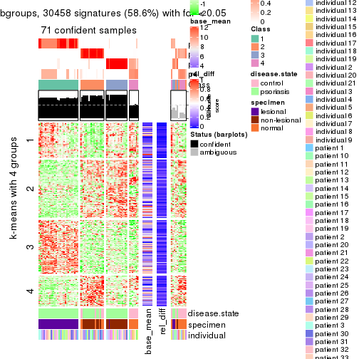</p>

</div>
<div id='tab-CV-pam-get-signatures-4'>
<pre><code class="r">get_signatures(res, k = 5)
</code></pre>

<p></p>

</div>
<div id='tab-CV-pam-get-signatures-5'>
<pre><code class="r">get_signatures(res, k = 6)
</code></pre>

<p></p>

</div>
</div>


Signature heatmaps where rows are not scaled:


<script>
$( function() {
	$( '#tabs-CV-pam-get-signatures-no-scale' ).tabs();
} );
</script>
<div id='tabs-CV-pam-get-signatures-no-scale'>
<ul>
<li><a href='#tab-CV-pam-get-signatures-no-scale-1'>k = 2</a></li>
<li><a href='#tab-CV-pam-get-signatures-no-scale-2'>k = 3</a></li>
<li><a href='#tab-CV-pam-get-signatures-no-scale-3'>k = 4</a></li>
<li><a href='#tab-CV-pam-get-signatures-no-scale-4'>k = 5</a></li>
<li><a href='#tab-CV-pam-get-signatures-no-scale-5'>k = 6</a></li>
</ul>
<div id='tab-CV-pam-get-signatures-no-scale-1'>
<pre><code class="r">get_signatures(res, k = 2, scale_rows = FALSE)
</code></pre>

<p>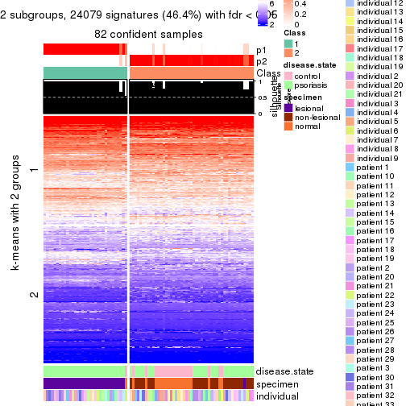</p>

</div>
<div id='tab-CV-pam-get-signatures-no-scale-2'>
<pre><code class="r">get_signatures(res, k = 3, scale_rows = FALSE)
</code></pre>

<p></p>

</div>
<div id='tab-CV-pam-get-signatures-no-scale-3'>
<pre><code class="r">get_signatures(res, k = 4, scale_rows = FALSE)
</code></pre>

<p></p>

</div>
<div id='tab-CV-pam-get-signatures-no-scale-4'>
<pre><code class="r">get_signatures(res, k = 5, scale_rows = FALSE)
</code></pre>

<p></p>

</div>
<div id='tab-CV-pam-get-signatures-no-scale-5'>
<pre><code class="r">get_signatures(res, k = 6, scale_rows = FALSE)
</code></pre>

<p></p>

</div>
</div>


Compare the overlap of signatures from different k:

```r
compare_signatures(res)
```


`get_signature()` returns a data frame invisibly. TO get the list of signatures, the function
call should be assigned to a variable explicitly. In following code, if `plot` argument is set
to `FALSE`, no heatmap is plotted while only the differential analysis is performed.

```r
# code only for demonstration
tb = get_signature(res, k = ..., plot = FALSE)
```

An example of the output of `tb` is:

```
#>   which_row         fdr    mean_1    mean_2 scaled_mean_1 scaled_mean_2 km
#> 1        38 0.042760348  8.373488  9.131774    -0.5533452     0.5164555  1
#> 2        40 0.018707592  7.106213  8.469186    -0.6173731     0.5762149  1
#> 3        55 0.019134737 10.221463 11.207825    -0.6159697     0.5749050  1
#> 4        59 0.006059896  5.921854  7.869574    -0.6899429     0.6439467  1
#> 5        60 0.018055526  8.928898 10.211722    -0.6204761     0.5791110  1
#> 6        98 0.009384629 15.714769 14.887706     0.6635654    -0.6193277  2
...
```

The columns in `tb` are:

1. `which_row`: row indices corresponding to the input matrix.
2. `fdr`: FDR for the differential test. 
3. `mean_x`: The mean value in group x.
4. `scaled_mean_x`: The mean value in group x after rows are scaled.
5. `km`: Row groups if k-means clustering is applied to rows.


UMAP plot which shows how samples are separated.


<script>
$( function() {
	$( '#tabs-CV-pam-dimension-reduction' ).tabs();
} );
</script>
<div id='tabs-CV-pam-dimension-reduction'>
<ul>
<li><a href='#tab-CV-pam-dimension-reduction-1'>k = 2</a></li>
<li><a href='#tab-CV-pam-dimension-reduction-2'>k = 3</a></li>
<li><a href='#tab-CV-pam-dimension-reduction-3'>k = 4</a></li>
<li><a href='#tab-CV-pam-dimension-reduction-4'>k = 5</a></li>
<li><a href='#tab-CV-pam-dimension-reduction-5'>k = 6</a></li>
</ul>
<div id='tab-CV-pam-dimension-reduction-1'>
<pre><code class="r">dimension_reduction(res, k = 2, method = &quot;UMAP&quot;)
</code></pre>

<p></p>

</div>
<div id='tab-CV-pam-dimension-reduction-2'>
<pre><code class="r">dimension_reduction(res, k = 3, method = &quot;UMAP&quot;)
</code></pre>

<p></p>

</div>
<div id='tab-CV-pam-dimension-reduction-3'>
<pre><code class="r">dimension_reduction(res, k = 4, method = &quot;UMAP&quot;)
</code></pre>

<p></p>

</div>
<div id='tab-CV-pam-dimension-reduction-4'>
<pre><code class="r">dimension_reduction(res, k = 5, method = &quot;UMAP&quot;)
</code></pre>

<p></p>

</div>
<div id='tab-CV-pam-dimension-reduction-5'>
<pre><code class="r">dimension_reduction(res, k = 6, method = &quot;UMAP&quot;)
</code></pre>

<p></p>

</div>
</div>


Following heatmap shows how subgroups are split when increasing `k`:

```r
collect_classes(res)
```


Test correlation between subgroups and known annotations. If the known
annotation is numeric, one-way ANOVA test is applied, and if the known
annotation is discrete, chi-squared contingency table test is applied.

```r
test_to_known_factors(res)
```

```
#>         n disease.state(p) specimen(p) individual(p) k
#> CV:pam 82         3.35e-04    8.50e-17         0.999 2
#> CV:pam 81         3.32e-04    3.66e-14         0.900 3
#> CV:pam 71         1.33e-09    2.24e-20         0.511 4
#> CV:pam 75         1.17e-11    7.57e-23         0.708 5
#> CV:pam 76         3.08e-11    5.95e-23         0.425 6
```


If matrix rows can be associated to genes, consider to use `GO_Enrichment(res,
...)` to perform function enrichment for the signature genes.


 

---------------------------------------------------


### CV:mclust*


The object with results only for a single top-value method and a single partition method 
can be extracted as:

```r
res = res_list["CV", "mclust"]
# you can also extract it by
# res = res_list["CV:mclust"]
```

A summary of `res` and all the functions that can be applied to it:

```r
res
```

```
#> A 'ConsensusPartition' object with k = 2, 3, 4, 5, 6.
#>   On a matrix with 51941 rows and 82 columns.
#>   Top rows (1000, 2000, 3000, 4000, 5000) are extracted by 'CV' method.
#>   Subgroups are detected by 'mclust' method.
#>   Performed in total 1250 partitions by row resampling.
#>   Best k for subgroups seems to be 5.
#> 
#> Following methods can be applied to this 'ConsensusPartition' object:
#>  [1] "cola_report"             "collect_classes"         "collect_plots"          
#>  [4] "collect_stats"           "colnames"                "compare_signatures"     
#>  [7] "consensus_heatmap"       "dimension_reduction"     "functional_enrichment"  
#> [10] "get_anno_col"            "get_anno"                "get_classes"            
#> [13] "get_consensus"           "get_matrix"              "get_membership"         
#> [16] "get_param"               "get_signatures"          "get_stats"              
#> [19] "is_best_k"               "is_stable_k"             "membership_heatmap"     
#> [22] "ncol"                    "nrow"                    "plot_ecdf"              
#> [25] "rownames"                "select_partition_number" "show"                   
#> [28] "suggest_best_k"          "test_to_known_factors"
```

`collect_plots()` function collects all the plots made from `res` for all `k` (number of partitions)
into one single page to provide an easy and fast comparison between different `k`.

```r
collect_plots(res)
```


The plots are:

- The first row: a plot of the ECDF (Empirical cumulative distribution
  function) curves of the consensus matrix for each `k` and the heatmap of
  predicted classes for each `k`.
- The second row: heatmaps of the consensus matrix for each `k`.
- The third row: heatmaps of the membership matrix for each `k`.
- The fouth row: heatmaps of the signatures for each `k`.

All the plots in panels can be made by individual functions and they are
plotted later in this section.

`select_partition_number()` produces several plots showing different
statistics for choosing "optimized" `k`. There are following statistics:

- ECDF curves of the consensus matrix for each `k`;
- 1-PAC. [The PAC
  score](https://en.wikipedia.org/wiki/Consensus_clustering#Over-interpretation_potential_of_consensus_clustering)
  measures the proportion of the ambiguous subgrouping.
- Mean silhouette score.
- Concordance. The mean probability of fiting the consensus class ids in all
  partitions.
- Area increased. Denote $A_k$ as the area under the ECDF curve for current
  `k`, the area increased is defined as $A_k - A_{k-1}$.
- Rand index. The percent of pairs of samples that are both in a same cluster
  or both are not in a same cluster in the partition of k and k-1.
- Jaccard index. The ratio of pairs of samples are both in a same cluster in
  the partition of k and k-1 and the pairs of samples are both in a same
  cluster in the partition k or k-1.

The detailed explanations of these statistics can be found in [the cola
vignette](http://bioconductor.org/packages/devel/bioc/vignettes/cola/inst/doc/cola.html#toc_13).

Generally speaking, lower PAC score, higher mean silhouette score or higher
concordance corresponds to better partition. Rand index and Jaccard index
measure how similar the current partition is compared to partition with `k-1`.
If they are too similar, we won't accept `k` is better than `k-1`.

```r
select_partition_number(res)
```


The numeric values for all these statistics can be obtained by `get_stats()`.

```r
get_stats(res)
```

```
#>   k 1-PAC mean_silhouette concordance area_increased  Rand Jaccard
#> 2 2 1.000           0.986       0.994         0.4825 0.518   0.518
#> 3 3 1.000           0.961       0.985         0.3595 0.808   0.635
#> 4 4 0.999           0.970       0.982         0.1178 0.922   0.773
#> 5 5 0.948           0.913       0.958         0.0857 0.924   0.721
#> 6 6 0.855           0.834       0.876         0.0315 1.000   1.000
```

`suggest_best_k()` suggests the best $k$ based on these statistics. The rules are as follows:

- All $k$ with Jaccard index larger than 0.95 are removed because the increase of
  the partition number does not provides enough extra information. If all $k$ are removed,
  the best $k$ is assigned by `NA`.
- For $k$ with 1-PAC larger than 0.9, the maximal $k$ is taken as the "best k". Other $k$ is called "optional k".
- If it does not fit the second rule. The $k$ with the highest vote of highest
  1-PAC, mean silhouette and concordance is taken as the "best k".

```r
suggest_best_k(res)
```

```
#> [1] 5
#> attr(,"optional")
#> [1] 2 3 4
```

There is also optional best $k$ = 2 3 4 that is worth to check.

Following shows the table of the partitions (You need to click the **show/hide
code output** link to see it). The membership matrix (columns with name `p*`)
is inferred by
[`clue::cl_consensus()`](https://www.rdocumentation.org/link/cl_consensus?package=clue)
function with the `SE` method. Basically the value in the membership matrix
represents the probability to belong to a certain group. The finall class
label for an item is determined with the group with highest probability it
belongs to.

In `get_classes()` function, the entropy is calculated from the membership
matrix and the silhouette score is calculated from the consensus matrix.


<script>
$( function() {
	$( '#tabs-CV-mclust-get-classes' ).tabs();
} );
</script>
<div id='tabs-CV-mclust-get-classes'>
<ul>
<li><a href='#tab-CV-mclust-get-classes-1'>k = 2</a></li>
<li><a href='#tab-CV-mclust-get-classes-2'>k = 3</a></li>
<li><a href='#tab-CV-mclust-get-classes-3'>k = 4</a></li>
<li><a href='#tab-CV-mclust-get-classes-4'>k = 5</a></li>
<li><a href='#tab-CV-mclust-get-classes-5'>k = 6</a></li>
</ul>

<div id='tab-CV-mclust-get-classes-1'>
<p><a id='tab-CV-mclust-get-classes-1-a' style='color:#0366d6' href='#'>show/hide code output</a></p>
<pre><code class="r">cbind(get_classes(res, k = 2), get_membership(res, k = 2))
</code></pre>

<pre><code>#&gt;           class entropy silhouette    p1    p2
#&gt; GSM372286     2   0.000      0.994 0.000 1.000
#&gt; GSM372287     2   0.000      0.994 0.000 1.000
#&gt; GSM372288     2   0.000      0.994 0.000 1.000
#&gt; GSM372289     2   0.000      0.994 0.000 1.000
#&gt; GSM372290     2   0.000      0.994 0.000 1.000
#&gt; GSM372291     2   0.000      0.994 0.000 1.000
#&gt; GSM372292     2   0.000      0.994 0.000 1.000
#&gt; GSM372293     2   0.000      0.994 0.000 1.000
#&gt; GSM372294     2   0.000      0.994 0.000 1.000
#&gt; GSM372295     2   0.000      0.994 0.000 1.000
#&gt; GSM372296     2   0.000      0.994 0.000 1.000
#&gt; GSM372297     2   0.000      0.994 0.000 1.000
#&gt; GSM372298     2   0.000      0.994 0.000 1.000
#&gt; GSM372299     2   0.000      0.994 0.000 1.000
#&gt; GSM372300     2   0.000      0.994 0.000 1.000
#&gt; GSM372301     2   0.000      0.994 0.000 1.000
#&gt; GSM372302     2   0.000      0.994 0.000 1.000
#&gt; GSM372303     2   0.000      0.994 0.000 1.000
#&gt; GSM372304     2   0.000      0.994 0.000 1.000
#&gt; GSM372305     2   0.000      0.994 0.000 1.000
#&gt; GSM372306     2   0.000      0.994 0.000 1.000
#&gt; GSM372307     2   0.000      0.994 0.000 1.000
#&gt; GSM372309     2   0.000      0.994 0.000 1.000
#&gt; GSM372311     2   0.000      0.994 0.000 1.000
#&gt; GSM372313     2   0.000      0.994 0.000 1.000
#&gt; GSM372315     2   0.000      0.994 0.000 1.000
#&gt; GSM372317     2   0.000      0.994 0.000 1.000
#&gt; GSM372319     2   0.000      0.994 0.000 1.000
#&gt; GSM372321     2   0.000      0.994 0.000 1.000
#&gt; GSM372323     2   0.000      0.994 0.000 1.000
#&gt; GSM372326     2   0.000      0.994 0.000 1.000
#&gt; GSM372328     2   0.000      0.994 0.000 1.000
#&gt; GSM372330     2   0.000      0.994 0.000 1.000
#&gt; GSM372332     2   0.000      0.994 0.000 1.000
#&gt; GSM372335     2   0.000      0.994 0.000 1.000
#&gt; GSM372337     2   0.000      0.994 0.000 1.000
#&gt; GSM372339     2   0.000      0.994 0.000 1.000
#&gt; GSM372341     2   0.000      0.994 0.000 1.000
#&gt; GSM372343     2   0.000      0.994 0.000 1.000
#&gt; GSM372345     2   0.000      0.994 0.000 1.000
#&gt; GSM372347     2   0.000      0.994 0.000 1.000
#&gt; GSM372349     2   0.000      0.994 0.000 1.000
#&gt; GSM372351     2   0.000      0.994 0.000 1.000
#&gt; GSM372353     2   0.000      0.994 0.000 1.000
#&gt; GSM372355     2   0.000      0.994 0.000 1.000
#&gt; GSM372357     2   0.000      0.994 0.000 1.000
#&gt; GSM372359     2   0.000      0.994 0.000 1.000
#&gt; GSM372361     2   0.000      0.994 0.000 1.000
#&gt; GSM372363     2   0.000      0.994 0.000 1.000
#&gt; GSM372308     1   0.000      0.993 1.000 0.000
#&gt; GSM372310     1   0.000      0.993 1.000 0.000
#&gt; GSM372312     1   0.000      0.993 1.000 0.000
#&gt; GSM372314     1   0.000      0.993 1.000 0.000
#&gt; GSM372316     1   0.000      0.993 1.000 0.000
#&gt; GSM372318     1   0.000      0.993 1.000 0.000
#&gt; GSM372320     1   0.000      0.993 1.000 0.000
#&gt; GSM372322     1   0.000      0.993 1.000 0.000
#&gt; GSM372324     1   0.000      0.993 1.000 0.000
#&gt; GSM372325     1   0.000      0.993 1.000 0.000
#&gt; GSM372327     1   0.000      0.993 1.000 0.000
#&gt; GSM372329     1   0.000      0.993 1.000 0.000
#&gt; GSM372331     1   0.000      0.993 1.000 0.000
#&gt; GSM372333     1   0.722      0.747 0.800 0.200
#&gt; GSM372334     1   0.000      0.993 1.000 0.000
#&gt; GSM372336     1   0.000      0.993 1.000 0.000
#&gt; GSM372338     1   0.000      0.993 1.000 0.000
#&gt; GSM372340     1   0.000      0.993 1.000 0.000
#&gt; GSM372342     1   0.000      0.993 1.000 0.000
#&gt; GSM372344     1   0.000      0.993 1.000 0.000
#&gt; GSM372346     1   0.000      0.993 1.000 0.000
#&gt; GSM372348     1   0.000      0.993 1.000 0.000
#&gt; GSM372350     1   0.000      0.993 1.000 0.000
#&gt; GSM372352     2   0.844      0.621 0.272 0.728
#&gt; GSM372354     1   0.000      0.993 1.000 0.000
#&gt; GSM372356     1   0.000      0.993 1.000 0.000
#&gt; GSM372358     1   0.000      0.993 1.000 0.000
#&gt; GSM372360     1   0.000      0.993 1.000 0.000
#&gt; GSM372362     1   0.000      0.993 1.000 0.000
#&gt; GSM372364     1   0.000      0.993 1.000 0.000
#&gt; GSM372365     1   0.000      0.993 1.000 0.000
#&gt; GSM372366     1   0.000      0.993 1.000 0.000
#&gt; GSM372367     1   0.000      0.993 1.000 0.000
</code></pre>

<script>
$('#tab-CV-mclust-get-classes-1-a').parent().next().next().hide();
$('#tab-CV-mclust-get-classes-1-a').click(function(){
  $('#tab-CV-mclust-get-classes-1-a').parent().next().next().toggle();
  return(false);
});
</script>
</div>

<div id='tab-CV-mclust-get-classes-2'>
<p><a id='tab-CV-mclust-get-classes-2-a' style='color:#0366d6' href='#'>show/hide code output</a></p>
<pre><code class="r">cbind(get_classes(res, k = 3), get_membership(res, k = 3))
</code></pre>

<pre><code>#&gt;           class entropy silhouette    p1    p2    p3
#&gt; GSM372286     3  0.0592      0.950 0.000 0.012 0.988
#&gt; GSM372287     2  0.0000      0.995 0.000 1.000 0.000
#&gt; GSM372288     2  0.0000      0.995 0.000 1.000 0.000
#&gt; GSM372289     2  0.0892      0.978 0.000 0.980 0.020
#&gt; GSM372290     2  0.0000      0.995 0.000 1.000 0.000
#&gt; GSM372291     2  0.0000      0.995 0.000 1.000 0.000
#&gt; GSM372292     2  0.0000      0.995 0.000 1.000 0.000
#&gt; GSM372293     2  0.0000      0.995 0.000 1.000 0.000
#&gt; GSM372294     2  0.0000      0.995 0.000 1.000 0.000
#&gt; GSM372295     2  0.0000      0.995 0.000 1.000 0.000
#&gt; GSM372296     2  0.2165      0.932 0.000 0.936 0.064
#&gt; GSM372297     2  0.0000      0.995 0.000 1.000 0.000
#&gt; GSM372298     2  0.0000      0.995 0.000 1.000 0.000
#&gt; GSM372299     2  0.0000      0.995 0.000 1.000 0.000
#&gt; GSM372300     2  0.0000      0.995 0.000 1.000 0.000
#&gt; GSM372301     2  0.0000      0.995 0.000 1.000 0.000
#&gt; GSM372302     2  0.0000      0.995 0.000 1.000 0.000
#&gt; GSM372303     2  0.0000      0.995 0.000 1.000 0.000
#&gt; GSM372304     2  0.0000      0.995 0.000 1.000 0.000
#&gt; GSM372305     3  0.0000      0.960 0.000 0.000 1.000
#&gt; GSM372306     3  0.0000      0.960 0.000 0.000 1.000
#&gt; GSM372307     3  0.1643      0.920 0.000 0.044 0.956
#&gt; GSM372309     3  0.0000      0.960 0.000 0.000 1.000
#&gt; GSM372311     3  0.0000      0.960 0.000 0.000 1.000
#&gt; GSM372313     3  0.0000      0.960 0.000 0.000 1.000
#&gt; GSM372315     3  0.0000      0.960 0.000 0.000 1.000
#&gt; GSM372317     3  0.0000      0.960 0.000 0.000 1.000
#&gt; GSM372319     3  0.0000      0.960 0.000 0.000 1.000
#&gt; GSM372321     3  0.0000      0.960 0.000 0.000 1.000
#&gt; GSM372323     3  0.0000      0.960 0.000 0.000 1.000
#&gt; GSM372326     3  0.0000      0.960 0.000 0.000 1.000
#&gt; GSM372328     3  0.0000      0.960 0.000 0.000 1.000
#&gt; GSM372330     3  0.0000      0.960 0.000 0.000 1.000
#&gt; GSM372332     3  0.0000      0.960 0.000 0.000 1.000
#&gt; GSM372335     3  0.0000      0.960 0.000 0.000 1.000
#&gt; GSM372337     3  0.0000      0.960 0.000 0.000 1.000
#&gt; GSM372339     3  0.0000      0.960 0.000 0.000 1.000
#&gt; GSM372341     3  0.0000      0.960 0.000 0.000 1.000
#&gt; GSM372343     3  0.0000      0.960 0.000 0.000 1.000
#&gt; GSM372345     3  0.0000      0.960 0.000 0.000 1.000
#&gt; GSM372347     3  0.0000      0.960 0.000 0.000 1.000
#&gt; GSM372349     3  0.0000      0.960 0.000 0.000 1.000
#&gt; GSM372351     3  0.0000      0.960 0.000 0.000 1.000
#&gt; GSM372353     3  0.0000      0.960 0.000 0.000 1.000
#&gt; GSM372355     3  0.0000      0.960 0.000 0.000 1.000
#&gt; GSM372357     3  0.0000      0.960 0.000 0.000 1.000
#&gt; GSM372359     3  0.0000      0.960 0.000 0.000 1.000
#&gt; GSM372361     3  0.4842      0.698 0.000 0.224 0.776
#&gt; GSM372363     3  0.0000      0.960 0.000 0.000 1.000
#&gt; GSM372308     1  0.0000      1.000 1.000 0.000 0.000
#&gt; GSM372310     1  0.0000      1.000 1.000 0.000 0.000
#&gt; GSM372312     1  0.0000      1.000 1.000 0.000 0.000
#&gt; GSM372314     1  0.0000      1.000 1.000 0.000 0.000
#&gt; GSM372316     1  0.0000      1.000 1.000 0.000 0.000
#&gt; GSM372318     1  0.0000      1.000 1.000 0.000 0.000
#&gt; GSM372320     1  0.0000      1.000 1.000 0.000 0.000
#&gt; GSM372322     1  0.0000      1.000 1.000 0.000 0.000
#&gt; GSM372324     1  0.0000      1.000 1.000 0.000 0.000
#&gt; GSM372325     1  0.0000      1.000 1.000 0.000 0.000
#&gt; GSM372327     1  0.0000      1.000 1.000 0.000 0.000
#&gt; GSM372329     1  0.0000      1.000 1.000 0.000 0.000
#&gt; GSM372331     1  0.0000      1.000 1.000 0.000 0.000
#&gt; GSM372333     3  0.6252      0.230 0.444 0.000 0.556
#&gt; GSM372334     1  0.0000      1.000 1.000 0.000 0.000
#&gt; GSM372336     1  0.0000      1.000 1.000 0.000 0.000
#&gt; GSM372338     1  0.0000      1.000 1.000 0.000 0.000
#&gt; GSM372340     1  0.0000      1.000 1.000 0.000 0.000
#&gt; GSM372342     1  0.0000      1.000 1.000 0.000 0.000
#&gt; GSM372344     1  0.0000      1.000 1.000 0.000 0.000
#&gt; GSM372346     1  0.0000      1.000 1.000 0.000 0.000
#&gt; GSM372348     1  0.0000      1.000 1.000 0.000 0.000
#&gt; GSM372350     1  0.0000      1.000 1.000 0.000 0.000
#&gt; GSM372352     3  0.6598      0.266 0.428 0.008 0.564
#&gt; GSM372354     1  0.0000      1.000 1.000 0.000 0.000
#&gt; GSM372356     1  0.0000      1.000 1.000 0.000 0.000
#&gt; GSM372358     1  0.0000      1.000 1.000 0.000 0.000
#&gt; GSM372360     1  0.0000      1.000 1.000 0.000 0.000
#&gt; GSM372362     1  0.0000      1.000 1.000 0.000 0.000
#&gt; GSM372364     1  0.0000      1.000 1.000 0.000 0.000
#&gt; GSM372365     1  0.0000      1.000 1.000 0.000 0.000
#&gt; GSM372366     1  0.0000      1.000 1.000 0.000 0.000
#&gt; GSM372367     1  0.0000      1.000 1.000 0.000 0.000
</code></pre>

<script>
$('#tab-CV-mclust-get-classes-2-a').parent().next().next().hide();
$('#tab-CV-mclust-get-classes-2-a').click(function(){
  $('#tab-CV-mclust-get-classes-2-a').parent().next().next().toggle();
  return(false);
});
</script>
</div>

<div id='tab-CV-mclust-get-classes-3'>
<p><a id='tab-CV-mclust-get-classes-3-a' style='color:#0366d6' href='#'>show/hide code output</a></p>
<pre><code class="r">cbind(get_classes(res, k = 4), get_membership(res, k = 4))
</code></pre>

<pre><code>#&gt;           class entropy silhouette    p1    p2    p3    p4
#&gt; GSM372286     2  0.0000      0.949 0.000 1.000 0.000 0.000
#&gt; GSM372287     4  0.0707      0.990 0.000 0.020 0.000 0.980
#&gt; GSM372288     4  0.0592      0.989 0.000 0.016 0.000 0.984
#&gt; GSM372289     4  0.0707      0.990 0.000 0.020 0.000 0.980
#&gt; GSM372290     4  0.0707      0.990 0.000 0.020 0.000 0.980
#&gt; GSM372291     4  0.0000      0.986 0.000 0.000 0.000 1.000
#&gt; GSM372292     4  0.0188      0.988 0.000 0.004 0.000 0.996
#&gt; GSM372293     4  0.0188      0.988 0.000 0.004 0.000 0.996
#&gt; GSM372294     4  0.0592      0.989 0.000 0.016 0.000 0.984
#&gt; GSM372295     4  0.0336      0.989 0.000 0.008 0.000 0.992
#&gt; GSM372296     4  0.1716      0.949 0.000 0.064 0.000 0.936
#&gt; GSM372297     4  0.0707      0.990 0.000 0.020 0.000 0.980
#&gt; GSM372298     4  0.0592      0.989 0.000 0.016 0.000 0.984
#&gt; GSM372299     4  0.0188      0.988 0.000 0.004 0.000 0.996
#&gt; GSM372300     4  0.0188      0.988 0.000 0.004 0.000 0.996
#&gt; GSM372301     4  0.0188      0.988 0.000 0.004 0.000 0.996
#&gt; GSM372302     4  0.0707      0.990 0.000 0.020 0.000 0.980
#&gt; GSM372303     4  0.0188      0.988 0.000 0.004 0.000 0.996
#&gt; GSM372304     4  0.0707      0.990 0.000 0.020 0.000 0.980
#&gt; GSM372305     2  0.0000      0.949 0.000 1.000 0.000 0.000
#&gt; GSM372306     2  0.2081      0.910 0.000 0.916 0.084 0.000
#&gt; GSM372307     2  0.2345      0.871 0.000 0.900 0.000 0.100
#&gt; GSM372309     2  0.0336      0.949 0.000 0.992 0.008 0.000
#&gt; GSM372311     2  0.0000      0.949 0.000 1.000 0.000 0.000
#&gt; GSM372313     2  0.0188      0.949 0.000 0.996 0.004 0.000
#&gt; GSM372315     2  0.0000      0.949 0.000 1.000 0.000 0.000
#&gt; GSM372317     2  0.0707      0.946 0.000 0.980 0.020 0.000
#&gt; GSM372319     3  0.0000      0.980 0.000 0.000 1.000 0.000
#&gt; GSM372321     3  0.0000      0.980 0.000 0.000 1.000 0.000
#&gt; GSM372323     3  0.0000      0.980 0.000 0.000 1.000 0.000
#&gt; GSM372326     3  0.0707      0.966 0.000 0.020 0.980 0.000
#&gt; GSM372328     3  0.0000      0.980 0.000 0.000 1.000 0.000
#&gt; GSM372330     2  0.0000      0.949 0.000 1.000 0.000 0.000
#&gt; GSM372332     3  0.0000      0.980 0.000 0.000 1.000 0.000
#&gt; GSM372335     2  0.1716      0.924 0.000 0.936 0.064 0.000
#&gt; GSM372337     3  0.0000      0.980 0.000 0.000 1.000 0.000
#&gt; GSM372339     3  0.0000      0.980 0.000 0.000 1.000 0.000
#&gt; GSM372341     3  0.0000      0.980 0.000 0.000 1.000 0.000
#&gt; GSM372343     3  0.0000      0.980 0.000 0.000 1.000 0.000
#&gt; GSM372345     3  0.0000      0.980 0.000 0.000 1.000 0.000
#&gt; GSM372347     2  0.3123      0.843 0.000 0.844 0.156 0.000
#&gt; GSM372349     3  0.1940      0.911 0.000 0.076 0.924 0.000
#&gt; GSM372351     3  0.2973      0.845 0.000 0.144 0.856 0.000
#&gt; GSM372353     2  0.0707      0.944 0.000 0.980 0.020 0.000
#&gt; GSM372355     2  0.0000      0.949 0.000 1.000 0.000 0.000
#&gt; GSM372357     2  0.0336      0.949 0.000 0.992 0.008 0.000
#&gt; GSM372359     2  0.0336      0.949 0.000 0.992 0.008 0.000
#&gt; GSM372361     2  0.4103      0.662 0.000 0.744 0.000 0.256
#&gt; GSM372363     2  0.0000      0.949 0.000 1.000 0.000 0.000
#&gt; GSM372308     1  0.0000      0.998 1.000 0.000 0.000 0.000
#&gt; GSM372310     1  0.0000      0.998 1.000 0.000 0.000 0.000
#&gt; GSM372312     1  0.0188      0.995 0.996 0.000 0.000 0.004
#&gt; GSM372314     1  0.0000      0.998 1.000 0.000 0.000 0.000
#&gt; GSM372316     1  0.0000      0.998 1.000 0.000 0.000 0.000
#&gt; GSM372318     1  0.0000      0.998 1.000 0.000 0.000 0.000
#&gt; GSM372320     1  0.0000      0.998 1.000 0.000 0.000 0.000
#&gt; GSM372322     1  0.0000      0.998 1.000 0.000 0.000 0.000
#&gt; GSM372324     1  0.0000      0.998 1.000 0.000 0.000 0.000
#&gt; GSM372325     1  0.1510      0.955 0.956 0.016 0.028 0.000
#&gt; GSM372327     1  0.0000      0.998 1.000 0.000 0.000 0.000
#&gt; GSM372329     1  0.0000      0.998 1.000 0.000 0.000 0.000
#&gt; GSM372331     1  0.0000      0.998 1.000 0.000 0.000 0.000
#&gt; GSM372333     2  0.3088      0.867 0.008 0.864 0.128 0.000
#&gt; GSM372334     1  0.0000      0.998 1.000 0.000 0.000 0.000
#&gt; GSM372336     1  0.0000      0.998 1.000 0.000 0.000 0.000
#&gt; GSM372338     1  0.0000      0.998 1.000 0.000 0.000 0.000
#&gt; GSM372340     1  0.0000      0.998 1.000 0.000 0.000 0.000
#&gt; GSM372342     1  0.0000      0.998 1.000 0.000 0.000 0.000
#&gt; GSM372344     1  0.0000      0.998 1.000 0.000 0.000 0.000
#&gt; GSM372346     1  0.0000      0.998 1.000 0.000 0.000 0.000
#&gt; GSM372348     1  0.0000      0.998 1.000 0.000 0.000 0.000
#&gt; GSM372350     1  0.0188      0.995 0.996 0.000 0.000 0.004
#&gt; GSM372352     2  0.1970      0.922 0.008 0.932 0.060 0.000
#&gt; GSM372354     1  0.0000      0.998 1.000 0.000 0.000 0.000
#&gt; GSM372356     1  0.0000      0.998 1.000 0.000 0.000 0.000
#&gt; GSM372358     1  0.0000      0.998 1.000 0.000 0.000 0.000
#&gt; GSM372360     1  0.0000      0.998 1.000 0.000 0.000 0.000
#&gt; GSM372362     1  0.0000      0.998 1.000 0.000 0.000 0.000
#&gt; GSM372364     1  0.0000      0.998 1.000 0.000 0.000 0.000
#&gt; GSM372365     1  0.0000      0.998 1.000 0.000 0.000 0.000
#&gt; GSM372366     1  0.0000      0.998 1.000 0.000 0.000 0.000
#&gt; GSM372367     1  0.0000      0.998 1.000 0.000 0.000 0.000
</code></pre>

<script>
$('#tab-CV-mclust-get-classes-3-a').parent().next().next().hide();
$('#tab-CV-mclust-get-classes-3-a').click(function(){
  $('#tab-CV-mclust-get-classes-3-a').parent().next().next().toggle();
  return(false);
});
</script>
</div>

<div id='tab-CV-mclust-get-classes-4'>
<p><a id='tab-CV-mclust-get-classes-4-a' style='color:#0366d6' href='#'>show/hide code output</a></p>
<pre><code class="r">cbind(get_classes(res, k = 5), get_membership(res, k = 5))
</code></pre>

<pre><code>#&gt;           class entropy silhouette    p1    p2    p3    p4    p5
#&gt; GSM372286     2  0.1478    0.89328 0.000 0.936 0.000 0.064 0.000
#&gt; GSM372287     4  0.0000    0.99012 0.000 0.000 0.000 1.000 0.000
#&gt; GSM372288     4  0.0000    0.99012 0.000 0.000 0.000 1.000 0.000
#&gt; GSM372289     4  0.0609    0.97128 0.000 0.020 0.000 0.980 0.000
#&gt; GSM372290     4  0.0000    0.99012 0.000 0.000 0.000 1.000 0.000
#&gt; GSM372291     4  0.0000    0.99012 0.000 0.000 0.000 1.000 0.000
#&gt; GSM372292     4  0.0000    0.99012 0.000 0.000 0.000 1.000 0.000
#&gt; GSM372293     4  0.0000    0.99012 0.000 0.000 0.000 1.000 0.000
#&gt; GSM372294     4  0.0000    0.99012 0.000 0.000 0.000 1.000 0.000
#&gt; GSM372295     4  0.0000    0.99012 0.000 0.000 0.000 1.000 0.000
#&gt; GSM372296     4  0.2424    0.84426 0.000 0.132 0.000 0.868 0.000
#&gt; GSM372297     4  0.0000    0.99012 0.000 0.000 0.000 1.000 0.000
#&gt; GSM372298     4  0.0000    0.99012 0.000 0.000 0.000 1.000 0.000
#&gt; GSM372299     4  0.0000    0.99012 0.000 0.000 0.000 1.000 0.000
#&gt; GSM372300     4  0.0000    0.99012 0.000 0.000 0.000 1.000 0.000
#&gt; GSM372301     4  0.0000    0.99012 0.000 0.000 0.000 1.000 0.000
#&gt; GSM372302     4  0.0000    0.99012 0.000 0.000 0.000 1.000 0.000
#&gt; GSM372303     4  0.0000    0.99012 0.000 0.000 0.000 1.000 0.000
#&gt; GSM372304     4  0.0000    0.99012 0.000 0.000 0.000 1.000 0.000
#&gt; GSM372305     2  0.0000    0.92860 0.000 1.000 0.000 0.000 0.000
#&gt; GSM372306     2  0.2020    0.86316 0.000 0.900 0.100 0.000 0.000
#&gt; GSM372307     2  0.2329    0.83535 0.000 0.876 0.000 0.124 0.000
#&gt; GSM372309     2  0.0000    0.92860 0.000 1.000 0.000 0.000 0.000
#&gt; GSM372311     2  0.0000    0.92860 0.000 1.000 0.000 0.000 0.000
#&gt; GSM372313     2  0.0000    0.92860 0.000 1.000 0.000 0.000 0.000
#&gt; GSM372315     2  0.1410    0.89603 0.000 0.940 0.000 0.060 0.000
#&gt; GSM372317     2  0.0000    0.92860 0.000 1.000 0.000 0.000 0.000
#&gt; GSM372319     3  0.0290    0.98115 0.000 0.008 0.992 0.000 0.000
#&gt; GSM372321     3  0.0290    0.98115 0.000 0.008 0.992 0.000 0.000
#&gt; GSM372323     3  0.0290    0.98115 0.000 0.008 0.992 0.000 0.000
#&gt; GSM372326     3  0.0510    0.97684 0.000 0.016 0.984 0.000 0.000
#&gt; GSM372328     3  0.0000    0.97821 0.000 0.000 1.000 0.000 0.000
#&gt; GSM372330     2  0.0000    0.92860 0.000 1.000 0.000 0.000 0.000
#&gt; GSM372332     3  0.0290    0.98115 0.000 0.008 0.992 0.000 0.000
#&gt; GSM372335     2  0.1544    0.88836 0.000 0.932 0.068 0.000 0.000
#&gt; GSM372337     3  0.0404    0.97992 0.000 0.012 0.988 0.000 0.000
#&gt; GSM372339     3  0.0000    0.97821 0.000 0.000 1.000 0.000 0.000
#&gt; GSM372341     3  0.0000    0.97821 0.000 0.000 1.000 0.000 0.000
#&gt; GSM372343     3  0.0000    0.97821 0.000 0.000 1.000 0.000 0.000
#&gt; GSM372345     3  0.0404    0.97992 0.000 0.012 0.988 0.000 0.000
#&gt; GSM372347     2  0.3861    0.65113 0.000 0.728 0.264 0.000 0.008
#&gt; GSM372349     3  0.1410    0.93316 0.000 0.060 0.940 0.000 0.000
#&gt; GSM372351     3  0.1908    0.89710 0.000 0.092 0.908 0.000 0.000
#&gt; GSM372353     2  0.1410    0.89794 0.000 0.940 0.060 0.000 0.000
#&gt; GSM372355     2  0.0000    0.92860 0.000 1.000 0.000 0.000 0.000
#&gt; GSM372357     2  0.0000    0.92860 0.000 1.000 0.000 0.000 0.000
#&gt; GSM372359     2  0.0000    0.92860 0.000 1.000 0.000 0.000 0.000
#&gt; GSM372361     2  0.3730    0.62385 0.000 0.712 0.000 0.288 0.000
#&gt; GSM372363     2  0.0000    0.92860 0.000 1.000 0.000 0.000 0.000
#&gt; GSM372308     5  0.0963    0.89257 0.036 0.000 0.000 0.000 0.964
#&gt; GSM372310     5  0.1121    0.88803 0.044 0.000 0.000 0.000 0.956
#&gt; GSM372312     5  0.0703    0.89701 0.024 0.000 0.000 0.000 0.976
#&gt; GSM372314     5  0.0703    0.89701 0.024 0.000 0.000 0.000 0.976
#&gt; GSM372316     1  0.0000    0.96072 1.000 0.000 0.000 0.000 0.000
#&gt; GSM372318     1  0.0000    0.96072 1.000 0.000 0.000 0.000 0.000
#&gt; GSM372320     1  0.0290    0.95533 0.992 0.000 0.000 0.000 0.008
#&gt; GSM372322     1  0.0000    0.96072 1.000 0.000 0.000 0.000 0.000
#&gt; GSM372324     5  0.0703    0.89701 0.024 0.000 0.000 0.000 0.976
#&gt; GSM372325     5  0.0703    0.89701 0.024 0.000 0.000 0.000 0.976
#&gt; GSM372327     1  0.0000    0.96072 1.000 0.000 0.000 0.000 0.000
#&gt; GSM372329     1  0.0000    0.96072 1.000 0.000 0.000 0.000 0.000
#&gt; GSM372331     5  0.0703    0.89701 0.024 0.000 0.000 0.000 0.976
#&gt; GSM372333     5  0.6243    0.43223 0.000 0.284 0.184 0.000 0.532
#&gt; GSM372334     1  0.0609    0.94599 0.980 0.000 0.000 0.000 0.020
#&gt; GSM372336     1  0.0000    0.96072 1.000 0.000 0.000 0.000 0.000
#&gt; GSM372338     1  0.0000    0.96072 1.000 0.000 0.000 0.000 0.000
#&gt; GSM372340     1  0.0000    0.96072 1.000 0.000 0.000 0.000 0.000
#&gt; GSM372342     1  0.0000    0.96072 1.000 0.000 0.000 0.000 0.000
#&gt; GSM372344     1  0.0000    0.96072 1.000 0.000 0.000 0.000 0.000
#&gt; GSM372346     1  0.0000    0.96072 1.000 0.000 0.000 0.000 0.000
#&gt; GSM372348     1  0.0000    0.96072 1.000 0.000 0.000 0.000 0.000
#&gt; GSM372350     1  0.3550    0.66987 0.760 0.000 0.000 0.004 0.236
#&gt; GSM372352     5  0.6000    0.49040 0.000 0.268 0.160 0.000 0.572
#&gt; GSM372354     1  0.0510    0.94930 0.984 0.000 0.000 0.000 0.016
#&gt; GSM372356     1  0.4305   -0.00493 0.512 0.000 0.000 0.000 0.488
#&gt; GSM372358     1  0.0000    0.96072 1.000 0.000 0.000 0.000 0.000
#&gt; GSM372360     1  0.0000    0.96072 1.000 0.000 0.000 0.000 0.000
#&gt; GSM372362     1  0.0000    0.96072 1.000 0.000 0.000 0.000 0.000
#&gt; GSM372364     1  0.0000    0.96072 1.000 0.000 0.000 0.000 0.000
#&gt; GSM372365     5  0.2516    0.80332 0.140 0.000 0.000 0.000 0.860
#&gt; GSM372366     1  0.0000    0.96072 1.000 0.000 0.000 0.000 0.000
#&gt; GSM372367     5  0.0703    0.89701 0.024 0.000 0.000 0.000 0.976
</code></pre>

<script>
$('#tab-CV-mclust-get-classes-4-a').parent().next().next().hide();
$('#tab-CV-mclust-get-classes-4-a').click(function(){
  $('#tab-CV-mclust-get-classes-4-a').parent().next().next().toggle();
  return(false);
});
</script>
</div>

<div id='tab-CV-mclust-get-classes-5'>
<p><a id='tab-CV-mclust-get-classes-5-a' style='color:#0366d6' href='#'>show/hide code output</a></p>
<pre><code class="r">cbind(get_classes(res, k = 6), get_membership(res, k = 6))
</code></pre>

<pre><code>#&gt;           class entropy silhouette    p1    p2    p3    p4    p5 p6
#&gt; GSM372286     2  0.2868     0.8180 0.000 0.852 0.004 0.112 0.000 NA
#&gt; GSM372287     4  0.2730     0.8912 0.000 0.000 0.000 0.808 0.000 NA
#&gt; GSM372288     4  0.3141     0.8869 0.000 0.012 0.000 0.788 0.000 NA
#&gt; GSM372289     4  0.4475     0.8235 0.000 0.088 0.000 0.692 0.000 NA
#&gt; GSM372290     4  0.3364     0.8819 0.000 0.024 0.000 0.780 0.000 NA
#&gt; GSM372291     4  0.2527     0.7806 0.000 0.000 0.000 0.832 0.000 NA
#&gt; GSM372292     4  0.0260     0.8782 0.000 0.000 0.000 0.992 0.000 NA
#&gt; GSM372293     4  0.0260     0.8771 0.000 0.000 0.000 0.992 0.000 NA
#&gt; GSM372294     4  0.2762     0.8897 0.000 0.000 0.000 0.804 0.000 NA
#&gt; GSM372295     4  0.0146     0.8783 0.000 0.000 0.000 0.996 0.000 NA
#&gt; GSM372296     4  0.4999     0.7522 0.000 0.144 0.000 0.640 0.000 NA
#&gt; GSM372297     4  0.2762     0.8910 0.000 0.000 0.000 0.804 0.000 NA
#&gt; GSM372298     4  0.2730     0.8912 0.000 0.000 0.000 0.808 0.000 NA
#&gt; GSM372299     4  0.0520     0.8749 0.000 0.000 0.000 0.984 0.008 NA
#&gt; GSM372300     4  0.0260     0.8771 0.000 0.000 0.000 0.992 0.000 NA
#&gt; GSM372301     4  0.0260     0.8771 0.000 0.000 0.000 0.992 0.000 NA
#&gt; GSM372302     4  0.2664     0.8914 0.000 0.000 0.000 0.816 0.000 NA
#&gt; GSM372303     4  0.0632     0.8720 0.000 0.000 0.000 0.976 0.000 NA
#&gt; GSM372304     4  0.2762     0.8910 0.000 0.000 0.000 0.804 0.000 NA
#&gt; GSM372305     2  0.0000     0.8892 0.000 1.000 0.000 0.000 0.000 NA
#&gt; GSM372306     2  0.1921     0.8584 0.000 0.916 0.032 0.000 0.000 NA
#&gt; GSM372307     2  0.3422     0.7378 0.000 0.788 0.000 0.176 0.000 NA
#&gt; GSM372309     2  0.0000     0.8892 0.000 1.000 0.000 0.000 0.000 NA
#&gt; GSM372311     2  0.0000     0.8892 0.000 1.000 0.000 0.000 0.000 NA
#&gt; GSM372313     2  0.0000     0.8892 0.000 1.000 0.000 0.000 0.000 NA
#&gt; GSM372315     2  0.2658     0.8210 0.000 0.864 0.000 0.100 0.000 NA
#&gt; GSM372317     2  0.0405     0.8867 0.000 0.988 0.008 0.000 0.000 NA
#&gt; GSM372319     3  0.1643     0.9156 0.000 0.068 0.924 0.000 0.000 NA
#&gt; GSM372321     3  0.0260     0.9727 0.000 0.008 0.992 0.000 0.000 NA
#&gt; GSM372323     3  0.0622     0.9699 0.000 0.008 0.980 0.000 0.000 NA
#&gt; GSM372326     3  0.0291     0.9718 0.000 0.000 0.992 0.004 0.000 NA
#&gt; GSM372328     3  0.0000     0.9735 0.000 0.000 1.000 0.000 0.000 NA
#&gt; GSM372330     2  0.0000     0.8892 0.000 1.000 0.000 0.000 0.000 NA
#&gt; GSM372332     3  0.0000     0.9735 0.000 0.000 1.000 0.000 0.000 NA
#&gt; GSM372335     2  0.1440     0.8742 0.000 0.948 0.012 0.004 0.004 NA
#&gt; GSM372337     3  0.0622     0.9699 0.000 0.008 0.980 0.000 0.000 NA
#&gt; GSM372339     3  0.0000     0.9735 0.000 0.000 1.000 0.000 0.000 NA
#&gt; GSM372341     3  0.0000     0.9735 0.000 0.000 1.000 0.000 0.000 NA
#&gt; GSM372343     3  0.0000     0.9735 0.000 0.000 1.000 0.000 0.000 NA
#&gt; GSM372345     3  0.1049     0.9590 0.000 0.008 0.960 0.000 0.000 NA
#&gt; GSM372347     2  0.7539     0.0573 0.000 0.340 0.192 0.000 0.180 NA
#&gt; GSM372349     3  0.0717     0.9653 0.000 0.016 0.976 0.008 0.000 NA
#&gt; GSM372351     3  0.2163     0.8827 0.000 0.096 0.892 0.008 0.000 NA
#&gt; GSM372353     2  0.5374     0.6521 0.000 0.688 0.104 0.000 0.112 NA
#&gt; GSM372355     2  0.0000     0.8892 0.000 1.000 0.000 0.000 0.000 NA
#&gt; GSM372357     2  0.0458     0.8856 0.000 0.984 0.000 0.000 0.000 NA
#&gt; GSM372359     2  0.0260     0.8874 0.000 0.992 0.000 0.000 0.008 NA
#&gt; GSM372361     2  0.4024     0.5996 0.000 0.700 0.000 0.264 0.000 NA
#&gt; GSM372363     2  0.0000     0.8892 0.000 1.000 0.000 0.000 0.000 NA
#&gt; GSM372308     5  0.0260     0.8957 0.008 0.000 0.000 0.000 0.992 NA
#&gt; GSM372310     5  0.0260     0.8957 0.008 0.000 0.000 0.000 0.992 NA
#&gt; GSM372312     5  0.0632     0.8873 0.000 0.000 0.000 0.000 0.976 NA
#&gt; GSM372314     5  0.0260     0.8957 0.008 0.000 0.000 0.000 0.992 NA
#&gt; GSM372316     1  0.0717     0.8281 0.976 0.000 0.000 0.000 0.008 NA
#&gt; GSM372318     1  0.2442     0.7999 0.852 0.000 0.000 0.000 0.004 NA
#&gt; GSM372320     1  0.3482     0.7695 0.684 0.000 0.000 0.000 0.000 NA
#&gt; GSM372322     1  0.1327     0.8299 0.936 0.000 0.000 0.000 0.000 NA
#&gt; GSM372324     5  0.2003     0.8165 0.116 0.000 0.000 0.000 0.884 NA
#&gt; GSM372325     5  0.2416     0.8535 0.000 0.000 0.000 0.000 0.844 NA
#&gt; GSM372327     1  0.3351     0.7803 0.712 0.000 0.000 0.000 0.000 NA
#&gt; GSM372329     1  0.0458     0.8286 0.984 0.000 0.000 0.000 0.000 NA
#&gt; GSM372331     5  0.2092     0.8095 0.124 0.000 0.000 0.000 0.876 NA
#&gt; GSM372333     5  0.4792     0.7252 0.000 0.060 0.008 0.000 0.632 NA
#&gt; GSM372334     1  0.3619     0.7676 0.680 0.000 0.000 0.000 0.004 NA
#&gt; GSM372336     1  0.1320     0.8213 0.948 0.000 0.000 0.000 0.036 NA
#&gt; GSM372338     1  0.3482     0.7695 0.684 0.000 0.000 0.000 0.000 NA
#&gt; GSM372340     1  0.3482     0.7695 0.684 0.000 0.000 0.000 0.000 NA
#&gt; GSM372342     1  0.1267     0.8303 0.940 0.000 0.000 0.000 0.000 NA
#&gt; GSM372344     1  0.3607     0.7550 0.652 0.000 0.000 0.000 0.000 NA
#&gt; GSM372346     1  0.2597     0.7917 0.824 0.000 0.000 0.000 0.000 NA
#&gt; GSM372348     1  0.1245     0.8229 0.952 0.000 0.000 0.000 0.032 NA
#&gt; GSM372350     1  0.6704     0.3231 0.464 0.000 0.000 0.076 0.308 NA
#&gt; GSM372352     5  0.4247     0.7553 0.000 0.040 0.000 0.000 0.664 NA
#&gt; GSM372354     1  0.4134     0.7683 0.656 0.000 0.000 0.000 0.028 NA
#&gt; GSM372356     1  0.3843     0.2841 0.548 0.000 0.000 0.000 0.452 NA
#&gt; GSM372358     1  0.1168     0.8242 0.956 0.000 0.000 0.000 0.028 NA
#&gt; GSM372360     1  0.1245     0.8229 0.952 0.000 0.000 0.000 0.032 NA
#&gt; GSM372362     1  0.0713     0.8279 0.972 0.000 0.000 0.000 0.028 NA
#&gt; GSM372364     1  0.1204     0.8223 0.944 0.000 0.000 0.000 0.056 NA
#&gt; GSM372365     5  0.1327     0.8705 0.064 0.000 0.000 0.000 0.936 NA
#&gt; GSM372366     1  0.1092     0.8316 0.960 0.000 0.000 0.000 0.020 NA
#&gt; GSM372367     5  0.0260     0.8957 0.008 0.000 0.000 0.000 0.992 NA
</code></pre>

<script>
$('#tab-CV-mclust-get-classes-5-a').parent().next().next().hide();
$('#tab-CV-mclust-get-classes-5-a').click(function(){
  $('#tab-CV-mclust-get-classes-5-a').parent().next().next().toggle();
  return(false);
});
</script>
</div>
</div>

Heatmaps for the consensus matrix. It visualizes the probability of two
samples to be in a same group.


<script>
$( function() {
	$( '#tabs-CV-mclust-consensus-heatmap' ).tabs();
} );
</script>
<div id='tabs-CV-mclust-consensus-heatmap'>
<ul>
<li><a href='#tab-CV-mclust-consensus-heatmap-1'>k = 2</a></li>
<li><a href='#tab-CV-mclust-consensus-heatmap-2'>k = 3</a></li>
<li><a href='#tab-CV-mclust-consensus-heatmap-3'>k = 4</a></li>
<li><a href='#tab-CV-mclust-consensus-heatmap-4'>k = 5</a></li>
<li><a href='#tab-CV-mclust-consensus-heatmap-5'>k = 6</a></li>
</ul>
<div id='tab-CV-mclust-consensus-heatmap-1'>
<pre><code class="r">consensus_heatmap(res, k = 2)
</code></pre>

<p></p>

</div>
<div id='tab-CV-mclust-consensus-heatmap-2'>
<pre><code class="r">consensus_heatmap(res, k = 3)
</code></pre>

<p>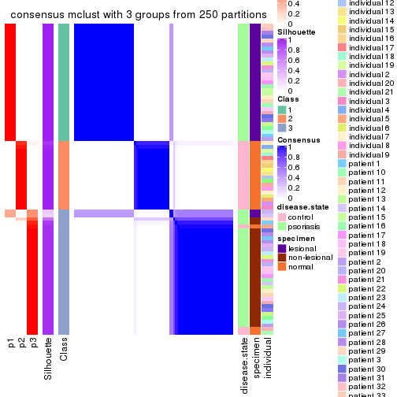</p>

</div>
<div id='tab-CV-mclust-consensus-heatmap-3'>
<pre><code class="r">consensus_heatmap(res, k = 4)
</code></pre>

<p></p>

</div>
<div id='tab-CV-mclust-consensus-heatmap-4'>
<pre><code class="r">consensus_heatmap(res, k = 5)
</code></pre>

<p></p>

</div>
<div id='tab-CV-mclust-consensus-heatmap-5'>
<pre><code class="r">consensus_heatmap(res, k = 6)
</code></pre>

<p></p>

</div>
</div>

Heatmaps for the membership of samples in all partitions to see how consistent they are:


<script>
$( function() {
	$( '#tabs-CV-mclust-membership-heatmap' ).tabs();
} );
</script>
<div id='tabs-CV-mclust-membership-heatmap'>
<ul>
<li><a href='#tab-CV-mclust-membership-heatmap-1'>k = 2</a></li>
<li><a href='#tab-CV-mclust-membership-heatmap-2'>k = 3</a></li>
<li><a href='#tab-CV-mclust-membership-heatmap-3'>k = 4</a></li>
<li><a href='#tab-CV-mclust-membership-heatmap-4'>k = 5</a></li>
<li><a href='#tab-CV-mclust-membership-heatmap-5'>k = 6</a></li>
</ul>
<div id='tab-CV-mclust-membership-heatmap-1'>
<pre><code class="r">membership_heatmap(res, k = 2)
</code></pre>

<p></p>

</div>
<div id='tab-CV-mclust-membership-heatmap-2'>
<pre><code class="r">membership_heatmap(res, k = 3)
</code></pre>

<p></p>

</div>
<div id='tab-CV-mclust-membership-heatmap-3'>
<pre><code class="r">membership_heatmap(res, k = 4)
</code></pre>

<p></p>

</div>
<div id='tab-CV-mclust-membership-heatmap-4'>
<pre><code class="r">membership_heatmap(res, k = 5)
</code></pre>

<p></p>

</div>
<div id='tab-CV-mclust-membership-heatmap-5'>
<pre><code class="r">membership_heatmap(res, k = 6)
</code></pre>

<p></p>

</div>
</div>

As soon as we have had the classes for columns, we can look for signatures
which are significantly different between classes which can be candidate marks
for certain classes. Following are the heatmaps for signatures.


Signature heatmaps where rows are scaled:


<script>
$( function() {
	$( '#tabs-CV-mclust-get-signatures' ).tabs();
} );
</script>
<div id='tabs-CV-mclust-get-signatures'>
<ul>
<li><a href='#tab-CV-mclust-get-signatures-1'>k = 2</a></li>
<li><a href='#tab-CV-mclust-get-signatures-2'>k = 3</a></li>
<li><a href='#tab-CV-mclust-get-signatures-3'>k = 4</a></li>
<li><a href='#tab-CV-mclust-get-signatures-4'>k = 5</a></li>
<li><a href='#tab-CV-mclust-get-signatures-5'>k = 6</a></li>
</ul>
<div id='tab-CV-mclust-get-signatures-1'>
<pre><code class="r">get_signatures(res, k = 2)
</code></pre>

<p></p>

</div>
<div id='tab-CV-mclust-get-signatures-2'>
<pre><code class="r">get_signatures(res, k = 3)
</code></pre>

<p></p>

</div>
<div id='tab-CV-mclust-get-signatures-3'>
<pre><code class="r">get_signatures(res, k = 4)
</code></pre>

<p></p>

</div>
<div id='tab-CV-mclust-get-signatures-4'>
<pre><code class="r">get_signatures(res, k = 5)
</code></pre>

<p></p>

</div>
<div id='tab-CV-mclust-get-signatures-5'>
<pre><code class="r">get_signatures(res, k = 6)
</code></pre>

<p></p>

</div>
</div>


Signature heatmaps where rows are not scaled:


<script>
$( function() {
	$( '#tabs-CV-mclust-get-signatures-no-scale' ).tabs();
} );
</script>
<div id='tabs-CV-mclust-get-signatures-no-scale'>
<ul>
<li><a href='#tab-CV-mclust-get-signatures-no-scale-1'>k = 2</a></li>
<li><a href='#tab-CV-mclust-get-signatures-no-scale-2'>k = 3</a></li>
<li><a href='#tab-CV-mclust-get-signatures-no-scale-3'>k = 4</a></li>
<li><a href='#tab-CV-mclust-get-signatures-no-scale-4'>k = 5</a></li>
<li><a href='#tab-CV-mclust-get-signatures-no-scale-5'>k = 6</a></li>
</ul>
<div id='tab-CV-mclust-get-signatures-no-scale-1'>
<pre><code class="r">get_signatures(res, k = 2, scale_rows = FALSE)
</code></pre>

<p></p>

</div>
<div id='tab-CV-mclust-get-signatures-no-scale-2'>
<pre><code class="r">get_signatures(res, k = 3, scale_rows = FALSE)
</code></pre>

<p></p>

</div>
<div id='tab-CV-mclust-get-signatures-no-scale-3'>
<pre><code class="r">get_signatures(res, k = 4, scale_rows = FALSE)
</code></pre>

<p></p>

</div>
<div id='tab-CV-mclust-get-signatures-no-scale-4'>
<pre><code class="r">get_signatures(res, k = 5, scale_rows = FALSE)
</code></pre>

<p></p>

</div>
<div id='tab-CV-mclust-get-signatures-no-scale-5'>
<pre><code class="r">get_signatures(res, k = 6, scale_rows = FALSE)
</code></pre>

<p></p>

</div>
</div>


Compare the overlap of signatures from different k:

```r
compare_signatures(res)
```


`get_signature()` returns a data frame invisibly. TO get the list of signatures, the function
call should be assigned to a variable explicitly. In following code, if `plot` argument is set
to `FALSE`, no heatmap is plotted while only the differential analysis is performed.

```r
# code only for demonstration
tb = get_signature(res, k = ..., plot = FALSE)
```

An example of the output of `tb` is:

```
#>   which_row         fdr    mean_1    mean_2 scaled_mean_1 scaled_mean_2 km
#> 1        38 0.042760348  8.373488  9.131774    -0.5533452     0.5164555  1
#> 2        40 0.018707592  7.106213  8.469186    -0.6173731     0.5762149  1
#> 3        55 0.019134737 10.221463 11.207825    -0.6159697     0.5749050  1
#> 4        59 0.006059896  5.921854  7.869574    -0.6899429     0.6439467  1
#> 5        60 0.018055526  8.928898 10.211722    -0.6204761     0.5791110  1
#> 6        98 0.009384629 15.714769 14.887706     0.6635654    -0.6193277  2
...
```

The columns in `tb` are:

1. `which_row`: row indices corresponding to the input matrix.
2. `fdr`: FDR for the differential test. 
3. `mean_x`: The mean value in group x.
4. `scaled_mean_x`: The mean value in group x after rows are scaled.
5. `km`: Row groups if k-means clustering is applied to rows.


UMAP plot which shows how samples are separated.


<script>
$( function() {
	$( '#tabs-CV-mclust-dimension-reduction' ).tabs();
} );
</script>
<div id='tabs-CV-mclust-dimension-reduction'>
<ul>
<li><a href='#tab-CV-mclust-dimension-reduction-1'>k = 2</a></li>
<li><a href='#tab-CV-mclust-dimension-reduction-2'>k = 3</a></li>
<li><a href='#tab-CV-mclust-dimension-reduction-3'>k = 4</a></li>
<li><a href='#tab-CV-mclust-dimension-reduction-4'>k = 5</a></li>
<li><a href='#tab-CV-mclust-dimension-reduction-5'>k = 6</a></li>
</ul>
<div id='tab-CV-mclust-dimension-reduction-1'>
<pre><code class="r">dimension_reduction(res, k = 2, method = &quot;UMAP&quot;)
</code></pre>

<p></p>

</div>
<div id='tab-CV-mclust-dimension-reduction-2'>
<pre><code class="r">dimension_reduction(res, k = 3, method = &quot;UMAP&quot;)
</code></pre>

<p></p>

</div>
<div id='tab-CV-mclust-dimension-reduction-3'>
<pre><code class="r">dimension_reduction(res, k = 4, method = &quot;UMAP&quot;)
</code></pre>

<p></p>

</div>
<div id='tab-CV-mclust-dimension-reduction-4'>
<pre><code class="r">dimension_reduction(res, k = 5, method = &quot;UMAP&quot;)
</code></pre>

<p></p>

</div>
<div id='tab-CV-mclust-dimension-reduction-5'>
<pre><code class="r">dimension_reduction(res, k = 6, method = &quot;UMAP&quot;)
</code></pre>

<p></p>

</div>
</div>


Following heatmap shows how subgroups are split when increasing `k`:

```r
collect_classes(res)
```


Test correlation between subgroups and known annotations. If the known
annotation is numeric, one-way ANOVA test is applied, and if the known
annotation is discrete, chi-squared contingency table test is applied.

```r
test_to_known_factors(res)
```

```
#>            n disease.state(p) specimen(p) individual(p) k
#> CV:mclust 82         6.57e-05    1.20e-17         1.000 2
#> CV:mclust 80         4.65e-15    1.09e-29         0.814 3
#> CV:mclust 82         8.45e-15    1.99e-27         0.909 4
#> CV:mclust 79         1.44e-13    1.13e-26         0.861 5
#> CV:mclust 79         1.34e-13    1.17e-26         0.891 6
```


If matrix rows can be associated to genes, consider to use `GO_Enrichment(res,
...)` to perform function enrichment for the signature genes.


 

---------------------------------------------------


### CV:NMF**


The object with results only for a single top-value method and a single partition method 
can be extracted as:

```r
res = res_list["CV", "NMF"]
# you can also extract it by
# res = res_list["CV:NMF"]
```

A summary of `res` and all the functions that can be applied to it:

```r
res
```

```
#> A 'ConsensusPartition' object with k = 2, 3, 4, 5, 6.
#>   On a matrix with 51941 rows and 82 columns.
#>   Top rows (1000, 2000, 3000, 4000, 5000) are extracted by 'CV' method.
#>   Subgroups are detected by 'NMF' method.
#>   Performed in total 1250 partitions by row resampling.
#>   Best k for subgroups seems to be 2.
#> 
#> Following methods can be applied to this 'ConsensusPartition' object:
#>  [1] "cola_report"             "collect_classes"         "collect_plots"          
#>  [4] "collect_stats"           "colnames"                "compare_signatures"     
#>  [7] "consensus_heatmap"       "dimension_reduction"     "functional_enrichment"  
#> [10] "get_anno_col"            "get_anno"                "get_classes"            
#> [13] "get_consensus"           "get_matrix"              "get_membership"         
#> [16] "get_param"               "get_signatures"          "get_stats"              
#> [19] "is_best_k"               "is_stable_k"             "membership_heatmap"     
#> [22] "ncol"                    "nrow"                    "plot_ecdf"              
#> [25] "rownames"                "select_partition_number" "show"                   
#> [28] "suggest_best_k"          "test_to_known_factors"
```

`collect_plots()` function collects all the plots made from `res` for all `k` (number of partitions)
into one single page to provide an easy and fast comparison between different `k`.

```r
collect_plots(res)
```


The plots are:

- The first row: a plot of the ECDF (Empirical cumulative distribution
  function) curves of the consensus matrix for each `k` and the heatmap of
  predicted classes for each `k`.
- The second row: heatmaps of the consensus matrix for each `k`.
- The third row: heatmaps of the membership matrix for each `k`.
- The fouth row: heatmaps of the signatures for each `k`.

All the plots in panels can be made by individual functions and they are
plotted later in this section.

`select_partition_number()` produces several plots showing different
statistics for choosing "optimized" `k`. There are following statistics:

- ECDF curves of the consensus matrix for each `k`;
- 1-PAC. [The PAC
  score](https://en.wikipedia.org/wiki/Consensus_clustering#Over-interpretation_potential_of_consensus_clustering)
  measures the proportion of the ambiguous subgrouping.
- Mean silhouette score.
- Concordance. The mean probability of fiting the consensus class ids in all
  partitions.
- Area increased. Denote $A_k$ as the area under the ECDF curve for current
  `k`, the area increased is defined as $A_k - A_{k-1}$.
- Rand index. The percent of pairs of samples that are both in a same cluster
  or both are not in a same cluster in the partition of k and k-1.
- Jaccard index. The ratio of pairs of samples are both in a same cluster in
  the partition of k and k-1 and the pairs of samples are both in a same
  cluster in the partition k or k-1.

The detailed explanations of these statistics can be found in [the cola
vignette](http://bioconductor.org/packages/devel/bioc/vignettes/cola/inst/doc/cola.html#toc_13).

Generally speaking, lower PAC score, higher mean silhouette score or higher
concordance corresponds to better partition. Rand index and Jaccard index
measure how similar the current partition is compared to partition with `k-1`.
If they are too similar, we won't accept `k` is better than `k-1`.

```r
select_partition_number(res)
```


The numeric values for all these statistics can be obtained by `get_stats()`.

```r
get_stats(res)
```

```
#>   k 1-PAC mean_silhouette concordance area_increased  Rand Jaccard
#> 2 2 1.000           0.983       0.993         0.4838 0.518   0.518
#> 3 3 0.883           0.907       0.951         0.3838 0.780   0.588
#> 4 4 0.861           0.865       0.928         0.1008 0.852   0.602
#> 5 5 0.799           0.695       0.853         0.0463 0.948   0.811
#> 6 6 0.802           0.730       0.857         0.0337 0.950   0.798
```

`suggest_best_k()` suggests the best $k$ based on these statistics. The rules are as follows:

- All $k$ with Jaccard index larger than 0.95 are removed because the increase of
  the partition number does not provides enough extra information. If all $k$ are removed,
  the best $k$ is assigned by `NA`.
- For $k$ with 1-PAC larger than 0.9, the maximal $k$ is taken as the "best k". Other $k$ is called "optional k".
- If it does not fit the second rule. The $k$ with the highest vote of highest
  1-PAC, mean silhouette and concordance is taken as the "best k".

```r
suggest_best_k(res)
```

```
#> [1] 2
```


Following shows the table of the partitions (You need to click the **show/hide
code output** link to see it). The membership matrix (columns with name `p*`)
is inferred by
[`clue::cl_consensus()`](https://www.rdocumentation.org/link/cl_consensus?package=clue)
function with the `SE` method. Basically the value in the membership matrix
represents the probability to belong to a certain group. The finall class
label for an item is determined with the group with highest probability it
belongs to.

In `get_classes()` function, the entropy is calculated from the membership
matrix and the silhouette score is calculated from the consensus matrix.


<script>
$( function() {
	$( '#tabs-CV-NMF-get-classes' ).tabs();
} );
</script>
<div id='tabs-CV-NMF-get-classes'>
<ul>
<li><a href='#tab-CV-NMF-get-classes-1'>k = 2</a></li>
<li><a href='#tab-CV-NMF-get-classes-2'>k = 3</a></li>
<li><a href='#tab-CV-NMF-get-classes-3'>k = 4</a></li>
<li><a href='#tab-CV-NMF-get-classes-4'>k = 5</a></li>
<li><a href='#tab-CV-NMF-get-classes-5'>k = 6</a></li>
</ul>

<div id='tab-CV-NMF-get-classes-1'>
<p><a id='tab-CV-NMF-get-classes-1-a' style='color:#0366d6' href='#'>show/hide code output</a></p>
<pre><code class="r">cbind(get_classes(res, k = 2), get_membership(res, k = 2))
</code></pre>

<pre><code>#&gt;           class entropy silhouette    p1    p2
#&gt; GSM372286     2   0.000      0.991 0.000 1.000
#&gt; GSM372287     2   0.000      0.991 0.000 1.000
#&gt; GSM372288     2   0.000      0.991 0.000 1.000
#&gt; GSM372289     2   0.000      0.991 0.000 1.000
#&gt; GSM372290     2   0.000      0.991 0.000 1.000
#&gt; GSM372291     2   0.949      0.417 0.368 0.632
#&gt; GSM372292     2   0.000      0.991 0.000 1.000
#&gt; GSM372293     2   0.000      0.991 0.000 1.000
#&gt; GSM372294     2   0.000      0.991 0.000 1.000
#&gt; GSM372295     2   0.000      0.991 0.000 1.000
#&gt; GSM372296     2   0.000      0.991 0.000 1.000
#&gt; GSM372297     2   0.000      0.991 0.000 1.000
#&gt; GSM372298     2   0.000      0.991 0.000 1.000
#&gt; GSM372299     2   0.000      0.991 0.000 1.000
#&gt; GSM372300     2   0.000      0.991 0.000 1.000
#&gt; GSM372301     2   0.000      0.991 0.000 1.000
#&gt; GSM372302     2   0.000      0.991 0.000 1.000
#&gt; GSM372303     2   0.000      0.991 0.000 1.000
#&gt; GSM372304     2   0.000      0.991 0.000 1.000
#&gt; GSM372305     2   0.000      0.991 0.000 1.000
#&gt; GSM372306     2   0.000      0.991 0.000 1.000
#&gt; GSM372307     2   0.000      0.991 0.000 1.000
#&gt; GSM372309     2   0.000      0.991 0.000 1.000
#&gt; GSM372311     2   0.000      0.991 0.000 1.000
#&gt; GSM372313     2   0.000      0.991 0.000 1.000
#&gt; GSM372315     2   0.000      0.991 0.000 1.000
#&gt; GSM372317     2   0.000      0.991 0.000 1.000
#&gt; GSM372319     2   0.000      0.991 0.000 1.000
#&gt; GSM372321     2   0.000      0.991 0.000 1.000
#&gt; GSM372323     2   0.000      0.991 0.000 1.000
#&gt; GSM372326     2   0.000      0.991 0.000 1.000
#&gt; GSM372328     2   0.000      0.991 0.000 1.000
#&gt; GSM372330     2   0.000      0.991 0.000 1.000
#&gt; GSM372332     2   0.000      0.991 0.000 1.000
#&gt; GSM372335     2   0.000      0.991 0.000 1.000
#&gt; GSM372337     2   0.000      0.991 0.000 1.000
#&gt; GSM372339     2   0.000      0.991 0.000 1.000
#&gt; GSM372341     2   0.000      0.991 0.000 1.000
#&gt; GSM372343     2   0.000      0.991 0.000 1.000
#&gt; GSM372345     2   0.000      0.991 0.000 1.000
#&gt; GSM372347     2   0.000      0.991 0.000 1.000
#&gt; GSM372349     2   0.000      0.991 0.000 1.000
#&gt; GSM372351     2   0.000      0.991 0.000 1.000
#&gt; GSM372353     2   0.000      0.991 0.000 1.000
#&gt; GSM372355     2   0.000      0.991 0.000 1.000
#&gt; GSM372357     2   0.000      0.991 0.000 1.000
#&gt; GSM372359     2   0.000      0.991 0.000 1.000
#&gt; GSM372361     2   0.000      0.991 0.000 1.000
#&gt; GSM372363     2   0.000      0.991 0.000 1.000
#&gt; GSM372308     1   0.000      0.996 1.000 0.000
#&gt; GSM372310     1   0.000      0.996 1.000 0.000
#&gt; GSM372312     1   0.000      0.996 1.000 0.000
#&gt; GSM372314     1   0.000      0.996 1.000 0.000
#&gt; GSM372316     1   0.000      0.996 1.000 0.000
#&gt; GSM372318     1   0.000      0.996 1.000 0.000
#&gt; GSM372320     1   0.000      0.996 1.000 0.000
#&gt; GSM372322     1   0.000      0.996 1.000 0.000
#&gt; GSM372324     1   0.000      0.996 1.000 0.000
#&gt; GSM372325     1   0.000      0.996 1.000 0.000
#&gt; GSM372327     1   0.000      0.996 1.000 0.000
#&gt; GSM372329     1   0.000      0.996 1.000 0.000
#&gt; GSM372331     1   0.000      0.996 1.000 0.000
#&gt; GSM372333     1   0.529      0.861 0.880 0.120
#&gt; GSM372334     1   0.000      0.996 1.000 0.000
#&gt; GSM372336     1   0.000      0.996 1.000 0.000
#&gt; GSM372338     1   0.000      0.996 1.000 0.000
#&gt; GSM372340     1   0.000      0.996 1.000 0.000
#&gt; GSM372342     1   0.000      0.996 1.000 0.000
#&gt; GSM372344     1   0.000      0.996 1.000 0.000
#&gt; GSM372346     1   0.000      0.996 1.000 0.000
#&gt; GSM372348     1   0.000      0.996 1.000 0.000
#&gt; GSM372350     1   0.000      0.996 1.000 0.000
#&gt; GSM372352     2   0.373      0.917 0.072 0.928
#&gt; GSM372354     1   0.000      0.996 1.000 0.000
#&gt; GSM372356     1   0.000      0.996 1.000 0.000
#&gt; GSM372358     1   0.000      0.996 1.000 0.000
#&gt; GSM372360     1   0.000      0.996 1.000 0.000
#&gt; GSM372362     1   0.000      0.996 1.000 0.000
#&gt; GSM372364     1   0.000      0.996 1.000 0.000
#&gt; GSM372365     1   0.000      0.996 1.000 0.000
#&gt; GSM372366     1   0.000      0.996 1.000 0.000
#&gt; GSM372367     1   0.000      0.996 1.000 0.000
</code></pre>

<script>
$('#tab-CV-NMF-get-classes-1-a').parent().next().next().hide();
$('#tab-CV-NMF-get-classes-1-a').click(function(){
  $('#tab-CV-NMF-get-classes-1-a').parent().next().next().toggle();
  return(false);
});
</script>
</div>

<div id='tab-CV-NMF-get-classes-2'>
<p><a id='tab-CV-NMF-get-classes-2-a' style='color:#0366d6' href='#'>show/hide code output</a></p>
<pre><code class="r">cbind(get_classes(res, k = 3), get_membership(res, k = 3))
</code></pre>

<pre><code>#&gt;           class entropy silhouette    p1    p2    p3
#&gt; GSM372286     2  0.4399      0.820 0.000 0.812 0.188
#&gt; GSM372287     2  0.0747      0.926 0.000 0.984 0.016
#&gt; GSM372288     2  0.0747      0.926 0.000 0.984 0.016
#&gt; GSM372289     2  0.0237      0.927 0.000 0.996 0.004
#&gt; GSM372290     2  0.0747      0.926 0.000 0.984 0.016
#&gt; GSM372291     2  0.3234      0.872 0.072 0.908 0.020
#&gt; GSM372292     2  0.6204      0.225 0.000 0.576 0.424
#&gt; GSM372293     3  0.4002      0.824 0.000 0.160 0.840
#&gt; GSM372294     2  0.0747      0.926 0.000 0.984 0.016
#&gt; GSM372295     2  0.0237      0.926 0.000 0.996 0.004
#&gt; GSM372296     2  0.1411      0.923 0.000 0.964 0.036
#&gt; GSM372297     2  0.0892      0.925 0.000 0.980 0.020
#&gt; GSM372298     2  0.0892      0.925 0.000 0.980 0.020
#&gt; GSM372299     2  0.0424      0.927 0.000 0.992 0.008
#&gt; GSM372300     3  0.4291      0.802 0.000 0.180 0.820
#&gt; GSM372301     3  0.4291      0.802 0.000 0.180 0.820
#&gt; GSM372302     2  0.0892      0.925 0.000 0.980 0.020
#&gt; GSM372303     3  0.2261      0.906 0.000 0.068 0.932
#&gt; GSM372304     2  0.0892      0.925 0.000 0.980 0.020
#&gt; GSM372305     2  0.4291      0.815 0.000 0.820 0.180
#&gt; GSM372306     3  0.2537      0.889 0.000 0.080 0.920
#&gt; GSM372307     2  0.0747      0.926 0.000 0.984 0.016
#&gt; GSM372309     2  0.0892      0.925 0.000 0.980 0.020
#&gt; GSM372311     2  0.2625      0.900 0.000 0.916 0.084
#&gt; GSM372313     2  0.2711      0.897 0.000 0.912 0.088
#&gt; GSM372315     2  0.1860      0.916 0.000 0.948 0.052
#&gt; GSM372317     3  0.0892      0.930 0.000 0.020 0.980
#&gt; GSM372319     3  0.0592      0.932 0.000 0.012 0.988
#&gt; GSM372321     3  0.0592      0.932 0.000 0.012 0.988
#&gt; GSM372323     3  0.0592      0.932 0.000 0.012 0.988
#&gt; GSM372326     3  0.2448      0.908 0.000 0.076 0.924
#&gt; GSM372328     3  0.0747      0.931 0.000 0.016 0.984
#&gt; GSM372330     2  0.4750      0.777 0.000 0.784 0.216
#&gt; GSM372332     3  0.0424      0.933 0.000 0.008 0.992
#&gt; GSM372335     3  0.0747      0.932 0.000 0.016 0.984
#&gt; GSM372337     3  0.0237      0.933 0.000 0.004 0.996
#&gt; GSM372339     3  0.0424      0.932 0.000 0.008 0.992
#&gt; GSM372341     3  0.0747      0.931 0.000 0.016 0.984
#&gt; GSM372343     3  0.0747      0.931 0.000 0.016 0.984
#&gt; GSM372345     3  0.0592      0.932 0.000 0.012 0.988
#&gt; GSM372347     3  0.0747      0.931 0.000 0.016 0.984
#&gt; GSM372349     3  0.0747      0.931 0.000 0.016 0.984
#&gt; GSM372351     3  0.1860      0.914 0.000 0.052 0.948
#&gt; GSM372353     3  0.0747      0.931 0.000 0.016 0.984
#&gt; GSM372355     2  0.2625      0.900 0.000 0.916 0.084
#&gt; GSM372357     2  0.4178      0.828 0.000 0.828 0.172
#&gt; GSM372359     3  0.2625      0.896 0.000 0.084 0.916
#&gt; GSM372361     2  0.0747      0.925 0.000 0.984 0.016
#&gt; GSM372363     2  0.0892      0.925 0.000 0.980 0.020
#&gt; GSM372308     1  0.0237      0.974 0.996 0.004 0.000
#&gt; GSM372310     1  0.0000      0.977 1.000 0.000 0.000
#&gt; GSM372312     1  0.0000      0.977 1.000 0.000 0.000
#&gt; GSM372314     1  0.2651      0.913 0.928 0.012 0.060
#&gt; GSM372316     1  0.0000      0.977 1.000 0.000 0.000
#&gt; GSM372318     1  0.0000      0.977 1.000 0.000 0.000
#&gt; GSM372320     1  0.0000      0.977 1.000 0.000 0.000
#&gt; GSM372322     1  0.0000      0.977 1.000 0.000 0.000
#&gt; GSM372324     1  0.0000      0.977 1.000 0.000 0.000
#&gt; GSM372325     1  0.3941      0.812 0.844 0.000 0.156
#&gt; GSM372327     1  0.0000      0.977 1.000 0.000 0.000
#&gt; GSM372329     1  0.0000      0.977 1.000 0.000 0.000
#&gt; GSM372331     1  0.1964      0.926 0.944 0.000 0.056
#&gt; GSM372333     3  0.6470      0.407 0.356 0.012 0.632
#&gt; GSM372334     1  0.0000      0.977 1.000 0.000 0.000
#&gt; GSM372336     1  0.0000      0.977 1.000 0.000 0.000
#&gt; GSM372338     1  0.0000      0.977 1.000 0.000 0.000
#&gt; GSM372340     1  0.0000      0.977 1.000 0.000 0.000
#&gt; GSM372342     1  0.0000      0.977 1.000 0.000 0.000
#&gt; GSM372344     1  0.0000      0.977 1.000 0.000 0.000
#&gt; GSM372346     1  0.0000      0.977 1.000 0.000 0.000
#&gt; GSM372348     1  0.0000      0.977 1.000 0.000 0.000
#&gt; GSM372350     1  0.0000      0.977 1.000 0.000 0.000
#&gt; GSM372352     1  0.7920      0.334 0.572 0.068 0.360
#&gt; GSM372354     1  0.0000      0.977 1.000 0.000 0.000
#&gt; GSM372356     1  0.0000      0.977 1.000 0.000 0.000
#&gt; GSM372358     1  0.0000      0.977 1.000 0.000 0.000
#&gt; GSM372360     1  0.0000      0.977 1.000 0.000 0.000
#&gt; GSM372362     1  0.0000      0.977 1.000 0.000 0.000
#&gt; GSM372364     1  0.0000      0.977 1.000 0.000 0.000
#&gt; GSM372365     1  0.0237      0.974 0.996 0.004 0.000
#&gt; GSM372366     1  0.0000      0.977 1.000 0.000 0.000
#&gt; GSM372367     1  0.0000      0.977 1.000 0.000 0.000
</code></pre>

<script>
$('#tab-CV-NMF-get-classes-2-a').parent().next().next().hide();
$('#tab-CV-NMF-get-classes-2-a').click(function(){
  $('#tab-CV-NMF-get-classes-2-a').parent().next().next().toggle();
  return(false);
});
</script>
</div>

<div id='tab-CV-NMF-get-classes-3'>
<p><a id='tab-CV-NMF-get-classes-3-a' style='color:#0366d6' href='#'>show/hide code output</a></p>
<pre><code class="r">cbind(get_classes(res, k = 4), get_membership(res, k = 4))
</code></pre>

<pre><code>#&gt;           class entropy silhouette    p1    p2    p3    p4
#&gt; GSM372286     2  0.4610      0.799 0.000 0.800 0.100 0.100
#&gt; GSM372287     4  0.1557      0.911 0.000 0.056 0.000 0.944
#&gt; GSM372288     4  0.1637      0.909 0.000 0.060 0.000 0.940
#&gt; GSM372289     2  0.4992      0.052 0.000 0.524 0.000 0.476
#&gt; GSM372290     4  0.0817      0.919 0.000 0.024 0.000 0.976
#&gt; GSM372291     4  0.0000      0.916 0.000 0.000 0.000 1.000
#&gt; GSM372292     4  0.0336      0.915 0.000 0.000 0.008 0.992
#&gt; GSM372293     4  0.5744      0.188 0.000 0.028 0.436 0.536
#&gt; GSM372294     4  0.1792      0.904 0.000 0.068 0.000 0.932
#&gt; GSM372295     4  0.2408      0.889 0.000 0.104 0.000 0.896
#&gt; GSM372296     4  0.2921      0.846 0.000 0.140 0.000 0.860
#&gt; GSM372297     4  0.0336      0.918 0.000 0.008 0.000 0.992
#&gt; GSM372298     4  0.0592      0.919 0.000 0.016 0.000 0.984
#&gt; GSM372299     4  0.2124      0.901 0.000 0.068 0.008 0.924
#&gt; GSM372300     4  0.2282      0.886 0.000 0.024 0.052 0.924
#&gt; GSM372301     4  0.1209      0.905 0.000 0.004 0.032 0.964
#&gt; GSM372302     4  0.1211      0.916 0.000 0.040 0.000 0.960
#&gt; GSM372303     4  0.2973      0.818 0.000 0.000 0.144 0.856
#&gt; GSM372304     4  0.0707      0.919 0.000 0.020 0.000 0.980
#&gt; GSM372305     2  0.1305      0.836 0.000 0.960 0.036 0.004
#&gt; GSM372306     2  0.3024      0.787 0.000 0.852 0.148 0.000
#&gt; GSM372307     2  0.2281      0.808 0.000 0.904 0.000 0.096
#&gt; GSM372309     2  0.1635      0.824 0.000 0.948 0.008 0.044
#&gt; GSM372311     2  0.1209      0.838 0.000 0.964 0.004 0.032
#&gt; GSM372313     2  0.1209      0.838 0.000 0.964 0.004 0.032
#&gt; GSM372315     2  0.1211      0.836 0.000 0.960 0.000 0.040
#&gt; GSM372317     2  0.3873      0.723 0.000 0.772 0.228 0.000
#&gt; GSM372319     3  0.1211      0.922 0.000 0.040 0.960 0.000
#&gt; GSM372321     3  0.0469      0.941 0.000 0.012 0.988 0.000
#&gt; GSM372323     3  0.0336      0.942 0.000 0.008 0.992 0.000
#&gt; GSM372326     3  0.1833      0.917 0.000 0.032 0.944 0.024
#&gt; GSM372328     3  0.2266      0.878 0.000 0.004 0.912 0.084
#&gt; GSM372330     2  0.2542      0.822 0.000 0.904 0.084 0.012
#&gt; GSM372332     3  0.0188      0.943 0.000 0.004 0.996 0.000
#&gt; GSM372335     2  0.4746      0.502 0.000 0.632 0.368 0.000
#&gt; GSM372337     3  0.0188      0.943 0.000 0.004 0.996 0.000
#&gt; GSM372339     3  0.0000      0.943 0.000 0.000 1.000 0.000
#&gt; GSM372341     3  0.0376      0.941 0.000 0.004 0.992 0.004
#&gt; GSM372343     3  0.0672      0.939 0.000 0.008 0.984 0.008
#&gt; GSM372345     3  0.0592      0.939 0.000 0.016 0.984 0.000
#&gt; GSM372347     3  0.3688      0.705 0.000 0.208 0.792 0.000
#&gt; GSM372349     3  0.0000      0.943 0.000 0.000 1.000 0.000
#&gt; GSM372351     3  0.1520      0.925 0.000 0.024 0.956 0.020
#&gt; GSM372353     3  0.3837      0.750 0.000 0.224 0.776 0.000
#&gt; GSM372355     2  0.1256      0.838 0.000 0.964 0.008 0.028
#&gt; GSM372357     2  0.0817      0.835 0.000 0.976 0.024 0.000
#&gt; GSM372359     2  0.4335      0.757 0.000 0.796 0.168 0.036
#&gt; GSM372361     2  0.2999      0.757 0.000 0.864 0.004 0.132
#&gt; GSM372363     2  0.1635      0.827 0.000 0.948 0.008 0.044
#&gt; GSM372308     1  0.0707      0.957 0.980 0.020 0.000 0.000
#&gt; GSM372310     1  0.0000      0.973 1.000 0.000 0.000 0.000
#&gt; GSM372312     1  0.0000      0.973 1.000 0.000 0.000 0.000
#&gt; GSM372314     1  0.5112      0.347 0.608 0.384 0.008 0.000
#&gt; GSM372316     1  0.0000      0.973 1.000 0.000 0.000 0.000
#&gt; GSM372318     1  0.0000      0.973 1.000 0.000 0.000 0.000
#&gt; GSM372320     1  0.0000      0.973 1.000 0.000 0.000 0.000
#&gt; GSM372322     1  0.0000      0.973 1.000 0.000 0.000 0.000
#&gt; GSM372324     1  0.0000      0.973 1.000 0.000 0.000 0.000
#&gt; GSM372325     1  0.4706      0.738 0.788 0.072 0.140 0.000
#&gt; GSM372327     1  0.0000      0.973 1.000 0.000 0.000 0.000
#&gt; GSM372329     1  0.0000      0.973 1.000 0.000 0.000 0.000
#&gt; GSM372331     1  0.3257      0.804 0.844 0.152 0.004 0.000
#&gt; GSM372333     2  0.4290      0.732 0.016 0.772 0.212 0.000
#&gt; GSM372334     1  0.0000      0.973 1.000 0.000 0.000 0.000
#&gt; GSM372336     1  0.0000      0.973 1.000 0.000 0.000 0.000
#&gt; GSM372338     1  0.0000      0.973 1.000 0.000 0.000 0.000
#&gt; GSM372340     1  0.0000      0.973 1.000 0.000 0.000 0.000
#&gt; GSM372342     1  0.0000      0.973 1.000 0.000 0.000 0.000
#&gt; GSM372344     1  0.0000      0.973 1.000 0.000 0.000 0.000
#&gt; GSM372346     1  0.0000      0.973 1.000 0.000 0.000 0.000
#&gt; GSM372348     1  0.0000      0.973 1.000 0.000 0.000 0.000
#&gt; GSM372350     1  0.0000      0.973 1.000 0.000 0.000 0.000
#&gt; GSM372352     2  0.7741      0.289 0.264 0.440 0.296 0.000
#&gt; GSM372354     1  0.0000      0.973 1.000 0.000 0.000 0.000
#&gt; GSM372356     1  0.0000      0.973 1.000 0.000 0.000 0.000
#&gt; GSM372358     1  0.0000      0.973 1.000 0.000 0.000 0.000
#&gt; GSM372360     1  0.0000      0.973 1.000 0.000 0.000 0.000
#&gt; GSM372362     1  0.0000      0.973 1.000 0.000 0.000 0.000
#&gt; GSM372364     1  0.0000      0.973 1.000 0.000 0.000 0.000
#&gt; GSM372365     1  0.0000      0.973 1.000 0.000 0.000 0.000
#&gt; GSM372366     1  0.0000      0.973 1.000 0.000 0.000 0.000
#&gt; GSM372367     1  0.0000      0.973 1.000 0.000 0.000 0.000
</code></pre>

<script>
$('#tab-CV-NMF-get-classes-3-a').parent().next().next().hide();
$('#tab-CV-NMF-get-classes-3-a').click(function(){
  $('#tab-CV-NMF-get-classes-3-a').parent().next().next().toggle();
  return(false);
});
</script>
</div>

<div id='tab-CV-NMF-get-classes-4'>
<p><a id='tab-CV-NMF-get-classes-4-a' style='color:#0366d6' href='#'>show/hide code output</a></p>
<pre><code class="r">cbind(get_classes(res, k = 5), get_membership(res, k = 5))
</code></pre>

<pre><code>#&gt;           class entropy silhouette    p1    p2    p3    p4    p5
#&gt; GSM372286     2  0.3427     0.5644 0.000 0.796 0.000 0.192 0.012
#&gt; GSM372287     4  0.1195     0.7927 0.000 0.012 0.000 0.960 0.028
#&gt; GSM372288     4  0.1485     0.7872 0.000 0.032 0.000 0.948 0.020
#&gt; GSM372289     4  0.4972     0.2378 0.000 0.336 0.000 0.620 0.044
#&gt; GSM372290     4  0.0955     0.7955 0.000 0.004 0.000 0.968 0.028
#&gt; GSM372291     4  0.0771     0.7983 0.000 0.000 0.004 0.976 0.020
#&gt; GSM372292     4  0.1697     0.7738 0.000 0.000 0.008 0.932 0.060
#&gt; GSM372293     5  0.6809    -0.1342 0.000 0.000 0.320 0.312 0.368
#&gt; GSM372294     4  0.1764     0.7777 0.000 0.008 0.000 0.928 0.064
#&gt; GSM372295     5  0.4287     0.2399 0.000 0.000 0.000 0.460 0.540
#&gt; GSM372296     4  0.2448     0.7269 0.000 0.088 0.000 0.892 0.020
#&gt; GSM372297     4  0.0290     0.7998 0.000 0.000 0.000 0.992 0.008
#&gt; GSM372298     4  0.1043     0.7887 0.000 0.000 0.000 0.960 0.040
#&gt; GSM372299     5  0.4620     0.3642 0.000 0.028 0.000 0.320 0.652
#&gt; GSM372300     4  0.5309     0.4023 0.000 0.000 0.060 0.576 0.364
#&gt; GSM372301     4  0.4575     0.4962 0.000 0.000 0.024 0.648 0.328
#&gt; GSM372302     4  0.0912     0.7974 0.000 0.016 0.000 0.972 0.012
#&gt; GSM372303     4  0.4866     0.4617 0.000 0.000 0.036 0.620 0.344
#&gt; GSM372304     4  0.0000     0.8002 0.000 0.000 0.000 1.000 0.000
#&gt; GSM372305     2  0.0880     0.7111 0.000 0.968 0.000 0.000 0.032
#&gt; GSM372306     2  0.1648     0.7102 0.000 0.940 0.040 0.000 0.020
#&gt; GSM372307     2  0.6496    -0.0843 0.000 0.488 0.000 0.232 0.280
#&gt; GSM372309     5  0.4610     0.1158 0.000 0.432 0.000 0.012 0.556
#&gt; GSM372311     2  0.0451     0.7177 0.000 0.988 0.000 0.008 0.004
#&gt; GSM372313     2  0.1041     0.7097 0.000 0.964 0.000 0.032 0.004
#&gt; GSM372315     2  0.1597     0.6961 0.000 0.940 0.000 0.048 0.012
#&gt; GSM372317     2  0.2605     0.6545 0.000 0.852 0.148 0.000 0.000
#&gt; GSM372319     3  0.1956     0.8049 0.000 0.076 0.916 0.000 0.008
#&gt; GSM372321     3  0.1628     0.8132 0.000 0.056 0.936 0.000 0.008
#&gt; GSM372323     3  0.2221     0.8167 0.000 0.052 0.912 0.000 0.036
#&gt; GSM372326     3  0.4150     0.5534 0.000 0.000 0.612 0.000 0.388
#&gt; GSM372328     3  0.2573     0.7753 0.000 0.000 0.880 0.016 0.104
#&gt; GSM372330     2  0.0162     0.7174 0.000 0.996 0.004 0.000 0.000
#&gt; GSM372332     3  0.1408     0.8168 0.000 0.044 0.948 0.000 0.008
#&gt; GSM372335     2  0.3282     0.6126 0.000 0.804 0.188 0.000 0.008
#&gt; GSM372337     3  0.1818     0.8114 0.000 0.044 0.932 0.000 0.024
#&gt; GSM372339     3  0.1251     0.8170 0.000 0.036 0.956 0.000 0.008
#&gt; GSM372341     3  0.1410     0.7980 0.000 0.000 0.940 0.000 0.060
#&gt; GSM372343     3  0.3452     0.6959 0.000 0.000 0.756 0.000 0.244
#&gt; GSM372345     3  0.2036     0.8083 0.000 0.056 0.920 0.000 0.024
#&gt; GSM372347     3  0.4722     0.3371 0.000 0.368 0.608 0.000 0.024
#&gt; GSM372349     3  0.2284     0.7743 0.000 0.004 0.896 0.004 0.096
#&gt; GSM372351     3  0.3586     0.6800 0.000 0.000 0.736 0.000 0.264
#&gt; GSM372353     3  0.6650     0.2936 0.000 0.228 0.412 0.000 0.360
#&gt; GSM372355     2  0.0451     0.7175 0.000 0.988 0.000 0.008 0.004
#&gt; GSM372357     2  0.4306    -0.1323 0.000 0.508 0.000 0.000 0.492
#&gt; GSM372359     2  0.3319     0.6793 0.000 0.868 0.040 0.040 0.052
#&gt; GSM372361     5  0.5851     0.4207 0.000 0.112 0.000 0.340 0.548
#&gt; GSM372363     5  0.4815     0.0792 0.000 0.456 0.000 0.020 0.524
#&gt; GSM372308     1  0.3003     0.7679 0.812 0.000 0.000 0.000 0.188
#&gt; GSM372310     1  0.0000     0.9524 1.000 0.000 0.000 0.000 0.000
#&gt; GSM372312     1  0.4288     0.7760 0.800 0.000 0.044 0.036 0.120
#&gt; GSM372314     1  0.4425     0.1392 0.544 0.452 0.000 0.000 0.004
#&gt; GSM372316     1  0.0162     0.9512 0.996 0.000 0.000 0.000 0.004
#&gt; GSM372318     1  0.0162     0.9512 0.996 0.000 0.000 0.000 0.004
#&gt; GSM372320     1  0.0000     0.9524 1.000 0.000 0.000 0.000 0.000
#&gt; GSM372322     1  0.0000     0.9524 1.000 0.000 0.000 0.000 0.000
#&gt; GSM372324     1  0.0162     0.9512 0.996 0.000 0.000 0.000 0.004
#&gt; GSM372325     1  0.5521     0.5862 0.688 0.208 0.064 0.000 0.040
#&gt; GSM372327     1  0.0000     0.9524 1.000 0.000 0.000 0.000 0.000
#&gt; GSM372329     1  0.0000     0.9524 1.000 0.000 0.000 0.000 0.000
#&gt; GSM372331     2  0.4206     0.4176 0.288 0.696 0.000 0.000 0.016
#&gt; GSM372333     2  0.5793    -0.0352 0.004 0.464 0.456 0.000 0.076
#&gt; GSM372334     1  0.0000     0.9524 1.000 0.000 0.000 0.000 0.000
#&gt; GSM372336     1  0.0162     0.9512 0.996 0.000 0.000 0.000 0.004
#&gt; GSM372338     1  0.0000     0.9524 1.000 0.000 0.000 0.000 0.000
#&gt; GSM372340     1  0.0000     0.9524 1.000 0.000 0.000 0.000 0.000
#&gt; GSM372342     1  0.0000     0.9524 1.000 0.000 0.000 0.000 0.000
#&gt; GSM372344     1  0.0000     0.9524 1.000 0.000 0.000 0.000 0.000
#&gt; GSM372346     1  0.0000     0.9524 1.000 0.000 0.000 0.000 0.000
#&gt; GSM372348     1  0.0162     0.9512 0.996 0.000 0.000 0.000 0.004
#&gt; GSM372350     1  0.2228     0.8830 0.908 0.000 0.012 0.004 0.076
#&gt; GSM372352     2  0.6346     0.4972 0.136 0.652 0.128 0.000 0.084
#&gt; GSM372354     1  0.0000     0.9524 1.000 0.000 0.000 0.000 0.000
#&gt; GSM372356     1  0.0000     0.9524 1.000 0.000 0.000 0.000 0.000
#&gt; GSM372358     1  0.0162     0.9512 0.996 0.000 0.000 0.000 0.004
#&gt; GSM372360     1  0.0000     0.9524 1.000 0.000 0.000 0.000 0.000
#&gt; GSM372362     1  0.0000     0.9524 1.000 0.000 0.000 0.000 0.000
#&gt; GSM372364     1  0.0000     0.9524 1.000 0.000 0.000 0.000 0.000
#&gt; GSM372365     1  0.1410     0.9074 0.940 0.000 0.000 0.000 0.060
#&gt; GSM372366     1  0.0000     0.9524 1.000 0.000 0.000 0.000 0.000
#&gt; GSM372367     1  0.0162     0.9512 0.996 0.000 0.000 0.000 0.004
</code></pre>

<script>
$('#tab-CV-NMF-get-classes-4-a').parent().next().next().hide();
$('#tab-CV-NMF-get-classes-4-a').click(function(){
  $('#tab-CV-NMF-get-classes-4-a').parent().next().next().toggle();
  return(false);
});
</script>
</div>

<div id='tab-CV-NMF-get-classes-5'>
<p><a id='tab-CV-NMF-get-classes-5-a' style='color:#0366d6' href='#'>show/hide code output</a></p>
<pre><code class="r">cbind(get_classes(res, k = 6), get_membership(res, k = 6))
</code></pre>

<pre><code>#&gt;           class entropy silhouette    p1    p2    p3    p4    p5    p6
#&gt; GSM372286     2  0.3804      0.643 0.000 0.756 0.016 0.212 0.004 0.012
#&gt; GSM372287     4  0.0146      0.848 0.000 0.000 0.000 0.996 0.004 0.000
#&gt; GSM372288     4  0.0777      0.844 0.000 0.004 0.000 0.972 0.024 0.000
#&gt; GSM372289     4  0.4738      0.307 0.000 0.336 0.000 0.600 0.064 0.000
#&gt; GSM372290     4  0.1075      0.833 0.000 0.000 0.000 0.952 0.048 0.000
#&gt; GSM372291     4  0.2968      0.742 0.000 0.000 0.000 0.816 0.168 0.016
#&gt; GSM372292     4  0.2883      0.695 0.000 0.000 0.000 0.788 0.000 0.212
#&gt; GSM372293     6  0.2147      0.555 0.000 0.000 0.020 0.084 0.000 0.896
#&gt; GSM372294     4  0.3460      0.726 0.000 0.004 0.000 0.796 0.164 0.036
#&gt; GSM372295     5  0.3151      0.715 0.000 0.000 0.000 0.252 0.748 0.000
#&gt; GSM372296     4  0.0713      0.843 0.000 0.028 0.000 0.972 0.000 0.000
#&gt; GSM372297     4  0.1327      0.830 0.000 0.000 0.000 0.936 0.000 0.064
#&gt; GSM372298     4  0.2431      0.785 0.000 0.008 0.000 0.860 0.000 0.132
#&gt; GSM372299     5  0.3860      0.702 0.000 0.000 0.000 0.072 0.764 0.164
#&gt; GSM372300     6  0.3266      0.455 0.000 0.000 0.000 0.272 0.000 0.728
#&gt; GSM372301     6  0.3789      0.213 0.000 0.000 0.000 0.416 0.000 0.584
#&gt; GSM372302     4  0.0000      0.848 0.000 0.000 0.000 1.000 0.000 0.000
#&gt; GSM372303     6  0.3699      0.387 0.000 0.000 0.004 0.336 0.000 0.660
#&gt; GSM372304     4  0.0632      0.847 0.000 0.000 0.000 0.976 0.000 0.024
#&gt; GSM372305     2  0.2414      0.784 0.000 0.896 0.012 0.012 0.072 0.008
#&gt; GSM372306     2  0.2784      0.744 0.000 0.848 0.132 0.000 0.008 0.012
#&gt; GSM372307     5  0.5865      0.559 0.000 0.248 0.004 0.208 0.536 0.004
#&gt; GSM372309     5  0.3186      0.808 0.000 0.100 0.004 0.060 0.836 0.000
#&gt; GSM372311     2  0.1075      0.795 0.000 0.952 0.000 0.000 0.048 0.000
#&gt; GSM372313     2  0.0363      0.795 0.000 0.988 0.000 0.000 0.012 0.000
#&gt; GSM372315     2  0.2277      0.767 0.000 0.892 0.000 0.032 0.076 0.000
#&gt; GSM372317     2  0.4138      0.512 0.000 0.664 0.312 0.000 0.012 0.012
#&gt; GSM372319     3  0.1434      0.801 0.000 0.008 0.948 0.000 0.024 0.020
#&gt; GSM372321     3  0.0622      0.807 0.000 0.000 0.980 0.000 0.008 0.012
#&gt; GSM372323     3  0.1285      0.796 0.000 0.004 0.944 0.000 0.000 0.052
#&gt; GSM372326     6  0.5341      0.370 0.000 0.000 0.312 0.000 0.132 0.556
#&gt; GSM372328     3  0.3351      0.509 0.000 0.000 0.712 0.000 0.000 0.288
#&gt; GSM372330     2  0.1176      0.797 0.000 0.956 0.000 0.000 0.020 0.024
#&gt; GSM372332     3  0.0632      0.807 0.000 0.000 0.976 0.000 0.000 0.024
#&gt; GSM372335     2  0.3800      0.726 0.000 0.776 0.048 0.000 0.008 0.168
#&gt; GSM372337     3  0.1010      0.806 0.000 0.000 0.960 0.000 0.004 0.036
#&gt; GSM372339     3  0.1075      0.802 0.000 0.000 0.952 0.000 0.000 0.048
#&gt; GSM372341     3  0.2491      0.703 0.000 0.000 0.836 0.000 0.000 0.164
#&gt; GSM372343     6  0.3804      0.170 0.000 0.000 0.424 0.000 0.000 0.576
#&gt; GSM372345     3  0.0870      0.801 0.000 0.012 0.972 0.000 0.004 0.012
#&gt; GSM372347     3  0.4433      0.191 0.000 0.416 0.560 0.000 0.008 0.016
#&gt; GSM372349     3  0.4479      0.592 0.000 0.004 0.736 0.012 0.168 0.080
#&gt; GSM372351     6  0.3854      0.091 0.000 0.000 0.464 0.000 0.000 0.536
#&gt; GSM372353     6  0.6102      0.411 0.000 0.184 0.132 0.000 0.084 0.600
#&gt; GSM372355     2  0.1075      0.795 0.000 0.952 0.000 0.000 0.048 0.000
#&gt; GSM372357     5  0.3053      0.749 0.000 0.172 0.012 0.004 0.812 0.000
#&gt; GSM372359     2  0.2980      0.724 0.000 0.808 0.000 0.000 0.012 0.180
#&gt; GSM372361     5  0.2859      0.790 0.000 0.016 0.000 0.156 0.828 0.000
#&gt; GSM372363     5  0.3448      0.809 0.000 0.108 0.004 0.072 0.816 0.000
#&gt; GSM372308     1  0.2191      0.830 0.876 0.004 0.000 0.000 0.120 0.000
#&gt; GSM372310     1  0.0000      0.929 1.000 0.000 0.000 0.000 0.000 0.000
#&gt; GSM372312     1  0.6808      0.521 0.604 0.048 0.088 0.020 0.180 0.060
#&gt; GSM372314     1  0.4486      0.334 0.584 0.388 0.020 0.000 0.004 0.004
#&gt; GSM372316     1  0.0000      0.929 1.000 0.000 0.000 0.000 0.000 0.000
#&gt; GSM372318     1  0.0000      0.929 1.000 0.000 0.000 0.000 0.000 0.000
#&gt; GSM372320     1  0.0000      0.929 1.000 0.000 0.000 0.000 0.000 0.000
#&gt; GSM372322     1  0.0000      0.929 1.000 0.000 0.000 0.000 0.000 0.000
#&gt; GSM372324     1  0.2165      0.871 0.912 0.024 0.052 0.000 0.008 0.004
#&gt; GSM372325     1  0.6684      0.168 0.472 0.264 0.224 0.000 0.020 0.020
#&gt; GSM372327     1  0.0000      0.929 1.000 0.000 0.000 0.000 0.000 0.000
#&gt; GSM372329     1  0.0000      0.929 1.000 0.000 0.000 0.000 0.000 0.000
#&gt; GSM372331     2  0.3213      0.576 0.204 0.784 0.004 0.000 0.008 0.000
#&gt; GSM372333     3  0.3705      0.644 0.000 0.180 0.776 0.000 0.008 0.036
#&gt; GSM372334     1  0.0000      0.929 1.000 0.000 0.000 0.000 0.000 0.000
#&gt; GSM372336     1  0.0146      0.927 0.996 0.000 0.000 0.000 0.004 0.000
#&gt; GSM372338     1  0.0000      0.929 1.000 0.000 0.000 0.000 0.000 0.000
#&gt; GSM372340     1  0.0000      0.929 1.000 0.000 0.000 0.000 0.000 0.000
#&gt; GSM372342     1  0.0000      0.929 1.000 0.000 0.000 0.000 0.000 0.000
#&gt; GSM372344     1  0.0000      0.929 1.000 0.000 0.000 0.000 0.000 0.000
#&gt; GSM372346     1  0.0000      0.929 1.000 0.000 0.000 0.000 0.000 0.000
#&gt; GSM372348     1  0.1760      0.885 0.928 0.020 0.004 0.000 0.048 0.000
#&gt; GSM372350     1  0.5208      0.656 0.708 0.004 0.040 0.020 0.176 0.052
#&gt; GSM372352     2  0.6205      0.486 0.008 0.572 0.020 0.008 0.176 0.216
#&gt; GSM372354     1  0.0000      0.929 1.000 0.000 0.000 0.000 0.000 0.000
#&gt; GSM372356     1  0.0000      0.929 1.000 0.000 0.000 0.000 0.000 0.000
#&gt; GSM372358     1  0.0000      0.929 1.000 0.000 0.000 0.000 0.000 0.000
#&gt; GSM372360     1  0.0000      0.929 1.000 0.000 0.000 0.000 0.000 0.000
#&gt; GSM372362     1  0.0000      0.929 1.000 0.000 0.000 0.000 0.000 0.000
#&gt; GSM372364     1  0.0000      0.929 1.000 0.000 0.000 0.000 0.000 0.000
#&gt; GSM372365     1  0.2219      0.817 0.864 0.000 0.000 0.000 0.136 0.000
#&gt; GSM372366     1  0.0000      0.929 1.000 0.000 0.000 0.000 0.000 0.000
#&gt; GSM372367     1  0.0146      0.927 0.996 0.000 0.004 0.000 0.000 0.000
</code></pre>

<script>
$('#tab-CV-NMF-get-classes-5-a').parent().next().next().hide();
$('#tab-CV-NMF-get-classes-5-a').click(function(){
  $('#tab-CV-NMF-get-classes-5-a').parent().next().next().toggle();
  return(false);
});
</script>
</div>
</div>

Heatmaps for the consensus matrix. It visualizes the probability of two
samples to be in a same group.


<script>
$( function() {
	$( '#tabs-CV-NMF-consensus-heatmap' ).tabs();
} );
</script>
<div id='tabs-CV-NMF-consensus-heatmap'>
<ul>
<li><a href='#tab-CV-NMF-consensus-heatmap-1'>k = 2</a></li>
<li><a href='#tab-CV-NMF-consensus-heatmap-2'>k = 3</a></li>
<li><a href='#tab-CV-NMF-consensus-heatmap-3'>k = 4</a></li>
<li><a href='#tab-CV-NMF-consensus-heatmap-4'>k = 5</a></li>
<li><a href='#tab-CV-NMF-consensus-heatmap-5'>k = 6</a></li>
</ul>
<div id='tab-CV-NMF-consensus-heatmap-1'>
<pre><code class="r">consensus_heatmap(res, k = 2)
</code></pre>

<p></p>

</div>
<div id='tab-CV-NMF-consensus-heatmap-2'>
<pre><code class="r">consensus_heatmap(res, k = 3)
</code></pre>

<p></p>

</div>
<div id='tab-CV-NMF-consensus-heatmap-3'>
<pre><code class="r">consensus_heatmap(res, k = 4)
</code></pre>

<p></p>

</div>
<div id='tab-CV-NMF-consensus-heatmap-4'>
<pre><code class="r">consensus_heatmap(res, k = 5)
</code></pre>

<p></p>

</div>
<div id='tab-CV-NMF-consensus-heatmap-5'>
<pre><code class="r">consensus_heatmap(res, k = 6)
</code></pre>

<p></p>

</div>
</div>

Heatmaps for the membership of samples in all partitions to see how consistent they are:


<script>
$( function() {
	$( '#tabs-CV-NMF-membership-heatmap' ).tabs();
} );
</script>
<div id='tabs-CV-NMF-membership-heatmap'>
<ul>
<li><a href='#tab-CV-NMF-membership-heatmap-1'>k = 2</a></li>
<li><a href='#tab-CV-NMF-membership-heatmap-2'>k = 3</a></li>
<li><a href='#tab-CV-NMF-membership-heatmap-3'>k = 4</a></li>
<li><a href='#tab-CV-NMF-membership-heatmap-4'>k = 5</a></li>
<li><a href='#tab-CV-NMF-membership-heatmap-5'>k = 6</a></li>
</ul>
<div id='tab-CV-NMF-membership-heatmap-1'>
<pre><code class="r">membership_heatmap(res, k = 2)
</code></pre>

<p></p>

</div>
<div id='tab-CV-NMF-membership-heatmap-2'>
<pre><code class="r">membership_heatmap(res, k = 3)
</code></pre>

<p>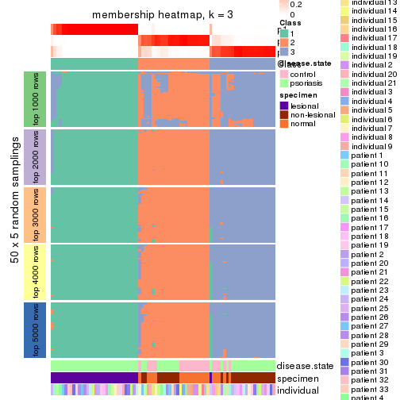</p>

</div>
<div id='tab-CV-NMF-membership-heatmap-3'>
<pre><code class="r">membership_heatmap(res, k = 4)
</code></pre>

<p></p>

</div>
<div id='tab-CV-NMF-membership-heatmap-4'>
<pre><code class="r">membership_heatmap(res, k = 5)
</code></pre>

<p></p>

</div>
<div id='tab-CV-NMF-membership-heatmap-5'>
<pre><code class="r">membership_heatmap(res, k = 6)
</code></pre>

<p></p>

</div>
</div>

As soon as we have had the classes for columns, we can look for signatures
which are significantly different between classes which can be candidate marks
for certain classes. Following are the heatmaps for signatures.


Signature heatmaps where rows are scaled:


<script>
$( function() {
	$( '#tabs-CV-NMF-get-signatures' ).tabs();
} );
</script>
<div id='tabs-CV-NMF-get-signatures'>
<ul>
<li><a href='#tab-CV-NMF-get-signatures-1'>k = 2</a></li>
<li><a href='#tab-CV-NMF-get-signatures-2'>k = 3</a></li>
<li><a href='#tab-CV-NMF-get-signatures-3'>k = 4</a></li>
<li><a href='#tab-CV-NMF-get-signatures-4'>k = 5</a></li>
<li><a href='#tab-CV-NMF-get-signatures-5'>k = 6</a></li>
</ul>
<div id='tab-CV-NMF-get-signatures-1'>
<pre><code class="r">get_signatures(res, k = 2)
</code></pre>

<p></p>

</div>
<div id='tab-CV-NMF-get-signatures-2'>
<pre><code class="r">get_signatures(res, k = 3)
</code></pre>

<p></p>

</div>
<div id='tab-CV-NMF-get-signatures-3'>
<pre><code class="r">get_signatures(res, k = 4)
</code></pre>

<p></p>

</div>
<div id='tab-CV-NMF-get-signatures-4'>
<pre><code class="r">get_signatures(res, k = 5)
</code></pre>

<p></p>

</div>
<div id='tab-CV-NMF-get-signatures-5'>
<pre><code class="r">get_signatures(res, k = 6)
</code></pre>

<p></p>

</div>
</div>


Signature heatmaps where rows are not scaled:


<script>
$( function() {
	$( '#tabs-CV-NMF-get-signatures-no-scale' ).tabs();
} );
</script>
<div id='tabs-CV-NMF-get-signatures-no-scale'>
<ul>
<li><a href='#tab-CV-NMF-get-signatures-no-scale-1'>k = 2</a></li>
<li><a href='#tab-CV-NMF-get-signatures-no-scale-2'>k = 3</a></li>
<li><a href='#tab-CV-NMF-get-signatures-no-scale-3'>k = 4</a></li>
<li><a href='#tab-CV-NMF-get-signatures-no-scale-4'>k = 5</a></li>
<li><a href='#tab-CV-NMF-get-signatures-no-scale-5'>k = 6</a></li>
</ul>
<div id='tab-CV-NMF-get-signatures-no-scale-1'>
<pre><code class="r">get_signatures(res, k = 2, scale_rows = FALSE)
</code></pre>

<p></p>

</div>
<div id='tab-CV-NMF-get-signatures-no-scale-2'>
<pre><code class="r">get_signatures(res, k = 3, scale_rows = FALSE)
</code></pre>

<p></p>

</div>
<div id='tab-CV-NMF-get-signatures-no-scale-3'>
<pre><code class="r">get_signatures(res, k = 4, scale_rows = FALSE)
</code></pre>

<p></p>

</div>
<div id='tab-CV-NMF-get-signatures-no-scale-4'>
<pre><code class="r">get_signatures(res, k = 5, scale_rows = FALSE)
</code></pre>

<p></p>

</div>
<div id='tab-CV-NMF-get-signatures-no-scale-5'>
<pre><code class="r">get_signatures(res, k = 6, scale_rows = FALSE)
</code></pre>

<p></p>

</div>
</div>


Compare the overlap of signatures from different k:

```r
compare_signatures(res)
```


`get_signature()` returns a data frame invisibly. TO get the list of signatures, the function
call should be assigned to a variable explicitly. In following code, if `plot` argument is set
to `FALSE`, no heatmap is plotted while only the differential analysis is performed.

```r
# code only for demonstration
tb = get_signature(res, k = ..., plot = FALSE)
```

An example of the output of `tb` is:

```
#>   which_row         fdr    mean_1    mean_2 scaled_mean_1 scaled_mean_2 km
#> 1        38 0.042760348  8.373488  9.131774    -0.5533452     0.5164555  1
#> 2        40 0.018707592  7.106213  8.469186    -0.6173731     0.5762149  1
#> 3        55 0.019134737 10.221463 11.207825    -0.6159697     0.5749050  1
#> 4        59 0.006059896  5.921854  7.869574    -0.6899429     0.6439467  1
#> 5        60 0.018055526  8.928898 10.211722    -0.6204761     0.5791110  1
#> 6        98 0.009384629 15.714769 14.887706     0.6635654    -0.6193277  2
...
```

The columns in `tb` are:

1. `which_row`: row indices corresponding to the input matrix.
2. `fdr`: FDR for the differential test. 
3. `mean_x`: The mean value in group x.
4. `scaled_mean_x`: The mean value in group x after rows are scaled.
5. `km`: Row groups if k-means clustering is applied to rows.


UMAP plot which shows how samples are separated.


<script>
$( function() {
	$( '#tabs-CV-NMF-dimension-reduction' ).tabs();
} );
</script>
<div id='tabs-CV-NMF-dimension-reduction'>
<ul>
<li><a href='#tab-CV-NMF-dimension-reduction-1'>k = 2</a></li>
<li><a href='#tab-CV-NMF-dimension-reduction-2'>k = 3</a></li>
<li><a href='#tab-CV-NMF-dimension-reduction-3'>k = 4</a></li>
<li><a href='#tab-CV-NMF-dimension-reduction-4'>k = 5</a></li>
<li><a href='#tab-CV-NMF-dimension-reduction-5'>k = 6</a></li>
</ul>
<div id='tab-CV-NMF-dimension-reduction-1'>
<pre><code class="r">dimension_reduction(res, k = 2, method = &quot;UMAP&quot;)
</code></pre>

<p></p>

</div>
<div id='tab-CV-NMF-dimension-reduction-2'>
<pre><code class="r">dimension_reduction(res, k = 3, method = &quot;UMAP&quot;)
</code></pre>

<p></p>

</div>
<div id='tab-CV-NMF-dimension-reduction-3'>
<pre><code class="r">dimension_reduction(res, k = 4, method = &quot;UMAP&quot;)
</code></pre>

<p></p>

</div>
<div id='tab-CV-NMF-dimension-reduction-4'>
<pre><code class="r">dimension_reduction(res, k = 5, method = &quot;UMAP&quot;)
</code></pre>

<p></p>

</div>
<div id='tab-CV-NMF-dimension-reduction-5'>
<pre><code class="r">dimension_reduction(res, k = 6, method = &quot;UMAP&quot;)
</code></pre>

<p></p>

</div>
</div>


Following heatmap shows how subgroups are split when increasing `k`:

```r
collect_classes(res)
```


Test correlation between subgroups and known annotations. If the known
annotation is numeric, one-way ANOVA test is applied, and if the known
annotation is discrete, chi-squared contingency table test is applied.

```r
test_to_known_factors(res)
```

```
#>         n disease.state(p) specimen(p) individual(p) k
#> CV:NMF 81         9.58e-05    1.96e-17         1.000 2
#> CV:NMF 79         1.70e-06    8.58e-19         0.949 3
#> CV:NMF 78         6.13e-14    1.15e-26         0.845 4
#> CV:NMF 64         4.36e-11    1.05e-21         0.703 5
#> CV:NMF 70         1.39e-09    4.58e-18         0.190 6
```


If matrix rows can be associated to genes, consider to use `GO_Enrichment(res,
...)` to perform function enrichment for the signature genes.


 

---------------------------------------------------


### MAD:hclust**


The object with results only for a single top-value method and a single partition method 
can be extracted as:

```r
res = res_list["MAD", "hclust"]
# you can also extract it by
# res = res_list["MAD:hclust"]
```

A summary of `res` and all the functions that can be applied to it:

```r
res
```

```
#> A 'ConsensusPartition' object with k = 2, 3, 4, 5, 6.
#>   On a matrix with 51941 rows and 82 columns.
#>   Top rows (1000, 2000, 3000, 4000, 5000) are extracted by 'MAD' method.
#>   Subgroups are detected by 'hclust' method.
#>   Performed in total 1250 partitions by row resampling.
#>   Best k for subgroups seems to be 2.
#> 
#> Following methods can be applied to this 'ConsensusPartition' object:
#>  [1] "cola_report"             "collect_classes"         "collect_plots"          
#>  [4] "collect_stats"           "colnames"                "compare_signatures"     
#>  [7] "consensus_heatmap"       "dimension_reduction"     "functional_enrichment"  
#> [10] "get_anno_col"            "get_anno"                "get_classes"            
#> [13] "get_consensus"           "get_matrix"              "get_membership"         
#> [16] "get_param"               "get_signatures"          "get_stats"              
#> [19] "is_best_k"               "is_stable_k"             "membership_heatmap"     
#> [22] "ncol"                    "nrow"                    "plot_ecdf"              
#> [25] "rownames"                "select_partition_number" "show"                   
#> [28] "suggest_best_k"          "test_to_known_factors"
```

`collect_plots()` function collects all the plots made from `res` for all `k` (number of partitions)
into one single page to provide an easy and fast comparison between different `k`.

```r
collect_plots(res)
```


The plots are:

- The first row: a plot of the ECDF (Empirical cumulative distribution
  function) curves of the consensus matrix for each `k` and the heatmap of
  predicted classes for each `k`.
- The second row: heatmaps of the consensus matrix for each `k`.
- The third row: heatmaps of the membership matrix for each `k`.
- The fouth row: heatmaps of the signatures for each `k`.

All the plots in panels can be made by individual functions and they are
plotted later in this section.

`select_partition_number()` produces several plots showing different
statistics for choosing "optimized" `k`. There are following statistics:

- ECDF curves of the consensus matrix for each `k`;
- 1-PAC. [The PAC
  score](https://en.wikipedia.org/wiki/Consensus_clustering#Over-interpretation_potential_of_consensus_clustering)
  measures the proportion of the ambiguous subgrouping.
- Mean silhouette score.
- Concordance. The mean probability of fiting the consensus class ids in all
  partitions.
- Area increased. Denote $A_k$ as the area under the ECDF curve for current
  `k`, the area increased is defined as $A_k - A_{k-1}$.
- Rand index. The percent of pairs of samples that are both in a same cluster
  or both are not in a same cluster in the partition of k and k-1.
- Jaccard index. The ratio of pairs of samples are both in a same cluster in
  the partition of k and k-1 and the pairs of samples are both in a same
  cluster in the partition k or k-1.

The detailed explanations of these statistics can be found in [the cola
vignette](http://bioconductor.org/packages/devel/bioc/vignettes/cola/inst/doc/cola.html#toc_13).

Generally speaking, lower PAC score, higher mean silhouette score or higher
concordance corresponds to better partition. Rand index and Jaccard index
measure how similar the current partition is compared to partition with `k-1`.
If they are too similar, we won't accept `k` is better than `k-1`.

```r
select_partition_number(res)
```


The numeric values for all these statistics can be obtained by `get_stats()`.

```r
get_stats(res)
```

```
#>   k 1-PAC mean_silhouette concordance area_increased  Rand Jaccard
#> 2 2 1.000           0.979       0.990         0.4802 0.518   0.518
#> 3 3 0.721           0.768       0.883         0.3347 0.819   0.651
#> 4 4 0.692           0.725       0.826         0.1024 0.921   0.787
#> 5 5 0.635           0.587       0.773         0.0742 0.890   0.680
#> 6 6 0.679           0.675       0.793         0.0293 0.955   0.820
```

`suggest_best_k()` suggests the best $k$ based on these statistics. The rules are as follows:

- All $k$ with Jaccard index larger than 0.95 are removed because the increase of
  the partition number does not provides enough extra information. If all $k$ are removed,
  the best $k$ is assigned by `NA`.
- For $k$ with 1-PAC larger than 0.9, the maximal $k$ is taken as the "best k". Other $k$ is called "optional k".
- If it does not fit the second rule. The $k$ with the highest vote of highest
  1-PAC, mean silhouette and concordance is taken as the "best k".

```r
suggest_best_k(res)
```

```
#> [1] 2
```


Following shows the table of the partitions (You need to click the **show/hide
code output** link to see it). The membership matrix (columns with name `p*`)
is inferred by
[`clue::cl_consensus()`](https://www.rdocumentation.org/link/cl_consensus?package=clue)
function with the `SE` method. Basically the value in the membership matrix
represents the probability to belong to a certain group. The finall class
label for an item is determined with the group with highest probability it
belongs to.

In `get_classes()` function, the entropy is calculated from the membership
matrix and the silhouette score is calculated from the consensus matrix.


<script>
$( function() {
	$( '#tabs-MAD-hclust-get-classes' ).tabs();
} );
</script>
<div id='tabs-MAD-hclust-get-classes'>
<ul>
<li><a href='#tab-MAD-hclust-get-classes-1'>k = 2</a></li>
<li><a href='#tab-MAD-hclust-get-classes-2'>k = 3</a></li>
<li><a href='#tab-MAD-hclust-get-classes-3'>k = 4</a></li>
<li><a href='#tab-MAD-hclust-get-classes-4'>k = 5</a></li>
<li><a href='#tab-MAD-hclust-get-classes-5'>k = 6</a></li>
</ul>

<div id='tab-MAD-hclust-get-classes-1'>
<p><a id='tab-MAD-hclust-get-classes-1-a' style='color:#0366d6' href='#'>show/hide code output</a></p>
<pre><code class="r">cbind(get_classes(res, k = 2), get_membership(res, k = 2))
</code></pre>

<pre><code>#&gt;           class entropy silhouette    p1    p2
#&gt; GSM372286     2  0.0000      0.994 0.000 1.000
#&gt; GSM372287     2  0.0000      0.994 0.000 1.000
#&gt; GSM372288     2  0.0000      0.994 0.000 1.000
#&gt; GSM372289     2  0.0000      0.994 0.000 1.000
#&gt; GSM372290     2  0.0000      0.994 0.000 1.000
#&gt; GSM372291     1  0.7376      0.753 0.792 0.208
#&gt; GSM372292     2  0.0000      0.994 0.000 1.000
#&gt; GSM372293     2  0.0000      0.994 0.000 1.000
#&gt; GSM372294     2  0.0000      0.994 0.000 1.000
#&gt; GSM372295     2  0.0000      0.994 0.000 1.000
#&gt; GSM372296     2  0.0000      0.994 0.000 1.000
#&gt; GSM372297     2  0.0000      0.994 0.000 1.000
#&gt; GSM372298     2  0.0000      0.994 0.000 1.000
#&gt; GSM372299     2  0.0000      0.994 0.000 1.000
#&gt; GSM372300     2  0.0000      0.994 0.000 1.000
#&gt; GSM372301     2  0.0000      0.994 0.000 1.000
#&gt; GSM372302     2  0.0000      0.994 0.000 1.000
#&gt; GSM372303     2  0.0000      0.994 0.000 1.000
#&gt; GSM372304     2  0.0000      0.994 0.000 1.000
#&gt; GSM372305     2  0.0000      0.994 0.000 1.000
#&gt; GSM372306     2  0.0000      0.994 0.000 1.000
#&gt; GSM372307     2  0.0000      0.994 0.000 1.000
#&gt; GSM372309     2  0.0000      0.994 0.000 1.000
#&gt; GSM372311     2  0.0000      0.994 0.000 1.000
#&gt; GSM372313     2  0.0000      0.994 0.000 1.000
#&gt; GSM372315     2  0.0000      0.994 0.000 1.000
#&gt; GSM372317     2  0.0000      0.994 0.000 1.000
#&gt; GSM372319     2  0.0000      0.994 0.000 1.000
#&gt; GSM372321     2  0.0000      0.994 0.000 1.000
#&gt; GSM372323     2  0.0672      0.988 0.008 0.992
#&gt; GSM372326     2  0.0000      0.994 0.000 1.000
#&gt; GSM372328     2  0.0000      0.994 0.000 1.000
#&gt; GSM372330     2  0.0000      0.994 0.000 1.000
#&gt; GSM372332     2  0.0000      0.994 0.000 1.000
#&gt; GSM372335     2  0.0000      0.994 0.000 1.000
#&gt; GSM372337     2  0.0000      0.994 0.000 1.000
#&gt; GSM372339     2  0.0000      0.994 0.000 1.000
#&gt; GSM372341     2  0.0000      0.994 0.000 1.000
#&gt; GSM372343     2  0.0000      0.994 0.000 1.000
#&gt; GSM372345     2  0.0672      0.988 0.008 0.992
#&gt; GSM372347     2  0.0672      0.988 0.008 0.992
#&gt; GSM372349     2  0.0376      0.991 0.004 0.996
#&gt; GSM372351     2  0.0000      0.994 0.000 1.000
#&gt; GSM372353     2  0.0000      0.994 0.000 1.000
#&gt; GSM372355     2  0.0000      0.994 0.000 1.000
#&gt; GSM372357     2  0.0000      0.994 0.000 1.000
#&gt; GSM372359     2  0.0000      0.994 0.000 1.000
#&gt; GSM372361     2  0.0000      0.994 0.000 1.000
#&gt; GSM372363     2  0.0000      0.994 0.000 1.000
#&gt; GSM372308     1  0.0938      0.976 0.988 0.012
#&gt; GSM372310     1  0.0938      0.976 0.988 0.012
#&gt; GSM372312     1  0.5842      0.847 0.860 0.140
#&gt; GSM372314     1  0.0938      0.976 0.988 0.012
#&gt; GSM372316     1  0.0000      0.982 1.000 0.000
#&gt; GSM372318     1  0.0000      0.982 1.000 0.000
#&gt; GSM372320     1  0.0000      0.982 1.000 0.000
#&gt; GSM372322     1  0.0000      0.982 1.000 0.000
#&gt; GSM372324     1  0.0938      0.976 0.988 0.012
#&gt; GSM372325     1  0.0938      0.976 0.988 0.012
#&gt; GSM372327     1  0.0000      0.982 1.000 0.000
#&gt; GSM372329     1  0.0000      0.982 1.000 0.000
#&gt; GSM372331     1  0.0000      0.982 1.000 0.000
#&gt; GSM372333     2  0.7883      0.683 0.236 0.764
#&gt; GSM372334     1  0.0000      0.982 1.000 0.000
#&gt; GSM372336     1  0.0000      0.982 1.000 0.000
#&gt; GSM372338     1  0.0000      0.982 1.000 0.000
#&gt; GSM372340     1  0.0000      0.982 1.000 0.000
#&gt; GSM372342     1  0.0000      0.982 1.000 0.000
#&gt; GSM372344     1  0.0000      0.982 1.000 0.000
#&gt; GSM372346     1  0.0000      0.982 1.000 0.000
#&gt; GSM372348     1  0.0000      0.982 1.000 0.000
#&gt; GSM372350     1  0.5737      0.852 0.864 0.136
#&gt; GSM372352     2  0.0376      0.991 0.004 0.996
#&gt; GSM372354     1  0.0000      0.982 1.000 0.000
#&gt; GSM372356     1  0.0000      0.982 1.000 0.000
#&gt; GSM372358     1  0.0000      0.982 1.000 0.000
#&gt; GSM372360     1  0.0000      0.982 1.000 0.000
#&gt; GSM372362     1  0.0000      0.982 1.000 0.000
#&gt; GSM372364     1  0.0000      0.982 1.000 0.000
#&gt; GSM372365     1  0.0000      0.982 1.000 0.000
#&gt; GSM372366     1  0.0000      0.982 1.000 0.000
#&gt; GSM372367     1  0.0000      0.982 1.000 0.000
</code></pre>

<script>
$('#tab-MAD-hclust-get-classes-1-a').parent().next().next().hide();
$('#tab-MAD-hclust-get-classes-1-a').click(function(){
  $('#tab-MAD-hclust-get-classes-1-a').parent().next().next().toggle();
  return(false);
});
</script>
</div>

<div id='tab-MAD-hclust-get-classes-2'>
<p><a id='tab-MAD-hclust-get-classes-2-a' style='color:#0366d6' href='#'>show/hide code output</a></p>
<pre><code class="r">cbind(get_classes(res, k = 3), get_membership(res, k = 3))
</code></pre>

<pre><code>#&gt;           class entropy silhouette    p1    p2    p3
#&gt; GSM372286     2  0.1964    0.78142 0.000 0.944 0.056
#&gt; GSM372287     2  0.1163    0.78828 0.000 0.972 0.028
#&gt; GSM372288     2  0.0000    0.79224 0.000 1.000 0.000
#&gt; GSM372289     2  0.0000    0.79224 0.000 1.000 0.000
#&gt; GSM372290     2  0.0592    0.79899 0.000 0.988 0.012
#&gt; GSM372291     1  0.5402    0.79565 0.792 0.028 0.180
#&gt; GSM372292     2  0.5497    0.47965 0.000 0.708 0.292
#&gt; GSM372293     3  0.5678    0.58792 0.000 0.316 0.684
#&gt; GSM372294     2  0.3752    0.68079 0.000 0.856 0.144
#&gt; GSM372295     2  0.5968    0.29912 0.000 0.636 0.364
#&gt; GSM372296     2  0.0892    0.79986 0.000 0.980 0.020
#&gt; GSM372297     2  0.1163    0.78828 0.000 0.972 0.028
#&gt; GSM372298     2  0.0892    0.80100 0.000 0.980 0.020
#&gt; GSM372299     2  0.5968    0.29912 0.000 0.636 0.364
#&gt; GSM372300     3  0.5678    0.58792 0.000 0.316 0.684
#&gt; GSM372301     2  0.5497    0.47965 0.000 0.708 0.292
#&gt; GSM372302     2  0.0892    0.79986 0.000 0.980 0.020
#&gt; GSM372303     3  0.5678    0.58792 0.000 0.316 0.684
#&gt; GSM372304     2  0.1163    0.78828 0.000 0.972 0.028
#&gt; GSM372305     2  0.5650    0.40104 0.000 0.688 0.312
#&gt; GSM372306     2  0.5948    0.27246 0.000 0.640 0.360
#&gt; GSM372307     2  0.0592    0.79899 0.000 0.988 0.012
#&gt; GSM372309     2  0.6008    0.22834 0.000 0.628 0.372
#&gt; GSM372311     2  0.0892    0.80091 0.000 0.980 0.020
#&gt; GSM372313     2  0.0892    0.80091 0.000 0.980 0.020
#&gt; GSM372315     2  0.0892    0.80091 0.000 0.980 0.020
#&gt; GSM372317     2  0.1289    0.79780 0.000 0.968 0.032
#&gt; GSM372319     3  0.5650    0.70871 0.000 0.312 0.688
#&gt; GSM372321     3  0.5650    0.70871 0.000 0.312 0.688
#&gt; GSM372323     3  0.5896    0.72965 0.008 0.292 0.700
#&gt; GSM372326     3  0.5650    0.71005 0.000 0.312 0.688
#&gt; GSM372328     3  0.1860    0.72987 0.000 0.052 0.948
#&gt; GSM372330     2  0.0892    0.80091 0.000 0.980 0.020
#&gt; GSM372332     3  0.1964    0.73141 0.000 0.056 0.944
#&gt; GSM372335     3  0.6309    0.23324 0.000 0.496 0.504
#&gt; GSM372337     3  0.4842    0.76923 0.000 0.224 0.776
#&gt; GSM372339     3  0.1860    0.72987 0.000 0.052 0.948
#&gt; GSM372341     3  0.1860    0.72987 0.000 0.052 0.948
#&gt; GSM372343     3  0.1860    0.72987 0.000 0.052 0.948
#&gt; GSM372345     3  0.5247    0.76876 0.008 0.224 0.768
#&gt; GSM372347     3  0.5247    0.76876 0.008 0.224 0.768
#&gt; GSM372349     3  0.5070    0.77020 0.004 0.224 0.772
#&gt; GSM372351     3  0.5650    0.71005 0.000 0.312 0.688
#&gt; GSM372353     2  0.6225    0.00757 0.000 0.568 0.432
#&gt; GSM372355     2  0.1031    0.80017 0.000 0.976 0.024
#&gt; GSM372357     2  0.6225    0.00757 0.000 0.568 0.432
#&gt; GSM372359     2  0.6225    0.00757 0.000 0.568 0.432
#&gt; GSM372361     2  0.0747    0.80031 0.000 0.984 0.016
#&gt; GSM372363     2  0.0892    0.80091 0.000 0.980 0.020
#&gt; GSM372308     1  0.0592    0.97831 0.988 0.000 0.012
#&gt; GSM372310     1  0.0592    0.97831 0.988 0.000 0.012
#&gt; GSM372312     1  0.3686    0.87268 0.860 0.000 0.140
#&gt; GSM372314     1  0.0592    0.97831 0.988 0.000 0.012
#&gt; GSM372316     1  0.0000    0.98459 1.000 0.000 0.000
#&gt; GSM372318     1  0.0000    0.98459 1.000 0.000 0.000
#&gt; GSM372320     1  0.0000    0.98459 1.000 0.000 0.000
#&gt; GSM372322     1  0.0000    0.98459 1.000 0.000 0.000
#&gt; GSM372324     1  0.0592    0.97831 0.988 0.000 0.012
#&gt; GSM372325     1  0.0592    0.97831 0.988 0.000 0.012
#&gt; GSM372327     1  0.0000    0.98459 1.000 0.000 0.000
#&gt; GSM372329     1  0.0000    0.98459 1.000 0.000 0.000
#&gt; GSM372331     1  0.0000    0.98459 1.000 0.000 0.000
#&gt; GSM372333     3  0.7673    0.56017 0.236 0.100 0.664
#&gt; GSM372334     1  0.0000    0.98459 1.000 0.000 0.000
#&gt; GSM372336     1  0.0000    0.98459 1.000 0.000 0.000
#&gt; GSM372338     1  0.0000    0.98459 1.000 0.000 0.000
#&gt; GSM372340     1  0.0000    0.98459 1.000 0.000 0.000
#&gt; GSM372342     1  0.0000    0.98459 1.000 0.000 0.000
#&gt; GSM372344     1  0.0000    0.98459 1.000 0.000 0.000
#&gt; GSM372346     1  0.0000    0.98459 1.000 0.000 0.000
#&gt; GSM372348     1  0.0000    0.98459 1.000 0.000 0.000
#&gt; GSM372350     1  0.3619    0.87669 0.864 0.000 0.136
#&gt; GSM372352     3  0.5070    0.77020 0.004 0.224 0.772
#&gt; GSM372354     1  0.0000    0.98459 1.000 0.000 0.000
#&gt; GSM372356     1  0.0000    0.98459 1.000 0.000 0.000
#&gt; GSM372358     1  0.0000    0.98459 1.000 0.000 0.000
#&gt; GSM372360     1  0.0000    0.98459 1.000 0.000 0.000
#&gt; GSM372362     1  0.0000    0.98459 1.000 0.000 0.000
#&gt; GSM372364     1  0.0000    0.98459 1.000 0.000 0.000
#&gt; GSM372365     1  0.0000    0.98459 1.000 0.000 0.000
#&gt; GSM372366     1  0.0000    0.98459 1.000 0.000 0.000
#&gt; GSM372367     1  0.0000    0.98459 1.000 0.000 0.000
</code></pre>

<script>
$('#tab-MAD-hclust-get-classes-2-a').parent().next().next().hide();
$('#tab-MAD-hclust-get-classes-2-a').click(function(){
  $('#tab-MAD-hclust-get-classes-2-a').parent().next().next().toggle();
  return(false);
});
</script>
</div>

<div id='tab-MAD-hclust-get-classes-3'>
<p><a id='tab-MAD-hclust-get-classes-3-a' style='color:#0366d6' href='#'>show/hide code output</a></p>
<pre><code class="r">cbind(get_classes(res, k = 4), get_membership(res, k = 4))
</code></pre>

<pre><code>#&gt;           class entropy silhouette    p1    p2    p3    p4
#&gt; GSM372286     2  0.2805      0.794 0.000 0.888 0.100 0.012
#&gt; GSM372287     2  0.2647      0.784 0.000 0.880 0.000 0.120
#&gt; GSM372288     2  0.1474      0.807 0.000 0.948 0.000 0.052
#&gt; GSM372289     2  0.1474      0.807 0.000 0.948 0.000 0.052
#&gt; GSM372290     2  0.1635      0.831 0.000 0.948 0.044 0.008
#&gt; GSM372291     1  0.4468      0.754 0.752 0.000 0.016 0.232
#&gt; GSM372292     2  0.7486      0.215 0.000 0.500 0.272 0.228
#&gt; GSM372293     3  0.7149      0.517 0.000 0.132 0.452 0.416
#&gt; GSM372294     2  0.4012      0.721 0.000 0.800 0.016 0.184
#&gt; GSM372295     3  0.7456      0.346 0.000 0.308 0.492 0.200
#&gt; GSM372296     2  0.2179      0.820 0.000 0.924 0.012 0.064
#&gt; GSM372297     2  0.2868      0.782 0.000 0.864 0.000 0.136
#&gt; GSM372298     2  0.4491      0.716 0.000 0.800 0.060 0.140
#&gt; GSM372299     3  0.7456      0.346 0.000 0.308 0.492 0.200
#&gt; GSM372300     3  0.7149      0.517 0.000 0.132 0.452 0.416
#&gt; GSM372301     2  0.7486      0.215 0.000 0.500 0.272 0.228
#&gt; GSM372302     2  0.2179      0.820 0.000 0.924 0.012 0.064
#&gt; GSM372303     3  0.7149      0.517 0.000 0.132 0.452 0.416
#&gt; GSM372304     2  0.2868      0.782 0.000 0.864 0.000 0.136
#&gt; GSM372305     2  0.4994     -0.100 0.000 0.520 0.480 0.000
#&gt; GSM372306     3  0.4989      0.198 0.000 0.472 0.528 0.000
#&gt; GSM372307     2  0.1635      0.831 0.000 0.948 0.044 0.008
#&gt; GSM372309     2  0.4998     -0.157 0.000 0.512 0.488 0.000
#&gt; GSM372311     2  0.1118      0.832 0.000 0.964 0.036 0.000
#&gt; GSM372313     2  0.1118      0.832 0.000 0.964 0.036 0.000
#&gt; GSM372315     2  0.1118      0.832 0.000 0.964 0.036 0.000
#&gt; GSM372317     2  0.1389      0.828 0.000 0.952 0.048 0.000
#&gt; GSM372319     3  0.3377      0.687 0.000 0.140 0.848 0.012
#&gt; GSM372321     3  0.3377      0.687 0.000 0.140 0.848 0.012
#&gt; GSM372323     3  0.2918      0.692 0.000 0.116 0.876 0.008
#&gt; GSM372326     3  0.3479      0.684 0.000 0.148 0.840 0.012
#&gt; GSM372328     3  0.4699      0.607 0.000 0.004 0.676 0.320
#&gt; GSM372330     2  0.1118      0.832 0.000 0.964 0.036 0.000
#&gt; GSM372332     3  0.4608      0.615 0.000 0.004 0.692 0.304
#&gt; GSM372335     3  0.4522      0.513 0.000 0.320 0.680 0.000
#&gt; GSM372337     3  0.1022      0.698 0.000 0.032 0.968 0.000
#&gt; GSM372339     3  0.4699      0.607 0.000 0.004 0.676 0.320
#&gt; GSM372341     3  0.4699      0.607 0.000 0.004 0.676 0.320
#&gt; GSM372343     3  0.4699      0.607 0.000 0.004 0.676 0.320
#&gt; GSM372345     3  0.1356      0.698 0.000 0.032 0.960 0.008
#&gt; GSM372347     3  0.1356      0.698 0.000 0.032 0.960 0.008
#&gt; GSM372349     3  0.1356      0.699 0.000 0.032 0.960 0.008
#&gt; GSM372351     3  0.3479      0.684 0.000 0.148 0.840 0.012
#&gt; GSM372353     3  0.4830      0.400 0.000 0.392 0.608 0.000
#&gt; GSM372355     2  0.1211      0.831 0.000 0.960 0.040 0.000
#&gt; GSM372357     3  0.4830      0.400 0.000 0.392 0.608 0.000
#&gt; GSM372359     3  0.4830      0.400 0.000 0.392 0.608 0.000
#&gt; GSM372361     2  0.1890      0.828 0.000 0.936 0.056 0.008
#&gt; GSM372363     2  0.1389      0.828 0.000 0.952 0.048 0.000
#&gt; GSM372308     1  0.4284      0.852 0.764 0.000 0.012 0.224
#&gt; GSM372310     1  0.4284      0.852 0.764 0.000 0.012 0.224
#&gt; GSM372312     1  0.4883      0.800 0.696 0.000 0.016 0.288
#&gt; GSM372314     1  0.4576      0.830 0.728 0.000 0.012 0.260
#&gt; GSM372316     1  0.0188      0.920 0.996 0.000 0.000 0.004
#&gt; GSM372318     1  0.0000      0.920 1.000 0.000 0.000 0.000
#&gt; GSM372320     1  0.0000      0.920 1.000 0.000 0.000 0.000
#&gt; GSM372322     1  0.0000      0.920 1.000 0.000 0.000 0.000
#&gt; GSM372324     1  0.4576      0.830 0.728 0.000 0.012 0.260
#&gt; GSM372325     1  0.4576      0.830 0.728 0.000 0.012 0.260
#&gt; GSM372327     1  0.0000      0.920 1.000 0.000 0.000 0.000
#&gt; GSM372329     1  0.0000      0.920 1.000 0.000 0.000 0.000
#&gt; GSM372331     1  0.4134      0.836 0.740 0.000 0.000 0.260
#&gt; GSM372333     3  0.5731      0.581 0.128 0.016 0.744 0.112
#&gt; GSM372334     1  0.0000      0.920 1.000 0.000 0.000 0.000
#&gt; GSM372336     1  0.3569      0.870 0.804 0.000 0.000 0.196
#&gt; GSM372338     1  0.0000      0.920 1.000 0.000 0.000 0.000
#&gt; GSM372340     1  0.0000      0.920 1.000 0.000 0.000 0.000
#&gt; GSM372342     1  0.0000      0.920 1.000 0.000 0.000 0.000
#&gt; GSM372344     1  0.0000      0.920 1.000 0.000 0.000 0.000
#&gt; GSM372346     1  0.0000      0.920 1.000 0.000 0.000 0.000
#&gt; GSM372348     1  0.3569      0.870 0.804 0.000 0.000 0.196
#&gt; GSM372350     1  0.3625      0.820 0.828 0.000 0.012 0.160
#&gt; GSM372352     3  0.1356      0.699 0.000 0.032 0.960 0.008
#&gt; GSM372354     1  0.0000      0.920 1.000 0.000 0.000 0.000
#&gt; GSM372356     1  0.1474      0.916 0.948 0.000 0.000 0.052
#&gt; GSM372358     1  0.1302      0.917 0.956 0.000 0.000 0.044
#&gt; GSM372360     1  0.1302      0.917 0.956 0.000 0.000 0.044
#&gt; GSM372362     1  0.1302      0.917 0.956 0.000 0.000 0.044
#&gt; GSM372364     1  0.1474      0.916 0.948 0.000 0.000 0.052
#&gt; GSM372365     1  0.2149      0.908 0.912 0.000 0.000 0.088
#&gt; GSM372366     1  0.0000      0.920 1.000 0.000 0.000 0.000
#&gt; GSM372367     1  0.2921      0.893 0.860 0.000 0.000 0.140
</code></pre>

<script>
$('#tab-MAD-hclust-get-classes-3-a').parent().next().next().hide();
$('#tab-MAD-hclust-get-classes-3-a').click(function(){
  $('#tab-MAD-hclust-get-classes-3-a').parent().next().next().toggle();
  return(false);
});
</script>
</div>

<div id='tab-MAD-hclust-get-classes-4'>
<p><a id='tab-MAD-hclust-get-classes-4-a' style='color:#0366d6' href='#'>show/hide code output</a></p>
<pre><code class="r">cbind(get_classes(res, k = 5), get_membership(res, k = 5))
</code></pre>

<pre><code>#&gt;           class entropy silhouette    p1    p2    p3    p4    p5
#&gt; GSM372286     2  0.2522     0.7840 0.000 0.880 0.108 0.012 0.000
#&gt; GSM372287     2  0.3909     0.7210 0.000 0.760 0.000 0.216 0.024
#&gt; GSM372288     2  0.2208     0.7986 0.000 0.908 0.000 0.072 0.020
#&gt; GSM372289     2  0.2208     0.7986 0.000 0.908 0.000 0.072 0.020
#&gt; GSM372290     2  0.1701     0.8289 0.000 0.936 0.048 0.016 0.000
#&gt; GSM372291     1  0.4930     0.4212 0.684 0.000 0.000 0.072 0.244
#&gt; GSM372292     2  0.6557    -0.1118 0.000 0.440 0.208 0.352 0.000
#&gt; GSM372293     4  0.5359     1.0000 0.000 0.076 0.316 0.608 0.000
#&gt; GSM372294     2  0.4496     0.7437 0.000 0.764 0.008 0.072 0.156
#&gt; GSM372295     3  0.6290     0.1124 0.000 0.088 0.448 0.444 0.020
#&gt; GSM372296     2  0.2984     0.8069 0.000 0.856 0.016 0.124 0.004
#&gt; GSM372297     2  0.3970     0.7131 0.000 0.744 0.000 0.236 0.020
#&gt; GSM372298     2  0.4073     0.6640 0.000 0.752 0.032 0.216 0.000
#&gt; GSM372299     3  0.6290     0.1124 0.000 0.088 0.448 0.444 0.020
#&gt; GSM372300     4  0.5359     1.0000 0.000 0.076 0.316 0.608 0.000
#&gt; GSM372301     2  0.6557    -0.1118 0.000 0.440 0.208 0.352 0.000
#&gt; GSM372302     2  0.2984     0.8069 0.000 0.856 0.016 0.124 0.004
#&gt; GSM372303     4  0.5359     1.0000 0.000 0.076 0.316 0.608 0.000
#&gt; GSM372304     2  0.3970     0.7131 0.000 0.744 0.000 0.236 0.020
#&gt; GSM372305     3  0.4702     0.2258 0.000 0.476 0.512 0.004 0.008
#&gt; GSM372306     3  0.4651     0.3482 0.000 0.428 0.560 0.004 0.008
#&gt; GSM372307     2  0.1597     0.8284 0.000 0.940 0.048 0.012 0.000
#&gt; GSM372309     3  0.4909     0.2369 0.000 0.472 0.508 0.012 0.008
#&gt; GSM372311     2  0.1569     0.8265 0.000 0.944 0.044 0.004 0.008
#&gt; GSM372313     2  0.1644     0.8261 0.000 0.940 0.048 0.004 0.008
#&gt; GSM372315     2  0.1408     0.8275 0.000 0.948 0.044 0.000 0.008
#&gt; GSM372317     2  0.1788     0.8238 0.000 0.932 0.056 0.004 0.008
#&gt; GSM372319     3  0.2773     0.4717 0.000 0.112 0.868 0.020 0.000
#&gt; GSM372321     3  0.2773     0.4717 0.000 0.112 0.868 0.020 0.000
#&gt; GSM372323     3  0.2689     0.4676 0.000 0.084 0.888 0.012 0.016
#&gt; GSM372326     3  0.3096     0.4705 0.000 0.108 0.860 0.024 0.008
#&gt; GSM372328     3  0.4528    -0.3994 0.000 0.000 0.548 0.444 0.008
#&gt; GSM372330     2  0.1408     0.8275 0.000 0.948 0.044 0.000 0.008
#&gt; GSM372332     3  0.4219    -0.3835 0.000 0.000 0.584 0.416 0.000
#&gt; GSM372335     3  0.4088     0.4545 0.000 0.276 0.712 0.004 0.008
#&gt; GSM372337     3  0.0968     0.4333 0.000 0.004 0.972 0.012 0.012
#&gt; GSM372339     3  0.4528    -0.3994 0.000 0.000 0.548 0.444 0.008
#&gt; GSM372341     3  0.4528    -0.3994 0.000 0.000 0.548 0.444 0.008
#&gt; GSM372343     3  0.4528    -0.3994 0.000 0.000 0.548 0.444 0.008
#&gt; GSM372345     3  0.1173     0.4360 0.000 0.004 0.964 0.012 0.020
#&gt; GSM372347     3  0.1173     0.4360 0.000 0.004 0.964 0.012 0.020
#&gt; GSM372349     3  0.1267     0.4349 0.000 0.004 0.960 0.024 0.012
#&gt; GSM372351     3  0.3096     0.4705 0.000 0.108 0.860 0.024 0.008
#&gt; GSM372353     3  0.4434     0.4356 0.000 0.348 0.640 0.004 0.008
#&gt; GSM372355     2  0.1717     0.8243 0.000 0.936 0.052 0.004 0.008
#&gt; GSM372357     3  0.4434     0.4356 0.000 0.348 0.640 0.004 0.008
#&gt; GSM372359     3  0.4434     0.4356 0.000 0.348 0.640 0.004 0.008
#&gt; GSM372361     2  0.1914     0.8239 0.000 0.924 0.060 0.016 0.000
#&gt; GSM372363     2  0.2199     0.8225 0.000 0.916 0.060 0.016 0.008
#&gt; GSM372308     5  0.3966     0.8190 0.336 0.000 0.000 0.000 0.664
#&gt; GSM372310     5  0.3966     0.8190 0.336 0.000 0.000 0.000 0.664
#&gt; GSM372312     5  0.4641     0.0489 0.456 0.000 0.000 0.012 0.532
#&gt; GSM372314     5  0.3612     0.8330 0.268 0.000 0.000 0.000 0.732
#&gt; GSM372316     1  0.0609     0.8508 0.980 0.000 0.000 0.000 0.020
#&gt; GSM372318     1  0.0404     0.8547 0.988 0.000 0.000 0.000 0.012
#&gt; GSM372320     1  0.0000     0.8566 1.000 0.000 0.000 0.000 0.000
#&gt; GSM372322     1  0.0162     0.8567 0.996 0.000 0.000 0.000 0.004
#&gt; GSM372324     5  0.3612     0.8330 0.268 0.000 0.000 0.000 0.732
#&gt; GSM372325     5  0.3612     0.8330 0.268 0.000 0.000 0.000 0.732
#&gt; GSM372327     1  0.0000     0.8566 1.000 0.000 0.000 0.000 0.000
#&gt; GSM372329     1  0.0000     0.8566 1.000 0.000 0.000 0.000 0.000
#&gt; GSM372331     5  0.3684     0.8327 0.280 0.000 0.000 0.000 0.720
#&gt; GSM372333     3  0.4082     0.2433 0.008 0.000 0.740 0.012 0.240
#&gt; GSM372334     1  0.0000     0.8566 1.000 0.000 0.000 0.000 0.000
#&gt; GSM372336     5  0.4219     0.7298 0.416 0.000 0.000 0.000 0.584
#&gt; GSM372338     1  0.0000     0.8566 1.000 0.000 0.000 0.000 0.000
#&gt; GSM372340     1  0.0000     0.8566 1.000 0.000 0.000 0.000 0.000
#&gt; GSM372342     1  0.0000     0.8566 1.000 0.000 0.000 0.000 0.000
#&gt; GSM372344     1  0.0000     0.8566 1.000 0.000 0.000 0.000 0.000
#&gt; GSM372346     1  0.0162     0.8567 0.996 0.000 0.000 0.000 0.004
#&gt; GSM372348     5  0.4219     0.7298 0.416 0.000 0.000 0.000 0.584
#&gt; GSM372350     1  0.3642     0.5285 0.760 0.000 0.000 0.008 0.232
#&gt; GSM372352     3  0.1267     0.4349 0.000 0.004 0.960 0.024 0.012
#&gt; GSM372354     1  0.0290     0.8557 0.992 0.000 0.000 0.000 0.008
#&gt; GSM372356     1  0.2690     0.7190 0.844 0.000 0.000 0.000 0.156
#&gt; GSM372358     1  0.2561     0.7347 0.856 0.000 0.000 0.000 0.144
#&gt; GSM372360     1  0.2561     0.7347 0.856 0.000 0.000 0.000 0.144
#&gt; GSM372362     1  0.2561     0.7347 0.856 0.000 0.000 0.000 0.144
#&gt; GSM372364     1  0.2690     0.7190 0.844 0.000 0.000 0.000 0.156
#&gt; GSM372365     1  0.3242     0.5954 0.784 0.000 0.000 0.000 0.216
#&gt; GSM372366     1  0.0510     0.8529 0.984 0.000 0.000 0.000 0.016
#&gt; GSM372367     1  0.3837     0.3160 0.692 0.000 0.000 0.000 0.308
</code></pre>

<script>
$('#tab-MAD-hclust-get-classes-4-a').parent().next().next().hide();
$('#tab-MAD-hclust-get-classes-4-a').click(function(){
  $('#tab-MAD-hclust-get-classes-4-a').parent().next().next().toggle();
  return(false);
});
</script>
</div>

<div id='tab-MAD-hclust-get-classes-5'>
<p><a id='tab-MAD-hclust-get-classes-5-a' style='color:#0366d6' href='#'>show/hide code output</a></p>
<pre><code class="r">cbind(get_classes(res, k = 6), get_membership(res, k = 6))
</code></pre>

<pre><code>#&gt;           class entropy silhouette    p1    p2    p3    p4    p5    p6
#&gt; GSM372286     4  0.2218     0.7461 0.000 0.104 0.000 0.884 0.000 0.012
#&gt; GSM372287     4  0.3670     0.6394 0.000 0.000 0.024 0.736 0.000 0.240
#&gt; GSM372288     4  0.1858     0.7642 0.000 0.000 0.004 0.904 0.000 0.092
#&gt; GSM372289     4  0.1858     0.7642 0.000 0.000 0.004 0.904 0.000 0.092
#&gt; GSM372290     4  0.1391     0.7945 0.000 0.040 0.000 0.944 0.000 0.016
#&gt; GSM372291     1  0.7335     0.0156 0.412 0.000 0.224 0.000 0.216 0.148
#&gt; GSM372292     4  0.7527    -0.1297 0.000 0.168 0.260 0.356 0.000 0.216
#&gt; GSM372293     3  0.5579     0.6036 0.000 0.256 0.564 0.004 0.000 0.176
#&gt; GSM372294     4  0.4365     0.6930 0.000 0.008 0.020 0.768 0.120 0.084
#&gt; GSM372295     6  0.3720     1.0000 0.000 0.108 0.036 0.044 0.000 0.812
#&gt; GSM372296     4  0.2883     0.7607 0.000 0.012 0.012 0.844 0.000 0.132
#&gt; GSM372297     4  0.3778     0.6204 0.000 0.000 0.020 0.708 0.000 0.272
#&gt; GSM372298     4  0.4792     0.5217 0.000 0.000 0.148 0.672 0.000 0.180
#&gt; GSM372299     6  0.3720     1.0000 0.000 0.108 0.036 0.044 0.000 0.812
#&gt; GSM372300     3  0.5579     0.6036 0.000 0.256 0.564 0.004 0.000 0.176
#&gt; GSM372301     4  0.7527    -0.1297 0.000 0.168 0.260 0.356 0.000 0.216
#&gt; GSM372302     4  0.2883     0.7607 0.000 0.012 0.012 0.844 0.000 0.132
#&gt; GSM372303     3  0.5579     0.6036 0.000 0.256 0.564 0.004 0.000 0.176
#&gt; GSM372304     4  0.3778     0.6204 0.000 0.000 0.020 0.708 0.000 0.272
#&gt; GSM372305     2  0.4184     0.3709 0.000 0.504 0.000 0.484 0.000 0.012
#&gt; GSM372306     2  0.4147     0.4881 0.000 0.552 0.000 0.436 0.000 0.012
#&gt; GSM372307     4  0.1297     0.7941 0.000 0.040 0.000 0.948 0.000 0.012
#&gt; GSM372309     2  0.4535     0.3643 0.000 0.488 0.000 0.480 0.000 0.032
#&gt; GSM372311     4  0.1225     0.7929 0.000 0.036 0.000 0.952 0.000 0.012
#&gt; GSM372313     4  0.1297     0.7923 0.000 0.040 0.000 0.948 0.000 0.012
#&gt; GSM372315     4  0.1124     0.7941 0.000 0.036 0.000 0.956 0.000 0.008
#&gt; GSM372317     4  0.1434     0.7902 0.000 0.048 0.000 0.940 0.000 0.012
#&gt; GSM372319     2  0.2843     0.6485 0.000 0.848 0.036 0.116 0.000 0.000
#&gt; GSM372321     2  0.2843     0.6485 0.000 0.848 0.036 0.116 0.000 0.000
#&gt; GSM372323     2  0.2529     0.6500 0.000 0.884 0.012 0.088 0.008 0.008
#&gt; GSM372326     2  0.2844     0.6560 0.000 0.856 0.020 0.112 0.000 0.012
#&gt; GSM372328     3  0.3737     0.7767 0.000 0.392 0.608 0.000 0.000 0.000
#&gt; GSM372330     4  0.1124     0.7941 0.000 0.036 0.000 0.956 0.000 0.008
#&gt; GSM372332     3  0.4264     0.7142 0.000 0.488 0.496 0.000 0.000 0.016
#&gt; GSM372335     2  0.3650     0.6353 0.000 0.708 0.000 0.280 0.000 0.012
#&gt; GSM372337     2  0.0622     0.5630 0.000 0.980 0.012 0.000 0.008 0.000
#&gt; GSM372339     3  0.3737     0.7767 0.000 0.392 0.608 0.000 0.000 0.000
#&gt; GSM372341     3  0.3737     0.7767 0.000 0.392 0.608 0.000 0.000 0.000
#&gt; GSM372343     3  0.3737     0.7767 0.000 0.392 0.608 0.000 0.000 0.000
#&gt; GSM372345     2  0.0820     0.5664 0.000 0.972 0.012 0.000 0.016 0.000
#&gt; GSM372347     2  0.0820     0.5664 0.000 0.972 0.012 0.000 0.016 0.000
#&gt; GSM372349     2  0.0976     0.5656 0.000 0.968 0.016 0.000 0.008 0.008
#&gt; GSM372351     2  0.2844     0.6560 0.000 0.856 0.020 0.112 0.000 0.012
#&gt; GSM372353     2  0.3967     0.5976 0.000 0.632 0.000 0.356 0.000 0.012
#&gt; GSM372355     4  0.1367     0.7904 0.000 0.044 0.000 0.944 0.000 0.012
#&gt; GSM372357     2  0.3967     0.5976 0.000 0.632 0.000 0.356 0.000 0.012
#&gt; GSM372359     2  0.3967     0.5976 0.000 0.632 0.000 0.356 0.000 0.012
#&gt; GSM372361     4  0.1644     0.7910 0.000 0.040 0.000 0.932 0.000 0.028
#&gt; GSM372363     4  0.1765     0.7884 0.000 0.052 0.000 0.924 0.000 0.024
#&gt; GSM372308     5  0.3405     0.8217 0.272 0.004 0.000 0.000 0.724 0.000
#&gt; GSM372310     5  0.3405     0.8217 0.272 0.004 0.000 0.000 0.724 0.000
#&gt; GSM372312     5  0.6436     0.2753 0.252 0.004 0.128 0.000 0.544 0.072
#&gt; GSM372314     5  0.2964     0.8328 0.204 0.004 0.000 0.000 0.792 0.000
#&gt; GSM372316     1  0.0547     0.8333 0.980 0.000 0.000 0.000 0.020 0.000
#&gt; GSM372318     1  0.0363     0.8365 0.988 0.000 0.000 0.000 0.012 0.000
#&gt; GSM372320     1  0.0000     0.8381 1.000 0.000 0.000 0.000 0.000 0.000
#&gt; GSM372322     1  0.0146     0.8382 0.996 0.000 0.000 0.000 0.004 0.000
#&gt; GSM372324     5  0.2964     0.8328 0.204 0.004 0.000 0.000 0.792 0.000
#&gt; GSM372325     5  0.2964     0.8328 0.204 0.004 0.000 0.000 0.792 0.000
#&gt; GSM372327     1  0.0000     0.8381 1.000 0.000 0.000 0.000 0.000 0.000
#&gt; GSM372329     1  0.0000     0.8381 1.000 0.000 0.000 0.000 0.000 0.000
#&gt; GSM372331     5  0.2912     0.8355 0.216 0.000 0.000 0.000 0.784 0.000
#&gt; GSM372333     2  0.4073     0.3134 0.008 0.728 0.012 0.000 0.236 0.016
#&gt; GSM372334     1  0.0000     0.8381 1.000 0.000 0.000 0.000 0.000 0.000
#&gt; GSM372336     5  0.3684     0.7089 0.372 0.000 0.000 0.000 0.628 0.000
#&gt; GSM372338     1  0.0000     0.8381 1.000 0.000 0.000 0.000 0.000 0.000
#&gt; GSM372340     1  0.0000     0.8381 1.000 0.000 0.000 0.000 0.000 0.000
#&gt; GSM372342     1  0.0000     0.8381 1.000 0.000 0.000 0.000 0.000 0.000
#&gt; GSM372344     1  0.0000     0.8381 1.000 0.000 0.000 0.000 0.000 0.000
#&gt; GSM372346     1  0.0146     0.8382 0.996 0.000 0.000 0.000 0.004 0.000
#&gt; GSM372348     5  0.3684     0.7089 0.372 0.000 0.000 0.000 0.628 0.000
#&gt; GSM372350     1  0.6754     0.1430 0.488 0.000 0.220 0.000 0.216 0.076
#&gt; GSM372352     2  0.0976     0.5656 0.000 0.968 0.016 0.000 0.008 0.008
#&gt; GSM372354     1  0.0260     0.8373 0.992 0.000 0.000 0.000 0.008 0.000
#&gt; GSM372356     1  0.2416     0.7214 0.844 0.000 0.000 0.000 0.156 0.000
#&gt; GSM372358     1  0.2300     0.7341 0.856 0.000 0.000 0.000 0.144 0.000
#&gt; GSM372360     1  0.2300     0.7341 0.856 0.000 0.000 0.000 0.144 0.000
#&gt; GSM372362     1  0.2300     0.7341 0.856 0.000 0.000 0.000 0.144 0.000
#&gt; GSM372364     1  0.2416     0.7214 0.844 0.000 0.000 0.000 0.156 0.000
#&gt; GSM372365     1  0.2912     0.6203 0.784 0.000 0.000 0.000 0.216 0.000
#&gt; GSM372366     1  0.0458     0.8349 0.984 0.000 0.000 0.000 0.016 0.000
#&gt; GSM372367     1  0.3563     0.3063 0.664 0.000 0.000 0.000 0.336 0.000
</code></pre>

<script>
$('#tab-MAD-hclust-get-classes-5-a').parent().next().next().hide();
$('#tab-MAD-hclust-get-classes-5-a').click(function(){
  $('#tab-MAD-hclust-get-classes-5-a').parent().next().next().toggle();
  return(false);
});
</script>
</div>
</div>

Heatmaps for the consensus matrix. It visualizes the probability of two
samples to be in a same group.


<script>
$( function() {
	$( '#tabs-MAD-hclust-consensus-heatmap' ).tabs();
} );
</script>
<div id='tabs-MAD-hclust-consensus-heatmap'>
<ul>
<li><a href='#tab-MAD-hclust-consensus-heatmap-1'>k = 2</a></li>
<li><a href='#tab-MAD-hclust-consensus-heatmap-2'>k = 3</a></li>
<li><a href='#tab-MAD-hclust-consensus-heatmap-3'>k = 4</a></li>
<li><a href='#tab-MAD-hclust-consensus-heatmap-4'>k = 5</a></li>
<li><a href='#tab-MAD-hclust-consensus-heatmap-5'>k = 6</a></li>
</ul>
<div id='tab-MAD-hclust-consensus-heatmap-1'>
<pre><code class="r">consensus_heatmap(res, k = 2)
</code></pre>

<p></p>

</div>
<div id='tab-MAD-hclust-consensus-heatmap-2'>
<pre><code class="r">consensus_heatmap(res, k = 3)
</code></pre>

<p></p>

</div>
<div id='tab-MAD-hclust-consensus-heatmap-3'>
<pre><code class="r">consensus_heatmap(res, k = 4)
</code></pre>

<p></p>

</div>
<div id='tab-MAD-hclust-consensus-heatmap-4'>
<pre><code class="r">consensus_heatmap(res, k = 5)
</code></pre>

<p></p>

</div>
<div id='tab-MAD-hclust-consensus-heatmap-5'>
<pre><code class="r">consensus_heatmap(res, k = 6)
</code></pre>

<p></p>

</div>
</div>

Heatmaps for the membership of samples in all partitions to see how consistent they are:


<script>
$( function() {
	$( '#tabs-MAD-hclust-membership-heatmap' ).tabs();
} );
</script>
<div id='tabs-MAD-hclust-membership-heatmap'>
<ul>
<li><a href='#tab-MAD-hclust-membership-heatmap-1'>k = 2</a></li>
<li><a href='#tab-MAD-hclust-membership-heatmap-2'>k = 3</a></li>
<li><a href='#tab-MAD-hclust-membership-heatmap-3'>k = 4</a></li>
<li><a href='#tab-MAD-hclust-membership-heatmap-4'>k = 5</a></li>
<li><a href='#tab-MAD-hclust-membership-heatmap-5'>k = 6</a></li>
</ul>
<div id='tab-MAD-hclust-membership-heatmap-1'>
<pre><code class="r">membership_heatmap(res, k = 2)
</code></pre>

<p></p>

</div>
<div id='tab-MAD-hclust-membership-heatmap-2'>
<pre><code class="r">membership_heatmap(res, k = 3)
</code></pre>

<p></p>

</div>
<div id='tab-MAD-hclust-membership-heatmap-3'>
<pre><code class="r">membership_heatmap(res, k = 4)
</code></pre>

<p></p>

</div>
<div id='tab-MAD-hclust-membership-heatmap-4'>
<pre><code class="r">membership_heatmap(res, k = 5)
</code></pre>

<p></p>

</div>
<div id='tab-MAD-hclust-membership-heatmap-5'>
<pre><code class="r">membership_heatmap(res, k = 6)
</code></pre>

<p></p>

</div>
</div>

As soon as we have had the classes for columns, we can look for signatures
which are significantly different between classes which can be candidate marks
for certain classes. Following are the heatmaps for signatures.


Signature heatmaps where rows are scaled:


<script>
$( function() {
	$( '#tabs-MAD-hclust-get-signatures' ).tabs();
} );
</script>
<div id='tabs-MAD-hclust-get-signatures'>
<ul>
<li><a href='#tab-MAD-hclust-get-signatures-1'>k = 2</a></li>
<li><a href='#tab-MAD-hclust-get-signatures-2'>k = 3</a></li>
<li><a href='#tab-MAD-hclust-get-signatures-3'>k = 4</a></li>
<li><a href='#tab-MAD-hclust-get-signatures-4'>k = 5</a></li>
<li><a href='#tab-MAD-hclust-get-signatures-5'>k = 6</a></li>
</ul>
<div id='tab-MAD-hclust-get-signatures-1'>
<pre><code class="r">get_signatures(res, k = 2)
</code></pre>

<p></p>

</div>
<div id='tab-MAD-hclust-get-signatures-2'>
<pre><code class="r">get_signatures(res, k = 3)
</code></pre>

<p></p>

</div>
<div id='tab-MAD-hclust-get-signatures-3'>
<pre><code class="r">get_signatures(res, k = 4)
</code></pre>

<p></p>

</div>
<div id='tab-MAD-hclust-get-signatures-4'>
<pre><code class="r">get_signatures(res, k = 5)
</code></pre>

<p></p>

</div>
<div id='tab-MAD-hclust-get-signatures-5'>
<pre><code class="r">get_signatures(res, k = 6)
</code></pre>

<p></p>

</div>
</div>


Signature heatmaps where rows are not scaled:


<script>
$( function() {
	$( '#tabs-MAD-hclust-get-signatures-no-scale' ).tabs();
} );
</script>
<div id='tabs-MAD-hclust-get-signatures-no-scale'>
<ul>
<li><a href='#tab-MAD-hclust-get-signatures-no-scale-1'>k = 2</a></li>
<li><a href='#tab-MAD-hclust-get-signatures-no-scale-2'>k = 3</a></li>
<li><a href='#tab-MAD-hclust-get-signatures-no-scale-3'>k = 4</a></li>
<li><a href='#tab-MAD-hclust-get-signatures-no-scale-4'>k = 5</a></li>
<li><a href='#tab-MAD-hclust-get-signatures-no-scale-5'>k = 6</a></li>
</ul>
<div id='tab-MAD-hclust-get-signatures-no-scale-1'>
<pre><code class="r">get_signatures(res, k = 2, scale_rows = FALSE)
</code></pre>

<p></p>

</div>
<div id='tab-MAD-hclust-get-signatures-no-scale-2'>
<pre><code class="r">get_signatures(res, k = 3, scale_rows = FALSE)
</code></pre>

<p></p>

</div>
<div id='tab-MAD-hclust-get-signatures-no-scale-3'>
<pre><code class="r">get_signatures(res, k = 4, scale_rows = FALSE)
</code></pre>

<p></p>

</div>
<div id='tab-MAD-hclust-get-signatures-no-scale-4'>
<pre><code class="r">get_signatures(res, k = 5, scale_rows = FALSE)
</code></pre>

<p></p>

</div>
<div id='tab-MAD-hclust-get-signatures-no-scale-5'>
<pre><code class="r">get_signatures(res, k = 6, scale_rows = FALSE)
</code></pre>

<p></p>

</div>
</div>


Compare the overlap of signatures from different k:

```r
compare_signatures(res)
```


`get_signature()` returns a data frame invisibly. TO get the list of signatures, the function
call should be assigned to a variable explicitly. In following code, if `plot` argument is set
to `FALSE`, no heatmap is plotted while only the differential analysis is performed.

```r
# code only for demonstration
tb = get_signature(res, k = ..., plot = FALSE)
```

An example of the output of `tb` is:

```
#>   which_row         fdr    mean_1    mean_2 scaled_mean_1 scaled_mean_2 km
#> 1        38 0.042760348  8.373488  9.131774    -0.5533452     0.5164555  1
#> 2        40 0.018707592  7.106213  8.469186    -0.6173731     0.5762149  1
#> 3        55 0.019134737 10.221463 11.207825    -0.6159697     0.5749050  1
#> 4        59 0.006059896  5.921854  7.869574    -0.6899429     0.6439467  1
#> 5        60 0.018055526  8.928898 10.211722    -0.6204761     0.5791110  1
#> 6        98 0.009384629 15.714769 14.887706     0.6635654    -0.6193277  2
...
```

The columns in `tb` are:

1. `which_row`: row indices corresponding to the input matrix.
2. `fdr`: FDR for the differential test. 
3. `mean_x`: The mean value in group x.
4. `scaled_mean_x`: The mean value in group x after rows are scaled.
5. `km`: Row groups if k-means clustering is applied to rows.


UMAP plot which shows how samples are separated.


<script>
$( function() {
	$( '#tabs-MAD-hclust-dimension-reduction' ).tabs();
} );
</script>
<div id='tabs-MAD-hclust-dimension-reduction'>
<ul>
<li><a href='#tab-MAD-hclust-dimension-reduction-1'>k = 2</a></li>
<li><a href='#tab-MAD-hclust-dimension-reduction-2'>k = 3</a></li>
<li><a href='#tab-MAD-hclust-dimension-reduction-3'>k = 4</a></li>
<li><a href='#tab-MAD-hclust-dimension-reduction-4'>k = 5</a></li>
<li><a href='#tab-MAD-hclust-dimension-reduction-5'>k = 6</a></li>
</ul>
<div id='tab-MAD-hclust-dimension-reduction-1'>
<pre><code class="r">dimension_reduction(res, k = 2, method = &quot;UMAP&quot;)
</code></pre>

<p></p>

</div>
<div id='tab-MAD-hclust-dimension-reduction-2'>
<pre><code class="r">dimension_reduction(res, k = 3, method = &quot;UMAP&quot;)
</code></pre>

<p></p>

</div>
<div id='tab-MAD-hclust-dimension-reduction-3'>
<pre><code class="r">dimension_reduction(res, k = 4, method = &quot;UMAP&quot;)
</code></pre>

<p></p>

</div>
<div id='tab-MAD-hclust-dimension-reduction-4'>
<pre><code class="r">dimension_reduction(res, k = 5, method = &quot;UMAP&quot;)
</code></pre>

<p></p>

</div>
<div id='tab-MAD-hclust-dimension-reduction-5'>
<pre><code class="r">dimension_reduction(res, k = 6, method = &quot;UMAP&quot;)
</code></pre>

<p></p>

</div>
</div>


Following heatmap shows how subgroups are split when increasing `k`:

```r
collect_classes(res)
```


Test correlation between subgroups and known annotations. If the known
annotation is numeric, one-way ANOVA test is applied, and if the known
annotation is discrete, chi-squared contingency table test is applied.

```r
test_to_known_factors(res)
```

```
#>             n disease.state(p) specimen(p) individual(p) k
#> MAD:hclust 82         5.16e-04    5.99e-16         0.999 2
#> MAD:hclust 71         3.87e-05    2.98e-14         0.842 3
#> MAD:hclust 72         3.28e-05    1.26e-14         0.854 4
#> MAD:hclust 52         6.36e-06    1.81e-10         0.467 5
#> MAD:hclust 72         4.70e-06    4.66e-15         0.368 6
```


If matrix rows can be associated to genes, consider to use `GO_Enrichment(res,
...)` to perform function enrichment for the signature genes.


 

---------------------------------------------------


### MAD:kmeans**


The object with results only for a single top-value method and a single partition method 
can be extracted as:

```r
res = res_list["MAD", "kmeans"]
# you can also extract it by
# res = res_list["MAD:kmeans"]
```

A summary of `res` and all the functions that can be applied to it:

```r
res
```

```
#> A 'ConsensusPartition' object with k = 2, 3, 4, 5, 6.
#>   On a matrix with 51941 rows and 82 columns.
#>   Top rows (1000, 2000, 3000, 4000, 5000) are extracted by 'MAD' method.
#>   Subgroups are detected by 'kmeans' method.
#>   Performed in total 1250 partitions by row resampling.
#>   Best k for subgroups seems to be 2.
#> 
#> Following methods can be applied to this 'ConsensusPartition' object:
#>  [1] "cola_report"             "collect_classes"         "collect_plots"          
#>  [4] "collect_stats"           "colnames"                "compare_signatures"     
#>  [7] "consensus_heatmap"       "dimension_reduction"     "functional_enrichment"  
#> [10] "get_anno_col"            "get_anno"                "get_classes"            
#> [13] "get_consensus"           "get_matrix"              "get_membership"         
#> [16] "get_param"               "get_signatures"          "get_stats"              
#> [19] "is_best_k"               "is_stable_k"             "membership_heatmap"     
#> [22] "ncol"                    "nrow"                    "plot_ecdf"              
#> [25] "rownames"                "select_partition_number" "show"                   
#> [28] "suggest_best_k"          "test_to_known_factors"
```

`collect_plots()` function collects all the plots made from `res` for all `k` (number of partitions)
into one single page to provide an easy and fast comparison between different `k`.

```r
collect_plots(res)
```


The plots are:

- The first row: a plot of the ECDF (Empirical cumulative distribution
  function) curves of the consensus matrix for each `k` and the heatmap of
  predicted classes for each `k`.
- The second row: heatmaps of the consensus matrix for each `k`.
- The third row: heatmaps of the membership matrix for each `k`.
- The fouth row: heatmaps of the signatures for each `k`.

All the plots in panels can be made by individual functions and they are
plotted later in this section.

`select_partition_number()` produces several plots showing different
statistics for choosing "optimized" `k`. There are following statistics:

- ECDF curves of the consensus matrix for each `k`;
- 1-PAC. [The PAC
  score](https://en.wikipedia.org/wiki/Consensus_clustering#Over-interpretation_potential_of_consensus_clustering)
  measures the proportion of the ambiguous subgrouping.
- Mean silhouette score.
- Concordance. The mean probability of fiting the consensus class ids in all
  partitions.
- Area increased. Denote $A_k$ as the area under the ECDF curve for current
  `k`, the area increased is defined as $A_k - A_{k-1}$.
- Rand index. The percent of pairs of samples that are both in a same cluster
  or both are not in a same cluster in the partition of k and k-1.
- Jaccard index. The ratio of pairs of samples are both in a same cluster in
  the partition of k and k-1 and the pairs of samples are both in a same
  cluster in the partition k or k-1.

The detailed explanations of these statistics can be found in [the cola
vignette](http://bioconductor.org/packages/devel/bioc/vignettes/cola/inst/doc/cola.html#toc_13).

Generally speaking, lower PAC score, higher mean silhouette score or higher
concordance corresponds to better partition. Rand index and Jaccard index
measure how similar the current partition is compared to partition with `k-1`.
If they are too similar, we won't accept `k` is better than `k-1`.

```r
select_partition_number(res)
```


The numeric values for all these statistics can be obtained by `get_stats()`.

```r
get_stats(res)
```

```
#>   k 1-PAC mean_silhouette concordance area_increased  Rand Jaccard
#> 2 2 1.000           0.994       0.997         0.4861 0.513   0.513
#> 3 3 0.691           0.850       0.889         0.3340 0.795   0.609
#> 4 4 0.684           0.686       0.769         0.1249 0.896   0.701
#> 5 5 0.673           0.504       0.700         0.0732 0.936   0.761
#> 6 6 0.695           0.625       0.703         0.0452 0.905   0.607
```

`suggest_best_k()` suggests the best $k$ based on these statistics. The rules are as follows:

- All $k$ with Jaccard index larger than 0.95 are removed because the increase of
  the partition number does not provides enough extra information. If all $k$ are removed,
  the best $k$ is assigned by `NA`.
- For $k$ with 1-PAC larger than 0.9, the maximal $k$ is taken as the "best k". Other $k$ is called "optional k".
- If it does not fit the second rule. The $k$ with the highest vote of highest
  1-PAC, mean silhouette and concordance is taken as the "best k".

```r
suggest_best_k(res)
```

```
#> [1] 2
```


Following shows the table of the partitions (You need to click the **show/hide
code output** link to see it). The membership matrix (columns with name `p*`)
is inferred by
[`clue::cl_consensus()`](https://www.rdocumentation.org/link/cl_consensus?package=clue)
function with the `SE` method. Basically the value in the membership matrix
represents the probability to belong to a certain group. The finall class
label for an item is determined with the group with highest probability it
belongs to.

In `get_classes()` function, the entropy is calculated from the membership
matrix and the silhouette score is calculated from the consensus matrix.


<script>
$( function() {
	$( '#tabs-MAD-kmeans-get-classes' ).tabs();
} );
</script>
<div id='tabs-MAD-kmeans-get-classes'>
<ul>
<li><a href='#tab-MAD-kmeans-get-classes-1'>k = 2</a></li>
<li><a href='#tab-MAD-kmeans-get-classes-2'>k = 3</a></li>
<li><a href='#tab-MAD-kmeans-get-classes-3'>k = 4</a></li>
<li><a href='#tab-MAD-kmeans-get-classes-4'>k = 5</a></li>
<li><a href='#tab-MAD-kmeans-get-classes-5'>k = 6</a></li>
</ul>

<div id='tab-MAD-kmeans-get-classes-1'>
<p><a id='tab-MAD-kmeans-get-classes-1-a' style='color:#0366d6' href='#'>show/hide code output</a></p>
<pre><code class="r">cbind(get_classes(res, k = 2), get_membership(res, k = 2))
</code></pre>

<pre><code>#&gt;           class entropy silhouette    p1    p2
#&gt; GSM372286     2   0.000      1.000 0.000 1.000
#&gt; GSM372287     2   0.000      1.000 0.000 1.000
#&gt; GSM372288     2   0.000      1.000 0.000 1.000
#&gt; GSM372289     2   0.000      1.000 0.000 1.000
#&gt; GSM372290     2   0.000      1.000 0.000 1.000
#&gt; GSM372291     1   0.595      0.836 0.856 0.144
#&gt; GSM372292     2   0.000      1.000 0.000 1.000
#&gt; GSM372293     2   0.000      1.000 0.000 1.000
#&gt; GSM372294     2   0.000      1.000 0.000 1.000
#&gt; GSM372295     2   0.000      1.000 0.000 1.000
#&gt; GSM372296     2   0.000      1.000 0.000 1.000
#&gt; GSM372297     2   0.000      1.000 0.000 1.000
#&gt; GSM372298     2   0.000      1.000 0.000 1.000
#&gt; GSM372299     2   0.000      1.000 0.000 1.000
#&gt; GSM372300     2   0.000      1.000 0.000 1.000
#&gt; GSM372301     2   0.000      1.000 0.000 1.000
#&gt; GSM372302     2   0.000      1.000 0.000 1.000
#&gt; GSM372303     2   0.000      1.000 0.000 1.000
#&gt; GSM372304     2   0.000      1.000 0.000 1.000
#&gt; GSM372305     2   0.000      1.000 0.000 1.000
#&gt; GSM372306     2   0.000      1.000 0.000 1.000
#&gt; GSM372307     2   0.000      1.000 0.000 1.000
#&gt; GSM372309     2   0.000      1.000 0.000 1.000
#&gt; GSM372311     2   0.000      1.000 0.000 1.000
#&gt; GSM372313     2   0.000      1.000 0.000 1.000
#&gt; GSM372315     2   0.000      1.000 0.000 1.000
#&gt; GSM372317     2   0.000      1.000 0.000 1.000
#&gt; GSM372319     2   0.000      1.000 0.000 1.000
#&gt; GSM372321     2   0.000      1.000 0.000 1.000
#&gt; GSM372323     2   0.000      1.000 0.000 1.000
#&gt; GSM372326     2   0.000      1.000 0.000 1.000
#&gt; GSM372328     2   0.000      1.000 0.000 1.000
#&gt; GSM372330     2   0.000      1.000 0.000 1.000
#&gt; GSM372332     2   0.000      1.000 0.000 1.000
#&gt; GSM372335     2   0.000      1.000 0.000 1.000
#&gt; GSM372337     2   0.000      1.000 0.000 1.000
#&gt; GSM372339     2   0.000      1.000 0.000 1.000
#&gt; GSM372341     2   0.000      1.000 0.000 1.000
#&gt; GSM372343     2   0.000      1.000 0.000 1.000
#&gt; GSM372345     2   0.000      1.000 0.000 1.000
#&gt; GSM372347     2   0.000      1.000 0.000 1.000
#&gt; GSM372349     2   0.000      1.000 0.000 1.000
#&gt; GSM372351     2   0.000      1.000 0.000 1.000
#&gt; GSM372353     2   0.000      1.000 0.000 1.000
#&gt; GSM372355     2   0.000      1.000 0.000 1.000
#&gt; GSM372357     2   0.000      1.000 0.000 1.000
#&gt; GSM372359     2   0.000      1.000 0.000 1.000
#&gt; GSM372361     2   0.000      1.000 0.000 1.000
#&gt; GSM372363     2   0.000      1.000 0.000 1.000
#&gt; GSM372308     1   0.000      0.992 1.000 0.000
#&gt; GSM372310     1   0.000      0.992 1.000 0.000
#&gt; GSM372312     1   0.000      0.992 1.000 0.000
#&gt; GSM372314     1   0.000      0.992 1.000 0.000
#&gt; GSM372316     1   0.000      0.992 1.000 0.000
#&gt; GSM372318     1   0.000      0.992 1.000 0.000
#&gt; GSM372320     1   0.000      0.992 1.000 0.000
#&gt; GSM372322     1   0.000      0.992 1.000 0.000
#&gt; GSM372324     1   0.000      0.992 1.000 0.000
#&gt; GSM372325     1   0.000      0.992 1.000 0.000
#&gt; GSM372327     1   0.000      0.992 1.000 0.000
#&gt; GSM372329     1   0.000      0.992 1.000 0.000
#&gt; GSM372331     1   0.000      0.992 1.000 0.000
#&gt; GSM372333     1   0.482      0.886 0.896 0.104
#&gt; GSM372334     1   0.000      0.992 1.000 0.000
#&gt; GSM372336     1   0.000      0.992 1.000 0.000
#&gt; GSM372338     1   0.000      0.992 1.000 0.000
#&gt; GSM372340     1   0.000      0.992 1.000 0.000
#&gt; GSM372342     1   0.000      0.992 1.000 0.000
#&gt; GSM372344     1   0.000      0.992 1.000 0.000
#&gt; GSM372346     1   0.000      0.992 1.000 0.000
#&gt; GSM372348     1   0.000      0.992 1.000 0.000
#&gt; GSM372350     1   0.000      0.992 1.000 0.000
#&gt; GSM372352     2   0.000      1.000 0.000 1.000
#&gt; GSM372354     1   0.000      0.992 1.000 0.000
#&gt; GSM372356     1   0.000      0.992 1.000 0.000
#&gt; GSM372358     1   0.000      0.992 1.000 0.000
#&gt; GSM372360     1   0.000      0.992 1.000 0.000
#&gt; GSM372362     1   0.000      0.992 1.000 0.000
#&gt; GSM372364     1   0.000      0.992 1.000 0.000
#&gt; GSM372365     1   0.000      0.992 1.000 0.000
#&gt; GSM372366     1   0.000      0.992 1.000 0.000
#&gt; GSM372367     1   0.000      0.992 1.000 0.000
</code></pre>

<script>
$('#tab-MAD-kmeans-get-classes-1-a').parent().next().next().hide();
$('#tab-MAD-kmeans-get-classes-1-a').click(function(){
  $('#tab-MAD-kmeans-get-classes-1-a').parent().next().next().toggle();
  return(false);
});
</script>
</div>

<div id='tab-MAD-kmeans-get-classes-2'>
<p><a id='tab-MAD-kmeans-get-classes-2-a' style='color:#0366d6' href='#'>show/hide code output</a></p>
<pre><code class="r">cbind(get_classes(res, k = 3), get_membership(res, k = 3))
</code></pre>

<pre><code>#&gt;           class entropy silhouette    p1    p2    p3
#&gt; GSM372286     2  0.0000      0.921 0.000 1.000 0.000
#&gt; GSM372287     2  0.0000      0.921 0.000 1.000 0.000
#&gt; GSM372288     2  0.0000      0.921 0.000 1.000 0.000
#&gt; GSM372289     2  0.0000      0.921 0.000 1.000 0.000
#&gt; GSM372290     2  0.0000      0.921 0.000 1.000 0.000
#&gt; GSM372291     3  0.7130     -0.245 0.432 0.024 0.544
#&gt; GSM372292     2  0.6095      0.150 0.000 0.608 0.392
#&gt; GSM372293     3  0.4654      0.871 0.000 0.208 0.792
#&gt; GSM372294     2  0.0747      0.906 0.000 0.984 0.016
#&gt; GSM372295     2  0.4346      0.708 0.000 0.816 0.184
#&gt; GSM372296     2  0.0000      0.921 0.000 1.000 0.000
#&gt; GSM372297     2  0.0000      0.921 0.000 1.000 0.000
#&gt; GSM372298     2  0.0000      0.921 0.000 1.000 0.000
#&gt; GSM372299     3  0.6267      0.436 0.000 0.452 0.548
#&gt; GSM372300     3  0.4654      0.871 0.000 0.208 0.792
#&gt; GSM372301     3  0.6154      0.554 0.000 0.408 0.592
#&gt; GSM372302     2  0.0000      0.921 0.000 1.000 0.000
#&gt; GSM372303     3  0.4654      0.871 0.000 0.208 0.792
#&gt; GSM372304     2  0.0000      0.921 0.000 1.000 0.000
#&gt; GSM372305     2  0.0237      0.920 0.000 0.996 0.004
#&gt; GSM372306     2  0.3816      0.784 0.000 0.852 0.148
#&gt; GSM372307     2  0.0000      0.921 0.000 1.000 0.000
#&gt; GSM372309     2  0.3816      0.784 0.000 0.852 0.148
#&gt; GSM372311     2  0.0237      0.920 0.000 0.996 0.004
#&gt; GSM372313     2  0.0237      0.920 0.000 0.996 0.004
#&gt; GSM372315     2  0.0000      0.921 0.000 1.000 0.000
#&gt; GSM372317     2  0.0237      0.920 0.000 0.996 0.004
#&gt; GSM372319     2  0.2796      0.850 0.000 0.908 0.092
#&gt; GSM372321     3  0.4605      0.873 0.000 0.204 0.796
#&gt; GSM372323     3  0.4605      0.873 0.000 0.204 0.796
#&gt; GSM372326     3  0.4605      0.873 0.000 0.204 0.796
#&gt; GSM372328     3  0.4605      0.873 0.000 0.204 0.796
#&gt; GSM372330     2  0.0237      0.920 0.000 0.996 0.004
#&gt; GSM372332     3  0.4605      0.873 0.000 0.204 0.796
#&gt; GSM372335     2  0.5216      0.581 0.000 0.740 0.260
#&gt; GSM372337     3  0.4555      0.871 0.000 0.200 0.800
#&gt; GSM372339     3  0.4605      0.873 0.000 0.204 0.796
#&gt; GSM372341     3  0.4605      0.873 0.000 0.204 0.796
#&gt; GSM372343     3  0.4605      0.873 0.000 0.204 0.796
#&gt; GSM372345     3  0.4555      0.871 0.000 0.200 0.800
#&gt; GSM372347     3  0.2165      0.752 0.000 0.064 0.936
#&gt; GSM372349     3  0.4399      0.863 0.000 0.188 0.812
#&gt; GSM372351     3  0.4605      0.873 0.000 0.204 0.796
#&gt; GSM372353     3  0.5968      0.643 0.000 0.364 0.636
#&gt; GSM372355     2  0.0237      0.920 0.000 0.996 0.004
#&gt; GSM372357     2  0.3816      0.784 0.000 0.852 0.148
#&gt; GSM372359     2  0.5216      0.581 0.000 0.740 0.260
#&gt; GSM372361     2  0.0000      0.921 0.000 1.000 0.000
#&gt; GSM372363     2  0.0237      0.920 0.000 0.996 0.004
#&gt; GSM372308     1  0.4346      0.898 0.816 0.000 0.184
#&gt; GSM372310     1  0.4346      0.898 0.816 0.000 0.184
#&gt; GSM372312     1  0.4504      0.892 0.804 0.000 0.196
#&gt; GSM372314     1  0.4346      0.898 0.816 0.000 0.184
#&gt; GSM372316     1  0.0000      0.937 1.000 0.000 0.000
#&gt; GSM372318     1  0.0237      0.937 0.996 0.000 0.004
#&gt; GSM372320     1  0.0424      0.936 0.992 0.000 0.008
#&gt; GSM372322     1  0.0424      0.936 0.992 0.000 0.008
#&gt; GSM372324     1  0.4291      0.900 0.820 0.000 0.180
#&gt; GSM372325     1  0.4346      0.898 0.816 0.000 0.184
#&gt; GSM372327     1  0.0424      0.936 0.992 0.000 0.008
#&gt; GSM372329     1  0.0424      0.936 0.992 0.000 0.008
#&gt; GSM372331     1  0.4346      0.898 0.816 0.000 0.184
#&gt; GSM372333     3  0.2796      0.629 0.092 0.000 0.908
#&gt; GSM372334     1  0.0424      0.936 0.992 0.000 0.008
#&gt; GSM372336     1  0.2711      0.927 0.912 0.000 0.088
#&gt; GSM372338     1  0.0424      0.936 0.992 0.000 0.008
#&gt; GSM372340     1  0.0424      0.936 0.992 0.000 0.008
#&gt; GSM372342     1  0.0424      0.936 0.992 0.000 0.008
#&gt; GSM372344     1  0.0424      0.936 0.992 0.000 0.008
#&gt; GSM372346     1  0.0424      0.936 0.992 0.000 0.008
#&gt; GSM372348     1  0.4291      0.900 0.820 0.000 0.180
#&gt; GSM372350     1  0.3752      0.907 0.856 0.000 0.144
#&gt; GSM372352     3  0.1860      0.744 0.000 0.052 0.948
#&gt; GSM372354     1  0.0000      0.937 1.000 0.000 0.000
#&gt; GSM372356     1  0.1529      0.935 0.960 0.000 0.040
#&gt; GSM372358     1  0.1529      0.935 0.960 0.000 0.040
#&gt; GSM372360     1  0.1529      0.935 0.960 0.000 0.040
#&gt; GSM372362     1  0.0592      0.937 0.988 0.000 0.012
#&gt; GSM372364     1  0.1529      0.935 0.960 0.000 0.040
#&gt; GSM372365     1  0.4291      0.900 0.820 0.000 0.180
#&gt; GSM372366     1  0.0000      0.937 1.000 0.000 0.000
#&gt; GSM372367     1  0.4291      0.900 0.820 0.000 0.180
</code></pre>

<script>
$('#tab-MAD-kmeans-get-classes-2-a').parent().next().next().hide();
$('#tab-MAD-kmeans-get-classes-2-a').click(function(){
  $('#tab-MAD-kmeans-get-classes-2-a').parent().next().next().toggle();
  return(false);
});
</script>
</div>

<div id='tab-MAD-kmeans-get-classes-3'>
<p><a id='tab-MAD-kmeans-get-classes-3-a' style='color:#0366d6' href='#'>show/hide code output</a></p>
<pre><code class="r">cbind(get_classes(res, k = 4), get_membership(res, k = 4))
</code></pre>

<pre><code>#&gt;           class entropy silhouette    p1    p2    p3    p4
#&gt; GSM372286     2  0.1022     0.8246 0.000 0.968 0.000 0.032
#&gt; GSM372287     2  0.3444     0.7717 0.000 0.816 0.000 0.184
#&gt; GSM372288     2  0.1940     0.8185 0.000 0.924 0.000 0.076
#&gt; GSM372289     2  0.1302     0.8238 0.000 0.956 0.000 0.044
#&gt; GSM372290     2  0.2081     0.8164 0.000 0.916 0.000 0.084
#&gt; GSM372291     4  0.5454     0.2696 0.096 0.000 0.172 0.732
#&gt; GSM372292     3  0.7773     0.2792 0.000 0.308 0.428 0.264
#&gt; GSM372293     3  0.5235     0.7480 0.000 0.048 0.716 0.236
#&gt; GSM372294     2  0.4245     0.7599 0.000 0.784 0.020 0.196
#&gt; GSM372295     2  0.6698     0.4874 0.000 0.532 0.096 0.372
#&gt; GSM372296     2  0.2149     0.8154 0.000 0.912 0.000 0.088
#&gt; GSM372297     2  0.3610     0.7625 0.000 0.800 0.000 0.200
#&gt; GSM372298     2  0.3688     0.7670 0.000 0.792 0.000 0.208
#&gt; GSM372299     3  0.7777     0.3469 0.000 0.268 0.428 0.304
#&gt; GSM372300     3  0.5298     0.7443 0.000 0.048 0.708 0.244
#&gt; GSM372301     3  0.7062     0.5777 0.000 0.176 0.564 0.260
#&gt; GSM372302     2  0.3486     0.7693 0.000 0.812 0.000 0.188
#&gt; GSM372303     3  0.5235     0.7480 0.000 0.048 0.716 0.236
#&gt; GSM372304     2  0.3444     0.7717 0.000 0.816 0.000 0.184
#&gt; GSM372305     2  0.1474     0.8213 0.000 0.948 0.000 0.052
#&gt; GSM372306     2  0.6149     0.5900 0.000 0.676 0.180 0.144
#&gt; GSM372307     2  0.1022     0.8253 0.000 0.968 0.000 0.032
#&gt; GSM372309     2  0.6058     0.5989 0.000 0.684 0.180 0.136
#&gt; GSM372311     2  0.1118     0.8243 0.000 0.964 0.000 0.036
#&gt; GSM372313     2  0.1867     0.8167 0.000 0.928 0.000 0.072
#&gt; GSM372315     2  0.0336     0.8271 0.000 0.992 0.000 0.008
#&gt; GSM372317     2  0.2011     0.8137 0.000 0.920 0.000 0.080
#&gt; GSM372319     2  0.5582     0.2575 0.000 0.576 0.400 0.024
#&gt; GSM372321     3  0.2623     0.8267 0.000 0.064 0.908 0.028
#&gt; GSM372323     3  0.2197     0.8325 0.000 0.048 0.928 0.024
#&gt; GSM372326     3  0.1854     0.8346 0.000 0.048 0.940 0.012
#&gt; GSM372328     3  0.1389     0.8359 0.000 0.048 0.952 0.000
#&gt; GSM372330     2  0.1716     0.8192 0.000 0.936 0.000 0.064
#&gt; GSM372332     3  0.1389     0.8359 0.000 0.048 0.952 0.000
#&gt; GSM372335     2  0.6352     0.5626 0.000 0.656 0.188 0.156
#&gt; GSM372337     3  0.2840     0.8245 0.000 0.044 0.900 0.056
#&gt; GSM372339     3  0.1389     0.8359 0.000 0.048 0.952 0.000
#&gt; GSM372341     3  0.1389     0.8359 0.000 0.048 0.952 0.000
#&gt; GSM372343     3  0.1389     0.8359 0.000 0.048 0.952 0.000
#&gt; GSM372345     3  0.2840     0.8245 0.000 0.044 0.900 0.056
#&gt; GSM372347     3  0.5231     0.4994 0.000 0.012 0.604 0.384
#&gt; GSM372349     3  0.3598     0.7691 0.000 0.028 0.848 0.124
#&gt; GSM372351     3  0.1854     0.8360 0.000 0.048 0.940 0.012
#&gt; GSM372353     3  0.7079     0.5070 0.000 0.276 0.556 0.168
#&gt; GSM372355     2  0.1716     0.8192 0.000 0.936 0.000 0.064
#&gt; GSM372357     2  0.6149     0.5900 0.000 0.676 0.180 0.144
#&gt; GSM372359     2  0.6352     0.5626 0.000 0.656 0.188 0.156
#&gt; GSM372361     2  0.0921     0.8257 0.000 0.972 0.000 0.028
#&gt; GSM372363     2  0.0921     0.8248 0.000 0.972 0.000 0.028
#&gt; GSM372308     4  0.4994     0.6254 0.480 0.000 0.000 0.520
#&gt; GSM372310     4  0.4994     0.6254 0.480 0.000 0.000 0.520
#&gt; GSM372312     4  0.5414     0.5572 0.376 0.000 0.020 0.604
#&gt; GSM372314     4  0.4989     0.6287 0.472 0.000 0.000 0.528
#&gt; GSM372316     1  0.2662     0.8026 0.900 0.000 0.016 0.084
#&gt; GSM372318     1  0.1302     0.8262 0.956 0.000 0.000 0.044
#&gt; GSM372320     1  0.0000     0.8352 1.000 0.000 0.000 0.000
#&gt; GSM372322     1  0.0000     0.8352 1.000 0.000 0.000 0.000
#&gt; GSM372324     4  0.4994     0.6254 0.480 0.000 0.000 0.520
#&gt; GSM372325     4  0.4955     0.6174 0.444 0.000 0.000 0.556
#&gt; GSM372327     1  0.0188     0.8333 0.996 0.000 0.004 0.000
#&gt; GSM372329     1  0.0188     0.8333 0.996 0.000 0.004 0.000
#&gt; GSM372331     4  0.4992     0.6275 0.476 0.000 0.000 0.524
#&gt; GSM372333     4  0.6153     0.2490 0.068 0.000 0.328 0.604
#&gt; GSM372334     1  0.0000     0.8352 1.000 0.000 0.000 0.000
#&gt; GSM372336     1  0.5510    -0.1781 0.600 0.000 0.024 0.376
#&gt; GSM372338     1  0.0000     0.8352 1.000 0.000 0.000 0.000
#&gt; GSM372340     1  0.0000     0.8352 1.000 0.000 0.000 0.000
#&gt; GSM372342     1  0.0000     0.8352 1.000 0.000 0.000 0.000
#&gt; GSM372344     1  0.0188     0.8333 0.996 0.000 0.004 0.000
#&gt; GSM372346     1  0.0000     0.8352 1.000 0.000 0.000 0.000
#&gt; GSM372348     4  0.4998     0.6100 0.488 0.000 0.000 0.512
#&gt; GSM372350     1  0.5636    -0.3317 0.552 0.000 0.024 0.424
#&gt; GSM372352     4  0.5070    -0.0962 0.000 0.008 0.372 0.620
#&gt; GSM372354     1  0.2596     0.8097 0.908 0.000 0.024 0.068
#&gt; GSM372356     1  0.3910     0.7086 0.820 0.000 0.024 0.156
#&gt; GSM372358     1  0.3763     0.7277 0.832 0.000 0.024 0.144
#&gt; GSM372360     1  0.3763     0.7277 0.832 0.000 0.024 0.144
#&gt; GSM372362     1  0.2949     0.7940 0.888 0.000 0.024 0.088
#&gt; GSM372364     1  0.3862     0.7155 0.824 0.000 0.024 0.152
#&gt; GSM372365     4  0.5696     0.5957 0.480 0.000 0.024 0.496
#&gt; GSM372366     1  0.2596     0.8097 0.908 0.000 0.024 0.068
#&gt; GSM372367     4  0.5696     0.5957 0.480 0.000 0.024 0.496
</code></pre>

<script>
$('#tab-MAD-kmeans-get-classes-3-a').parent().next().next().hide();
$('#tab-MAD-kmeans-get-classes-3-a').click(function(){
  $('#tab-MAD-kmeans-get-classes-3-a').parent().next().next().toggle();
  return(false);
});
</script>
</div>

<div id='tab-MAD-kmeans-get-classes-4'>
<p><a id='tab-MAD-kmeans-get-classes-4-a' style='color:#0366d6' href='#'>show/hide code output</a></p>
<pre><code class="r">cbind(get_classes(res, k = 5), get_membership(res, k = 5))
</code></pre>

<pre><code>#&gt;           class entropy silhouette    p1    p2    p3    p4    p5
#&gt; GSM372286     4  0.4182    -0.0914 0.000 0.400 0.000 0.600 0.000
#&gt; GSM372287     4  0.2189     0.5125 0.000 0.084 0.000 0.904 0.012
#&gt; GSM372288     4  0.0510     0.5259 0.000 0.016 0.000 0.984 0.000
#&gt; GSM372289     4  0.1544     0.5038 0.000 0.068 0.000 0.932 0.000
#&gt; GSM372290     4  0.0000     0.5283 0.000 0.000 0.000 1.000 0.000
#&gt; GSM372291     5  0.6093     0.1212 0.004 0.288 0.040 0.060 0.608
#&gt; GSM372292     3  0.8163     0.4116 0.000 0.208 0.404 0.248 0.140
#&gt; GSM372293     3  0.6880     0.5997 0.000 0.208 0.580 0.072 0.140
#&gt; GSM372294     4  0.4959     0.3527 0.000 0.160 0.000 0.712 0.128
#&gt; GSM372295     4  0.7254     0.1864 0.000 0.284 0.036 0.460 0.220
#&gt; GSM372296     4  0.0162     0.5282 0.000 0.004 0.000 0.996 0.000
#&gt; GSM372297     4  0.2669     0.4971 0.000 0.104 0.000 0.876 0.020
#&gt; GSM372298     4  0.3888     0.4377 0.000 0.148 0.000 0.796 0.056
#&gt; GSM372299     3  0.8357     0.3798 0.000 0.284 0.352 0.188 0.176
#&gt; GSM372300     3  0.7075     0.5889 0.000 0.208 0.564 0.088 0.140
#&gt; GSM372301     3  0.7784     0.5131 0.000 0.208 0.484 0.168 0.140
#&gt; GSM372302     4  0.2448     0.5078 0.000 0.088 0.000 0.892 0.020
#&gt; GSM372303     3  0.6880     0.5997 0.000 0.208 0.580 0.072 0.140
#&gt; GSM372304     4  0.2189     0.5125 0.000 0.084 0.000 0.904 0.012
#&gt; GSM372305     4  0.4268    -0.1935 0.000 0.444 0.000 0.556 0.000
#&gt; GSM372306     2  0.6130     0.7945 0.000 0.520 0.072 0.384 0.024
#&gt; GSM372307     4  0.1544     0.5038 0.000 0.068 0.000 0.932 0.000
#&gt; GSM372309     2  0.6154     0.7985 0.000 0.520 0.068 0.384 0.028
#&gt; GSM372311     4  0.4262    -0.1830 0.000 0.440 0.000 0.560 0.000
#&gt; GSM372313     4  0.4557    -0.3527 0.000 0.476 0.000 0.516 0.008
#&gt; GSM372315     4  0.3796     0.1822 0.000 0.300 0.000 0.700 0.000
#&gt; GSM372317     4  0.4294    -0.2940 0.000 0.468 0.000 0.532 0.000
#&gt; GSM372319     3  0.5187     0.2877 0.000 0.084 0.656 0.260 0.000
#&gt; GSM372321     3  0.0609     0.7587 0.000 0.020 0.980 0.000 0.000
#&gt; GSM372323     3  0.0671     0.7590 0.000 0.016 0.980 0.000 0.004
#&gt; GSM372326     3  0.0510     0.7596 0.000 0.016 0.984 0.000 0.000
#&gt; GSM372328     3  0.0162     0.7629 0.000 0.000 0.996 0.000 0.004
#&gt; GSM372330     4  0.4268    -0.1935 0.000 0.444 0.000 0.556 0.000
#&gt; GSM372332     3  0.0162     0.7629 0.000 0.000 0.996 0.000 0.004
#&gt; GSM372335     2  0.6054     0.8088 0.000 0.536 0.068 0.372 0.024
#&gt; GSM372337     3  0.1168     0.7525 0.000 0.032 0.960 0.000 0.008
#&gt; GSM372339     3  0.0162     0.7629 0.000 0.000 0.996 0.000 0.004
#&gt; GSM372341     3  0.0162     0.7629 0.000 0.000 0.996 0.000 0.004
#&gt; GSM372343     3  0.0162     0.7629 0.000 0.000 0.996 0.000 0.004
#&gt; GSM372345     3  0.1168     0.7525 0.000 0.032 0.960 0.000 0.008
#&gt; GSM372347     3  0.6797    -0.0359 0.000 0.356 0.356 0.000 0.288
#&gt; GSM372349     3  0.4968     0.5986 0.000 0.152 0.712 0.000 0.136
#&gt; GSM372351     3  0.0898     0.7589 0.000 0.020 0.972 0.000 0.008
#&gt; GSM372353     2  0.6608     0.3657 0.000 0.516 0.340 0.112 0.032
#&gt; GSM372355     4  0.4268    -0.1935 0.000 0.444 0.000 0.556 0.000
#&gt; GSM372357     2  0.6063     0.8082 0.000 0.532 0.068 0.376 0.024
#&gt; GSM372359     2  0.6054     0.8088 0.000 0.536 0.068 0.372 0.024
#&gt; GSM372361     4  0.2629     0.4521 0.000 0.136 0.000 0.860 0.004
#&gt; GSM372363     4  0.4262    -0.1830 0.000 0.440 0.000 0.560 0.000
#&gt; GSM372308     5  0.4526     0.6760 0.300 0.028 0.000 0.000 0.672
#&gt; GSM372310     5  0.4366     0.6608 0.320 0.016 0.000 0.000 0.664
#&gt; GSM372312     5  0.5224     0.5356 0.176 0.140 0.000 0.000 0.684
#&gt; GSM372314     5  0.4420     0.6825 0.280 0.028 0.000 0.000 0.692
#&gt; GSM372316     1  0.3812     0.6978 0.812 0.096 0.000 0.000 0.092
#&gt; GSM372318     1  0.1469     0.7678 0.948 0.016 0.000 0.000 0.036
#&gt; GSM372320     1  0.0404     0.7782 0.988 0.012 0.000 0.000 0.000
#&gt; GSM372322     1  0.0000     0.7800 1.000 0.000 0.000 0.000 0.000
#&gt; GSM372324     5  0.3895     0.6664 0.320 0.000 0.000 0.000 0.680
#&gt; GSM372325     5  0.4428     0.6797 0.268 0.032 0.000 0.000 0.700
#&gt; GSM372327     1  0.0000     0.7800 1.000 0.000 0.000 0.000 0.000
#&gt; GSM372329     1  0.0880     0.7739 0.968 0.032 0.000 0.000 0.000
#&gt; GSM372331     5  0.4420     0.6825 0.280 0.028 0.000 0.000 0.692
#&gt; GSM372333     5  0.5321     0.5648 0.092 0.056 0.116 0.000 0.736
#&gt; GSM372334     1  0.0404     0.7782 0.988 0.012 0.000 0.000 0.000
#&gt; GSM372336     5  0.6037     0.2616 0.436 0.116 0.000 0.000 0.448
#&gt; GSM372338     1  0.0404     0.7782 0.988 0.012 0.000 0.000 0.000
#&gt; GSM372340     1  0.0290     0.7781 0.992 0.008 0.000 0.000 0.000
#&gt; GSM372342     1  0.0000     0.7800 1.000 0.000 0.000 0.000 0.000
#&gt; GSM372344     1  0.0404     0.7782 0.988 0.012 0.000 0.000 0.000
#&gt; GSM372346     1  0.0000     0.7800 1.000 0.000 0.000 0.000 0.000
#&gt; GSM372348     5  0.5002     0.6155 0.344 0.044 0.000 0.000 0.612
#&gt; GSM372350     1  0.6245    -0.2198 0.440 0.144 0.000 0.000 0.416
#&gt; GSM372352     5  0.6118     0.2104 0.000 0.288 0.164 0.000 0.548
#&gt; GSM372354     1  0.3359     0.7265 0.844 0.084 0.000 0.000 0.072
#&gt; GSM372356     1  0.5810     0.3086 0.580 0.124 0.000 0.000 0.296
#&gt; GSM372358     1  0.5549     0.4443 0.632 0.124 0.000 0.000 0.244
#&gt; GSM372360     1  0.5549     0.4443 0.632 0.124 0.000 0.000 0.244
#&gt; GSM372362     1  0.4720     0.6211 0.736 0.124 0.000 0.000 0.140
#&gt; GSM372364     1  0.5739     0.3549 0.596 0.124 0.000 0.000 0.280
#&gt; GSM372365     5  0.5915     0.5569 0.324 0.124 0.000 0.000 0.552
#&gt; GSM372366     1  0.3875     0.6981 0.804 0.124 0.000 0.000 0.072
#&gt; GSM372367     5  0.5888     0.5690 0.316 0.124 0.000 0.000 0.560
</code></pre>

<script>
$('#tab-MAD-kmeans-get-classes-4-a').parent().next().next().hide();
$('#tab-MAD-kmeans-get-classes-4-a').click(function(){
  $('#tab-MAD-kmeans-get-classes-4-a').parent().next().next().toggle();
  return(false);
});
</script>
</div>

<div id='tab-MAD-kmeans-get-classes-5'>
<p><a id='tab-MAD-kmeans-get-classes-5-a' style='color:#0366d6' href='#'>show/hide code output</a></p>
<pre><code class="r">cbind(get_classes(res, k = 6), get_membership(res, k = 6))
</code></pre>

<pre><code>#&gt;           class entropy silhouette    p1    p2    p3    p4    p5    p6
#&gt; GSM372286     2  0.1910     0.6258 0.000 0.892 0.000 0.108 0.000 0.000
#&gt; GSM372287     4  0.4163     0.6983 0.000 0.320 0.000 0.656 0.008 0.016
#&gt; GSM372288     4  0.4045     0.6394 0.000 0.428 0.000 0.564 0.000 0.008
#&gt; GSM372289     4  0.4083     0.5934 0.000 0.460 0.000 0.532 0.000 0.008
#&gt; GSM372290     4  0.3765     0.6629 0.000 0.404 0.000 0.596 0.000 0.000
#&gt; GSM372291     4  0.6338    -0.2257 0.004 0.000 0.004 0.368 0.344 0.280
#&gt; GSM372292     6  0.6234     0.8182 0.000 0.044 0.256 0.164 0.000 0.536
#&gt; GSM372293     6  0.5054     0.8483 0.000 0.000 0.368 0.084 0.000 0.548
#&gt; GSM372294     4  0.4177     0.5083 0.000 0.140 0.000 0.772 0.036 0.052
#&gt; GSM372295     4  0.5268     0.1464 0.000 0.048 0.008 0.672 0.056 0.216
#&gt; GSM372296     4  0.3747     0.6671 0.000 0.396 0.000 0.604 0.000 0.000
#&gt; GSM372297     4  0.4582     0.6912 0.000 0.296 0.000 0.652 0.012 0.040
#&gt; GSM372298     4  0.5999     0.5417 0.000 0.292 0.000 0.472 0.004 0.232
#&gt; GSM372299     6  0.6396     0.7664 0.000 0.048 0.184 0.164 0.020 0.584
#&gt; GSM372300     6  0.5399     0.8701 0.000 0.008 0.348 0.100 0.000 0.544
#&gt; GSM372301     6  0.5751     0.8710 0.000 0.024 0.320 0.112 0.000 0.544
#&gt; GSM372302     4  0.4061     0.6984 0.000 0.316 0.000 0.664 0.008 0.012
#&gt; GSM372303     6  0.5054     0.8483 0.000 0.000 0.368 0.084 0.000 0.548
#&gt; GSM372304     4  0.4321     0.6978 0.000 0.316 0.000 0.652 0.012 0.020
#&gt; GSM372305     2  0.0363     0.7387 0.000 0.988 0.000 0.012 0.000 0.000
#&gt; GSM372306     2  0.4384     0.7109 0.000 0.776 0.076 0.004 0.048 0.096
#&gt; GSM372307     4  0.3857     0.5798 0.000 0.468 0.000 0.532 0.000 0.000
#&gt; GSM372309     2  0.4440     0.7114 0.000 0.776 0.072 0.008 0.048 0.096
#&gt; GSM372311     2  0.0508     0.7370 0.000 0.984 0.000 0.012 0.004 0.000
#&gt; GSM372313     2  0.1167     0.7444 0.000 0.960 0.000 0.012 0.008 0.020
#&gt; GSM372315     2  0.2558     0.5068 0.000 0.840 0.000 0.156 0.004 0.000
#&gt; GSM372317     2  0.1515     0.7441 0.000 0.944 0.028 0.000 0.008 0.020
#&gt; GSM372319     3  0.3437     0.5989 0.000 0.188 0.788 0.008 0.004 0.012
#&gt; GSM372321     3  0.1371     0.8418 0.000 0.040 0.948 0.004 0.004 0.004
#&gt; GSM372323     3  0.1275     0.8491 0.000 0.012 0.956 0.000 0.016 0.016
#&gt; GSM372326     3  0.0363     0.8565 0.000 0.012 0.988 0.000 0.000 0.000
#&gt; GSM372328     3  0.0858     0.8570 0.000 0.000 0.968 0.000 0.004 0.028
#&gt; GSM372330     2  0.0622     0.7391 0.000 0.980 0.000 0.012 0.008 0.000
#&gt; GSM372332     3  0.0858     0.8570 0.000 0.000 0.968 0.000 0.004 0.028
#&gt; GSM372335     2  0.4605     0.6995 0.000 0.756 0.076 0.004 0.048 0.116
#&gt; GSM372337     3  0.2201     0.8208 0.000 0.012 0.912 0.004 0.024 0.048
#&gt; GSM372339     3  0.0858     0.8570 0.000 0.000 0.968 0.000 0.004 0.028
#&gt; GSM372341     3  0.0858     0.8570 0.000 0.000 0.968 0.000 0.004 0.028
#&gt; GSM372343     3  0.0858     0.8570 0.000 0.000 0.968 0.000 0.004 0.028
#&gt; GSM372345     3  0.2201     0.8208 0.000 0.012 0.912 0.004 0.024 0.048
#&gt; GSM372347     5  0.7140    -0.1009 0.000 0.332 0.168 0.004 0.400 0.096
#&gt; GSM372349     3  0.6139     0.4023 0.000 0.012 0.600 0.228 0.072 0.088
#&gt; GSM372351     3  0.1588     0.8106 0.000 0.000 0.924 0.000 0.004 0.072
#&gt; GSM372353     2  0.6260     0.4314 0.000 0.580 0.224 0.008 0.060 0.128
#&gt; GSM372355     2  0.0508     0.7400 0.000 0.984 0.000 0.012 0.004 0.000
#&gt; GSM372357     2  0.4475     0.7074 0.000 0.768 0.076 0.004 0.048 0.104
#&gt; GSM372359     2  0.4605     0.6995 0.000 0.756 0.076 0.004 0.048 0.116
#&gt; GSM372361     2  0.4397    -0.4372 0.000 0.528 0.000 0.452 0.012 0.008
#&gt; GSM372363     2  0.0632     0.7313 0.000 0.976 0.000 0.024 0.000 0.000
#&gt; GSM372308     5  0.3876     0.6921 0.156 0.000 0.000 0.004 0.772 0.068
#&gt; GSM372310     5  0.3876     0.6921 0.156 0.000 0.000 0.004 0.772 0.068
#&gt; GSM372312     5  0.5830     0.5009 0.072 0.000 0.000 0.240 0.604 0.084
#&gt; GSM372314     5  0.2300     0.7103 0.144 0.000 0.000 0.000 0.856 0.000
#&gt; GSM372316     1  0.4089     0.6636 0.752 0.000 0.000 0.012 0.052 0.184
#&gt; GSM372318     1  0.2147     0.7257 0.896 0.000 0.000 0.000 0.020 0.084
#&gt; GSM372320     1  0.1644     0.7340 0.932 0.000 0.000 0.040 0.000 0.028
#&gt; GSM372322     1  0.0146     0.7409 0.996 0.000 0.000 0.004 0.000 0.000
#&gt; GSM372324     5  0.2416     0.7072 0.156 0.000 0.000 0.000 0.844 0.000
#&gt; GSM372325     5  0.1910     0.7040 0.108 0.000 0.000 0.000 0.892 0.000
#&gt; GSM372327     1  0.0291     0.7405 0.992 0.000 0.000 0.004 0.000 0.004
#&gt; GSM372329     1  0.1225     0.7364 0.952 0.000 0.000 0.012 0.000 0.036
#&gt; GSM372331     5  0.2553     0.7105 0.144 0.000 0.000 0.000 0.848 0.008
#&gt; GSM372333     5  0.2364     0.6306 0.012 0.004 0.036 0.000 0.904 0.044
#&gt; GSM372334     1  0.1644     0.7340 0.932 0.000 0.000 0.040 0.000 0.028
#&gt; GSM372336     5  0.5876     0.4291 0.276 0.000 0.000 0.012 0.532 0.180
#&gt; GSM372338     1  0.1644     0.7340 0.932 0.000 0.000 0.040 0.000 0.028
#&gt; GSM372340     1  0.1257     0.7345 0.952 0.000 0.000 0.028 0.000 0.020
#&gt; GSM372342     1  0.0291     0.7405 0.992 0.000 0.000 0.004 0.000 0.004
#&gt; GSM372344     1  0.1644     0.7340 0.932 0.000 0.000 0.040 0.000 0.028
#&gt; GSM372346     1  0.0146     0.7409 0.996 0.000 0.000 0.004 0.000 0.000
#&gt; GSM372348     5  0.4450     0.6327 0.236 0.000 0.000 0.012 0.700 0.052
#&gt; GSM372350     1  0.7285    -0.1589 0.340 0.000 0.000 0.272 0.292 0.096
#&gt; GSM372352     5  0.6747     0.2921 0.000 0.048 0.056 0.140 0.576 0.180
#&gt; GSM372354     1  0.4132     0.6788 0.736 0.000 0.000 0.016 0.036 0.212
#&gt; GSM372356     1  0.6300     0.0316 0.392 0.000 0.000 0.012 0.360 0.236
#&gt; GSM372358     1  0.5898     0.3900 0.524 0.000 0.000 0.008 0.228 0.240
#&gt; GSM372360     1  0.5898     0.3900 0.524 0.000 0.000 0.008 0.228 0.240
#&gt; GSM372362     1  0.4861     0.5958 0.660 0.000 0.000 0.008 0.088 0.244
#&gt; GSM372364     1  0.6275     0.1252 0.420 0.000 0.000 0.012 0.332 0.236
#&gt; GSM372365     5  0.5624     0.5457 0.168 0.000 0.000 0.012 0.584 0.236
#&gt; GSM372366     1  0.4130     0.6491 0.716 0.000 0.000 0.008 0.036 0.240
#&gt; GSM372367     5  0.5473     0.5721 0.156 0.000 0.000 0.012 0.608 0.224
</code></pre>

<script>
$('#tab-MAD-kmeans-get-classes-5-a').parent().next().next().hide();
$('#tab-MAD-kmeans-get-classes-5-a').click(function(){
  $('#tab-MAD-kmeans-get-classes-5-a').parent().next().next().toggle();
  return(false);
});
</script>
</div>
</div>

Heatmaps for the consensus matrix. It visualizes the probability of two
samples to be in a same group.


<script>
$( function() {
	$( '#tabs-MAD-kmeans-consensus-heatmap' ).tabs();
} );
</script>
<div id='tabs-MAD-kmeans-consensus-heatmap'>
<ul>
<li><a href='#tab-MAD-kmeans-consensus-heatmap-1'>k = 2</a></li>
<li><a href='#tab-MAD-kmeans-consensus-heatmap-2'>k = 3</a></li>
<li><a href='#tab-MAD-kmeans-consensus-heatmap-3'>k = 4</a></li>
<li><a href='#tab-MAD-kmeans-consensus-heatmap-4'>k = 5</a></li>
<li><a href='#tab-MAD-kmeans-consensus-heatmap-5'>k = 6</a></li>
</ul>
<div id='tab-MAD-kmeans-consensus-heatmap-1'>
<pre><code class="r">consensus_heatmap(res, k = 2)
</code></pre>

<p></p>

</div>
<div id='tab-MAD-kmeans-consensus-heatmap-2'>
<pre><code class="r">consensus_heatmap(res, k = 3)
</code></pre>

<p></p>

</div>
<div id='tab-MAD-kmeans-consensus-heatmap-3'>
<pre><code class="r">consensus_heatmap(res, k = 4)
</code></pre>

<p></p>

</div>
<div id='tab-MAD-kmeans-consensus-heatmap-4'>
<pre><code class="r">consensus_heatmap(res, k = 5)
</code></pre>

<p></p>

</div>
<div id='tab-MAD-kmeans-consensus-heatmap-5'>
<pre><code class="r">consensus_heatmap(res, k = 6)
</code></pre>

<p></p>

</div>
</div>

Heatmaps for the membership of samples in all partitions to see how consistent they are:


<script>
$( function() {
	$( '#tabs-MAD-kmeans-membership-heatmap' ).tabs();
} );
</script>
<div id='tabs-MAD-kmeans-membership-heatmap'>
<ul>
<li><a href='#tab-MAD-kmeans-membership-heatmap-1'>k = 2</a></li>
<li><a href='#tab-MAD-kmeans-membership-heatmap-2'>k = 3</a></li>
<li><a href='#tab-MAD-kmeans-membership-heatmap-3'>k = 4</a></li>
<li><a href='#tab-MAD-kmeans-membership-heatmap-4'>k = 5</a></li>
<li><a href='#tab-MAD-kmeans-membership-heatmap-5'>k = 6</a></li>
</ul>
<div id='tab-MAD-kmeans-membership-heatmap-1'>
<pre><code class="r">membership_heatmap(res, k = 2)
</code></pre>

<p></p>

</div>
<div id='tab-MAD-kmeans-membership-heatmap-2'>
<pre><code class="r">membership_heatmap(res, k = 3)
</code></pre>

<p></p>

</div>
<div id='tab-MAD-kmeans-membership-heatmap-3'>
<pre><code class="r">membership_heatmap(res, k = 4)
</code></pre>

<p></p>

</div>
<div id='tab-MAD-kmeans-membership-heatmap-4'>
<pre><code class="r">membership_heatmap(res, k = 5)
</code></pre>

<p></p>

</div>
<div id='tab-MAD-kmeans-membership-heatmap-5'>
<pre><code class="r">membership_heatmap(res, k = 6)
</code></pre>

<p></p>

</div>
</div>

As soon as we have had the classes for columns, we can look for signatures
which are significantly different between classes which can be candidate marks
for certain classes. Following are the heatmaps for signatures.


Signature heatmaps where rows are scaled:


<script>
$( function() {
	$( '#tabs-MAD-kmeans-get-signatures' ).tabs();
} );
</script>
<div id='tabs-MAD-kmeans-get-signatures'>
<ul>
<li><a href='#tab-MAD-kmeans-get-signatures-1'>k = 2</a></li>
<li><a href='#tab-MAD-kmeans-get-signatures-2'>k = 3</a></li>
<li><a href='#tab-MAD-kmeans-get-signatures-3'>k = 4</a></li>
<li><a href='#tab-MAD-kmeans-get-signatures-4'>k = 5</a></li>
<li><a href='#tab-MAD-kmeans-get-signatures-5'>k = 6</a></li>
</ul>
<div id='tab-MAD-kmeans-get-signatures-1'>
<pre><code class="r">get_signatures(res, k = 2)
</code></pre>

<p></p>

</div>
<div id='tab-MAD-kmeans-get-signatures-2'>
<pre><code class="r">get_signatures(res, k = 3)
</code></pre>

<p></p>

</div>
<div id='tab-MAD-kmeans-get-signatures-3'>
<pre><code class="r">get_signatures(res, k = 4)
</code></pre>

<p>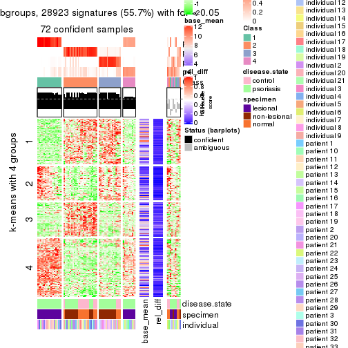</p>

</div>
<div id='tab-MAD-kmeans-get-signatures-4'>
<pre><code class="r">get_signatures(res, k = 5)
</code></pre>

<p></p>

</div>
<div id='tab-MAD-kmeans-get-signatures-5'>
<pre><code class="r">get_signatures(res, k = 6)
</code></pre>

<p></p>

</div>
</div>


Signature heatmaps where rows are not scaled:


<script>
$( function() {
	$( '#tabs-MAD-kmeans-get-signatures-no-scale' ).tabs();
} );
</script>
<div id='tabs-MAD-kmeans-get-signatures-no-scale'>
<ul>
<li><a href='#tab-MAD-kmeans-get-signatures-no-scale-1'>k = 2</a></li>
<li><a href='#tab-MAD-kmeans-get-signatures-no-scale-2'>k = 3</a></li>
<li><a href='#tab-MAD-kmeans-get-signatures-no-scale-3'>k = 4</a></li>
<li><a href='#tab-MAD-kmeans-get-signatures-no-scale-4'>k = 5</a></li>
<li><a href='#tab-MAD-kmeans-get-signatures-no-scale-5'>k = 6</a></li>
</ul>
<div id='tab-MAD-kmeans-get-signatures-no-scale-1'>
<pre><code class="r">get_signatures(res, k = 2, scale_rows = FALSE)
</code></pre>

<p></p>

</div>
<div id='tab-MAD-kmeans-get-signatures-no-scale-2'>
<pre><code class="r">get_signatures(res, k = 3, scale_rows = FALSE)
</code></pre>

<p></p>

</div>
<div id='tab-MAD-kmeans-get-signatures-no-scale-3'>
<pre><code class="r">get_signatures(res, k = 4, scale_rows = FALSE)
</code></pre>

<p></p>

</div>
<div id='tab-MAD-kmeans-get-signatures-no-scale-4'>
<pre><code class="r">get_signatures(res, k = 5, scale_rows = FALSE)
</code></pre>

<p></p>

</div>
<div id='tab-MAD-kmeans-get-signatures-no-scale-5'>
<pre><code class="r">get_signatures(res, k = 6, scale_rows = FALSE)
</code></pre>

<p></p>

</div>
</div>


Compare the overlap of signatures from different k:

```r
compare_signatures(res)
```


`get_signature()` returns a data frame invisibly. TO get the list of signatures, the function
call should be assigned to a variable explicitly. In following code, if `plot` argument is set
to `FALSE`, no heatmap is plotted while only the differential analysis is performed.

```r
# code only for demonstration
tb = get_signature(res, k = ..., plot = FALSE)
```

An example of the output of `tb` is:

```
#>   which_row         fdr    mean_1    mean_2 scaled_mean_1 scaled_mean_2 km
#> 1        38 0.042760348  8.373488  9.131774    -0.5533452     0.5164555  1
#> 2        40 0.018707592  7.106213  8.469186    -0.6173731     0.5762149  1
#> 3        55 0.019134737 10.221463 11.207825    -0.6159697     0.5749050  1
#> 4        59 0.006059896  5.921854  7.869574    -0.6899429     0.6439467  1
#> 5        60 0.018055526  8.928898 10.211722    -0.6204761     0.5791110  1
#> 6        98 0.009384629 15.714769 14.887706     0.6635654    -0.6193277  2
...
```

The columns in `tb` are:

1. `which_row`: row indices corresponding to the input matrix.
2. `fdr`: FDR for the differential test. 
3. `mean_x`: The mean value in group x.
4. `scaled_mean_x`: The mean value in group x after rows are scaled.
5. `km`: Row groups if k-means clustering is applied to rows.


UMAP plot which shows how samples are separated.


<script>
$( function() {
	$( '#tabs-MAD-kmeans-dimension-reduction' ).tabs();
} );
</script>
<div id='tabs-MAD-kmeans-dimension-reduction'>
<ul>
<li><a href='#tab-MAD-kmeans-dimension-reduction-1'>k = 2</a></li>
<li><a href='#tab-MAD-kmeans-dimension-reduction-2'>k = 3</a></li>
<li><a href='#tab-MAD-kmeans-dimension-reduction-3'>k = 4</a></li>
<li><a href='#tab-MAD-kmeans-dimension-reduction-4'>k = 5</a></li>
<li><a href='#tab-MAD-kmeans-dimension-reduction-5'>k = 6</a></li>
</ul>
<div id='tab-MAD-kmeans-dimension-reduction-1'>
<pre><code class="r">dimension_reduction(res, k = 2, method = &quot;UMAP&quot;)
</code></pre>

<p></p>

</div>
<div id='tab-MAD-kmeans-dimension-reduction-2'>
<pre><code class="r">dimension_reduction(res, k = 3, method = &quot;UMAP&quot;)
</code></pre>

<p></p>

</div>
<div id='tab-MAD-kmeans-dimension-reduction-3'>
<pre><code class="r">dimension_reduction(res, k = 4, method = &quot;UMAP&quot;)
</code></pre>

<p></p>

</div>
<div id='tab-MAD-kmeans-dimension-reduction-4'>
<pre><code class="r">dimension_reduction(res, k = 5, method = &quot;UMAP&quot;)
</code></pre>

<p></p>

</div>
<div id='tab-MAD-kmeans-dimension-reduction-5'>
<pre><code class="r">dimension_reduction(res, k = 6, method = &quot;UMAP&quot;)
</code></pre>

<p></p>

</div>
</div>


Following heatmap shows how subgroups are split when increasing `k`:

```r
collect_classes(res)
```


Test correlation between subgroups and known annotations. If the known
annotation is numeric, one-way ANOVA test is applied, and if the known
annotation is discrete, chi-squared contingency table test is applied.

```r
test_to_known_factors(res)
```

```
#>             n disease.state(p) specimen(p) individual(p) k
#> MAD:kmeans 82         3.35e-04    8.50e-17         0.999 2
#> MAD:kmeans 79         2.72e-05    6.42e-16         0.913 3
#> MAD:kmeans 72         2.73e-04    1.45e-14         0.891 4
#> MAD:kmeans 55         1.51e-05    1.01e-12         0.459 5
#> MAD:kmeans 69         4.00e-10    2.31e-20         0.520 6
```


If matrix rows can be associated to genes, consider to use `GO_Enrichment(res,
...)` to perform function enrichment for the signature genes.


 

---------------------------------------------------


### MAD:skmeans**


The object with results only for a single top-value method and a single partition method 
can be extracted as:

```r
res = res_list["MAD", "skmeans"]
# you can also extract it by
# res = res_list["MAD:skmeans"]
```

A summary of `res` and all the functions that can be applied to it:

```r
res
```

```
#> A 'ConsensusPartition' object with k = 2, 3, 4, 5, 6.
#>   On a matrix with 51941 rows and 82 columns.
#>   Top rows (1000, 2000, 3000, 4000, 5000) are extracted by 'MAD' method.
#>   Subgroups are detected by 'skmeans' method.
#>   Performed in total 1250 partitions by row resampling.
#>   Best k for subgroups seems to be 3.
#> 
#> Following methods can be applied to this 'ConsensusPartition' object:
#>  [1] "cola_report"             "collect_classes"         "collect_plots"          
#>  [4] "collect_stats"           "colnames"                "compare_signatures"     
#>  [7] "consensus_heatmap"       "dimension_reduction"     "functional_enrichment"  
#> [10] "get_anno_col"            "get_anno"                "get_classes"            
#> [13] "get_consensus"           "get_matrix"              "get_membership"         
#> [16] "get_param"               "get_signatures"          "get_stats"              
#> [19] "is_best_k"               "is_stable_k"             "membership_heatmap"     
#> [22] "ncol"                    "nrow"                    "plot_ecdf"              
#> [25] "rownames"                "select_partition_number" "show"                   
#> [28] "suggest_best_k"          "test_to_known_factors"
```

`collect_plots()` function collects all the plots made from `res` for all `k` (number of partitions)
into one single page to provide an easy and fast comparison between different `k`.

```r
collect_plots(res)
```


The plots are:

- The first row: a plot of the ECDF (Empirical cumulative distribution
  function) curves of the consensus matrix for each `k` and the heatmap of
  predicted classes for each `k`.
- The second row: heatmaps of the consensus matrix for each `k`.
- The third row: heatmaps of the membership matrix for each `k`.
- The fouth row: heatmaps of the signatures for each `k`.

All the plots in panels can be made by individual functions and they are
plotted later in this section.

`select_partition_number()` produces several plots showing different
statistics for choosing "optimized" `k`. There are following statistics:

- ECDF curves of the consensus matrix for each `k`;
- 1-PAC. [The PAC
  score](https://en.wikipedia.org/wiki/Consensus_clustering#Over-interpretation_potential_of_consensus_clustering)
  measures the proportion of the ambiguous subgrouping.
- Mean silhouette score.
- Concordance. The mean probability of fiting the consensus class ids in all
  partitions.
- Area increased. Denote $A_k$ as the area under the ECDF curve for current
  `k`, the area increased is defined as $A_k - A_{k-1}$.
- Rand index. The percent of pairs of samples that are both in a same cluster
  or both are not in a same cluster in the partition of k and k-1.
- Jaccard index. The ratio of pairs of samples are both in a same cluster in
  the partition of k and k-1 and the pairs of samples are both in a same
  cluster in the partition k or k-1.

The detailed explanations of these statistics can be found in [the cola
vignette](http://bioconductor.org/packages/devel/bioc/vignettes/cola/inst/doc/cola.html#toc_13).

Generally speaking, lower PAC score, higher mean silhouette score or higher
concordance corresponds to better partition. Rand index and Jaccard index
measure how similar the current partition is compared to partition with `k-1`.
If they are too similar, we won't accept `k` is better than `k-1`.

```r
select_partition_number(res)
```


The numeric values for all these statistics can be obtained by `get_stats()`.

```r
get_stats(res)
```

```
#>   k 1-PAC mean_silhouette concordance area_increased  Rand Jaccard
#> 2 2 1.000           0.985       0.995         0.4894 0.513   0.513
#> 3 3 1.000           0.969       0.987         0.3377 0.828   0.665
#> 4 4 0.888           0.882       0.933         0.1043 0.895   0.710
#> 5 5 0.808           0.659       0.824         0.0587 0.944   0.808
#> 6 6 0.769           0.732       0.826         0.0521 0.897   0.620
```

`suggest_best_k()` suggests the best $k$ based on these statistics. The rules are as follows:

- All $k$ with Jaccard index larger than 0.95 are removed because the increase of
  the partition number does not provides enough extra information. If all $k$ are removed,
  the best $k$ is assigned by `NA`.
- For $k$ with 1-PAC larger than 0.9, the maximal $k$ is taken as the "best k". Other $k$ is called "optional k".
- If it does not fit the second rule. The $k$ with the highest vote of highest
  1-PAC, mean silhouette and concordance is taken as the "best k".

```r
suggest_best_k(res)
```

```
#> [1] 3
#> attr(,"optional")
#> [1] 2
```

There is also optional best $k$ = 2 that is worth to check.

Following shows the table of the partitions (You need to click the **show/hide
code output** link to see it). The membership matrix (columns with name `p*`)
is inferred by
[`clue::cl_consensus()`](https://www.rdocumentation.org/link/cl_consensus?package=clue)
function with the `SE` method. Basically the value in the membership matrix
represents the probability to belong to a certain group. The finall class
label for an item is determined with the group with highest probability it
belongs to.

In `get_classes()` function, the entropy is calculated from the membership
matrix and the silhouette score is calculated from the consensus matrix.


<script>
$( function() {
	$( '#tabs-MAD-skmeans-get-classes' ).tabs();
} );
</script>
<div id='tabs-MAD-skmeans-get-classes'>
<ul>
<li><a href='#tab-MAD-skmeans-get-classes-1'>k = 2</a></li>
<li><a href='#tab-MAD-skmeans-get-classes-2'>k = 3</a></li>
<li><a href='#tab-MAD-skmeans-get-classes-3'>k = 4</a></li>
<li><a href='#tab-MAD-skmeans-get-classes-4'>k = 5</a></li>
<li><a href='#tab-MAD-skmeans-get-classes-5'>k = 6</a></li>
</ul>

<div id='tab-MAD-skmeans-get-classes-1'>
<p><a id='tab-MAD-skmeans-get-classes-1-a' style='color:#0366d6' href='#'>show/hide code output</a></p>
<pre><code class="r">cbind(get_classes(res, k = 2), get_membership(res, k = 2))
</code></pre>

<pre><code>#&gt;           class entropy silhouette    p1    p2
#&gt; GSM372286     2   0.000      0.991 0.000 1.000
#&gt; GSM372287     2   0.000      0.991 0.000 1.000
#&gt; GSM372288     2   0.000      0.991 0.000 1.000
#&gt; GSM372289     2   0.000      0.991 0.000 1.000
#&gt; GSM372290     2   0.000      0.991 0.000 1.000
#&gt; GSM372291     1   0.000      1.000 1.000 0.000
#&gt; GSM372292     2   0.000      0.991 0.000 1.000
#&gt; GSM372293     2   0.000      0.991 0.000 1.000
#&gt; GSM372294     2   0.000      0.991 0.000 1.000
#&gt; GSM372295     2   0.000      0.991 0.000 1.000
#&gt; GSM372296     2   0.000      0.991 0.000 1.000
#&gt; GSM372297     2   0.000      0.991 0.000 1.000
#&gt; GSM372298     2   0.000      0.991 0.000 1.000
#&gt; GSM372299     2   0.000      0.991 0.000 1.000
#&gt; GSM372300     2   0.000      0.991 0.000 1.000
#&gt; GSM372301     2   0.000      0.991 0.000 1.000
#&gt; GSM372302     2   0.000      0.991 0.000 1.000
#&gt; GSM372303     2   0.000      0.991 0.000 1.000
#&gt; GSM372304     2   0.000      0.991 0.000 1.000
#&gt; GSM372305     2   0.000      0.991 0.000 1.000
#&gt; GSM372306     2   0.000      0.991 0.000 1.000
#&gt; GSM372307     2   0.000      0.991 0.000 1.000
#&gt; GSM372309     2   0.000      0.991 0.000 1.000
#&gt; GSM372311     2   0.000      0.991 0.000 1.000
#&gt; GSM372313     2   0.000      0.991 0.000 1.000
#&gt; GSM372315     2   0.000      0.991 0.000 1.000
#&gt; GSM372317     2   0.000      0.991 0.000 1.000
#&gt; GSM372319     2   0.000      0.991 0.000 1.000
#&gt; GSM372321     2   0.000      0.991 0.000 1.000
#&gt; GSM372323     2   0.000      0.991 0.000 1.000
#&gt; GSM372326     2   0.000      0.991 0.000 1.000
#&gt; GSM372328     2   0.000      0.991 0.000 1.000
#&gt; GSM372330     2   0.000      0.991 0.000 1.000
#&gt; GSM372332     2   0.000      0.991 0.000 1.000
#&gt; GSM372335     2   0.000      0.991 0.000 1.000
#&gt; GSM372337     2   0.000      0.991 0.000 1.000
#&gt; GSM372339     2   0.000      0.991 0.000 1.000
#&gt; GSM372341     2   0.000      0.991 0.000 1.000
#&gt; GSM372343     2   0.000      0.991 0.000 1.000
#&gt; GSM372345     2   0.000      0.991 0.000 1.000
#&gt; GSM372347     2   0.000      0.991 0.000 1.000
#&gt; GSM372349     2   0.000      0.991 0.000 1.000
#&gt; GSM372351     2   0.000      0.991 0.000 1.000
#&gt; GSM372353     2   0.000      0.991 0.000 1.000
#&gt; GSM372355     2   0.000      0.991 0.000 1.000
#&gt; GSM372357     2   0.000      0.991 0.000 1.000
#&gt; GSM372359     2   0.000      0.991 0.000 1.000
#&gt; GSM372361     2   0.000      0.991 0.000 1.000
#&gt; GSM372363     2   0.000      0.991 0.000 1.000
#&gt; GSM372308     1   0.000      1.000 1.000 0.000
#&gt; GSM372310     1   0.000      1.000 1.000 0.000
#&gt; GSM372312     1   0.000      1.000 1.000 0.000
#&gt; GSM372314     1   0.000      1.000 1.000 0.000
#&gt; GSM372316     1   0.000      1.000 1.000 0.000
#&gt; GSM372318     1   0.000      1.000 1.000 0.000
#&gt; GSM372320     1   0.000      1.000 1.000 0.000
#&gt; GSM372322     1   0.000      1.000 1.000 0.000
#&gt; GSM372324     1   0.000      1.000 1.000 0.000
#&gt; GSM372325     1   0.000      1.000 1.000 0.000
#&gt; GSM372327     1   0.000      1.000 1.000 0.000
#&gt; GSM372329     1   0.000      1.000 1.000 0.000
#&gt; GSM372331     1   0.000      1.000 1.000 0.000
#&gt; GSM372333     1   0.000      1.000 1.000 0.000
#&gt; GSM372334     1   0.000      1.000 1.000 0.000
#&gt; GSM372336     1   0.000      1.000 1.000 0.000
#&gt; GSM372338     1   0.000      1.000 1.000 0.000
#&gt; GSM372340     1   0.000      1.000 1.000 0.000
#&gt; GSM372342     1   0.000      1.000 1.000 0.000
#&gt; GSM372344     1   0.000      1.000 1.000 0.000
#&gt; GSM372346     1   0.000      1.000 1.000 0.000
#&gt; GSM372348     1   0.000      1.000 1.000 0.000
#&gt; GSM372350     1   0.000      1.000 1.000 0.000
#&gt; GSM372352     2   0.988      0.227 0.436 0.564
#&gt; GSM372354     1   0.000      1.000 1.000 0.000
#&gt; GSM372356     1   0.000      1.000 1.000 0.000
#&gt; GSM372358     1   0.000      1.000 1.000 0.000
#&gt; GSM372360     1   0.000      1.000 1.000 0.000
#&gt; GSM372362     1   0.000      1.000 1.000 0.000
#&gt; GSM372364     1   0.000      1.000 1.000 0.000
#&gt; GSM372365     1   0.000      1.000 1.000 0.000
#&gt; GSM372366     1   0.000      1.000 1.000 0.000
#&gt; GSM372367     1   0.000      1.000 1.000 0.000
</code></pre>

<script>
$('#tab-MAD-skmeans-get-classes-1-a').parent().next().next().hide();
$('#tab-MAD-skmeans-get-classes-1-a').click(function(){
  $('#tab-MAD-skmeans-get-classes-1-a').parent().next().next().toggle();
  return(false);
});
</script>
</div>

<div id='tab-MAD-skmeans-get-classes-2'>
<p><a id='tab-MAD-skmeans-get-classes-2-a' style='color:#0366d6' href='#'>show/hide code output</a></p>
<pre><code class="r">cbind(get_classes(res, k = 3), get_membership(res, k = 3))
</code></pre>

<pre><code>#&gt;           class entropy silhouette    p1    p2    p3
#&gt; GSM372286     2  0.0000      1.000 0.000 1.000 0.000
#&gt; GSM372287     2  0.0000      1.000 0.000 1.000 0.000
#&gt; GSM372288     2  0.0000      1.000 0.000 1.000 0.000
#&gt; GSM372289     2  0.0000      1.000 0.000 1.000 0.000
#&gt; GSM372290     2  0.0000      1.000 0.000 1.000 0.000
#&gt; GSM372291     1  0.0000      1.000 1.000 0.000 0.000
#&gt; GSM372292     2  0.0000      1.000 0.000 1.000 0.000
#&gt; GSM372293     3  0.0237      0.938 0.000 0.004 0.996
#&gt; GSM372294     2  0.0000      1.000 0.000 1.000 0.000
#&gt; GSM372295     2  0.0000      1.000 0.000 1.000 0.000
#&gt; GSM372296     2  0.0000      1.000 0.000 1.000 0.000
#&gt; GSM372297     2  0.0000      1.000 0.000 1.000 0.000
#&gt; GSM372298     2  0.0000      1.000 0.000 1.000 0.000
#&gt; GSM372299     2  0.0000      1.000 0.000 1.000 0.000
#&gt; GSM372300     3  0.3816      0.806 0.000 0.148 0.852
#&gt; GSM372301     3  0.6274      0.229 0.000 0.456 0.544
#&gt; GSM372302     2  0.0000      1.000 0.000 1.000 0.000
#&gt; GSM372303     3  0.0000      0.941 0.000 0.000 1.000
#&gt; GSM372304     2  0.0000      1.000 0.000 1.000 0.000
#&gt; GSM372305     2  0.0000      1.000 0.000 1.000 0.000
#&gt; GSM372306     2  0.0000      1.000 0.000 1.000 0.000
#&gt; GSM372307     2  0.0000      1.000 0.000 1.000 0.000
#&gt; GSM372309     2  0.0000      1.000 0.000 1.000 0.000
#&gt; GSM372311     2  0.0000      1.000 0.000 1.000 0.000
#&gt; GSM372313     2  0.0000      1.000 0.000 1.000 0.000
#&gt; GSM372315     2  0.0000      1.000 0.000 1.000 0.000
#&gt; GSM372317     2  0.0000      1.000 0.000 1.000 0.000
#&gt; GSM372319     2  0.0000      1.000 0.000 1.000 0.000
#&gt; GSM372321     3  0.0000      0.941 0.000 0.000 1.000
#&gt; GSM372323     3  0.0000      0.941 0.000 0.000 1.000
#&gt; GSM372326     3  0.0000      0.941 0.000 0.000 1.000
#&gt; GSM372328     3  0.0000      0.941 0.000 0.000 1.000
#&gt; GSM372330     2  0.0000      1.000 0.000 1.000 0.000
#&gt; GSM372332     3  0.0000      0.941 0.000 0.000 1.000
#&gt; GSM372335     2  0.0000      1.000 0.000 1.000 0.000
#&gt; GSM372337     3  0.0000      0.941 0.000 0.000 1.000
#&gt; GSM372339     3  0.0000      0.941 0.000 0.000 1.000
#&gt; GSM372341     3  0.0000      0.941 0.000 0.000 1.000
#&gt; GSM372343     3  0.0000      0.941 0.000 0.000 1.000
#&gt; GSM372345     3  0.0000      0.941 0.000 0.000 1.000
#&gt; GSM372347     3  0.0000      0.941 0.000 0.000 1.000
#&gt; GSM372349     3  0.0000      0.941 0.000 0.000 1.000
#&gt; GSM372351     3  0.0000      0.941 0.000 0.000 1.000
#&gt; GSM372353     3  0.6140      0.373 0.000 0.404 0.596
#&gt; GSM372355     2  0.0000      1.000 0.000 1.000 0.000
#&gt; GSM372357     2  0.0000      1.000 0.000 1.000 0.000
#&gt; GSM372359     2  0.0000      1.000 0.000 1.000 0.000
#&gt; GSM372361     2  0.0000      1.000 0.000 1.000 0.000
#&gt; GSM372363     2  0.0000      1.000 0.000 1.000 0.000
#&gt; GSM372308     1  0.0000      1.000 1.000 0.000 0.000
#&gt; GSM372310     1  0.0000      1.000 1.000 0.000 0.000
#&gt; GSM372312     1  0.0000      1.000 1.000 0.000 0.000
#&gt; GSM372314     1  0.0000      1.000 1.000 0.000 0.000
#&gt; GSM372316     1  0.0000      1.000 1.000 0.000 0.000
#&gt; GSM372318     1  0.0000      1.000 1.000 0.000 0.000
#&gt; GSM372320     1  0.0000      1.000 1.000 0.000 0.000
#&gt; GSM372322     1  0.0000      1.000 1.000 0.000 0.000
#&gt; GSM372324     1  0.0000      1.000 1.000 0.000 0.000
#&gt; GSM372325     1  0.0000      1.000 1.000 0.000 0.000
#&gt; GSM372327     1  0.0000      1.000 1.000 0.000 0.000
#&gt; GSM372329     1  0.0000      1.000 1.000 0.000 0.000
#&gt; GSM372331     1  0.0000      1.000 1.000 0.000 0.000
#&gt; GSM372333     1  0.0000      1.000 1.000 0.000 0.000
#&gt; GSM372334     1  0.0000      1.000 1.000 0.000 0.000
#&gt; GSM372336     1  0.0000      1.000 1.000 0.000 0.000
#&gt; GSM372338     1  0.0000      1.000 1.000 0.000 0.000
#&gt; GSM372340     1  0.0000      1.000 1.000 0.000 0.000
#&gt; GSM372342     1  0.0000      1.000 1.000 0.000 0.000
#&gt; GSM372344     1  0.0000      1.000 1.000 0.000 0.000
#&gt; GSM372346     1  0.0000      1.000 1.000 0.000 0.000
#&gt; GSM372348     1  0.0000      1.000 1.000 0.000 0.000
#&gt; GSM372350     1  0.0000      1.000 1.000 0.000 0.000
#&gt; GSM372352     3  0.1525      0.914 0.032 0.004 0.964
#&gt; GSM372354     1  0.0000      1.000 1.000 0.000 0.000
#&gt; GSM372356     1  0.0000      1.000 1.000 0.000 0.000
#&gt; GSM372358     1  0.0000      1.000 1.000 0.000 0.000
#&gt; GSM372360     1  0.0000      1.000 1.000 0.000 0.000
#&gt; GSM372362     1  0.0000      1.000 1.000 0.000 0.000
#&gt; GSM372364     1  0.0000      1.000 1.000 0.000 0.000
#&gt; GSM372365     1  0.0000      1.000 1.000 0.000 0.000
#&gt; GSM372366     1  0.0000      1.000 1.000 0.000 0.000
#&gt; GSM372367     1  0.0000      1.000 1.000 0.000 0.000
</code></pre>

<script>
$('#tab-MAD-skmeans-get-classes-2-a').parent().next().next().hide();
$('#tab-MAD-skmeans-get-classes-2-a').click(function(){
  $('#tab-MAD-skmeans-get-classes-2-a').parent().next().next().toggle();
  return(false);
});
</script>
</div>

<div id='tab-MAD-skmeans-get-classes-3'>
<p><a id='tab-MAD-skmeans-get-classes-3-a' style='color:#0366d6' href='#'>show/hide code output</a></p>
<pre><code class="r">cbind(get_classes(res, k = 4), get_membership(res, k = 4))
</code></pre>

<pre><code>#&gt;           class entropy silhouette    p1    p2    p3    p4
#&gt; GSM372286     2  0.1302      0.858 0.000 0.956 0.000 0.044
#&gt; GSM372287     4  0.3764      0.801 0.000 0.216 0.000 0.784
#&gt; GSM372288     2  0.4356      0.584 0.000 0.708 0.000 0.292
#&gt; GSM372289     2  0.2011      0.839 0.000 0.920 0.000 0.080
#&gt; GSM372290     2  0.4477      0.547 0.000 0.688 0.000 0.312
#&gt; GSM372291     4  0.3074      0.730 0.152 0.000 0.000 0.848
#&gt; GSM372292     4  0.2610      0.865 0.000 0.088 0.012 0.900
#&gt; GSM372293     4  0.3311      0.764 0.000 0.000 0.172 0.828
#&gt; GSM372294     2  0.4776      0.457 0.000 0.624 0.000 0.376
#&gt; GSM372295     4  0.2868      0.849 0.000 0.136 0.000 0.864
#&gt; GSM372296     2  0.4713      0.441 0.000 0.640 0.000 0.360
#&gt; GSM372297     4  0.3356      0.838 0.000 0.176 0.000 0.824
#&gt; GSM372298     4  0.2704      0.859 0.000 0.124 0.000 0.876
#&gt; GSM372299     4  0.2610      0.865 0.000 0.088 0.012 0.900
#&gt; GSM372300     4  0.2944      0.811 0.000 0.004 0.128 0.868
#&gt; GSM372301     4  0.3037      0.849 0.000 0.036 0.076 0.888
#&gt; GSM372302     4  0.3688      0.812 0.000 0.208 0.000 0.792
#&gt; GSM372303     4  0.2814      0.806 0.000 0.000 0.132 0.868
#&gt; GSM372304     4  0.3688      0.812 0.000 0.208 0.000 0.792
#&gt; GSM372305     2  0.0000      0.871 0.000 1.000 0.000 0.000
#&gt; GSM372306     2  0.0000      0.871 0.000 1.000 0.000 0.000
#&gt; GSM372307     2  0.1940      0.842 0.000 0.924 0.000 0.076
#&gt; GSM372309     2  0.0000      0.871 0.000 1.000 0.000 0.000
#&gt; GSM372311     2  0.0000      0.871 0.000 1.000 0.000 0.000
#&gt; GSM372313     2  0.0000      0.871 0.000 1.000 0.000 0.000
#&gt; GSM372315     2  0.0707      0.867 0.000 0.980 0.000 0.020
#&gt; GSM372317     2  0.0000      0.871 0.000 1.000 0.000 0.000
#&gt; GSM372319     2  0.5386      0.432 0.000 0.612 0.368 0.020
#&gt; GSM372321     3  0.0000      0.951 0.000 0.000 1.000 0.000
#&gt; GSM372323     3  0.0000      0.951 0.000 0.000 1.000 0.000
#&gt; GSM372326     3  0.0000      0.951 0.000 0.000 1.000 0.000
#&gt; GSM372328     3  0.0000      0.951 0.000 0.000 1.000 0.000
#&gt; GSM372330     2  0.0000      0.871 0.000 1.000 0.000 0.000
#&gt; GSM372332     3  0.0000      0.951 0.000 0.000 1.000 0.000
#&gt; GSM372335     2  0.0469      0.865 0.000 0.988 0.000 0.012
#&gt; GSM372337     3  0.0188      0.949 0.000 0.000 0.996 0.004
#&gt; GSM372339     3  0.0000      0.951 0.000 0.000 1.000 0.000
#&gt; GSM372341     3  0.0000      0.951 0.000 0.000 1.000 0.000
#&gt; GSM372343     3  0.0000      0.951 0.000 0.000 1.000 0.000
#&gt; GSM372345     3  0.0188      0.949 0.000 0.000 0.996 0.004
#&gt; GSM372347     3  0.3958      0.819 0.000 0.112 0.836 0.052
#&gt; GSM372349     3  0.1302      0.920 0.000 0.000 0.956 0.044
#&gt; GSM372351     3  0.0000      0.951 0.000 0.000 1.000 0.000
#&gt; GSM372353     2  0.5478      0.541 0.000 0.696 0.248 0.056
#&gt; GSM372355     2  0.0000      0.871 0.000 1.000 0.000 0.000
#&gt; GSM372357     2  0.0000      0.871 0.000 1.000 0.000 0.000
#&gt; GSM372359     2  0.1557      0.834 0.000 0.944 0.000 0.056
#&gt; GSM372361     2  0.2216      0.830 0.000 0.908 0.000 0.092
#&gt; GSM372363     2  0.0592      0.868 0.000 0.984 0.000 0.016
#&gt; GSM372308     1  0.0000      0.987 1.000 0.000 0.000 0.000
#&gt; GSM372310     1  0.0000      0.987 1.000 0.000 0.000 0.000
#&gt; GSM372312     1  0.1389      0.959 0.952 0.000 0.000 0.048
#&gt; GSM372314     1  0.1389      0.959 0.952 0.000 0.000 0.048
#&gt; GSM372316     1  0.0000      0.987 1.000 0.000 0.000 0.000
#&gt; GSM372318     1  0.0336      0.986 0.992 0.000 0.000 0.008
#&gt; GSM372320     1  0.0336      0.986 0.992 0.000 0.000 0.008
#&gt; GSM372322     1  0.0336      0.986 0.992 0.000 0.000 0.008
#&gt; GSM372324     1  0.1389      0.959 0.952 0.000 0.000 0.048
#&gt; GSM372325     1  0.1474      0.957 0.948 0.000 0.000 0.052
#&gt; GSM372327     1  0.0336      0.986 0.992 0.000 0.000 0.008
#&gt; GSM372329     1  0.0336      0.986 0.992 0.000 0.000 0.008
#&gt; GSM372331     1  0.1389      0.959 0.952 0.000 0.000 0.048
#&gt; GSM372333     1  0.2060      0.944 0.932 0.000 0.016 0.052
#&gt; GSM372334     1  0.0336      0.986 0.992 0.000 0.000 0.008
#&gt; GSM372336     1  0.0000      0.987 1.000 0.000 0.000 0.000
#&gt; GSM372338     1  0.0336      0.986 0.992 0.000 0.000 0.008
#&gt; GSM372340     1  0.0336      0.986 0.992 0.000 0.000 0.008
#&gt; GSM372342     1  0.0336      0.986 0.992 0.000 0.000 0.008
#&gt; GSM372344     1  0.0336      0.986 0.992 0.000 0.000 0.008
#&gt; GSM372346     1  0.0000      0.987 1.000 0.000 0.000 0.000
#&gt; GSM372348     1  0.0000      0.987 1.000 0.000 0.000 0.000
#&gt; GSM372350     1  0.1389      0.959 0.952 0.000 0.000 0.048
#&gt; GSM372352     3  0.6951      0.462 0.008 0.304 0.576 0.112
#&gt; GSM372354     1  0.0000      0.987 1.000 0.000 0.000 0.000
#&gt; GSM372356     1  0.0000      0.987 1.000 0.000 0.000 0.000
#&gt; GSM372358     1  0.0000      0.987 1.000 0.000 0.000 0.000
#&gt; GSM372360     1  0.0000      0.987 1.000 0.000 0.000 0.000
#&gt; GSM372362     1  0.0000      0.987 1.000 0.000 0.000 0.000
#&gt; GSM372364     1  0.0000      0.987 1.000 0.000 0.000 0.000
#&gt; GSM372365     1  0.0000      0.987 1.000 0.000 0.000 0.000
#&gt; GSM372366     1  0.0000      0.987 1.000 0.000 0.000 0.000
#&gt; GSM372367     1  0.0000      0.987 1.000 0.000 0.000 0.000
</code></pre>

<script>
$('#tab-MAD-skmeans-get-classes-3-a').parent().next().next().hide();
$('#tab-MAD-skmeans-get-classes-3-a').click(function(){
  $('#tab-MAD-skmeans-get-classes-3-a').parent().next().next().toggle();
  return(false);
});
</script>
</div>

<div id='tab-MAD-skmeans-get-classes-4'>
<p><a id='tab-MAD-skmeans-get-classes-4-a' style='color:#0366d6' href='#'>show/hide code output</a></p>
<pre><code class="r">cbind(get_classes(res, k = 5), get_membership(res, k = 5))
</code></pre>

<pre><code>#&gt;           class entropy silhouette    p1    p2    p3    p4    p5
#&gt; GSM372286     2  0.4651     0.1756 0.000 0.608 0.000 0.020 0.372
#&gt; GSM372287     5  0.6102     0.1269 0.000 0.124 0.000 0.436 0.440
#&gt; GSM372288     5  0.6363     0.3949 0.000 0.392 0.000 0.164 0.444
#&gt; GSM372289     2  0.5396    -0.1573 0.000 0.500 0.000 0.056 0.444
#&gt; GSM372290     5  0.6510     0.4680 0.000 0.360 0.000 0.196 0.444
#&gt; GSM372291     4  0.5037     0.4221 0.088 0.000 0.000 0.684 0.228
#&gt; GSM372292     4  0.0451     0.6359 0.000 0.008 0.000 0.988 0.004
#&gt; GSM372293     4  0.1341     0.6247 0.000 0.000 0.056 0.944 0.000
#&gt; GSM372294     5  0.5784     0.4198 0.000 0.176 0.000 0.208 0.616
#&gt; GSM372295     5  0.4588     0.0549 0.000 0.016 0.000 0.380 0.604
#&gt; GSM372296     5  0.6655     0.4948 0.000 0.296 0.000 0.260 0.444
#&gt; GSM372297     4  0.5733    -0.2108 0.000 0.084 0.000 0.476 0.440
#&gt; GSM372298     4  0.4622     0.3090 0.000 0.044 0.000 0.692 0.264
#&gt; GSM372299     4  0.1408     0.6218 0.000 0.008 0.000 0.948 0.044
#&gt; GSM372300     4  0.0963     0.6377 0.000 0.000 0.036 0.964 0.000
#&gt; GSM372301     4  0.0510     0.6401 0.000 0.000 0.016 0.984 0.000
#&gt; GSM372302     4  0.6037    -0.2930 0.000 0.116 0.000 0.444 0.440
#&gt; GSM372303     4  0.1121     0.6341 0.000 0.000 0.044 0.956 0.000
#&gt; GSM372304     4  0.6037    -0.2930 0.000 0.116 0.000 0.444 0.440
#&gt; GSM372305     2  0.0000     0.7264 0.000 1.000 0.000 0.000 0.000
#&gt; GSM372306     2  0.0000     0.7264 0.000 1.000 0.000 0.000 0.000
#&gt; GSM372307     2  0.5381    -0.1066 0.000 0.516 0.000 0.056 0.428
#&gt; GSM372309     2  0.0290     0.7230 0.000 0.992 0.000 0.000 0.008
#&gt; GSM372311     2  0.0162     0.7262 0.000 0.996 0.000 0.000 0.004
#&gt; GSM372313     2  0.0000     0.7264 0.000 1.000 0.000 0.000 0.000
#&gt; GSM372315     2  0.4252     0.3722 0.000 0.700 0.000 0.020 0.280
#&gt; GSM372317     2  0.0162     0.7262 0.000 0.996 0.000 0.000 0.004
#&gt; GSM372319     3  0.5025     0.5331 0.000 0.236 0.700 0.024 0.040
#&gt; GSM372321     3  0.0000     0.9493 0.000 0.000 1.000 0.000 0.000
#&gt; GSM372323     3  0.0000     0.9493 0.000 0.000 1.000 0.000 0.000
#&gt; GSM372326     3  0.0000     0.9493 0.000 0.000 1.000 0.000 0.000
#&gt; GSM372328     3  0.0000     0.9493 0.000 0.000 1.000 0.000 0.000
#&gt; GSM372330     2  0.0162     0.7262 0.000 0.996 0.000 0.000 0.004
#&gt; GSM372332     3  0.0000     0.9493 0.000 0.000 1.000 0.000 0.000
#&gt; GSM372335     2  0.0162     0.7262 0.000 0.996 0.000 0.000 0.004
#&gt; GSM372337     3  0.0404     0.9444 0.000 0.000 0.988 0.000 0.012
#&gt; GSM372339     3  0.0000     0.9493 0.000 0.000 1.000 0.000 0.000
#&gt; GSM372341     3  0.0000     0.9493 0.000 0.000 1.000 0.000 0.000
#&gt; GSM372343     3  0.0000     0.9493 0.000 0.000 1.000 0.000 0.000
#&gt; GSM372345     3  0.0404     0.9444 0.000 0.000 0.988 0.000 0.012
#&gt; GSM372347     2  0.6701     0.0275 0.000 0.428 0.300 0.000 0.272
#&gt; GSM372349     3  0.3246     0.7878 0.000 0.000 0.808 0.008 0.184
#&gt; GSM372351     3  0.1121     0.9184 0.000 0.000 0.956 0.044 0.000
#&gt; GSM372353     2  0.3184     0.5750 0.000 0.852 0.100 0.048 0.000
#&gt; GSM372355     2  0.0000     0.7264 0.000 1.000 0.000 0.000 0.000
#&gt; GSM372357     2  0.0000     0.7264 0.000 1.000 0.000 0.000 0.000
#&gt; GSM372359     2  0.0510     0.7131 0.000 0.984 0.000 0.016 0.000
#&gt; GSM372361     2  0.5529    -0.1347 0.000 0.512 0.000 0.068 0.420
#&gt; GSM372363     2  0.4151     0.2820 0.000 0.652 0.000 0.004 0.344
#&gt; GSM372308     1  0.1908     0.8978 0.908 0.000 0.000 0.000 0.092
#&gt; GSM372310     1  0.1792     0.9010 0.916 0.000 0.000 0.000 0.084
#&gt; GSM372312     1  0.4165     0.6918 0.672 0.000 0.000 0.008 0.320
#&gt; GSM372314     1  0.3966     0.7141 0.664 0.000 0.000 0.000 0.336
#&gt; GSM372316     1  0.0162     0.9138 0.996 0.000 0.000 0.000 0.004
#&gt; GSM372318     1  0.0794     0.9110 0.972 0.000 0.000 0.000 0.028
#&gt; GSM372320     1  0.0794     0.9110 0.972 0.000 0.000 0.000 0.028
#&gt; GSM372322     1  0.0794     0.9110 0.972 0.000 0.000 0.000 0.028
#&gt; GSM372324     1  0.3636     0.7487 0.728 0.000 0.000 0.000 0.272
#&gt; GSM372325     1  0.3857     0.7105 0.688 0.000 0.000 0.000 0.312
#&gt; GSM372327     1  0.0794     0.9110 0.972 0.000 0.000 0.000 0.028
#&gt; GSM372329     1  0.0794     0.9110 0.972 0.000 0.000 0.000 0.028
#&gt; GSM372331     1  0.3966     0.7141 0.664 0.000 0.000 0.000 0.336
#&gt; GSM372333     1  0.4437     0.6876 0.664 0.000 0.020 0.000 0.316
#&gt; GSM372334     1  0.0794     0.9110 0.972 0.000 0.000 0.000 0.028
#&gt; GSM372336     1  0.1197     0.9122 0.952 0.000 0.000 0.000 0.048
#&gt; GSM372338     1  0.0794     0.9110 0.972 0.000 0.000 0.000 0.028
#&gt; GSM372340     1  0.0794     0.9110 0.972 0.000 0.000 0.000 0.028
#&gt; GSM372342     1  0.0794     0.9110 0.972 0.000 0.000 0.000 0.028
#&gt; GSM372344     1  0.0794     0.9110 0.972 0.000 0.000 0.000 0.028
#&gt; GSM372346     1  0.0000     0.9136 1.000 0.000 0.000 0.000 0.000
#&gt; GSM372348     1  0.0963     0.9110 0.964 0.000 0.000 0.000 0.036
#&gt; GSM372350     1  0.3421     0.7631 0.788 0.000 0.000 0.008 0.204
#&gt; GSM372352     5  0.7288    -0.1374 0.000 0.368 0.132 0.064 0.436
#&gt; GSM372354     1  0.0963     0.9129 0.964 0.000 0.000 0.000 0.036
#&gt; GSM372356     1  0.1197     0.9116 0.952 0.000 0.000 0.000 0.048
#&gt; GSM372358     1  0.1197     0.9116 0.952 0.000 0.000 0.000 0.048
#&gt; GSM372360     1  0.1197     0.9116 0.952 0.000 0.000 0.000 0.048
#&gt; GSM372362     1  0.0880     0.9127 0.968 0.000 0.000 0.000 0.032
#&gt; GSM372364     1  0.1197     0.9116 0.952 0.000 0.000 0.000 0.048
#&gt; GSM372365     1  0.1197     0.9116 0.952 0.000 0.000 0.000 0.048
#&gt; GSM372366     1  0.0963     0.9129 0.964 0.000 0.000 0.000 0.036
#&gt; GSM372367     1  0.1270     0.9110 0.948 0.000 0.000 0.000 0.052
</code></pre>

<script>
$('#tab-MAD-skmeans-get-classes-4-a').parent().next().next().hide();
$('#tab-MAD-skmeans-get-classes-4-a').click(function(){
  $('#tab-MAD-skmeans-get-classes-4-a').parent().next().next().toggle();
  return(false);
});
</script>
</div>

<div id='tab-MAD-skmeans-get-classes-5'>
<p><a id='tab-MAD-skmeans-get-classes-5-a' style='color:#0366d6' href='#'>show/hide code output</a></p>
<pre><code class="r">cbind(get_classes(res, k = 6), get_membership(res, k = 6))
</code></pre>

<pre><code>#&gt;           class entropy silhouette    p1    p2    p3    p4    p5    p6
#&gt; GSM372286     4  0.3823     0.4357 0.000 0.436 0.000 0.564 0.000 0.000
#&gt; GSM372287     4  0.3520     0.7637 0.000 0.100 0.000 0.804 0.000 0.096
#&gt; GSM372288     4  0.3110     0.7762 0.000 0.196 0.000 0.792 0.000 0.012
#&gt; GSM372289     4  0.3428     0.6770 0.000 0.304 0.000 0.696 0.000 0.000
#&gt; GSM372290     4  0.3236     0.7814 0.000 0.180 0.000 0.796 0.000 0.024
#&gt; GSM372291     6  0.7542     0.1481 0.220 0.000 0.000 0.196 0.216 0.368
#&gt; GSM372292     6  0.2048     0.8760 0.000 0.000 0.000 0.120 0.000 0.880
#&gt; GSM372293     6  0.2212     0.8758 0.000 0.000 0.008 0.112 0.000 0.880
#&gt; GSM372294     4  0.2859     0.5642 0.000 0.028 0.000 0.856 0.108 0.008
#&gt; GSM372295     4  0.2680     0.5312 0.000 0.000 0.000 0.860 0.108 0.032
#&gt; GSM372296     4  0.3532     0.7786 0.000 0.140 0.000 0.796 0.000 0.064
#&gt; GSM372297     4  0.3453     0.7263 0.000 0.064 0.000 0.804 0.000 0.132
#&gt; GSM372298     4  0.4400     0.3173 0.000 0.032 0.000 0.592 0.000 0.376
#&gt; GSM372299     6  0.2743     0.8289 0.000 0.000 0.000 0.164 0.008 0.828
#&gt; GSM372300     6  0.2146     0.8768 0.000 0.000 0.004 0.116 0.000 0.880
#&gt; GSM372301     6  0.2048     0.8760 0.000 0.000 0.000 0.120 0.000 0.880
#&gt; GSM372302     4  0.3520     0.7637 0.000 0.100 0.000 0.804 0.000 0.096
#&gt; GSM372303     6  0.2212     0.8758 0.000 0.000 0.008 0.112 0.000 0.880
#&gt; GSM372304     4  0.3520     0.7605 0.000 0.096 0.000 0.804 0.000 0.100
#&gt; GSM372305     2  0.0363     0.9054 0.000 0.988 0.000 0.012 0.000 0.000
#&gt; GSM372306     2  0.0146     0.9056 0.000 0.996 0.000 0.000 0.004 0.000
#&gt; GSM372307     4  0.3446     0.6738 0.000 0.308 0.000 0.692 0.000 0.000
#&gt; GSM372309     2  0.0363     0.9027 0.000 0.988 0.000 0.012 0.000 0.000
#&gt; GSM372311     2  0.0713     0.8933 0.000 0.972 0.000 0.028 0.000 0.000
#&gt; GSM372313     2  0.0146     0.9069 0.000 0.996 0.000 0.004 0.000 0.000
#&gt; GSM372315     2  0.3804    -0.0343 0.000 0.576 0.000 0.424 0.000 0.000
#&gt; GSM372317     2  0.0260     0.9071 0.000 0.992 0.000 0.008 0.000 0.000
#&gt; GSM372319     3  0.3767     0.7025 0.000 0.132 0.780 0.088 0.000 0.000
#&gt; GSM372321     3  0.0000     0.9389 0.000 0.000 1.000 0.000 0.000 0.000
#&gt; GSM372323     3  0.0291     0.9371 0.000 0.000 0.992 0.000 0.004 0.004
#&gt; GSM372326     3  0.0000     0.9389 0.000 0.000 1.000 0.000 0.000 0.000
#&gt; GSM372328     3  0.0000     0.9389 0.000 0.000 1.000 0.000 0.000 0.000
#&gt; GSM372330     2  0.0260     0.9071 0.000 0.992 0.000 0.008 0.000 0.000
#&gt; GSM372332     3  0.0260     0.9372 0.000 0.000 0.992 0.000 0.000 0.008
#&gt; GSM372335     2  0.0291     0.9037 0.000 0.992 0.000 0.000 0.004 0.004
#&gt; GSM372337     3  0.0777     0.9284 0.000 0.000 0.972 0.004 0.024 0.000
#&gt; GSM372339     3  0.0000     0.9389 0.000 0.000 1.000 0.000 0.000 0.000
#&gt; GSM372341     3  0.0000     0.9389 0.000 0.000 1.000 0.000 0.000 0.000
#&gt; GSM372343     3  0.0000     0.9389 0.000 0.000 1.000 0.000 0.000 0.000
#&gt; GSM372345     3  0.1003     0.9251 0.000 0.000 0.964 0.004 0.028 0.004
#&gt; GSM372347     5  0.5870     0.0996 0.000 0.384 0.092 0.008 0.496 0.020
#&gt; GSM372349     3  0.5193     0.5675 0.000 0.000 0.644 0.176 0.172 0.008
#&gt; GSM372351     3  0.1082     0.9111 0.000 0.000 0.956 0.004 0.000 0.040
#&gt; GSM372353     2  0.2414     0.8070 0.000 0.896 0.036 0.000 0.012 0.056
#&gt; GSM372355     2  0.0260     0.9071 0.000 0.992 0.000 0.008 0.000 0.000
#&gt; GSM372357     2  0.0146     0.9056 0.000 0.996 0.000 0.000 0.004 0.000
#&gt; GSM372359     2  0.0717     0.8923 0.000 0.976 0.000 0.000 0.008 0.016
#&gt; GSM372361     4  0.3592     0.6259 0.000 0.344 0.000 0.656 0.000 0.000
#&gt; GSM372363     2  0.3371     0.4497 0.000 0.708 0.000 0.292 0.000 0.000
#&gt; GSM372308     1  0.4983     0.4333 0.564 0.000 0.000 0.000 0.356 0.080
#&gt; GSM372310     1  0.4950     0.4642 0.576 0.000 0.000 0.000 0.344 0.080
#&gt; GSM372312     5  0.6161     0.2632 0.392 0.000 0.000 0.176 0.416 0.016
#&gt; GSM372314     5  0.3541     0.5930 0.260 0.000 0.000 0.000 0.728 0.012
#&gt; GSM372316     1  0.2331     0.8131 0.888 0.000 0.000 0.000 0.080 0.032
#&gt; GSM372318     1  0.0146     0.8099 0.996 0.000 0.000 0.000 0.000 0.004
#&gt; GSM372320     1  0.0000     0.8092 1.000 0.000 0.000 0.000 0.000 0.000
#&gt; GSM372322     1  0.0000     0.8092 1.000 0.000 0.000 0.000 0.000 0.000
#&gt; GSM372324     5  0.3636     0.5749 0.320 0.000 0.000 0.000 0.676 0.004
#&gt; GSM372325     5  0.3679     0.6313 0.260 0.000 0.000 0.004 0.724 0.012
#&gt; GSM372327     1  0.0000     0.8092 1.000 0.000 0.000 0.000 0.000 0.000
#&gt; GSM372329     1  0.0000     0.8092 1.000 0.000 0.000 0.000 0.000 0.000
#&gt; GSM372331     5  0.3518     0.5978 0.256 0.000 0.000 0.000 0.732 0.012
#&gt; GSM372333     5  0.4025     0.6353 0.248 0.000 0.004 0.008 0.720 0.020
#&gt; GSM372334     1  0.0000     0.8092 1.000 0.000 0.000 0.000 0.000 0.000
#&gt; GSM372336     1  0.3700     0.7816 0.780 0.000 0.000 0.000 0.152 0.068
#&gt; GSM372338     1  0.0000     0.8092 1.000 0.000 0.000 0.000 0.000 0.000
#&gt; GSM372340     1  0.0000     0.8092 1.000 0.000 0.000 0.000 0.000 0.000
#&gt; GSM372342     1  0.0000     0.8092 1.000 0.000 0.000 0.000 0.000 0.000
#&gt; GSM372344     1  0.0000     0.8092 1.000 0.000 0.000 0.000 0.000 0.000
#&gt; GSM372346     1  0.1075     0.8132 0.952 0.000 0.000 0.000 0.048 0.000
#&gt; GSM372348     1  0.2442     0.7856 0.852 0.000 0.000 0.000 0.144 0.004
#&gt; GSM372350     1  0.5609     0.0895 0.600 0.000 0.000 0.176 0.208 0.016
#&gt; GSM372352     5  0.7502     0.1264 0.000 0.124 0.088 0.196 0.508 0.084
#&gt; GSM372354     1  0.2910     0.8068 0.852 0.000 0.000 0.000 0.068 0.080
#&gt; GSM372356     1  0.3808     0.7870 0.784 0.000 0.000 0.004 0.132 0.080
#&gt; GSM372358     1  0.3627     0.7905 0.792 0.000 0.000 0.000 0.128 0.080
#&gt; GSM372360     1  0.3627     0.7905 0.792 0.000 0.000 0.000 0.128 0.080
#&gt; GSM372362     1  0.3586     0.7925 0.796 0.000 0.000 0.000 0.124 0.080
#&gt; GSM372364     1  0.3808     0.7870 0.784 0.000 0.000 0.004 0.132 0.080
#&gt; GSM372365     1  0.3808     0.7870 0.784 0.000 0.000 0.004 0.132 0.080
#&gt; GSM372366     1  0.3366     0.8017 0.824 0.000 0.000 0.004 0.092 0.080
#&gt; GSM372367     1  0.4543     0.6868 0.692 0.000 0.000 0.004 0.224 0.080
</code></pre>

<script>
$('#tab-MAD-skmeans-get-classes-5-a').parent().next().next().hide();
$('#tab-MAD-skmeans-get-classes-5-a').click(function(){
  $('#tab-MAD-skmeans-get-classes-5-a').parent().next().next().toggle();
  return(false);
});
</script>
</div>
</div>

Heatmaps for the consensus matrix. It visualizes the probability of two
samples to be in a same group.


<script>
$( function() {
	$( '#tabs-MAD-skmeans-consensus-heatmap' ).tabs();
} );
</script>
<div id='tabs-MAD-skmeans-consensus-heatmap'>
<ul>
<li><a href='#tab-MAD-skmeans-consensus-heatmap-1'>k = 2</a></li>
<li><a href='#tab-MAD-skmeans-consensus-heatmap-2'>k = 3</a></li>
<li><a href='#tab-MAD-skmeans-consensus-heatmap-3'>k = 4</a></li>
<li><a href='#tab-MAD-skmeans-consensus-heatmap-4'>k = 5</a></li>
<li><a href='#tab-MAD-skmeans-consensus-heatmap-5'>k = 6</a></li>
</ul>
<div id='tab-MAD-skmeans-consensus-heatmap-1'>
<pre><code class="r">consensus_heatmap(res, k = 2)
</code></pre>

<p></p>

</div>
<div id='tab-MAD-skmeans-consensus-heatmap-2'>
<pre><code class="r">consensus_heatmap(res, k = 3)
</code></pre>

<p></p>

</div>
<div id='tab-MAD-skmeans-consensus-heatmap-3'>
<pre><code class="r">consensus_heatmap(res, k = 4)
</code></pre>

<p></p>

</div>
<div id='tab-MAD-skmeans-consensus-heatmap-4'>
<pre><code class="r">consensus_heatmap(res, k = 5)
</code></pre>

<p></p>

</div>
<div id='tab-MAD-skmeans-consensus-heatmap-5'>
<pre><code class="r">consensus_heatmap(res, k = 6)
</code></pre>

<p></p>

</div>
</div>

Heatmaps for the membership of samples in all partitions to see how consistent they are:


<script>
$( function() {
	$( '#tabs-MAD-skmeans-membership-heatmap' ).tabs();
} );
</script>
<div id='tabs-MAD-skmeans-membership-heatmap'>
<ul>
<li><a href='#tab-MAD-skmeans-membership-heatmap-1'>k = 2</a></li>
<li><a href='#tab-MAD-skmeans-membership-heatmap-2'>k = 3</a></li>
<li><a href='#tab-MAD-skmeans-membership-heatmap-3'>k = 4</a></li>
<li><a href='#tab-MAD-skmeans-membership-heatmap-4'>k = 5</a></li>
<li><a href='#tab-MAD-skmeans-membership-heatmap-5'>k = 6</a></li>
</ul>
<div id='tab-MAD-skmeans-membership-heatmap-1'>
<pre><code class="r">membership_heatmap(res, k = 2)
</code></pre>

<p></p>

</div>
<div id='tab-MAD-skmeans-membership-heatmap-2'>
<pre><code class="r">membership_heatmap(res, k = 3)
</code></pre>

<p></p>

</div>
<div id='tab-MAD-skmeans-membership-heatmap-3'>
<pre><code class="r">membership_heatmap(res, k = 4)
</code></pre>

<p></p>

</div>
<div id='tab-MAD-skmeans-membership-heatmap-4'>
<pre><code class="r">membership_heatmap(res, k = 5)
</code></pre>

<p></p>

</div>
<div id='tab-MAD-skmeans-membership-heatmap-5'>
<pre><code class="r">membership_heatmap(res, k = 6)
</code></pre>

<p></p>

</div>
</div>

As soon as we have had the classes for columns, we can look for signatures
which are significantly different between classes which can be candidate marks
for certain classes. Following are the heatmaps for signatures.


Signature heatmaps where rows are scaled:


<script>
$( function() {
	$( '#tabs-MAD-skmeans-get-signatures' ).tabs();
} );
</script>
<div id='tabs-MAD-skmeans-get-signatures'>
<ul>
<li><a href='#tab-MAD-skmeans-get-signatures-1'>k = 2</a></li>
<li><a href='#tab-MAD-skmeans-get-signatures-2'>k = 3</a></li>
<li><a href='#tab-MAD-skmeans-get-signatures-3'>k = 4</a></li>
<li><a href='#tab-MAD-skmeans-get-signatures-4'>k = 5</a></li>
<li><a href='#tab-MAD-skmeans-get-signatures-5'>k = 6</a></li>
</ul>
<div id='tab-MAD-skmeans-get-signatures-1'>
<pre><code class="r">get_signatures(res, k = 2)
</code></pre>

<p></p>

</div>
<div id='tab-MAD-skmeans-get-signatures-2'>
<pre><code class="r">get_signatures(res, k = 3)
</code></pre>

<p></p>

</div>
<div id='tab-MAD-skmeans-get-signatures-3'>
<pre><code class="r">get_signatures(res, k = 4)
</code></pre>

<p></p>

</div>
<div id='tab-MAD-skmeans-get-signatures-4'>
<pre><code class="r">get_signatures(res, k = 5)
</code></pre>

<p></p>

</div>
<div id='tab-MAD-skmeans-get-signatures-5'>
<pre><code class="r">get_signatures(res, k = 6)
</code></pre>

<p></p>

</div>
</div>


Signature heatmaps where rows are not scaled:


<script>
$( function() {
	$( '#tabs-MAD-skmeans-get-signatures-no-scale' ).tabs();
} );
</script>
<div id='tabs-MAD-skmeans-get-signatures-no-scale'>
<ul>
<li><a href='#tab-MAD-skmeans-get-signatures-no-scale-1'>k = 2</a></li>
<li><a href='#tab-MAD-skmeans-get-signatures-no-scale-2'>k = 3</a></li>
<li><a href='#tab-MAD-skmeans-get-signatures-no-scale-3'>k = 4</a></li>
<li><a href='#tab-MAD-skmeans-get-signatures-no-scale-4'>k = 5</a></li>
<li><a href='#tab-MAD-skmeans-get-signatures-no-scale-5'>k = 6</a></li>
</ul>
<div id='tab-MAD-skmeans-get-signatures-no-scale-1'>
<pre><code class="r">get_signatures(res, k = 2, scale_rows = FALSE)
</code></pre>

<p></p>

</div>
<div id='tab-MAD-skmeans-get-signatures-no-scale-2'>
<pre><code class="r">get_signatures(res, k = 3, scale_rows = FALSE)
</code></pre>

<p></p>

</div>
<div id='tab-MAD-skmeans-get-signatures-no-scale-3'>
<pre><code class="r">get_signatures(res, k = 4, scale_rows = FALSE)
</code></pre>

<p></p>

</div>
<div id='tab-MAD-skmeans-get-signatures-no-scale-4'>
<pre><code class="r">get_signatures(res, k = 5, scale_rows = FALSE)
</code></pre>

<p></p>

</div>
<div id='tab-MAD-skmeans-get-signatures-no-scale-5'>
<pre><code class="r">get_signatures(res, k = 6, scale_rows = FALSE)
</code></pre>

<p></p>

</div>
</div>


Compare the overlap of signatures from different k:

```r
compare_signatures(res)
```


`get_signature()` returns a data frame invisibly. TO get the list of signatures, the function
call should be assigned to a variable explicitly. In following code, if `plot` argument is set
to `FALSE`, no heatmap is plotted while only the differential analysis is performed.

```r
# code only for demonstration
tb = get_signature(res, k = ..., plot = FALSE)
```

An example of the output of `tb` is:

```
#>   which_row         fdr    mean_1    mean_2 scaled_mean_1 scaled_mean_2 km
#> 1        38 0.042760348  8.373488  9.131774    -0.5533452     0.5164555  1
#> 2        40 0.018707592  7.106213  8.469186    -0.6173731     0.5762149  1
#> 3        55 0.019134737 10.221463 11.207825    -0.6159697     0.5749050  1
#> 4        59 0.006059896  5.921854  7.869574    -0.6899429     0.6439467  1
#> 5        60 0.018055526  8.928898 10.211722    -0.6204761     0.5791110  1
#> 6        98 0.009384629 15.714769 14.887706     0.6635654    -0.6193277  2
...
```

The columns in `tb` are:

1. `which_row`: row indices corresponding to the input matrix.
2. `fdr`: FDR for the differential test. 
3. `mean_x`: The mean value in group x.
4. `scaled_mean_x`: The mean value in group x after rows are scaled.
5. `km`: Row groups if k-means clustering is applied to rows.


UMAP plot which shows how samples are separated.


<script>
$( function() {
	$( '#tabs-MAD-skmeans-dimension-reduction' ).tabs();
} );
</script>
<div id='tabs-MAD-skmeans-dimension-reduction'>
<ul>
<li><a href='#tab-MAD-skmeans-dimension-reduction-1'>k = 2</a></li>
<li><a href='#tab-MAD-skmeans-dimension-reduction-2'>k = 3</a></li>
<li><a href='#tab-MAD-skmeans-dimension-reduction-3'>k = 4</a></li>
<li><a href='#tab-MAD-skmeans-dimension-reduction-4'>k = 5</a></li>
<li><a href='#tab-MAD-skmeans-dimension-reduction-5'>k = 6</a></li>
</ul>
<div id='tab-MAD-skmeans-dimension-reduction-1'>
<pre><code class="r">dimension_reduction(res, k = 2, method = &quot;UMAP&quot;)
</code></pre>

<p></p>

</div>
<div id='tab-MAD-skmeans-dimension-reduction-2'>
<pre><code class="r">dimension_reduction(res, k = 3, method = &quot;UMAP&quot;)
</code></pre>

<p></p>

</div>
<div id='tab-MAD-skmeans-dimension-reduction-3'>
<pre><code class="r">dimension_reduction(res, k = 4, method = &quot;UMAP&quot;)
</code></pre>

<p></p>

</div>
<div id='tab-MAD-skmeans-dimension-reduction-4'>
<pre><code class="r">dimension_reduction(res, k = 5, method = &quot;UMAP&quot;)
</code></pre>

<p></p>

</div>
<div id='tab-MAD-skmeans-dimension-reduction-5'>
<pre><code class="r">dimension_reduction(res, k = 6, method = &quot;UMAP&quot;)
</code></pre>

<p></p>

</div>
</div>


Following heatmap shows how subgroups are split when increasing `k`:

```r
collect_classes(res)
```

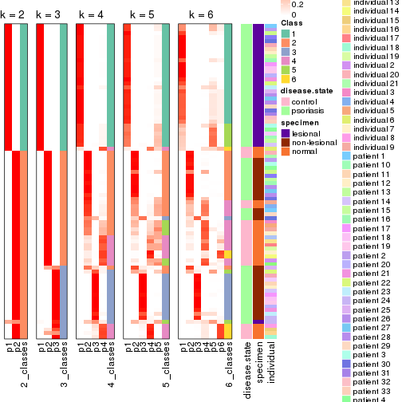


Test correlation between subgroups and known annotations. If the known
annotation is numeric, one-way ANOVA test is applied, and if the known
annotation is discrete, chi-squared contingency table test is applied.

```r
test_to_known_factors(res)
```

```
#>              n disease.state(p) specimen(p) individual(p) k
#> MAD:skmeans 81         2.72e-04    1.85e-17         1.000 2
#> MAD:skmeans 80         1.82e-05    1.33e-16         0.949 3
#> MAD:skmeans 78         6.21e-12    6.60e-25         0.784 4
#> MAD:skmeans 63         2.17e-10    4.60e-21         0.686 5
#> MAD:skmeans 71         2.80e-10    6.74e-21         0.573 6
```


If matrix rows can be associated to genes, consider to use `GO_Enrichment(res,
...)` to perform function enrichment for the signature genes.


 

---------------------------------------------------


### MAD:pam**


The object with results only for a single top-value method and a single partition method 
can be extracted as:

```r
res = res_list["MAD", "pam"]
# you can also extract it by
# res = res_list["MAD:pam"]
```

A summary of `res` and all the functions that can be applied to it:

```r
res
```

```
#> A 'ConsensusPartition' object with k = 2, 3, 4, 5, 6.
#>   On a matrix with 51941 rows and 82 columns.
#>   Top rows (1000, 2000, 3000, 4000, 5000) are extracted by 'MAD' method.
#>   Subgroups are detected by 'pam' method.
#>   Performed in total 1250 partitions by row resampling.
#>   Best k for subgroups seems to be 2.
#> 
#> Following methods can be applied to this 'ConsensusPartition' object:
#>  [1] "cola_report"             "collect_classes"         "collect_plots"          
#>  [4] "collect_stats"           "colnames"                "compare_signatures"     
#>  [7] "consensus_heatmap"       "dimension_reduction"     "functional_enrichment"  
#> [10] "get_anno_col"            "get_anno"                "get_classes"            
#> [13] "get_consensus"           "get_matrix"              "get_membership"         
#> [16] "get_param"               "get_signatures"          "get_stats"              
#> [19] "is_best_k"               "is_stable_k"             "membership_heatmap"     
#> [22] "ncol"                    "nrow"                    "plot_ecdf"              
#> [25] "rownames"                "select_partition_number" "show"                   
#> [28] "suggest_best_k"          "test_to_known_factors"
```

`collect_plots()` function collects all the plots made from `res` for all `k` (number of partitions)
into one single page to provide an easy and fast comparison between different `k`.

```r
collect_plots(res)
```


The plots are:

- The first row: a plot of the ECDF (Empirical cumulative distribution
  function) curves of the consensus matrix for each `k` and the heatmap of
  predicted classes for each `k`.
- The second row: heatmaps of the consensus matrix for each `k`.
- The third row: heatmaps of the membership matrix for each `k`.
- The fouth row: heatmaps of the signatures for each `k`.

All the plots in panels can be made by individual functions and they are
plotted later in this section.

`select_partition_number()` produces several plots showing different
statistics for choosing "optimized" `k`. There are following statistics:

- ECDF curves of the consensus matrix for each `k`;
- 1-PAC. [The PAC
  score](https://en.wikipedia.org/wiki/Consensus_clustering#Over-interpretation_potential_of_consensus_clustering)
  measures the proportion of the ambiguous subgrouping.
- Mean silhouette score.
- Concordance. The mean probability of fiting the consensus class ids in all
  partitions.
- Area increased. Denote $A_k$ as the area under the ECDF curve for current
  `k`, the area increased is defined as $A_k - A_{k-1}$.
- Rand index. The percent of pairs of samples that are both in a same cluster
  or both are not in a same cluster in the partition of k and k-1.
- Jaccard index. The ratio of pairs of samples are both in a same cluster in
  the partition of k and k-1 and the pairs of samples are both in a same
  cluster in the partition k or k-1.

The detailed explanations of these statistics can be found in [the cola
vignette](http://bioconductor.org/packages/devel/bioc/vignettes/cola/inst/doc/cola.html#toc_13).

Generally speaking, lower PAC score, higher mean silhouette score or higher
concordance corresponds to better partition. Rand index and Jaccard index
measure how similar the current partition is compared to partition with `k-1`.
If they are too similar, we won't accept `k` is better than `k-1`.

```r
select_partition_number(res)
```


The numeric values for all these statistics can be obtained by `get_stats()`.

```r
get_stats(res)
```

```
#>   k 1-PAC mean_silhouette concordance area_increased  Rand Jaccard
#> 2 2 1.000           0.982       0.992         0.4845 0.513   0.513
#> 3 3 0.860           0.926       0.964         0.3857 0.787   0.597
#> 4 4 0.762           0.767       0.840         0.1101 0.873   0.640
#> 5 5 0.861           0.845       0.924         0.0770 0.894   0.617
#> 6 6 0.867           0.759       0.894         0.0339 0.939   0.713
```

`suggest_best_k()` suggests the best $k$ based on these statistics. The rules are as follows:

- All $k$ with Jaccard index larger than 0.95 are removed because the increase of
  the partition number does not provides enough extra information. If all $k$ are removed,
  the best $k$ is assigned by `NA`.
- For $k$ with 1-PAC larger than 0.9, the maximal $k$ is taken as the "best k". Other $k$ is called "optional k".
- If it does not fit the second rule. The $k$ with the highest vote of highest
  1-PAC, mean silhouette and concordance is taken as the "best k".

```r
suggest_best_k(res)
```

```
#> [1] 2
```


Following shows the table of the partitions (You need to click the **show/hide
code output** link to see it). The membership matrix (columns with name `p*`)
is inferred by
[`clue::cl_consensus()`](https://www.rdocumentation.org/link/cl_consensus?package=clue)
function with the `SE` method. Basically the value in the membership matrix
represents the probability to belong to a certain group. The finall class
label for an item is determined with the group with highest probability it
belongs to.

In `get_classes()` function, the entropy is calculated from the membership
matrix and the silhouette score is calculated from the consensus matrix.


<script>
$( function() {
	$( '#tabs-MAD-pam-get-classes' ).tabs();
} );
</script>
<div id='tabs-MAD-pam-get-classes'>
<ul>
<li><a href='#tab-MAD-pam-get-classes-1'>k = 2</a></li>
<li><a href='#tab-MAD-pam-get-classes-2'>k = 3</a></li>
<li><a href='#tab-MAD-pam-get-classes-3'>k = 4</a></li>
<li><a href='#tab-MAD-pam-get-classes-4'>k = 5</a></li>
<li><a href='#tab-MAD-pam-get-classes-5'>k = 6</a></li>
</ul>

<div id='tab-MAD-pam-get-classes-1'>
<p><a id='tab-MAD-pam-get-classes-1-a' style='color:#0366d6' href='#'>show/hide code output</a></p>
<pre><code class="r">cbind(get_classes(res, k = 2), get_membership(res, k = 2))
</code></pre>

<pre><code>#&gt;           class entropy silhouette    p1    p2
#&gt; GSM372286     2   0.000      0.999 0.000 1.000
#&gt; GSM372287     2   0.000      0.999 0.000 1.000
#&gt; GSM372288     2   0.000      0.999 0.000 1.000
#&gt; GSM372289     2   0.000      0.999 0.000 1.000
#&gt; GSM372290     2   0.000      0.999 0.000 1.000
#&gt; GSM372291     1   0.900      0.550 0.684 0.316
#&gt; GSM372292     2   0.000      0.999 0.000 1.000
#&gt; GSM372293     2   0.000      0.999 0.000 1.000
#&gt; GSM372294     2   0.000      0.999 0.000 1.000
#&gt; GSM372295     2   0.000      0.999 0.000 1.000
#&gt; GSM372296     2   0.000      0.999 0.000 1.000
#&gt; GSM372297     2   0.000      0.999 0.000 1.000
#&gt; GSM372298     2   0.000      0.999 0.000 1.000
#&gt; GSM372299     2   0.000      0.999 0.000 1.000
#&gt; GSM372300     2   0.000      0.999 0.000 1.000
#&gt; GSM372301     2   0.000      0.999 0.000 1.000
#&gt; GSM372302     2   0.000      0.999 0.000 1.000
#&gt; GSM372303     2   0.000      0.999 0.000 1.000
#&gt; GSM372304     2   0.000      0.999 0.000 1.000
#&gt; GSM372305     2   0.000      0.999 0.000 1.000
#&gt; GSM372306     2   0.000      0.999 0.000 1.000
#&gt; GSM372307     2   0.000      0.999 0.000 1.000
#&gt; GSM372309     2   0.000      0.999 0.000 1.000
#&gt; GSM372311     2   0.000      0.999 0.000 1.000
#&gt; GSM372313     2   0.000      0.999 0.000 1.000
#&gt; GSM372315     2   0.000      0.999 0.000 1.000
#&gt; GSM372317     2   0.000      0.999 0.000 1.000
#&gt; GSM372319     2   0.000      0.999 0.000 1.000
#&gt; GSM372321     2   0.000      0.999 0.000 1.000
#&gt; GSM372323     2   0.000      0.999 0.000 1.000
#&gt; GSM372326     2   0.000      0.999 0.000 1.000
#&gt; GSM372328     2   0.000      0.999 0.000 1.000
#&gt; GSM372330     2   0.000      0.999 0.000 1.000
#&gt; GSM372332     2   0.224      0.962 0.036 0.964
#&gt; GSM372335     2   0.000      0.999 0.000 1.000
#&gt; GSM372337     2   0.000      0.999 0.000 1.000
#&gt; GSM372339     2   0.000      0.999 0.000 1.000
#&gt; GSM372341     2   0.000      0.999 0.000 1.000
#&gt; GSM372343     2   0.118      0.983 0.016 0.984
#&gt; GSM372345     2   0.000      0.999 0.000 1.000
#&gt; GSM372347     2   0.000      0.999 0.000 1.000
#&gt; GSM372349     2   0.000      0.999 0.000 1.000
#&gt; GSM372351     2   0.000      0.999 0.000 1.000
#&gt; GSM372353     2   0.000      0.999 0.000 1.000
#&gt; GSM372355     2   0.000      0.999 0.000 1.000
#&gt; GSM372357     2   0.000      0.999 0.000 1.000
#&gt; GSM372359     2   0.000      0.999 0.000 1.000
#&gt; GSM372361     2   0.000      0.999 0.000 1.000
#&gt; GSM372363     2   0.000      0.999 0.000 1.000
#&gt; GSM372308     1   0.000      0.982 1.000 0.000
#&gt; GSM372310     1   0.000      0.982 1.000 0.000
#&gt; GSM372312     1   0.000      0.982 1.000 0.000
#&gt; GSM372314     1   0.000      0.982 1.000 0.000
#&gt; GSM372316     1   0.000      0.982 1.000 0.000
#&gt; GSM372318     1   0.000      0.982 1.000 0.000
#&gt; GSM372320     1   0.000      0.982 1.000 0.000
#&gt; GSM372322     1   0.000      0.982 1.000 0.000
#&gt; GSM372324     1   0.000      0.982 1.000 0.000
#&gt; GSM372325     1   0.000      0.982 1.000 0.000
#&gt; GSM372327     1   0.000      0.982 1.000 0.000
#&gt; GSM372329     1   0.000      0.982 1.000 0.000
#&gt; GSM372331     1   0.000      0.982 1.000 0.000
#&gt; GSM372333     1   0.839      0.642 0.732 0.268
#&gt; GSM372334     1   0.000      0.982 1.000 0.000
#&gt; GSM372336     1   0.000      0.982 1.000 0.000
#&gt; GSM372338     1   0.000      0.982 1.000 0.000
#&gt; GSM372340     1   0.000      0.982 1.000 0.000
#&gt; GSM372342     1   0.000      0.982 1.000 0.000
#&gt; GSM372344     1   0.000      0.982 1.000 0.000
#&gt; GSM372346     1   0.000      0.982 1.000 0.000
#&gt; GSM372348     1   0.000      0.982 1.000 0.000
#&gt; GSM372350     1   0.000      0.982 1.000 0.000
#&gt; GSM372352     2   0.000      0.999 0.000 1.000
#&gt; GSM372354     1   0.000      0.982 1.000 0.000
#&gt; GSM372356     1   0.000      0.982 1.000 0.000
#&gt; GSM372358     1   0.000      0.982 1.000 0.000
#&gt; GSM372360     1   0.000      0.982 1.000 0.000
#&gt; GSM372362     1   0.000      0.982 1.000 0.000
#&gt; GSM372364     1   0.000      0.982 1.000 0.000
#&gt; GSM372365     1   0.000      0.982 1.000 0.000
#&gt; GSM372366     1   0.000      0.982 1.000 0.000
#&gt; GSM372367     1   0.000      0.982 1.000 0.000
</code></pre>

<script>
$('#tab-MAD-pam-get-classes-1-a').parent().next().next().hide();
$('#tab-MAD-pam-get-classes-1-a').click(function(){
  $('#tab-MAD-pam-get-classes-1-a').parent().next().next().toggle();
  return(false);
});
</script>
</div>

<div id='tab-MAD-pam-get-classes-2'>
<p><a id='tab-MAD-pam-get-classes-2-a' style='color:#0366d6' href='#'>show/hide code output</a></p>
<pre><code class="r">cbind(get_classes(res, k = 3), get_membership(res, k = 3))
</code></pre>

<pre><code>#&gt;           class entropy silhouette    p1    p2    p3
#&gt; GSM372286     2   0.000      0.954 0.000 1.000 0.000
#&gt; GSM372287     2   0.000      0.954 0.000 1.000 0.000
#&gt; GSM372288     2   0.000      0.954 0.000 1.000 0.000
#&gt; GSM372289     2   0.000      0.954 0.000 1.000 0.000
#&gt; GSM372290     2   0.000      0.954 0.000 1.000 0.000
#&gt; GSM372291     1   0.375      0.825 0.856 0.000 0.144
#&gt; GSM372292     3   0.455      0.776 0.000 0.200 0.800
#&gt; GSM372293     3   0.000      0.917 0.000 0.000 1.000
#&gt; GSM372294     2   0.000      0.954 0.000 1.000 0.000
#&gt; GSM372295     3   0.601      0.509 0.000 0.372 0.628
#&gt; GSM372296     2   0.000      0.954 0.000 1.000 0.000
#&gt; GSM372297     2   0.000      0.954 0.000 1.000 0.000
#&gt; GSM372298     2   0.000      0.954 0.000 1.000 0.000
#&gt; GSM372299     3   0.455      0.776 0.000 0.200 0.800
#&gt; GSM372300     3   0.455      0.776 0.000 0.200 0.800
#&gt; GSM372301     3   0.455      0.776 0.000 0.200 0.800
#&gt; GSM372302     2   0.000      0.954 0.000 1.000 0.000
#&gt; GSM372303     3   0.000      0.917 0.000 0.000 1.000
#&gt; GSM372304     2   0.000      0.954 0.000 1.000 0.000
#&gt; GSM372305     2   0.000      0.954 0.000 1.000 0.000
#&gt; GSM372306     2   0.455      0.774 0.000 0.800 0.200
#&gt; GSM372307     2   0.000      0.954 0.000 1.000 0.000
#&gt; GSM372309     2   0.000      0.954 0.000 1.000 0.000
#&gt; GSM372311     2   0.000      0.954 0.000 1.000 0.000
#&gt; GSM372313     2   0.000      0.954 0.000 1.000 0.000
#&gt; GSM372315     2   0.000      0.954 0.000 1.000 0.000
#&gt; GSM372317     2   0.455      0.774 0.000 0.800 0.200
#&gt; GSM372319     3   0.319      0.851 0.000 0.112 0.888
#&gt; GSM372321     3   0.000      0.917 0.000 0.000 1.000
#&gt; GSM372323     3   0.000      0.917 0.000 0.000 1.000
#&gt; GSM372326     3   0.000      0.917 0.000 0.000 1.000
#&gt; GSM372328     3   0.000      0.917 0.000 0.000 1.000
#&gt; GSM372330     2   0.000      0.954 0.000 1.000 0.000
#&gt; GSM372332     3   0.000      0.917 0.000 0.000 1.000
#&gt; GSM372335     2   0.455      0.774 0.000 0.800 0.200
#&gt; GSM372337     3   0.000      0.917 0.000 0.000 1.000
#&gt; GSM372339     3   0.000      0.917 0.000 0.000 1.000
#&gt; GSM372341     3   0.000      0.917 0.000 0.000 1.000
#&gt; GSM372343     3   0.000      0.917 0.000 0.000 1.000
#&gt; GSM372345     3   0.000      0.917 0.000 0.000 1.000
#&gt; GSM372347     3   0.000      0.917 0.000 0.000 1.000
#&gt; GSM372349     3   0.000      0.917 0.000 0.000 1.000
#&gt; GSM372351     3   0.000      0.917 0.000 0.000 1.000
#&gt; GSM372353     3   0.470      0.702 0.000 0.212 0.788
#&gt; GSM372355     2   0.000      0.954 0.000 1.000 0.000
#&gt; GSM372357     2   0.455      0.774 0.000 0.800 0.200
#&gt; GSM372359     2   0.455      0.774 0.000 0.800 0.200
#&gt; GSM372361     2   0.000      0.954 0.000 1.000 0.000
#&gt; GSM372363     2   0.000      0.954 0.000 1.000 0.000
#&gt; GSM372308     1   0.000      0.995 1.000 0.000 0.000
#&gt; GSM372310     1   0.000      0.995 1.000 0.000 0.000
#&gt; GSM372312     1   0.000      0.995 1.000 0.000 0.000
#&gt; GSM372314     1   0.000      0.995 1.000 0.000 0.000
#&gt; GSM372316     1   0.000      0.995 1.000 0.000 0.000
#&gt; GSM372318     1   0.000      0.995 1.000 0.000 0.000
#&gt; GSM372320     1   0.000      0.995 1.000 0.000 0.000
#&gt; GSM372322     1   0.000      0.995 1.000 0.000 0.000
#&gt; GSM372324     1   0.000      0.995 1.000 0.000 0.000
#&gt; GSM372325     3   0.506      0.658 0.244 0.000 0.756
#&gt; GSM372327     1   0.000      0.995 1.000 0.000 0.000
#&gt; GSM372329     1   0.000      0.995 1.000 0.000 0.000
#&gt; GSM372331     1   0.000      0.995 1.000 0.000 0.000
#&gt; GSM372333     3   0.000      0.917 0.000 0.000 1.000
#&gt; GSM372334     1   0.000      0.995 1.000 0.000 0.000
#&gt; GSM372336     1   0.000      0.995 1.000 0.000 0.000
#&gt; GSM372338     1   0.000      0.995 1.000 0.000 0.000
#&gt; GSM372340     1   0.000      0.995 1.000 0.000 0.000
#&gt; GSM372342     1   0.000      0.995 1.000 0.000 0.000
#&gt; GSM372344     1   0.000      0.995 1.000 0.000 0.000
#&gt; GSM372346     1   0.000      0.995 1.000 0.000 0.000
#&gt; GSM372348     1   0.000      0.995 1.000 0.000 0.000
#&gt; GSM372350     1   0.000      0.995 1.000 0.000 0.000
#&gt; GSM372352     3   0.240      0.875 0.004 0.064 0.932
#&gt; GSM372354     1   0.000      0.995 1.000 0.000 0.000
#&gt; GSM372356     1   0.000      0.995 1.000 0.000 0.000
#&gt; GSM372358     1   0.000      0.995 1.000 0.000 0.000
#&gt; GSM372360     1   0.000      0.995 1.000 0.000 0.000
#&gt; GSM372362     1   0.000      0.995 1.000 0.000 0.000
#&gt; GSM372364     1   0.000      0.995 1.000 0.000 0.000
#&gt; GSM372365     1   0.000      0.995 1.000 0.000 0.000
#&gt; GSM372366     1   0.000      0.995 1.000 0.000 0.000
#&gt; GSM372367     1   0.000      0.995 1.000 0.000 0.000
</code></pre>

<script>
$('#tab-MAD-pam-get-classes-2-a').parent().next().next().hide();
$('#tab-MAD-pam-get-classes-2-a').click(function(){
  $('#tab-MAD-pam-get-classes-2-a').parent().next().next().toggle();
  return(false);
});
</script>
</div>

<div id='tab-MAD-pam-get-classes-3'>
<p><a id='tab-MAD-pam-get-classes-3-a' style='color:#0366d6' href='#'>show/hide code output</a></p>
<pre><code class="r">cbind(get_classes(res, k = 4), get_membership(res, k = 4))
</code></pre>

<pre><code>#&gt;           class entropy silhouette    p1    p2    p3    p4
#&gt; GSM372286     2  0.0000     0.8979 0.000 1.000 0.000 0.000
#&gt; GSM372287     2  0.4446     0.8236 0.000 0.776 0.028 0.196
#&gt; GSM372288     2  0.2345     0.8779 0.000 0.900 0.000 0.100
#&gt; GSM372289     2  0.0921     0.8960 0.000 0.972 0.000 0.028
#&gt; GSM372290     2  0.4980     0.7600 0.000 0.680 0.016 0.304
#&gt; GSM372291     1  0.4868     0.5470 0.720 0.000 0.024 0.256
#&gt; GSM372292     3  0.4608     0.7174 0.000 0.004 0.692 0.304
#&gt; GSM372293     3  0.4250     0.7399 0.000 0.000 0.724 0.276
#&gt; GSM372294     2  0.3356     0.8462 0.000 0.824 0.000 0.176
#&gt; GSM372295     1  0.8183    -0.0816 0.356 0.008 0.332 0.304
#&gt; GSM372296     2  0.4608     0.7687 0.000 0.692 0.004 0.304
#&gt; GSM372297     2  0.5277     0.7495 0.000 0.668 0.028 0.304
#&gt; GSM372298     2  0.4406     0.7728 0.000 0.700 0.000 0.300
#&gt; GSM372299     1  0.7772     0.2194 0.464 0.004 0.228 0.304
#&gt; GSM372300     3  0.4584     0.7203 0.000 0.004 0.696 0.300
#&gt; GSM372301     3  0.4608     0.7174 0.000 0.004 0.692 0.304
#&gt; GSM372302     2  0.5277     0.7495 0.000 0.668 0.028 0.304
#&gt; GSM372303     3  0.4250     0.7399 0.000 0.000 0.724 0.276
#&gt; GSM372304     2  0.4431     0.7710 0.000 0.696 0.000 0.304
#&gt; GSM372305     2  0.0000     0.8979 0.000 1.000 0.000 0.000
#&gt; GSM372306     2  0.0188     0.8967 0.000 0.996 0.004 0.000
#&gt; GSM372307     2  0.1256     0.8953 0.000 0.964 0.008 0.028
#&gt; GSM372309     2  0.0469     0.8964 0.000 0.988 0.012 0.000
#&gt; GSM372311     2  0.0000     0.8979 0.000 1.000 0.000 0.000
#&gt; GSM372313     2  0.0000     0.8979 0.000 1.000 0.000 0.000
#&gt; GSM372315     2  0.0000     0.8979 0.000 1.000 0.000 0.000
#&gt; GSM372317     2  0.1302     0.8833 0.000 0.956 0.044 0.000
#&gt; GSM372319     3  0.0592     0.8834 0.000 0.000 0.984 0.016
#&gt; GSM372321     3  0.0000     0.8901 0.000 0.000 1.000 0.000
#&gt; GSM372323     3  0.0000     0.8901 0.000 0.000 1.000 0.000
#&gt; GSM372326     3  0.0000     0.8901 0.000 0.000 1.000 0.000
#&gt; GSM372328     3  0.0000     0.8901 0.000 0.000 1.000 0.000
#&gt; GSM372330     2  0.0000     0.8979 0.000 1.000 0.000 0.000
#&gt; GSM372332     3  0.0000     0.8901 0.000 0.000 1.000 0.000
#&gt; GSM372335     2  0.3569     0.7690 0.000 0.804 0.196 0.000
#&gt; GSM372337     3  0.0000     0.8901 0.000 0.000 1.000 0.000
#&gt; GSM372339     3  0.0000     0.8901 0.000 0.000 1.000 0.000
#&gt; GSM372341     3  0.0000     0.8901 0.000 0.000 1.000 0.000
#&gt; GSM372343     3  0.0000     0.8901 0.000 0.000 1.000 0.000
#&gt; GSM372345     3  0.0921     0.8714 0.028 0.000 0.972 0.000
#&gt; GSM372347     3  0.0921     0.8714 0.028 0.000 0.972 0.000
#&gt; GSM372349     3  0.0000     0.8901 0.000 0.000 1.000 0.000
#&gt; GSM372351     3  0.0000     0.8901 0.000 0.000 1.000 0.000
#&gt; GSM372353     3  0.4855     0.4226 0.000 0.400 0.600 0.000
#&gt; GSM372355     2  0.0000     0.8979 0.000 1.000 0.000 0.000
#&gt; GSM372357     2  0.0188     0.8967 0.000 0.996 0.004 0.000
#&gt; GSM372359     2  0.0188     0.8967 0.000 0.996 0.004 0.000
#&gt; GSM372361     2  0.1936     0.8886 0.000 0.940 0.028 0.032
#&gt; GSM372363     2  0.0188     0.8981 0.000 0.996 0.000 0.004
#&gt; GSM372308     1  0.0000     0.7182 1.000 0.000 0.000 0.000
#&gt; GSM372310     1  0.0592     0.7144 0.984 0.000 0.000 0.016
#&gt; GSM372312     1  0.0000     0.7182 1.000 0.000 0.000 0.000
#&gt; GSM372314     1  0.0000     0.7182 1.000 0.000 0.000 0.000
#&gt; GSM372316     4  0.4454     0.9728 0.308 0.000 0.000 0.692
#&gt; GSM372318     4  0.4431     0.9767 0.304 0.000 0.000 0.696
#&gt; GSM372320     4  0.4431     0.9767 0.304 0.000 0.000 0.696
#&gt; GSM372322     4  0.4431     0.9767 0.304 0.000 0.000 0.696
#&gt; GSM372324     1  0.0000     0.7182 1.000 0.000 0.000 0.000
#&gt; GSM372325     1  0.4356     0.5363 0.708 0.000 0.292 0.000
#&gt; GSM372327     4  0.4431     0.9767 0.304 0.000 0.000 0.696
#&gt; GSM372329     4  0.4431     0.9767 0.304 0.000 0.000 0.696
#&gt; GSM372331     1  0.0000     0.7182 1.000 0.000 0.000 0.000
#&gt; GSM372333     1  0.4888     0.3150 0.588 0.000 0.412 0.000
#&gt; GSM372334     4  0.4431     0.9767 0.304 0.000 0.000 0.696
#&gt; GSM372336     1  0.0817     0.7114 0.976 0.000 0.000 0.024
#&gt; GSM372338     4  0.4431     0.9767 0.304 0.000 0.000 0.696
#&gt; GSM372340     4  0.4431     0.9767 0.304 0.000 0.000 0.696
#&gt; GSM372342     4  0.4431     0.9767 0.304 0.000 0.000 0.696
#&gt; GSM372344     4  0.4431     0.9767 0.304 0.000 0.000 0.696
#&gt; GSM372346     4  0.4431     0.9767 0.304 0.000 0.000 0.696
#&gt; GSM372348     1  0.0000     0.7182 1.000 0.000 0.000 0.000
#&gt; GSM372350     1  0.2921     0.5827 0.860 0.000 0.000 0.140
#&gt; GSM372352     1  0.4933     0.2949 0.568 0.000 0.432 0.000
#&gt; GSM372354     4  0.4866     0.8485 0.404 0.000 0.000 0.596
#&gt; GSM372356     1  0.0921     0.7094 0.972 0.000 0.000 0.028
#&gt; GSM372358     1  0.4877    -0.4157 0.592 0.000 0.000 0.408
#&gt; GSM372360     1  0.0921     0.7094 0.972 0.000 0.000 0.028
#&gt; GSM372362     1  0.4925    -0.4779 0.572 0.000 0.000 0.428
#&gt; GSM372364     1  0.0921     0.7094 0.972 0.000 0.000 0.028
#&gt; GSM372365     1  0.0921     0.7094 0.972 0.000 0.000 0.028
#&gt; GSM372366     4  0.4866     0.8485 0.404 0.000 0.000 0.596
#&gt; GSM372367     1  0.0921     0.7094 0.972 0.000 0.000 0.028
</code></pre>

<script>
$('#tab-MAD-pam-get-classes-3-a').parent().next().next().hide();
$('#tab-MAD-pam-get-classes-3-a').click(function(){
  $('#tab-MAD-pam-get-classes-3-a').parent().next().next().toggle();
  return(false);
});
</script>
</div>

<div id='tab-MAD-pam-get-classes-4'>
<p><a id='tab-MAD-pam-get-classes-4-a' style='color:#0366d6' href='#'>show/hide code output</a></p>
<pre><code class="r">cbind(get_classes(res, k = 5), get_membership(res, k = 5))
</code></pre>

<pre><code>#&gt;           class entropy silhouette    p1    p2    p3    p4    p5
#&gt; GSM372286     2  0.0290      0.932 0.000 0.992 0.000 0.008 0.000
#&gt; GSM372287     2  0.4251      0.487 0.000 0.624 0.000 0.372 0.004
#&gt; GSM372288     2  0.2763      0.844 0.000 0.848 0.000 0.148 0.004
#&gt; GSM372289     2  0.1831      0.903 0.000 0.920 0.000 0.076 0.004
#&gt; GSM372290     4  0.0162      0.963 0.000 0.000 0.000 0.996 0.004
#&gt; GSM372291     5  0.3513      0.667 0.020 0.000 0.000 0.180 0.800
#&gt; GSM372292     4  0.0000      0.963 0.000 0.000 0.000 1.000 0.000
#&gt; GSM372293     4  0.1732      0.907 0.000 0.000 0.080 0.920 0.000
#&gt; GSM372294     2  0.3461      0.755 0.000 0.772 0.000 0.224 0.004
#&gt; GSM372295     4  0.0000      0.963 0.000 0.000 0.000 1.000 0.000
#&gt; GSM372296     4  0.0162      0.963 0.000 0.000 0.000 0.996 0.004
#&gt; GSM372297     4  0.0162      0.963 0.000 0.000 0.000 0.996 0.004
#&gt; GSM372298     4  0.0671      0.958 0.000 0.016 0.000 0.980 0.004
#&gt; GSM372299     4  0.0451      0.960 0.000 0.008 0.004 0.988 0.000
#&gt; GSM372300     4  0.0703      0.953 0.000 0.000 0.024 0.976 0.000
#&gt; GSM372301     4  0.0162      0.963 0.000 0.000 0.004 0.996 0.000
#&gt; GSM372302     4  0.0000      0.963 0.000 0.000 0.000 1.000 0.000
#&gt; GSM372303     4  0.1732      0.907 0.000 0.000 0.080 0.920 0.000
#&gt; GSM372304     4  0.2930      0.773 0.000 0.164 0.000 0.832 0.004
#&gt; GSM372305     2  0.0000      0.933 0.000 1.000 0.000 0.000 0.000
#&gt; GSM372306     2  0.0000      0.933 0.000 1.000 0.000 0.000 0.000
#&gt; GSM372307     2  0.1831      0.903 0.000 0.920 0.000 0.076 0.004
#&gt; GSM372309     2  0.0000      0.933 0.000 1.000 0.000 0.000 0.000
#&gt; GSM372311     2  0.0000      0.933 0.000 1.000 0.000 0.000 0.000
#&gt; GSM372313     2  0.0000      0.933 0.000 1.000 0.000 0.000 0.000
#&gt; GSM372315     2  0.0000      0.933 0.000 1.000 0.000 0.000 0.000
#&gt; GSM372317     2  0.1270      0.907 0.000 0.948 0.052 0.000 0.000
#&gt; GSM372319     3  0.1270      0.912 0.000 0.000 0.948 0.052 0.000
#&gt; GSM372321     3  0.0000      0.961 0.000 0.000 1.000 0.000 0.000
#&gt; GSM372323     3  0.0000      0.961 0.000 0.000 1.000 0.000 0.000
#&gt; GSM372326     3  0.0000      0.961 0.000 0.000 1.000 0.000 0.000
#&gt; GSM372328     3  0.0000      0.961 0.000 0.000 1.000 0.000 0.000
#&gt; GSM372330     2  0.0000      0.933 0.000 1.000 0.000 0.000 0.000
#&gt; GSM372332     3  0.0000      0.961 0.000 0.000 1.000 0.000 0.000
#&gt; GSM372335     2  0.3074      0.763 0.000 0.804 0.196 0.000 0.000
#&gt; GSM372337     3  0.0000      0.961 0.000 0.000 1.000 0.000 0.000
#&gt; GSM372339     3  0.0000      0.961 0.000 0.000 1.000 0.000 0.000
#&gt; GSM372341     3  0.0000      0.961 0.000 0.000 1.000 0.000 0.000
#&gt; GSM372343     3  0.0000      0.961 0.000 0.000 1.000 0.000 0.000
#&gt; GSM372345     3  0.0000      0.961 0.000 0.000 1.000 0.000 0.000
#&gt; GSM372347     3  0.0794      0.938 0.000 0.000 0.972 0.000 0.028
#&gt; GSM372349     3  0.0000      0.961 0.000 0.000 1.000 0.000 0.000
#&gt; GSM372351     3  0.0000      0.961 0.000 0.000 1.000 0.000 0.000
#&gt; GSM372353     3  0.4219      0.316 0.000 0.416 0.584 0.000 0.000
#&gt; GSM372355     2  0.0000      0.933 0.000 1.000 0.000 0.000 0.000
#&gt; GSM372357     2  0.0000      0.933 0.000 1.000 0.000 0.000 0.000
#&gt; GSM372359     2  0.0000      0.933 0.000 1.000 0.000 0.000 0.000
#&gt; GSM372361     2  0.1792      0.900 0.000 0.916 0.000 0.084 0.000
#&gt; GSM372363     2  0.0510      0.930 0.000 0.984 0.000 0.016 0.000
#&gt; GSM372308     5  0.0162      0.803 0.004 0.000 0.000 0.000 0.996
#&gt; GSM372310     5  0.2074      0.785 0.104 0.000 0.000 0.000 0.896
#&gt; GSM372312     5  0.0162      0.803 0.004 0.000 0.000 0.000 0.996
#&gt; GSM372314     5  0.0162      0.803 0.004 0.000 0.000 0.000 0.996
#&gt; GSM372316     1  0.0162      0.896 0.996 0.000 0.000 0.000 0.004
#&gt; GSM372318     1  0.0162      0.896 0.996 0.000 0.000 0.000 0.004
#&gt; GSM372320     1  0.0000      0.898 1.000 0.000 0.000 0.000 0.000
#&gt; GSM372322     1  0.0000      0.898 1.000 0.000 0.000 0.000 0.000
#&gt; GSM372324     5  0.0162      0.803 0.004 0.000 0.000 0.000 0.996
#&gt; GSM372325     5  0.3395      0.633 0.000 0.000 0.236 0.000 0.764
#&gt; GSM372327     1  0.0000      0.898 1.000 0.000 0.000 0.000 0.000
#&gt; GSM372329     1  0.0000      0.898 1.000 0.000 0.000 0.000 0.000
#&gt; GSM372331     5  0.0162      0.803 0.004 0.000 0.000 0.000 0.996
#&gt; GSM372333     5  0.3452      0.621 0.000 0.000 0.244 0.000 0.756
#&gt; GSM372334     1  0.0000      0.898 1.000 0.000 0.000 0.000 0.000
#&gt; GSM372336     5  0.3109      0.742 0.200 0.000 0.000 0.000 0.800
#&gt; GSM372338     1  0.0000      0.898 1.000 0.000 0.000 0.000 0.000
#&gt; GSM372340     1  0.0000      0.898 1.000 0.000 0.000 0.000 0.000
#&gt; GSM372342     1  0.0000      0.898 1.000 0.000 0.000 0.000 0.000
#&gt; GSM372344     1  0.0000      0.898 1.000 0.000 0.000 0.000 0.000
#&gt; GSM372346     1  0.0000      0.898 1.000 0.000 0.000 0.000 0.000
#&gt; GSM372348     5  0.0162      0.803 0.004 0.000 0.000 0.000 0.996
#&gt; GSM372350     5  0.4283      0.371 0.456 0.000 0.000 0.000 0.544
#&gt; GSM372352     5  0.3424      0.627 0.000 0.000 0.240 0.000 0.760
#&gt; GSM372354     1  0.3395      0.676 0.764 0.000 0.000 0.000 0.236
#&gt; GSM372356     5  0.3242      0.731 0.216 0.000 0.000 0.000 0.784
#&gt; GSM372358     1  0.4201      0.318 0.592 0.000 0.000 0.000 0.408
#&gt; GSM372360     5  0.3242      0.731 0.216 0.000 0.000 0.000 0.784
#&gt; GSM372362     1  0.4138      0.387 0.616 0.000 0.000 0.000 0.384
#&gt; GSM372364     5  0.3242      0.731 0.216 0.000 0.000 0.000 0.784
#&gt; GSM372365     5  0.3242      0.731 0.216 0.000 0.000 0.000 0.784
#&gt; GSM372366     1  0.3395      0.676 0.764 0.000 0.000 0.000 0.236
#&gt; GSM372367     5  0.3242      0.731 0.216 0.000 0.000 0.000 0.784
</code></pre>

<script>
$('#tab-MAD-pam-get-classes-4-a').parent().next().next().hide();
$('#tab-MAD-pam-get-classes-4-a').click(function(){
  $('#tab-MAD-pam-get-classes-4-a').parent().next().next().toggle();
  return(false);
});
</script>
</div>

<div id='tab-MAD-pam-get-classes-5'>
<p><a id='tab-MAD-pam-get-classes-5-a' style='color:#0366d6' href='#'>show/hide code output</a></p>
<pre><code class="r">cbind(get_classes(res, k = 6), get_membership(res, k = 6))
</code></pre>

<pre><code>#&gt;           class entropy silhouette    p1    p2    p3    p4    p5    p6
#&gt; GSM372286     2  0.0260     0.8994 0.000 0.992 0.000 0.008 0.000 0.000
#&gt; GSM372287     4  0.0632     0.8788 0.000 0.024 0.000 0.976 0.000 0.000
#&gt; GSM372288     2  0.3857     0.2502 0.000 0.532 0.000 0.468 0.000 0.000
#&gt; GSM372289     2  0.3592     0.5379 0.000 0.656 0.000 0.344 0.000 0.000
#&gt; GSM372290     4  0.0000     0.8859 0.000 0.000 0.000 1.000 0.000 0.000
#&gt; GSM372291     5  0.5994     0.1659 0.000 0.000 0.000 0.252 0.432 0.316
#&gt; GSM372292     6  0.1327     0.9605 0.000 0.000 0.000 0.064 0.000 0.936
#&gt; GSM372293     6  0.1411     0.9586 0.000 0.000 0.004 0.060 0.000 0.936
#&gt; GSM372294     4  0.0865     0.8701 0.000 0.036 0.000 0.964 0.000 0.000
#&gt; GSM372295     4  0.2562     0.7660 0.000 0.000 0.000 0.828 0.000 0.172
#&gt; GSM372296     4  0.0000     0.8859 0.000 0.000 0.000 1.000 0.000 0.000
#&gt; GSM372297     4  0.1444     0.8423 0.000 0.000 0.000 0.928 0.000 0.072
#&gt; GSM372298     6  0.3050     0.7496 0.000 0.000 0.000 0.236 0.000 0.764
#&gt; GSM372299     6  0.1471     0.9583 0.000 0.004 0.000 0.064 0.000 0.932
#&gt; GSM372300     6  0.1327     0.9605 0.000 0.000 0.000 0.064 0.000 0.936
#&gt; GSM372301     6  0.1327     0.9605 0.000 0.000 0.000 0.064 0.000 0.936
#&gt; GSM372302     4  0.2416     0.7850 0.000 0.000 0.000 0.844 0.000 0.156
#&gt; GSM372303     6  0.1411     0.9586 0.000 0.000 0.004 0.060 0.000 0.936
#&gt; GSM372304     4  0.0000     0.8859 0.000 0.000 0.000 1.000 0.000 0.000
#&gt; GSM372305     2  0.0000     0.9027 0.000 1.000 0.000 0.000 0.000 0.000
#&gt; GSM372306     2  0.0000     0.9027 0.000 1.000 0.000 0.000 0.000 0.000
#&gt; GSM372307     2  0.3647     0.5092 0.000 0.640 0.000 0.360 0.000 0.000
#&gt; GSM372309     2  0.0000     0.9027 0.000 1.000 0.000 0.000 0.000 0.000
#&gt; GSM372311     2  0.0000     0.9027 0.000 1.000 0.000 0.000 0.000 0.000
#&gt; GSM372313     2  0.0000     0.9027 0.000 1.000 0.000 0.000 0.000 0.000
#&gt; GSM372315     2  0.0146     0.9012 0.000 0.996 0.000 0.004 0.000 0.000
#&gt; GSM372317     2  0.1141     0.8651 0.000 0.948 0.052 0.000 0.000 0.000
#&gt; GSM372319     3  0.2664     0.7390 0.000 0.000 0.816 0.184 0.000 0.000
#&gt; GSM372321     3  0.0000     0.9465 0.000 0.000 1.000 0.000 0.000 0.000
#&gt; GSM372323     3  0.0000     0.9465 0.000 0.000 1.000 0.000 0.000 0.000
#&gt; GSM372326     3  0.0000     0.9465 0.000 0.000 1.000 0.000 0.000 0.000
#&gt; GSM372328     3  0.0000     0.9465 0.000 0.000 1.000 0.000 0.000 0.000
#&gt; GSM372330     2  0.0000     0.9027 0.000 1.000 0.000 0.000 0.000 0.000
#&gt; GSM372332     3  0.0000     0.9465 0.000 0.000 1.000 0.000 0.000 0.000
#&gt; GSM372335     2  0.2730     0.7229 0.000 0.808 0.192 0.000 0.000 0.000
#&gt; GSM372337     3  0.0000     0.9465 0.000 0.000 1.000 0.000 0.000 0.000
#&gt; GSM372339     3  0.0000     0.9465 0.000 0.000 1.000 0.000 0.000 0.000
#&gt; GSM372341     3  0.0000     0.9465 0.000 0.000 1.000 0.000 0.000 0.000
#&gt; GSM372343     3  0.0000     0.9465 0.000 0.000 1.000 0.000 0.000 0.000
#&gt; GSM372345     3  0.0000     0.9465 0.000 0.000 1.000 0.000 0.000 0.000
#&gt; GSM372347     3  0.1391     0.8995 0.000 0.000 0.944 0.000 0.016 0.040
#&gt; GSM372349     3  0.0000     0.9465 0.000 0.000 1.000 0.000 0.000 0.000
#&gt; GSM372351     3  0.0000     0.9465 0.000 0.000 1.000 0.000 0.000 0.000
#&gt; GSM372353     3  0.3789     0.2997 0.000 0.416 0.584 0.000 0.000 0.000
#&gt; GSM372355     2  0.0000     0.9027 0.000 1.000 0.000 0.000 0.000 0.000
#&gt; GSM372357     2  0.0000     0.9027 0.000 1.000 0.000 0.000 0.000 0.000
#&gt; GSM372359     2  0.0000     0.9027 0.000 1.000 0.000 0.000 0.000 0.000
#&gt; GSM372361     4  0.2996     0.6936 0.000 0.228 0.000 0.772 0.000 0.000
#&gt; GSM372363     2  0.0146     0.9011 0.000 0.996 0.000 0.004 0.000 0.000
#&gt; GSM372308     5  0.1007     0.7521 0.000 0.000 0.000 0.000 0.956 0.044
#&gt; GSM372310     5  0.0865     0.7467 0.036 0.000 0.000 0.000 0.964 0.000
#&gt; GSM372312     5  0.1327     0.7515 0.000 0.000 0.000 0.000 0.936 0.064
#&gt; GSM372314     5  0.1327     0.7515 0.000 0.000 0.000 0.000 0.936 0.064
#&gt; GSM372316     1  0.0146     0.8746 0.996 0.000 0.000 0.000 0.004 0.000
#&gt; GSM372318     1  0.0632     0.8590 0.976 0.000 0.000 0.000 0.024 0.000
#&gt; GSM372320     1  0.0000     0.8771 1.000 0.000 0.000 0.000 0.000 0.000
#&gt; GSM372322     1  0.0000     0.8771 1.000 0.000 0.000 0.000 0.000 0.000
#&gt; GSM372324     5  0.1327     0.7515 0.000 0.000 0.000 0.000 0.936 0.064
#&gt; GSM372325     5  0.4899     0.2540 0.000 0.000 0.404 0.000 0.532 0.064
#&gt; GSM372327     1  0.0000     0.8771 1.000 0.000 0.000 0.000 0.000 0.000
#&gt; GSM372329     1  0.0000     0.8771 1.000 0.000 0.000 0.000 0.000 0.000
#&gt; GSM372331     5  0.1327     0.7515 0.000 0.000 0.000 0.000 0.936 0.064
#&gt; GSM372333     5  0.4899     0.2540 0.000 0.000 0.404 0.000 0.532 0.064
#&gt; GSM372334     1  0.0000     0.8771 1.000 0.000 0.000 0.000 0.000 0.000
#&gt; GSM372336     5  0.1714     0.7338 0.092 0.000 0.000 0.000 0.908 0.000
#&gt; GSM372338     1  0.0000     0.8771 1.000 0.000 0.000 0.000 0.000 0.000
#&gt; GSM372340     1  0.0000     0.8771 1.000 0.000 0.000 0.000 0.000 0.000
#&gt; GSM372342     1  0.0000     0.8771 1.000 0.000 0.000 0.000 0.000 0.000
#&gt; GSM372344     1  0.0000     0.8771 1.000 0.000 0.000 0.000 0.000 0.000
#&gt; GSM372346     1  0.0000     0.8771 1.000 0.000 0.000 0.000 0.000 0.000
#&gt; GSM372348     5  0.1327     0.7515 0.000 0.000 0.000 0.000 0.936 0.064
#&gt; GSM372350     1  0.3823     0.0391 0.564 0.000 0.000 0.000 0.436 0.000
#&gt; GSM372352     5  0.5152     0.2865 0.000 0.000 0.376 0.000 0.532 0.092
#&gt; GSM372354     1  0.3857     0.1357 0.532 0.000 0.000 0.000 0.468 0.000
#&gt; GSM372356     5  0.1765     0.7322 0.096 0.000 0.000 0.000 0.904 0.000
#&gt; GSM372358     5  0.3857    -0.0330 0.468 0.000 0.000 0.000 0.532 0.000
#&gt; GSM372360     5  0.1765     0.7322 0.096 0.000 0.000 0.000 0.904 0.000
#&gt; GSM372362     5  0.3868    -0.1246 0.496 0.000 0.000 0.000 0.504 0.000
#&gt; GSM372364     5  0.1765     0.7322 0.096 0.000 0.000 0.000 0.904 0.000
#&gt; GSM372365     5  0.1765     0.7322 0.096 0.000 0.000 0.000 0.904 0.000
#&gt; GSM372366     1  0.3857     0.1357 0.532 0.000 0.000 0.000 0.468 0.000
#&gt; GSM372367     5  0.1765     0.7322 0.096 0.000 0.000 0.000 0.904 0.000
</code></pre>

<script>
$('#tab-MAD-pam-get-classes-5-a').parent().next().next().hide();
$('#tab-MAD-pam-get-classes-5-a').click(function(){
  $('#tab-MAD-pam-get-classes-5-a').parent().next().next().toggle();
  return(false);
});
</script>
</div>
</div>

Heatmaps for the consensus matrix. It visualizes the probability of two
samples to be in a same group.


<script>
$( function() {
	$( '#tabs-MAD-pam-consensus-heatmap' ).tabs();
} );
</script>
<div id='tabs-MAD-pam-consensus-heatmap'>
<ul>
<li><a href='#tab-MAD-pam-consensus-heatmap-1'>k = 2</a></li>
<li><a href='#tab-MAD-pam-consensus-heatmap-2'>k = 3</a></li>
<li><a href='#tab-MAD-pam-consensus-heatmap-3'>k = 4</a></li>
<li><a href='#tab-MAD-pam-consensus-heatmap-4'>k = 5</a></li>
<li><a href='#tab-MAD-pam-consensus-heatmap-5'>k = 6</a></li>
</ul>
<div id='tab-MAD-pam-consensus-heatmap-1'>
<pre><code class="r">consensus_heatmap(res, k = 2)
</code></pre>

<p></p>

</div>
<div id='tab-MAD-pam-consensus-heatmap-2'>
<pre><code class="r">consensus_heatmap(res, k = 3)
</code></pre>

<p></p>

</div>
<div id='tab-MAD-pam-consensus-heatmap-3'>
<pre><code class="r">consensus_heatmap(res, k = 4)
</code></pre>

<p></p>

</div>
<div id='tab-MAD-pam-consensus-heatmap-4'>
<pre><code class="r">consensus_heatmap(res, k = 5)
</code></pre>

<p></p>

</div>
<div id='tab-MAD-pam-consensus-heatmap-5'>
<pre><code class="r">consensus_heatmap(res, k = 6)
</code></pre>

<p></p>

</div>
</div>

Heatmaps for the membership of samples in all partitions to see how consistent they are:


<script>
$( function() {
	$( '#tabs-MAD-pam-membership-heatmap' ).tabs();
} );
</script>
<div id='tabs-MAD-pam-membership-heatmap'>
<ul>
<li><a href='#tab-MAD-pam-membership-heatmap-1'>k = 2</a></li>
<li><a href='#tab-MAD-pam-membership-heatmap-2'>k = 3</a></li>
<li><a href='#tab-MAD-pam-membership-heatmap-3'>k = 4</a></li>
<li><a href='#tab-MAD-pam-membership-heatmap-4'>k = 5</a></li>
<li><a href='#tab-MAD-pam-membership-heatmap-5'>k = 6</a></li>
</ul>
<div id='tab-MAD-pam-membership-heatmap-1'>
<pre><code class="r">membership_heatmap(res, k = 2)
</code></pre>

<p></p>

</div>
<div id='tab-MAD-pam-membership-heatmap-2'>
<pre><code class="r">membership_heatmap(res, k = 3)
</code></pre>

<p>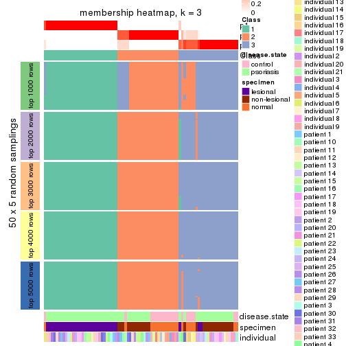</p>

</div>
<div id='tab-MAD-pam-membership-heatmap-3'>
<pre><code class="r">membership_heatmap(res, k = 4)
</code></pre>

<p></p>

</div>
<div id='tab-MAD-pam-membership-heatmap-4'>
<pre><code class="r">membership_heatmap(res, k = 5)
</code></pre>

<p></p>

</div>
<div id='tab-MAD-pam-membership-heatmap-5'>
<pre><code class="r">membership_heatmap(res, k = 6)
</code></pre>

<p></p>

</div>
</div>

As soon as we have had the classes for columns, we can look for signatures
which are significantly different between classes which can be candidate marks
for certain classes. Following are the heatmaps for signatures.


Signature heatmaps where rows are scaled:


<script>
$( function() {
	$( '#tabs-MAD-pam-get-signatures' ).tabs();
} );
</script>
<div id='tabs-MAD-pam-get-signatures'>
<ul>
<li><a href='#tab-MAD-pam-get-signatures-1'>k = 2</a></li>
<li><a href='#tab-MAD-pam-get-signatures-2'>k = 3</a></li>
<li><a href='#tab-MAD-pam-get-signatures-3'>k = 4</a></li>
<li><a href='#tab-MAD-pam-get-signatures-4'>k = 5</a></li>
<li><a href='#tab-MAD-pam-get-signatures-5'>k = 6</a></li>
</ul>
<div id='tab-MAD-pam-get-signatures-1'>
<pre><code class="r">get_signatures(res, k = 2)
</code></pre>

<p></p>

</div>
<div id='tab-MAD-pam-get-signatures-2'>
<pre><code class="r">get_signatures(res, k = 3)
</code></pre>

<p></p>

</div>
<div id='tab-MAD-pam-get-signatures-3'>
<pre><code class="r">get_signatures(res, k = 4)
</code></pre>

<p></p>

</div>
<div id='tab-MAD-pam-get-signatures-4'>
<pre><code class="r">get_signatures(res, k = 5)
</code></pre>

<p></p>

</div>
<div id='tab-MAD-pam-get-signatures-5'>
<pre><code class="r">get_signatures(res, k = 6)
</code></pre>

<p></p>

</div>
</div>


Signature heatmaps where rows are not scaled:


<script>
$( function() {
	$( '#tabs-MAD-pam-get-signatures-no-scale' ).tabs();
} );
</script>
<div id='tabs-MAD-pam-get-signatures-no-scale'>
<ul>
<li><a href='#tab-MAD-pam-get-signatures-no-scale-1'>k = 2</a></li>
<li><a href='#tab-MAD-pam-get-signatures-no-scale-2'>k = 3</a></li>
<li><a href='#tab-MAD-pam-get-signatures-no-scale-3'>k = 4</a></li>
<li><a href='#tab-MAD-pam-get-signatures-no-scale-4'>k = 5</a></li>
<li><a href='#tab-MAD-pam-get-signatures-no-scale-5'>k = 6</a></li>
</ul>
<div id='tab-MAD-pam-get-signatures-no-scale-1'>
<pre><code class="r">get_signatures(res, k = 2, scale_rows = FALSE)
</code></pre>

<p></p>

</div>
<div id='tab-MAD-pam-get-signatures-no-scale-2'>
<pre><code class="r">get_signatures(res, k = 3, scale_rows = FALSE)
</code></pre>

<p></p>

</div>
<div id='tab-MAD-pam-get-signatures-no-scale-3'>
<pre><code class="r">get_signatures(res, k = 4, scale_rows = FALSE)
</code></pre>

<p></p>

</div>
<div id='tab-MAD-pam-get-signatures-no-scale-4'>
<pre><code class="r">get_signatures(res, k = 5, scale_rows = FALSE)
</code></pre>

<p></p>

</div>
<div id='tab-MAD-pam-get-signatures-no-scale-5'>
<pre><code class="r">get_signatures(res, k = 6, scale_rows = FALSE)
</code></pre>

<p></p>

</div>
</div>


Compare the overlap of signatures from different k:

```r
compare_signatures(res)
```


`get_signature()` returns a data frame invisibly. TO get the list of signatures, the function
call should be assigned to a variable explicitly. In following code, if `plot` argument is set
to `FALSE`, no heatmap is plotted while only the differential analysis is performed.

```r
# code only for demonstration
tb = get_signature(res, k = ..., plot = FALSE)
```

An example of the output of `tb` is:

```
#>   which_row         fdr    mean_1    mean_2 scaled_mean_1 scaled_mean_2 km
#> 1        38 0.042760348  8.373488  9.131774    -0.5533452     0.5164555  1
#> 2        40 0.018707592  7.106213  8.469186    -0.6173731     0.5762149  1
#> 3        55 0.019134737 10.221463 11.207825    -0.6159697     0.5749050  1
#> 4        59 0.006059896  5.921854  7.869574    -0.6899429     0.6439467  1
#> 5        60 0.018055526  8.928898 10.211722    -0.6204761     0.5791110  1
#> 6        98 0.009384629 15.714769 14.887706     0.6635654    -0.6193277  2
...
```

The columns in `tb` are:

1. `which_row`: row indices corresponding to the input matrix.
2. `fdr`: FDR for the differential test. 
3. `mean_x`: The mean value in group x.
4. `scaled_mean_x`: The mean value in group x after rows are scaled.
5. `km`: Row groups if k-means clustering is applied to rows.


UMAP plot which shows how samples are separated.


<script>
$( function() {
	$( '#tabs-MAD-pam-dimension-reduction' ).tabs();
} );
</script>
<div id='tabs-MAD-pam-dimension-reduction'>
<ul>
<li><a href='#tab-MAD-pam-dimension-reduction-1'>k = 2</a></li>
<li><a href='#tab-MAD-pam-dimension-reduction-2'>k = 3</a></li>
<li><a href='#tab-MAD-pam-dimension-reduction-3'>k = 4</a></li>
<li><a href='#tab-MAD-pam-dimension-reduction-4'>k = 5</a></li>
<li><a href='#tab-MAD-pam-dimension-reduction-5'>k = 6</a></li>
</ul>
<div id='tab-MAD-pam-dimension-reduction-1'>
<pre><code class="r">dimension_reduction(res, k = 2, method = &quot;UMAP&quot;)
</code></pre>

<p></p>

</div>
<div id='tab-MAD-pam-dimension-reduction-2'>
<pre><code class="r">dimension_reduction(res, k = 3, method = &quot;UMAP&quot;)
</code></pre>

<p></p>

</div>
<div id='tab-MAD-pam-dimension-reduction-3'>
<pre><code class="r">dimension_reduction(res, k = 4, method = &quot;UMAP&quot;)
</code></pre>

<p></p>

</div>
<div id='tab-MAD-pam-dimension-reduction-4'>
<pre><code class="r">dimension_reduction(res, k = 5, method = &quot;UMAP&quot;)
</code></pre>

<p></p>

</div>
<div id='tab-MAD-pam-dimension-reduction-5'>
<pre><code class="r">dimension_reduction(res, k = 6, method = &quot;UMAP&quot;)
</code></pre>

<p></p>

</div>
</div>


Following heatmap shows how subgroups are split when increasing `k`:

```r
collect_classes(res)
```


Test correlation between subgroups and known annotations. If the known
annotation is numeric, one-way ANOVA test is applied, and if the known
annotation is discrete, chi-squared contingency table test is applied.

```r
test_to_known_factors(res)
```

```
#>          n disease.state(p) specimen(p) individual(p) k
#> MAD:pam 82         3.35e-04    8.50e-17         0.999 2
#> MAD:pam 82         2.82e-04    2.77e-14         0.900 3
#> MAD:pam 75         1.03e-03    3.20e-14         0.931 4
#> MAD:pam 77         2.51e-10    2.68e-22         0.806 5
#> MAD:pam 71         8.03e-10    1.83e-20         0.486 6
```


If matrix rows can be associated to genes, consider to use `GO_Enrichment(res,
...)` to perform function enrichment for the signature genes.


 

---------------------------------------------------


### MAD:mclust**


The object with results only for a single top-value method and a single partition method 
can be extracted as:

```r
res = res_list["MAD", "mclust"]
# you can also extract it by
# res = res_list["MAD:mclust"]
```

A summary of `res` and all the functions that can be applied to it:

```r
res
```

```
#> A 'ConsensusPartition' object with k = 2, 3, 4, 5, 6.
#>   On a matrix with 51941 rows and 82 columns.
#>   Top rows (1000, 2000, 3000, 4000, 5000) are extracted by 'MAD' method.
#>   Subgroups are detected by 'mclust' method.
#>   Performed in total 1250 partitions by row resampling.
#>   Best k for subgroups seems to be 4.
#> 
#> Following methods can be applied to this 'ConsensusPartition' object:
#>  [1] "cola_report"             "collect_classes"         "collect_plots"          
#>  [4] "collect_stats"           "colnames"                "compare_signatures"     
#>  [7] "consensus_heatmap"       "dimension_reduction"     "functional_enrichment"  
#> [10] "get_anno_col"            "get_anno"                "get_classes"            
#> [13] "get_consensus"           "get_matrix"              "get_membership"         
#> [16] "get_param"               "get_signatures"          "get_stats"              
#> [19] "is_best_k"               "is_stable_k"             "membership_heatmap"     
#> [22] "ncol"                    "nrow"                    "plot_ecdf"              
#> [25] "rownames"                "select_partition_number" "show"                   
#> [28] "suggest_best_k"          "test_to_known_factors"
```

`collect_plots()` function collects all the plots made from `res` for all `k` (number of partitions)
into one single page to provide an easy and fast comparison between different `k`.

```r
collect_plots(res)
```

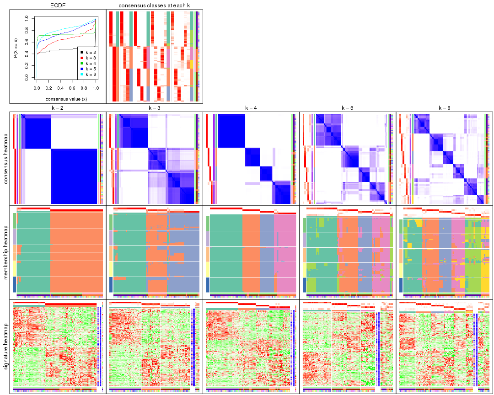

The plots are:

- The first row: a plot of the ECDF (Empirical cumulative distribution
  function) curves of the consensus matrix for each `k` and the heatmap of
  predicted classes for each `k`.
- The second row: heatmaps of the consensus matrix for each `k`.
- The third row: heatmaps of the membership matrix for each `k`.
- The fouth row: heatmaps of the signatures for each `k`.

All the plots in panels can be made by individual functions and they are
plotted later in this section.

`select_partition_number()` produces several plots showing different
statistics for choosing "optimized" `k`. There are following statistics:

- ECDF curves of the consensus matrix for each `k`;
- 1-PAC. [The PAC
  score](https://en.wikipedia.org/wiki/Consensus_clustering#Over-interpretation_potential_of_consensus_clustering)
  measures the proportion of the ambiguous subgrouping.
- Mean silhouette score.
- Concordance. The mean probability of fiting the consensus class ids in all
  partitions.
- Area increased. Denote $A_k$ as the area under the ECDF curve for current
  `k`, the area increased is defined as $A_k - A_{k-1}$.
- Rand index. The percent of pairs of samples that are both in a same cluster
  or both are not in a same cluster in the partition of k and k-1.
- Jaccard index. The ratio of pairs of samples are both in a same cluster in
  the partition of k and k-1 and the pairs of samples are both in a same
  cluster in the partition k or k-1.

The detailed explanations of these statistics can be found in [the cola
vignette](http://bioconductor.org/packages/devel/bioc/vignettes/cola/inst/doc/cola.html#toc_13).

Generally speaking, lower PAC score, higher mean silhouette score or higher
concordance corresponds to better partition. Rand index and Jaccard index
measure how similar the current partition is compared to partition with `k-1`.
If they are too similar, we won't accept `k` is better than `k-1`.

```r
select_partition_number(res)
```


The numeric values for all these statistics can be obtained by `get_stats()`.

```r
get_stats(res)
```

```
#>   k 1-PAC mean_silhouette concordance area_increased  Rand Jaccard
#> 2 2 1.000           0.973       0.988         0.4759 0.518   0.518
#> 3 3 0.729           0.841       0.902         0.3690 0.801   0.623
#> 4 4 1.000           0.965       0.983         0.1258 0.918   0.762
#> 5 5 0.730           0.669       0.848         0.0502 0.945   0.807
#> 6 6 0.755           0.736       0.832         0.0692 0.856   0.482
```

`suggest_best_k()` suggests the best $k$ based on these statistics. The rules are as follows:

- All $k$ with Jaccard index larger than 0.95 are removed because the increase of
  the partition number does not provides enough extra information. If all $k$ are removed,
  the best $k$ is assigned by `NA`.
- For $k$ with 1-PAC larger than 0.9, the maximal $k$ is taken as the "best k". Other $k$ is called "optional k".
- If it does not fit the second rule. The $k$ with the highest vote of highest
  1-PAC, mean silhouette and concordance is taken as the "best k".

```r
suggest_best_k(res)
```

```
#> [1] 4
#> attr(,"optional")
#> [1] 2
```

There is also optional best $k$ = 2 that is worth to check.

Following shows the table of the partitions (You need to click the **show/hide
code output** link to see it). The membership matrix (columns with name `p*`)
is inferred by
[`clue::cl_consensus()`](https://www.rdocumentation.org/link/cl_consensus?package=clue)
function with the `SE` method. Basically the value in the membership matrix
represents the probability to belong to a certain group. The finall class
label for an item is determined with the group with highest probability it
belongs to.

In `get_classes()` function, the entropy is calculated from the membership
matrix and the silhouette score is calculated from the consensus matrix.


<script>
$( function() {
	$( '#tabs-MAD-mclust-get-classes' ).tabs();
} );
</script>
<div id='tabs-MAD-mclust-get-classes'>
<ul>
<li><a href='#tab-MAD-mclust-get-classes-1'>k = 2</a></li>
<li><a href='#tab-MAD-mclust-get-classes-2'>k = 3</a></li>
<li><a href='#tab-MAD-mclust-get-classes-3'>k = 4</a></li>
<li><a href='#tab-MAD-mclust-get-classes-4'>k = 5</a></li>
<li><a href='#tab-MAD-mclust-get-classes-5'>k = 6</a></li>
</ul>

<div id='tab-MAD-mclust-get-classes-1'>
<p><a id='tab-MAD-mclust-get-classes-1-a' style='color:#0366d6' href='#'>show/hide code output</a></p>
<pre><code class="r">cbind(get_classes(res, k = 2), get_membership(res, k = 2))
</code></pre>

<pre><code>#&gt;           class entropy silhouette    p1    p2
#&gt; GSM372286     2  0.0000      1.000 0.000 1.000
#&gt; GSM372287     2  0.0000      1.000 0.000 1.000
#&gt; GSM372288     2  0.0000      1.000 0.000 1.000
#&gt; GSM372289     2  0.0000      1.000 0.000 1.000
#&gt; GSM372290     2  0.0000      1.000 0.000 1.000
#&gt; GSM372291     2  0.0672      0.992 0.008 0.992
#&gt; GSM372292     2  0.0000      1.000 0.000 1.000
#&gt; GSM372293     2  0.0000      1.000 0.000 1.000
#&gt; GSM372294     2  0.0000      1.000 0.000 1.000
#&gt; GSM372295     2  0.0000      1.000 0.000 1.000
#&gt; GSM372296     2  0.0000      1.000 0.000 1.000
#&gt; GSM372297     2  0.0000      1.000 0.000 1.000
#&gt; GSM372298     2  0.0000      1.000 0.000 1.000
#&gt; GSM372299     2  0.0000      1.000 0.000 1.000
#&gt; GSM372300     2  0.0000      1.000 0.000 1.000
#&gt; GSM372301     2  0.0000      1.000 0.000 1.000
#&gt; GSM372302     2  0.0000      1.000 0.000 1.000
#&gt; GSM372303     2  0.0000      1.000 0.000 1.000
#&gt; GSM372304     2  0.0000      1.000 0.000 1.000
#&gt; GSM372305     2  0.0000      1.000 0.000 1.000
#&gt; GSM372306     2  0.0000      1.000 0.000 1.000
#&gt; GSM372307     2  0.0000      1.000 0.000 1.000
#&gt; GSM372309     2  0.0000      1.000 0.000 1.000
#&gt; GSM372311     2  0.0000      1.000 0.000 1.000
#&gt; GSM372313     2  0.0000      1.000 0.000 1.000
#&gt; GSM372315     2  0.0000      1.000 0.000 1.000
#&gt; GSM372317     2  0.0000      1.000 0.000 1.000
#&gt; GSM372319     2  0.0000      1.000 0.000 1.000
#&gt; GSM372321     2  0.0000      1.000 0.000 1.000
#&gt; GSM372323     2  0.0000      1.000 0.000 1.000
#&gt; GSM372326     2  0.0000      1.000 0.000 1.000
#&gt; GSM372328     2  0.0000      1.000 0.000 1.000
#&gt; GSM372330     2  0.0000      1.000 0.000 1.000
#&gt; GSM372332     2  0.0000      1.000 0.000 1.000
#&gt; GSM372335     2  0.0000      1.000 0.000 1.000
#&gt; GSM372337     2  0.0000      1.000 0.000 1.000
#&gt; GSM372339     2  0.0000      1.000 0.000 1.000
#&gt; GSM372341     2  0.0000      1.000 0.000 1.000
#&gt; GSM372343     2  0.0000      1.000 0.000 1.000
#&gt; GSM372345     2  0.0000      1.000 0.000 1.000
#&gt; GSM372347     2  0.0000      1.000 0.000 1.000
#&gt; GSM372349     2  0.0000      1.000 0.000 1.000
#&gt; GSM372351     2  0.0000      1.000 0.000 1.000
#&gt; GSM372353     2  0.0000      1.000 0.000 1.000
#&gt; GSM372355     2  0.0000      1.000 0.000 1.000
#&gt; GSM372357     2  0.0000      1.000 0.000 1.000
#&gt; GSM372359     2  0.0000      1.000 0.000 1.000
#&gt; GSM372361     2  0.0000      1.000 0.000 1.000
#&gt; GSM372363     2  0.0000      1.000 0.000 1.000
#&gt; GSM372308     1  0.0000      0.968 1.000 0.000
#&gt; GSM372310     1  0.0000      0.968 1.000 0.000
#&gt; GSM372312     1  0.7528      0.744 0.784 0.216
#&gt; GSM372314     1  0.0000      0.968 1.000 0.000
#&gt; GSM372316     1  0.0000      0.968 1.000 0.000
#&gt; GSM372318     1  0.0000      0.968 1.000 0.000
#&gt; GSM372320     1  0.0000      0.968 1.000 0.000
#&gt; GSM372322     1  0.0000      0.968 1.000 0.000
#&gt; GSM372324     1  0.2043      0.943 0.968 0.032
#&gt; GSM372325     1  0.6148      0.825 0.848 0.152
#&gt; GSM372327     1  0.0000      0.968 1.000 0.000
#&gt; GSM372329     1  0.0000      0.968 1.000 0.000
#&gt; GSM372331     1  0.0000      0.968 1.000 0.000
#&gt; GSM372333     1  0.9608      0.419 0.616 0.384
#&gt; GSM372334     1  0.0000      0.968 1.000 0.000
#&gt; GSM372336     1  0.0000      0.968 1.000 0.000
#&gt; GSM372338     1  0.0000      0.968 1.000 0.000
#&gt; GSM372340     1  0.0000      0.968 1.000 0.000
#&gt; GSM372342     1  0.0000      0.968 1.000 0.000
#&gt; GSM372344     1  0.0000      0.968 1.000 0.000
#&gt; GSM372346     1  0.0000      0.968 1.000 0.000
#&gt; GSM372348     1  0.0000      0.968 1.000 0.000
#&gt; GSM372350     1  0.7528      0.744 0.784 0.216
#&gt; GSM372352     2  0.0672      0.992 0.008 0.992
#&gt; GSM372354     1  0.0000      0.968 1.000 0.000
#&gt; GSM372356     1  0.0000      0.968 1.000 0.000
#&gt; GSM372358     1  0.0000      0.968 1.000 0.000
#&gt; GSM372360     1  0.0000      0.968 1.000 0.000
#&gt; GSM372362     1  0.0000      0.968 1.000 0.000
#&gt; GSM372364     1  0.0000      0.968 1.000 0.000
#&gt; GSM372365     1  0.0000      0.968 1.000 0.000
#&gt; GSM372366     1  0.0000      0.968 1.000 0.000
#&gt; GSM372367     1  0.0000      0.968 1.000 0.000
</code></pre>

<script>
$('#tab-MAD-mclust-get-classes-1-a').parent().next().next().hide();
$('#tab-MAD-mclust-get-classes-1-a').click(function(){
  $('#tab-MAD-mclust-get-classes-1-a').parent().next().next().toggle();
  return(false);
});
</script>
</div>

<div id='tab-MAD-mclust-get-classes-2'>
<p><a id='tab-MAD-mclust-get-classes-2-a' style='color:#0366d6' href='#'>show/hide code output</a></p>
<pre><code class="r">cbind(get_classes(res, k = 3), get_membership(res, k = 3))
</code></pre>

<pre><code>#&gt;           class entropy silhouette    p1    p2    p3
#&gt; GSM372286     3  0.0747      0.841 0.000 0.016 0.984
#&gt; GSM372287     2  0.1860      0.872 0.000 0.948 0.052
#&gt; GSM372288     2  0.4062      0.876 0.000 0.836 0.164
#&gt; GSM372289     2  0.4235      0.869 0.000 0.824 0.176
#&gt; GSM372290     2  0.4121      0.872 0.000 0.832 0.168
#&gt; GSM372291     2  0.2229      0.857 0.012 0.944 0.044
#&gt; GSM372292     2  0.3752      0.881 0.000 0.856 0.144
#&gt; GSM372293     2  0.4974      0.777 0.000 0.764 0.236
#&gt; GSM372294     2  0.2261      0.873 0.000 0.932 0.068
#&gt; GSM372295     2  0.1753      0.870 0.000 0.952 0.048
#&gt; GSM372296     2  0.4002      0.877 0.000 0.840 0.160
#&gt; GSM372297     2  0.1860      0.872 0.000 0.948 0.052
#&gt; GSM372298     2  0.3038      0.886 0.000 0.896 0.104
#&gt; GSM372299     2  0.2356      0.863 0.000 0.928 0.072
#&gt; GSM372300     2  0.3619      0.882 0.000 0.864 0.136
#&gt; GSM372301     2  0.3816      0.880 0.000 0.852 0.148
#&gt; GSM372302     2  0.2537      0.882 0.000 0.920 0.080
#&gt; GSM372303     2  0.3816      0.876 0.000 0.852 0.148
#&gt; GSM372304     2  0.1860      0.872 0.000 0.948 0.052
#&gt; GSM372305     3  0.0424      0.841 0.000 0.008 0.992
#&gt; GSM372306     3  0.0424      0.841 0.000 0.008 0.992
#&gt; GSM372307     2  0.6062      0.499 0.000 0.616 0.384
#&gt; GSM372309     3  0.0747      0.841 0.000 0.016 0.984
#&gt; GSM372311     3  0.1031      0.835 0.000 0.024 0.976
#&gt; GSM372313     3  0.0424      0.841 0.000 0.008 0.992
#&gt; GSM372315     3  0.6309     -0.216 0.000 0.500 0.500
#&gt; GSM372317     3  0.0424      0.841 0.000 0.008 0.992
#&gt; GSM372319     3  0.4399      0.781 0.000 0.188 0.812
#&gt; GSM372321     3  0.4452      0.782 0.000 0.192 0.808
#&gt; GSM372323     3  0.3752      0.812 0.000 0.144 0.856
#&gt; GSM372326     3  0.3816      0.810 0.000 0.148 0.852
#&gt; GSM372328     3  0.4702      0.772 0.000 0.212 0.788
#&gt; GSM372330     3  0.0424      0.841 0.000 0.008 0.992
#&gt; GSM372332     3  0.4702      0.772 0.000 0.212 0.788
#&gt; GSM372335     3  0.0424      0.841 0.000 0.008 0.992
#&gt; GSM372337     3  0.3752      0.812 0.000 0.144 0.856
#&gt; GSM372339     3  0.4702      0.772 0.000 0.212 0.788
#&gt; GSM372341     3  0.4702      0.772 0.000 0.212 0.788
#&gt; GSM372343     3  0.4702      0.772 0.000 0.212 0.788
#&gt; GSM372345     3  0.3752      0.812 0.000 0.144 0.856
#&gt; GSM372347     3  0.0237      0.840 0.000 0.004 0.996
#&gt; GSM372349     3  0.4702      0.772 0.000 0.212 0.788
#&gt; GSM372351     3  0.4555      0.778 0.000 0.200 0.800
#&gt; GSM372353     3  0.0892      0.834 0.000 0.020 0.980
#&gt; GSM372355     3  0.0424      0.841 0.000 0.008 0.992
#&gt; GSM372357     3  0.0424      0.841 0.000 0.008 0.992
#&gt; GSM372359     3  0.0424      0.841 0.000 0.008 0.992
#&gt; GSM372361     2  0.6286      0.214 0.000 0.536 0.464
#&gt; GSM372363     3  0.0592      0.840 0.000 0.012 0.988
#&gt; GSM372308     1  0.1643      0.956 0.956 0.044 0.000
#&gt; GSM372310     1  0.1643      0.956 0.956 0.044 0.000
#&gt; GSM372312     1  0.5551      0.788 0.768 0.212 0.020
#&gt; GSM372314     1  0.1643      0.956 0.956 0.044 0.000
#&gt; GSM372316     1  0.0000      0.966 1.000 0.000 0.000
#&gt; GSM372318     1  0.0000      0.966 1.000 0.000 0.000
#&gt; GSM372320     1  0.0000      0.966 1.000 0.000 0.000
#&gt; GSM372322     1  0.0000      0.966 1.000 0.000 0.000
#&gt; GSM372324     1  0.5276      0.861 0.820 0.128 0.052
#&gt; GSM372325     1  0.5067      0.871 0.832 0.116 0.052
#&gt; GSM372327     1  0.0000      0.966 1.000 0.000 0.000
#&gt; GSM372329     1  0.0000      0.966 1.000 0.000 0.000
#&gt; GSM372331     1  0.1643      0.956 0.956 0.044 0.000
#&gt; GSM372333     3  0.8822      0.268 0.324 0.136 0.540
#&gt; GSM372334     1  0.0000      0.966 1.000 0.000 0.000
#&gt; GSM372336     1  0.0237      0.965 0.996 0.004 0.000
#&gt; GSM372338     1  0.0000      0.966 1.000 0.000 0.000
#&gt; GSM372340     1  0.0000      0.966 1.000 0.000 0.000
#&gt; GSM372342     1  0.0000      0.966 1.000 0.000 0.000
#&gt; GSM372344     1  0.1411      0.949 0.964 0.036 0.000
#&gt; GSM372346     1  0.0000      0.966 1.000 0.000 0.000
#&gt; GSM372348     1  0.0237      0.965 0.996 0.004 0.000
#&gt; GSM372350     1  0.6016      0.722 0.724 0.256 0.020
#&gt; GSM372352     3  0.8081      0.559 0.136 0.220 0.644
#&gt; GSM372354     1  0.0000      0.966 1.000 0.000 0.000
#&gt; GSM372356     1  0.1643      0.956 0.956 0.044 0.000
#&gt; GSM372358     1  0.0000      0.966 1.000 0.000 0.000
#&gt; GSM372360     1  0.0000      0.966 1.000 0.000 0.000
#&gt; GSM372362     1  0.0000      0.966 1.000 0.000 0.000
#&gt; GSM372364     1  0.1529      0.957 0.960 0.040 0.000
#&gt; GSM372365     1  0.1643      0.956 0.956 0.044 0.000
#&gt; GSM372366     1  0.0000      0.966 1.000 0.000 0.000
#&gt; GSM372367     1  0.1643      0.956 0.956 0.044 0.000
</code></pre>

<script>
$('#tab-MAD-mclust-get-classes-2-a').parent().next().next().hide();
$('#tab-MAD-mclust-get-classes-2-a').click(function(){
  $('#tab-MAD-mclust-get-classes-2-a').parent().next().next().toggle();
  return(false);
});
</script>
</div>

<div id='tab-MAD-mclust-get-classes-3'>
<p><a id='tab-MAD-mclust-get-classes-3-a' style='color:#0366d6' href='#'>show/hide code output</a></p>
<pre><code class="r">cbind(get_classes(res, k = 4), get_membership(res, k = 4))
</code></pre>

<pre><code>#&gt;           class entropy silhouette    p1    p2    p3    p4
#&gt; GSM372286     2  0.0000      0.992 0.000 1.000 0.000 0.000
#&gt; GSM372287     4  0.0188      0.936 0.000 0.000 0.004 0.996
#&gt; GSM372288     4  0.0000      0.937 0.000 0.000 0.000 1.000
#&gt; GSM372289     4  0.0000      0.937 0.000 0.000 0.000 1.000
#&gt; GSM372290     4  0.0000      0.937 0.000 0.000 0.000 1.000
#&gt; GSM372291     4  0.0524      0.933 0.000 0.008 0.004 0.988
#&gt; GSM372292     4  0.0000      0.937 0.000 0.000 0.000 1.000
#&gt; GSM372293     4  0.4746      0.402 0.000 0.000 0.368 0.632
#&gt; GSM372294     4  0.0469      0.933 0.000 0.012 0.000 0.988
#&gt; GSM372295     4  0.0188      0.936 0.000 0.000 0.004 0.996
#&gt; GSM372296     4  0.0000      0.937 0.000 0.000 0.000 1.000
#&gt; GSM372297     4  0.0188      0.936 0.000 0.000 0.004 0.996
#&gt; GSM372298     4  0.0000      0.937 0.000 0.000 0.000 1.000
#&gt; GSM372299     4  0.0524      0.933 0.000 0.008 0.004 0.988
#&gt; GSM372300     4  0.0336      0.934 0.000 0.000 0.008 0.992
#&gt; GSM372301     4  0.0336      0.934 0.000 0.000 0.008 0.992
#&gt; GSM372302     4  0.0000      0.937 0.000 0.000 0.000 1.000
#&gt; GSM372303     4  0.0592      0.928 0.000 0.000 0.016 0.984
#&gt; GSM372304     4  0.0000      0.937 0.000 0.000 0.000 1.000
#&gt; GSM372305     2  0.0000      0.992 0.000 1.000 0.000 0.000
#&gt; GSM372306     2  0.0336      0.995 0.000 0.992 0.008 0.000
#&gt; GSM372307     4  0.3873      0.720 0.000 0.228 0.000 0.772
#&gt; GSM372309     2  0.0336      0.995 0.000 0.992 0.008 0.000
#&gt; GSM372311     2  0.0000      0.992 0.000 1.000 0.000 0.000
#&gt; GSM372313     2  0.0336      0.995 0.000 0.992 0.008 0.000
#&gt; GSM372315     4  0.4103      0.681 0.000 0.256 0.000 0.744
#&gt; GSM372317     2  0.0336      0.995 0.000 0.992 0.008 0.000
#&gt; GSM372319     3  0.0188      0.996 0.000 0.000 0.996 0.004
#&gt; GSM372321     3  0.0188      0.995 0.000 0.004 0.996 0.000
#&gt; GSM372323     3  0.0188      0.995 0.000 0.004 0.996 0.000
#&gt; GSM372326     3  0.0188      0.995 0.000 0.004 0.996 0.000
#&gt; GSM372328     3  0.0188      0.996 0.000 0.000 0.996 0.004
#&gt; GSM372330     2  0.0336      0.995 0.000 0.992 0.008 0.000
#&gt; GSM372332     3  0.0469      0.990 0.000 0.000 0.988 0.012
#&gt; GSM372335     2  0.0336      0.995 0.000 0.992 0.008 0.000
#&gt; GSM372337     3  0.0188      0.995 0.000 0.004 0.996 0.000
#&gt; GSM372339     3  0.0188      0.996 0.000 0.000 0.996 0.004
#&gt; GSM372341     3  0.0188      0.996 0.000 0.000 0.996 0.004
#&gt; GSM372343     3  0.0188      0.996 0.000 0.000 0.996 0.004
#&gt; GSM372345     3  0.0188      0.995 0.000 0.004 0.996 0.000
#&gt; GSM372347     2  0.0336      0.995 0.000 0.992 0.008 0.000
#&gt; GSM372349     3  0.0469      0.990 0.000 0.000 0.988 0.012
#&gt; GSM372351     3  0.0188      0.996 0.000 0.000 0.996 0.004
#&gt; GSM372353     2  0.0336      0.995 0.000 0.992 0.008 0.000
#&gt; GSM372355     2  0.0336      0.995 0.000 0.992 0.008 0.000
#&gt; GSM372357     2  0.0336      0.995 0.000 0.992 0.008 0.000
#&gt; GSM372359     2  0.0336      0.995 0.000 0.992 0.008 0.000
#&gt; GSM372361     4  0.4072      0.687 0.000 0.252 0.000 0.748
#&gt; GSM372363     2  0.0000      0.992 0.000 1.000 0.000 0.000
#&gt; GSM372308     1  0.0000      0.999 1.000 0.000 0.000 0.000
#&gt; GSM372310     1  0.0000      0.999 1.000 0.000 0.000 0.000
#&gt; GSM372312     1  0.0524      0.989 0.988 0.008 0.004 0.000
#&gt; GSM372314     1  0.0000      0.999 1.000 0.000 0.000 0.000
#&gt; GSM372316     1  0.0000      0.999 1.000 0.000 0.000 0.000
#&gt; GSM372318     1  0.0000      0.999 1.000 0.000 0.000 0.000
#&gt; GSM372320     1  0.0000      0.999 1.000 0.000 0.000 0.000
#&gt; GSM372322     1  0.0000      0.999 1.000 0.000 0.000 0.000
#&gt; GSM372324     1  0.0000      0.999 1.000 0.000 0.000 0.000
#&gt; GSM372325     1  0.0000      0.999 1.000 0.000 0.000 0.000
#&gt; GSM372327     1  0.0000      0.999 1.000 0.000 0.000 0.000
#&gt; GSM372329     1  0.0000      0.999 1.000 0.000 0.000 0.000
#&gt; GSM372331     1  0.0000      0.999 1.000 0.000 0.000 0.000
#&gt; GSM372333     2  0.1022      0.960 0.032 0.968 0.000 0.000
#&gt; GSM372334     1  0.0000      0.999 1.000 0.000 0.000 0.000
#&gt; GSM372336     1  0.0000      0.999 1.000 0.000 0.000 0.000
#&gt; GSM372338     1  0.0000      0.999 1.000 0.000 0.000 0.000
#&gt; GSM372340     1  0.0000      0.999 1.000 0.000 0.000 0.000
#&gt; GSM372342     1  0.0000      0.999 1.000 0.000 0.000 0.000
#&gt; GSM372344     1  0.0000      0.999 1.000 0.000 0.000 0.000
#&gt; GSM372346     1  0.0000      0.999 1.000 0.000 0.000 0.000
#&gt; GSM372348     1  0.0000      0.999 1.000 0.000 0.000 0.000
#&gt; GSM372350     1  0.0524      0.989 0.988 0.008 0.004 0.000
#&gt; GSM372352     2  0.0188      0.989 0.000 0.996 0.004 0.000
#&gt; GSM372354     1  0.0000      0.999 1.000 0.000 0.000 0.000
#&gt; GSM372356     1  0.0000      0.999 1.000 0.000 0.000 0.000
#&gt; GSM372358     1  0.0000      0.999 1.000 0.000 0.000 0.000
#&gt; GSM372360     1  0.0000      0.999 1.000 0.000 0.000 0.000
#&gt; GSM372362     1  0.0000      0.999 1.000 0.000 0.000 0.000
#&gt; GSM372364     1  0.0000      0.999 1.000 0.000 0.000 0.000
#&gt; GSM372365     1  0.0000      0.999 1.000 0.000 0.000 0.000
#&gt; GSM372366     1  0.0000      0.999 1.000 0.000 0.000 0.000
#&gt; GSM372367     1  0.0000      0.999 1.000 0.000 0.000 0.000
</code></pre>

<script>
$('#tab-MAD-mclust-get-classes-3-a').parent().next().next().hide();
$('#tab-MAD-mclust-get-classes-3-a').click(function(){
  $('#tab-MAD-mclust-get-classes-3-a').parent().next().next().toggle();
  return(false);
});
</script>
</div>

<div id='tab-MAD-mclust-get-classes-4'>
<p><a id='tab-MAD-mclust-get-classes-4-a' style='color:#0366d6' href='#'>show/hide code output</a></p>
<pre><code class="r">cbind(get_classes(res, k = 5), get_membership(res, k = 5))
</code></pre>

<pre><code>#&gt;           class entropy silhouette    p1    p2    p3    p4    p5
#&gt; GSM372286     2  0.1485     0.7891 0.000 0.948 0.000 0.020 0.032
#&gt; GSM372287     4  0.0162     0.6346 0.000 0.004 0.000 0.996 0.000
#&gt; GSM372288     4  0.2036     0.6283 0.000 0.056 0.000 0.920 0.024
#&gt; GSM372289     4  0.4021     0.5291 0.000 0.200 0.000 0.764 0.036
#&gt; GSM372290     4  0.4976     0.2986 0.000 0.468 0.000 0.504 0.028
#&gt; GSM372291     5  0.4734     0.1151 0.000 0.000 0.024 0.372 0.604
#&gt; GSM372292     4  0.4384     0.5935 0.000 0.324 0.016 0.660 0.000
#&gt; GSM372293     4  0.4150     0.2522 0.000 0.000 0.388 0.612 0.000
#&gt; GSM372294     4  0.4129     0.5134 0.000 0.204 0.000 0.756 0.040
#&gt; GSM372295     4  0.0510     0.6275 0.000 0.000 0.016 0.984 0.000
#&gt; GSM372296     4  0.4238     0.5432 0.000 0.368 0.000 0.628 0.004
#&gt; GSM372297     4  0.0162     0.6346 0.000 0.004 0.000 0.996 0.000
#&gt; GSM372298     4  0.0162     0.6346 0.000 0.004 0.000 0.996 0.000
#&gt; GSM372299     4  0.5367     0.3700 0.000 0.196 0.020 0.696 0.088
#&gt; GSM372300     4  0.4558     0.5902 0.000 0.324 0.024 0.652 0.000
#&gt; GSM372301     4  0.4384     0.5935 0.000 0.324 0.016 0.660 0.000
#&gt; GSM372302     4  0.3452     0.6522 0.000 0.244 0.000 0.756 0.000
#&gt; GSM372303     4  0.4786     0.5997 0.000 0.308 0.040 0.652 0.000
#&gt; GSM372304     4  0.0162     0.6346 0.000 0.004 0.000 0.996 0.000
#&gt; GSM372305     2  0.0000     0.8119 0.000 1.000 0.000 0.000 0.000
#&gt; GSM372306     2  0.0162     0.8111 0.000 0.996 0.004 0.000 0.000
#&gt; GSM372307     2  0.4733     0.1934 0.000 0.624 0.000 0.348 0.028
#&gt; GSM372309     2  0.0000     0.8119 0.000 1.000 0.000 0.000 0.000
#&gt; GSM372311     2  0.0000     0.8119 0.000 1.000 0.000 0.000 0.000
#&gt; GSM372313     2  0.2843     0.6660 0.000 0.848 0.000 0.144 0.008
#&gt; GSM372315     2  0.4718     0.2021 0.000 0.628 0.000 0.344 0.028
#&gt; GSM372317     2  0.0000     0.8119 0.000 1.000 0.000 0.000 0.000
#&gt; GSM372319     3  0.4028     0.7450 0.000 0.048 0.776 0.176 0.000
#&gt; GSM372321     3  0.0703     0.8857 0.000 0.000 0.976 0.024 0.000
#&gt; GSM372323     3  0.0510     0.8881 0.000 0.016 0.984 0.000 0.000
#&gt; GSM372326     3  0.0000     0.8928 0.000 0.000 1.000 0.000 0.000
#&gt; GSM372328     3  0.0000     0.8928 0.000 0.000 1.000 0.000 0.000
#&gt; GSM372330     2  0.0703     0.8006 0.000 0.976 0.000 0.000 0.024
#&gt; GSM372332     3  0.3655     0.7785 0.000 0.036 0.804 0.160 0.000
#&gt; GSM372335     2  0.0290     0.8092 0.000 0.992 0.008 0.000 0.000
#&gt; GSM372337     3  0.0510     0.8881 0.000 0.016 0.984 0.000 0.000
#&gt; GSM372339     3  0.0000     0.8928 0.000 0.000 1.000 0.000 0.000
#&gt; GSM372341     3  0.0000     0.8928 0.000 0.000 1.000 0.000 0.000
#&gt; GSM372343     3  0.0000     0.8928 0.000 0.000 1.000 0.000 0.000
#&gt; GSM372345     3  0.0510     0.8881 0.000 0.016 0.984 0.000 0.000
#&gt; GSM372347     2  0.2909     0.7022 0.000 0.848 0.140 0.000 0.012
#&gt; GSM372349     3  0.4481     0.6906 0.000 0.048 0.720 0.232 0.000
#&gt; GSM372351     3  0.4150     0.7225 0.000 0.036 0.748 0.216 0.000
#&gt; GSM372353     2  0.1831     0.7592 0.000 0.920 0.076 0.000 0.004
#&gt; GSM372355     2  0.0000     0.8119 0.000 1.000 0.000 0.000 0.000
#&gt; GSM372357     2  0.0000     0.8119 0.000 1.000 0.000 0.000 0.000
#&gt; GSM372359     2  0.0290     0.8092 0.000 0.992 0.008 0.000 0.000
#&gt; GSM372361     2  0.4485     0.3441 0.000 0.680 0.000 0.292 0.028
#&gt; GSM372363     2  0.0000     0.8119 0.000 1.000 0.000 0.000 0.000
#&gt; GSM372308     1  0.3895     0.6225 0.680 0.000 0.000 0.000 0.320
#&gt; GSM372310     1  0.3730     0.6600 0.712 0.000 0.000 0.000 0.288
#&gt; GSM372312     5  0.2813     0.4668 0.168 0.000 0.000 0.000 0.832
#&gt; GSM372314     1  0.3661     0.6707 0.724 0.000 0.000 0.000 0.276
#&gt; GSM372316     1  0.0162     0.8082 0.996 0.000 0.000 0.000 0.004
#&gt; GSM372318     1  0.2424     0.7278 0.868 0.000 0.000 0.000 0.132
#&gt; GSM372320     1  0.2516     0.7396 0.860 0.000 0.000 0.000 0.140
#&gt; GSM372322     1  0.0609     0.8042 0.980 0.000 0.000 0.000 0.020
#&gt; GSM372324     1  0.3661     0.6727 0.724 0.000 0.000 0.000 0.276
#&gt; GSM372325     1  0.3796     0.6469 0.700 0.000 0.000 0.000 0.300
#&gt; GSM372327     1  0.2516     0.7396 0.860 0.000 0.000 0.000 0.140
#&gt; GSM372329     1  0.0404     0.8080 0.988 0.000 0.000 0.000 0.012
#&gt; GSM372331     1  0.3274     0.7113 0.780 0.000 0.000 0.000 0.220
#&gt; GSM372333     2  0.7109    -0.0658 0.228 0.456 0.024 0.000 0.292
#&gt; GSM372334     1  0.2516     0.7396 0.860 0.000 0.000 0.000 0.140
#&gt; GSM372336     1  0.1043     0.8044 0.960 0.000 0.000 0.000 0.040
#&gt; GSM372338     1  0.2516     0.7396 0.860 0.000 0.000 0.000 0.140
#&gt; GSM372340     1  0.2516     0.7396 0.860 0.000 0.000 0.000 0.140
#&gt; GSM372342     1  0.1270     0.7931 0.948 0.000 0.000 0.000 0.052
#&gt; GSM372344     1  0.4074     0.3871 0.636 0.000 0.000 0.000 0.364
#&gt; GSM372346     1  0.2852     0.6762 0.828 0.000 0.000 0.000 0.172
#&gt; GSM372348     1  0.1043     0.8044 0.960 0.000 0.000 0.000 0.040
#&gt; GSM372350     5  0.3817     0.4647 0.252 0.000 0.004 0.004 0.740
#&gt; GSM372352     2  0.7276    -0.0303 0.000 0.404 0.024 0.272 0.300
#&gt; GSM372354     1  0.0510     0.8050 0.984 0.000 0.000 0.000 0.016
#&gt; GSM372356     1  0.3612     0.6774 0.732 0.000 0.000 0.000 0.268
#&gt; GSM372358     1  0.0162     0.8082 0.996 0.000 0.000 0.000 0.004
#&gt; GSM372360     1  0.0162     0.8082 0.996 0.000 0.000 0.000 0.004
#&gt; GSM372362     1  0.0000     0.8080 1.000 0.000 0.000 0.000 0.000
#&gt; GSM372364     1  0.1043     0.8044 0.960 0.000 0.000 0.000 0.040
#&gt; GSM372365     1  0.3949     0.6062 0.668 0.000 0.000 0.000 0.332
#&gt; GSM372366     1  0.0404     0.8061 0.988 0.000 0.000 0.000 0.012
#&gt; GSM372367     1  0.3661     0.6707 0.724 0.000 0.000 0.000 0.276
</code></pre>

<script>
$('#tab-MAD-mclust-get-classes-4-a').parent().next().next().hide();
$('#tab-MAD-mclust-get-classes-4-a').click(function(){
  $('#tab-MAD-mclust-get-classes-4-a').parent().next().next().toggle();
  return(false);
});
</script>
</div>

<div id='tab-MAD-mclust-get-classes-5'>
<p><a id='tab-MAD-mclust-get-classes-5-a' style='color:#0366d6' href='#'>show/hide code output</a></p>
<pre><code class="r">cbind(get_classes(res, k = 6), get_membership(res, k = 6))
</code></pre>

<pre><code>#&gt;           class entropy silhouette    p1    p2    p3    p4    p5    p6
#&gt; GSM372286     2  0.2491      0.785 0.000 0.836 0.000 0.164 0.000 0.000
#&gt; GSM372287     4  0.2883      0.561 0.000 0.000 0.000 0.788 0.000 0.212
#&gt; GSM372288     4  0.0260      0.667 0.000 0.008 0.000 0.992 0.000 0.000
#&gt; GSM372289     4  0.0458      0.667 0.000 0.016 0.000 0.984 0.000 0.000
#&gt; GSM372290     4  0.2350      0.625 0.000 0.100 0.000 0.880 0.000 0.020
#&gt; GSM372291     6  0.4052      0.698 0.008 0.000 0.048 0.116 0.032 0.796
#&gt; GSM372292     6  0.5137      0.498 0.000 0.064 0.008 0.408 0.000 0.520
#&gt; GSM372293     6  0.5961      0.657 0.000 0.016 0.248 0.200 0.000 0.536
#&gt; GSM372294     4  0.1367      0.663 0.000 0.012 0.000 0.944 0.000 0.044
#&gt; GSM372295     6  0.4201      0.721 0.000 0.000 0.036 0.300 0.000 0.664
#&gt; GSM372296     4  0.2365      0.644 0.000 0.072 0.000 0.888 0.000 0.040
#&gt; GSM372297     4  0.2883      0.561 0.000 0.000 0.000 0.788 0.000 0.212
#&gt; GSM372298     4  0.2340      0.595 0.000 0.000 0.000 0.852 0.000 0.148
#&gt; GSM372299     6  0.5394      0.758 0.000 0.004 0.040 0.216 0.084 0.656
#&gt; GSM372300     6  0.5655      0.793 0.000 0.060 0.072 0.236 0.004 0.628
#&gt; GSM372301     6  0.5456      0.775 0.000 0.064 0.052 0.264 0.000 0.620
#&gt; GSM372302     4  0.2562      0.572 0.000 0.000 0.000 0.828 0.000 0.172
#&gt; GSM372303     6  0.5763      0.787 0.000 0.060 0.100 0.224 0.000 0.616
#&gt; GSM372304     4  0.2823      0.569 0.000 0.000 0.000 0.796 0.000 0.204
#&gt; GSM372305     2  0.1152      0.896 0.000 0.952 0.004 0.044 0.000 0.000
#&gt; GSM372306     2  0.0405      0.892 0.000 0.988 0.004 0.000 0.000 0.008
#&gt; GSM372307     4  0.3819      0.478 0.000 0.280 0.000 0.700 0.000 0.020
#&gt; GSM372309     2  0.0405      0.893 0.000 0.988 0.004 0.000 0.000 0.008
#&gt; GSM372311     2  0.1007      0.896 0.000 0.956 0.000 0.044 0.000 0.000
#&gt; GSM372313     2  0.1152      0.895 0.000 0.952 0.000 0.044 0.000 0.004
#&gt; GSM372315     4  0.4131      0.401 0.000 0.356 0.000 0.624 0.000 0.020
#&gt; GSM372317     2  0.0937      0.896 0.000 0.960 0.000 0.040 0.000 0.000
#&gt; GSM372319     2  0.4620      0.206 0.000 0.532 0.428 0.040 0.000 0.000
#&gt; GSM372321     3  0.2442      0.866 0.000 0.144 0.852 0.004 0.000 0.000
#&gt; GSM372323     3  0.2695      0.862 0.000 0.144 0.844 0.000 0.008 0.004
#&gt; GSM372326     3  0.0972      0.913 0.000 0.028 0.964 0.000 0.008 0.000
#&gt; GSM372328     3  0.0146      0.913 0.000 0.000 0.996 0.000 0.000 0.004
#&gt; GSM372330     2  0.2146      0.838 0.000 0.880 0.000 0.116 0.000 0.004
#&gt; GSM372332     3  0.1149      0.909 0.000 0.024 0.960 0.008 0.000 0.008
#&gt; GSM372335     2  0.0260      0.893 0.000 0.992 0.000 0.000 0.000 0.008
#&gt; GSM372337     3  0.2695      0.862 0.000 0.144 0.844 0.000 0.008 0.004
#&gt; GSM372339     3  0.0146      0.913 0.000 0.000 0.996 0.000 0.000 0.004
#&gt; GSM372341     3  0.0291      0.913 0.000 0.000 0.992 0.004 0.000 0.004
#&gt; GSM372343     3  0.0291      0.913 0.000 0.000 0.992 0.004 0.000 0.004
#&gt; GSM372345     3  0.2695      0.862 0.000 0.144 0.844 0.000 0.008 0.004
#&gt; GSM372347     2  0.4048      0.740 0.000 0.788 0.120 0.000 0.044 0.048
#&gt; GSM372349     3  0.1875      0.883 0.000 0.032 0.928 0.020 0.000 0.020
#&gt; GSM372351     3  0.1251      0.905 0.000 0.012 0.956 0.008 0.000 0.024
#&gt; GSM372353     2  0.2915      0.716 0.000 0.808 0.184 0.000 0.008 0.000
#&gt; GSM372355     2  0.1152      0.895 0.000 0.952 0.000 0.044 0.000 0.004
#&gt; GSM372357     2  0.0260      0.893 0.000 0.992 0.000 0.000 0.000 0.008
#&gt; GSM372359     2  0.0260      0.893 0.000 0.992 0.000 0.000 0.000 0.008
#&gt; GSM372361     4  0.4282      0.254 0.000 0.420 0.000 0.560 0.000 0.020
#&gt; GSM372363     2  0.1007      0.896 0.000 0.956 0.000 0.044 0.000 0.000
#&gt; GSM372308     5  0.1168      0.809 0.028 0.000 0.000 0.000 0.956 0.016
#&gt; GSM372310     5  0.0790      0.812 0.032 0.000 0.000 0.000 0.968 0.000
#&gt; GSM372312     5  0.1644      0.797 0.040 0.000 0.000 0.000 0.932 0.028
#&gt; GSM372314     5  0.1863      0.812 0.060 0.004 0.000 0.000 0.920 0.016
#&gt; GSM372316     1  0.3417      0.760 0.796 0.000 0.000 0.000 0.160 0.044
#&gt; GSM372318     1  0.3563      0.801 0.800 0.000 0.000 0.000 0.092 0.108
#&gt; GSM372320     1  0.1049      0.826 0.960 0.000 0.000 0.000 0.008 0.032
#&gt; GSM372322     1  0.1556      0.831 0.920 0.000 0.000 0.000 0.080 0.000
#&gt; GSM372324     5  0.3516      0.789 0.096 0.004 0.000 0.000 0.812 0.088
#&gt; GSM372325     5  0.2504      0.779 0.028 0.004 0.000 0.000 0.880 0.088
#&gt; GSM372327     1  0.0622      0.829 0.980 0.000 0.000 0.000 0.008 0.012
#&gt; GSM372329     1  0.2199      0.824 0.892 0.000 0.000 0.000 0.088 0.020
#&gt; GSM372331     5  0.2744      0.771 0.144 0.000 0.000 0.000 0.840 0.016
#&gt; GSM372333     5  0.4377      0.679 0.000 0.100 0.044 0.000 0.768 0.088
#&gt; GSM372334     1  0.1049      0.826 0.960 0.000 0.000 0.000 0.008 0.032
#&gt; GSM372336     5  0.4616      0.477 0.316 0.000 0.000 0.000 0.624 0.060
#&gt; GSM372338     1  0.1049      0.826 0.960 0.000 0.000 0.000 0.008 0.032
#&gt; GSM372340     1  0.1049      0.826 0.960 0.000 0.000 0.000 0.008 0.032
#&gt; GSM372342     1  0.1075      0.834 0.952 0.000 0.000 0.000 0.048 0.000
#&gt; GSM372344     1  0.2092      0.772 0.876 0.000 0.000 0.000 0.000 0.124
#&gt; GSM372346     1  0.3514      0.801 0.804 0.000 0.000 0.000 0.088 0.108
#&gt; GSM372348     5  0.4619      0.412 0.348 0.000 0.000 0.000 0.600 0.052
#&gt; GSM372350     1  0.3909      0.703 0.772 0.000 0.000 0.004 0.076 0.148
#&gt; GSM372352     5  0.6071      0.407 0.000 0.176 0.052 0.004 0.600 0.168
#&gt; GSM372354     1  0.2795      0.828 0.856 0.000 0.000 0.000 0.100 0.044
#&gt; GSM372356     5  0.2704      0.759 0.140 0.000 0.000 0.000 0.844 0.016
#&gt; GSM372358     1  0.4845      0.251 0.540 0.000 0.000 0.000 0.400 0.060
#&gt; GSM372360     1  0.4845      0.251 0.540 0.000 0.000 0.000 0.400 0.060
#&gt; GSM372362     1  0.4215      0.634 0.700 0.000 0.000 0.000 0.244 0.056
#&gt; GSM372364     5  0.4724      0.389 0.348 0.000 0.000 0.000 0.592 0.060
#&gt; GSM372365     5  0.0972      0.811 0.028 0.000 0.000 0.000 0.964 0.008
#&gt; GSM372366     1  0.2605      0.813 0.864 0.000 0.000 0.000 0.108 0.028
#&gt; GSM372367     5  0.1152      0.811 0.044 0.000 0.000 0.000 0.952 0.004
</code></pre>

<script>
$('#tab-MAD-mclust-get-classes-5-a').parent().next().next().hide();
$('#tab-MAD-mclust-get-classes-5-a').click(function(){
  $('#tab-MAD-mclust-get-classes-5-a').parent().next().next().toggle();
  return(false);
});
</script>
</div>
</div>

Heatmaps for the consensus matrix. It visualizes the probability of two
samples to be in a same group.


<script>
$( function() {
	$( '#tabs-MAD-mclust-consensus-heatmap' ).tabs();
} );
</script>
<div id='tabs-MAD-mclust-consensus-heatmap'>
<ul>
<li><a href='#tab-MAD-mclust-consensus-heatmap-1'>k = 2</a></li>
<li><a href='#tab-MAD-mclust-consensus-heatmap-2'>k = 3</a></li>
<li><a href='#tab-MAD-mclust-consensus-heatmap-3'>k = 4</a></li>
<li><a href='#tab-MAD-mclust-consensus-heatmap-4'>k = 5</a></li>
<li><a href='#tab-MAD-mclust-consensus-heatmap-5'>k = 6</a></li>
</ul>
<div id='tab-MAD-mclust-consensus-heatmap-1'>
<pre><code class="r">consensus_heatmap(res, k = 2)
</code></pre>

<p></p>

</div>
<div id='tab-MAD-mclust-consensus-heatmap-2'>
<pre><code class="r">consensus_heatmap(res, k = 3)
</code></pre>

<p></p>

</div>
<div id='tab-MAD-mclust-consensus-heatmap-3'>
<pre><code class="r">consensus_heatmap(res, k = 4)
</code></pre>

<p></p>

</div>
<div id='tab-MAD-mclust-consensus-heatmap-4'>
<pre><code class="r">consensus_heatmap(res, k = 5)
</code></pre>

<p></p>

</div>
<div id='tab-MAD-mclust-consensus-heatmap-5'>
<pre><code class="r">consensus_heatmap(res, k = 6)
</code></pre>

<p></p>

</div>
</div>

Heatmaps for the membership of samples in all partitions to see how consistent they are:


<script>
$( function() {
	$( '#tabs-MAD-mclust-membership-heatmap' ).tabs();
} );
</script>
<div id='tabs-MAD-mclust-membership-heatmap'>
<ul>
<li><a href='#tab-MAD-mclust-membership-heatmap-1'>k = 2</a></li>
<li><a href='#tab-MAD-mclust-membership-heatmap-2'>k = 3</a></li>
<li><a href='#tab-MAD-mclust-membership-heatmap-3'>k = 4</a></li>
<li><a href='#tab-MAD-mclust-membership-heatmap-4'>k = 5</a></li>
<li><a href='#tab-MAD-mclust-membership-heatmap-5'>k = 6</a></li>
</ul>
<div id='tab-MAD-mclust-membership-heatmap-1'>
<pre><code class="r">membership_heatmap(res, k = 2)
</code></pre>

<p></p>

</div>
<div id='tab-MAD-mclust-membership-heatmap-2'>
<pre><code class="r">membership_heatmap(res, k = 3)
</code></pre>

<p></p>

</div>
<div id='tab-MAD-mclust-membership-heatmap-3'>
<pre><code class="r">membership_heatmap(res, k = 4)
</code></pre>

<p></p>

</div>
<div id='tab-MAD-mclust-membership-heatmap-4'>
<pre><code class="r">membership_heatmap(res, k = 5)
</code></pre>

<p></p>

</div>
<div id='tab-MAD-mclust-membership-heatmap-5'>
<pre><code class="r">membership_heatmap(res, k = 6)
</code></pre>

<p></p>

</div>
</div>

As soon as we have had the classes for columns, we can look for signatures
which are significantly different between classes which can be candidate marks
for certain classes. Following are the heatmaps for signatures.


Signature heatmaps where rows are scaled:


<script>
$( function() {
	$( '#tabs-MAD-mclust-get-signatures' ).tabs();
} );
</script>
<div id='tabs-MAD-mclust-get-signatures'>
<ul>
<li><a href='#tab-MAD-mclust-get-signatures-1'>k = 2</a></li>
<li><a href='#tab-MAD-mclust-get-signatures-2'>k = 3</a></li>
<li><a href='#tab-MAD-mclust-get-signatures-3'>k = 4</a></li>
<li><a href='#tab-MAD-mclust-get-signatures-4'>k = 5</a></li>
<li><a href='#tab-MAD-mclust-get-signatures-5'>k = 6</a></li>
</ul>
<div id='tab-MAD-mclust-get-signatures-1'>
<pre><code class="r">get_signatures(res, k = 2)
</code></pre>

<p>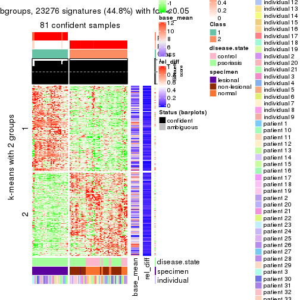</p>

</div>
<div id='tab-MAD-mclust-get-signatures-2'>
<pre><code class="r">get_signatures(res, k = 3)
</code></pre>

<p></p>

</div>
<div id='tab-MAD-mclust-get-signatures-3'>
<pre><code class="r">get_signatures(res, k = 4)
</code></pre>

<p></p>

</div>
<div id='tab-MAD-mclust-get-signatures-4'>
<pre><code class="r">get_signatures(res, k = 5)
</code></pre>

<p></p>

</div>
<div id='tab-MAD-mclust-get-signatures-5'>
<pre><code class="r">get_signatures(res, k = 6)
</code></pre>

<p></p>

</div>
</div>


Signature heatmaps where rows are not scaled:


<script>
$( function() {
	$( '#tabs-MAD-mclust-get-signatures-no-scale' ).tabs();
} );
</script>
<div id='tabs-MAD-mclust-get-signatures-no-scale'>
<ul>
<li><a href='#tab-MAD-mclust-get-signatures-no-scale-1'>k = 2</a></li>
<li><a href='#tab-MAD-mclust-get-signatures-no-scale-2'>k = 3</a></li>
<li><a href='#tab-MAD-mclust-get-signatures-no-scale-3'>k = 4</a></li>
<li><a href='#tab-MAD-mclust-get-signatures-no-scale-4'>k = 5</a></li>
<li><a href='#tab-MAD-mclust-get-signatures-no-scale-5'>k = 6</a></li>
</ul>
<div id='tab-MAD-mclust-get-signatures-no-scale-1'>
<pre><code class="r">get_signatures(res, k = 2, scale_rows = FALSE)
</code></pre>

<p></p>

</div>
<div id='tab-MAD-mclust-get-signatures-no-scale-2'>
<pre><code class="r">get_signatures(res, k = 3, scale_rows = FALSE)
</code></pre>

<p></p>

</div>
<div id='tab-MAD-mclust-get-signatures-no-scale-3'>
<pre><code class="r">get_signatures(res, k = 4, scale_rows = FALSE)
</code></pre>

<p></p>

</div>
<div id='tab-MAD-mclust-get-signatures-no-scale-4'>
<pre><code class="r">get_signatures(res, k = 5, scale_rows = FALSE)
</code></pre>

<p></p>

</div>
<div id='tab-MAD-mclust-get-signatures-no-scale-5'>
<pre><code class="r">get_signatures(res, k = 6, scale_rows = FALSE)
</code></pre>

<p></p>

</div>
</div>


Compare the overlap of signatures from different k:

```r
compare_signatures(res)
```

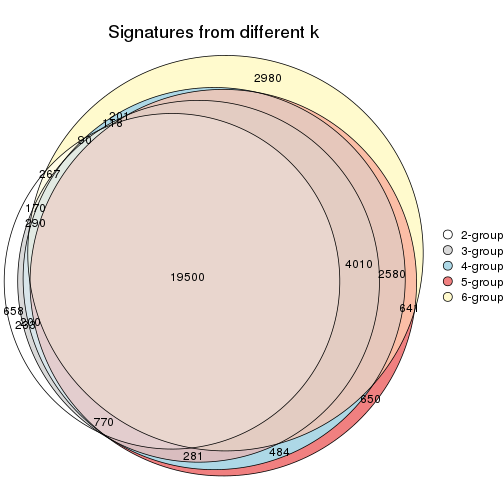

`get_signature()` returns a data frame invisibly. TO get the list of signatures, the function
call should be assigned to a variable explicitly. In following code, if `plot` argument is set
to `FALSE`, no heatmap is plotted while only the differential analysis is performed.

```r
# code only for demonstration
tb = get_signature(res, k = ..., plot = FALSE)
```

An example of the output of `tb` is:

```
#>   which_row         fdr    mean_1    mean_2 scaled_mean_1 scaled_mean_2 km
#> 1        38 0.042760348  8.373488  9.131774    -0.5533452     0.5164555  1
#> 2        40 0.018707592  7.106213  8.469186    -0.6173731     0.5762149  1
#> 3        55 0.019134737 10.221463 11.207825    -0.6159697     0.5749050  1
#> 4        59 0.006059896  5.921854  7.869574    -0.6899429     0.6439467  1
#> 5        60 0.018055526  8.928898 10.211722    -0.6204761     0.5791110  1
#> 6        98 0.009384629 15.714769 14.887706     0.6635654    -0.6193277  2
...
```

The columns in `tb` are:

1. `which_row`: row indices corresponding to the input matrix.
2. `fdr`: FDR for the differential test. 
3. `mean_x`: The mean value in group x.
4. `scaled_mean_x`: The mean value in group x after rows are scaled.
5. `km`: Row groups if k-means clustering is applied to rows.


UMAP plot which shows how samples are separated.


<script>
$( function() {
	$( '#tabs-MAD-mclust-dimension-reduction' ).tabs();
} );
</script>
<div id='tabs-MAD-mclust-dimension-reduction'>
<ul>
<li><a href='#tab-MAD-mclust-dimension-reduction-1'>k = 2</a></li>
<li><a href='#tab-MAD-mclust-dimension-reduction-2'>k = 3</a></li>
<li><a href='#tab-MAD-mclust-dimension-reduction-3'>k = 4</a></li>
<li><a href='#tab-MAD-mclust-dimension-reduction-4'>k = 5</a></li>
<li><a href='#tab-MAD-mclust-dimension-reduction-5'>k = 6</a></li>
</ul>
<div id='tab-MAD-mclust-dimension-reduction-1'>
<pre><code class="r">dimension_reduction(res, k = 2, method = &quot;UMAP&quot;)
</code></pre>

<p></p>

</div>
<div id='tab-MAD-mclust-dimension-reduction-2'>
<pre><code class="r">dimension_reduction(res, k = 3, method = &quot;UMAP&quot;)
</code></pre>

<p></p>

</div>
<div id='tab-MAD-mclust-dimension-reduction-3'>
<pre><code class="r">dimension_reduction(res, k = 4, method = &quot;UMAP&quot;)
</code></pre>

<p></p>

</div>
<div id='tab-MAD-mclust-dimension-reduction-4'>
<pre><code class="r">dimension_reduction(res, k = 5, method = &quot;UMAP&quot;)
</code></pre>

<p></p>

</div>
<div id='tab-MAD-mclust-dimension-reduction-5'>
<pre><code class="r">dimension_reduction(res, k = 6, method = &quot;UMAP&quot;)
</code></pre>

<p></p>

</div>
</div>


Following heatmap shows how subgroups are split when increasing `k`:

```r
collect_classes(res)
```


Test correlation between subgroups and known annotations. If the known
annotation is numeric, one-way ANOVA test is applied, and if the known
annotation is discrete, chi-squared contingency table test is applied.

```r
test_to_known_factors(res)
```

```
#>             n disease.state(p) specimen(p) individual(p) k
#> MAD:mclust 81         8.44e-05    2.00e-17         0.999 2
#> MAD:mclust 78         1.07e-14    9.35e-28         0.743 3
#> MAD:mclust 81         1.12e-11    1.84e-23         0.943 4
#> MAD:mclust 70         2.64e-12    3.15e-24         0.750 5
#> MAD:mclust 71         1.83e-11    2.55e-22         0.508 6
```


If matrix rows can be associated to genes, consider to use `GO_Enrichment(res,
...)` to perform function enrichment for the signature genes.


 

---------------------------------------------------


### MAD:NMF**


The object with results only for a single top-value method and a single partition method 
can be extracted as:

```r
res = res_list["MAD", "NMF"]
# you can also extract it by
# res = res_list["MAD:NMF"]
```

A summary of `res` and all the functions that can be applied to it:

```r
res
```

```
#> A 'ConsensusPartition' object with k = 2, 3, 4, 5, 6.
#>   On a matrix with 51941 rows and 82 columns.
#>   Top rows (1000, 2000, 3000, 4000, 5000) are extracted by 'MAD' method.
#>   Subgroups are detected by 'NMF' method.
#>   Performed in total 1250 partitions by row resampling.
#>   Best k for subgroups seems to be 3.
#> 
#> Following methods can be applied to this 'ConsensusPartition' object:
#>  [1] "cola_report"             "collect_classes"         "collect_plots"          
#>  [4] "collect_stats"           "colnames"                "compare_signatures"     
#>  [7] "consensus_heatmap"       "dimension_reduction"     "functional_enrichment"  
#> [10] "get_anno_col"            "get_anno"                "get_classes"            
#> [13] "get_consensus"           "get_matrix"              "get_membership"         
#> [16] "get_param"               "get_signatures"          "get_stats"              
#> [19] "is_best_k"               "is_stable_k"             "membership_heatmap"     
#> [22] "ncol"                    "nrow"                    "plot_ecdf"              
#> [25] "rownames"                "select_partition_number" "show"                   
#> [28] "suggest_best_k"          "test_to_known_factors"
```

`collect_plots()` function collects all the plots made from `res` for all `k` (number of partitions)
into one single page to provide an easy and fast comparison between different `k`.

```r
collect_plots(res)
```


The plots are:

- The first row: a plot of the ECDF (Empirical cumulative distribution
  function) curves of the consensus matrix for each `k` and the heatmap of
  predicted classes for each `k`.
- The second row: heatmaps of the consensus matrix for each `k`.
- The third row: heatmaps of the membership matrix for each `k`.
- The fouth row: heatmaps of the signatures for each `k`.

All the plots in panels can be made by individual functions and they are
plotted later in this section.

`select_partition_number()` produces several plots showing different
statistics for choosing "optimized" `k`. There are following statistics:

- ECDF curves of the consensus matrix for each `k`;
- 1-PAC. [The PAC
  score](https://en.wikipedia.org/wiki/Consensus_clustering#Over-interpretation_potential_of_consensus_clustering)
  measures the proportion of the ambiguous subgrouping.
- Mean silhouette score.
- Concordance. The mean probability of fiting the consensus class ids in all
  partitions.
- Area increased. Denote $A_k$ as the area under the ECDF curve for current
  `k`, the area increased is defined as $A_k - A_{k-1}$.
- Rand index. The percent of pairs of samples that are both in a same cluster
  or both are not in a same cluster in the partition of k and k-1.
- Jaccard index. The ratio of pairs of samples are both in a same cluster in
  the partition of k and k-1 and the pairs of samples are both in a same
  cluster in the partition k or k-1.

The detailed explanations of these statistics can be found in [the cola
vignette](http://bioconductor.org/packages/devel/bioc/vignettes/cola/inst/doc/cola.html#toc_13).

Generally speaking, lower PAC score, higher mean silhouette score or higher
concordance corresponds to better partition. Rand index and Jaccard index
measure how similar the current partition is compared to partition with `k-1`.
If they are too similar, we won't accept `k` is better than `k-1`.

```r
select_partition_number(res)
```


The numeric values for all these statistics can be obtained by `get_stats()`.

```r
get_stats(res)
```

```
#>   k 1-PAC mean_silhouette concordance area_increased  Rand Jaccard
#> 2 2 1.000           1.000       1.000         0.4874 0.513   0.513
#> 3 3 0.996           0.970       0.984         0.3576 0.825   0.660
#> 4 4 0.842           0.819       0.913         0.1142 0.843   0.585
#> 5 5 0.792           0.779       0.869         0.0379 0.946   0.805
#> 6 6 0.746           0.618       0.771         0.0427 0.933   0.734
```

`suggest_best_k()` suggests the best $k$ based on these statistics. The rules are as follows:

- All $k$ with Jaccard index larger than 0.95 are removed because the increase of
  the partition number does not provides enough extra information. If all $k$ are removed,
  the best $k$ is assigned by `NA`.
- For $k$ with 1-PAC larger than 0.9, the maximal $k$ is taken as the "best k". Other $k$ is called "optional k".
- If it does not fit the second rule. The $k$ with the highest vote of highest
  1-PAC, mean silhouette and concordance is taken as the "best k".

```r
suggest_best_k(res)
```

```
#> [1] 3
#> attr(,"optional")
#> [1] 2
```

There is also optional best $k$ = 2 that is worth to check.

Following shows the table of the partitions (You need to click the **show/hide
code output** link to see it). The membership matrix (columns with name `p*`)
is inferred by
[`clue::cl_consensus()`](https://www.rdocumentation.org/link/cl_consensus?package=clue)
function with the `SE` method. Basically the value in the membership matrix
represents the probability to belong to a certain group. The finall class
label for an item is determined with the group with highest probability it
belongs to.

In `get_classes()` function, the entropy is calculated from the membership
matrix and the silhouette score is calculated from the consensus matrix.


<script>
$( function() {
	$( '#tabs-MAD-NMF-get-classes' ).tabs();
} );
</script>
<div id='tabs-MAD-NMF-get-classes'>
<ul>
<li><a href='#tab-MAD-NMF-get-classes-1'>k = 2</a></li>
<li><a href='#tab-MAD-NMF-get-classes-2'>k = 3</a></li>
<li><a href='#tab-MAD-NMF-get-classes-3'>k = 4</a></li>
<li><a href='#tab-MAD-NMF-get-classes-4'>k = 5</a></li>
<li><a href='#tab-MAD-NMF-get-classes-5'>k = 6</a></li>
</ul>

<div id='tab-MAD-NMF-get-classes-1'>
<p><a id='tab-MAD-NMF-get-classes-1-a' style='color:#0366d6' href='#'>show/hide code output</a></p>
<pre><code class="r">cbind(get_classes(res, k = 2), get_membership(res, k = 2))
</code></pre>

<pre><code>#&gt;           class entropy silhouette    p1    p2
#&gt; GSM372286     2  0.0000      1.000 0.000 1.000
#&gt; GSM372287     2  0.0000      1.000 0.000 1.000
#&gt; GSM372288     2  0.0000      1.000 0.000 1.000
#&gt; GSM372289     2  0.0000      1.000 0.000 1.000
#&gt; GSM372290     2  0.0000      1.000 0.000 1.000
#&gt; GSM372291     1  0.0000      1.000 1.000 0.000
#&gt; GSM372292     2  0.0000      1.000 0.000 1.000
#&gt; GSM372293     2  0.0000      1.000 0.000 1.000
#&gt; GSM372294     2  0.0000      1.000 0.000 1.000
#&gt; GSM372295     2  0.0000      1.000 0.000 1.000
#&gt; GSM372296     2  0.0000      1.000 0.000 1.000
#&gt; GSM372297     2  0.0000      1.000 0.000 1.000
#&gt; GSM372298     2  0.0000      1.000 0.000 1.000
#&gt; GSM372299     2  0.0000      1.000 0.000 1.000
#&gt; GSM372300     2  0.0000      1.000 0.000 1.000
#&gt; GSM372301     2  0.0000      1.000 0.000 1.000
#&gt; GSM372302     2  0.0000      1.000 0.000 1.000
#&gt; GSM372303     2  0.0000      1.000 0.000 1.000
#&gt; GSM372304     2  0.0000      1.000 0.000 1.000
#&gt; GSM372305     2  0.0000      1.000 0.000 1.000
#&gt; GSM372306     2  0.0000      1.000 0.000 1.000
#&gt; GSM372307     2  0.0000      1.000 0.000 1.000
#&gt; GSM372309     2  0.0000      1.000 0.000 1.000
#&gt; GSM372311     2  0.0000      1.000 0.000 1.000
#&gt; GSM372313     2  0.0000      1.000 0.000 1.000
#&gt; GSM372315     2  0.0000      1.000 0.000 1.000
#&gt; GSM372317     2  0.0000      1.000 0.000 1.000
#&gt; GSM372319     2  0.0000      1.000 0.000 1.000
#&gt; GSM372321     2  0.0000      1.000 0.000 1.000
#&gt; GSM372323     2  0.0000      1.000 0.000 1.000
#&gt; GSM372326     2  0.0000      1.000 0.000 1.000
#&gt; GSM372328     2  0.0000      1.000 0.000 1.000
#&gt; GSM372330     2  0.0000      1.000 0.000 1.000
#&gt; GSM372332     2  0.0000      1.000 0.000 1.000
#&gt; GSM372335     2  0.0000      1.000 0.000 1.000
#&gt; GSM372337     2  0.0000      1.000 0.000 1.000
#&gt; GSM372339     2  0.0000      1.000 0.000 1.000
#&gt; GSM372341     2  0.0000      1.000 0.000 1.000
#&gt; GSM372343     2  0.0000      1.000 0.000 1.000
#&gt; GSM372345     2  0.0000      1.000 0.000 1.000
#&gt; GSM372347     2  0.0000      1.000 0.000 1.000
#&gt; GSM372349     2  0.0000      1.000 0.000 1.000
#&gt; GSM372351     2  0.0000      1.000 0.000 1.000
#&gt; GSM372353     2  0.0000      1.000 0.000 1.000
#&gt; GSM372355     2  0.0000      1.000 0.000 1.000
#&gt; GSM372357     2  0.0000      1.000 0.000 1.000
#&gt; GSM372359     2  0.0000      1.000 0.000 1.000
#&gt; GSM372361     2  0.0000      1.000 0.000 1.000
#&gt; GSM372363     2  0.0000      1.000 0.000 1.000
#&gt; GSM372308     1  0.0000      1.000 1.000 0.000
#&gt; GSM372310     1  0.0000      1.000 1.000 0.000
#&gt; GSM372312     1  0.0000      1.000 1.000 0.000
#&gt; GSM372314     1  0.0000      1.000 1.000 0.000
#&gt; GSM372316     1  0.0000      1.000 1.000 0.000
#&gt; GSM372318     1  0.0000      1.000 1.000 0.000
#&gt; GSM372320     1  0.0000      1.000 1.000 0.000
#&gt; GSM372322     1  0.0000      1.000 1.000 0.000
#&gt; GSM372324     1  0.0000      1.000 1.000 0.000
#&gt; GSM372325     1  0.0000      1.000 1.000 0.000
#&gt; GSM372327     1  0.0000      1.000 1.000 0.000
#&gt; GSM372329     1  0.0000      1.000 1.000 0.000
#&gt; GSM372331     1  0.0000      1.000 1.000 0.000
#&gt; GSM372333     1  0.0376      0.996 0.996 0.004
#&gt; GSM372334     1  0.0000      1.000 1.000 0.000
#&gt; GSM372336     1  0.0000      1.000 1.000 0.000
#&gt; GSM372338     1  0.0000      1.000 1.000 0.000
#&gt; GSM372340     1  0.0000      1.000 1.000 0.000
#&gt; GSM372342     1  0.0000      1.000 1.000 0.000
#&gt; GSM372344     1  0.0000      1.000 1.000 0.000
#&gt; GSM372346     1  0.0000      1.000 1.000 0.000
#&gt; GSM372348     1  0.0000      1.000 1.000 0.000
#&gt; GSM372350     1  0.0000      1.000 1.000 0.000
#&gt; GSM372352     2  0.0000      1.000 0.000 1.000
#&gt; GSM372354     1  0.0000      1.000 1.000 0.000
#&gt; GSM372356     1  0.0000      1.000 1.000 0.000
#&gt; GSM372358     1  0.0000      1.000 1.000 0.000
#&gt; GSM372360     1  0.0000      1.000 1.000 0.000
#&gt; GSM372362     1  0.0000      1.000 1.000 0.000
#&gt; GSM372364     1  0.0000      1.000 1.000 0.000
#&gt; GSM372365     1  0.0000      1.000 1.000 0.000
#&gt; GSM372366     1  0.0000      1.000 1.000 0.000
#&gt; GSM372367     1  0.0000      1.000 1.000 0.000
</code></pre>

<script>
$('#tab-MAD-NMF-get-classes-1-a').parent().next().next().hide();
$('#tab-MAD-NMF-get-classes-1-a').click(function(){
  $('#tab-MAD-NMF-get-classes-1-a').parent().next().next().toggle();
  return(false);
});
</script>
</div>

<div id='tab-MAD-NMF-get-classes-2'>
<p><a id='tab-MAD-NMF-get-classes-2-a' style='color:#0366d6' href='#'>show/hide code output</a></p>
<pre><code class="r">cbind(get_classes(res, k = 3), get_membership(res, k = 3))
</code></pre>

<pre><code>#&gt;           class entropy silhouette    p1    p2    p3
#&gt; GSM372286     2  0.0000      0.978 0.000 1.000 0.000
#&gt; GSM372287     2  0.0000      0.978 0.000 1.000 0.000
#&gt; GSM372288     2  0.0000      0.978 0.000 1.000 0.000
#&gt; GSM372289     2  0.0000      0.978 0.000 1.000 0.000
#&gt; GSM372290     2  0.0000      0.978 0.000 1.000 0.000
#&gt; GSM372291     1  0.2796      0.895 0.908 0.092 0.000
#&gt; GSM372292     3  0.4178      0.816 0.000 0.172 0.828
#&gt; GSM372293     3  0.0000      0.972 0.000 0.000 1.000
#&gt; GSM372294     2  0.0000      0.978 0.000 1.000 0.000
#&gt; GSM372295     2  0.0000      0.978 0.000 1.000 0.000
#&gt; GSM372296     2  0.0000      0.978 0.000 1.000 0.000
#&gt; GSM372297     2  0.0000      0.978 0.000 1.000 0.000
#&gt; GSM372298     2  0.0000      0.978 0.000 1.000 0.000
#&gt; GSM372299     2  0.0000      0.978 0.000 1.000 0.000
#&gt; GSM372300     3  0.2165      0.927 0.000 0.064 0.936
#&gt; GSM372301     3  0.2878      0.899 0.000 0.096 0.904
#&gt; GSM372302     2  0.0000      0.978 0.000 1.000 0.000
#&gt; GSM372303     3  0.0000      0.972 0.000 0.000 1.000
#&gt; GSM372304     2  0.0000      0.978 0.000 1.000 0.000
#&gt; GSM372305     2  0.0237      0.976 0.000 0.996 0.004
#&gt; GSM372306     2  0.2878      0.901 0.000 0.904 0.096
#&gt; GSM372307     2  0.0000      0.978 0.000 1.000 0.000
#&gt; GSM372309     2  0.0000      0.978 0.000 1.000 0.000
#&gt; GSM372311     2  0.0000      0.978 0.000 1.000 0.000
#&gt; GSM372313     2  0.0000      0.978 0.000 1.000 0.000
#&gt; GSM372315     2  0.0000      0.978 0.000 1.000 0.000
#&gt; GSM372317     2  0.4887      0.732 0.000 0.772 0.228
#&gt; GSM372319     3  0.0237      0.970 0.000 0.004 0.996
#&gt; GSM372321     3  0.0000      0.972 0.000 0.000 1.000
#&gt; GSM372323     3  0.0000      0.972 0.000 0.000 1.000
#&gt; GSM372326     3  0.0000      0.972 0.000 0.000 1.000
#&gt; GSM372328     3  0.0000      0.972 0.000 0.000 1.000
#&gt; GSM372330     2  0.0237      0.976 0.000 0.996 0.004
#&gt; GSM372332     3  0.0000      0.972 0.000 0.000 1.000
#&gt; GSM372335     2  0.2165      0.930 0.000 0.936 0.064
#&gt; GSM372337     3  0.0000      0.972 0.000 0.000 1.000
#&gt; GSM372339     3  0.0000      0.972 0.000 0.000 1.000
#&gt; GSM372341     3  0.0000      0.972 0.000 0.000 1.000
#&gt; GSM372343     3  0.0000      0.972 0.000 0.000 1.000
#&gt; GSM372345     3  0.0000      0.972 0.000 0.000 1.000
#&gt; GSM372347     3  0.0424      0.968 0.000 0.008 0.992
#&gt; GSM372349     3  0.0000      0.972 0.000 0.000 1.000
#&gt; GSM372351     3  0.0000      0.972 0.000 0.000 1.000
#&gt; GSM372353     3  0.4235      0.808 0.000 0.176 0.824
#&gt; GSM372355     2  0.0000      0.978 0.000 1.000 0.000
#&gt; GSM372357     2  0.0237      0.976 0.000 0.996 0.004
#&gt; GSM372359     2  0.3116      0.882 0.000 0.892 0.108
#&gt; GSM372361     2  0.0000      0.978 0.000 1.000 0.000
#&gt; GSM372363     2  0.0000      0.978 0.000 1.000 0.000
#&gt; GSM372308     1  0.0000      0.996 1.000 0.000 0.000
#&gt; GSM372310     1  0.0000      0.996 1.000 0.000 0.000
#&gt; GSM372312     1  0.1031      0.972 0.976 0.024 0.000
#&gt; GSM372314     1  0.0000      0.996 1.000 0.000 0.000
#&gt; GSM372316     1  0.0000      0.996 1.000 0.000 0.000
#&gt; GSM372318     1  0.0000      0.996 1.000 0.000 0.000
#&gt; GSM372320     1  0.0000      0.996 1.000 0.000 0.000
#&gt; GSM372322     1  0.0000      0.996 1.000 0.000 0.000
#&gt; GSM372324     1  0.0000      0.996 1.000 0.000 0.000
#&gt; GSM372325     1  0.0000      0.996 1.000 0.000 0.000
#&gt; GSM372327     1  0.0000      0.996 1.000 0.000 0.000
#&gt; GSM372329     1  0.0000      0.996 1.000 0.000 0.000
#&gt; GSM372331     1  0.0000      0.996 1.000 0.000 0.000
#&gt; GSM372333     1  0.0592      0.985 0.988 0.000 0.012
#&gt; GSM372334     1  0.0000      0.996 1.000 0.000 0.000
#&gt; GSM372336     1  0.0000      0.996 1.000 0.000 0.000
#&gt; GSM372338     1  0.0000      0.996 1.000 0.000 0.000
#&gt; GSM372340     1  0.0000      0.996 1.000 0.000 0.000
#&gt; GSM372342     1  0.0000      0.996 1.000 0.000 0.000
#&gt; GSM372344     1  0.0000      0.996 1.000 0.000 0.000
#&gt; GSM372346     1  0.0000      0.996 1.000 0.000 0.000
#&gt; GSM372348     1  0.0000      0.996 1.000 0.000 0.000
#&gt; GSM372350     1  0.0000      0.996 1.000 0.000 0.000
#&gt; GSM372352     2  0.3805      0.885 0.024 0.884 0.092
#&gt; GSM372354     1  0.0000      0.996 1.000 0.000 0.000
#&gt; GSM372356     1  0.0000      0.996 1.000 0.000 0.000
#&gt; GSM372358     1  0.0000      0.996 1.000 0.000 0.000
#&gt; GSM372360     1  0.0000      0.996 1.000 0.000 0.000
#&gt; GSM372362     1  0.0000      0.996 1.000 0.000 0.000
#&gt; GSM372364     1  0.0000      0.996 1.000 0.000 0.000
#&gt; GSM372365     1  0.0000      0.996 1.000 0.000 0.000
#&gt; GSM372366     1  0.0000      0.996 1.000 0.000 0.000
#&gt; GSM372367     1  0.0000      0.996 1.000 0.000 0.000
</code></pre>

<script>
$('#tab-MAD-NMF-get-classes-2-a').parent().next().next().hide();
$('#tab-MAD-NMF-get-classes-2-a').click(function(){
  $('#tab-MAD-NMF-get-classes-2-a').parent().next().next().toggle();
  return(false);
});
</script>
</div>

<div id='tab-MAD-NMF-get-classes-3'>
<p><a id='tab-MAD-NMF-get-classes-3-a' style='color:#0366d6' href='#'>show/hide code output</a></p>
<pre><code class="r">cbind(get_classes(res, k = 4), get_membership(res, k = 4))
</code></pre>

<pre><code>#&gt;           class entropy silhouette    p1    p2    p3    p4
#&gt; GSM372286     2  0.0921     0.7894 0.000 0.972 0.000 0.028
#&gt; GSM372287     4  0.2589     0.8295 0.000 0.116 0.000 0.884
#&gt; GSM372288     4  0.3726     0.7635 0.000 0.212 0.000 0.788
#&gt; GSM372289     2  0.4994    -0.2190 0.000 0.520 0.000 0.480
#&gt; GSM372290     4  0.2973     0.8161 0.000 0.144 0.000 0.856
#&gt; GSM372291     4  0.1576     0.8156 0.048 0.004 0.000 0.948
#&gt; GSM372292     4  0.0921     0.8239 0.000 0.000 0.028 0.972
#&gt; GSM372293     4  0.4985    -0.0128 0.000 0.000 0.468 0.532
#&gt; GSM372294     4  0.4103     0.7127 0.000 0.256 0.000 0.744
#&gt; GSM372295     4  0.1716     0.8401 0.000 0.064 0.000 0.936
#&gt; GSM372296     4  0.3172     0.8059 0.000 0.160 0.000 0.840
#&gt; GSM372297     4  0.1302     0.8401 0.000 0.044 0.000 0.956
#&gt; GSM372298     4  0.1004     0.8380 0.000 0.024 0.004 0.972
#&gt; GSM372299     4  0.0672     0.8332 0.000 0.008 0.008 0.984
#&gt; GSM372300     4  0.1211     0.8191 0.000 0.000 0.040 0.960
#&gt; GSM372301     4  0.1022     0.8226 0.000 0.000 0.032 0.968
#&gt; GSM372302     4  0.2149     0.8381 0.000 0.088 0.000 0.912
#&gt; GSM372303     4  0.2081     0.7902 0.000 0.000 0.084 0.916
#&gt; GSM372304     4  0.2081     0.8381 0.000 0.084 0.000 0.916
#&gt; GSM372305     2  0.1389     0.7961 0.000 0.952 0.048 0.000
#&gt; GSM372306     2  0.2647     0.7629 0.000 0.880 0.120 0.000
#&gt; GSM372307     4  0.4998     0.2455 0.000 0.488 0.000 0.512
#&gt; GSM372309     2  0.2662     0.7879 0.000 0.900 0.084 0.016
#&gt; GSM372311     2  0.0707     0.7929 0.000 0.980 0.000 0.020
#&gt; GSM372313     2  0.0592     0.7945 0.000 0.984 0.000 0.016
#&gt; GSM372315     2  0.4040     0.4973 0.000 0.752 0.000 0.248
#&gt; GSM372317     2  0.4040     0.6407 0.000 0.752 0.248 0.000
#&gt; GSM372319     3  0.0817     0.9481 0.000 0.024 0.976 0.000
#&gt; GSM372321     3  0.0921     0.9459 0.000 0.028 0.972 0.000
#&gt; GSM372323     3  0.0707     0.9491 0.000 0.020 0.980 0.000
#&gt; GSM372326     3  0.0804     0.9505 0.000 0.012 0.980 0.008
#&gt; GSM372328     3  0.1792     0.9179 0.000 0.000 0.932 0.068
#&gt; GSM372330     2  0.1042     0.7941 0.000 0.972 0.008 0.020
#&gt; GSM372332     3  0.1474     0.9292 0.000 0.000 0.948 0.052
#&gt; GSM372335     2  0.1706     0.7975 0.000 0.948 0.036 0.016
#&gt; GSM372337     3  0.0817     0.9481 0.000 0.024 0.976 0.000
#&gt; GSM372339     3  0.0000     0.9501 0.000 0.000 1.000 0.000
#&gt; GSM372341     3  0.0817     0.9441 0.000 0.000 0.976 0.024
#&gt; GSM372343     3  0.0817     0.9447 0.000 0.000 0.976 0.024
#&gt; GSM372345     3  0.0921     0.9459 0.000 0.028 0.972 0.000
#&gt; GSM372347     2  0.5000     0.0485 0.000 0.500 0.500 0.000
#&gt; GSM372349     3  0.0779     0.9500 0.000 0.016 0.980 0.004
#&gt; GSM372351     3  0.1557     0.9266 0.000 0.000 0.944 0.056
#&gt; GSM372353     3  0.4188     0.6565 0.000 0.244 0.752 0.004
#&gt; GSM372355     2  0.0592     0.7945 0.000 0.984 0.000 0.016
#&gt; GSM372357     2  0.1557     0.7954 0.000 0.944 0.056 0.000
#&gt; GSM372359     2  0.2675     0.7762 0.000 0.892 0.100 0.008
#&gt; GSM372361     4  0.4877     0.4587 0.000 0.408 0.000 0.592
#&gt; GSM372363     2  0.0779     0.7960 0.000 0.980 0.004 0.016
#&gt; GSM372308     1  0.0000     0.9779 1.000 0.000 0.000 0.000
#&gt; GSM372310     1  0.0000     0.9779 1.000 0.000 0.000 0.000
#&gt; GSM372312     1  0.0592     0.9622 0.984 0.016 0.000 0.000
#&gt; GSM372314     1  0.3528     0.7385 0.808 0.192 0.000 0.000
#&gt; GSM372316     1  0.0000     0.9779 1.000 0.000 0.000 0.000
#&gt; GSM372318     1  0.0000     0.9779 1.000 0.000 0.000 0.000
#&gt; GSM372320     1  0.0000     0.9779 1.000 0.000 0.000 0.000
#&gt; GSM372322     1  0.0000     0.9779 1.000 0.000 0.000 0.000
#&gt; GSM372324     1  0.0000     0.9779 1.000 0.000 0.000 0.000
#&gt; GSM372325     1  0.5174     0.3617 0.620 0.368 0.012 0.000
#&gt; GSM372327     1  0.0000     0.9779 1.000 0.000 0.000 0.000
#&gt; GSM372329     1  0.0000     0.9779 1.000 0.000 0.000 0.000
#&gt; GSM372331     2  0.4697     0.4352 0.356 0.644 0.000 0.000
#&gt; GSM372333     2  0.5111     0.6554 0.056 0.740 0.204 0.000
#&gt; GSM372334     1  0.0000     0.9779 1.000 0.000 0.000 0.000
#&gt; GSM372336     1  0.0000     0.9779 1.000 0.000 0.000 0.000
#&gt; GSM372338     1  0.0000     0.9779 1.000 0.000 0.000 0.000
#&gt; GSM372340     1  0.0000     0.9779 1.000 0.000 0.000 0.000
#&gt; GSM372342     1  0.0000     0.9779 1.000 0.000 0.000 0.000
#&gt; GSM372344     1  0.0000     0.9779 1.000 0.000 0.000 0.000
#&gt; GSM372346     1  0.0000     0.9779 1.000 0.000 0.000 0.000
#&gt; GSM372348     1  0.0000     0.9779 1.000 0.000 0.000 0.000
#&gt; GSM372350     1  0.0188     0.9742 0.996 0.000 0.000 0.004
#&gt; GSM372352     2  0.6569     0.5134 0.284 0.628 0.020 0.068
#&gt; GSM372354     1  0.0000     0.9779 1.000 0.000 0.000 0.000
#&gt; GSM372356     1  0.0000     0.9779 1.000 0.000 0.000 0.000
#&gt; GSM372358     1  0.0000     0.9779 1.000 0.000 0.000 0.000
#&gt; GSM372360     1  0.0000     0.9779 1.000 0.000 0.000 0.000
#&gt; GSM372362     1  0.0000     0.9779 1.000 0.000 0.000 0.000
#&gt; GSM372364     1  0.0000     0.9779 1.000 0.000 0.000 0.000
#&gt; GSM372365     1  0.0000     0.9779 1.000 0.000 0.000 0.000
#&gt; GSM372366     1  0.0000     0.9779 1.000 0.000 0.000 0.000
#&gt; GSM372367     1  0.0000     0.9779 1.000 0.000 0.000 0.000
</code></pre>

<script>
$('#tab-MAD-NMF-get-classes-3-a').parent().next().next().hide();
$('#tab-MAD-NMF-get-classes-3-a').click(function(){
  $('#tab-MAD-NMF-get-classes-3-a').parent().next().next().toggle();
  return(false);
});
</script>
</div>

<div id='tab-MAD-NMF-get-classes-4'>
<p><a id='tab-MAD-NMF-get-classes-4-a' style='color:#0366d6' href='#'>show/hide code output</a></p>
<pre><code class="r">cbind(get_classes(res, k = 5), get_membership(res, k = 5))
</code></pre>

<pre><code>#&gt;           class entropy silhouette    p1    p2    p3    p4    p5
#&gt; GSM372286     2  0.2339      0.805 0.000 0.912 0.008 0.052 0.028
#&gt; GSM372287     4  0.0290      0.810 0.000 0.008 0.000 0.992 0.000
#&gt; GSM372288     4  0.1484      0.802 0.000 0.048 0.000 0.944 0.008
#&gt; GSM372289     4  0.4114      0.575 0.000 0.272 0.000 0.712 0.016
#&gt; GSM372290     4  0.1579      0.807 0.000 0.032 0.000 0.944 0.024
#&gt; GSM372291     4  0.2624      0.741 0.012 0.000 0.000 0.872 0.116
#&gt; GSM372292     5  0.4627      0.522 0.000 0.000 0.012 0.444 0.544
#&gt; GSM372293     5  0.4767      0.715 0.000 0.000 0.088 0.192 0.720
#&gt; GSM372294     4  0.2110      0.785 0.000 0.016 0.000 0.912 0.072
#&gt; GSM372295     4  0.2248      0.780 0.000 0.012 0.000 0.900 0.088
#&gt; GSM372296     4  0.0451      0.810 0.000 0.008 0.000 0.988 0.004
#&gt; GSM372297     4  0.1478      0.775 0.000 0.000 0.000 0.936 0.064
#&gt; GSM372298     4  0.4024      0.560 0.000 0.028 0.000 0.752 0.220
#&gt; GSM372299     4  0.5167      0.032 0.000 0.044 0.000 0.552 0.404
#&gt; GSM372300     5  0.4086      0.730 0.000 0.000 0.024 0.240 0.736
#&gt; GSM372301     5  0.4467      0.690 0.000 0.000 0.016 0.344 0.640
#&gt; GSM372302     4  0.0451      0.808 0.000 0.004 0.000 0.988 0.008
#&gt; GSM372303     5  0.4735      0.733 0.000 0.000 0.044 0.284 0.672
#&gt; GSM372304     4  0.1484      0.789 0.000 0.008 0.000 0.944 0.048
#&gt; GSM372305     2  0.1731      0.823 0.000 0.940 0.012 0.040 0.008
#&gt; GSM372306     2  0.4169      0.615 0.000 0.732 0.240 0.000 0.028
#&gt; GSM372307     4  0.4024      0.638 0.000 0.220 0.000 0.752 0.028
#&gt; GSM372309     2  0.4871      0.744 0.000 0.760 0.128 0.080 0.032
#&gt; GSM372311     2  0.0865      0.822 0.000 0.972 0.000 0.024 0.004
#&gt; GSM372313     2  0.1267      0.814 0.000 0.960 0.004 0.012 0.024
#&gt; GSM372315     2  0.4197      0.619 0.000 0.728 0.000 0.244 0.028
#&gt; GSM372317     2  0.3455      0.680 0.000 0.784 0.208 0.000 0.008
#&gt; GSM372319     3  0.1808      0.790 0.000 0.020 0.936 0.004 0.040
#&gt; GSM372321     3  0.1300      0.789 0.000 0.016 0.956 0.000 0.028
#&gt; GSM372323     3  0.1626      0.790 0.000 0.016 0.940 0.000 0.044
#&gt; GSM372326     3  0.4288      0.530 0.000 0.004 0.612 0.000 0.384
#&gt; GSM372328     3  0.3910      0.659 0.000 0.000 0.720 0.008 0.272
#&gt; GSM372330     2  0.2569      0.811 0.000 0.896 0.004 0.032 0.068
#&gt; GSM372332     3  0.2424      0.758 0.000 0.000 0.868 0.000 0.132
#&gt; GSM372335     2  0.1282      0.811 0.000 0.952 0.004 0.000 0.044
#&gt; GSM372337     3  0.0955      0.789 0.000 0.004 0.968 0.000 0.028
#&gt; GSM372339     3  0.1544      0.788 0.000 0.000 0.932 0.000 0.068
#&gt; GSM372341     3  0.1732      0.785 0.000 0.000 0.920 0.000 0.080
#&gt; GSM372343     3  0.4126      0.538 0.000 0.000 0.620 0.000 0.380
#&gt; GSM372345     3  0.0693      0.778 0.000 0.008 0.980 0.000 0.012
#&gt; GSM372347     3  0.4603      0.490 0.000 0.300 0.668 0.000 0.032
#&gt; GSM372349     3  0.3102      0.698 0.000 0.000 0.860 0.056 0.084
#&gt; GSM372351     3  0.4397      0.436 0.000 0.004 0.564 0.000 0.432
#&gt; GSM372353     5  0.7093      0.194 0.000 0.300 0.192 0.032 0.476
#&gt; GSM372355     2  0.1661      0.821 0.000 0.940 0.000 0.036 0.024
#&gt; GSM372357     2  0.1914      0.819 0.000 0.932 0.004 0.032 0.032
#&gt; GSM372359     2  0.3966      0.727 0.000 0.784 0.004 0.036 0.176
#&gt; GSM372361     4  0.4595      0.689 0.000 0.116 0.056 0.784 0.044
#&gt; GSM372363     2  0.2906      0.802 0.000 0.880 0.012 0.080 0.028
#&gt; GSM372308     1  0.0162      0.967 0.996 0.000 0.000 0.000 0.004
#&gt; GSM372310     1  0.0000      0.967 1.000 0.000 0.000 0.000 0.000
#&gt; GSM372312     1  0.5052      0.714 0.748 0.000 0.040 0.136 0.076
#&gt; GSM372314     1  0.2930      0.784 0.832 0.164 0.000 0.000 0.004
#&gt; GSM372316     1  0.0000      0.967 1.000 0.000 0.000 0.000 0.000
#&gt; GSM372318     1  0.0000      0.967 1.000 0.000 0.000 0.000 0.000
#&gt; GSM372320     1  0.0000      0.967 1.000 0.000 0.000 0.000 0.000
#&gt; GSM372322     1  0.0000      0.967 1.000 0.000 0.000 0.000 0.000
#&gt; GSM372324     1  0.0290      0.962 0.992 0.000 0.000 0.000 0.008
#&gt; GSM372325     1  0.4816      0.642 0.724 0.216 0.028 0.000 0.032
#&gt; GSM372327     1  0.0162      0.967 0.996 0.000 0.000 0.000 0.004
#&gt; GSM372329     1  0.0162      0.967 0.996 0.000 0.000 0.000 0.004
#&gt; GSM372331     2  0.3454      0.679 0.156 0.816 0.000 0.000 0.028
#&gt; GSM372333     3  0.5504      0.531 0.072 0.200 0.692 0.000 0.036
#&gt; GSM372334     1  0.0000      0.967 1.000 0.000 0.000 0.000 0.000
#&gt; GSM372336     1  0.0162      0.967 0.996 0.000 0.000 0.000 0.004
#&gt; GSM372338     1  0.0000      0.967 1.000 0.000 0.000 0.000 0.000
#&gt; GSM372340     1  0.0000      0.967 1.000 0.000 0.000 0.000 0.000
#&gt; GSM372342     1  0.0162      0.967 0.996 0.000 0.000 0.000 0.004
#&gt; GSM372344     1  0.0000      0.967 1.000 0.000 0.000 0.000 0.000
#&gt; GSM372346     1  0.0000      0.967 1.000 0.000 0.000 0.000 0.000
#&gt; GSM372348     1  0.0510      0.957 0.984 0.000 0.000 0.000 0.016
#&gt; GSM372350     1  0.4023      0.797 0.816 0.000 0.016 0.092 0.076
#&gt; GSM372352     2  0.7262      0.260 0.356 0.480 0.016 0.060 0.088
#&gt; GSM372354     1  0.0290      0.965 0.992 0.000 0.000 0.000 0.008
#&gt; GSM372356     1  0.0162      0.967 0.996 0.000 0.000 0.000 0.004
#&gt; GSM372358     1  0.0162      0.967 0.996 0.000 0.000 0.000 0.004
#&gt; GSM372360     1  0.0162      0.967 0.996 0.000 0.000 0.000 0.004
#&gt; GSM372362     1  0.0290      0.965 0.992 0.000 0.000 0.000 0.008
#&gt; GSM372364     1  0.0162      0.967 0.996 0.000 0.000 0.000 0.004
#&gt; GSM372365     1  0.0162      0.967 0.996 0.000 0.000 0.000 0.004
#&gt; GSM372366     1  0.0162      0.967 0.996 0.000 0.000 0.000 0.004
#&gt; GSM372367     1  0.0000      0.967 1.000 0.000 0.000 0.000 0.000
</code></pre>

<script>
$('#tab-MAD-NMF-get-classes-4-a').parent().next().next().hide();
$('#tab-MAD-NMF-get-classes-4-a').click(function(){
  $('#tab-MAD-NMF-get-classes-4-a').parent().next().next().toggle();
  return(false);
});
</script>
</div>

<div id='tab-MAD-NMF-get-classes-5'>
<p><a id='tab-MAD-NMF-get-classes-5-a' style='color:#0366d6' href='#'>show/hide code output</a></p>
<pre><code class="r">cbind(get_classes(res, k = 6), get_membership(res, k = 6))
</code></pre>

<pre><code>#&gt;           class entropy silhouette    p1    p2    p3    p4    p5    p6
#&gt; GSM372286     2  0.2364     0.6429 0.000 0.892 0.000 0.072 0.032 0.004
#&gt; GSM372287     4  0.1418     0.6474 0.000 0.000 0.000 0.944 0.032 0.024
#&gt; GSM372288     4  0.1726     0.6424 0.000 0.044 0.000 0.932 0.012 0.012
#&gt; GSM372289     4  0.5430     0.4736 0.000 0.200 0.004 0.652 0.028 0.116
#&gt; GSM372290     4  0.2383     0.6406 0.000 0.040 0.016 0.908 0.020 0.016
#&gt; GSM372291     4  0.4939    -0.0955 0.020 0.000 0.000 0.484 0.468 0.028
#&gt; GSM372292     6  0.4530     0.3777 0.000 0.000 0.012 0.420 0.016 0.552
#&gt; GSM372293     6  0.4907     0.5838 0.000 0.000 0.108 0.096 0.068 0.728
#&gt; GSM372294     5  0.4185    -0.1634 0.000 0.012 0.000 0.492 0.496 0.000
#&gt; GSM372295     4  0.4322     0.5804 0.000 0.008 0.000 0.732 0.184 0.076
#&gt; GSM372296     4  0.2001     0.6206 0.000 0.004 0.000 0.900 0.092 0.004
#&gt; GSM372297     4  0.3125     0.5698 0.000 0.000 0.000 0.836 0.080 0.084
#&gt; GSM372298     4  0.3608     0.3869 0.000 0.012 0.000 0.736 0.004 0.248
#&gt; GSM372299     4  0.5116     0.2458 0.000 0.020 0.000 0.472 0.040 0.468
#&gt; GSM372300     6  0.4481     0.6453 0.000 0.000 0.032 0.176 0.056 0.736
#&gt; GSM372301     6  0.4224     0.6176 0.000 0.000 0.036 0.256 0.008 0.700
#&gt; GSM372302     4  0.1594     0.6376 0.000 0.000 0.000 0.932 0.052 0.016
#&gt; GSM372303     6  0.4627     0.6417 0.000 0.000 0.056 0.216 0.024 0.704
#&gt; GSM372304     4  0.2052     0.6262 0.000 0.004 0.000 0.912 0.056 0.028
#&gt; GSM372305     2  0.5736     0.5860 0.000 0.672 0.032 0.104 0.040 0.152
#&gt; GSM372306     2  0.4428     0.5084 0.000 0.688 0.260 0.000 0.036 0.016
#&gt; GSM372307     4  0.7137     0.4094 0.000 0.120 0.116 0.544 0.044 0.176
#&gt; GSM372309     2  0.8142     0.3273 0.000 0.400 0.140 0.204 0.064 0.192
#&gt; GSM372311     2  0.2024     0.6575 0.000 0.920 0.000 0.036 0.016 0.028
#&gt; GSM372313     2  0.0922     0.6484 0.000 0.968 0.000 0.004 0.024 0.004
#&gt; GSM372315     4  0.6233    -0.0254 0.000 0.392 0.000 0.428 0.028 0.152
#&gt; GSM372317     2  0.3463     0.5525 0.000 0.748 0.240 0.000 0.008 0.004
#&gt; GSM372319     3  0.2788     0.7182 0.000 0.028 0.888 0.020 0.044 0.020
#&gt; GSM372321     3  0.1965     0.7342 0.000 0.024 0.924 0.004 0.040 0.008
#&gt; GSM372323     3  0.4002     0.7241 0.000 0.012 0.780 0.000 0.112 0.096
#&gt; GSM372326     3  0.4002     0.4455 0.000 0.008 0.588 0.000 0.000 0.404
#&gt; GSM372328     3  0.3520     0.6606 0.000 0.000 0.776 0.000 0.036 0.188
#&gt; GSM372330     2  0.3487     0.6309 0.000 0.824 0.000 0.060 0.016 0.100
#&gt; GSM372332     3  0.3083     0.7407 0.000 0.000 0.828 0.000 0.132 0.040
#&gt; GSM372335     2  0.2998     0.6042 0.000 0.856 0.024 0.000 0.024 0.096
#&gt; GSM372337     3  0.2865     0.7222 0.000 0.008 0.840 0.000 0.140 0.012
#&gt; GSM372339     3  0.1257     0.7399 0.000 0.000 0.952 0.000 0.020 0.028
#&gt; GSM372341     3  0.1930     0.7486 0.000 0.000 0.916 0.000 0.036 0.048
#&gt; GSM372343     3  0.3769     0.5175 0.000 0.000 0.640 0.000 0.004 0.356
#&gt; GSM372345     3  0.3449     0.6866 0.000 0.008 0.780 0.000 0.196 0.016
#&gt; GSM372347     2  0.6190     0.2599 0.000 0.512 0.248 0.000 0.216 0.024
#&gt; GSM372349     5  0.4150    -0.1154 0.000 0.004 0.372 0.012 0.612 0.000
#&gt; GSM372351     3  0.3756     0.4258 0.000 0.000 0.600 0.000 0.000 0.400
#&gt; GSM372353     6  0.6124     0.2976 0.008 0.088 0.168 0.040 0.044 0.652
#&gt; GSM372355     2  0.3271     0.6455 0.000 0.844 0.000 0.060 0.020 0.076
#&gt; GSM372357     2  0.6136     0.5450 0.000 0.628 0.036 0.096 0.048 0.192
#&gt; GSM372359     6  0.6240    -0.2294 0.000 0.392 0.060 0.032 0.036 0.480
#&gt; GSM372361     4  0.6974     0.4346 0.000 0.088 0.108 0.560 0.052 0.192
#&gt; GSM372363     2  0.8020     0.1411 0.000 0.352 0.108 0.300 0.052 0.188
#&gt; GSM372308     1  0.0363     0.9545 0.988 0.000 0.000 0.000 0.012 0.000
#&gt; GSM372310     1  0.0000     0.9563 1.000 0.000 0.000 0.000 0.000 0.000
#&gt; GSM372312     5  0.4812     0.4490 0.352 0.008 0.000 0.048 0.592 0.000
#&gt; GSM372314     1  0.3663     0.6857 0.784 0.148 0.000 0.000 0.068 0.000
#&gt; GSM372316     1  0.0260     0.9555 0.992 0.000 0.000 0.000 0.008 0.000
#&gt; GSM372318     1  0.0146     0.9564 0.996 0.000 0.000 0.000 0.004 0.000
#&gt; GSM372320     1  0.0146     0.9558 0.996 0.000 0.000 0.000 0.004 0.000
#&gt; GSM372322     1  0.0260     0.9555 0.992 0.000 0.000 0.000 0.008 0.000
#&gt; GSM372324     1  0.2146     0.8337 0.880 0.004 0.000 0.000 0.116 0.000
#&gt; GSM372325     2  0.6503    -0.0730 0.352 0.388 0.024 0.000 0.236 0.000
#&gt; GSM372327     1  0.0260     0.9555 0.992 0.000 0.000 0.000 0.008 0.000
#&gt; GSM372329     1  0.0547     0.9502 0.980 0.000 0.000 0.000 0.020 0.000
#&gt; GSM372331     2  0.3206     0.5646 0.108 0.836 0.000 0.000 0.048 0.008
#&gt; GSM372333     3  0.7032     0.2549 0.108 0.136 0.472 0.000 0.276 0.008
#&gt; GSM372334     1  0.0146     0.9558 0.996 0.000 0.000 0.000 0.004 0.000
#&gt; GSM372336     1  0.0692     0.9483 0.976 0.000 0.000 0.000 0.020 0.004
#&gt; GSM372338     1  0.0146     0.9558 0.996 0.000 0.000 0.000 0.004 0.000
#&gt; GSM372340     1  0.0146     0.9564 0.996 0.000 0.000 0.000 0.004 0.000
#&gt; GSM372342     1  0.0458     0.9519 0.984 0.000 0.000 0.000 0.016 0.000
#&gt; GSM372344     1  0.0865     0.9366 0.964 0.000 0.000 0.000 0.036 0.000
#&gt; GSM372346     1  0.0146     0.9564 0.996 0.000 0.000 0.000 0.004 0.000
#&gt; GSM372348     1  0.3795     0.2916 0.632 0.004 0.000 0.000 0.364 0.000
#&gt; GSM372350     5  0.4763     0.4686 0.344 0.000 0.000 0.064 0.592 0.000
#&gt; GSM372352     5  0.5814     0.2405 0.016 0.292 0.004 0.096 0.580 0.012
#&gt; GSM372354     1  0.0891     0.9407 0.968 0.000 0.000 0.000 0.024 0.008
#&gt; GSM372356     1  0.0146     0.9558 0.996 0.000 0.000 0.000 0.004 0.000
#&gt; GSM372358     1  0.0146     0.9564 0.996 0.000 0.000 0.000 0.004 0.000
#&gt; GSM372360     1  0.0260     0.9550 0.992 0.000 0.000 0.000 0.008 0.000
#&gt; GSM372362     1  0.0260     0.9550 0.992 0.000 0.000 0.000 0.008 0.000
#&gt; GSM372364     1  0.0260     0.9550 0.992 0.000 0.000 0.000 0.008 0.000
#&gt; GSM372365     1  0.0922     0.9390 0.968 0.004 0.000 0.000 0.024 0.004
#&gt; GSM372366     1  0.0146     0.9561 0.996 0.000 0.000 0.000 0.004 0.000
#&gt; GSM372367     1  0.0508     0.9517 0.984 0.000 0.000 0.000 0.012 0.004
</code></pre>

<script>
$('#tab-MAD-NMF-get-classes-5-a').parent().next().next().hide();
$('#tab-MAD-NMF-get-classes-5-a').click(function(){
  $('#tab-MAD-NMF-get-classes-5-a').parent().next().next().toggle();
  return(false);
});
</script>
</div>
</div>

Heatmaps for the consensus matrix. It visualizes the probability of two
samples to be in a same group.


<script>
$( function() {
	$( '#tabs-MAD-NMF-consensus-heatmap' ).tabs();
} );
</script>
<div id='tabs-MAD-NMF-consensus-heatmap'>
<ul>
<li><a href='#tab-MAD-NMF-consensus-heatmap-1'>k = 2</a></li>
<li><a href='#tab-MAD-NMF-consensus-heatmap-2'>k = 3</a></li>
<li><a href='#tab-MAD-NMF-consensus-heatmap-3'>k = 4</a></li>
<li><a href='#tab-MAD-NMF-consensus-heatmap-4'>k = 5</a></li>
<li><a href='#tab-MAD-NMF-consensus-heatmap-5'>k = 6</a></li>
</ul>
<div id='tab-MAD-NMF-consensus-heatmap-1'>
<pre><code class="r">consensus_heatmap(res, k = 2)
</code></pre>

<p></p>

</div>
<div id='tab-MAD-NMF-consensus-heatmap-2'>
<pre><code class="r">consensus_heatmap(res, k = 3)
</code></pre>

<p>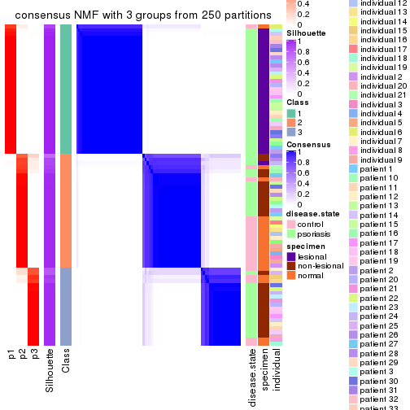</p>

</div>
<div id='tab-MAD-NMF-consensus-heatmap-3'>
<pre><code class="r">consensus_heatmap(res, k = 4)
</code></pre>

<p></p>

</div>
<div id='tab-MAD-NMF-consensus-heatmap-4'>
<pre><code class="r">consensus_heatmap(res, k = 5)
</code></pre>

<p></p>

</div>
<div id='tab-MAD-NMF-consensus-heatmap-5'>
<pre><code class="r">consensus_heatmap(res, k = 6)
</code></pre>

<p></p>

</div>
</div>

Heatmaps for the membership of samples in all partitions to see how consistent they are:


<script>
$( function() {
	$( '#tabs-MAD-NMF-membership-heatmap' ).tabs();
} );
</script>
<div id='tabs-MAD-NMF-membership-heatmap'>
<ul>
<li><a href='#tab-MAD-NMF-membership-heatmap-1'>k = 2</a></li>
<li><a href='#tab-MAD-NMF-membership-heatmap-2'>k = 3</a></li>
<li><a href='#tab-MAD-NMF-membership-heatmap-3'>k = 4</a></li>
<li><a href='#tab-MAD-NMF-membership-heatmap-4'>k = 5</a></li>
<li><a href='#tab-MAD-NMF-membership-heatmap-5'>k = 6</a></li>
</ul>
<div id='tab-MAD-NMF-membership-heatmap-1'>
<pre><code class="r">membership_heatmap(res, k = 2)
</code></pre>

<p></p>

</div>
<div id='tab-MAD-NMF-membership-heatmap-2'>
<pre><code class="r">membership_heatmap(res, k = 3)
</code></pre>

<p></p>

</div>
<div id='tab-MAD-NMF-membership-heatmap-3'>
<pre><code class="r">membership_heatmap(res, k = 4)
</code></pre>

<p></p>

</div>
<div id='tab-MAD-NMF-membership-heatmap-4'>
<pre><code class="r">membership_heatmap(res, k = 5)
</code></pre>

<p></p>

</div>
<div id='tab-MAD-NMF-membership-heatmap-5'>
<pre><code class="r">membership_heatmap(res, k = 6)
</code></pre>

<p></p>

</div>
</div>

As soon as we have had the classes for columns, we can look for signatures
which are significantly different between classes which can be candidate marks
for certain classes. Following are the heatmaps for signatures.


Signature heatmaps where rows are scaled:


<script>
$( function() {
	$( '#tabs-MAD-NMF-get-signatures' ).tabs();
} );
</script>
<div id='tabs-MAD-NMF-get-signatures'>
<ul>
<li><a href='#tab-MAD-NMF-get-signatures-1'>k = 2</a></li>
<li><a href='#tab-MAD-NMF-get-signatures-2'>k = 3</a></li>
<li><a href='#tab-MAD-NMF-get-signatures-3'>k = 4</a></li>
<li><a href='#tab-MAD-NMF-get-signatures-4'>k = 5</a></li>
<li><a href='#tab-MAD-NMF-get-signatures-5'>k = 6</a></li>
</ul>
<div id='tab-MAD-NMF-get-signatures-1'>
<pre><code class="r">get_signatures(res, k = 2)
</code></pre>

<p></p>

</div>
<div id='tab-MAD-NMF-get-signatures-2'>
<pre><code class="r">get_signatures(res, k = 3)
</code></pre>

<p></p>

</div>
<div id='tab-MAD-NMF-get-signatures-3'>
<pre><code class="r">get_signatures(res, k = 4)
</code></pre>

<p></p>

</div>
<div id='tab-MAD-NMF-get-signatures-4'>
<pre><code class="r">get_signatures(res, k = 5)
</code></pre>

<p></p>

</div>
<div id='tab-MAD-NMF-get-signatures-5'>
<pre><code class="r">get_signatures(res, k = 6)
</code></pre>

<p></p>

</div>
</div>


Signature heatmaps where rows are not scaled:


<script>
$( function() {
	$( '#tabs-MAD-NMF-get-signatures-no-scale' ).tabs();
} );
</script>
<div id='tabs-MAD-NMF-get-signatures-no-scale'>
<ul>
<li><a href='#tab-MAD-NMF-get-signatures-no-scale-1'>k = 2</a></li>
<li><a href='#tab-MAD-NMF-get-signatures-no-scale-2'>k = 3</a></li>
<li><a href='#tab-MAD-NMF-get-signatures-no-scale-3'>k = 4</a></li>
<li><a href='#tab-MAD-NMF-get-signatures-no-scale-4'>k = 5</a></li>
<li><a href='#tab-MAD-NMF-get-signatures-no-scale-5'>k = 6</a></li>
</ul>
<div id='tab-MAD-NMF-get-signatures-no-scale-1'>
<pre><code class="r">get_signatures(res, k = 2, scale_rows = FALSE)
</code></pre>

<p></p>

</div>
<div id='tab-MAD-NMF-get-signatures-no-scale-2'>
<pre><code class="r">get_signatures(res, k = 3, scale_rows = FALSE)
</code></pre>

<p></p>

</div>
<div id='tab-MAD-NMF-get-signatures-no-scale-3'>
<pre><code class="r">get_signatures(res, k = 4, scale_rows = FALSE)
</code></pre>

<p></p>

</div>
<div id='tab-MAD-NMF-get-signatures-no-scale-4'>
<pre><code class="r">get_signatures(res, k = 5, scale_rows = FALSE)
</code></pre>

<p></p>

</div>
<div id='tab-MAD-NMF-get-signatures-no-scale-5'>
<pre><code class="r">get_signatures(res, k = 6, scale_rows = FALSE)
</code></pre>

<p></p>

</div>
</div>


Compare the overlap of signatures from different k:

```r
compare_signatures(res)
```


`get_signature()` returns a data frame invisibly. TO get the list of signatures, the function
call should be assigned to a variable explicitly. In following code, if `plot` argument is set
to `FALSE`, no heatmap is plotted while only the differential analysis is performed.

```r
# code only for demonstration
tb = get_signature(res, k = ..., plot = FALSE)
```

An example of the output of `tb` is:

```
#>   which_row         fdr    mean_1    mean_2 scaled_mean_1 scaled_mean_2 km
#> 1        38 0.042760348  8.373488  9.131774    -0.5533452     0.5164555  1
#> 2        40 0.018707592  7.106213  8.469186    -0.6173731     0.5762149  1
#> 3        55 0.019134737 10.221463 11.207825    -0.6159697     0.5749050  1
#> 4        59 0.006059896  5.921854  7.869574    -0.6899429     0.6439467  1
#> 5        60 0.018055526  8.928898 10.211722    -0.6204761     0.5791110  1
#> 6        98 0.009384629 15.714769 14.887706     0.6635654    -0.6193277  2
...
```

The columns in `tb` are:

1. `which_row`: row indices corresponding to the input matrix.
2. `fdr`: FDR for the differential test. 
3. `mean_x`: The mean value in group x.
4. `scaled_mean_x`: The mean value in group x after rows are scaled.
5. `km`: Row groups if k-means clustering is applied to rows.


UMAP plot which shows how samples are separated.


<script>
$( function() {
	$( '#tabs-MAD-NMF-dimension-reduction' ).tabs();
} );
</script>
<div id='tabs-MAD-NMF-dimension-reduction'>
<ul>
<li><a href='#tab-MAD-NMF-dimension-reduction-1'>k = 2</a></li>
<li><a href='#tab-MAD-NMF-dimension-reduction-2'>k = 3</a></li>
<li><a href='#tab-MAD-NMF-dimension-reduction-3'>k = 4</a></li>
<li><a href='#tab-MAD-NMF-dimension-reduction-4'>k = 5</a></li>
<li><a href='#tab-MAD-NMF-dimension-reduction-5'>k = 6</a></li>
</ul>
<div id='tab-MAD-NMF-dimension-reduction-1'>
<pre><code class="r">dimension_reduction(res, k = 2, method = &quot;UMAP&quot;)
</code></pre>

<p></p>

</div>
<div id='tab-MAD-NMF-dimension-reduction-2'>
<pre><code class="r">dimension_reduction(res, k = 3, method = &quot;UMAP&quot;)
</code></pre>

<p></p>

</div>
<div id='tab-MAD-NMF-dimension-reduction-3'>
<pre><code class="r">dimension_reduction(res, k = 4, method = &quot;UMAP&quot;)
</code></pre>

<p></p>

</div>
<div id='tab-MAD-NMF-dimension-reduction-4'>
<pre><code class="r">dimension_reduction(res, k = 5, method = &quot;UMAP&quot;)
</code></pre>

<p></p>

</div>
<div id='tab-MAD-NMF-dimension-reduction-5'>
<pre><code class="r">dimension_reduction(res, k = 6, method = &quot;UMAP&quot;)
</code></pre>

<p></p>

</div>
</div>


Following heatmap shows how subgroups are split when increasing `k`:

```r
collect_classes(res)
```


Test correlation between subgroups and known annotations. If the known
annotation is numeric, one-way ANOVA test is applied, and if the known
annotation is discrete, chi-squared contingency table test is applied.

```r
test_to_known_factors(res)
```

```
#>          n disease.state(p) specimen(p) individual(p) k
#> MAD:NMF 82         3.35e-04    8.50e-17         0.999 2
#> MAD:NMF 82         6.72e-05    1.37e-16         0.972 3
#> MAD:NMF 74         2.92e-13    2.10e-24         0.865 4
#> MAD:NMF 77         2.43e-11    1.72e-21         0.289 5
#> MAD:NMF 59         1.20e-09    8.26e-18         0.320 6
```


If matrix rows can be associated to genes, consider to use `GO_Enrichment(res,
...)` to perform function enrichment for the signature genes.


 

---------------------------------------------------


### ATC:hclust


The object with results only for a single top-value method and a single partition method 
can be extracted as:

```r
res = res_list["ATC", "hclust"]
# you can also extract it by
# res = res_list["ATC:hclust"]
```

A summary of `res` and all the functions that can be applied to it:

```r
res
```

```
#> A 'ConsensusPartition' object with k = 2, 3, 4, 5, 6.
#>   On a matrix with 51941 rows and 82 columns.
#>   Top rows (1000, 2000, 3000, 4000, 5000) are extracted by 'ATC' method.
#>   Subgroups are detected by 'hclust' method.
#>   Performed in total 1250 partitions by row resampling.
#>   Best k for subgroups seems to be 2.
#> 
#> Following methods can be applied to this 'ConsensusPartition' object:
#>  [1] "cola_report"             "collect_classes"         "collect_plots"          
#>  [4] "collect_stats"           "colnames"                "compare_signatures"     
#>  [7] "consensus_heatmap"       "dimension_reduction"     "functional_enrichment"  
#> [10] "get_anno_col"            "get_anno"                "get_classes"            
#> [13] "get_consensus"           "get_matrix"              "get_membership"         
#> [16] "get_param"               "get_signatures"          "get_stats"              
#> [19] "is_best_k"               "is_stable_k"             "membership_heatmap"     
#> [22] "ncol"                    "nrow"                    "plot_ecdf"              
#> [25] "rownames"                "select_partition_number" "show"                   
#> [28] "suggest_best_k"          "test_to_known_factors"
```

`collect_plots()` function collects all the plots made from `res` for all `k` (number of partitions)
into one single page to provide an easy and fast comparison between different `k`.

```r
collect_plots(res)
```


The plots are:

- The first row: a plot of the ECDF (Empirical cumulative distribution
  function) curves of the consensus matrix for each `k` and the heatmap of
  predicted classes for each `k`.
- The second row: heatmaps of the consensus matrix for each `k`.
- The third row: heatmaps of the membership matrix for each `k`.
- The fouth row: heatmaps of the signatures for each `k`.

All the plots in panels can be made by individual functions and they are
plotted later in this section.

`select_partition_number()` produces several plots showing different
statistics for choosing "optimized" `k`. There are following statistics:

- ECDF curves of the consensus matrix for each `k`;
- 1-PAC. [The PAC
  score](https://en.wikipedia.org/wiki/Consensus_clustering#Over-interpretation_potential_of_consensus_clustering)
  measures the proportion of the ambiguous subgrouping.
- Mean silhouette score.
- Concordance. The mean probability of fiting the consensus class ids in all
  partitions.
- Area increased. Denote $A_k$ as the area under the ECDF curve for current
  `k`, the area increased is defined as $A_k - A_{k-1}$.
- Rand index. The percent of pairs of samples that are both in a same cluster
  or both are not in a same cluster in the partition of k and k-1.
- Jaccard index. The ratio of pairs of samples are both in a same cluster in
  the partition of k and k-1 and the pairs of samples are both in a same
  cluster in the partition k or k-1.

The detailed explanations of these statistics can be found in [the cola
vignette](http://bioconductor.org/packages/devel/bioc/vignettes/cola/inst/doc/cola.html#toc_13).

Generally speaking, lower PAC score, higher mean silhouette score or higher
concordance corresponds to better partition. Rand index and Jaccard index
measure how similar the current partition is compared to partition with `k-1`.
If they are too similar, we won't accept `k` is better than `k-1`.

```r
select_partition_number(res)
```


The numeric values for all these statistics can be obtained by `get_stats()`.

```r
get_stats(res)
```

```
#>   k 1-PAC mean_silhouette concordance area_increased  Rand Jaccard
#> 2 2 0.877           0.910       0.963         0.4792 0.518   0.518
#> 3 3 0.659           0.738       0.874         0.3412 0.822   0.662
#> 4 4 0.710           0.680       0.847         0.0791 0.853   0.633
#> 5 5 0.676           0.574       0.763         0.0575 0.886   0.649
#> 6 6 0.733           0.599       0.803         0.0677 0.918   0.690
```

`suggest_best_k()` suggests the best $k$ based on these statistics. The rules are as follows:

- All $k$ with Jaccard index larger than 0.95 are removed because the increase of
  the partition number does not provides enough extra information. If all $k$ are removed,
  the best $k$ is assigned by `NA`.
- For $k$ with 1-PAC larger than 0.9, the maximal $k$ is taken as the "best k". Other $k$ is called "optional k".
- If it does not fit the second rule. The $k$ with the highest vote of highest
  1-PAC, mean silhouette and concordance is taken as the "best k".

```r
suggest_best_k(res)
```

```
#> [1] 2
```


Following shows the table of the partitions (You need to click the **show/hide
code output** link to see it). The membership matrix (columns with name `p*`)
is inferred by
[`clue::cl_consensus()`](https://www.rdocumentation.org/link/cl_consensus?package=clue)
function with the `SE` method. Basically the value in the membership matrix
represents the probability to belong to a certain group. The finall class
label for an item is determined with the group with highest probability it
belongs to.

In `get_classes()` function, the entropy is calculated from the membership
matrix and the silhouette score is calculated from the consensus matrix.


<script>
$( function() {
	$( '#tabs-ATC-hclust-get-classes' ).tabs();
} );
</script>
<div id='tabs-ATC-hclust-get-classes'>
<ul>
<li><a href='#tab-ATC-hclust-get-classes-1'>k = 2</a></li>
<li><a href='#tab-ATC-hclust-get-classes-2'>k = 3</a></li>
<li><a href='#tab-ATC-hclust-get-classes-3'>k = 4</a></li>
<li><a href='#tab-ATC-hclust-get-classes-4'>k = 5</a></li>
<li><a href='#tab-ATC-hclust-get-classes-5'>k = 6</a></li>
</ul>

<div id='tab-ATC-hclust-get-classes-1'>
<p><a id='tab-ATC-hclust-get-classes-1-a' style='color:#0366d6' href='#'>show/hide code output</a></p>
<pre><code class="r">cbind(get_classes(res, k = 2), get_membership(res, k = 2))
</code></pre>

<pre><code>#&gt;           class entropy silhouette    p1    p2
#&gt; GSM372286     2  0.0000     0.9638 0.000 1.000
#&gt; GSM372287     2  0.0000     0.9638 0.000 1.000
#&gt; GSM372288     2  0.0000     0.9638 0.000 1.000
#&gt; GSM372289     2  0.0000     0.9638 0.000 1.000
#&gt; GSM372290     2  0.0000     0.9638 0.000 1.000
#&gt; GSM372291     2  0.9933     0.1712 0.452 0.548
#&gt; GSM372292     2  0.0000     0.9638 0.000 1.000
#&gt; GSM372293     2  0.0938     0.9597 0.012 0.988
#&gt; GSM372294     2  0.0000     0.9638 0.000 1.000
#&gt; GSM372295     2  0.0000     0.9638 0.000 1.000
#&gt; GSM372296     2  0.0000     0.9638 0.000 1.000
#&gt; GSM372297     2  0.0000     0.9638 0.000 1.000
#&gt; GSM372298     2  0.0000     0.9638 0.000 1.000
#&gt; GSM372299     2  0.0938     0.9597 0.012 0.988
#&gt; GSM372300     2  0.0938     0.9597 0.012 0.988
#&gt; GSM372301     2  0.0000     0.9638 0.000 1.000
#&gt; GSM372302     2  0.0000     0.9638 0.000 1.000
#&gt; GSM372303     2  0.1633     0.9510 0.024 0.976
#&gt; GSM372304     2  0.0000     0.9638 0.000 1.000
#&gt; GSM372305     2  0.0000     0.9638 0.000 1.000
#&gt; GSM372306     2  0.0000     0.9638 0.000 1.000
#&gt; GSM372307     2  0.0000     0.9638 0.000 1.000
#&gt; GSM372309     2  0.0000     0.9638 0.000 1.000
#&gt; GSM372311     2  0.0000     0.9638 0.000 1.000
#&gt; GSM372313     2  0.0000     0.9638 0.000 1.000
#&gt; GSM372315     2  0.0000     0.9638 0.000 1.000
#&gt; GSM372317     2  0.0000     0.9638 0.000 1.000
#&gt; GSM372319     2  0.0000     0.9638 0.000 1.000
#&gt; GSM372321     2  0.0000     0.9638 0.000 1.000
#&gt; GSM372323     2  0.0938     0.9597 0.012 0.988
#&gt; GSM372326     2  0.0938     0.9597 0.012 0.988
#&gt; GSM372328     2  0.0000     0.9638 0.000 1.000
#&gt; GSM372330     2  0.0000     0.9638 0.000 1.000
#&gt; GSM372332     2  0.9286     0.4854 0.344 0.656
#&gt; GSM372335     2  0.0938     0.9597 0.012 0.988
#&gt; GSM372337     2  0.5842     0.8385 0.140 0.860
#&gt; GSM372339     2  0.0938     0.9597 0.012 0.988
#&gt; GSM372341     2  0.0938     0.9597 0.012 0.988
#&gt; GSM372343     2  0.0938     0.9597 0.012 0.988
#&gt; GSM372345     2  0.5842     0.8385 0.140 0.860
#&gt; GSM372347     2  0.5842     0.8385 0.140 0.860
#&gt; GSM372349     2  0.6247     0.8185 0.156 0.844
#&gt; GSM372351     2  0.0000     0.9638 0.000 1.000
#&gt; GSM372353     2  0.0938     0.9597 0.012 0.988
#&gt; GSM372355     2  0.0000     0.9638 0.000 1.000
#&gt; GSM372357     2  0.0000     0.9638 0.000 1.000
#&gt; GSM372359     2  0.0938     0.9597 0.012 0.988
#&gt; GSM372361     2  0.0000     0.9638 0.000 1.000
#&gt; GSM372363     2  0.0000     0.9638 0.000 1.000
#&gt; GSM372308     1  0.0938     0.9486 0.988 0.012
#&gt; GSM372310     1  0.0938     0.9486 0.988 0.012
#&gt; GSM372312     1  0.9970     0.0937 0.532 0.468
#&gt; GSM372314     1  0.0938     0.9486 0.988 0.012
#&gt; GSM372316     1  0.0000     0.9536 1.000 0.000
#&gt; GSM372318     1  0.0000     0.9536 1.000 0.000
#&gt; GSM372320     1  0.0000     0.9536 1.000 0.000
#&gt; GSM372322     1  0.0000     0.9536 1.000 0.000
#&gt; GSM372324     1  0.0000     0.9536 1.000 0.000
#&gt; GSM372325     1  0.0938     0.9486 0.988 0.012
#&gt; GSM372327     1  0.0000     0.9536 1.000 0.000
#&gt; GSM372329     1  0.0000     0.9536 1.000 0.000
#&gt; GSM372331     1  0.0938     0.9486 0.988 0.012
#&gt; GSM372333     1  0.9044     0.5096 0.680 0.320
#&gt; GSM372334     1  0.0000     0.9536 1.000 0.000
#&gt; GSM372336     1  0.0000     0.9536 1.000 0.000
#&gt; GSM372338     1  0.0000     0.9536 1.000 0.000
#&gt; GSM372340     1  0.0000     0.9536 1.000 0.000
#&gt; GSM372342     1  0.0000     0.9536 1.000 0.000
#&gt; GSM372344     1  0.0000     0.9536 1.000 0.000
#&gt; GSM372346     1  0.0000     0.9536 1.000 0.000
#&gt; GSM372348     1  0.0000     0.9536 1.000 0.000
#&gt; GSM372350     1  0.9933     0.1513 0.548 0.452
#&gt; GSM372352     2  0.5842     0.8385 0.140 0.860
#&gt; GSM372354     1  0.0000     0.9536 1.000 0.000
#&gt; GSM372356     1  0.0938     0.9486 0.988 0.012
#&gt; GSM372358     1  0.0000     0.9536 1.000 0.000
#&gt; GSM372360     1  0.0000     0.9536 1.000 0.000
#&gt; GSM372362     1  0.0000     0.9536 1.000 0.000
#&gt; GSM372364     1  0.0000     0.9536 1.000 0.000
#&gt; GSM372365     1  0.0938     0.9486 0.988 0.012
#&gt; GSM372366     1  0.0000     0.9536 1.000 0.000
#&gt; GSM372367     1  0.0938     0.9486 0.988 0.012
</code></pre>

<script>
$('#tab-ATC-hclust-get-classes-1-a').parent().next().next().hide();
$('#tab-ATC-hclust-get-classes-1-a').click(function(){
  $('#tab-ATC-hclust-get-classes-1-a').parent().next().next().toggle();
  return(false);
});
</script>
</div>

<div id='tab-ATC-hclust-get-classes-2'>
<p><a id='tab-ATC-hclust-get-classes-2-a' style='color:#0366d6' href='#'>show/hide code output</a></p>
<pre><code class="r">cbind(get_classes(res, k = 3), get_membership(res, k = 3))
</code></pre>

<pre><code>#&gt;           class entropy silhouette    p1    p2    p3
#&gt; GSM372286     2  0.0592      0.779 0.000 0.988 0.012
#&gt; GSM372287     2  0.0000      0.781 0.000 1.000 0.000
#&gt; GSM372288     2  0.0000      0.781 0.000 1.000 0.000
#&gt; GSM372289     2  0.0000      0.781 0.000 1.000 0.000
#&gt; GSM372290     2  0.0000      0.781 0.000 1.000 0.000
#&gt; GSM372291     3  0.5529      0.421 0.296 0.000 0.704
#&gt; GSM372292     2  0.6062      0.512 0.000 0.616 0.384
#&gt; GSM372293     3  0.5058      0.576 0.000 0.244 0.756
#&gt; GSM372294     3  0.5948      0.432 0.000 0.360 0.640
#&gt; GSM372295     3  0.5058      0.608 0.000 0.244 0.756
#&gt; GSM372296     2  0.0000      0.781 0.000 1.000 0.000
#&gt; GSM372297     2  0.0000      0.781 0.000 1.000 0.000
#&gt; GSM372298     2  0.0000      0.781 0.000 1.000 0.000
#&gt; GSM372299     2  0.6286      0.372 0.000 0.536 0.464
#&gt; GSM372300     3  0.5058      0.576 0.000 0.244 0.756
#&gt; GSM372301     2  0.6126      0.490 0.000 0.600 0.400
#&gt; GSM372302     2  0.0000      0.781 0.000 1.000 0.000
#&gt; GSM372303     3  0.3619      0.695 0.000 0.136 0.864
#&gt; GSM372304     2  0.0000      0.781 0.000 1.000 0.000
#&gt; GSM372305     2  0.0000      0.781 0.000 1.000 0.000
#&gt; GSM372306     2  0.5678      0.591 0.000 0.684 0.316
#&gt; GSM372307     2  0.0000      0.781 0.000 1.000 0.000
#&gt; GSM372309     2  0.5678      0.591 0.000 0.684 0.316
#&gt; GSM372311     2  0.0000      0.781 0.000 1.000 0.000
#&gt; GSM372313     2  0.2356      0.757 0.000 0.928 0.072
#&gt; GSM372315     2  0.0000      0.781 0.000 1.000 0.000
#&gt; GSM372317     2  0.4842      0.659 0.000 0.776 0.224
#&gt; GSM372319     2  0.0000      0.781 0.000 1.000 0.000
#&gt; GSM372321     2  0.0000      0.781 0.000 1.000 0.000
#&gt; GSM372323     2  0.6291      0.362 0.000 0.532 0.468
#&gt; GSM372326     2  0.6291      0.362 0.000 0.532 0.468
#&gt; GSM372328     2  0.6045      0.520 0.000 0.620 0.380
#&gt; GSM372330     2  0.0000      0.781 0.000 1.000 0.000
#&gt; GSM372332     3  0.4399      0.630 0.188 0.000 0.812
#&gt; GSM372335     2  0.6225      0.437 0.000 0.568 0.432
#&gt; GSM372337     3  0.3038      0.719 0.000 0.104 0.896
#&gt; GSM372339     3  0.4121      0.675 0.000 0.168 0.832
#&gt; GSM372341     3  0.4121      0.675 0.000 0.168 0.832
#&gt; GSM372343     2  0.6291      0.362 0.000 0.532 0.468
#&gt; GSM372345     3  0.3038      0.719 0.000 0.104 0.896
#&gt; GSM372347     3  0.3038      0.719 0.000 0.104 0.896
#&gt; GSM372349     3  0.0424      0.699 0.000 0.008 0.992
#&gt; GSM372351     2  0.6026      0.526 0.000 0.624 0.376
#&gt; GSM372353     2  0.6225      0.437 0.000 0.568 0.432
#&gt; GSM372355     2  0.1031      0.776 0.000 0.976 0.024
#&gt; GSM372357     2  0.4452      0.690 0.000 0.808 0.192
#&gt; GSM372359     2  0.6225      0.437 0.000 0.568 0.432
#&gt; GSM372361     2  0.0747      0.778 0.000 0.984 0.016
#&gt; GSM372363     2  0.0000      0.781 0.000 1.000 0.000
#&gt; GSM372308     1  0.3551      0.869 0.868 0.000 0.132
#&gt; GSM372310     1  0.3551      0.869 0.868 0.000 0.132
#&gt; GSM372312     3  0.6026      0.262 0.376 0.000 0.624
#&gt; GSM372314     1  0.3192      0.886 0.888 0.000 0.112
#&gt; GSM372316     1  0.0000      0.956 1.000 0.000 0.000
#&gt; GSM372318     1  0.0000      0.956 1.000 0.000 0.000
#&gt; GSM372320     1  0.0000      0.956 1.000 0.000 0.000
#&gt; GSM372322     1  0.0000      0.956 1.000 0.000 0.000
#&gt; GSM372324     1  0.2537      0.909 0.920 0.000 0.080
#&gt; GSM372325     1  0.3551      0.869 0.868 0.000 0.132
#&gt; GSM372327     1  0.0000      0.956 1.000 0.000 0.000
#&gt; GSM372329     1  0.0000      0.956 1.000 0.000 0.000
#&gt; GSM372331     1  0.3551      0.869 0.868 0.000 0.132
#&gt; GSM372333     1  0.6260      0.281 0.552 0.000 0.448
#&gt; GSM372334     1  0.0000      0.956 1.000 0.000 0.000
#&gt; GSM372336     1  0.0000      0.956 1.000 0.000 0.000
#&gt; GSM372338     1  0.0000      0.956 1.000 0.000 0.000
#&gt; GSM372340     1  0.0000      0.956 1.000 0.000 0.000
#&gt; GSM372342     1  0.0000      0.956 1.000 0.000 0.000
#&gt; GSM372344     1  0.0000      0.956 1.000 0.000 0.000
#&gt; GSM372346     1  0.0000      0.956 1.000 0.000 0.000
#&gt; GSM372348     1  0.0000      0.956 1.000 0.000 0.000
#&gt; GSM372350     3  0.6168      0.175 0.412 0.000 0.588
#&gt; GSM372352     3  0.2959      0.719 0.000 0.100 0.900
#&gt; GSM372354     1  0.0000      0.956 1.000 0.000 0.000
#&gt; GSM372356     1  0.1031      0.944 0.976 0.000 0.024
#&gt; GSM372358     1  0.0000      0.956 1.000 0.000 0.000
#&gt; GSM372360     1  0.0000      0.956 1.000 0.000 0.000
#&gt; GSM372362     1  0.0000      0.956 1.000 0.000 0.000
#&gt; GSM372364     1  0.0000      0.956 1.000 0.000 0.000
#&gt; GSM372365     1  0.1031      0.944 0.976 0.000 0.024
#&gt; GSM372366     1  0.0000      0.956 1.000 0.000 0.000
#&gt; GSM372367     1  0.1031      0.944 0.976 0.000 0.024
</code></pre>

<script>
$('#tab-ATC-hclust-get-classes-2-a').parent().next().next().hide();
$('#tab-ATC-hclust-get-classes-2-a').click(function(){
  $('#tab-ATC-hclust-get-classes-2-a').parent().next().next().toggle();
  return(false);
});
</script>
</div>

<div id='tab-ATC-hclust-get-classes-3'>
<p><a id='tab-ATC-hclust-get-classes-3-a' style='color:#0366d6' href='#'>show/hide code output</a></p>
<pre><code class="r">cbind(get_classes(res, k = 4), get_membership(res, k = 4))
</code></pre>

<pre><code>#&gt;           class entropy silhouette    p1    p2    p3    p4
#&gt; GSM372286     2  0.0469     0.8889 0.000 0.988 0.012 0.000
#&gt; GSM372287     2  0.0000     0.8981 0.000 1.000 0.000 0.000
#&gt; GSM372288     2  0.0000     0.8981 0.000 1.000 0.000 0.000
#&gt; GSM372289     2  0.0000     0.8981 0.000 1.000 0.000 0.000
#&gt; GSM372290     2  0.0000     0.8981 0.000 1.000 0.000 0.000
#&gt; GSM372291     4  0.5769     0.6293 0.036 0.000 0.376 0.588
#&gt; GSM372292     3  0.4989     0.3774 0.000 0.472 0.528 0.000
#&gt; GSM372293     3  0.2345     0.5742 0.000 0.100 0.900 0.000
#&gt; GSM372294     3  0.7096     0.0175 0.000 0.332 0.524 0.144
#&gt; GSM372295     3  0.6149     0.2102 0.000 0.180 0.676 0.144
#&gt; GSM372296     2  0.0000     0.8981 0.000 1.000 0.000 0.000
#&gt; GSM372297     2  0.0000     0.8981 0.000 1.000 0.000 0.000
#&gt; GSM372298     2  0.0000     0.8981 0.000 1.000 0.000 0.000
#&gt; GSM372299     3  0.5256     0.5101 0.000 0.392 0.596 0.012
#&gt; GSM372300     3  0.2345     0.5742 0.000 0.100 0.900 0.000
#&gt; GSM372301     3  0.4972     0.4121 0.000 0.456 0.544 0.000
#&gt; GSM372302     2  0.0000     0.8981 0.000 1.000 0.000 0.000
#&gt; GSM372303     3  0.0336     0.4668 0.000 0.000 0.992 0.008
#&gt; GSM372304     2  0.0000     0.8981 0.000 1.000 0.000 0.000
#&gt; GSM372305     2  0.0000     0.8981 0.000 1.000 0.000 0.000
#&gt; GSM372306     2  0.4888    -0.0428 0.000 0.588 0.412 0.000
#&gt; GSM372307     2  0.0000     0.8981 0.000 1.000 0.000 0.000
#&gt; GSM372309     2  0.4888    -0.0428 0.000 0.588 0.412 0.000
#&gt; GSM372311     2  0.0000     0.8981 0.000 1.000 0.000 0.000
#&gt; GSM372313     2  0.2760     0.7494 0.000 0.872 0.128 0.000
#&gt; GSM372315     2  0.0000     0.8981 0.000 1.000 0.000 0.000
#&gt; GSM372317     2  0.4431     0.3555 0.000 0.696 0.304 0.000
#&gt; GSM372319     2  0.0000     0.8981 0.000 1.000 0.000 0.000
#&gt; GSM372321     2  0.0000     0.8981 0.000 1.000 0.000 0.000
#&gt; GSM372323     3  0.4817     0.5188 0.000 0.388 0.612 0.000
#&gt; GSM372326     3  0.4817     0.5188 0.000 0.388 0.612 0.000
#&gt; GSM372328     3  0.4998     0.3371 0.000 0.488 0.512 0.000
#&gt; GSM372330     2  0.0000     0.8981 0.000 1.000 0.000 0.000
#&gt; GSM372332     3  0.6005    -0.3070 0.040 0.000 0.500 0.460
#&gt; GSM372335     3  0.4916     0.4749 0.000 0.424 0.576 0.000
#&gt; GSM372337     3  0.4581     0.4829 0.000 0.080 0.800 0.120
#&gt; GSM372339     3  0.1004     0.5025 0.000 0.024 0.972 0.004
#&gt; GSM372341     3  0.1004     0.5025 0.000 0.024 0.972 0.004
#&gt; GSM372343     3  0.4817     0.5184 0.000 0.388 0.612 0.000
#&gt; GSM372345     3  0.4581     0.4829 0.000 0.080 0.800 0.120
#&gt; GSM372347     3  0.4581     0.4829 0.000 0.080 0.800 0.120
#&gt; GSM372349     3  0.3356     0.2650 0.000 0.000 0.824 0.176
#&gt; GSM372351     3  0.4994     0.3553 0.000 0.480 0.520 0.000
#&gt; GSM372353     3  0.4916     0.4749 0.000 0.424 0.576 0.000
#&gt; GSM372355     2  0.1474     0.8498 0.000 0.948 0.052 0.000
#&gt; GSM372357     2  0.4454     0.3679 0.000 0.692 0.308 0.000
#&gt; GSM372359     3  0.4916     0.4749 0.000 0.424 0.576 0.000
#&gt; GSM372361     2  0.0592     0.8856 0.000 0.984 0.016 0.000
#&gt; GSM372363     2  0.0000     0.8981 0.000 1.000 0.000 0.000
#&gt; GSM372308     1  0.4831     0.6229 0.704 0.000 0.016 0.280
#&gt; GSM372310     1  0.4831     0.6229 0.704 0.000 0.016 0.280
#&gt; GSM372312     4  0.4553     0.7422 0.040 0.000 0.180 0.780
#&gt; GSM372314     1  0.4630     0.6648 0.732 0.000 0.016 0.252
#&gt; GSM372316     1  0.1022     0.8915 0.968 0.000 0.000 0.032
#&gt; GSM372318     1  0.0921     0.8923 0.972 0.000 0.000 0.028
#&gt; GSM372320     1  0.1118     0.8898 0.964 0.000 0.000 0.036
#&gt; GSM372322     1  0.1022     0.8915 0.968 0.000 0.000 0.032
#&gt; GSM372324     1  0.4086     0.7211 0.776 0.000 0.008 0.216
#&gt; GSM372325     1  0.4831     0.6229 0.704 0.000 0.016 0.280
#&gt; GSM372327     1  0.0000     0.8949 1.000 0.000 0.000 0.000
#&gt; GSM372329     1  0.0000     0.8949 1.000 0.000 0.000 0.000
#&gt; GSM372331     1  0.4831     0.6229 0.704 0.000 0.016 0.280
#&gt; GSM372333     4  0.7085     0.5046 0.300 0.000 0.156 0.544
#&gt; GSM372334     1  0.1118     0.8898 0.964 0.000 0.000 0.036
#&gt; GSM372336     1  0.0336     0.8945 0.992 0.000 0.000 0.008
#&gt; GSM372338     1  0.1118     0.8898 0.964 0.000 0.000 0.036
#&gt; GSM372340     1  0.1118     0.8898 0.964 0.000 0.000 0.036
#&gt; GSM372342     1  0.0336     0.8945 0.992 0.000 0.000 0.008
#&gt; GSM372344     1  0.1118     0.8898 0.964 0.000 0.000 0.036
#&gt; GSM372346     1  0.1022     0.8915 0.968 0.000 0.000 0.032
#&gt; GSM372348     1  0.0336     0.8945 0.992 0.000 0.000 0.008
#&gt; GSM372350     4  0.1211     0.7119 0.040 0.000 0.000 0.960
#&gt; GSM372352     3  0.4513     0.4770 0.000 0.076 0.804 0.120
#&gt; GSM372354     1  0.1022     0.8915 0.968 0.000 0.000 0.032
#&gt; GSM372356     1  0.2589     0.8338 0.884 0.000 0.000 0.116
#&gt; GSM372358     1  0.0469     0.8935 0.988 0.000 0.000 0.012
#&gt; GSM372360     1  0.0336     0.8945 0.992 0.000 0.000 0.008
#&gt; GSM372362     1  0.0336     0.8945 0.992 0.000 0.000 0.008
#&gt; GSM372364     1  0.0469     0.8935 0.988 0.000 0.000 0.012
#&gt; GSM372365     1  0.2589     0.8338 0.884 0.000 0.000 0.116
#&gt; GSM372366     1  0.1022     0.8915 0.968 0.000 0.000 0.032
#&gt; GSM372367     1  0.2589     0.8338 0.884 0.000 0.000 0.116
</code></pre>

<script>
$('#tab-ATC-hclust-get-classes-3-a').parent().next().next().hide();
$('#tab-ATC-hclust-get-classes-3-a').click(function(){
  $('#tab-ATC-hclust-get-classes-3-a').parent().next().next().toggle();
  return(false);
});
</script>
</div>

<div id='tab-ATC-hclust-get-classes-4'>
<p><a id='tab-ATC-hclust-get-classes-4-a' style='color:#0366d6' href='#'>show/hide code output</a></p>
<pre><code class="r">cbind(get_classes(res, k = 5), get_membership(res, k = 5))
</code></pre>

<pre><code>#&gt;           class entropy silhouette    p1    p2    p3    p4    p5
#&gt; GSM372286     2  0.4060     0.9675 0.000 0.640 0.360 0.000 0.000
#&gt; GSM372287     2  0.3999     0.9800 0.000 0.656 0.344 0.000 0.000
#&gt; GSM372288     2  0.3999     0.9800 0.000 0.656 0.344 0.000 0.000
#&gt; GSM372289     2  0.3999     0.9800 0.000 0.656 0.344 0.000 0.000
#&gt; GSM372290     2  0.3999     0.9800 0.000 0.656 0.344 0.000 0.000
#&gt; GSM372291     4  0.3452     0.5074 0.000 0.032 0.000 0.820 0.148
#&gt; GSM372292     3  0.1732     0.5743 0.000 0.080 0.920 0.000 0.000
#&gt; GSM372293     3  0.4165     0.3172 0.000 0.000 0.672 0.320 0.008
#&gt; GSM372294     4  0.6181     0.2263 0.000 0.328 0.136 0.532 0.004
#&gt; GSM372295     4  0.6351     0.1642 0.000 0.176 0.288 0.532 0.004
#&gt; GSM372296     2  0.3999     0.9800 0.000 0.656 0.344 0.000 0.000
#&gt; GSM372297     2  0.3999     0.9800 0.000 0.656 0.344 0.000 0.000
#&gt; GSM372298     2  0.4030     0.9752 0.000 0.648 0.352 0.000 0.000
#&gt; GSM372299     3  0.0609     0.6265 0.000 0.000 0.980 0.000 0.020
#&gt; GSM372300     3  0.4165     0.3172 0.000 0.000 0.672 0.320 0.008
#&gt; GSM372301     3  0.1704     0.5927 0.000 0.068 0.928 0.004 0.000
#&gt; GSM372302     2  0.3999     0.9800 0.000 0.656 0.344 0.000 0.000
#&gt; GSM372303     3  0.4533     0.1077 0.000 0.000 0.544 0.448 0.008
#&gt; GSM372304     2  0.3999     0.9800 0.000 0.656 0.344 0.000 0.000
#&gt; GSM372305     2  0.4015     0.9778 0.000 0.652 0.348 0.000 0.000
#&gt; GSM372306     3  0.3274     0.2860 0.000 0.220 0.780 0.000 0.000
#&gt; GSM372307     2  0.3999     0.9800 0.000 0.656 0.344 0.000 0.000
#&gt; GSM372309     3  0.3274     0.2860 0.000 0.220 0.780 0.000 0.000
#&gt; GSM372311     2  0.3999     0.9800 0.000 0.656 0.344 0.000 0.000
#&gt; GSM372313     2  0.4304     0.7530 0.000 0.516 0.484 0.000 0.000
#&gt; GSM372315     2  0.4030     0.9752 0.000 0.648 0.352 0.000 0.000
#&gt; GSM372317     3  0.3966    -0.1838 0.000 0.336 0.664 0.000 0.000
#&gt; GSM372319     2  0.3999     0.9800 0.000 0.656 0.344 0.000 0.000
#&gt; GSM372321     2  0.3999     0.9800 0.000 0.656 0.344 0.000 0.000
#&gt; GSM372323     3  0.0510     0.6284 0.000 0.000 0.984 0.016 0.000
#&gt; GSM372326     3  0.0510     0.6284 0.000 0.000 0.984 0.016 0.000
#&gt; GSM372328     3  0.2124     0.5513 0.000 0.096 0.900 0.004 0.000
#&gt; GSM372330     2  0.4030     0.9752 0.000 0.648 0.352 0.000 0.000
#&gt; GSM372332     4  0.7923     0.3906 0.048 0.200 0.284 0.444 0.024
#&gt; GSM372335     3  0.0880     0.6243 0.000 0.032 0.968 0.000 0.000
#&gt; GSM372337     3  0.4294     0.1383 0.000 0.000 0.532 0.468 0.000
#&gt; GSM372339     3  0.4138     0.1937 0.000 0.000 0.616 0.384 0.000
#&gt; GSM372341     3  0.4138     0.1937 0.000 0.000 0.616 0.384 0.000
#&gt; GSM372343     3  0.0510     0.6284 0.000 0.000 0.984 0.016 0.000
#&gt; GSM372345     3  0.4294     0.1383 0.000 0.000 0.532 0.468 0.000
#&gt; GSM372347     3  0.4294     0.1383 0.000 0.000 0.532 0.468 0.000
#&gt; GSM372349     4  0.4565     0.0537 0.000 0.012 0.408 0.580 0.000
#&gt; GSM372351     3  0.2127     0.5350 0.000 0.108 0.892 0.000 0.000
#&gt; GSM372353     3  0.0880     0.6243 0.000 0.032 0.968 0.000 0.000
#&gt; GSM372355     2  0.4201     0.9005 0.000 0.592 0.408 0.000 0.000
#&gt; GSM372357     3  0.3966    -0.2493 0.000 0.336 0.664 0.000 0.000
#&gt; GSM372359     3  0.0880     0.6243 0.000 0.032 0.968 0.000 0.000
#&gt; GSM372361     2  0.4074     0.9630 0.000 0.636 0.364 0.000 0.000
#&gt; GSM372363     2  0.3999     0.9800 0.000 0.656 0.344 0.000 0.000
#&gt; GSM372308     1  0.5033     0.5921 0.716 0.000 0.004 0.156 0.124
#&gt; GSM372310     1  0.5033     0.5921 0.716 0.000 0.004 0.156 0.124
#&gt; GSM372312     4  0.6986     0.4763 0.048 0.224 0.016 0.584 0.128
#&gt; GSM372314     1  0.4743     0.6101 0.744 0.000 0.004 0.136 0.116
#&gt; GSM372316     1  0.1732     0.6282 0.920 0.000 0.000 0.000 0.080
#&gt; GSM372318     1  0.4138    -0.2708 0.616 0.000 0.000 0.000 0.384
#&gt; GSM372320     5  0.4074     1.0000 0.364 0.000 0.000 0.000 0.636
#&gt; GSM372322     1  0.4219    -0.3825 0.584 0.000 0.000 0.000 0.416
#&gt; GSM372324     1  0.4117     0.6337 0.788 0.000 0.000 0.116 0.096
#&gt; GSM372325     1  0.5033     0.5921 0.716 0.000 0.004 0.156 0.124
#&gt; GSM372327     1  0.3966    -0.1046 0.664 0.000 0.000 0.000 0.336
#&gt; GSM372329     1  0.3966    -0.1046 0.664 0.000 0.000 0.000 0.336
#&gt; GSM372331     1  0.5033     0.5921 0.716 0.000 0.004 0.156 0.124
#&gt; GSM372333     4  0.8360     0.0812 0.308 0.200 0.004 0.352 0.136
#&gt; GSM372334     5  0.4074     1.0000 0.364 0.000 0.000 0.000 0.636
#&gt; GSM372336     1  0.0162     0.6944 0.996 0.000 0.000 0.000 0.004
#&gt; GSM372338     5  0.4074     1.0000 0.364 0.000 0.000 0.000 0.636
#&gt; GSM372340     5  0.4074     1.0000 0.364 0.000 0.000 0.000 0.636
#&gt; GSM372342     1  0.0162     0.6944 0.996 0.000 0.000 0.000 0.004
#&gt; GSM372344     5  0.4074     1.0000 0.364 0.000 0.000 0.000 0.636
#&gt; GSM372346     1  0.4219    -0.3825 0.584 0.000 0.000 0.000 0.416
#&gt; GSM372348     1  0.0162     0.6944 0.996 0.000 0.000 0.000 0.004
#&gt; GSM372350     4  0.6736     0.3474 0.000 0.344 0.000 0.396 0.260
#&gt; GSM372352     3  0.4297     0.1298 0.000 0.000 0.528 0.472 0.000
#&gt; GSM372354     1  0.1732     0.6282 0.920 0.000 0.000 0.000 0.080
#&gt; GSM372356     1  0.2305     0.6858 0.896 0.000 0.000 0.012 0.092
#&gt; GSM372358     1  0.0000     0.6953 1.000 0.000 0.000 0.000 0.000
#&gt; GSM372360     1  0.0162     0.6944 0.996 0.000 0.000 0.000 0.004
#&gt; GSM372362     1  0.0162     0.6944 0.996 0.000 0.000 0.000 0.004
#&gt; GSM372364     1  0.0000     0.6953 1.000 0.000 0.000 0.000 0.000
#&gt; GSM372365     1  0.2305     0.6858 0.896 0.000 0.000 0.012 0.092
#&gt; GSM372366     1  0.1732     0.6282 0.920 0.000 0.000 0.000 0.080
#&gt; GSM372367     1  0.2305     0.6858 0.896 0.000 0.000 0.012 0.092
</code></pre>

<script>
$('#tab-ATC-hclust-get-classes-4-a').parent().next().next().hide();
$('#tab-ATC-hclust-get-classes-4-a').click(function(){
  $('#tab-ATC-hclust-get-classes-4-a').parent().next().next().toggle();
  return(false);
});
</script>
</div>

<div id='tab-ATC-hclust-get-classes-5'>
<p><a id='tab-ATC-hclust-get-classes-5-a' style='color:#0366d6' href='#'>show/hide code output</a></p>
<pre><code class="r">cbind(get_classes(res, k = 6), get_membership(res, k = 6))
</code></pre>

<pre><code>#&gt;           class entropy silhouette    p1    p2    p3    p4    p5    p6
#&gt; GSM372286     4  0.1444     0.9020 0.000 0.072 0.000 0.928 0.000 0.000
#&gt; GSM372287     4  0.0000     0.9331 0.000 0.000 0.000 1.000 0.000 0.000
#&gt; GSM372288     4  0.0000     0.9331 0.000 0.000 0.000 1.000 0.000 0.000
#&gt; GSM372289     4  0.0000     0.9331 0.000 0.000 0.000 1.000 0.000 0.000
#&gt; GSM372290     4  0.0000     0.9331 0.000 0.000 0.000 1.000 0.000 0.000
#&gt; GSM372291     6  0.4926     0.4009 0.068 0.000 0.392 0.000 0.000 0.540
#&gt; GSM372292     2  0.1674     0.6800 0.004 0.924 0.004 0.068 0.000 0.000
#&gt; GSM372293     2  0.4444    -0.3606 0.028 0.536 0.436 0.000 0.000 0.000
#&gt; GSM372294     3  0.5054    -0.0696 0.068 0.052 0.692 0.188 0.000 0.000
#&gt; GSM372295     3  0.4920     0.1019 0.068 0.204 0.692 0.036 0.000 0.000
#&gt; GSM372296     4  0.0000     0.9331 0.000 0.000 0.000 1.000 0.000 0.000
#&gt; GSM372297     4  0.0000     0.9331 0.000 0.000 0.000 1.000 0.000 0.000
#&gt; GSM372298     4  0.0458     0.9293 0.000 0.016 0.000 0.984 0.000 0.000
#&gt; GSM372299     2  0.1440     0.6636 0.004 0.948 0.032 0.004 0.012 0.000
#&gt; GSM372300     2  0.4444    -0.3606 0.028 0.536 0.436 0.000 0.000 0.000
#&gt; GSM372301     2  0.1644     0.6841 0.004 0.932 0.012 0.052 0.000 0.000
#&gt; GSM372302     4  0.0000     0.9331 0.000 0.000 0.000 1.000 0.000 0.000
#&gt; GSM372303     3  0.4682     0.4680 0.048 0.396 0.556 0.000 0.000 0.000
#&gt; GSM372304     4  0.0000     0.9331 0.000 0.000 0.000 1.000 0.000 0.000
#&gt; GSM372305     4  0.1075     0.9176 0.000 0.048 0.000 0.952 0.000 0.000
#&gt; GSM372306     2  0.2912     0.5401 0.000 0.784 0.000 0.216 0.000 0.000
#&gt; GSM372307     4  0.0000     0.9331 0.000 0.000 0.000 1.000 0.000 0.000
#&gt; GSM372309     2  0.2912     0.5401 0.000 0.784 0.000 0.216 0.000 0.000
#&gt; GSM372311     4  0.0000     0.9331 0.000 0.000 0.000 1.000 0.000 0.000
#&gt; GSM372313     4  0.3101     0.7097 0.000 0.244 0.000 0.756 0.000 0.000
#&gt; GSM372315     4  0.0937     0.9233 0.000 0.040 0.000 0.960 0.000 0.000
#&gt; GSM372317     2  0.3578     0.3749 0.000 0.660 0.000 0.340 0.000 0.000
#&gt; GSM372319     4  0.0632     0.9287 0.000 0.024 0.000 0.976 0.000 0.000
#&gt; GSM372321     4  0.0632     0.9287 0.000 0.024 0.000 0.976 0.000 0.000
#&gt; GSM372323     2  0.1007     0.6571 0.000 0.956 0.044 0.000 0.000 0.000
#&gt; GSM372326     2  0.1007     0.6571 0.000 0.956 0.044 0.000 0.000 0.000
#&gt; GSM372328     2  0.1700     0.6706 0.000 0.916 0.004 0.080 0.000 0.000
#&gt; GSM372330     4  0.0937     0.9233 0.000 0.040 0.000 0.960 0.000 0.000
#&gt; GSM372332     3  0.6805    -0.0253 0.004 0.204 0.448 0.000 0.052 0.292
#&gt; GSM372335     2  0.0458     0.6866 0.000 0.984 0.000 0.016 0.000 0.000
#&gt; GSM372337     3  0.4123     0.5913 0.000 0.420 0.568 0.000 0.012 0.000
#&gt; GSM372339     2  0.3797    -0.2000 0.000 0.580 0.420 0.000 0.000 0.000
#&gt; GSM372341     2  0.3797    -0.2000 0.000 0.580 0.420 0.000 0.000 0.000
#&gt; GSM372343     2  0.1219     0.6589 0.000 0.948 0.048 0.004 0.000 0.000
#&gt; GSM372345     3  0.4123     0.5913 0.000 0.420 0.568 0.000 0.012 0.000
#&gt; GSM372347     3  0.4123     0.5913 0.000 0.420 0.568 0.000 0.012 0.000
#&gt; GSM372349     3  0.4776     0.5857 0.000 0.300 0.636 0.000 0.012 0.052
#&gt; GSM372351     2  0.1765     0.6592 0.000 0.904 0.000 0.096 0.000 0.000
#&gt; GSM372353     2  0.0458     0.6866 0.000 0.984 0.000 0.016 0.000 0.000
#&gt; GSM372355     4  0.2664     0.7923 0.000 0.184 0.000 0.816 0.000 0.000
#&gt; GSM372357     4  0.3843     0.2418 0.000 0.452 0.000 0.548 0.000 0.000
#&gt; GSM372359     2  0.0458     0.6866 0.000 0.984 0.000 0.016 0.000 0.000
#&gt; GSM372361     4  0.1663     0.8894 0.000 0.088 0.000 0.912 0.000 0.000
#&gt; GSM372363     4  0.0000     0.9331 0.000 0.000 0.000 1.000 0.000 0.000
#&gt; GSM372308     5  0.3475     0.6339 0.052 0.004 0.124 0.000 0.816 0.004
#&gt; GSM372310     5  0.3475     0.6339 0.052 0.004 0.124 0.000 0.816 0.004
#&gt; GSM372312     6  0.6794     0.4613 0.052 0.020 0.320 0.000 0.132 0.476
#&gt; GSM372314     5  0.3375     0.6488 0.060 0.004 0.104 0.000 0.828 0.004
#&gt; GSM372316     5  0.3023     0.5638 0.232 0.000 0.000 0.000 0.768 0.000
#&gt; GSM372318     1  0.3823     0.5277 0.564 0.000 0.000 0.000 0.436 0.000
#&gt; GSM372320     1  0.2527     0.8289 0.832 0.000 0.000 0.000 0.168 0.000
#&gt; GSM372322     1  0.3756     0.6128 0.600 0.000 0.000 0.000 0.400 0.000
#&gt; GSM372324     5  0.3176     0.6665 0.084 0.000 0.084 0.000 0.832 0.000
#&gt; GSM372325     5  0.3475     0.6339 0.052 0.004 0.124 0.000 0.816 0.004
#&gt; GSM372327     5  0.3869    -0.4353 0.500 0.000 0.000 0.000 0.500 0.000
#&gt; GSM372329     5  0.3869    -0.4353 0.500 0.000 0.000 0.000 0.500 0.000
#&gt; GSM372331     5  0.3475     0.6339 0.052 0.004 0.124 0.000 0.816 0.004
#&gt; GSM372333     5  0.7040    -0.2650 0.052 0.008 0.284 0.000 0.408 0.248
#&gt; GSM372334     1  0.2527     0.8289 0.832 0.000 0.000 0.000 0.168 0.000
#&gt; GSM372336     5  0.2135     0.6841 0.128 0.000 0.000 0.000 0.872 0.000
#&gt; GSM372338     1  0.2527     0.8289 0.832 0.000 0.000 0.000 0.168 0.000
#&gt; GSM372340     1  0.2527     0.8289 0.832 0.000 0.000 0.000 0.168 0.000
#&gt; GSM372342     5  0.2219     0.6799 0.136 0.000 0.000 0.000 0.864 0.000
#&gt; GSM372344     1  0.2527     0.8289 0.832 0.000 0.000 0.000 0.168 0.000
#&gt; GSM372346     1  0.3756     0.6128 0.600 0.000 0.000 0.000 0.400 0.000
#&gt; GSM372348     5  0.2135     0.6841 0.128 0.000 0.000 0.000 0.872 0.000
#&gt; GSM372350     6  0.0000     0.5335 0.000 0.000 0.000 0.000 0.000 1.000
#&gt; GSM372352     3  0.4116     0.5939 0.000 0.416 0.572 0.000 0.012 0.000
#&gt; GSM372354     5  0.3023     0.5638 0.232 0.000 0.000 0.000 0.768 0.000
#&gt; GSM372356     5  0.0000     0.7008 0.000 0.000 0.000 0.000 1.000 0.000
#&gt; GSM372358     5  0.1863     0.6928 0.104 0.000 0.000 0.000 0.896 0.000
#&gt; GSM372360     5  0.2135     0.6846 0.128 0.000 0.000 0.000 0.872 0.000
#&gt; GSM372362     5  0.2135     0.6846 0.128 0.000 0.000 0.000 0.872 0.000
#&gt; GSM372364     5  0.1863     0.6928 0.104 0.000 0.000 0.000 0.896 0.000
#&gt; GSM372365     5  0.0000     0.7008 0.000 0.000 0.000 0.000 1.000 0.000
#&gt; GSM372366     5  0.3023     0.5638 0.232 0.000 0.000 0.000 0.768 0.000
#&gt; GSM372367     5  0.0000     0.7008 0.000 0.000 0.000 0.000 1.000 0.000
</code></pre>

<script>
$('#tab-ATC-hclust-get-classes-5-a').parent().next().next().hide();
$('#tab-ATC-hclust-get-classes-5-a').click(function(){
  $('#tab-ATC-hclust-get-classes-5-a').parent().next().next().toggle();
  return(false);
});
</script>
</div>
</div>

Heatmaps for the consensus matrix. It visualizes the probability of two
samples to be in a same group.


<script>
$( function() {
	$( '#tabs-ATC-hclust-consensus-heatmap' ).tabs();
} );
</script>
<div id='tabs-ATC-hclust-consensus-heatmap'>
<ul>
<li><a href='#tab-ATC-hclust-consensus-heatmap-1'>k = 2</a></li>
<li><a href='#tab-ATC-hclust-consensus-heatmap-2'>k = 3</a></li>
<li><a href='#tab-ATC-hclust-consensus-heatmap-3'>k = 4</a></li>
<li><a href='#tab-ATC-hclust-consensus-heatmap-4'>k = 5</a></li>
<li><a href='#tab-ATC-hclust-consensus-heatmap-5'>k = 6</a></li>
</ul>
<div id='tab-ATC-hclust-consensus-heatmap-1'>
<pre><code class="r">consensus_heatmap(res, k = 2)
</code></pre>

<p></p>

</div>
<div id='tab-ATC-hclust-consensus-heatmap-2'>
<pre><code class="r">consensus_heatmap(res, k = 3)
</code></pre>

<p></p>

</div>
<div id='tab-ATC-hclust-consensus-heatmap-3'>
<pre><code class="r">consensus_heatmap(res, k = 4)
</code></pre>

<p></p>

</div>
<div id='tab-ATC-hclust-consensus-heatmap-4'>
<pre><code class="r">consensus_heatmap(res, k = 5)
</code></pre>

<p></p>

</div>
<div id='tab-ATC-hclust-consensus-heatmap-5'>
<pre><code class="r">consensus_heatmap(res, k = 6)
</code></pre>

<p></p>

</div>
</div>

Heatmaps for the membership of samples in all partitions to see how consistent they are:


<script>
$( function() {
	$( '#tabs-ATC-hclust-membership-heatmap' ).tabs();
} );
</script>
<div id='tabs-ATC-hclust-membership-heatmap'>
<ul>
<li><a href='#tab-ATC-hclust-membership-heatmap-1'>k = 2</a></li>
<li><a href='#tab-ATC-hclust-membership-heatmap-2'>k = 3</a></li>
<li><a href='#tab-ATC-hclust-membership-heatmap-3'>k = 4</a></li>
<li><a href='#tab-ATC-hclust-membership-heatmap-4'>k = 5</a></li>
<li><a href='#tab-ATC-hclust-membership-heatmap-5'>k = 6</a></li>
</ul>
<div id='tab-ATC-hclust-membership-heatmap-1'>
<pre><code class="r">membership_heatmap(res, k = 2)
</code></pre>

<p></p>

</div>
<div id='tab-ATC-hclust-membership-heatmap-2'>
<pre><code class="r">membership_heatmap(res, k = 3)
</code></pre>

<p></p>

</div>
<div id='tab-ATC-hclust-membership-heatmap-3'>
<pre><code class="r">membership_heatmap(res, k = 4)
</code></pre>

<p></p>

</div>
<div id='tab-ATC-hclust-membership-heatmap-4'>
<pre><code class="r">membership_heatmap(res, k = 5)
</code></pre>

<p></p>

</div>
<div id='tab-ATC-hclust-membership-heatmap-5'>
<pre><code class="r">membership_heatmap(res, k = 6)
</code></pre>

<p></p>

</div>
</div>

As soon as we have had the classes for columns, we can look for signatures
which are significantly different between classes which can be candidate marks
for certain classes. Following are the heatmaps for signatures.


Signature heatmaps where rows are scaled:


<script>
$( function() {
	$( '#tabs-ATC-hclust-get-signatures' ).tabs();
} );
</script>
<div id='tabs-ATC-hclust-get-signatures'>
<ul>
<li><a href='#tab-ATC-hclust-get-signatures-1'>k = 2</a></li>
<li><a href='#tab-ATC-hclust-get-signatures-2'>k = 3</a></li>
<li><a href='#tab-ATC-hclust-get-signatures-3'>k = 4</a></li>
<li><a href='#tab-ATC-hclust-get-signatures-4'>k = 5</a></li>
<li><a href='#tab-ATC-hclust-get-signatures-5'>k = 6</a></li>
</ul>
<div id='tab-ATC-hclust-get-signatures-1'>
<pre><code class="r">get_signatures(res, k = 2)
</code></pre>

<p></p>

</div>
<div id='tab-ATC-hclust-get-signatures-2'>
<pre><code class="r">get_signatures(res, k = 3)
</code></pre>

<p></p>

</div>
<div id='tab-ATC-hclust-get-signatures-3'>
<pre><code class="r">get_signatures(res, k = 4)
</code></pre>

<p></p>

</div>
<div id='tab-ATC-hclust-get-signatures-4'>
<pre><code class="r">get_signatures(res, k = 5)
</code></pre>

<p></p>

</div>
<div id='tab-ATC-hclust-get-signatures-5'>
<pre><code class="r">get_signatures(res, k = 6)
</code></pre>

<p></p>

</div>
</div>


Signature heatmaps where rows are not scaled:


<script>
$( function() {
	$( '#tabs-ATC-hclust-get-signatures-no-scale' ).tabs();
} );
</script>
<div id='tabs-ATC-hclust-get-signatures-no-scale'>
<ul>
<li><a href='#tab-ATC-hclust-get-signatures-no-scale-1'>k = 2</a></li>
<li><a href='#tab-ATC-hclust-get-signatures-no-scale-2'>k = 3</a></li>
<li><a href='#tab-ATC-hclust-get-signatures-no-scale-3'>k = 4</a></li>
<li><a href='#tab-ATC-hclust-get-signatures-no-scale-4'>k = 5</a></li>
<li><a href='#tab-ATC-hclust-get-signatures-no-scale-5'>k = 6</a></li>
</ul>
<div id='tab-ATC-hclust-get-signatures-no-scale-1'>
<pre><code class="r">get_signatures(res, k = 2, scale_rows = FALSE)
</code></pre>

<p></p>

</div>
<div id='tab-ATC-hclust-get-signatures-no-scale-2'>
<pre><code class="r">get_signatures(res, k = 3, scale_rows = FALSE)
</code></pre>

<p></p>

</div>
<div id='tab-ATC-hclust-get-signatures-no-scale-3'>
<pre><code class="r">get_signatures(res, k = 4, scale_rows = FALSE)
</code></pre>

<p></p>

</div>
<div id='tab-ATC-hclust-get-signatures-no-scale-4'>
<pre><code class="r">get_signatures(res, k = 5, scale_rows = FALSE)
</code></pre>

<p></p>

</div>
<div id='tab-ATC-hclust-get-signatures-no-scale-5'>
<pre><code class="r">get_signatures(res, k = 6, scale_rows = FALSE)
</code></pre>

<p></p>

</div>
</div>


Compare the overlap of signatures from different k:

```r
compare_signatures(res)
```


`get_signature()` returns a data frame invisibly. TO get the list of signatures, the function
call should be assigned to a variable explicitly. In following code, if `plot` argument is set
to `FALSE`, no heatmap is plotted while only the differential analysis is performed.

```r
# code only for demonstration
tb = get_signature(res, k = ..., plot = FALSE)
```

An example of the output of `tb` is:

```
#>   which_row         fdr    mean_1    mean_2 scaled_mean_1 scaled_mean_2 km
#> 1        38 0.042760348  8.373488  9.131774    -0.5533452     0.5164555  1
#> 2        40 0.018707592  7.106213  8.469186    -0.6173731     0.5762149  1
#> 3        55 0.019134737 10.221463 11.207825    -0.6159697     0.5749050  1
#> 4        59 0.006059896  5.921854  7.869574    -0.6899429     0.6439467  1
#> 5        60 0.018055526  8.928898 10.211722    -0.6204761     0.5791110  1
#> 6        98 0.009384629 15.714769 14.887706     0.6635654    -0.6193277  2
...
```

The columns in `tb` are:

1. `which_row`: row indices corresponding to the input matrix.
2. `fdr`: FDR for the differential test. 
3. `mean_x`: The mean value in group x.
4. `scaled_mean_x`: The mean value in group x after rows are scaled.
5. `km`: Row groups if k-means clustering is applied to rows.


UMAP plot which shows how samples are separated.


<script>
$( function() {
	$( '#tabs-ATC-hclust-dimension-reduction' ).tabs();
} );
</script>
<div id='tabs-ATC-hclust-dimension-reduction'>
<ul>
<li><a href='#tab-ATC-hclust-dimension-reduction-1'>k = 2</a></li>
<li><a href='#tab-ATC-hclust-dimension-reduction-2'>k = 3</a></li>
<li><a href='#tab-ATC-hclust-dimension-reduction-3'>k = 4</a></li>
<li><a href='#tab-ATC-hclust-dimension-reduction-4'>k = 5</a></li>
<li><a href='#tab-ATC-hclust-dimension-reduction-5'>k = 6</a></li>
</ul>
<div id='tab-ATC-hclust-dimension-reduction-1'>
<pre><code class="r">dimension_reduction(res, k = 2, method = &quot;UMAP&quot;)
</code></pre>

<p></p>

</div>
<div id='tab-ATC-hclust-dimension-reduction-2'>
<pre><code class="r">dimension_reduction(res, k = 3, method = &quot;UMAP&quot;)
</code></pre>

<p></p>

</div>
<div id='tab-ATC-hclust-dimension-reduction-3'>
<pre><code class="r">dimension_reduction(res, k = 4, method = &quot;UMAP&quot;)
</code></pre>

<p></p>

</div>
<div id='tab-ATC-hclust-dimension-reduction-4'>
<pre><code class="r">dimension_reduction(res, k = 5, method = &quot;UMAP&quot;)
</code></pre>

<p></p>

</div>
<div id='tab-ATC-hclust-dimension-reduction-5'>
<pre><code class="r">dimension_reduction(res, k = 6, method = &quot;UMAP&quot;)
</code></pre>

<p></p>

</div>
</div>


Following heatmap shows how subgroups are split when increasing `k`:

```r
collect_classes(res)
```


Test correlation between subgroups and known annotations. If the known
annotation is numeric, one-way ANOVA test is applied, and if the known
annotation is discrete, chi-squared contingency table test is applied.

```r
test_to_known_factors(res)
```

```
#>             n disease.state(p) specimen(p) individual(p) k
#> ATC:hclust 78         0.000126    8.92e-17         0.998 2
#> ATC:hclust 69         0.000191    1.74e-13         0.876 3
#> ATC:hclust 62         0.000257    3.33e-11         0.693 4
#> ATC:hclust 57         0.000886    1.64e-10         0.395 5
#> ATC:hclust 67         0.000840    3.20e-11         0.969 6
```


If matrix rows can be associated to genes, consider to use `GO_Enrichment(res,
...)` to perform function enrichment for the signature genes.


 

---------------------------------------------------


### ATC:kmeans**


The object with results only for a single top-value method and a single partition method 
can be extracted as:

```r
res = res_list["ATC", "kmeans"]
# you can also extract it by
# res = res_list["ATC:kmeans"]
```

A summary of `res` and all the functions that can be applied to it:

```r
res
```

```
#> A 'ConsensusPartition' object with k = 2, 3, 4, 5, 6.
#>   On a matrix with 51941 rows and 82 columns.
#>   Top rows (1000, 2000, 3000, 4000, 5000) are extracted by 'ATC' method.
#>   Subgroups are detected by 'kmeans' method.
#>   Performed in total 1250 partitions by row resampling.
#>   Best k for subgroups seems to be 2.
#> 
#> Following methods can be applied to this 'ConsensusPartition' object:
#>  [1] "cola_report"             "collect_classes"         "collect_plots"          
#>  [4] "collect_stats"           "colnames"                "compare_signatures"     
#>  [7] "consensus_heatmap"       "dimension_reduction"     "functional_enrichment"  
#> [10] "get_anno_col"            "get_anno"                "get_classes"            
#> [13] "get_consensus"           "get_matrix"              "get_membership"         
#> [16] "get_param"               "get_signatures"          "get_stats"              
#> [19] "is_best_k"               "is_stable_k"             "membership_heatmap"     
#> [22] "ncol"                    "nrow"                    "plot_ecdf"              
#> [25] "rownames"                "select_partition_number" "show"                   
#> [28] "suggest_best_k"          "test_to_known_factors"
```

`collect_plots()` function collects all the plots made from `res` for all `k` (number of partitions)
into one single page to provide an easy and fast comparison between different `k`.

```r
collect_plots(res)
```


The plots are:

- The first row: a plot of the ECDF (Empirical cumulative distribution
  function) curves of the consensus matrix for each `k` and the heatmap of
  predicted classes for each `k`.
- The second row: heatmaps of the consensus matrix for each `k`.
- The third row: heatmaps of the membership matrix for each `k`.
- The fouth row: heatmaps of the signatures for each `k`.

All the plots in panels can be made by individual functions and they are
plotted later in this section.

`select_partition_number()` produces several plots showing different
statistics for choosing "optimized" `k`. There are following statistics:

- ECDF curves of the consensus matrix for each `k`;
- 1-PAC. [The PAC
  score](https://en.wikipedia.org/wiki/Consensus_clustering#Over-interpretation_potential_of_consensus_clustering)
  measures the proportion of the ambiguous subgrouping.
- Mean silhouette score.
- Concordance. The mean probability of fiting the consensus class ids in all
  partitions.
- Area increased. Denote $A_k$ as the area under the ECDF curve for current
  `k`, the area increased is defined as $A_k - A_{k-1}$.
- Rand index. The percent of pairs of samples that are both in a same cluster
  or both are not in a same cluster in the partition of k and k-1.
- Jaccard index. The ratio of pairs of samples are both in a same cluster in
  the partition of k and k-1 and the pairs of samples are both in a same
  cluster in the partition k or k-1.

The detailed explanations of these statistics can be found in [the cola
vignette](http://bioconductor.org/packages/devel/bioc/vignettes/cola/inst/doc/cola.html#toc_13).

Generally speaking, lower PAC score, higher mean silhouette score or higher
concordance corresponds to better partition. Rand index and Jaccard index
measure how similar the current partition is compared to partition with `k-1`.
If they are too similar, we won't accept `k` is better than `k-1`.

```r
select_partition_number(res)
```


The numeric values for all these statistics can be obtained by `get_stats()`.

```r
get_stats(res)
```

```
#>   k 1-PAC mean_silhouette concordance area_increased  Rand Jaccard
#> 2 2 1.000           1.000       1.000         0.4919 0.509   0.509
#> 3 3 0.890           0.911       0.961         0.3685 0.741   0.526
#> 4 4 0.786           0.769       0.844         0.0981 0.854   0.594
#> 5 5 0.733           0.728       0.816         0.0568 0.913   0.687
#> 6 6 0.754           0.637       0.791         0.0380 0.979   0.905
```

`suggest_best_k()` suggests the best $k$ based on these statistics. The rules are as follows:

- All $k$ with Jaccard index larger than 0.95 are removed because the increase of
  the partition number does not provides enough extra information. If all $k$ are removed,
  the best $k$ is assigned by `NA`.
- For $k$ with 1-PAC larger than 0.9, the maximal $k$ is taken as the "best k". Other $k$ is called "optional k".
- If it does not fit the second rule. The $k$ with the highest vote of highest
  1-PAC, mean silhouette and concordance is taken as the "best k".

```r
suggest_best_k(res)
```

```
#> [1] 2
```


Following shows the table of the partitions (You need to click the **show/hide
code output** link to see it). The membership matrix (columns with name `p*`)
is inferred by
[`clue::cl_consensus()`](https://www.rdocumentation.org/link/cl_consensus?package=clue)
function with the `SE` method. Basically the value in the membership matrix
represents the probability to belong to a certain group. The finall class
label for an item is determined with the group with highest probability it
belongs to.

In `get_classes()` function, the entropy is calculated from the membership
matrix and the silhouette score is calculated from the consensus matrix.


<script>
$( function() {
	$( '#tabs-ATC-kmeans-get-classes' ).tabs();
} );
</script>
<div id='tabs-ATC-kmeans-get-classes'>
<ul>
<li><a href='#tab-ATC-kmeans-get-classes-1'>k = 2</a></li>
<li><a href='#tab-ATC-kmeans-get-classes-2'>k = 3</a></li>
<li><a href='#tab-ATC-kmeans-get-classes-3'>k = 4</a></li>
<li><a href='#tab-ATC-kmeans-get-classes-4'>k = 5</a></li>
<li><a href='#tab-ATC-kmeans-get-classes-5'>k = 6</a></li>
</ul>

<div id='tab-ATC-kmeans-get-classes-1'>
<p><a id='tab-ATC-kmeans-get-classes-1-a' style='color:#0366d6' href='#'>show/hide code output</a></p>
<pre><code class="r">cbind(get_classes(res, k = 2), get_membership(res, k = 2))
</code></pre>

<pre><code>#&gt;           class entropy silhouette p1 p2
#&gt; GSM372286     2       0          1  0  1
#&gt; GSM372287     2       0          1  0  1
#&gt; GSM372288     2       0          1  0  1
#&gt; GSM372289     2       0          1  0  1
#&gt; GSM372290     2       0          1  0  1
#&gt; GSM372291     1       0          1  1  0
#&gt; GSM372292     2       0          1  0  1
#&gt; GSM372293     2       0          1  0  1
#&gt; GSM372294     2       0          1  0  1
#&gt; GSM372295     2       0          1  0  1
#&gt; GSM372296     2       0          1  0  1
#&gt; GSM372297     2       0          1  0  1
#&gt; GSM372298     2       0          1  0  1
#&gt; GSM372299     2       0          1  0  1
#&gt; GSM372300     2       0          1  0  1
#&gt; GSM372301     2       0          1  0  1
#&gt; GSM372302     2       0          1  0  1
#&gt; GSM372303     2       0          1  0  1
#&gt; GSM372304     2       0          1  0  1
#&gt; GSM372305     2       0          1  0  1
#&gt; GSM372306     2       0          1  0  1
#&gt; GSM372307     2       0          1  0  1
#&gt; GSM372309     2       0          1  0  1
#&gt; GSM372311     2       0          1  0  1
#&gt; GSM372313     2       0          1  0  1
#&gt; GSM372315     2       0          1  0  1
#&gt; GSM372317     2       0          1  0  1
#&gt; GSM372319     2       0          1  0  1
#&gt; GSM372321     2       0          1  0  1
#&gt; GSM372323     2       0          1  0  1
#&gt; GSM372326     2       0          1  0  1
#&gt; GSM372328     2       0          1  0  1
#&gt; GSM372330     2       0          1  0  1
#&gt; GSM372332     1       0          1  1  0
#&gt; GSM372335     2       0          1  0  1
#&gt; GSM372337     2       0          1  0  1
#&gt; GSM372339     2       0          1  0  1
#&gt; GSM372341     2       0          1  0  1
#&gt; GSM372343     2       0          1  0  1
#&gt; GSM372345     2       0          1  0  1
#&gt; GSM372347     2       0          1  0  1
#&gt; GSM372349     2       0          1  0  1
#&gt; GSM372351     2       0          1  0  1
#&gt; GSM372353     2       0          1  0  1
#&gt; GSM372355     2       0          1  0  1
#&gt; GSM372357     2       0          1  0  1
#&gt; GSM372359     2       0          1  0  1
#&gt; GSM372361     2       0          1  0  1
#&gt; GSM372363     2       0          1  0  1
#&gt; GSM372308     1       0          1  1  0
#&gt; GSM372310     1       0          1  1  0
#&gt; GSM372312     1       0          1  1  0
#&gt; GSM372314     1       0          1  1  0
#&gt; GSM372316     1       0          1  1  0
#&gt; GSM372318     1       0          1  1  0
#&gt; GSM372320     1       0          1  1  0
#&gt; GSM372322     1       0          1  1  0
#&gt; GSM372324     1       0          1  1  0
#&gt; GSM372325     1       0          1  1  0
#&gt; GSM372327     1       0          1  1  0
#&gt; GSM372329     1       0          1  1  0
#&gt; GSM372331     1       0          1  1  0
#&gt; GSM372333     1       0          1  1  0
#&gt; GSM372334     1       0          1  1  0
#&gt; GSM372336     1       0          1  1  0
#&gt; GSM372338     1       0          1  1  0
#&gt; GSM372340     1       0          1  1  0
#&gt; GSM372342     1       0          1  1  0
#&gt; GSM372344     1       0          1  1  0
#&gt; GSM372346     1       0          1  1  0
#&gt; GSM372348     1       0          1  1  0
#&gt; GSM372350     1       0          1  1  0
#&gt; GSM372352     2       0          1  0  1
#&gt; GSM372354     1       0          1  1  0
#&gt; GSM372356     1       0          1  1  0
#&gt; GSM372358     1       0          1  1  0
#&gt; GSM372360     1       0          1  1  0
#&gt; GSM372362     1       0          1  1  0
#&gt; GSM372364     1       0          1  1  0
#&gt; GSM372365     1       0          1  1  0
#&gt; GSM372366     1       0          1  1  0
#&gt; GSM372367     1       0          1  1  0
</code></pre>

<script>
$('#tab-ATC-kmeans-get-classes-1-a').parent().next().next().hide();
$('#tab-ATC-kmeans-get-classes-1-a').click(function(){
  $('#tab-ATC-kmeans-get-classes-1-a').parent().next().next().toggle();
  return(false);
});
</script>
</div>

<div id='tab-ATC-kmeans-get-classes-2'>
<p><a id='tab-ATC-kmeans-get-classes-2-a' style='color:#0366d6' href='#'>show/hide code output</a></p>
<pre><code class="r">cbind(get_classes(res, k = 3), get_membership(res, k = 3))
</code></pre>

<pre><code>#&gt;           class entropy silhouette    p1    p2    p3
#&gt; GSM372286     2  0.0000     0.9687 0.000 1.000 0.000
#&gt; GSM372287     2  0.0000     0.9687 0.000 1.000 0.000
#&gt; GSM372288     2  0.0000     0.9687 0.000 1.000 0.000
#&gt; GSM372289     2  0.0000     0.9687 0.000 1.000 0.000
#&gt; GSM372290     2  0.0000     0.9687 0.000 1.000 0.000
#&gt; GSM372291     3  0.4605     0.7484 0.204 0.000 0.796
#&gt; GSM372292     2  0.0000     0.9687 0.000 1.000 0.000
#&gt; GSM372293     3  0.0000     0.9181 0.000 0.000 1.000
#&gt; GSM372294     3  0.5591     0.5774 0.000 0.304 0.696
#&gt; GSM372295     3  0.0237     0.9166 0.000 0.004 0.996
#&gt; GSM372296     2  0.0000     0.9687 0.000 1.000 0.000
#&gt; GSM372297     2  0.0000     0.9687 0.000 1.000 0.000
#&gt; GSM372298     2  0.0000     0.9687 0.000 1.000 0.000
#&gt; GSM372299     3  0.0000     0.9181 0.000 0.000 1.000
#&gt; GSM372300     3  0.0000     0.9181 0.000 0.000 1.000
#&gt; GSM372301     3  0.0237     0.9166 0.000 0.004 0.996
#&gt; GSM372302     2  0.0000     0.9687 0.000 1.000 0.000
#&gt; GSM372303     3  0.0000     0.9181 0.000 0.000 1.000
#&gt; GSM372304     2  0.0000     0.9687 0.000 1.000 0.000
#&gt; GSM372305     2  0.0000     0.9687 0.000 1.000 0.000
#&gt; GSM372306     2  0.0237     0.9654 0.000 0.996 0.004
#&gt; GSM372307     2  0.0000     0.9687 0.000 1.000 0.000
#&gt; GSM372309     3  0.4750     0.6937 0.000 0.216 0.784
#&gt; GSM372311     2  0.0000     0.9687 0.000 1.000 0.000
#&gt; GSM372313     2  0.0000     0.9687 0.000 1.000 0.000
#&gt; GSM372315     2  0.0000     0.9687 0.000 1.000 0.000
#&gt; GSM372317     2  0.0000     0.9687 0.000 1.000 0.000
#&gt; GSM372319     2  0.0000     0.9687 0.000 1.000 0.000
#&gt; GSM372321     2  0.0000     0.9687 0.000 1.000 0.000
#&gt; GSM372323     3  0.0000     0.9181 0.000 0.000 1.000
#&gt; GSM372326     3  0.0237     0.9166 0.000 0.004 0.996
#&gt; GSM372328     2  0.4605     0.7525 0.000 0.796 0.204
#&gt; GSM372330     2  0.0000     0.9687 0.000 1.000 0.000
#&gt; GSM372332     3  0.0000     0.9181 0.000 0.000 1.000
#&gt; GSM372335     3  0.0237     0.9166 0.000 0.004 0.996
#&gt; GSM372337     3  0.0000     0.9181 0.000 0.000 1.000
#&gt; GSM372339     3  0.0237     0.9166 0.000 0.004 0.996
#&gt; GSM372341     3  0.0000     0.9181 0.000 0.000 1.000
#&gt; GSM372343     3  0.0000     0.9181 0.000 0.000 1.000
#&gt; GSM372345     3  0.0000     0.9181 0.000 0.000 1.000
#&gt; GSM372347     3  0.0000     0.9181 0.000 0.000 1.000
#&gt; GSM372349     3  0.0000     0.9181 0.000 0.000 1.000
#&gt; GSM372351     2  0.5621     0.5849 0.000 0.692 0.308
#&gt; GSM372353     3  0.0000     0.9181 0.000 0.000 1.000
#&gt; GSM372355     2  0.0000     0.9687 0.000 1.000 0.000
#&gt; GSM372357     2  0.5291     0.6561 0.000 0.732 0.268
#&gt; GSM372359     3  0.4702     0.6986 0.000 0.212 0.788
#&gt; GSM372361     2  0.0000     0.9687 0.000 1.000 0.000
#&gt; GSM372363     2  0.0000     0.9687 0.000 1.000 0.000
#&gt; GSM372308     1  0.6260     0.0723 0.552 0.000 0.448
#&gt; GSM372310     1  0.0237     0.9783 0.996 0.000 0.004
#&gt; GSM372312     3  0.4605     0.7484 0.204 0.000 0.796
#&gt; GSM372314     1  0.0237     0.9783 0.996 0.000 0.004
#&gt; GSM372316     1  0.0000     0.9811 1.000 0.000 0.000
#&gt; GSM372318     1  0.0000     0.9811 1.000 0.000 0.000
#&gt; GSM372320     1  0.0000     0.9811 1.000 0.000 0.000
#&gt; GSM372322     1  0.0000     0.9811 1.000 0.000 0.000
#&gt; GSM372324     1  0.0000     0.9811 1.000 0.000 0.000
#&gt; GSM372325     3  0.5058     0.6992 0.244 0.000 0.756
#&gt; GSM372327     1  0.0000     0.9811 1.000 0.000 0.000
#&gt; GSM372329     1  0.0000     0.9811 1.000 0.000 0.000
#&gt; GSM372331     1  0.0237     0.9783 0.996 0.000 0.004
#&gt; GSM372333     3  0.5058     0.6992 0.244 0.000 0.756
#&gt; GSM372334     1  0.0000     0.9811 1.000 0.000 0.000
#&gt; GSM372336     1  0.0000     0.9811 1.000 0.000 0.000
#&gt; GSM372338     1  0.0000     0.9811 1.000 0.000 0.000
#&gt; GSM372340     1  0.0000     0.9811 1.000 0.000 0.000
#&gt; GSM372342     1  0.0000     0.9811 1.000 0.000 0.000
#&gt; GSM372344     1  0.0000     0.9811 1.000 0.000 0.000
#&gt; GSM372346     1  0.0000     0.9811 1.000 0.000 0.000
#&gt; GSM372348     1  0.0000     0.9811 1.000 0.000 0.000
#&gt; GSM372350     3  0.5621     0.5892 0.308 0.000 0.692
#&gt; GSM372352     3  0.0000     0.9181 0.000 0.000 1.000
#&gt; GSM372354     1  0.0000     0.9811 1.000 0.000 0.000
#&gt; GSM372356     1  0.0000     0.9811 1.000 0.000 0.000
#&gt; GSM372358     1  0.0000     0.9811 1.000 0.000 0.000
#&gt; GSM372360     1  0.0000     0.9811 1.000 0.000 0.000
#&gt; GSM372362     1  0.0000     0.9811 1.000 0.000 0.000
#&gt; GSM372364     1  0.0000     0.9811 1.000 0.000 0.000
#&gt; GSM372365     1  0.0237     0.9783 0.996 0.000 0.004
#&gt; GSM372366     1  0.0000     0.9811 1.000 0.000 0.000
#&gt; GSM372367     1  0.0000     0.9811 1.000 0.000 0.000
</code></pre>

<script>
$('#tab-ATC-kmeans-get-classes-2-a').parent().next().next().hide();
$('#tab-ATC-kmeans-get-classes-2-a').click(function(){
  $('#tab-ATC-kmeans-get-classes-2-a').parent().next().next().toggle();
  return(false);
});
</script>
</div>

<div id='tab-ATC-kmeans-get-classes-3'>
<p><a id='tab-ATC-kmeans-get-classes-3-a' style='color:#0366d6' href='#'>show/hide code output</a></p>
<pre><code class="r">cbind(get_classes(res, k = 4), get_membership(res, k = 4))
</code></pre>

<pre><code>#&gt;           class entropy silhouette    p1    p2    p3    p4
#&gt; GSM372286     2  0.0707     0.9627 0.000 0.980 0.000 0.020
#&gt; GSM372287     2  0.0188     0.9660 0.000 0.996 0.000 0.004
#&gt; GSM372288     2  0.0188     0.9660 0.000 0.996 0.000 0.004
#&gt; GSM372289     2  0.0188     0.9660 0.000 0.996 0.000 0.004
#&gt; GSM372290     2  0.0188     0.9660 0.000 0.996 0.000 0.004
#&gt; GSM372291     4  0.4807     0.3548 0.024 0.000 0.248 0.728
#&gt; GSM372292     2  0.2385     0.9186 0.000 0.920 0.052 0.028
#&gt; GSM372293     3  0.0336     0.8494 0.000 0.000 0.992 0.008
#&gt; GSM372294     3  0.7596     0.3954 0.000 0.212 0.456 0.332
#&gt; GSM372295     3  0.4543     0.6568 0.000 0.000 0.676 0.324
#&gt; GSM372296     2  0.0707     0.9607 0.000 0.980 0.000 0.020
#&gt; GSM372297     2  0.0592     0.9622 0.000 0.984 0.000 0.016
#&gt; GSM372298     2  0.1109     0.9603 0.000 0.968 0.004 0.028
#&gt; GSM372299     3  0.0817     0.8423 0.000 0.000 0.976 0.024
#&gt; GSM372300     3  0.0592     0.8485 0.000 0.000 0.984 0.016
#&gt; GSM372301     3  0.0469     0.8481 0.000 0.000 0.988 0.012
#&gt; GSM372302     2  0.1398     0.9573 0.000 0.956 0.004 0.040
#&gt; GSM372303     3  0.2868     0.7988 0.000 0.000 0.864 0.136
#&gt; GSM372304     2  0.0592     0.9622 0.000 0.984 0.000 0.016
#&gt; GSM372305     2  0.0000     0.9664 0.000 1.000 0.000 0.000
#&gt; GSM372306     2  0.5508     0.2214 0.000 0.572 0.408 0.020
#&gt; GSM372307     2  0.0188     0.9660 0.000 0.996 0.000 0.004
#&gt; GSM372309     3  0.3708     0.7445 0.000 0.148 0.832 0.020
#&gt; GSM372311     2  0.0000     0.9664 0.000 1.000 0.000 0.000
#&gt; GSM372313     2  0.1174     0.9577 0.000 0.968 0.012 0.020
#&gt; GSM372315     2  0.0000     0.9664 0.000 1.000 0.000 0.000
#&gt; GSM372317     2  0.1174     0.9577 0.000 0.968 0.012 0.020
#&gt; GSM372319     2  0.0000     0.9664 0.000 1.000 0.000 0.000
#&gt; GSM372321     2  0.0000     0.9664 0.000 1.000 0.000 0.000
#&gt; GSM372323     3  0.0188     0.8491 0.000 0.000 0.996 0.004
#&gt; GSM372326     3  0.0000     0.8489 0.000 0.000 1.000 0.000
#&gt; GSM372328     3  0.4910     0.5934 0.000 0.276 0.704 0.020
#&gt; GSM372330     2  0.0895     0.9613 0.000 0.976 0.004 0.020
#&gt; GSM372332     4  0.4888     0.0338 0.000 0.000 0.412 0.588
#&gt; GSM372335     3  0.0000     0.8489 0.000 0.000 1.000 0.000
#&gt; GSM372337     3  0.0469     0.8488 0.000 0.000 0.988 0.012
#&gt; GSM372339     3  0.2760     0.8032 0.000 0.000 0.872 0.128
#&gt; GSM372341     3  0.2868     0.7988 0.000 0.000 0.864 0.136
#&gt; GSM372343     3  0.0188     0.8491 0.000 0.000 0.996 0.004
#&gt; GSM372345     3  0.0469     0.8488 0.000 0.000 0.988 0.012
#&gt; GSM372347     3  0.0469     0.8488 0.000 0.000 0.988 0.012
#&gt; GSM372349     3  0.4382     0.6696 0.000 0.000 0.704 0.296
#&gt; GSM372351     3  0.4826     0.6126 0.000 0.264 0.716 0.020
#&gt; GSM372353     3  0.0707     0.8418 0.000 0.000 0.980 0.020
#&gt; GSM372355     2  0.0895     0.9613 0.000 0.976 0.004 0.020
#&gt; GSM372357     3  0.5558     0.2368 0.000 0.432 0.548 0.020
#&gt; GSM372359     3  0.3024     0.7545 0.000 0.148 0.852 0.000
#&gt; GSM372361     2  0.0707     0.9627 0.000 0.980 0.000 0.020
#&gt; GSM372363     2  0.0000     0.9664 0.000 1.000 0.000 0.000
#&gt; GSM372308     4  0.5085     0.6697 0.260 0.000 0.032 0.708
#&gt; GSM372310     4  0.5149     0.6463 0.336 0.000 0.016 0.648
#&gt; GSM372312     4  0.4574     0.4046 0.024 0.000 0.220 0.756
#&gt; GSM372314     4  0.5149     0.6463 0.336 0.000 0.016 0.648
#&gt; GSM372316     1  0.0336     0.8863 0.992 0.000 0.000 0.008
#&gt; GSM372318     1  0.0000     0.8886 1.000 0.000 0.000 0.000
#&gt; GSM372320     1  0.0000     0.8886 1.000 0.000 0.000 0.000
#&gt; GSM372322     1  0.0000     0.8886 1.000 0.000 0.000 0.000
#&gt; GSM372324     4  0.4679     0.6287 0.352 0.000 0.000 0.648
#&gt; GSM372325     4  0.5056     0.6658 0.224 0.000 0.044 0.732
#&gt; GSM372327     1  0.0000     0.8886 1.000 0.000 0.000 0.000
#&gt; GSM372329     1  0.0336     0.8863 0.992 0.000 0.000 0.008
#&gt; GSM372331     4  0.4883     0.6646 0.288 0.000 0.016 0.696
#&gt; GSM372333     4  0.5056     0.6658 0.224 0.000 0.044 0.732
#&gt; GSM372334     1  0.0000     0.8886 1.000 0.000 0.000 0.000
#&gt; GSM372336     4  0.4989     0.3291 0.472 0.000 0.000 0.528
#&gt; GSM372338     1  0.0000     0.8886 1.000 0.000 0.000 0.000
#&gt; GSM372340     1  0.0000     0.8886 1.000 0.000 0.000 0.000
#&gt; GSM372342     1  0.2216     0.8184 0.908 0.000 0.000 0.092
#&gt; GSM372344     1  0.0000     0.8886 1.000 0.000 0.000 0.000
#&gt; GSM372346     1  0.0000     0.8886 1.000 0.000 0.000 0.000
#&gt; GSM372348     1  0.4817     0.1713 0.612 0.000 0.000 0.388
#&gt; GSM372350     4  0.4635     0.4120 0.028 0.000 0.216 0.756
#&gt; GSM372352     3  0.2345     0.8114 0.000 0.000 0.900 0.100
#&gt; GSM372354     1  0.0000     0.8886 1.000 0.000 0.000 0.000
#&gt; GSM372356     4  0.4679     0.6287 0.352 0.000 0.000 0.648
#&gt; GSM372358     1  0.4164     0.5543 0.736 0.000 0.000 0.264
#&gt; GSM372360     1  0.3400     0.7067 0.820 0.000 0.000 0.180
#&gt; GSM372362     1  0.1716     0.8449 0.936 0.000 0.000 0.064
#&gt; GSM372364     1  0.4907     0.0425 0.580 0.000 0.000 0.420
#&gt; GSM372365     4  0.5149     0.6463 0.336 0.000 0.016 0.648
#&gt; GSM372366     1  0.0336     0.8863 0.992 0.000 0.000 0.008
#&gt; GSM372367     4  0.4679     0.6287 0.352 0.000 0.000 0.648
</code></pre>

<script>
$('#tab-ATC-kmeans-get-classes-3-a').parent().next().next().hide();
$('#tab-ATC-kmeans-get-classes-3-a').click(function(){
  $('#tab-ATC-kmeans-get-classes-3-a').parent().next().next().toggle();
  return(false);
});
</script>
</div>

<div id='tab-ATC-kmeans-get-classes-4'>
<p><a id='tab-ATC-kmeans-get-classes-4-a' style='color:#0366d6' href='#'>show/hide code output</a></p>
<pre><code class="r">cbind(get_classes(res, k = 5), get_membership(res, k = 5))
</code></pre>

<pre><code>#&gt;           class entropy silhouette    p1    p2    p3    p4    p5
#&gt; GSM372286     2  0.2068      0.878 0.004 0.904 0.000 0.092 0.000
#&gt; GSM372287     2  0.1393      0.892 0.024 0.956 0.000 0.008 0.012
#&gt; GSM372288     2  0.1393      0.892 0.024 0.956 0.000 0.008 0.012
#&gt; GSM372289     2  0.1393      0.892 0.024 0.956 0.000 0.008 0.012
#&gt; GSM372290     2  0.1200      0.893 0.016 0.964 0.000 0.008 0.012
#&gt; GSM372291     4  0.4704      0.571 0.012 0.000 0.036 0.712 0.240
#&gt; GSM372292     2  0.5808      0.721 0.072 0.680 0.060 0.188 0.000
#&gt; GSM372293     3  0.1267      0.768 0.012 0.000 0.960 0.024 0.004
#&gt; GSM372294     4  0.5758      0.443 0.008 0.108 0.192 0.676 0.016
#&gt; GSM372295     4  0.4829      0.335 0.008 0.000 0.372 0.604 0.016
#&gt; GSM372296     2  0.2589      0.873 0.044 0.900 0.000 0.048 0.008
#&gt; GSM372297     2  0.2359      0.878 0.044 0.912 0.000 0.036 0.008
#&gt; GSM372298     2  0.3926      0.856 0.052 0.808 0.000 0.132 0.008
#&gt; GSM372299     3  0.2597      0.762 0.040 0.000 0.904 0.036 0.020
#&gt; GSM372300     3  0.1799      0.761 0.012 0.000 0.940 0.028 0.020
#&gt; GSM372301     3  0.1787      0.771 0.016 0.004 0.936 0.044 0.000
#&gt; GSM372302     2  0.4668      0.827 0.052 0.744 0.004 0.192 0.008
#&gt; GSM372303     3  0.3787      0.619 0.012 0.000 0.800 0.168 0.020
#&gt; GSM372304     2  0.2359      0.878 0.044 0.912 0.000 0.036 0.008
#&gt; GSM372305     2  0.0451      0.897 0.000 0.988 0.000 0.008 0.004
#&gt; GSM372306     3  0.7021      0.330 0.052 0.236 0.540 0.172 0.000
#&gt; GSM372307     2  0.1200      0.893 0.016 0.964 0.000 0.008 0.012
#&gt; GSM372309     3  0.4964      0.625 0.052 0.040 0.744 0.164 0.000
#&gt; GSM372311     2  0.0162      0.897 0.000 0.996 0.000 0.000 0.004
#&gt; GSM372313     2  0.4609      0.787 0.056 0.756 0.016 0.172 0.000
#&gt; GSM372315     2  0.0162      0.899 0.004 0.996 0.000 0.000 0.000
#&gt; GSM372317     2  0.4609      0.787 0.056 0.756 0.016 0.172 0.000
#&gt; GSM372319     2  0.0451      0.897 0.000 0.988 0.000 0.008 0.004
#&gt; GSM372321     2  0.0451      0.897 0.000 0.988 0.000 0.008 0.004
#&gt; GSM372323     3  0.0579      0.774 0.008 0.000 0.984 0.008 0.000
#&gt; GSM372326     3  0.0798      0.774 0.008 0.000 0.976 0.016 0.000
#&gt; GSM372328     3  0.5237      0.603 0.044 0.060 0.724 0.172 0.000
#&gt; GSM372330     2  0.3723      0.828 0.044 0.804 0.000 0.152 0.000
#&gt; GSM372332     3  0.6812     -0.347 0.008 0.000 0.408 0.380 0.204
#&gt; GSM372335     3  0.2304      0.754 0.044 0.000 0.908 0.048 0.000
#&gt; GSM372337     3  0.0898      0.769 0.000 0.000 0.972 0.008 0.020
#&gt; GSM372339     3  0.3362      0.635 0.008 0.000 0.824 0.156 0.012
#&gt; GSM372341     3  0.3516      0.629 0.008 0.000 0.820 0.152 0.020
#&gt; GSM372343     3  0.0324      0.773 0.000 0.000 0.992 0.004 0.004
#&gt; GSM372345     3  0.0898      0.769 0.000 0.000 0.972 0.008 0.020
#&gt; GSM372347     3  0.1106      0.770 0.000 0.000 0.964 0.012 0.024
#&gt; GSM372349     4  0.5160      0.177 0.008 0.000 0.476 0.492 0.024
#&gt; GSM372351     3  0.5371      0.596 0.052 0.060 0.716 0.172 0.000
#&gt; GSM372353     3  0.2151      0.763 0.040 0.000 0.924 0.016 0.020
#&gt; GSM372355     2  0.3681      0.830 0.044 0.808 0.000 0.148 0.000
#&gt; GSM372357     3  0.7287      0.220 0.052 0.304 0.472 0.172 0.000
#&gt; GSM372359     3  0.3744      0.715 0.048 0.024 0.844 0.080 0.004
#&gt; GSM372361     2  0.2741      0.862 0.004 0.860 0.000 0.132 0.004
#&gt; GSM372363     2  0.0451      0.897 0.000 0.988 0.000 0.008 0.004
#&gt; GSM372308     5  0.3018      0.760 0.012 0.000 0.012 0.116 0.860
#&gt; GSM372310     5  0.3366      0.775 0.032 0.000 0.008 0.116 0.844
#&gt; GSM372312     4  0.4731      0.568 0.012 0.000 0.036 0.708 0.244
#&gt; GSM372314     5  0.3366      0.775 0.032 0.000 0.008 0.116 0.844
#&gt; GSM372316     1  0.4026      0.843 0.736 0.000 0.000 0.020 0.244
#&gt; GSM372318     1  0.2660      0.907 0.864 0.000 0.000 0.008 0.128
#&gt; GSM372320     1  0.2536      0.908 0.868 0.000 0.000 0.004 0.128
#&gt; GSM372322     1  0.2377      0.908 0.872 0.000 0.000 0.000 0.128
#&gt; GSM372324     5  0.3192      0.777 0.040 0.000 0.000 0.112 0.848
#&gt; GSM372325     5  0.3214      0.709 0.000 0.000 0.036 0.120 0.844
#&gt; GSM372327     1  0.2377      0.908 0.872 0.000 0.000 0.000 0.128
#&gt; GSM372329     1  0.4223      0.834 0.724 0.000 0.000 0.028 0.248
#&gt; GSM372331     5  0.3010      0.764 0.016 0.000 0.008 0.116 0.860
#&gt; GSM372333     5  0.3214      0.709 0.000 0.000 0.036 0.120 0.844
#&gt; GSM372334     1  0.2536      0.908 0.868 0.000 0.000 0.004 0.128
#&gt; GSM372336     5  0.2900      0.720 0.108 0.000 0.000 0.028 0.864
#&gt; GSM372338     1  0.2536      0.908 0.868 0.000 0.000 0.004 0.128
#&gt; GSM372340     1  0.2536      0.908 0.868 0.000 0.000 0.004 0.128
#&gt; GSM372342     1  0.4787      0.658 0.608 0.000 0.000 0.028 0.364
#&gt; GSM372344     1  0.2536      0.908 0.868 0.000 0.000 0.004 0.128
#&gt; GSM372346     1  0.2377      0.908 0.872 0.000 0.000 0.000 0.128
#&gt; GSM372348     5  0.4563      0.527 0.244 0.000 0.000 0.048 0.708
#&gt; GSM372350     4  0.4731      0.568 0.012 0.000 0.036 0.708 0.244
#&gt; GSM372352     3  0.1830      0.753 0.000 0.000 0.932 0.040 0.028
#&gt; GSM372354     1  0.3488      0.886 0.808 0.000 0.000 0.024 0.168
#&gt; GSM372356     5  0.1043      0.785 0.040 0.000 0.000 0.000 0.960
#&gt; GSM372358     5  0.4703      0.233 0.340 0.000 0.000 0.028 0.632
#&gt; GSM372360     5  0.4937     -0.144 0.428 0.000 0.000 0.028 0.544
#&gt; GSM372362     1  0.4655      0.731 0.644 0.000 0.000 0.028 0.328
#&gt; GSM372364     5  0.3327      0.676 0.144 0.000 0.000 0.028 0.828
#&gt; GSM372365     5  0.1168      0.784 0.032 0.000 0.008 0.000 0.960
#&gt; GSM372366     1  0.4374      0.812 0.700 0.000 0.000 0.028 0.272
#&gt; GSM372367     5  0.1043      0.785 0.040 0.000 0.000 0.000 0.960
</code></pre>

<script>
$('#tab-ATC-kmeans-get-classes-4-a').parent().next().next().hide();
$('#tab-ATC-kmeans-get-classes-4-a').click(function(){
  $('#tab-ATC-kmeans-get-classes-4-a').parent().next().next().toggle();
  return(false);
});
</script>
</div>

<div id='tab-ATC-kmeans-get-classes-5'>
<p><a id='tab-ATC-kmeans-get-classes-5-a' style='color:#0366d6' href='#'>show/hide code output</a></p>
<pre><code class="r">cbind(get_classes(res, k = 6), get_membership(res, k = 6))
</code></pre>

<pre><code>#&gt;           class entropy silhouette    p1    p2    p3    p4    p5    p6
#&gt; GSM372286     4  0.2300     0.7952 0.000 0.144 0.000 0.856 0.000 0.000
#&gt; GSM372287     4  0.1167     0.8169 0.000 0.020 0.000 0.960 0.012 0.008
#&gt; GSM372288     4  0.1053     0.8175 0.000 0.020 0.000 0.964 0.012 0.004
#&gt; GSM372289     4  0.1053     0.8175 0.000 0.020 0.000 0.964 0.012 0.004
#&gt; GSM372290     4  0.0748     0.8194 0.000 0.016 0.000 0.976 0.004 0.004
#&gt; GSM372291     6  0.3225     0.6983 0.000 0.016 0.016 0.000 0.148 0.820
#&gt; GSM372292     4  0.5608     0.1929 0.000 0.436 0.056 0.476 0.024 0.008
#&gt; GSM372293     3  0.2537     0.6361 0.000 0.088 0.880 0.000 0.008 0.024
#&gt; GSM372294     6  0.6373     0.5539 0.000 0.232 0.096 0.076 0.016 0.580
#&gt; GSM372295     6  0.5762     0.5704 0.000 0.208 0.200 0.000 0.016 0.576
#&gt; GSM372296     4  0.4026     0.7483 0.000 0.092 0.000 0.796 0.044 0.068
#&gt; GSM372297     4  0.2582     0.7984 0.000 0.060 0.000 0.888 0.032 0.020
#&gt; GSM372298     4  0.3631     0.7620 0.000 0.168 0.000 0.788 0.032 0.012
#&gt; GSM372299     3  0.3813     0.4769 0.000 0.224 0.744 0.000 0.008 0.024
#&gt; GSM372300     3  0.2563     0.6353 0.000 0.084 0.880 0.000 0.008 0.028
#&gt; GSM372301     3  0.3352     0.6185 0.000 0.144 0.816 0.000 0.016 0.024
#&gt; GSM372302     4  0.5126     0.6792 0.000 0.216 0.000 0.672 0.044 0.068
#&gt; GSM372303     3  0.4126     0.5453 0.000 0.112 0.764 0.000 0.008 0.116
#&gt; GSM372304     4  0.2582     0.7984 0.000 0.060 0.000 0.888 0.032 0.020
#&gt; GSM372305     4  0.1219     0.8242 0.000 0.048 0.000 0.948 0.000 0.004
#&gt; GSM372306     2  0.5654     0.8721 0.000 0.444 0.404 0.152 0.000 0.000
#&gt; GSM372307     4  0.0964     0.8194 0.000 0.016 0.000 0.968 0.004 0.012
#&gt; GSM372309     3  0.4018    -0.3068 0.000 0.412 0.580 0.008 0.000 0.000
#&gt; GSM372311     4  0.1196     0.8247 0.000 0.040 0.000 0.952 0.000 0.008
#&gt; GSM372313     4  0.3817     0.4213 0.000 0.432 0.000 0.568 0.000 0.000
#&gt; GSM372315     4  0.1267     0.8260 0.000 0.060 0.000 0.940 0.000 0.000
#&gt; GSM372317     4  0.3817     0.4213 0.000 0.432 0.000 0.568 0.000 0.000
#&gt; GSM372319     4  0.1340     0.8246 0.000 0.040 0.000 0.948 0.004 0.008
#&gt; GSM372321     4  0.1340     0.8246 0.000 0.040 0.000 0.948 0.004 0.008
#&gt; GSM372323     3  0.1610     0.6296 0.000 0.084 0.916 0.000 0.000 0.000
#&gt; GSM372326     3  0.1957     0.6111 0.000 0.112 0.888 0.000 0.000 0.000
#&gt; GSM372328     3  0.4151    -0.3430 0.000 0.412 0.576 0.008 0.004 0.000
#&gt; GSM372330     4  0.3565     0.6481 0.000 0.304 0.000 0.692 0.000 0.004
#&gt; GSM372332     3  0.6544    -0.1060 0.000 0.044 0.476 0.000 0.268 0.212
#&gt; GSM372335     3  0.3360     0.3715 0.000 0.264 0.732 0.000 0.000 0.004
#&gt; GSM372337     3  0.0146     0.6631 0.000 0.000 0.996 0.000 0.000 0.004
#&gt; GSM372339     3  0.2923     0.5939 0.000 0.052 0.848 0.000 0.000 0.100
#&gt; GSM372341     3  0.2728     0.5946 0.000 0.040 0.860 0.000 0.000 0.100
#&gt; GSM372343     3  0.0458     0.6624 0.000 0.016 0.984 0.000 0.000 0.000
#&gt; GSM372345     3  0.0146     0.6631 0.000 0.000 0.996 0.000 0.000 0.004
#&gt; GSM372347     3  0.0881     0.6602 0.000 0.012 0.972 0.000 0.008 0.008
#&gt; GSM372349     6  0.5125     0.4478 0.000 0.080 0.360 0.000 0.004 0.556
#&gt; GSM372351     3  0.4178    -0.3878 0.000 0.428 0.560 0.008 0.004 0.000
#&gt; GSM372353     3  0.3213     0.4772 0.000 0.204 0.784 0.000 0.008 0.004
#&gt; GSM372355     4  0.3409     0.6513 0.000 0.300 0.000 0.700 0.000 0.000
#&gt; GSM372357     2  0.5631     0.8702 0.000 0.444 0.408 0.148 0.000 0.000
#&gt; GSM372359     3  0.3733     0.2674 0.000 0.288 0.700 0.000 0.008 0.004
#&gt; GSM372361     4  0.2491     0.7799 0.000 0.164 0.000 0.836 0.000 0.000
#&gt; GSM372363     4  0.1265     0.8242 0.000 0.044 0.000 0.948 0.000 0.008
#&gt; GSM372308     5  0.2259     0.7779 0.040 0.000 0.020 0.000 0.908 0.032
#&gt; GSM372310     5  0.2046     0.7918 0.060 0.000 0.000 0.000 0.908 0.032
#&gt; GSM372312     6  0.2948     0.6749 0.000 0.000 0.008 0.000 0.188 0.804
#&gt; GSM372314     5  0.2046     0.7918 0.060 0.000 0.000 0.000 0.908 0.032
#&gt; GSM372316     1  0.3263     0.7708 0.800 0.176 0.000 0.000 0.020 0.004
#&gt; GSM372318     1  0.1745     0.8154 0.924 0.056 0.000 0.000 0.000 0.020
#&gt; GSM372320     1  0.0806     0.8155 0.972 0.020 0.000 0.000 0.000 0.008
#&gt; GSM372322     1  0.0000     0.8207 1.000 0.000 0.000 0.000 0.000 0.000
#&gt; GSM372324     5  0.2393     0.7927 0.064 0.004 0.000 0.000 0.892 0.040
#&gt; GSM372325     5  0.2563     0.7548 0.028 0.000 0.036 0.000 0.892 0.044
#&gt; GSM372327     1  0.0622     0.8203 0.980 0.008 0.000 0.000 0.000 0.012
#&gt; GSM372329     1  0.4282     0.7357 0.736 0.200 0.000 0.000 0.036 0.028
#&gt; GSM372331     5  0.2046     0.7918 0.060 0.000 0.000 0.000 0.908 0.032
#&gt; GSM372333     5  0.2563     0.7548 0.028 0.000 0.036 0.000 0.892 0.044
#&gt; GSM372334     1  0.0806     0.8155 0.972 0.020 0.000 0.000 0.000 0.008
#&gt; GSM372336     5  0.5306     0.6787 0.112 0.208 0.000 0.000 0.652 0.028
#&gt; GSM372338     1  0.0806     0.8155 0.972 0.020 0.000 0.000 0.000 0.008
#&gt; GSM372340     1  0.0806     0.8155 0.972 0.020 0.000 0.000 0.000 0.008
#&gt; GSM372342     1  0.5928     0.5271 0.556 0.268 0.000 0.000 0.148 0.028
#&gt; GSM372344     1  0.0806     0.8155 0.972 0.020 0.000 0.000 0.000 0.008
#&gt; GSM372346     1  0.0000     0.8207 1.000 0.000 0.000 0.000 0.000 0.000
#&gt; GSM372348     5  0.5792     0.5726 0.188 0.200 0.000 0.000 0.588 0.024
#&gt; GSM372350     6  0.2631     0.6965 0.000 0.000 0.008 0.000 0.152 0.840
#&gt; GSM372352     3  0.1334     0.6603 0.000 0.032 0.948 0.000 0.000 0.020
#&gt; GSM372354     1  0.2320     0.7983 0.864 0.132 0.000 0.000 0.004 0.000
#&gt; GSM372356     5  0.3783     0.7795 0.060 0.136 0.000 0.000 0.792 0.012
#&gt; GSM372358     5  0.6420     0.3769 0.240 0.288 0.000 0.000 0.448 0.024
#&gt; GSM372360     1  0.6531    -0.0553 0.364 0.288 0.000 0.000 0.328 0.020
#&gt; GSM372362     1  0.5400     0.5952 0.596 0.284 0.000 0.000 0.104 0.016
#&gt; GSM372364     5  0.5528     0.6452 0.100 0.288 0.000 0.000 0.588 0.024
#&gt; GSM372365     5  0.3783     0.7795 0.060 0.136 0.000 0.000 0.792 0.012
#&gt; GSM372366     1  0.4575     0.6835 0.668 0.276 0.000 0.000 0.040 0.016
#&gt; GSM372367     5  0.3783     0.7795 0.060 0.136 0.000 0.000 0.792 0.012
</code></pre>

<script>
$('#tab-ATC-kmeans-get-classes-5-a').parent().next().next().hide();
$('#tab-ATC-kmeans-get-classes-5-a').click(function(){
  $('#tab-ATC-kmeans-get-classes-5-a').parent().next().next().toggle();
  return(false);
});
</script>
</div>
</div>

Heatmaps for the consensus matrix. It visualizes the probability of two
samples to be in a same group.


<script>
$( function() {
	$( '#tabs-ATC-kmeans-consensus-heatmap' ).tabs();
} );
</script>
<div id='tabs-ATC-kmeans-consensus-heatmap'>
<ul>
<li><a href='#tab-ATC-kmeans-consensus-heatmap-1'>k = 2</a></li>
<li><a href='#tab-ATC-kmeans-consensus-heatmap-2'>k = 3</a></li>
<li><a href='#tab-ATC-kmeans-consensus-heatmap-3'>k = 4</a></li>
<li><a href='#tab-ATC-kmeans-consensus-heatmap-4'>k = 5</a></li>
<li><a href='#tab-ATC-kmeans-consensus-heatmap-5'>k = 6</a></li>
</ul>
<div id='tab-ATC-kmeans-consensus-heatmap-1'>
<pre><code class="r">consensus_heatmap(res, k = 2)
</code></pre>

<p></p>

</div>
<div id='tab-ATC-kmeans-consensus-heatmap-2'>
<pre><code class="r">consensus_heatmap(res, k = 3)
</code></pre>

<p></p>

</div>
<div id='tab-ATC-kmeans-consensus-heatmap-3'>
<pre><code class="r">consensus_heatmap(res, k = 4)
</code></pre>

<p></p>

</div>
<div id='tab-ATC-kmeans-consensus-heatmap-4'>
<pre><code class="r">consensus_heatmap(res, k = 5)
</code></pre>

<p></p>

</div>
<div id='tab-ATC-kmeans-consensus-heatmap-5'>
<pre><code class="r">consensus_heatmap(res, k = 6)
</code></pre>

<p></p>

</div>
</div>

Heatmaps for the membership of samples in all partitions to see how consistent they are:


<script>
$( function() {
	$( '#tabs-ATC-kmeans-membership-heatmap' ).tabs();
} );
</script>
<div id='tabs-ATC-kmeans-membership-heatmap'>
<ul>
<li><a href='#tab-ATC-kmeans-membership-heatmap-1'>k = 2</a></li>
<li><a href='#tab-ATC-kmeans-membership-heatmap-2'>k = 3</a></li>
<li><a href='#tab-ATC-kmeans-membership-heatmap-3'>k = 4</a></li>
<li><a href='#tab-ATC-kmeans-membership-heatmap-4'>k = 5</a></li>
<li><a href='#tab-ATC-kmeans-membership-heatmap-5'>k = 6</a></li>
</ul>
<div id='tab-ATC-kmeans-membership-heatmap-1'>
<pre><code class="r">membership_heatmap(res, k = 2)
</code></pre>

<p></p>

</div>
<div id='tab-ATC-kmeans-membership-heatmap-2'>
<pre><code class="r">membership_heatmap(res, k = 3)
</code></pre>

<p></p>

</div>
<div id='tab-ATC-kmeans-membership-heatmap-3'>
<pre><code class="r">membership_heatmap(res, k = 4)
</code></pre>

<p></p>

</div>
<div id='tab-ATC-kmeans-membership-heatmap-4'>
<pre><code class="r">membership_heatmap(res, k = 5)
</code></pre>

<p></p>

</div>
<div id='tab-ATC-kmeans-membership-heatmap-5'>
<pre><code class="r">membership_heatmap(res, k = 6)
</code></pre>

<p></p>

</div>
</div>

As soon as we have had the classes for columns, we can look for signatures
which are significantly different between classes which can be candidate marks
for certain classes. Following are the heatmaps for signatures.


Signature heatmaps where rows are scaled:


<script>
$( function() {
	$( '#tabs-ATC-kmeans-get-signatures' ).tabs();
} );
</script>
<div id='tabs-ATC-kmeans-get-signatures'>
<ul>
<li><a href='#tab-ATC-kmeans-get-signatures-1'>k = 2</a></li>
<li><a href='#tab-ATC-kmeans-get-signatures-2'>k = 3</a></li>
<li><a href='#tab-ATC-kmeans-get-signatures-3'>k = 4</a></li>
<li><a href='#tab-ATC-kmeans-get-signatures-4'>k = 5</a></li>
<li><a href='#tab-ATC-kmeans-get-signatures-5'>k = 6</a></li>
</ul>
<div id='tab-ATC-kmeans-get-signatures-1'>
<pre><code class="r">get_signatures(res, k = 2)
</code></pre>

<p></p>

</div>
<div id='tab-ATC-kmeans-get-signatures-2'>
<pre><code class="r">get_signatures(res, k = 3)
</code></pre>

<p></p>

</div>
<div id='tab-ATC-kmeans-get-signatures-3'>
<pre><code class="r">get_signatures(res, k = 4)
</code></pre>

<p></p>

</div>
<div id='tab-ATC-kmeans-get-signatures-4'>
<pre><code class="r">get_signatures(res, k = 5)
</code></pre>

<p></p>

</div>
<div id='tab-ATC-kmeans-get-signatures-5'>
<pre><code class="r">get_signatures(res, k = 6)
</code></pre>

<p></p>

</div>
</div>


Signature heatmaps where rows are not scaled:


<script>
$( function() {
	$( '#tabs-ATC-kmeans-get-signatures-no-scale' ).tabs();
} );
</script>
<div id='tabs-ATC-kmeans-get-signatures-no-scale'>
<ul>
<li><a href='#tab-ATC-kmeans-get-signatures-no-scale-1'>k = 2</a></li>
<li><a href='#tab-ATC-kmeans-get-signatures-no-scale-2'>k = 3</a></li>
<li><a href='#tab-ATC-kmeans-get-signatures-no-scale-3'>k = 4</a></li>
<li><a href='#tab-ATC-kmeans-get-signatures-no-scale-4'>k = 5</a></li>
<li><a href='#tab-ATC-kmeans-get-signatures-no-scale-5'>k = 6</a></li>
</ul>
<div id='tab-ATC-kmeans-get-signatures-no-scale-1'>
<pre><code class="r">get_signatures(res, k = 2, scale_rows = FALSE)
</code></pre>

<p></p>

</div>
<div id='tab-ATC-kmeans-get-signatures-no-scale-2'>
<pre><code class="r">get_signatures(res, k = 3, scale_rows = FALSE)
</code></pre>

<p></p>

</div>
<div id='tab-ATC-kmeans-get-signatures-no-scale-3'>
<pre><code class="r">get_signatures(res, k = 4, scale_rows = FALSE)
</code></pre>

<p></p>

</div>
<div id='tab-ATC-kmeans-get-signatures-no-scale-4'>
<pre><code class="r">get_signatures(res, k = 5, scale_rows = FALSE)
</code></pre>

<p></p>

</div>
<div id='tab-ATC-kmeans-get-signatures-no-scale-5'>
<pre><code class="r">get_signatures(res, k = 6, scale_rows = FALSE)
</code></pre>

<p></p>

</div>
</div>


Compare the overlap of signatures from different k:

```r
compare_signatures(res)
```


`get_signature()` returns a data frame invisibly. TO get the list of signatures, the function
call should be assigned to a variable explicitly. In following code, if `plot` argument is set
to `FALSE`, no heatmap is plotted while only the differential analysis is performed.

```r
# code only for demonstration
tb = get_signature(res, k = ..., plot = FALSE)
```

An example of the output of `tb` is:

```
#>   which_row         fdr    mean_1    mean_2 scaled_mean_1 scaled_mean_2 km
#> 1        38 0.042760348  8.373488  9.131774    -0.5533452     0.5164555  1
#> 2        40 0.018707592  7.106213  8.469186    -0.6173731     0.5762149  1
#> 3        55 0.019134737 10.221463 11.207825    -0.6159697     0.5749050  1
#> 4        59 0.006059896  5.921854  7.869574    -0.6899429     0.6439467  1
#> 5        60 0.018055526  8.928898 10.211722    -0.6204761     0.5791110  1
#> 6        98 0.009384629 15.714769 14.887706     0.6635654    -0.6193277  2
...
```

The columns in `tb` are:

1. `which_row`: row indices corresponding to the input matrix.
2. `fdr`: FDR for the differential test. 
3. `mean_x`: The mean value in group x.
4. `scaled_mean_x`: The mean value in group x after rows are scaled.
5. `km`: Row groups if k-means clustering is applied to rows.


UMAP plot which shows how samples are separated.


<script>
$( function() {
	$( '#tabs-ATC-kmeans-dimension-reduction' ).tabs();
} );
</script>
<div id='tabs-ATC-kmeans-dimension-reduction'>
<ul>
<li><a href='#tab-ATC-kmeans-dimension-reduction-1'>k = 2</a></li>
<li><a href='#tab-ATC-kmeans-dimension-reduction-2'>k = 3</a></li>
<li><a href='#tab-ATC-kmeans-dimension-reduction-3'>k = 4</a></li>
<li><a href='#tab-ATC-kmeans-dimension-reduction-4'>k = 5</a></li>
<li><a href='#tab-ATC-kmeans-dimension-reduction-5'>k = 6</a></li>
</ul>
<div id='tab-ATC-kmeans-dimension-reduction-1'>
<pre><code class="r">dimension_reduction(res, k = 2, method = &quot;UMAP&quot;)
</code></pre>

<p></p>

</div>
<div id='tab-ATC-kmeans-dimension-reduction-2'>
<pre><code class="r">dimension_reduction(res, k = 3, method = &quot;UMAP&quot;)
</code></pre>

<p></p>

</div>
<div id='tab-ATC-kmeans-dimension-reduction-3'>
<pre><code class="r">dimension_reduction(res, k = 4, method = &quot;UMAP&quot;)
</code></pre>

<p></p>

</div>
<div id='tab-ATC-kmeans-dimension-reduction-4'>
<pre><code class="r">dimension_reduction(res, k = 5, method = &quot;UMAP&quot;)
</code></pre>

<p></p>

</div>
<div id='tab-ATC-kmeans-dimension-reduction-5'>
<pre><code class="r">dimension_reduction(res, k = 6, method = &quot;UMAP&quot;)
</code></pre>

<p></p>

</div>
</div>


Following heatmap shows how subgroups are split when increasing `k`:

```r
collect_classes(res)
```


Test correlation between subgroups and known annotations. If the known
annotation is numeric, one-way ANOVA test is applied, and if the known
annotation is discrete, chi-squared contingency table test is applied.

```r
test_to_known_factors(res)
```

```
#>             n disease.state(p) specimen(p) individual(p) k
#> ATC:kmeans 82         0.000214    5.97e-16         0.998 2
#> ATC:kmeans 81         0.000250    2.61e-13         0.911 3
#> ATC:kmeans 72         0.000416    1.57e-13         0.842 4
#> ATC:kmeans 74         0.000849    1.26e-12         0.683 5
#> ATC:kmeans 68         0.000737    3.37e-10         0.341 6
```


If matrix rows can be associated to genes, consider to use `GO_Enrichment(res,
...)` to perform function enrichment for the signature genes.


 

---------------------------------------------------


### ATC:skmeans*


The object with results only for a single top-value method and a single partition method 
can be extracted as:

```r
res = res_list["ATC", "skmeans"]
# you can also extract it by
# res = res_list["ATC:skmeans"]
```

A summary of `res` and all the functions that can be applied to it:

```r
res
```

```
#> A 'ConsensusPartition' object with k = 2, 3, 4, 5, 6.
#>   On a matrix with 51941 rows and 82 columns.
#>   Top rows (1000, 2000, 3000, 4000, 5000) are extracted by 'ATC' method.
#>   Subgroups are detected by 'skmeans' method.
#>   Performed in total 1250 partitions by row resampling.
#>   Best k for subgroups seems to be 4.
#> 
#> Following methods can be applied to this 'ConsensusPartition' object:
#>  [1] "cola_report"             "collect_classes"         "collect_plots"          
#>  [4] "collect_stats"           "colnames"                "compare_signatures"     
#>  [7] "consensus_heatmap"       "dimension_reduction"     "functional_enrichment"  
#> [10] "get_anno_col"            "get_anno"                "get_classes"            
#> [13] "get_consensus"           "get_matrix"              "get_membership"         
#> [16] "get_param"               "get_signatures"          "get_stats"              
#> [19] "is_best_k"               "is_stable_k"             "membership_heatmap"     
#> [22] "ncol"                    "nrow"                    "plot_ecdf"              
#> [25] "rownames"                "select_partition_number" "show"                   
#> [28] "suggest_best_k"          "test_to_known_factors"
```

`collect_plots()` function collects all the plots made from `res` for all `k` (number of partitions)
into one single page to provide an easy and fast comparison between different `k`.

```r
collect_plots(res)
```


The plots are:

- The first row: a plot of the ECDF (Empirical cumulative distribution
  function) curves of the consensus matrix for each `k` and the heatmap of
  predicted classes for each `k`.
- The second row: heatmaps of the consensus matrix for each `k`.
- The third row: heatmaps of the membership matrix for each `k`.
- The fouth row: heatmaps of the signatures for each `k`.

All the plots in panels can be made by individual functions and they are
plotted later in this section.

`select_partition_number()` produces several plots showing different
statistics for choosing "optimized" `k`. There are following statistics:

- ECDF curves of the consensus matrix for each `k`;
- 1-PAC. [The PAC
  score](https://en.wikipedia.org/wiki/Consensus_clustering#Over-interpretation_potential_of_consensus_clustering)
  measures the proportion of the ambiguous subgrouping.
- Mean silhouette score.
- Concordance. The mean probability of fiting the consensus class ids in all
  partitions.
- Area increased. Denote $A_k$ as the area under the ECDF curve for current
  `k`, the area increased is defined as $A_k - A_{k-1}$.
- Rand index. The percent of pairs of samples that are both in a same cluster
  or both are not in a same cluster in the partition of k and k-1.
- Jaccard index. The ratio of pairs of samples are both in a same cluster in
  the partition of k and k-1 and the pairs of samples are both in a same
  cluster in the partition k or k-1.

The detailed explanations of these statistics can be found in [the cola
vignette](http://bioconductor.org/packages/devel/bioc/vignettes/cola/inst/doc/cola.html#toc_13).

Generally speaking, lower PAC score, higher mean silhouette score or higher
concordance corresponds to better partition. Rand index and Jaccard index
measure how similar the current partition is compared to partition with `k-1`.
If they are too similar, we won't accept `k` is better than `k-1`.

```r
select_partition_number(res)
```


The numeric values for all these statistics can be obtained by `get_stats()`.

```r
get_stats(res)
```

```
#>   k 1-PAC mean_silhouette concordance area_increased  Rand Jaccard
#> 2 2 1.000           0.988       0.995         0.4934 0.509   0.509
#> 3 3 0.944           0.882       0.954         0.3007 0.851   0.707
#> 4 4 0.946           0.919       0.948         0.0647 0.933   0.817
#> 5 5 0.867           0.871       0.913         0.0506 0.980   0.935
#> 6 6 0.849           0.751       0.869         0.0455 0.991   0.969
```

`suggest_best_k()` suggests the best $k$ based on these statistics. The rules are as follows:

- All $k$ with Jaccard index larger than 0.95 are removed because the increase of
  the partition number does not provides enough extra information. If all $k$ are removed,
  the best $k$ is assigned by `NA`.
- For $k$ with 1-PAC larger than 0.9, the maximal $k$ is taken as the "best k". Other $k$ is called "optional k".
- If it does not fit the second rule. The $k$ with the highest vote of highest
  1-PAC, mean silhouette and concordance is taken as the "best k".

```r
suggest_best_k(res)
```

```
#> [1] 4
#> attr(,"optional")
#> [1] 2 3
```

There is also optional best $k$ = 2 3 that is worth to check.

Following shows the table of the partitions (You need to click the **show/hide
code output** link to see it). The membership matrix (columns with name `p*`)
is inferred by
[`clue::cl_consensus()`](https://www.rdocumentation.org/link/cl_consensus?package=clue)
function with the `SE` method. Basically the value in the membership matrix
represents the probability to belong to a certain group. The finall class
label for an item is determined with the group with highest probability it
belongs to.

In `get_classes()` function, the entropy is calculated from the membership
matrix and the silhouette score is calculated from the consensus matrix.


<script>
$( function() {
	$( '#tabs-ATC-skmeans-get-classes' ).tabs();
} );
</script>
<div id='tabs-ATC-skmeans-get-classes'>
<ul>
<li><a href='#tab-ATC-skmeans-get-classes-1'>k = 2</a></li>
<li><a href='#tab-ATC-skmeans-get-classes-2'>k = 3</a></li>
<li><a href='#tab-ATC-skmeans-get-classes-3'>k = 4</a></li>
<li><a href='#tab-ATC-skmeans-get-classes-4'>k = 5</a></li>
<li><a href='#tab-ATC-skmeans-get-classes-5'>k = 6</a></li>
</ul>

<div id='tab-ATC-skmeans-get-classes-1'>
<p><a id='tab-ATC-skmeans-get-classes-1-a' style='color:#0366d6' href='#'>show/hide code output</a></p>
<pre><code class="r">cbind(get_classes(res, k = 2), get_membership(res, k = 2))
</code></pre>

<pre><code>#&gt;           class entropy silhouette   p1   p2
#&gt; GSM372286     2   0.000      0.992 0.00 1.00
#&gt; GSM372287     2   0.000      0.992 0.00 1.00
#&gt; GSM372288     2   0.000      0.992 0.00 1.00
#&gt; GSM372289     2   0.000      0.992 0.00 1.00
#&gt; GSM372290     2   0.000      0.992 0.00 1.00
#&gt; GSM372291     1   0.000      1.000 1.00 0.00
#&gt; GSM372292     2   0.000      0.992 0.00 1.00
#&gt; GSM372293     2   0.000      0.992 0.00 1.00
#&gt; GSM372294     2   0.000      0.992 0.00 1.00
#&gt; GSM372295     2   0.000      0.992 0.00 1.00
#&gt; GSM372296     2   0.000      0.992 0.00 1.00
#&gt; GSM372297     2   0.000      0.992 0.00 1.00
#&gt; GSM372298     2   0.000      0.992 0.00 1.00
#&gt; GSM372299     2   0.000      0.992 0.00 1.00
#&gt; GSM372300     2   0.000      0.992 0.00 1.00
#&gt; GSM372301     2   0.000      0.992 0.00 1.00
#&gt; GSM372302     2   0.000      0.992 0.00 1.00
#&gt; GSM372303     2   0.000      0.992 0.00 1.00
#&gt; GSM372304     2   0.000      0.992 0.00 1.00
#&gt; GSM372305     2   0.000      0.992 0.00 1.00
#&gt; GSM372306     2   0.000      0.992 0.00 1.00
#&gt; GSM372307     2   0.000      0.992 0.00 1.00
#&gt; GSM372309     2   0.000      0.992 0.00 1.00
#&gt; GSM372311     2   0.000      0.992 0.00 1.00
#&gt; GSM372313     2   0.000      0.992 0.00 1.00
#&gt; GSM372315     2   0.000      0.992 0.00 1.00
#&gt; GSM372317     2   0.000      0.992 0.00 1.00
#&gt; GSM372319     2   0.000      0.992 0.00 1.00
#&gt; GSM372321     2   0.000      0.992 0.00 1.00
#&gt; GSM372323     2   0.000      0.992 0.00 1.00
#&gt; GSM372326     2   0.000      0.992 0.00 1.00
#&gt; GSM372328     2   0.000      0.992 0.00 1.00
#&gt; GSM372330     2   0.000      0.992 0.00 1.00
#&gt; GSM372332     1   0.000      1.000 1.00 0.00
#&gt; GSM372335     2   0.000      0.992 0.00 1.00
#&gt; GSM372337     2   0.000      0.992 0.00 1.00
#&gt; GSM372339     2   0.000      0.992 0.00 1.00
#&gt; GSM372341     2   0.000      0.992 0.00 1.00
#&gt; GSM372343     2   0.000      0.992 0.00 1.00
#&gt; GSM372345     2   0.000      0.992 0.00 1.00
#&gt; GSM372347     2   0.000      0.992 0.00 1.00
#&gt; GSM372349     2   0.000      0.992 0.00 1.00
#&gt; GSM372351     2   0.000      0.992 0.00 1.00
#&gt; GSM372353     2   0.000      0.992 0.00 1.00
#&gt; GSM372355     2   0.000      0.992 0.00 1.00
#&gt; GSM372357     2   0.000      0.992 0.00 1.00
#&gt; GSM372359     2   0.000      0.992 0.00 1.00
#&gt; GSM372361     2   0.000      0.992 0.00 1.00
#&gt; GSM372363     2   0.000      0.992 0.00 1.00
#&gt; GSM372308     1   0.000      1.000 1.00 0.00
#&gt; GSM372310     1   0.000      1.000 1.00 0.00
#&gt; GSM372312     1   0.000      1.000 1.00 0.00
#&gt; GSM372314     1   0.000      1.000 1.00 0.00
#&gt; GSM372316     1   0.000      1.000 1.00 0.00
#&gt; GSM372318     1   0.000      1.000 1.00 0.00
#&gt; GSM372320     1   0.000      1.000 1.00 0.00
#&gt; GSM372322     1   0.000      1.000 1.00 0.00
#&gt; GSM372324     1   0.000      1.000 1.00 0.00
#&gt; GSM372325     1   0.000      1.000 1.00 0.00
#&gt; GSM372327     1   0.000      1.000 1.00 0.00
#&gt; GSM372329     1   0.000      1.000 1.00 0.00
#&gt; GSM372331     1   0.000      1.000 1.00 0.00
#&gt; GSM372333     1   0.000      1.000 1.00 0.00
#&gt; GSM372334     1   0.000      1.000 1.00 0.00
#&gt; GSM372336     1   0.000      1.000 1.00 0.00
#&gt; GSM372338     1   0.000      1.000 1.00 0.00
#&gt; GSM372340     1   0.000      1.000 1.00 0.00
#&gt; GSM372342     1   0.000      1.000 1.00 0.00
#&gt; GSM372344     1   0.000      1.000 1.00 0.00
#&gt; GSM372346     1   0.000      1.000 1.00 0.00
#&gt; GSM372348     1   0.000      1.000 1.00 0.00
#&gt; GSM372350     1   0.000      1.000 1.00 0.00
#&gt; GSM372352     2   0.958      0.387 0.38 0.62
#&gt; GSM372354     1   0.000      1.000 1.00 0.00
#&gt; GSM372356     1   0.000      1.000 1.00 0.00
#&gt; GSM372358     1   0.000      1.000 1.00 0.00
#&gt; GSM372360     1   0.000      1.000 1.00 0.00
#&gt; GSM372362     1   0.000      1.000 1.00 0.00
#&gt; GSM372364     1   0.000      1.000 1.00 0.00
#&gt; GSM372365     1   0.000      1.000 1.00 0.00
#&gt; GSM372366     1   0.000      1.000 1.00 0.00
#&gt; GSM372367     1   0.000      1.000 1.00 0.00
</code></pre>

<script>
$('#tab-ATC-skmeans-get-classes-1-a').parent().next().next().hide();
$('#tab-ATC-skmeans-get-classes-1-a').click(function(){
  $('#tab-ATC-skmeans-get-classes-1-a').parent().next().next().toggle();
  return(false);
});
</script>
</div>

<div id='tab-ATC-skmeans-get-classes-2'>
<p><a id='tab-ATC-skmeans-get-classes-2-a' style='color:#0366d6' href='#'>show/hide code output</a></p>
<pre><code class="r">cbind(get_classes(res, k = 3), get_membership(res, k = 3))
</code></pre>

<pre><code>#&gt;           class entropy silhouette    p1    p2    p3
#&gt; GSM372286     2   0.000     0.9827 0.000 1.000 0.000
#&gt; GSM372287     2   0.000     0.9827 0.000 1.000 0.000
#&gt; GSM372288     2   0.000     0.9827 0.000 1.000 0.000
#&gt; GSM372289     2   0.000     0.9827 0.000 1.000 0.000
#&gt; GSM372290     2   0.000     0.9827 0.000 1.000 0.000
#&gt; GSM372291     1   0.613     0.4162 0.600 0.000 0.400
#&gt; GSM372292     2   0.000     0.9827 0.000 1.000 0.000
#&gt; GSM372293     3   0.000     0.8656 0.000 0.000 1.000
#&gt; GSM372294     3   0.629     0.2199 0.000 0.468 0.532
#&gt; GSM372295     3   0.615     0.3724 0.000 0.408 0.592
#&gt; GSM372296     2   0.000     0.9827 0.000 1.000 0.000
#&gt; GSM372297     2   0.000     0.9827 0.000 1.000 0.000
#&gt; GSM372298     2   0.000     0.9827 0.000 1.000 0.000
#&gt; GSM372299     2   0.000     0.9827 0.000 1.000 0.000
#&gt; GSM372300     3   0.000     0.8656 0.000 0.000 1.000
#&gt; GSM372301     2   0.630    -0.0846 0.000 0.520 0.480
#&gt; GSM372302     2   0.000     0.9827 0.000 1.000 0.000
#&gt; GSM372303     3   0.000     0.8656 0.000 0.000 1.000
#&gt; GSM372304     2   0.000     0.9827 0.000 1.000 0.000
#&gt; GSM372305     2   0.000     0.9827 0.000 1.000 0.000
#&gt; GSM372306     2   0.000     0.9827 0.000 1.000 0.000
#&gt; GSM372307     2   0.000     0.9827 0.000 1.000 0.000
#&gt; GSM372309     2   0.000     0.9827 0.000 1.000 0.000
#&gt; GSM372311     2   0.000     0.9827 0.000 1.000 0.000
#&gt; GSM372313     2   0.000     0.9827 0.000 1.000 0.000
#&gt; GSM372315     2   0.000     0.9827 0.000 1.000 0.000
#&gt; GSM372317     2   0.000     0.9827 0.000 1.000 0.000
#&gt; GSM372319     2   0.000     0.9827 0.000 1.000 0.000
#&gt; GSM372321     2   0.000     0.9827 0.000 1.000 0.000
#&gt; GSM372323     3   0.613     0.3577 0.000 0.400 0.600
#&gt; GSM372326     3   0.613     0.3577 0.000 0.400 0.600
#&gt; GSM372328     2   0.000     0.9827 0.000 1.000 0.000
#&gt; GSM372330     2   0.000     0.9827 0.000 1.000 0.000
#&gt; GSM372332     1   0.614     0.4073 0.596 0.000 0.404
#&gt; GSM372335     2   0.000     0.9827 0.000 1.000 0.000
#&gt; GSM372337     3   0.000     0.8656 0.000 0.000 1.000
#&gt; GSM372339     3   0.000     0.8656 0.000 0.000 1.000
#&gt; GSM372341     3   0.000     0.8656 0.000 0.000 1.000
#&gt; GSM372343     3   0.000     0.8656 0.000 0.000 1.000
#&gt; GSM372345     3   0.000     0.8656 0.000 0.000 1.000
#&gt; GSM372347     3   0.000     0.8656 0.000 0.000 1.000
#&gt; GSM372349     3   0.000     0.8656 0.000 0.000 1.000
#&gt; GSM372351     2   0.000     0.9827 0.000 1.000 0.000
#&gt; GSM372353     2   0.000     0.9827 0.000 1.000 0.000
#&gt; GSM372355     2   0.000     0.9827 0.000 1.000 0.000
#&gt; GSM372357     2   0.000     0.9827 0.000 1.000 0.000
#&gt; GSM372359     2   0.000     0.9827 0.000 1.000 0.000
#&gt; GSM372361     2   0.000     0.9827 0.000 1.000 0.000
#&gt; GSM372363     2   0.000     0.9827 0.000 1.000 0.000
#&gt; GSM372308     1   0.000     0.9490 1.000 0.000 0.000
#&gt; GSM372310     1   0.000     0.9490 1.000 0.000 0.000
#&gt; GSM372312     1   0.613     0.4162 0.600 0.000 0.400
#&gt; GSM372314     1   0.000     0.9490 1.000 0.000 0.000
#&gt; GSM372316     1   0.000     0.9490 1.000 0.000 0.000
#&gt; GSM372318     1   0.000     0.9490 1.000 0.000 0.000
#&gt; GSM372320     1   0.000     0.9490 1.000 0.000 0.000
#&gt; GSM372322     1   0.000     0.9490 1.000 0.000 0.000
#&gt; GSM372324     1   0.000     0.9490 1.000 0.000 0.000
#&gt; GSM372325     1   0.000     0.9490 1.000 0.000 0.000
#&gt; GSM372327     1   0.000     0.9490 1.000 0.000 0.000
#&gt; GSM372329     1   0.000     0.9490 1.000 0.000 0.000
#&gt; GSM372331     1   0.000     0.9490 1.000 0.000 0.000
#&gt; GSM372333     1   0.000     0.9490 1.000 0.000 0.000
#&gt; GSM372334     1   0.000     0.9490 1.000 0.000 0.000
#&gt; GSM372336     1   0.000     0.9490 1.000 0.000 0.000
#&gt; GSM372338     1   0.000     0.9490 1.000 0.000 0.000
#&gt; GSM372340     1   0.000     0.9490 1.000 0.000 0.000
#&gt; GSM372342     1   0.000     0.9490 1.000 0.000 0.000
#&gt; GSM372344     1   0.000     0.9490 1.000 0.000 0.000
#&gt; GSM372346     1   0.000     0.9490 1.000 0.000 0.000
#&gt; GSM372348     1   0.000     0.9490 1.000 0.000 0.000
#&gt; GSM372350     1   0.613     0.4162 0.600 0.000 0.400
#&gt; GSM372352     3   0.000     0.8656 0.000 0.000 1.000
#&gt; GSM372354     1   0.000     0.9490 1.000 0.000 0.000
#&gt; GSM372356     1   0.000     0.9490 1.000 0.000 0.000
#&gt; GSM372358     1   0.000     0.9490 1.000 0.000 0.000
#&gt; GSM372360     1   0.000     0.9490 1.000 0.000 0.000
#&gt; GSM372362     1   0.000     0.9490 1.000 0.000 0.000
#&gt; GSM372364     1   0.000     0.9490 1.000 0.000 0.000
#&gt; GSM372365     1   0.000     0.9490 1.000 0.000 0.000
#&gt; GSM372366     1   0.000     0.9490 1.000 0.000 0.000
#&gt; GSM372367     1   0.000     0.9490 1.000 0.000 0.000
</code></pre>

<script>
$('#tab-ATC-skmeans-get-classes-2-a').parent().next().next().hide();
$('#tab-ATC-skmeans-get-classes-2-a').click(function(){
  $('#tab-ATC-skmeans-get-classes-2-a').parent().next().next().toggle();
  return(false);
});
</script>
</div>

<div id='tab-ATC-skmeans-get-classes-3'>
<p><a id='tab-ATC-skmeans-get-classes-3-a' style='color:#0366d6' href='#'>show/hide code output</a></p>
<pre><code class="r">cbind(get_classes(res, k = 4), get_membership(res, k = 4))
</code></pre>

<pre><code>#&gt;           class entropy silhouette    p1    p2    p3    p4
#&gt; GSM372286     2  0.0000      0.990 0.000 1.000 0.000 0.000
#&gt; GSM372287     2  0.0000      0.990 0.000 1.000 0.000 0.000
#&gt; GSM372288     2  0.0000      0.990 0.000 1.000 0.000 0.000
#&gt; GSM372289     2  0.0000      0.990 0.000 1.000 0.000 0.000
#&gt; GSM372290     2  0.0000      0.990 0.000 1.000 0.000 0.000
#&gt; GSM372291     4  0.3873      0.674 0.228 0.000 0.000 0.772
#&gt; GSM372292     2  0.0000      0.990 0.000 1.000 0.000 0.000
#&gt; GSM372293     3  0.4072      0.812 0.000 0.000 0.748 0.252
#&gt; GSM372294     4  0.5430      0.496 0.000 0.300 0.036 0.664
#&gt; GSM372295     4  0.5466      0.500 0.000 0.292 0.040 0.668
#&gt; GSM372296     2  0.0000      0.990 0.000 1.000 0.000 0.000
#&gt; GSM372297     2  0.0000      0.990 0.000 1.000 0.000 0.000
#&gt; GSM372298     2  0.0000      0.990 0.000 1.000 0.000 0.000
#&gt; GSM372299     2  0.4122      0.687 0.000 0.760 0.004 0.236
#&gt; GSM372300     3  0.4072      0.812 0.000 0.000 0.748 0.252
#&gt; GSM372301     3  0.4599      0.801 0.000 0.016 0.736 0.248
#&gt; GSM372302     2  0.0000      0.990 0.000 1.000 0.000 0.000
#&gt; GSM372303     3  0.4134      0.808 0.000 0.000 0.740 0.260
#&gt; GSM372304     2  0.0000      0.990 0.000 1.000 0.000 0.000
#&gt; GSM372305     2  0.0000      0.990 0.000 1.000 0.000 0.000
#&gt; GSM372306     2  0.0000      0.990 0.000 1.000 0.000 0.000
#&gt; GSM372307     2  0.0000      0.990 0.000 1.000 0.000 0.000
#&gt; GSM372309     2  0.0000      0.990 0.000 1.000 0.000 0.000
#&gt; GSM372311     2  0.0000      0.990 0.000 1.000 0.000 0.000
#&gt; GSM372313     2  0.0000      0.990 0.000 1.000 0.000 0.000
#&gt; GSM372315     2  0.0000      0.990 0.000 1.000 0.000 0.000
#&gt; GSM372317     2  0.0000      0.990 0.000 1.000 0.000 0.000
#&gt; GSM372319     2  0.0000      0.990 0.000 1.000 0.000 0.000
#&gt; GSM372321     2  0.0000      0.990 0.000 1.000 0.000 0.000
#&gt; GSM372323     3  0.0000      0.907 0.000 0.000 1.000 0.000
#&gt; GSM372326     3  0.0469      0.898 0.000 0.012 0.988 0.000
#&gt; GSM372328     2  0.0817      0.966 0.000 0.976 0.024 0.000
#&gt; GSM372330     2  0.0000      0.990 0.000 1.000 0.000 0.000
#&gt; GSM372332     4  0.5125      0.453 0.388 0.000 0.008 0.604
#&gt; GSM372335     2  0.0188      0.986 0.000 0.996 0.004 0.000
#&gt; GSM372337     3  0.0000      0.907 0.000 0.000 1.000 0.000
#&gt; GSM372339     3  0.0188      0.905 0.000 0.000 0.996 0.004
#&gt; GSM372341     3  0.0188      0.905 0.000 0.000 0.996 0.004
#&gt; GSM372343     3  0.0000      0.907 0.000 0.000 1.000 0.000
#&gt; GSM372345     3  0.0000      0.907 0.000 0.000 1.000 0.000
#&gt; GSM372347     3  0.0000      0.907 0.000 0.000 1.000 0.000
#&gt; GSM372349     4  0.4331      0.457 0.000 0.000 0.288 0.712
#&gt; GSM372351     2  0.0000      0.990 0.000 1.000 0.000 0.000
#&gt; GSM372353     2  0.0707      0.970 0.000 0.980 0.020 0.000
#&gt; GSM372355     2  0.0000      0.990 0.000 1.000 0.000 0.000
#&gt; GSM372357     2  0.0000      0.990 0.000 1.000 0.000 0.000
#&gt; GSM372359     2  0.0000      0.990 0.000 1.000 0.000 0.000
#&gt; GSM372361     2  0.0000      0.990 0.000 1.000 0.000 0.000
#&gt; GSM372363     2  0.0000      0.990 0.000 1.000 0.000 0.000
#&gt; GSM372308     1  0.0188      0.975 0.996 0.000 0.000 0.004
#&gt; GSM372310     1  0.0188      0.975 0.996 0.000 0.000 0.004
#&gt; GSM372312     4  0.4008      0.674 0.244 0.000 0.000 0.756
#&gt; GSM372314     1  0.0188      0.975 0.996 0.000 0.000 0.004
#&gt; GSM372316     1  0.0188      0.976 0.996 0.000 0.000 0.004
#&gt; GSM372318     1  0.1302      0.970 0.956 0.000 0.000 0.044
#&gt; GSM372320     1  0.1302      0.970 0.956 0.000 0.000 0.044
#&gt; GSM372322     1  0.1302      0.970 0.956 0.000 0.000 0.044
#&gt; GSM372324     1  0.1302      0.970 0.956 0.000 0.000 0.044
#&gt; GSM372325     1  0.1389      0.969 0.952 0.000 0.000 0.048
#&gt; GSM372327     1  0.1302      0.970 0.956 0.000 0.000 0.044
#&gt; GSM372329     1  0.0188      0.976 0.996 0.000 0.000 0.004
#&gt; GSM372331     1  0.0188      0.975 0.996 0.000 0.000 0.004
#&gt; GSM372333     1  0.1389      0.969 0.952 0.000 0.000 0.048
#&gt; GSM372334     1  0.1302      0.970 0.956 0.000 0.000 0.044
#&gt; GSM372336     1  0.0000      0.976 1.000 0.000 0.000 0.000
#&gt; GSM372338     1  0.1302      0.970 0.956 0.000 0.000 0.044
#&gt; GSM372340     1  0.1302      0.970 0.956 0.000 0.000 0.044
#&gt; GSM372342     1  0.0000      0.976 1.000 0.000 0.000 0.000
#&gt; GSM372344     1  0.1302      0.970 0.956 0.000 0.000 0.044
#&gt; GSM372346     1  0.1302      0.970 0.956 0.000 0.000 0.044
#&gt; GSM372348     1  0.1302      0.970 0.956 0.000 0.000 0.044
#&gt; GSM372350     4  0.4040      0.673 0.248 0.000 0.000 0.752
#&gt; GSM372352     4  0.4072      0.471 0.000 0.000 0.252 0.748
#&gt; GSM372354     1  0.0000      0.976 1.000 0.000 0.000 0.000
#&gt; GSM372356     1  0.0188      0.975 0.996 0.000 0.000 0.004
#&gt; GSM372358     1  0.0000      0.976 1.000 0.000 0.000 0.000
#&gt; GSM372360     1  0.0000      0.976 1.000 0.000 0.000 0.000
#&gt; GSM372362     1  0.0000      0.976 1.000 0.000 0.000 0.000
#&gt; GSM372364     1  0.0188      0.975 0.996 0.000 0.000 0.004
#&gt; GSM372365     1  0.0188      0.975 0.996 0.000 0.000 0.004
#&gt; GSM372366     1  0.0000      0.976 1.000 0.000 0.000 0.000
#&gt; GSM372367     1  0.0188      0.975 0.996 0.000 0.000 0.004
</code></pre>

<script>
$('#tab-ATC-skmeans-get-classes-3-a').parent().next().next().hide();
$('#tab-ATC-skmeans-get-classes-3-a').click(function(){
  $('#tab-ATC-skmeans-get-classes-3-a').parent().next().next().toggle();
  return(false);
});
</script>
</div>

<div id='tab-ATC-skmeans-get-classes-4'>
<p><a id='tab-ATC-skmeans-get-classes-4-a' style='color:#0366d6' href='#'>show/hide code output</a></p>
<pre><code class="r">cbind(get_classes(res, k = 5), get_membership(res, k = 5))
</code></pre>

<pre><code>#&gt;           class entropy silhouette    p1    p2    p3    p4    p5
#&gt; GSM372286     2  0.0000      0.962 0.000 1.000 0.000 0.000 0.000
#&gt; GSM372287     2  0.0000      0.962 0.000 1.000 0.000 0.000 0.000
#&gt; GSM372288     2  0.0000      0.962 0.000 1.000 0.000 0.000 0.000
#&gt; GSM372289     2  0.0000      0.962 0.000 1.000 0.000 0.000 0.000
#&gt; GSM372290     2  0.0000      0.962 0.000 1.000 0.000 0.000 0.000
#&gt; GSM372291     5  0.1704      0.699 0.068 0.000 0.000 0.004 0.928
#&gt; GSM372292     2  0.0000      0.962 0.000 1.000 0.000 0.000 0.000
#&gt; GSM372293     4  0.4555      0.800 0.000 0.000 0.344 0.636 0.020
#&gt; GSM372294     5  0.3796      0.487 0.000 0.300 0.000 0.000 0.700
#&gt; GSM372295     5  0.3928      0.490 0.000 0.296 0.000 0.004 0.700
#&gt; GSM372296     2  0.0000      0.962 0.000 1.000 0.000 0.000 0.000
#&gt; GSM372297     2  0.0000      0.962 0.000 1.000 0.000 0.000 0.000
#&gt; GSM372298     2  0.0000      0.962 0.000 1.000 0.000 0.000 0.000
#&gt; GSM372299     4  0.3489      0.411 0.000 0.208 0.004 0.784 0.004
#&gt; GSM372300     4  0.4555      0.800 0.000 0.000 0.344 0.636 0.020
#&gt; GSM372301     4  0.4691      0.799 0.000 0.004 0.340 0.636 0.020
#&gt; GSM372302     2  0.0000      0.962 0.000 1.000 0.000 0.000 0.000
#&gt; GSM372303     4  0.4624      0.800 0.000 0.000 0.340 0.636 0.024
#&gt; GSM372304     2  0.0000      0.962 0.000 1.000 0.000 0.000 0.000
#&gt; GSM372305     2  0.0000      0.962 0.000 1.000 0.000 0.000 0.000
#&gt; GSM372306     2  0.0324      0.959 0.000 0.992 0.000 0.004 0.004
#&gt; GSM372307     2  0.0000      0.962 0.000 1.000 0.000 0.000 0.000
#&gt; GSM372309     2  0.0451      0.957 0.000 0.988 0.000 0.008 0.004
#&gt; GSM372311     2  0.0000      0.962 0.000 1.000 0.000 0.000 0.000
#&gt; GSM372313     2  0.0451      0.957 0.000 0.988 0.000 0.008 0.004
#&gt; GSM372315     2  0.0000      0.962 0.000 1.000 0.000 0.000 0.000
#&gt; GSM372317     2  0.0162      0.961 0.000 0.996 0.000 0.000 0.004
#&gt; GSM372319     2  0.0000      0.962 0.000 1.000 0.000 0.000 0.000
#&gt; GSM372321     2  0.0000      0.962 0.000 1.000 0.000 0.000 0.000
#&gt; GSM372323     3  0.0162      0.972 0.000 0.000 0.996 0.004 0.000
#&gt; GSM372326     3  0.0486      0.964 0.000 0.004 0.988 0.004 0.004
#&gt; GSM372328     2  0.3395      0.683 0.000 0.764 0.236 0.000 0.000
#&gt; GSM372330     2  0.0324      0.959 0.000 0.992 0.000 0.004 0.004
#&gt; GSM372332     5  0.4420      0.285 0.448 0.000 0.000 0.004 0.548
#&gt; GSM372335     2  0.1717      0.918 0.000 0.936 0.004 0.052 0.008
#&gt; GSM372337     3  0.0703      0.965 0.000 0.000 0.976 0.000 0.024
#&gt; GSM372339     3  0.0162      0.972 0.000 0.000 0.996 0.004 0.000
#&gt; GSM372341     3  0.0290      0.971 0.000 0.000 0.992 0.000 0.008
#&gt; GSM372343     3  0.0162      0.972 0.000 0.000 0.996 0.004 0.000
#&gt; GSM372345     3  0.0703      0.965 0.000 0.000 0.976 0.000 0.024
#&gt; GSM372347     3  0.1992      0.914 0.000 0.000 0.924 0.032 0.044
#&gt; GSM372349     5  0.1732      0.649 0.000 0.000 0.080 0.000 0.920
#&gt; GSM372351     2  0.0960      0.947 0.000 0.972 0.016 0.008 0.004
#&gt; GSM372353     2  0.5993      0.558 0.000 0.652 0.148 0.172 0.028
#&gt; GSM372355     2  0.0324      0.959 0.000 0.992 0.000 0.004 0.004
#&gt; GSM372357     2  0.3399      0.797 0.000 0.812 0.004 0.172 0.012
#&gt; GSM372359     2  0.3769      0.779 0.000 0.796 0.004 0.172 0.028
#&gt; GSM372361     2  0.0000      0.962 0.000 1.000 0.000 0.000 0.000
#&gt; GSM372363     2  0.0000      0.962 0.000 1.000 0.000 0.000 0.000
#&gt; GSM372308     1  0.3224      0.883 0.824 0.000 0.000 0.160 0.016
#&gt; GSM372310     1  0.3456      0.873 0.800 0.000 0.000 0.184 0.016
#&gt; GSM372312     5  0.1965      0.700 0.096 0.000 0.000 0.000 0.904
#&gt; GSM372314     1  0.3183      0.884 0.828 0.000 0.000 0.156 0.016
#&gt; GSM372316     1  0.1732      0.901 0.920 0.000 0.000 0.080 0.000
#&gt; GSM372318     1  0.0609      0.900 0.980 0.000 0.000 0.000 0.020
#&gt; GSM372320     1  0.0609      0.900 0.980 0.000 0.000 0.000 0.020
#&gt; GSM372322     1  0.0609      0.900 0.980 0.000 0.000 0.000 0.020
#&gt; GSM372324     1  0.0771      0.899 0.976 0.000 0.000 0.004 0.020
#&gt; GSM372325     1  0.0771      0.899 0.976 0.000 0.000 0.004 0.020
#&gt; GSM372327     1  0.0609      0.900 0.980 0.000 0.000 0.000 0.020
#&gt; GSM372329     1  0.0000      0.902 1.000 0.000 0.000 0.000 0.000
#&gt; GSM372331     1  0.3098      0.886 0.836 0.000 0.000 0.148 0.016
#&gt; GSM372333     1  0.1012      0.898 0.968 0.000 0.000 0.012 0.020
#&gt; GSM372334     1  0.0609      0.900 0.980 0.000 0.000 0.000 0.020
#&gt; GSM372336     1  0.2179      0.899 0.896 0.000 0.000 0.100 0.004
#&gt; GSM372338     1  0.0609      0.900 0.980 0.000 0.000 0.000 0.020
#&gt; GSM372340     1  0.0609      0.900 0.980 0.000 0.000 0.000 0.020
#&gt; GSM372342     1  0.2648      0.890 0.848 0.000 0.000 0.152 0.000
#&gt; GSM372344     1  0.0609      0.900 0.980 0.000 0.000 0.000 0.020
#&gt; GSM372346     1  0.0609      0.900 0.980 0.000 0.000 0.000 0.020
#&gt; GSM372348     1  0.0609      0.900 0.980 0.000 0.000 0.000 0.020
#&gt; GSM372350     5  0.1965      0.700 0.096 0.000 0.000 0.000 0.904
#&gt; GSM372352     5  0.1484      0.655 0.000 0.000 0.048 0.008 0.944
#&gt; GSM372354     1  0.0510      0.903 0.984 0.000 0.000 0.016 0.000
#&gt; GSM372356     1  0.3419      0.874 0.804 0.000 0.000 0.180 0.016
#&gt; GSM372358     1  0.3419      0.874 0.804 0.000 0.000 0.180 0.016
#&gt; GSM372360     1  0.3419      0.874 0.804 0.000 0.000 0.180 0.016
#&gt; GSM372362     1  0.3381      0.876 0.808 0.000 0.000 0.176 0.016
#&gt; GSM372364     1  0.3419      0.874 0.804 0.000 0.000 0.180 0.016
#&gt; GSM372365     1  0.3419      0.874 0.804 0.000 0.000 0.180 0.016
#&gt; GSM372366     1  0.2020      0.899 0.900 0.000 0.000 0.100 0.000
#&gt; GSM372367     1  0.3419      0.874 0.804 0.000 0.000 0.180 0.016
</code></pre>

<script>
$('#tab-ATC-skmeans-get-classes-4-a').parent().next().next().hide();
$('#tab-ATC-skmeans-get-classes-4-a').click(function(){
  $('#tab-ATC-skmeans-get-classes-4-a').parent().next().next().toggle();
  return(false);
});
</script>
</div>

<div id='tab-ATC-skmeans-get-classes-5'>
<p><a id='tab-ATC-skmeans-get-classes-5-a' style='color:#0366d6' href='#'>show/hide code output</a></p>
<pre><code class="r">cbind(get_classes(res, k = 6), get_membership(res, k = 6))
</code></pre>

<pre><code>#&gt;           class entropy silhouette    p1    p2    p3    p4    p5    p6
#&gt; GSM372286     2  0.0146     0.8898 0.000 0.996 0.000 0.000 0.004 0.000
#&gt; GSM372287     2  0.0363     0.8867 0.000 0.988 0.000 0.000 0.012 0.000
#&gt; GSM372288     2  0.0363     0.8867 0.000 0.988 0.000 0.000 0.012 0.000
#&gt; GSM372289     2  0.0146     0.8898 0.000 0.996 0.000 0.000 0.004 0.000
#&gt; GSM372290     2  0.0146     0.8898 0.000 0.996 0.000 0.000 0.004 0.000
#&gt; GSM372291     4  0.1285     0.7088 0.052 0.000 0.000 0.944 0.004 0.000
#&gt; GSM372292     2  0.0458     0.8898 0.000 0.984 0.000 0.000 0.016 0.000
#&gt; GSM372293     6  0.2362     0.8694 0.000 0.000 0.136 0.004 0.000 0.860
#&gt; GSM372294     4  0.4724     0.3827 0.000 0.288 0.000 0.648 0.052 0.012
#&gt; GSM372295     4  0.4769     0.4150 0.000 0.272 0.000 0.652 0.068 0.008
#&gt; GSM372296     2  0.0458     0.8843 0.000 0.984 0.000 0.000 0.016 0.000
#&gt; GSM372297     2  0.0458     0.8843 0.000 0.984 0.000 0.000 0.016 0.000
#&gt; GSM372298     2  0.0363     0.8898 0.000 0.988 0.000 0.000 0.012 0.000
#&gt; GSM372299     6  0.4763     0.3914 0.000 0.044 0.000 0.016 0.304 0.636
#&gt; GSM372300     6  0.2489     0.8735 0.000 0.000 0.128 0.012 0.000 0.860
#&gt; GSM372301     6  0.2531     0.8700 0.000 0.008 0.128 0.004 0.000 0.860
#&gt; GSM372302     2  0.0458     0.8843 0.000 0.984 0.000 0.000 0.016 0.000
#&gt; GSM372303     6  0.2538     0.8722 0.000 0.000 0.124 0.016 0.000 0.860
#&gt; GSM372304     2  0.0458     0.8843 0.000 0.984 0.000 0.000 0.016 0.000
#&gt; GSM372305     2  0.0260     0.8889 0.000 0.992 0.000 0.000 0.008 0.000
#&gt; GSM372306     2  0.1265     0.8578 0.000 0.948 0.000 0.000 0.044 0.008
#&gt; GSM372307     2  0.0146     0.8898 0.000 0.996 0.000 0.000 0.004 0.000
#&gt; GSM372309     2  0.1542     0.8443 0.000 0.936 0.000 0.004 0.052 0.008
#&gt; GSM372311     2  0.0363     0.8875 0.000 0.988 0.000 0.000 0.012 0.000
#&gt; GSM372313     2  0.1542     0.8443 0.000 0.936 0.000 0.004 0.052 0.008
#&gt; GSM372315     2  0.0363     0.8875 0.000 0.988 0.000 0.000 0.012 0.000
#&gt; GSM372317     2  0.0547     0.8831 0.000 0.980 0.000 0.000 0.020 0.000
#&gt; GSM372319     2  0.0000     0.8901 0.000 1.000 0.000 0.000 0.000 0.000
#&gt; GSM372321     2  0.0000     0.8901 0.000 1.000 0.000 0.000 0.000 0.000
#&gt; GSM372323     3  0.0508     0.9625 0.000 0.000 0.984 0.000 0.012 0.004
#&gt; GSM372326     3  0.0909     0.9581 0.000 0.000 0.968 0.000 0.020 0.012
#&gt; GSM372328     2  0.4088     0.0971 0.000 0.668 0.308 0.000 0.020 0.004
#&gt; GSM372330     2  0.0632     0.8804 0.000 0.976 0.000 0.000 0.024 0.000
#&gt; GSM372332     4  0.5778     0.2786 0.420 0.000 0.008 0.476 0.072 0.024
#&gt; GSM372335     2  0.2946     0.6905 0.000 0.848 0.004 0.004 0.120 0.024
#&gt; GSM372337     3  0.0692     0.9533 0.000 0.000 0.976 0.020 0.004 0.000
#&gt; GSM372339     3  0.0909     0.9596 0.000 0.000 0.968 0.000 0.012 0.020
#&gt; GSM372341     3  0.0692     0.9597 0.000 0.000 0.976 0.004 0.000 0.020
#&gt; GSM372343     3  0.0725     0.9620 0.000 0.000 0.976 0.000 0.012 0.012
#&gt; GSM372345     3  0.0692     0.9533 0.000 0.000 0.976 0.020 0.004 0.000
#&gt; GSM372347     3  0.2614     0.8859 0.000 0.000 0.888 0.036 0.052 0.024
#&gt; GSM372349     4  0.2586     0.6655 0.000 0.000 0.080 0.880 0.032 0.008
#&gt; GSM372351     2  0.1644     0.8378 0.000 0.932 0.012 0.004 0.052 0.000
#&gt; GSM372353     5  0.7224     0.0000 0.000 0.372 0.096 0.024 0.396 0.112
#&gt; GSM372355     2  0.1152     0.8617 0.000 0.952 0.000 0.000 0.044 0.004
#&gt; GSM372357     2  0.5639    -0.6044 0.000 0.528 0.004 0.008 0.348 0.112
#&gt; GSM372359     2  0.5959    -0.7713 0.000 0.468 0.004 0.020 0.396 0.112
#&gt; GSM372361     2  0.0000     0.8901 0.000 1.000 0.000 0.000 0.000 0.000
#&gt; GSM372363     2  0.0260     0.8889 0.000 0.992 0.000 0.000 0.008 0.000
#&gt; GSM372308     1  0.3737     0.7387 0.608 0.000 0.000 0.000 0.392 0.000
#&gt; GSM372310     1  0.3828     0.7101 0.560 0.000 0.000 0.000 0.440 0.000
#&gt; GSM372312     4  0.1500     0.7079 0.052 0.000 0.000 0.936 0.012 0.000
#&gt; GSM372314     1  0.3607     0.7577 0.652 0.000 0.000 0.000 0.348 0.000
#&gt; GSM372316     1  0.2135     0.8106 0.872 0.000 0.000 0.000 0.128 0.000
#&gt; GSM372318     1  0.0000     0.8126 1.000 0.000 0.000 0.000 0.000 0.000
#&gt; GSM372320     1  0.0000     0.8126 1.000 0.000 0.000 0.000 0.000 0.000
#&gt; GSM372322     1  0.0000     0.8126 1.000 0.000 0.000 0.000 0.000 0.000
#&gt; GSM372324     1  0.0458     0.8072 0.984 0.000 0.000 0.000 0.016 0.000
#&gt; GSM372325     1  0.1701     0.7852 0.920 0.000 0.000 0.000 0.072 0.008
#&gt; GSM372327     1  0.0000     0.8126 1.000 0.000 0.000 0.000 0.000 0.000
#&gt; GSM372329     1  0.0146     0.8132 0.996 0.000 0.000 0.000 0.004 0.000
#&gt; GSM372331     1  0.3547     0.7631 0.668 0.000 0.000 0.000 0.332 0.000
#&gt; GSM372333     1  0.2890     0.7295 0.848 0.000 0.000 0.012 0.124 0.016
#&gt; GSM372334     1  0.0000     0.8126 1.000 0.000 0.000 0.000 0.000 0.000
#&gt; GSM372336     1  0.2454     0.8077 0.840 0.000 0.000 0.000 0.160 0.000
#&gt; GSM372338     1  0.0000     0.8126 1.000 0.000 0.000 0.000 0.000 0.000
#&gt; GSM372340     1  0.0000     0.8126 1.000 0.000 0.000 0.000 0.000 0.000
#&gt; GSM372342     1  0.3151     0.7861 0.748 0.000 0.000 0.000 0.252 0.000
#&gt; GSM372344     1  0.0000     0.8126 1.000 0.000 0.000 0.000 0.000 0.000
#&gt; GSM372346     1  0.0000     0.8126 1.000 0.000 0.000 0.000 0.000 0.000
#&gt; GSM372348     1  0.0000     0.8126 1.000 0.000 0.000 0.000 0.000 0.000
#&gt; GSM372350     4  0.1462     0.7084 0.056 0.000 0.000 0.936 0.008 0.000
#&gt; GSM372352     4  0.2313     0.6735 0.000 0.000 0.016 0.904 0.044 0.036
#&gt; GSM372354     1  0.0790     0.8149 0.968 0.000 0.000 0.000 0.032 0.000
#&gt; GSM372356     1  0.3817     0.7126 0.568 0.000 0.000 0.000 0.432 0.000
#&gt; GSM372358     1  0.3765     0.7274 0.596 0.000 0.000 0.000 0.404 0.000
#&gt; GSM372360     1  0.3756     0.7297 0.600 0.000 0.000 0.000 0.400 0.000
#&gt; GSM372362     1  0.3684     0.7429 0.628 0.000 0.000 0.000 0.372 0.000
#&gt; GSM372364     1  0.3817     0.7126 0.568 0.000 0.000 0.000 0.432 0.000
#&gt; GSM372365     1  0.3817     0.7126 0.568 0.000 0.000 0.000 0.432 0.000
#&gt; GSM372366     1  0.2562     0.8062 0.828 0.000 0.000 0.000 0.172 0.000
#&gt; GSM372367     1  0.3817     0.7126 0.568 0.000 0.000 0.000 0.432 0.000
</code></pre>

<script>
$('#tab-ATC-skmeans-get-classes-5-a').parent().next().next().hide();
$('#tab-ATC-skmeans-get-classes-5-a').click(function(){
  $('#tab-ATC-skmeans-get-classes-5-a').parent().next().next().toggle();
  return(false);
});
</script>
</div>
</div>

Heatmaps for the consensus matrix. It visualizes the probability of two
samples to be in a same group.


<script>
$( function() {
	$( '#tabs-ATC-skmeans-consensus-heatmap' ).tabs();
} );
</script>
<div id='tabs-ATC-skmeans-consensus-heatmap'>
<ul>
<li><a href='#tab-ATC-skmeans-consensus-heatmap-1'>k = 2</a></li>
<li><a href='#tab-ATC-skmeans-consensus-heatmap-2'>k = 3</a></li>
<li><a href='#tab-ATC-skmeans-consensus-heatmap-3'>k = 4</a></li>
<li><a href='#tab-ATC-skmeans-consensus-heatmap-4'>k = 5</a></li>
<li><a href='#tab-ATC-skmeans-consensus-heatmap-5'>k = 6</a></li>
</ul>
<div id='tab-ATC-skmeans-consensus-heatmap-1'>
<pre><code class="r">consensus_heatmap(res, k = 2)
</code></pre>

<p></p>

</div>
<div id='tab-ATC-skmeans-consensus-heatmap-2'>
<pre><code class="r">consensus_heatmap(res, k = 3)
</code></pre>

<p></p>

</div>
<div id='tab-ATC-skmeans-consensus-heatmap-3'>
<pre><code class="r">consensus_heatmap(res, k = 4)
</code></pre>

<p>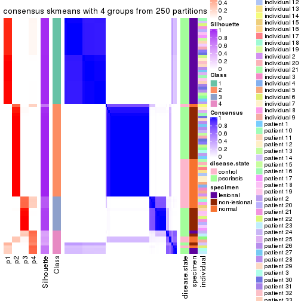</p>

</div>
<div id='tab-ATC-skmeans-consensus-heatmap-4'>
<pre><code class="r">consensus_heatmap(res, k = 5)
</code></pre>

<p></p>

</div>
<div id='tab-ATC-skmeans-consensus-heatmap-5'>
<pre><code class="r">consensus_heatmap(res, k = 6)
</code></pre>

<p></p>

</div>
</div>

Heatmaps for the membership of samples in all partitions to see how consistent they are:


<script>
$( function() {
	$( '#tabs-ATC-skmeans-membership-heatmap' ).tabs();
} );
</script>
<div id='tabs-ATC-skmeans-membership-heatmap'>
<ul>
<li><a href='#tab-ATC-skmeans-membership-heatmap-1'>k = 2</a></li>
<li><a href='#tab-ATC-skmeans-membership-heatmap-2'>k = 3</a></li>
<li><a href='#tab-ATC-skmeans-membership-heatmap-3'>k = 4</a></li>
<li><a href='#tab-ATC-skmeans-membership-heatmap-4'>k = 5</a></li>
<li><a href='#tab-ATC-skmeans-membership-heatmap-5'>k = 6</a></li>
</ul>
<div id='tab-ATC-skmeans-membership-heatmap-1'>
<pre><code class="r">membership_heatmap(res, k = 2)
</code></pre>

<p></p>

</div>
<div id='tab-ATC-skmeans-membership-heatmap-2'>
<pre><code class="r">membership_heatmap(res, k = 3)
</code></pre>

<p></p>

</div>
<div id='tab-ATC-skmeans-membership-heatmap-3'>
<pre><code class="r">membership_heatmap(res, k = 4)
</code></pre>

<p></p>

</div>
<div id='tab-ATC-skmeans-membership-heatmap-4'>
<pre><code class="r">membership_heatmap(res, k = 5)
</code></pre>

<p></p>

</div>
<div id='tab-ATC-skmeans-membership-heatmap-5'>
<pre><code class="r">membership_heatmap(res, k = 6)
</code></pre>

<p></p>

</div>
</div>

As soon as we have had the classes for columns, we can look for signatures
which are significantly different between classes which can be candidate marks
for certain classes. Following are the heatmaps for signatures.


Signature heatmaps where rows are scaled:


<script>
$( function() {
	$( '#tabs-ATC-skmeans-get-signatures' ).tabs();
} );
</script>
<div id='tabs-ATC-skmeans-get-signatures'>
<ul>
<li><a href='#tab-ATC-skmeans-get-signatures-1'>k = 2</a></li>
<li><a href='#tab-ATC-skmeans-get-signatures-2'>k = 3</a></li>
<li><a href='#tab-ATC-skmeans-get-signatures-3'>k = 4</a></li>
<li><a href='#tab-ATC-skmeans-get-signatures-4'>k = 5</a></li>
<li><a href='#tab-ATC-skmeans-get-signatures-5'>k = 6</a></li>
</ul>
<div id='tab-ATC-skmeans-get-signatures-1'>
<pre><code class="r">get_signatures(res, k = 2)
</code></pre>

<p></p>

</div>
<div id='tab-ATC-skmeans-get-signatures-2'>
<pre><code class="r">get_signatures(res, k = 3)
</code></pre>

<p></p>

</div>
<div id='tab-ATC-skmeans-get-signatures-3'>
<pre><code class="r">get_signatures(res, k = 4)
</code></pre>

<p>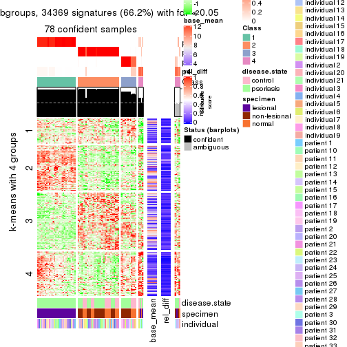</p>

</div>
<div id='tab-ATC-skmeans-get-signatures-4'>
<pre><code class="r">get_signatures(res, k = 5)
</code></pre>

<p></p>

</div>
<div id='tab-ATC-skmeans-get-signatures-5'>
<pre><code class="r">get_signatures(res, k = 6)
</code></pre>

<p></p>

</div>
</div>


Signature heatmaps where rows are not scaled:


<script>
$( function() {
	$( '#tabs-ATC-skmeans-get-signatures-no-scale' ).tabs();
} );
</script>
<div id='tabs-ATC-skmeans-get-signatures-no-scale'>
<ul>
<li><a href='#tab-ATC-skmeans-get-signatures-no-scale-1'>k = 2</a></li>
<li><a href='#tab-ATC-skmeans-get-signatures-no-scale-2'>k = 3</a></li>
<li><a href='#tab-ATC-skmeans-get-signatures-no-scale-3'>k = 4</a></li>
<li><a href='#tab-ATC-skmeans-get-signatures-no-scale-4'>k = 5</a></li>
<li><a href='#tab-ATC-skmeans-get-signatures-no-scale-5'>k = 6</a></li>
</ul>
<div id='tab-ATC-skmeans-get-signatures-no-scale-1'>
<pre><code class="r">get_signatures(res, k = 2, scale_rows = FALSE)
</code></pre>

<p></p>

</div>
<div id='tab-ATC-skmeans-get-signatures-no-scale-2'>
<pre><code class="r">get_signatures(res, k = 3, scale_rows = FALSE)
</code></pre>

<p></p>

</div>
<div id='tab-ATC-skmeans-get-signatures-no-scale-3'>
<pre><code class="r">get_signatures(res, k = 4, scale_rows = FALSE)
</code></pre>

<p></p>

</div>
<div id='tab-ATC-skmeans-get-signatures-no-scale-4'>
<pre><code class="r">get_signatures(res, k = 5, scale_rows = FALSE)
</code></pre>

<p></p>

</div>
<div id='tab-ATC-skmeans-get-signatures-no-scale-5'>
<pre><code class="r">get_signatures(res, k = 6, scale_rows = FALSE)
</code></pre>

<p></p>

</div>
</div>


Compare the overlap of signatures from different k:

```r
compare_signatures(res)
```


`get_signature()` returns a data frame invisibly. TO get the list of signatures, the function
call should be assigned to a variable explicitly. In following code, if `plot` argument is set
to `FALSE`, no heatmap is plotted while only the differential analysis is performed.

```r
# code only for demonstration
tb = get_signature(res, k = ..., plot = FALSE)
```

An example of the output of `tb` is:

```
#>   which_row         fdr    mean_1    mean_2 scaled_mean_1 scaled_mean_2 km
#> 1        38 0.042760348  8.373488  9.131774    -0.5533452     0.5164555  1
#> 2        40 0.018707592  7.106213  8.469186    -0.6173731     0.5762149  1
#> 3        55 0.019134737 10.221463 11.207825    -0.6159697     0.5749050  1
#> 4        59 0.006059896  5.921854  7.869574    -0.6899429     0.6439467  1
#> 5        60 0.018055526  8.928898 10.211722    -0.6204761     0.5791110  1
#> 6        98 0.009384629 15.714769 14.887706     0.6635654    -0.6193277  2
...
```

The columns in `tb` are:

1. `which_row`: row indices corresponding to the input matrix.
2. `fdr`: FDR for the differential test. 
3. `mean_x`: The mean value in group x.
4. `scaled_mean_x`: The mean value in group x after rows are scaled.
5. `km`: Row groups if k-means clustering is applied to rows.


UMAP plot which shows how samples are separated.


<script>
$( function() {
	$( '#tabs-ATC-skmeans-dimension-reduction' ).tabs();
} );
</script>
<div id='tabs-ATC-skmeans-dimension-reduction'>
<ul>
<li><a href='#tab-ATC-skmeans-dimension-reduction-1'>k = 2</a></li>
<li><a href='#tab-ATC-skmeans-dimension-reduction-2'>k = 3</a></li>
<li><a href='#tab-ATC-skmeans-dimension-reduction-3'>k = 4</a></li>
<li><a href='#tab-ATC-skmeans-dimension-reduction-4'>k = 5</a></li>
<li><a href='#tab-ATC-skmeans-dimension-reduction-5'>k = 6</a></li>
</ul>
<div id='tab-ATC-skmeans-dimension-reduction-1'>
<pre><code class="r">dimension_reduction(res, k = 2, method = &quot;UMAP&quot;)
</code></pre>

<p></p>

</div>
<div id='tab-ATC-skmeans-dimension-reduction-2'>
<pre><code class="r">dimension_reduction(res, k = 3, method = &quot;UMAP&quot;)
</code></pre>

<p></p>

</div>
<div id='tab-ATC-skmeans-dimension-reduction-3'>
<pre><code class="r">dimension_reduction(res, k = 4, method = &quot;UMAP&quot;)
</code></pre>

<p></p>

</div>
<div id='tab-ATC-skmeans-dimension-reduction-4'>
<pre><code class="r">dimension_reduction(res, k = 5, method = &quot;UMAP&quot;)
</code></pre>

<p></p>

</div>
<div id='tab-ATC-skmeans-dimension-reduction-5'>
<pre><code class="r">dimension_reduction(res, k = 6, method = &quot;UMAP&quot;)
</code></pre>

<p></p>

</div>
</div>


Following heatmap shows how subgroups are split when increasing `k`:

```r
collect_classes(res)
```


Test correlation between subgroups and known annotations. If the known
annotation is numeric, one-way ANOVA test is applied, and if the known
annotation is discrete, chi-squared contingency table test is applied.

```r
test_to_known_factors(res)
```

```
#>              n disease.state(p) specimen(p) individual(p) k
#> ATC:skmeans 81         1.71e-04    1.32e-16         0.998 2
#> ATC:skmeans 73         2.36e-04    2.01e-14         0.946 3
#> ATC:skmeans 78         5.67e-04    1.54e-14         0.699 4
#> ATC:skmeans 78         3.10e-06    1.21e-16         0.417 5
#> ATC:skmeans 74         1.18e-06    4.55e-16         0.480 6
```


If matrix rows can be associated to genes, consider to use `GO_Enrichment(res,
...)` to perform function enrichment for the signature genes.


 

---------------------------------------------------


### ATC:pam*


The object with results only for a single top-value method and a single partition method 
can be extracted as:

```r
res = res_list["ATC", "pam"]
# you can also extract it by
# res = res_list["ATC:pam"]
```

A summary of `res` and all the functions that can be applied to it:

```r
res
```

```
#> A 'ConsensusPartition' object with k = 2, 3, 4, 5, 6.
#>   On a matrix with 51941 rows and 82 columns.
#>   Top rows (1000, 2000, 3000, 4000, 5000) are extracted by 'ATC' method.
#>   Subgroups are detected by 'pam' method.
#>   Performed in total 1250 partitions by row resampling.
#>   Best k for subgroups seems to be 5.
#> 
#> Following methods can be applied to this 'ConsensusPartition' object:
#>  [1] "cola_report"             "collect_classes"         "collect_plots"          
#>  [4] "collect_stats"           "colnames"                "compare_signatures"     
#>  [7] "consensus_heatmap"       "dimension_reduction"     "functional_enrichment"  
#> [10] "get_anno_col"            "get_anno"                "get_classes"            
#> [13] "get_consensus"           "get_matrix"              "get_membership"         
#> [16] "get_param"               "get_signatures"          "get_stats"              
#> [19] "is_best_k"               "is_stable_k"             "membership_heatmap"     
#> [22] "ncol"                    "nrow"                    "plot_ecdf"              
#> [25] "rownames"                "select_partition_number" "show"                   
#> [28] "suggest_best_k"          "test_to_known_factors"
```

`collect_plots()` function collects all the plots made from `res` for all `k` (number of partitions)
into one single page to provide an easy and fast comparison between different `k`.

```r
collect_plots(res)
```


The plots are:

- The first row: a plot of the ECDF (Empirical cumulative distribution
  function) curves of the consensus matrix for each `k` and the heatmap of
  predicted classes for each `k`.
- The second row: heatmaps of the consensus matrix for each `k`.
- The third row: heatmaps of the membership matrix for each `k`.
- The fouth row: heatmaps of the signatures for each `k`.

All the plots in panels can be made by individual functions and they are
plotted later in this section.

`select_partition_number()` produces several plots showing different
statistics for choosing "optimized" `k`. There are following statistics:

- ECDF curves of the consensus matrix for each `k`;
- 1-PAC. [The PAC
  score](https://en.wikipedia.org/wiki/Consensus_clustering#Over-interpretation_potential_of_consensus_clustering)
  measures the proportion of the ambiguous subgrouping.
- Mean silhouette score.
- Concordance. The mean probability of fiting the consensus class ids in all
  partitions.
- Area increased. Denote $A_k$ as the area under the ECDF curve for current
  `k`, the area increased is defined as $A_k - A_{k-1}$.
- Rand index. The percent of pairs of samples that are both in a same cluster
  or both are not in a same cluster in the partition of k and k-1.
- Jaccard index. The ratio of pairs of samples are both in a same cluster in
  the partition of k and k-1 and the pairs of samples are both in a same
  cluster in the partition k or k-1.

The detailed explanations of these statistics can be found in [the cola
vignette](http://bioconductor.org/packages/devel/bioc/vignettes/cola/inst/doc/cola.html#toc_13).

Generally speaking, lower PAC score, higher mean silhouette score or higher
concordance corresponds to better partition. Rand index and Jaccard index
measure how similar the current partition is compared to partition with `k-1`.
If they are too similar, we won't accept `k` is better than `k-1`.

```r
select_partition_number(res)
```


The numeric values for all these statistics can be obtained by `get_stats()`.

```r
get_stats(res)
```

```
#>   k 1-PAC mean_silhouette concordance area_increased  Rand Jaccard
#> 2 2 1.000           0.970       0.988         0.4979 0.505   0.505
#> 3 3 0.833           0.916       0.960         0.3476 0.720   0.496
#> 4 4 1.000           0.962       0.983         0.1192 0.850   0.585
#> 5 5 0.901           0.853       0.910         0.0407 0.945   0.788
#> 6 6 0.899           0.811       0.911         0.0365 0.951   0.786
```

`suggest_best_k()` suggests the best $k$ based on these statistics. The rules are as follows:

- All $k$ with Jaccard index larger than 0.95 are removed because the increase of
  the partition number does not provides enough extra information. If all $k$ are removed,
  the best $k$ is assigned by `NA`.
- For $k$ with 1-PAC larger than 0.9, the maximal $k$ is taken as the "best k". Other $k$ is called "optional k".
- If it does not fit the second rule. The $k$ with the highest vote of highest
  1-PAC, mean silhouette and concordance is taken as the "best k".

```r
suggest_best_k(res)
```

```
#> [1] 5
#> attr(,"optional")
#> [1] 2 4
```

There is also optional best $k$ = 2 4 that is worth to check.

Following shows the table of the partitions (You need to click the **show/hide
code output** link to see it). The membership matrix (columns with name `p*`)
is inferred by
[`clue::cl_consensus()`](https://www.rdocumentation.org/link/cl_consensus?package=clue)
function with the `SE` method. Basically the value in the membership matrix
represents the probability to belong to a certain group. The finall class
label for an item is determined with the group with highest probability it
belongs to.

In `get_classes()` function, the entropy is calculated from the membership
matrix and the silhouette score is calculated from the consensus matrix.


<script>
$( function() {
	$( '#tabs-ATC-pam-get-classes' ).tabs();
} );
</script>
<div id='tabs-ATC-pam-get-classes'>
<ul>
<li><a href='#tab-ATC-pam-get-classes-1'>k = 2</a></li>
<li><a href='#tab-ATC-pam-get-classes-2'>k = 3</a></li>
<li><a href='#tab-ATC-pam-get-classes-3'>k = 4</a></li>
<li><a href='#tab-ATC-pam-get-classes-4'>k = 5</a></li>
<li><a href='#tab-ATC-pam-get-classes-5'>k = 6</a></li>
</ul>

<div id='tab-ATC-pam-get-classes-1'>
<p><a id='tab-ATC-pam-get-classes-1-a' style='color:#0366d6' href='#'>show/hide code output</a></p>
<pre><code class="r">cbind(get_classes(res, k = 2), get_membership(res, k = 2))
</code></pre>

<pre><code>#&gt;           class entropy silhouette    p1    p2
#&gt; GSM372286     2   0.000      0.980 0.000 1.000
#&gt; GSM372287     2   0.000      0.980 0.000 1.000
#&gt; GSM372288     2   0.000      0.980 0.000 1.000
#&gt; GSM372289     2   0.000      0.980 0.000 1.000
#&gt; GSM372290     2   0.000      0.980 0.000 1.000
#&gt; GSM372291     1   0.000      0.996 1.000 0.000
#&gt; GSM372292     2   0.000      0.980 0.000 1.000
#&gt; GSM372293     2   0.000      0.980 0.000 1.000
#&gt; GSM372294     2   0.000      0.980 0.000 1.000
#&gt; GSM372295     2   0.000      0.980 0.000 1.000
#&gt; GSM372296     2   0.000      0.980 0.000 1.000
#&gt; GSM372297     2   0.000      0.980 0.000 1.000
#&gt; GSM372298     2   0.000      0.980 0.000 1.000
#&gt; GSM372299     2   0.000      0.980 0.000 1.000
#&gt; GSM372300     2   0.955      0.410 0.376 0.624
#&gt; GSM372301     2   0.000      0.980 0.000 1.000
#&gt; GSM372302     2   0.000      0.980 0.000 1.000
#&gt; GSM372303     2   0.971      0.349 0.400 0.600
#&gt; GSM372304     2   0.000      0.980 0.000 1.000
#&gt; GSM372305     2   0.000      0.980 0.000 1.000
#&gt; GSM372306     2   0.000      0.980 0.000 1.000
#&gt; GSM372307     2   0.000      0.980 0.000 1.000
#&gt; GSM372309     2   0.000      0.980 0.000 1.000
#&gt; GSM372311     2   0.000      0.980 0.000 1.000
#&gt; GSM372313     2   0.000      0.980 0.000 1.000
#&gt; GSM372315     2   0.000      0.980 0.000 1.000
#&gt; GSM372317     2   0.000      0.980 0.000 1.000
#&gt; GSM372319     2   0.000      0.980 0.000 1.000
#&gt; GSM372321     2   0.000      0.980 0.000 1.000
#&gt; GSM372323     2   0.000      0.980 0.000 1.000
#&gt; GSM372326     2   0.000      0.980 0.000 1.000
#&gt; GSM372328     2   0.000      0.980 0.000 1.000
#&gt; GSM372330     2   0.000      0.980 0.000 1.000
#&gt; GSM372332     1   0.242      0.957 0.960 0.040
#&gt; GSM372335     2   0.000      0.980 0.000 1.000
#&gt; GSM372337     2   0.000      0.980 0.000 1.000
#&gt; GSM372339     2   0.000      0.980 0.000 1.000
#&gt; GSM372341     2   0.000      0.980 0.000 1.000
#&gt; GSM372343     2   0.000      0.980 0.000 1.000
#&gt; GSM372345     2   0.000      0.980 0.000 1.000
#&gt; GSM372347     2   0.506      0.863 0.112 0.888
#&gt; GSM372349     2   0.000      0.980 0.000 1.000
#&gt; GSM372351     2   0.000      0.980 0.000 1.000
#&gt; GSM372353     2   0.000      0.980 0.000 1.000
#&gt; GSM372355     2   0.000      0.980 0.000 1.000
#&gt; GSM372357     2   0.000      0.980 0.000 1.000
#&gt; GSM372359     2   0.000      0.980 0.000 1.000
#&gt; GSM372361     2   0.000      0.980 0.000 1.000
#&gt; GSM372363     2   0.000      0.980 0.000 1.000
#&gt; GSM372308     1   0.000      0.996 1.000 0.000
#&gt; GSM372310     1   0.000      0.996 1.000 0.000
#&gt; GSM372312     1   0.000      0.996 1.000 0.000
#&gt; GSM372314     1   0.000      0.996 1.000 0.000
#&gt; GSM372316     1   0.000      0.996 1.000 0.000
#&gt; GSM372318     1   0.000      0.996 1.000 0.000
#&gt; GSM372320     1   0.000      0.996 1.000 0.000
#&gt; GSM372322     1   0.000      0.996 1.000 0.000
#&gt; GSM372324     1   0.000      0.996 1.000 0.000
#&gt; GSM372325     1   0.000      0.996 1.000 0.000
#&gt; GSM372327     1   0.000      0.996 1.000 0.000
#&gt; GSM372329     1   0.000      0.996 1.000 0.000
#&gt; GSM372331     1   0.000      0.996 1.000 0.000
#&gt; GSM372333     1   0.000      0.996 1.000 0.000
#&gt; GSM372334     1   0.000      0.996 1.000 0.000
#&gt; GSM372336     1   0.000      0.996 1.000 0.000
#&gt; GSM372338     1   0.000      0.996 1.000 0.000
#&gt; GSM372340     1   0.000      0.996 1.000 0.000
#&gt; GSM372342     1   0.000      0.996 1.000 0.000
#&gt; GSM372344     1   0.000      0.996 1.000 0.000
#&gt; GSM372346     1   0.000      0.996 1.000 0.000
#&gt; GSM372348     1   0.000      0.996 1.000 0.000
#&gt; GSM372350     1   0.000      0.996 1.000 0.000
#&gt; GSM372352     1   0.402      0.912 0.920 0.080
#&gt; GSM372354     1   0.000      0.996 1.000 0.000
#&gt; GSM372356     1   0.000      0.996 1.000 0.000
#&gt; GSM372358     1   0.000      0.996 1.000 0.000
#&gt; GSM372360     1   0.000      0.996 1.000 0.000
#&gt; GSM372362     1   0.000      0.996 1.000 0.000
#&gt; GSM372364     1   0.000      0.996 1.000 0.000
#&gt; GSM372365     1   0.000      0.996 1.000 0.000
#&gt; GSM372366     1   0.000      0.996 1.000 0.000
#&gt; GSM372367     1   0.000      0.996 1.000 0.000
</code></pre>

<script>
$('#tab-ATC-pam-get-classes-1-a').parent().next().next().hide();
$('#tab-ATC-pam-get-classes-1-a').click(function(){
  $('#tab-ATC-pam-get-classes-1-a').parent().next().next().toggle();
  return(false);
});
</script>
</div>

<div id='tab-ATC-pam-get-classes-2'>
<p><a id='tab-ATC-pam-get-classes-2-a' style='color:#0366d6' href='#'>show/hide code output</a></p>
<pre><code class="r">cbind(get_classes(res, k = 3), get_membership(res, k = 3))
</code></pre>

<pre><code>#&gt;           class entropy silhouette    p1    p2    p3
#&gt; GSM372286     2  0.0000      0.984 0.000 1.000 0.000
#&gt; GSM372287     2  0.0000      0.984 0.000 1.000 0.000
#&gt; GSM372288     2  0.0000      0.984 0.000 1.000 0.000
#&gt; GSM372289     2  0.0000      0.984 0.000 1.000 0.000
#&gt; GSM372290     2  0.0000      0.984 0.000 1.000 0.000
#&gt; GSM372291     3  0.0592      0.938 0.012 0.000 0.988
#&gt; GSM372292     2  0.3267      0.868 0.000 0.884 0.116
#&gt; GSM372293     3  0.0592      0.945 0.000 0.012 0.988
#&gt; GSM372294     2  0.3686      0.830 0.000 0.860 0.140
#&gt; GSM372295     3  0.0592      0.945 0.000 0.012 0.988
#&gt; GSM372296     2  0.0000      0.984 0.000 1.000 0.000
#&gt; GSM372297     2  0.0000      0.984 0.000 1.000 0.000
#&gt; GSM372298     2  0.0000      0.984 0.000 1.000 0.000
#&gt; GSM372299     3  0.1753      0.928 0.000 0.048 0.952
#&gt; GSM372300     3  0.0000      0.945 0.000 0.000 1.000
#&gt; GSM372301     3  0.1753      0.928 0.000 0.048 0.952
#&gt; GSM372302     2  0.0000      0.984 0.000 1.000 0.000
#&gt; GSM372303     3  0.0000      0.945 0.000 0.000 1.000
#&gt; GSM372304     2  0.0000      0.984 0.000 1.000 0.000
#&gt; GSM372305     2  0.0000      0.984 0.000 1.000 0.000
#&gt; GSM372306     2  0.0000      0.984 0.000 1.000 0.000
#&gt; GSM372307     2  0.0000      0.984 0.000 1.000 0.000
#&gt; GSM372309     3  0.1529      0.933 0.000 0.040 0.960
#&gt; GSM372311     2  0.0000      0.984 0.000 1.000 0.000
#&gt; GSM372313     2  0.0000      0.984 0.000 1.000 0.000
#&gt; GSM372315     2  0.0000      0.984 0.000 1.000 0.000
#&gt; GSM372317     2  0.0000      0.984 0.000 1.000 0.000
#&gt; GSM372319     2  0.0000      0.984 0.000 1.000 0.000
#&gt; GSM372321     2  0.0000      0.984 0.000 1.000 0.000
#&gt; GSM372323     3  0.0592      0.945 0.000 0.012 0.988
#&gt; GSM372326     3  0.0592      0.945 0.000 0.012 0.988
#&gt; GSM372328     3  0.5497      0.588 0.000 0.292 0.708
#&gt; GSM372330     2  0.0000      0.984 0.000 1.000 0.000
#&gt; GSM372332     3  0.0000      0.945 0.000 0.000 1.000
#&gt; GSM372335     3  0.1753      0.928 0.000 0.048 0.952
#&gt; GSM372337     3  0.0000      0.945 0.000 0.000 1.000
#&gt; GSM372339     3  0.0592      0.945 0.000 0.012 0.988
#&gt; GSM372341     3  0.0000      0.945 0.000 0.000 1.000
#&gt; GSM372343     3  0.0592      0.945 0.000 0.012 0.988
#&gt; GSM372345     3  0.0000      0.945 0.000 0.000 1.000
#&gt; GSM372347     3  0.0000      0.945 0.000 0.000 1.000
#&gt; GSM372349     3  0.0000      0.945 0.000 0.000 1.000
#&gt; GSM372351     3  0.6286      0.158 0.000 0.464 0.536
#&gt; GSM372353     3  0.1529      0.933 0.000 0.040 0.960
#&gt; GSM372355     2  0.0000      0.984 0.000 1.000 0.000
#&gt; GSM372357     2  0.3482      0.853 0.000 0.872 0.128
#&gt; GSM372359     3  0.1753      0.928 0.000 0.048 0.952
#&gt; GSM372361     2  0.0000      0.984 0.000 1.000 0.000
#&gt; GSM372363     2  0.0000      0.984 0.000 1.000 0.000
#&gt; GSM372308     3  0.3192      0.834 0.112 0.000 0.888
#&gt; GSM372310     1  0.5098      0.732 0.752 0.000 0.248
#&gt; GSM372312     3  0.0000      0.945 0.000 0.000 1.000
#&gt; GSM372314     1  0.5098      0.732 0.752 0.000 0.248
#&gt; GSM372316     1  0.0000      0.939 1.000 0.000 0.000
#&gt; GSM372318     1  0.0000      0.939 1.000 0.000 0.000
#&gt; GSM372320     1  0.0000      0.939 1.000 0.000 0.000
#&gt; GSM372322     1  0.0000      0.939 1.000 0.000 0.000
#&gt; GSM372324     1  0.0592      0.933 0.988 0.000 0.012
#&gt; GSM372325     3  0.0000      0.945 0.000 0.000 1.000
#&gt; GSM372327     1  0.0000      0.939 1.000 0.000 0.000
#&gt; GSM372329     1  0.0000      0.939 1.000 0.000 0.000
#&gt; GSM372331     1  0.5098      0.732 0.752 0.000 0.248
#&gt; GSM372333     3  0.0000      0.945 0.000 0.000 1.000
#&gt; GSM372334     1  0.0000      0.939 1.000 0.000 0.000
#&gt; GSM372336     1  0.0237      0.937 0.996 0.000 0.004
#&gt; GSM372338     1  0.0000      0.939 1.000 0.000 0.000
#&gt; GSM372340     1  0.0000      0.939 1.000 0.000 0.000
#&gt; GSM372342     1  0.0000      0.939 1.000 0.000 0.000
#&gt; GSM372344     1  0.0000      0.939 1.000 0.000 0.000
#&gt; GSM372346     1  0.0000      0.939 1.000 0.000 0.000
#&gt; GSM372348     1  0.0000      0.939 1.000 0.000 0.000
#&gt; GSM372350     3  0.4121      0.757 0.168 0.000 0.832
#&gt; GSM372352     3  0.0000      0.945 0.000 0.000 1.000
#&gt; GSM372354     1  0.0000      0.939 1.000 0.000 0.000
#&gt; GSM372356     1  0.5098      0.732 0.752 0.000 0.248
#&gt; GSM372358     1  0.0000      0.939 1.000 0.000 0.000
#&gt; GSM372360     1  0.0000      0.939 1.000 0.000 0.000
#&gt; GSM372362     1  0.0000      0.939 1.000 0.000 0.000
#&gt; GSM372364     1  0.0424      0.935 0.992 0.000 0.008
#&gt; GSM372365     1  0.5098      0.732 0.752 0.000 0.248
#&gt; GSM372366     1  0.0000      0.939 1.000 0.000 0.000
#&gt; GSM372367     1  0.5058      0.737 0.756 0.000 0.244
</code></pre>

<script>
$('#tab-ATC-pam-get-classes-2-a').parent().next().next().hide();
$('#tab-ATC-pam-get-classes-2-a').click(function(){
  $('#tab-ATC-pam-get-classes-2-a').parent().next().next().toggle();
  return(false);
});
</script>
</div>

<div id='tab-ATC-pam-get-classes-3'>
<p><a id='tab-ATC-pam-get-classes-3-a' style='color:#0366d6' href='#'>show/hide code output</a></p>
<pre><code class="r">cbind(get_classes(res, k = 4), get_membership(res, k = 4))
</code></pre>

<pre><code>#&gt;           class entropy silhouette    p1    p2    p3    p4
#&gt; GSM372286     2  0.0000      0.996 0.000 1.000 0.000 0.000
#&gt; GSM372287     2  0.0000      0.996 0.000 1.000 0.000 0.000
#&gt; GSM372288     2  0.0000      0.996 0.000 1.000 0.000 0.000
#&gt; GSM372289     2  0.0000      0.996 0.000 1.000 0.000 0.000
#&gt; GSM372290     2  0.0000      0.996 0.000 1.000 0.000 0.000
#&gt; GSM372291     4  0.0469      0.947 0.000 0.000 0.012 0.988
#&gt; GSM372292     3  0.0469      0.972 0.000 0.012 0.988 0.000
#&gt; GSM372293     3  0.0000      0.974 0.000 0.000 1.000 0.000
#&gt; GSM372294     2  0.1118      0.963 0.000 0.964 0.036 0.000
#&gt; GSM372295     3  0.0000      0.974 0.000 0.000 1.000 0.000
#&gt; GSM372296     2  0.0000      0.996 0.000 1.000 0.000 0.000
#&gt; GSM372297     2  0.0000      0.996 0.000 1.000 0.000 0.000
#&gt; GSM372298     2  0.0000      0.996 0.000 1.000 0.000 0.000
#&gt; GSM372299     3  0.0469      0.972 0.000 0.012 0.988 0.000
#&gt; GSM372300     3  0.0000      0.974 0.000 0.000 1.000 0.000
#&gt; GSM372301     3  0.0469      0.972 0.000 0.012 0.988 0.000
#&gt; GSM372302     2  0.0000      0.996 0.000 1.000 0.000 0.000
#&gt; GSM372303     3  0.0000      0.974 0.000 0.000 1.000 0.000
#&gt; GSM372304     2  0.0000      0.996 0.000 1.000 0.000 0.000
#&gt; GSM372305     2  0.0000      0.996 0.000 1.000 0.000 0.000
#&gt; GSM372306     2  0.1118      0.963 0.000 0.964 0.036 0.000
#&gt; GSM372307     2  0.0000      0.996 0.000 1.000 0.000 0.000
#&gt; GSM372309     3  0.0469      0.972 0.000 0.012 0.988 0.000
#&gt; GSM372311     2  0.0000      0.996 0.000 1.000 0.000 0.000
#&gt; GSM372313     2  0.0000      0.996 0.000 1.000 0.000 0.000
#&gt; GSM372315     2  0.0000      0.996 0.000 1.000 0.000 0.000
#&gt; GSM372317     2  0.0000      0.996 0.000 1.000 0.000 0.000
#&gt; GSM372319     2  0.0000      0.996 0.000 1.000 0.000 0.000
#&gt; GSM372321     2  0.0592      0.982 0.000 0.984 0.016 0.000
#&gt; GSM372323     3  0.0000      0.974 0.000 0.000 1.000 0.000
#&gt; GSM372326     3  0.0000      0.974 0.000 0.000 1.000 0.000
#&gt; GSM372328     3  0.0469      0.972 0.000 0.012 0.988 0.000
#&gt; GSM372330     2  0.0000      0.996 0.000 1.000 0.000 0.000
#&gt; GSM372332     4  0.4040      0.676 0.000 0.000 0.248 0.752
#&gt; GSM372335     3  0.0469      0.972 0.000 0.012 0.988 0.000
#&gt; GSM372337     3  0.0000      0.974 0.000 0.000 1.000 0.000
#&gt; GSM372339     3  0.0000      0.974 0.000 0.000 1.000 0.000
#&gt; GSM372341     3  0.0000      0.974 0.000 0.000 1.000 0.000
#&gt; GSM372343     3  0.0000      0.974 0.000 0.000 1.000 0.000
#&gt; GSM372345     3  0.0000      0.974 0.000 0.000 1.000 0.000
#&gt; GSM372347     3  0.0000      0.974 0.000 0.000 1.000 0.000
#&gt; GSM372349     3  0.0000      0.974 0.000 0.000 1.000 0.000
#&gt; GSM372351     3  0.0469      0.972 0.000 0.012 0.988 0.000
#&gt; GSM372353     3  0.0469      0.972 0.000 0.012 0.988 0.000
#&gt; GSM372355     2  0.0000      0.996 0.000 1.000 0.000 0.000
#&gt; GSM372357     3  0.4830      0.361 0.000 0.392 0.608 0.000
#&gt; GSM372359     3  0.0469      0.972 0.000 0.012 0.988 0.000
#&gt; GSM372361     2  0.0000      0.996 0.000 1.000 0.000 0.000
#&gt; GSM372363     2  0.0000      0.996 0.000 1.000 0.000 0.000
#&gt; GSM372308     4  0.0000      0.954 0.000 0.000 0.000 1.000
#&gt; GSM372310     4  0.0000      0.954 0.000 0.000 0.000 1.000
#&gt; GSM372312     4  0.0469      0.947 0.000 0.000 0.012 0.988
#&gt; GSM372314     4  0.0000      0.954 0.000 0.000 0.000 1.000
#&gt; GSM372316     1  0.0000      1.000 1.000 0.000 0.000 0.000
#&gt; GSM372318     1  0.0000      1.000 1.000 0.000 0.000 0.000
#&gt; GSM372320     1  0.0000      1.000 1.000 0.000 0.000 0.000
#&gt; GSM372322     1  0.0000      1.000 1.000 0.000 0.000 0.000
#&gt; GSM372324     4  0.0000      0.954 0.000 0.000 0.000 1.000
#&gt; GSM372325     4  0.0000      0.954 0.000 0.000 0.000 1.000
#&gt; GSM372327     1  0.0000      1.000 1.000 0.000 0.000 0.000
#&gt; GSM372329     1  0.0000      1.000 1.000 0.000 0.000 0.000
#&gt; GSM372331     4  0.0000      0.954 0.000 0.000 0.000 1.000
#&gt; GSM372333     4  0.0000      0.954 0.000 0.000 0.000 1.000
#&gt; GSM372334     1  0.0000      1.000 1.000 0.000 0.000 0.000
#&gt; GSM372336     4  0.0000      0.954 0.000 0.000 0.000 1.000
#&gt; GSM372338     1  0.0000      1.000 1.000 0.000 0.000 0.000
#&gt; GSM372340     1  0.0000      1.000 1.000 0.000 0.000 0.000
#&gt; GSM372342     1  0.0000      1.000 1.000 0.000 0.000 0.000
#&gt; GSM372344     1  0.0000      1.000 1.000 0.000 0.000 0.000
#&gt; GSM372346     1  0.0000      1.000 1.000 0.000 0.000 0.000
#&gt; GSM372348     4  0.3801      0.725 0.220 0.000 0.000 0.780
#&gt; GSM372350     4  0.0000      0.954 0.000 0.000 0.000 1.000
#&gt; GSM372352     3  0.1022      0.948 0.000 0.000 0.968 0.032
#&gt; GSM372354     1  0.0000      1.000 1.000 0.000 0.000 0.000
#&gt; GSM372356     4  0.0000      0.954 0.000 0.000 0.000 1.000
#&gt; GSM372358     4  0.4193      0.641 0.268 0.000 0.000 0.732
#&gt; GSM372360     1  0.0000      1.000 1.000 0.000 0.000 0.000
#&gt; GSM372362     1  0.0000      1.000 1.000 0.000 0.000 0.000
#&gt; GSM372364     4  0.0000      0.954 0.000 0.000 0.000 1.000
#&gt; GSM372365     4  0.0000      0.954 0.000 0.000 0.000 1.000
#&gt; GSM372366     1  0.0000      1.000 1.000 0.000 0.000 0.000
#&gt; GSM372367     4  0.0000      0.954 0.000 0.000 0.000 1.000
</code></pre>

<script>
$('#tab-ATC-pam-get-classes-3-a').parent().next().next().hide();
$('#tab-ATC-pam-get-classes-3-a').click(function(){
  $('#tab-ATC-pam-get-classes-3-a').parent().next().next().toggle();
  return(false);
});
</script>
</div>

<div id='tab-ATC-pam-get-classes-4'>
<p><a id='tab-ATC-pam-get-classes-4-a' style='color:#0366d6' href='#'>show/hide code output</a></p>
<pre><code class="r">cbind(get_classes(res, k = 5), get_membership(res, k = 5))
</code></pre>

<pre><code>#&gt;           class entropy silhouette    p1    p2    p3    p4    p5
#&gt; GSM372286     2  0.0162     0.9831 0.004 0.996 0.000 0.000 0.000
#&gt; GSM372287     2  0.0000     0.9836 0.000 1.000 0.000 0.000 0.000
#&gt; GSM372288     2  0.0000     0.9836 0.000 1.000 0.000 0.000 0.000
#&gt; GSM372289     2  0.0000     0.9836 0.000 1.000 0.000 0.000 0.000
#&gt; GSM372290     2  0.0000     0.9836 0.000 1.000 0.000 0.000 0.000
#&gt; GSM372291     5  0.3579     0.7408 0.240 0.000 0.004 0.000 0.756
#&gt; GSM372292     3  0.0290     0.9434 0.008 0.000 0.992 0.000 0.000
#&gt; GSM372293     3  0.0000     0.9436 0.000 0.000 1.000 0.000 0.000
#&gt; GSM372294     2  0.4141     0.7000 0.248 0.728 0.024 0.000 0.000
#&gt; GSM372295     3  0.3452     0.7326 0.244 0.000 0.756 0.000 0.000
#&gt; GSM372296     2  0.0000     0.9836 0.000 1.000 0.000 0.000 0.000
#&gt; GSM372297     2  0.0000     0.9836 0.000 1.000 0.000 0.000 0.000
#&gt; GSM372298     2  0.0162     0.9831 0.004 0.996 0.000 0.000 0.000
#&gt; GSM372299     3  0.0290     0.9434 0.008 0.000 0.992 0.000 0.000
#&gt; GSM372300     3  0.0000     0.9436 0.000 0.000 1.000 0.000 0.000
#&gt; GSM372301     3  0.0290     0.9434 0.008 0.000 0.992 0.000 0.000
#&gt; GSM372302     2  0.0290     0.9812 0.008 0.992 0.000 0.000 0.000
#&gt; GSM372303     3  0.0000     0.9436 0.000 0.000 1.000 0.000 0.000
#&gt; GSM372304     2  0.0000     0.9836 0.000 1.000 0.000 0.000 0.000
#&gt; GSM372305     2  0.0162     0.9831 0.004 0.996 0.000 0.000 0.000
#&gt; GSM372306     2  0.1331     0.9421 0.008 0.952 0.040 0.000 0.000
#&gt; GSM372307     2  0.0000     0.9836 0.000 1.000 0.000 0.000 0.000
#&gt; GSM372309     3  0.0290     0.9434 0.008 0.000 0.992 0.000 0.000
#&gt; GSM372311     2  0.0000     0.9836 0.000 1.000 0.000 0.000 0.000
#&gt; GSM372313     2  0.0290     0.9812 0.008 0.992 0.000 0.000 0.000
#&gt; GSM372315     2  0.0162     0.9831 0.004 0.996 0.000 0.000 0.000
#&gt; GSM372317     2  0.0324     0.9808 0.004 0.992 0.004 0.000 0.000
#&gt; GSM372319     2  0.0000     0.9836 0.000 1.000 0.000 0.000 0.000
#&gt; GSM372321     2  0.0771     0.9662 0.004 0.976 0.020 0.000 0.000
#&gt; GSM372323     3  0.0000     0.9436 0.000 0.000 1.000 0.000 0.000
#&gt; GSM372326     3  0.0000     0.9436 0.000 0.000 1.000 0.000 0.000
#&gt; GSM372328     3  0.0290     0.9434 0.008 0.000 0.992 0.000 0.000
#&gt; GSM372330     2  0.0162     0.9831 0.004 0.996 0.000 0.000 0.000
#&gt; GSM372332     5  0.4083     0.7538 0.132 0.000 0.080 0.000 0.788
#&gt; GSM372335     3  0.0290     0.9434 0.008 0.000 0.992 0.000 0.000
#&gt; GSM372337     3  0.0000     0.9436 0.000 0.000 1.000 0.000 0.000
#&gt; GSM372339     3  0.0000     0.9436 0.000 0.000 1.000 0.000 0.000
#&gt; GSM372341     3  0.0000     0.9436 0.000 0.000 1.000 0.000 0.000
#&gt; GSM372343     3  0.0000     0.9436 0.000 0.000 1.000 0.000 0.000
#&gt; GSM372345     3  0.0000     0.9436 0.000 0.000 1.000 0.000 0.000
#&gt; GSM372347     3  0.3177     0.7061 0.000 0.000 0.792 0.000 0.208
#&gt; GSM372349     3  0.3424     0.7330 0.240 0.000 0.760 0.000 0.000
#&gt; GSM372351     3  0.0290     0.9434 0.008 0.000 0.992 0.000 0.000
#&gt; GSM372353     3  0.0290     0.9434 0.008 0.000 0.992 0.000 0.000
#&gt; GSM372355     2  0.0162     0.9831 0.004 0.996 0.000 0.000 0.000
#&gt; GSM372357     3  0.4403     0.3864 0.008 0.384 0.608 0.000 0.000
#&gt; GSM372359     3  0.0290     0.9434 0.008 0.000 0.992 0.000 0.000
#&gt; GSM372361     2  0.0000     0.9836 0.000 1.000 0.000 0.000 0.000
#&gt; GSM372363     2  0.0000     0.9836 0.000 1.000 0.000 0.000 0.000
#&gt; GSM372308     5  0.0000     0.8467 0.000 0.000 0.000 0.000 1.000
#&gt; GSM372310     5  0.0000     0.8467 0.000 0.000 0.000 0.000 1.000
#&gt; GSM372312     5  0.3579     0.7408 0.240 0.000 0.004 0.000 0.756
#&gt; GSM372314     5  0.0000     0.8467 0.000 0.000 0.000 0.000 1.000
#&gt; GSM372316     1  0.4278     0.4587 0.548 0.000 0.000 0.452 0.000
#&gt; GSM372318     4  0.4219    -0.0399 0.416 0.000 0.000 0.584 0.000
#&gt; GSM372320     4  0.0000     0.9315 0.000 0.000 0.000 1.000 0.000
#&gt; GSM372322     4  0.0000     0.9315 0.000 0.000 0.000 1.000 0.000
#&gt; GSM372324     5  0.0000     0.8467 0.000 0.000 0.000 0.000 1.000
#&gt; GSM372325     5  0.0000     0.8467 0.000 0.000 0.000 0.000 1.000
#&gt; GSM372327     4  0.0000     0.9315 0.000 0.000 0.000 1.000 0.000
#&gt; GSM372329     1  0.3534     0.7793 0.744 0.000 0.000 0.256 0.000
#&gt; GSM372331     5  0.0000     0.8467 0.000 0.000 0.000 0.000 1.000
#&gt; GSM372333     5  0.0000     0.8467 0.000 0.000 0.000 0.000 1.000
#&gt; GSM372334     4  0.0000     0.9315 0.000 0.000 0.000 1.000 0.000
#&gt; GSM372336     1  0.4182     0.4394 0.600 0.000 0.000 0.000 0.400
#&gt; GSM372338     4  0.0000     0.9315 0.000 0.000 0.000 1.000 0.000
#&gt; GSM372340     4  0.0000     0.9315 0.000 0.000 0.000 1.000 0.000
#&gt; GSM372342     1  0.3534     0.7793 0.744 0.000 0.000 0.256 0.000
#&gt; GSM372344     4  0.0000     0.9315 0.000 0.000 0.000 1.000 0.000
#&gt; GSM372346     4  0.0000     0.9315 0.000 0.000 0.000 1.000 0.000
#&gt; GSM372348     1  0.5532     0.6996 0.648 0.000 0.000 0.156 0.196
#&gt; GSM372350     5  0.3424     0.7427 0.240 0.000 0.000 0.000 0.760
#&gt; GSM372352     5  0.4291     0.1699 0.000 0.000 0.464 0.000 0.536
#&gt; GSM372354     1  0.3534     0.7793 0.744 0.000 0.000 0.256 0.000
#&gt; GSM372356     5  0.3242     0.6039 0.216 0.000 0.000 0.000 0.784
#&gt; GSM372358     1  0.3607     0.6784 0.752 0.000 0.000 0.004 0.244
#&gt; GSM372360     1  0.3480     0.7816 0.752 0.000 0.000 0.248 0.000
#&gt; GSM372362     1  0.3480     0.7816 0.752 0.000 0.000 0.248 0.000
#&gt; GSM372364     1  0.3480     0.6733 0.752 0.000 0.000 0.000 0.248
#&gt; GSM372365     5  0.2852     0.6760 0.172 0.000 0.000 0.000 0.828
#&gt; GSM372366     1  0.3508     0.7810 0.748 0.000 0.000 0.252 0.000
#&gt; GSM372367     5  0.0290     0.8431 0.008 0.000 0.000 0.000 0.992
</code></pre>

<script>
$('#tab-ATC-pam-get-classes-4-a').parent().next().next().hide();
$('#tab-ATC-pam-get-classes-4-a').click(function(){
  $('#tab-ATC-pam-get-classes-4-a').parent().next().next().toggle();
  return(false);
});
</script>
</div>

<div id='tab-ATC-pam-get-classes-5'>
<p><a id='tab-ATC-pam-get-classes-5-a' style='color:#0366d6' href='#'>show/hide code output</a></p>
<pre><code class="r">cbind(get_classes(res, k = 6), get_membership(res, k = 6))
</code></pre>

<pre><code>#&gt;           class entropy silhouette    p1    p2    p3    p4    p5    p6
#&gt; GSM372286     2  0.0363      0.987 0.012 0.988 0.000 0.000 0.000 0.000
#&gt; GSM372287     2  0.0000      0.989 0.000 1.000 0.000 0.000 0.000 0.000
#&gt; GSM372288     2  0.0000      0.989 0.000 1.000 0.000 0.000 0.000 0.000
#&gt; GSM372289     2  0.0000      0.989 0.000 1.000 0.000 0.000 0.000 0.000
#&gt; GSM372290     2  0.0000      0.989 0.000 1.000 0.000 0.000 0.000 0.000
#&gt; GSM372291     4  0.3634      0.454 0.000 0.000 0.000 0.644 0.356 0.000
#&gt; GSM372292     3  0.0363      0.847 0.012 0.000 0.988 0.000 0.000 0.000
#&gt; GSM372293     3  0.0458      0.851 0.000 0.000 0.984 0.016 0.000 0.000
#&gt; GSM372294     4  0.4049      0.362 0.000 0.332 0.020 0.648 0.000 0.000
#&gt; GSM372295     4  0.3023      0.506 0.000 0.000 0.232 0.768 0.000 0.000
#&gt; GSM372296     2  0.0000      0.989 0.000 1.000 0.000 0.000 0.000 0.000
#&gt; GSM372297     2  0.0000      0.989 0.000 1.000 0.000 0.000 0.000 0.000
#&gt; GSM372298     2  0.0363      0.987 0.012 0.988 0.000 0.000 0.000 0.000
#&gt; GSM372299     3  0.0291      0.851 0.004 0.000 0.992 0.004 0.000 0.000
#&gt; GSM372300     3  0.3592      0.624 0.000 0.000 0.656 0.344 0.000 0.000
#&gt; GSM372301     3  0.0146      0.850 0.004 0.000 0.996 0.000 0.000 0.000
#&gt; GSM372302     2  0.0820      0.976 0.012 0.972 0.016 0.000 0.000 0.000
#&gt; GSM372303     3  0.0458      0.851 0.000 0.000 0.984 0.016 0.000 0.000
#&gt; GSM372304     2  0.0000      0.989 0.000 1.000 0.000 0.000 0.000 0.000
#&gt; GSM372305     2  0.0363      0.987 0.012 0.988 0.000 0.000 0.000 0.000
#&gt; GSM372306     2  0.1411      0.928 0.004 0.936 0.060 0.000 0.000 0.000
#&gt; GSM372307     2  0.0000      0.989 0.000 1.000 0.000 0.000 0.000 0.000
#&gt; GSM372309     3  0.0146      0.850 0.004 0.000 0.996 0.000 0.000 0.000
#&gt; GSM372311     2  0.0000      0.989 0.000 1.000 0.000 0.000 0.000 0.000
#&gt; GSM372313     2  0.0820      0.976 0.012 0.972 0.016 0.000 0.000 0.000
#&gt; GSM372315     2  0.0363      0.987 0.012 0.988 0.000 0.000 0.000 0.000
#&gt; GSM372317     2  0.0508      0.985 0.012 0.984 0.004 0.000 0.000 0.000
#&gt; GSM372319     2  0.0000      0.989 0.000 1.000 0.000 0.000 0.000 0.000
#&gt; GSM372321     2  0.0909      0.970 0.012 0.968 0.020 0.000 0.000 0.000
#&gt; GSM372323     3  0.2219      0.789 0.000 0.000 0.864 0.136 0.000 0.000
#&gt; GSM372326     3  0.0363      0.851 0.000 0.000 0.988 0.012 0.000 0.000
#&gt; GSM372328     3  0.0146      0.850 0.004 0.000 0.996 0.000 0.000 0.000
#&gt; GSM372330     2  0.0363      0.987 0.012 0.988 0.000 0.000 0.000 0.000
#&gt; GSM372332     5  0.3684      0.476 0.000 0.000 0.004 0.332 0.664 0.000
#&gt; GSM372335     3  0.0146      0.850 0.004 0.000 0.996 0.000 0.000 0.000
#&gt; GSM372337     3  0.3620      0.616 0.000 0.000 0.648 0.352 0.000 0.000
#&gt; GSM372339     3  0.0458      0.851 0.000 0.000 0.984 0.016 0.000 0.000
#&gt; GSM372341     3  0.3607      0.619 0.000 0.000 0.652 0.348 0.000 0.000
#&gt; GSM372343     3  0.0458      0.851 0.000 0.000 0.984 0.016 0.000 0.000
#&gt; GSM372345     3  0.3620      0.616 0.000 0.000 0.648 0.352 0.000 0.000
#&gt; GSM372347     3  0.3756      0.612 0.000 0.000 0.644 0.352 0.004 0.000
#&gt; GSM372349     4  0.0146      0.506 0.000 0.000 0.004 0.996 0.000 0.000
#&gt; GSM372351     3  0.0146      0.850 0.004 0.000 0.996 0.000 0.000 0.000
#&gt; GSM372353     3  0.1531      0.828 0.004 0.000 0.928 0.068 0.000 0.000
#&gt; GSM372355     2  0.0363      0.987 0.012 0.988 0.000 0.000 0.000 0.000
#&gt; GSM372357     3  0.4026      0.244 0.012 0.376 0.612 0.000 0.000 0.000
#&gt; GSM372359     3  0.0508      0.847 0.012 0.000 0.984 0.004 0.000 0.000
#&gt; GSM372361     2  0.0000      0.989 0.000 1.000 0.000 0.000 0.000 0.000
#&gt; GSM372363     2  0.0000      0.989 0.000 1.000 0.000 0.000 0.000 0.000
#&gt; GSM372308     5  0.0000      0.867 0.000 0.000 0.000 0.000 1.000 0.000
#&gt; GSM372310     5  0.0000      0.867 0.000 0.000 0.000 0.000 1.000 0.000
#&gt; GSM372312     4  0.3634      0.454 0.000 0.000 0.000 0.644 0.356 0.000
#&gt; GSM372314     5  0.0000      0.867 0.000 0.000 0.000 0.000 1.000 0.000
#&gt; GSM372316     1  0.3464      0.631 0.688 0.000 0.000 0.000 0.000 0.312
#&gt; GSM372318     6  0.3797      0.121 0.420 0.000 0.000 0.000 0.000 0.580
#&gt; GSM372320     6  0.0000      0.939 0.000 0.000 0.000 0.000 0.000 1.000
#&gt; GSM372322     6  0.0000      0.939 0.000 0.000 0.000 0.000 0.000 1.000
#&gt; GSM372324     5  0.0000      0.867 0.000 0.000 0.000 0.000 1.000 0.000
#&gt; GSM372325     5  0.0000      0.867 0.000 0.000 0.000 0.000 1.000 0.000
#&gt; GSM372327     6  0.0000      0.939 0.000 0.000 0.000 0.000 0.000 1.000
#&gt; GSM372329     1  0.2003      0.897 0.884 0.000 0.000 0.000 0.000 0.116
#&gt; GSM372331     5  0.0000      0.867 0.000 0.000 0.000 0.000 1.000 0.000
#&gt; GSM372333     5  0.0000      0.867 0.000 0.000 0.000 0.000 1.000 0.000
#&gt; GSM372334     6  0.0000      0.939 0.000 0.000 0.000 0.000 0.000 1.000
#&gt; GSM372336     5  0.2941      0.682 0.220 0.000 0.000 0.000 0.780 0.000
#&gt; GSM372338     6  0.0000      0.939 0.000 0.000 0.000 0.000 0.000 1.000
#&gt; GSM372340     6  0.0000      0.939 0.000 0.000 0.000 0.000 0.000 1.000
#&gt; GSM372342     1  0.2003      0.897 0.884 0.000 0.000 0.000 0.000 0.116
#&gt; GSM372344     6  0.0000      0.939 0.000 0.000 0.000 0.000 0.000 1.000
#&gt; GSM372346     6  0.0000      0.939 0.000 0.000 0.000 0.000 0.000 1.000
#&gt; GSM372348     5  0.4002      0.491 0.320 0.000 0.000 0.000 0.660 0.020
#&gt; GSM372350     4  0.3620      0.456 0.000 0.000 0.000 0.648 0.352 0.000
#&gt; GSM372352     4  0.4097     -0.422 0.000 0.000 0.488 0.504 0.008 0.000
#&gt; GSM372354     1  0.2003      0.897 0.884 0.000 0.000 0.000 0.000 0.116
#&gt; GSM372356     5  0.1910      0.820 0.108 0.000 0.000 0.000 0.892 0.000
#&gt; GSM372358     1  0.0363      0.884 0.988 0.000 0.000 0.000 0.012 0.000
#&gt; GSM372360     1  0.0363      0.890 0.988 0.000 0.000 0.000 0.000 0.012
#&gt; GSM372362     1  0.0632      0.895 0.976 0.000 0.000 0.000 0.000 0.024
#&gt; GSM372364     1  0.0363      0.884 0.988 0.000 0.000 0.000 0.012 0.000
#&gt; GSM372365     5  0.1863      0.822 0.104 0.000 0.000 0.000 0.896 0.000
#&gt; GSM372366     1  0.1957      0.898 0.888 0.000 0.000 0.000 0.000 0.112
#&gt; GSM372367     5  0.1863      0.822 0.104 0.000 0.000 0.000 0.896 0.000
</code></pre>

<script>
$('#tab-ATC-pam-get-classes-5-a').parent().next().next().hide();
$('#tab-ATC-pam-get-classes-5-a').click(function(){
  $('#tab-ATC-pam-get-classes-5-a').parent().next().next().toggle();
  return(false);
});
</script>
</div>
</div>

Heatmaps for the consensus matrix. It visualizes the probability of two
samples to be in a same group.


<script>
$( function() {
	$( '#tabs-ATC-pam-consensus-heatmap' ).tabs();
} );
</script>
<div id='tabs-ATC-pam-consensus-heatmap'>
<ul>
<li><a href='#tab-ATC-pam-consensus-heatmap-1'>k = 2</a></li>
<li><a href='#tab-ATC-pam-consensus-heatmap-2'>k = 3</a></li>
<li><a href='#tab-ATC-pam-consensus-heatmap-3'>k = 4</a></li>
<li><a href='#tab-ATC-pam-consensus-heatmap-4'>k = 5</a></li>
<li><a href='#tab-ATC-pam-consensus-heatmap-5'>k = 6</a></li>
</ul>
<div id='tab-ATC-pam-consensus-heatmap-1'>
<pre><code class="r">consensus_heatmap(res, k = 2)
</code></pre>

<p></p>

</div>
<div id='tab-ATC-pam-consensus-heatmap-2'>
<pre><code class="r">consensus_heatmap(res, k = 3)
</code></pre>

<p></p>

</div>
<div id='tab-ATC-pam-consensus-heatmap-3'>
<pre><code class="r">consensus_heatmap(res, k = 4)
</code></pre>

<p></p>

</div>
<div id='tab-ATC-pam-consensus-heatmap-4'>
<pre><code class="r">consensus_heatmap(res, k = 5)
</code></pre>

<p></p>

</div>
<div id='tab-ATC-pam-consensus-heatmap-5'>
<pre><code class="r">consensus_heatmap(res, k = 6)
</code></pre>

<p></p>

</div>
</div>

Heatmaps for the membership of samples in all partitions to see how consistent they are:


<script>
$( function() {
	$( '#tabs-ATC-pam-membership-heatmap' ).tabs();
} );
</script>
<div id='tabs-ATC-pam-membership-heatmap'>
<ul>
<li><a href='#tab-ATC-pam-membership-heatmap-1'>k = 2</a></li>
<li><a href='#tab-ATC-pam-membership-heatmap-2'>k = 3</a></li>
<li><a href='#tab-ATC-pam-membership-heatmap-3'>k = 4</a></li>
<li><a href='#tab-ATC-pam-membership-heatmap-4'>k = 5</a></li>
<li><a href='#tab-ATC-pam-membership-heatmap-5'>k = 6</a></li>
</ul>
<div id='tab-ATC-pam-membership-heatmap-1'>
<pre><code class="r">membership_heatmap(res, k = 2)
</code></pre>

<p></p>

</div>
<div id='tab-ATC-pam-membership-heatmap-2'>
<pre><code class="r">membership_heatmap(res, k = 3)
</code></pre>

<p></p>

</div>
<div id='tab-ATC-pam-membership-heatmap-3'>
<pre><code class="r">membership_heatmap(res, k = 4)
</code></pre>

<p></p>

</div>
<div id='tab-ATC-pam-membership-heatmap-4'>
<pre><code class="r">membership_heatmap(res, k = 5)
</code></pre>

<p></p>

</div>
<div id='tab-ATC-pam-membership-heatmap-5'>
<pre><code class="r">membership_heatmap(res, k = 6)
</code></pre>

<p></p>

</div>
</div>

As soon as we have had the classes for columns, we can look for signatures
which are significantly different between classes which can be candidate marks
for certain classes. Following are the heatmaps for signatures.


Signature heatmaps where rows are scaled:


<script>
$( function() {
	$( '#tabs-ATC-pam-get-signatures' ).tabs();
} );
</script>
<div id='tabs-ATC-pam-get-signatures'>
<ul>
<li><a href='#tab-ATC-pam-get-signatures-1'>k = 2</a></li>
<li><a href='#tab-ATC-pam-get-signatures-2'>k = 3</a></li>
<li><a href='#tab-ATC-pam-get-signatures-3'>k = 4</a></li>
<li><a href='#tab-ATC-pam-get-signatures-4'>k = 5</a></li>
<li><a href='#tab-ATC-pam-get-signatures-5'>k = 6</a></li>
</ul>
<div id='tab-ATC-pam-get-signatures-1'>
<pre><code class="r">get_signatures(res, k = 2)
</code></pre>

<p></p>

</div>
<div id='tab-ATC-pam-get-signatures-2'>
<pre><code class="r">get_signatures(res, k = 3)
</code></pre>

<p></p>

</div>
<div id='tab-ATC-pam-get-signatures-3'>
<pre><code class="r">get_signatures(res, k = 4)
</code></pre>

<p>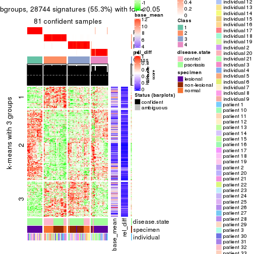</p>

</div>
<div id='tab-ATC-pam-get-signatures-4'>
<pre><code class="r">get_signatures(res, k = 5)
</code></pre>

<p></p>

</div>
<div id='tab-ATC-pam-get-signatures-5'>
<pre><code class="r">get_signatures(res, k = 6)
</code></pre>

<p></p>

</div>
</div>


Signature heatmaps where rows are not scaled:


<script>
$( function() {
	$( '#tabs-ATC-pam-get-signatures-no-scale' ).tabs();
} );
</script>
<div id='tabs-ATC-pam-get-signatures-no-scale'>
<ul>
<li><a href='#tab-ATC-pam-get-signatures-no-scale-1'>k = 2</a></li>
<li><a href='#tab-ATC-pam-get-signatures-no-scale-2'>k = 3</a></li>
<li><a href='#tab-ATC-pam-get-signatures-no-scale-3'>k = 4</a></li>
<li><a href='#tab-ATC-pam-get-signatures-no-scale-4'>k = 5</a></li>
<li><a href='#tab-ATC-pam-get-signatures-no-scale-5'>k = 6</a></li>
</ul>
<div id='tab-ATC-pam-get-signatures-no-scale-1'>
<pre><code class="r">get_signatures(res, k = 2, scale_rows = FALSE)
</code></pre>

<p></p>

</div>
<div id='tab-ATC-pam-get-signatures-no-scale-2'>
<pre><code class="r">get_signatures(res, k = 3, scale_rows = FALSE)
</code></pre>

<p></p>

</div>
<div id='tab-ATC-pam-get-signatures-no-scale-3'>
<pre><code class="r">get_signatures(res, k = 4, scale_rows = FALSE)
</code></pre>

<p></p>

</div>
<div id='tab-ATC-pam-get-signatures-no-scale-4'>
<pre><code class="r">get_signatures(res, k = 5, scale_rows = FALSE)
</code></pre>

<p></p>

</div>
<div id='tab-ATC-pam-get-signatures-no-scale-5'>
<pre><code class="r">get_signatures(res, k = 6, scale_rows = FALSE)
</code></pre>

<p></p>

</div>
</div>


Compare the overlap of signatures from different k:

```r
compare_signatures(res)
```


`get_signature()` returns a data frame invisibly. TO get the list of signatures, the function
call should be assigned to a variable explicitly. In following code, if `plot` argument is set
to `FALSE`, no heatmap is plotted while only the differential analysis is performed.

```r
# code only for demonstration
tb = get_signature(res, k = ..., plot = FALSE)
```

An example of the output of `tb` is:

```
#>   which_row         fdr    mean_1    mean_2 scaled_mean_1 scaled_mean_2 km
#> 1        38 0.042760348  8.373488  9.131774    -0.5533452     0.5164555  1
#> 2        40 0.018707592  7.106213  8.469186    -0.6173731     0.5762149  1
#> 3        55 0.019134737 10.221463 11.207825    -0.6159697     0.5749050  1
#> 4        59 0.006059896  5.921854  7.869574    -0.6899429     0.6439467  1
#> 5        60 0.018055526  8.928898 10.211722    -0.6204761     0.5791110  1
#> 6        98 0.009384629 15.714769 14.887706     0.6635654    -0.6193277  2
...
```

The columns in `tb` are:

1. `which_row`: row indices corresponding to the input matrix.
2. `fdr`: FDR for the differential test. 
3. `mean_x`: The mean value in group x.
4. `scaled_mean_x`: The mean value in group x after rows are scaled.
5. `km`: Row groups if k-means clustering is applied to rows.


UMAP plot which shows how samples are separated.


<script>
$( function() {
	$( '#tabs-ATC-pam-dimension-reduction' ).tabs();
} );
</script>
<div id='tabs-ATC-pam-dimension-reduction'>
<ul>
<li><a href='#tab-ATC-pam-dimension-reduction-1'>k = 2</a></li>
<li><a href='#tab-ATC-pam-dimension-reduction-2'>k = 3</a></li>
<li><a href='#tab-ATC-pam-dimension-reduction-3'>k = 4</a></li>
<li><a href='#tab-ATC-pam-dimension-reduction-4'>k = 5</a></li>
<li><a href='#tab-ATC-pam-dimension-reduction-5'>k = 6</a></li>
</ul>
<div id='tab-ATC-pam-dimension-reduction-1'>
<pre><code class="r">dimension_reduction(res, k = 2, method = &quot;UMAP&quot;)
</code></pre>

<p></p>

</div>
<div id='tab-ATC-pam-dimension-reduction-2'>
<pre><code class="r">dimension_reduction(res, k = 3, method = &quot;UMAP&quot;)
</code></pre>

<p></p>

</div>
<div id='tab-ATC-pam-dimension-reduction-3'>
<pre><code class="r">dimension_reduction(res, k = 4, method = &quot;UMAP&quot;)
</code></pre>

<p></p>

</div>
<div id='tab-ATC-pam-dimension-reduction-4'>
<pre><code class="r">dimension_reduction(res, k = 5, method = &quot;UMAP&quot;)
</code></pre>

<p></p>

</div>
<div id='tab-ATC-pam-dimension-reduction-5'>
<pre><code class="r">dimension_reduction(res, k = 6, method = &quot;UMAP&quot;)
</code></pre>

<p></p>

</div>
</div>


Following heatmap shows how subgroups are split when increasing `k`:

```r
collect_classes(res)
```


Test correlation between subgroups and known annotations. If the known
annotation is numeric, one-way ANOVA test is applied, and if the known
annotation is discrete, chi-squared contingency table test is applied.

```r
test_to_known_factors(res)
```

```
#>          n disease.state(p) specimen(p) individual(p) k
#> ATC:pam 80         0.000309    2.07e-16         0.999 2
#> ATC:pam 81         0.000045    2.60e-13         0.909 3
#> ATC:pam 81         0.000196    7.74e-14         0.864 4
#> ATC:pam 77         0.001120    1.01e-12         0.908 5
#> ATC:pam 73         0.002113    2.34e-12         0.658 6
```


If matrix rows can be associated to genes, consider to use `GO_Enrichment(res,
...)` to perform function enrichment for the signature genes.


 

---------------------------------------------------


### ATC:mclust**


The object with results only for a single top-value method and a single partition method 
can be extracted as:

```r
res = res_list["ATC", "mclust"]
# you can also extract it by
# res = res_list["ATC:mclust"]
```

A summary of `res` and all the functions that can be applied to it:

```r
res
```

```
#> A 'ConsensusPartition' object with k = 2, 3, 4, 5, 6.
#>   On a matrix with 51941 rows and 82 columns.
#>   Top rows (1000, 2000, 3000, 4000, 5000) are extracted by 'ATC' method.
#>   Subgroups are detected by 'mclust' method.
#>   Performed in total 1250 partitions by row resampling.
#>   Best k for subgroups seems to be 2.
#> 
#> Following methods can be applied to this 'ConsensusPartition' object:
#>  [1] "cola_report"             "collect_classes"         "collect_plots"          
#>  [4] "collect_stats"           "colnames"                "compare_signatures"     
#>  [7] "consensus_heatmap"       "dimension_reduction"     "functional_enrichment"  
#> [10] "get_anno_col"            "get_anno"                "get_classes"            
#> [13] "get_consensus"           "get_matrix"              "get_membership"         
#> [16] "get_param"               "get_signatures"          "get_stats"              
#> [19] "is_best_k"               "is_stable_k"             "membership_heatmap"     
#> [22] "ncol"                    "nrow"                    "plot_ecdf"              
#> [25] "rownames"                "select_partition_number" "show"                   
#> [28] "suggest_best_k"          "test_to_known_factors"
```

`collect_plots()` function collects all the plots made from `res` for all `k` (number of partitions)
into one single page to provide an easy and fast comparison between different `k`.

```r
collect_plots(res)
```


The plots are:

- The first row: a plot of the ECDF (Empirical cumulative distribution
  function) curves of the consensus matrix for each `k` and the heatmap of
  predicted classes for each `k`.
- The second row: heatmaps of the consensus matrix for each `k`.
- The third row: heatmaps of the membership matrix for each `k`.
- The fouth row: heatmaps of the signatures for each `k`.

All the plots in panels can be made by individual functions and they are
plotted later in this section.

`select_partition_number()` produces several plots showing different
statistics for choosing "optimized" `k`. There are following statistics:

- ECDF curves of the consensus matrix for each `k`;
- 1-PAC. [The PAC
  score](https://en.wikipedia.org/wiki/Consensus_clustering#Over-interpretation_potential_of_consensus_clustering)
  measures the proportion of the ambiguous subgrouping.
- Mean silhouette score.
- Concordance. The mean probability of fiting the consensus class ids in all
  partitions.
- Area increased. Denote $A_k$ as the area under the ECDF curve for current
  `k`, the area increased is defined as $A_k - A_{k-1}$.
- Rand index. The percent of pairs of samples that are both in a same cluster
  or both are not in a same cluster in the partition of k and k-1.
- Jaccard index. The ratio of pairs of samples are both in a same cluster in
  the partition of k and k-1 and the pairs of samples are both in a same
  cluster in the partition k or k-1.

The detailed explanations of these statistics can be found in [the cola
vignette](http://bioconductor.org/packages/devel/bioc/vignettes/cola/inst/doc/cola.html#toc_13).

Generally speaking, lower PAC score, higher mean silhouette score or higher
concordance corresponds to better partition. Rand index and Jaccard index
measure how similar the current partition is compared to partition with `k-1`.
If they are too similar, we won't accept `k` is better than `k-1`.

```r
select_partition_number(res)
```


The numeric values for all these statistics can be obtained by `get_stats()`.

```r
get_stats(res)
```

```
#>   k 1-PAC mean_silhouette concordance area_increased  Rand Jaccard
#> 2 2 1.000           0.983       0.990         0.4736 0.530   0.530
#> 3 3 0.753           0.801       0.877         0.2832 0.874   0.761
#> 4 4 0.898           0.881       0.947         0.1605 0.833   0.612
#> 5 5 0.723           0.726       0.805         0.0855 0.926   0.750
#> 6 6 0.823           0.831       0.908         0.0671 0.896   0.594
```

`suggest_best_k()` suggests the best $k$ based on these statistics. The rules are as follows:

- All $k$ with Jaccard index larger than 0.95 are removed because the increase of
  the partition number does not provides enough extra information. If all $k$ are removed,
  the best $k$ is assigned by `NA`.
- For $k$ with 1-PAC larger than 0.9, the maximal $k$ is taken as the "best k". Other $k$ is called "optional k".
- If it does not fit the second rule. The $k$ with the highest vote of highest
  1-PAC, mean silhouette and concordance is taken as the "best k".

```r
suggest_best_k(res)
```

```
#> [1] 2
```


Following shows the table of the partitions (You need to click the **show/hide
code output** link to see it). The membership matrix (columns with name `p*`)
is inferred by
[`clue::cl_consensus()`](https://www.rdocumentation.org/link/cl_consensus?package=clue)
function with the `SE` method. Basically the value in the membership matrix
represents the probability to belong to a certain group. The finall class
label for an item is determined with the group with highest probability it
belongs to.

In `get_classes()` function, the entropy is calculated from the membership
matrix and the silhouette score is calculated from the consensus matrix.


<script>
$( function() {
	$( '#tabs-ATC-mclust-get-classes' ).tabs();
} );
</script>
<div id='tabs-ATC-mclust-get-classes'>
<ul>
<li><a href='#tab-ATC-mclust-get-classes-1'>k = 2</a></li>
<li><a href='#tab-ATC-mclust-get-classes-2'>k = 3</a></li>
<li><a href='#tab-ATC-mclust-get-classes-3'>k = 4</a></li>
<li><a href='#tab-ATC-mclust-get-classes-4'>k = 5</a></li>
<li><a href='#tab-ATC-mclust-get-classes-5'>k = 6</a></li>
</ul>

<div id='tab-ATC-mclust-get-classes-1'>
<p><a id='tab-ATC-mclust-get-classes-1-a' style='color:#0366d6' href='#'>show/hide code output</a></p>
<pre><code class="r">cbind(get_classes(res, k = 2), get_membership(res, k = 2))
</code></pre>

<pre><code>#&gt;           class entropy silhouette    p1    p2
#&gt; GSM372286     2  0.0000      0.984 0.000 1.000
#&gt; GSM372287     2  0.0000      0.984 0.000 1.000
#&gt; GSM372288     2  0.0000      0.984 0.000 1.000
#&gt; GSM372289     2  0.0000      0.984 0.000 1.000
#&gt; GSM372290     2  0.0000      0.984 0.000 1.000
#&gt; GSM372291     2  0.4431      0.915 0.092 0.908
#&gt; GSM372292     2  0.0000      0.984 0.000 1.000
#&gt; GSM372293     2  0.0000      0.984 0.000 1.000
#&gt; GSM372294     2  0.4431      0.915 0.092 0.908
#&gt; GSM372295     2  0.4431      0.915 0.092 0.908
#&gt; GSM372296     2  0.0000      0.984 0.000 1.000
#&gt; GSM372297     2  0.0000      0.984 0.000 1.000
#&gt; GSM372298     2  0.0000      0.984 0.000 1.000
#&gt; GSM372299     2  0.4022      0.927 0.080 0.920
#&gt; GSM372300     2  0.0000      0.984 0.000 1.000
#&gt; GSM372301     2  0.0000      0.984 0.000 1.000
#&gt; GSM372302     2  0.0000      0.984 0.000 1.000
#&gt; GSM372303     2  0.0000      0.984 0.000 1.000
#&gt; GSM372304     2  0.0000      0.984 0.000 1.000
#&gt; GSM372305     2  0.0000      0.984 0.000 1.000
#&gt; GSM372306     2  0.0000      0.984 0.000 1.000
#&gt; GSM372307     2  0.0000      0.984 0.000 1.000
#&gt; GSM372309     2  0.0000      0.984 0.000 1.000
#&gt; GSM372311     2  0.0000      0.984 0.000 1.000
#&gt; GSM372313     2  0.0000      0.984 0.000 1.000
#&gt; GSM372315     2  0.0000      0.984 0.000 1.000
#&gt; GSM372317     2  0.0000      0.984 0.000 1.000
#&gt; GSM372319     2  0.0000      0.984 0.000 1.000
#&gt; GSM372321     2  0.0000      0.984 0.000 1.000
#&gt; GSM372323     2  0.0000      0.984 0.000 1.000
#&gt; GSM372326     2  0.0000      0.984 0.000 1.000
#&gt; GSM372328     2  0.0000      0.984 0.000 1.000
#&gt; GSM372330     2  0.0000      0.984 0.000 1.000
#&gt; GSM372332     2  0.4022      0.926 0.080 0.920
#&gt; GSM372335     2  0.0000      0.984 0.000 1.000
#&gt; GSM372337     2  0.0000      0.984 0.000 1.000
#&gt; GSM372339     2  0.0000      0.984 0.000 1.000
#&gt; GSM372341     2  0.0000      0.984 0.000 1.000
#&gt; GSM372343     2  0.0000      0.984 0.000 1.000
#&gt; GSM372345     2  0.0000      0.984 0.000 1.000
#&gt; GSM372347     2  0.0672      0.979 0.008 0.992
#&gt; GSM372349     2  0.4022      0.926 0.080 0.920
#&gt; GSM372351     2  0.0000      0.984 0.000 1.000
#&gt; GSM372353     2  0.0672      0.979 0.008 0.992
#&gt; GSM372355     2  0.0000      0.984 0.000 1.000
#&gt; GSM372357     2  0.0672      0.979 0.008 0.992
#&gt; GSM372359     2  0.0672      0.979 0.008 0.992
#&gt; GSM372361     2  0.0000      0.984 0.000 1.000
#&gt; GSM372363     2  0.0000      0.984 0.000 1.000
#&gt; GSM372308     1  0.0000      1.000 1.000 0.000
#&gt; GSM372310     1  0.0000      1.000 1.000 0.000
#&gt; GSM372312     2  0.4431      0.915 0.092 0.908
#&gt; GSM372314     1  0.0000      1.000 1.000 0.000
#&gt; GSM372316     1  0.0000      1.000 1.000 0.000
#&gt; GSM372318     1  0.0000      1.000 1.000 0.000
#&gt; GSM372320     1  0.0000      1.000 1.000 0.000
#&gt; GSM372322     1  0.0000      1.000 1.000 0.000
#&gt; GSM372324     1  0.0000      1.000 1.000 0.000
#&gt; GSM372325     1  0.0000      1.000 1.000 0.000
#&gt; GSM372327     1  0.0000      1.000 1.000 0.000
#&gt; GSM372329     1  0.0000      1.000 1.000 0.000
#&gt; GSM372331     1  0.0000      1.000 1.000 0.000
#&gt; GSM372333     1  0.0000      1.000 1.000 0.000
#&gt; GSM372334     1  0.0000      1.000 1.000 0.000
#&gt; GSM372336     1  0.0000      1.000 1.000 0.000
#&gt; GSM372338     1  0.0000      1.000 1.000 0.000
#&gt; GSM372340     1  0.0000      1.000 1.000 0.000
#&gt; GSM372342     1  0.0000      1.000 1.000 0.000
#&gt; GSM372344     1  0.0000      1.000 1.000 0.000
#&gt; GSM372346     1  0.0000      1.000 1.000 0.000
#&gt; GSM372348     1  0.0000      1.000 1.000 0.000
#&gt; GSM372350     2  0.4431      0.915 0.092 0.908
#&gt; GSM372352     2  0.4022      0.926 0.080 0.920
#&gt; GSM372354     1  0.0000      1.000 1.000 0.000
#&gt; GSM372356     1  0.0000      1.000 1.000 0.000
#&gt; GSM372358     1  0.0000      1.000 1.000 0.000
#&gt; GSM372360     1  0.0000      1.000 1.000 0.000
#&gt; GSM372362     1  0.0000      1.000 1.000 0.000
#&gt; GSM372364     1  0.0000      1.000 1.000 0.000
#&gt; GSM372365     1  0.0000      1.000 1.000 0.000
#&gt; GSM372366     1  0.0000      1.000 1.000 0.000
#&gt; GSM372367     1  0.0000      1.000 1.000 0.000
</code></pre>

<script>
$('#tab-ATC-mclust-get-classes-1-a').parent().next().next().hide();
$('#tab-ATC-mclust-get-classes-1-a').click(function(){
  $('#tab-ATC-mclust-get-classes-1-a').parent().next().next().toggle();
  return(false);
});
</script>
</div>

<div id='tab-ATC-mclust-get-classes-2'>
<p><a id='tab-ATC-mclust-get-classes-2-a' style='color:#0366d6' href='#'>show/hide code output</a></p>
<pre><code class="r">cbind(get_classes(res, k = 3), get_membership(res, k = 3))
</code></pre>

<pre><code>#&gt;           class entropy silhouette    p1    p2    p3
#&gt; GSM372286     2  0.4178     0.8100 0.000 0.828 0.172
#&gt; GSM372287     2  0.6299     0.2817 0.000 0.524 0.476
#&gt; GSM372288     2  0.6280     0.3296 0.000 0.540 0.460
#&gt; GSM372289     2  0.5810     0.6049 0.000 0.664 0.336
#&gt; GSM372290     2  0.4235     0.8074 0.000 0.824 0.176
#&gt; GSM372291     3  0.1964     0.7556 0.056 0.000 0.944
#&gt; GSM372292     2  0.4062     0.8133 0.000 0.836 0.164
#&gt; GSM372293     2  0.0424     0.8072 0.000 0.992 0.008
#&gt; GSM372294     3  0.1031     0.7538 0.024 0.000 0.976
#&gt; GSM372295     3  0.1031     0.7538 0.024 0.000 0.976
#&gt; GSM372296     3  0.6235    -0.0676 0.000 0.436 0.564
#&gt; GSM372297     2  0.6286     0.3183 0.000 0.536 0.464
#&gt; GSM372298     2  0.4062     0.8133 0.000 0.836 0.164
#&gt; GSM372299     2  0.6398     0.0299 0.416 0.580 0.004
#&gt; GSM372300     2  0.0424     0.8072 0.000 0.992 0.008
#&gt; GSM372301     2  0.0424     0.8072 0.000 0.992 0.008
#&gt; GSM372302     3  0.6280    -0.1534 0.000 0.460 0.540
#&gt; GSM372303     2  0.0892     0.7998 0.000 0.980 0.020
#&gt; GSM372304     2  0.6308     0.2285 0.000 0.508 0.492
#&gt; GSM372305     2  0.4178     0.8100 0.000 0.828 0.172
#&gt; GSM372306     2  0.3752     0.8148 0.000 0.856 0.144
#&gt; GSM372307     2  0.6026     0.5298 0.000 0.624 0.376
#&gt; GSM372309     2  0.4062     0.8133 0.000 0.836 0.164
#&gt; GSM372311     2  0.4178     0.8100 0.000 0.828 0.172
#&gt; GSM372313     2  0.4062     0.8133 0.000 0.836 0.164
#&gt; GSM372315     2  0.4178     0.8100 0.000 0.828 0.172
#&gt; GSM372317     2  0.4062     0.8133 0.000 0.836 0.164
#&gt; GSM372319     2  0.4178     0.8100 0.000 0.828 0.172
#&gt; GSM372321     2  0.4235     0.8074 0.000 0.824 0.176
#&gt; GSM372323     2  0.0000     0.8092 0.000 1.000 0.000
#&gt; GSM372326     2  0.0424     0.8072 0.000 0.992 0.008
#&gt; GSM372328     2  0.0424     0.8072 0.000 0.992 0.008
#&gt; GSM372330     2  0.4062     0.8133 0.000 0.836 0.164
#&gt; GSM372332     3  0.9498     0.4542 0.216 0.300 0.484
#&gt; GSM372335     2  0.0000     0.8092 0.000 1.000 0.000
#&gt; GSM372337     2  0.0424     0.8072 0.000 0.992 0.008
#&gt; GSM372339     2  0.0892     0.7998 0.000 0.980 0.020
#&gt; GSM372341     2  0.0892     0.7998 0.000 0.980 0.020
#&gt; GSM372343     2  0.0592     0.8049 0.000 0.988 0.012
#&gt; GSM372345     2  0.0424     0.8072 0.000 0.992 0.008
#&gt; GSM372347     2  0.0000     0.8092 0.000 1.000 0.000
#&gt; GSM372349     3  0.1453     0.7514 0.024 0.008 0.968
#&gt; GSM372351     2  0.0892     0.8114 0.000 0.980 0.020
#&gt; GSM372353     2  0.0000     0.8092 0.000 1.000 0.000
#&gt; GSM372355     2  0.4062     0.8133 0.000 0.836 0.164
#&gt; GSM372357     2  0.0000     0.8092 0.000 1.000 0.000
#&gt; GSM372359     2  0.0000     0.8092 0.000 1.000 0.000
#&gt; GSM372361     2  0.4178     0.8100 0.000 0.828 0.172
#&gt; GSM372363     2  0.4178     0.8100 0.000 0.828 0.172
#&gt; GSM372308     1  0.0592     0.9875 0.988 0.012 0.000
#&gt; GSM372310     1  0.0424     0.9908 0.992 0.008 0.000
#&gt; GSM372312     3  0.1964     0.7556 0.056 0.000 0.944
#&gt; GSM372314     1  0.0592     0.9875 0.988 0.012 0.000
#&gt; GSM372316     1  0.0000     0.9944 1.000 0.000 0.000
#&gt; GSM372318     1  0.0000     0.9944 1.000 0.000 0.000
#&gt; GSM372320     1  0.0000     0.9944 1.000 0.000 0.000
#&gt; GSM372322     1  0.0000     0.9944 1.000 0.000 0.000
#&gt; GSM372324     1  0.0424     0.9908 0.992 0.008 0.000
#&gt; GSM372325     1  0.1289     0.9658 0.968 0.032 0.000
#&gt; GSM372327     1  0.0000     0.9944 1.000 0.000 0.000
#&gt; GSM372329     1  0.0000     0.9944 1.000 0.000 0.000
#&gt; GSM372331     1  0.0424     0.9908 0.992 0.008 0.000
#&gt; GSM372333     1  0.1289     0.9658 0.968 0.032 0.000
#&gt; GSM372334     1  0.0000     0.9944 1.000 0.000 0.000
#&gt; GSM372336     1  0.0000     0.9944 1.000 0.000 0.000
#&gt; GSM372338     1  0.0000     0.9944 1.000 0.000 0.000
#&gt; GSM372340     1  0.0000     0.9944 1.000 0.000 0.000
#&gt; GSM372342     1  0.0000     0.9944 1.000 0.000 0.000
#&gt; GSM372344     1  0.0000     0.9944 1.000 0.000 0.000
#&gt; GSM372346     1  0.0000     0.9944 1.000 0.000 0.000
#&gt; GSM372348     1  0.0000     0.9944 1.000 0.000 0.000
#&gt; GSM372350     3  0.1964     0.7556 0.056 0.000 0.944
#&gt; GSM372352     3  0.9187     0.5124 0.272 0.196 0.532
#&gt; GSM372354     1  0.0000     0.9944 1.000 0.000 0.000
#&gt; GSM372356     1  0.0424     0.9908 0.992 0.008 0.000
#&gt; GSM372358     1  0.0000     0.9944 1.000 0.000 0.000
#&gt; GSM372360     1  0.0000     0.9944 1.000 0.000 0.000
#&gt; GSM372362     1  0.0000     0.9944 1.000 0.000 0.000
#&gt; GSM372364     1  0.0000     0.9944 1.000 0.000 0.000
#&gt; GSM372365     1  0.0424     0.9908 0.992 0.008 0.000
#&gt; GSM372366     1  0.0000     0.9944 1.000 0.000 0.000
#&gt; GSM372367     1  0.0424     0.9908 0.992 0.008 0.000
</code></pre>

<script>
$('#tab-ATC-mclust-get-classes-2-a').parent().next().next().hide();
$('#tab-ATC-mclust-get-classes-2-a').click(function(){
  $('#tab-ATC-mclust-get-classes-2-a').parent().next().next().toggle();
  return(false);
});
</script>
</div>

<div id='tab-ATC-mclust-get-classes-3'>
<p><a id='tab-ATC-mclust-get-classes-3-a' style='color:#0366d6' href='#'>show/hide code output</a></p>
<pre><code class="r">cbind(get_classes(res, k = 4), get_membership(res, k = 4))
</code></pre>

<pre><code>#&gt;           class entropy silhouette    p1    p2    p3   p4
#&gt; GSM372286     2  0.0000      0.867 0.000 1.000 0.000 0.00
#&gt; GSM372287     2  0.0000      0.867 0.000 1.000 0.000 0.00
#&gt; GSM372288     2  0.0000      0.867 0.000 1.000 0.000 0.00
#&gt; GSM372289     2  0.0000      0.867 0.000 1.000 0.000 0.00
#&gt; GSM372290     2  0.0000      0.867 0.000 1.000 0.000 0.00
#&gt; GSM372291     4  0.0000      0.939 0.000 0.000 0.000 1.00
#&gt; GSM372292     2  0.4977      0.236 0.000 0.540 0.460 0.00
#&gt; GSM372293     3  0.0000      0.909 0.000 0.000 1.000 0.00
#&gt; GSM372294     4  0.0000      0.939 0.000 0.000 0.000 1.00
#&gt; GSM372295     4  0.0000      0.939 0.000 0.000 0.000 1.00
#&gt; GSM372296     2  0.0000      0.867 0.000 1.000 0.000 0.00
#&gt; GSM372297     2  0.0000      0.867 0.000 1.000 0.000 0.00
#&gt; GSM372298     2  0.4304      0.635 0.000 0.716 0.284 0.00
#&gt; GSM372299     3  0.0657      0.911 0.004 0.012 0.984 0.00
#&gt; GSM372300     3  0.0000      0.909 0.000 0.000 1.000 0.00
#&gt; GSM372301     3  0.1557      0.884 0.000 0.056 0.944 0.00
#&gt; GSM372302     2  0.0000      0.867 0.000 1.000 0.000 0.00
#&gt; GSM372303     3  0.0000      0.909 0.000 0.000 1.000 0.00
#&gt; GSM372304     2  0.0000      0.867 0.000 1.000 0.000 0.00
#&gt; GSM372305     2  0.0000      0.867 0.000 1.000 0.000 0.00
#&gt; GSM372306     3  0.4406      0.575 0.000 0.300 0.700 0.00
#&gt; GSM372307     2  0.0000      0.867 0.000 1.000 0.000 0.00
#&gt; GSM372309     3  0.4406      0.575 0.000 0.300 0.700 0.00
#&gt; GSM372311     2  0.0000      0.867 0.000 1.000 0.000 0.00
#&gt; GSM372313     2  0.4222      0.646 0.000 0.728 0.272 0.00
#&gt; GSM372315     2  0.1474      0.843 0.000 0.948 0.052 0.00
#&gt; GSM372317     2  0.4543      0.573 0.000 0.676 0.324 0.00
#&gt; GSM372319     2  0.1557      0.840 0.000 0.944 0.056 0.00
#&gt; GSM372321     2  0.1716      0.836 0.000 0.936 0.064 0.00
#&gt; GSM372323     3  0.0336      0.911 0.000 0.008 0.992 0.00
#&gt; GSM372326     3  0.0000      0.909 0.000 0.000 1.000 0.00
#&gt; GSM372328     3  0.0000      0.909 0.000 0.000 1.000 0.00
#&gt; GSM372330     2  0.4585      0.561 0.000 0.668 0.332 0.00
#&gt; GSM372332     3  0.0469      0.912 0.000 0.012 0.988 0.00
#&gt; GSM372335     3  0.2011      0.879 0.000 0.080 0.920 0.00
#&gt; GSM372337     3  0.0469      0.912 0.000 0.012 0.988 0.00
#&gt; GSM372339     3  0.0188      0.911 0.000 0.004 0.996 0.00
#&gt; GSM372341     3  0.0188      0.911 0.000 0.004 0.996 0.00
#&gt; GSM372343     3  0.0000      0.909 0.000 0.000 1.000 0.00
#&gt; GSM372345     3  0.0469      0.912 0.000 0.012 0.988 0.00
#&gt; GSM372347     3  0.0469      0.912 0.000 0.012 0.988 0.00
#&gt; GSM372349     4  0.6689      0.619 0.000 0.184 0.196 0.62
#&gt; GSM372351     3  0.4304      0.603 0.000 0.284 0.716 0.00
#&gt; GSM372353     3  0.1940      0.881 0.000 0.076 0.924 0.00
#&gt; GSM372355     2  0.4543      0.573 0.000 0.676 0.324 0.00
#&gt; GSM372357     3  0.2216      0.869 0.000 0.092 0.908 0.00
#&gt; GSM372359     3  0.2216      0.869 0.000 0.092 0.908 0.00
#&gt; GSM372361     2  0.0000      0.867 0.000 1.000 0.000 0.00
#&gt; GSM372363     2  0.0000      0.867 0.000 1.000 0.000 0.00
#&gt; GSM372308     1  0.1867      0.924 0.928 0.000 0.072 0.00
#&gt; GSM372310     1  0.0336      0.983 0.992 0.000 0.008 0.00
#&gt; GSM372312     4  0.0000      0.939 0.000 0.000 0.000 1.00
#&gt; GSM372314     1  0.0592      0.976 0.984 0.000 0.016 0.00
#&gt; GSM372316     1  0.0000      0.989 1.000 0.000 0.000 0.00
#&gt; GSM372318     1  0.0000      0.989 1.000 0.000 0.000 0.00
#&gt; GSM372320     1  0.0000      0.989 1.000 0.000 0.000 0.00
#&gt; GSM372322     1  0.0000      0.989 1.000 0.000 0.000 0.00
#&gt; GSM372324     1  0.0000      0.989 1.000 0.000 0.000 0.00
#&gt; GSM372325     1  0.1867      0.924 0.928 0.000 0.072 0.00
#&gt; GSM372327     1  0.0000      0.989 1.000 0.000 0.000 0.00
#&gt; GSM372329     1  0.0000      0.989 1.000 0.000 0.000 0.00
#&gt; GSM372331     1  0.1474      0.944 0.948 0.000 0.052 0.00
#&gt; GSM372333     1  0.1867      0.924 0.928 0.000 0.072 0.00
#&gt; GSM372334     1  0.0000      0.989 1.000 0.000 0.000 0.00
#&gt; GSM372336     1  0.0000      0.989 1.000 0.000 0.000 0.00
#&gt; GSM372338     1  0.0000      0.989 1.000 0.000 0.000 0.00
#&gt; GSM372340     1  0.0000      0.989 1.000 0.000 0.000 0.00
#&gt; GSM372342     1  0.0000      0.989 1.000 0.000 0.000 0.00
#&gt; GSM372344     1  0.0000      0.989 1.000 0.000 0.000 0.00
#&gt; GSM372346     1  0.0000      0.989 1.000 0.000 0.000 0.00
#&gt; GSM372348     1  0.0000      0.989 1.000 0.000 0.000 0.00
#&gt; GSM372350     4  0.0000      0.939 0.000 0.000 0.000 1.00
#&gt; GSM372352     3  0.4206      0.722 0.136 0.048 0.816 0.00
#&gt; GSM372354     1  0.0000      0.989 1.000 0.000 0.000 0.00
#&gt; GSM372356     1  0.0000      0.989 1.000 0.000 0.000 0.00
#&gt; GSM372358     1  0.0000      0.989 1.000 0.000 0.000 0.00
#&gt; GSM372360     1  0.0000      0.989 1.000 0.000 0.000 0.00
#&gt; GSM372362     1  0.0000      0.989 1.000 0.000 0.000 0.00
#&gt; GSM372364     1  0.0000      0.989 1.000 0.000 0.000 0.00
#&gt; GSM372365     1  0.0000      0.989 1.000 0.000 0.000 0.00
#&gt; GSM372366     1  0.0000      0.989 1.000 0.000 0.000 0.00
#&gt; GSM372367     1  0.0000      0.989 1.000 0.000 0.000 0.00
</code></pre>

<script>
$('#tab-ATC-mclust-get-classes-3-a').parent().next().next().hide();
$('#tab-ATC-mclust-get-classes-3-a').click(function(){
  $('#tab-ATC-mclust-get-classes-3-a').parent().next().next().toggle();
  return(false);
});
</script>
</div>

<div id='tab-ATC-mclust-get-classes-4'>
<p><a id='tab-ATC-mclust-get-classes-4-a' style='color:#0366d6' href='#'>show/hide code output</a></p>
<pre><code class="r">cbind(get_classes(res, k = 5), get_membership(res, k = 5))
</code></pre>

<pre><code>#&gt;           class entropy silhouette    p1    p2    p3    p4    p5
#&gt; GSM372286     2  0.0000     0.8131 0.000 1.000 0.000 0.000 0.000
#&gt; GSM372287     2  0.2719     0.7840 0.000 0.852 0.000 0.004 0.144
#&gt; GSM372288     2  0.2719     0.7840 0.000 0.852 0.000 0.004 0.144
#&gt; GSM372289     2  0.2719     0.7840 0.000 0.852 0.000 0.004 0.144
#&gt; GSM372290     2  0.0162     0.8128 0.000 0.996 0.004 0.000 0.000
#&gt; GSM372291     4  0.0000     0.9250 0.000 0.000 0.000 1.000 0.000
#&gt; GSM372292     3  0.5530     0.3504 0.000 0.368 0.556 0.000 0.076
#&gt; GSM372293     3  0.3177     0.7907 0.000 0.000 0.792 0.000 0.208
#&gt; GSM372294     4  0.0000     0.9250 0.000 0.000 0.000 1.000 0.000
#&gt; GSM372295     4  0.0162     0.9235 0.000 0.000 0.000 0.996 0.004
#&gt; GSM372296     2  0.2719     0.7840 0.000 0.852 0.000 0.004 0.144
#&gt; GSM372297     2  0.2719     0.7840 0.000 0.852 0.000 0.004 0.144
#&gt; GSM372298     2  0.4235     0.5338 0.000 0.656 0.336 0.000 0.008
#&gt; GSM372299     3  0.2304     0.7614 0.008 0.100 0.892 0.000 0.000
#&gt; GSM372300     3  0.3177     0.7907 0.000 0.000 0.792 0.000 0.208
#&gt; GSM372301     3  0.3455     0.7901 0.000 0.008 0.784 0.000 0.208
#&gt; GSM372302     2  0.2719     0.7840 0.000 0.852 0.000 0.004 0.144
#&gt; GSM372303     3  0.3177     0.7907 0.000 0.000 0.792 0.000 0.208
#&gt; GSM372304     2  0.2719     0.7840 0.000 0.852 0.000 0.004 0.144
#&gt; GSM372305     2  0.0000     0.8131 0.000 1.000 0.000 0.000 0.000
#&gt; GSM372306     3  0.3210     0.6300 0.000 0.212 0.788 0.000 0.000
#&gt; GSM372307     2  0.2719     0.7840 0.000 0.852 0.000 0.004 0.144
#&gt; GSM372309     3  0.3913     0.4577 0.000 0.324 0.676 0.000 0.000
#&gt; GSM372311     2  0.0162     0.8128 0.000 0.996 0.004 0.000 0.000
#&gt; GSM372313     2  0.3999     0.5368 0.000 0.656 0.344 0.000 0.000
#&gt; GSM372315     2  0.1732     0.7858 0.000 0.920 0.080 0.000 0.000
#&gt; GSM372317     2  0.4045     0.5152 0.000 0.644 0.356 0.000 0.000
#&gt; GSM372319     2  0.1410     0.7953 0.000 0.940 0.060 0.000 0.000
#&gt; GSM372321     2  0.1732     0.7935 0.000 0.920 0.080 0.000 0.000
#&gt; GSM372323     3  0.2966     0.7948 0.000 0.000 0.816 0.000 0.184
#&gt; GSM372326     3  0.3177     0.7907 0.000 0.000 0.792 0.000 0.208
#&gt; GSM372328     3  0.3333     0.7907 0.000 0.004 0.788 0.000 0.208
#&gt; GSM372330     2  0.4074     0.4982 0.000 0.636 0.364 0.000 0.000
#&gt; GSM372332     3  0.3687     0.6727 0.180 0.028 0.792 0.000 0.000
#&gt; GSM372335     3  0.0963     0.7991 0.000 0.036 0.964 0.000 0.000
#&gt; GSM372337     3  0.0609     0.8044 0.000 0.000 0.980 0.000 0.020
#&gt; GSM372339     3  0.3177     0.7907 0.000 0.000 0.792 0.000 0.208
#&gt; GSM372341     3  0.3177     0.7907 0.000 0.000 0.792 0.000 0.208
#&gt; GSM372343     3  0.3177     0.7907 0.000 0.000 0.792 0.000 0.208
#&gt; GSM372345     3  0.1270     0.8049 0.000 0.000 0.948 0.000 0.052
#&gt; GSM372347     3  0.0794     0.8004 0.000 0.028 0.972 0.000 0.000
#&gt; GSM372349     4  0.7598     0.5212 0.004 0.164 0.160 0.532 0.140
#&gt; GSM372351     3  0.1341     0.7890 0.000 0.056 0.944 0.000 0.000
#&gt; GSM372353     3  0.0880     0.7998 0.000 0.032 0.968 0.000 0.000
#&gt; GSM372355     2  0.4030     0.5229 0.000 0.648 0.352 0.000 0.000
#&gt; GSM372357     3  0.0963     0.7992 0.000 0.036 0.964 0.000 0.000
#&gt; GSM372359     3  0.0880     0.7998 0.000 0.032 0.968 0.000 0.000
#&gt; GSM372361     2  0.0000     0.8131 0.000 1.000 0.000 0.000 0.000
#&gt; GSM372363     2  0.0000     0.8131 0.000 1.000 0.000 0.000 0.000
#&gt; GSM372308     1  0.0000     0.7344 1.000 0.000 0.000 0.000 0.000
#&gt; GSM372310     1  0.0000     0.7344 1.000 0.000 0.000 0.000 0.000
#&gt; GSM372312     4  0.0000     0.9250 0.000 0.000 0.000 1.000 0.000
#&gt; GSM372314     1  0.0000     0.7344 1.000 0.000 0.000 0.000 0.000
#&gt; GSM372316     1  0.4138    -0.0198 0.616 0.000 0.000 0.000 0.384
#&gt; GSM372318     5  0.4249     0.8229 0.432 0.000 0.000 0.000 0.568
#&gt; GSM372320     5  0.4030     0.9620 0.352 0.000 0.000 0.000 0.648
#&gt; GSM372322     5  0.4030     0.9620 0.352 0.000 0.000 0.000 0.648
#&gt; GSM372324     1  0.1478     0.6807 0.936 0.000 0.000 0.000 0.064
#&gt; GSM372325     1  0.0963     0.7111 0.964 0.000 0.000 0.000 0.036
#&gt; GSM372327     5  0.4030     0.9620 0.352 0.000 0.000 0.000 0.648
#&gt; GSM372329     1  0.3913     0.3047 0.676 0.000 0.000 0.000 0.324
#&gt; GSM372331     1  0.0000     0.7344 1.000 0.000 0.000 0.000 0.000
#&gt; GSM372333     1  0.0880     0.7143 0.968 0.000 0.000 0.000 0.032
#&gt; GSM372334     5  0.4030     0.9620 0.352 0.000 0.000 0.000 0.648
#&gt; GSM372336     1  0.2605     0.6419 0.852 0.000 0.000 0.000 0.148
#&gt; GSM372338     5  0.4030     0.9620 0.352 0.000 0.000 0.000 0.648
#&gt; GSM372340     5  0.4030     0.9620 0.352 0.000 0.000 0.000 0.648
#&gt; GSM372342     1  0.4030     0.1771 0.648 0.000 0.000 0.000 0.352
#&gt; GSM372344     5  0.4088     0.9426 0.368 0.000 0.000 0.000 0.632
#&gt; GSM372346     5  0.4030     0.9620 0.352 0.000 0.000 0.000 0.648
#&gt; GSM372348     1  0.3774     0.3905 0.704 0.000 0.000 0.000 0.296
#&gt; GSM372350     4  0.0000     0.9250 0.000 0.000 0.000 1.000 0.000
#&gt; GSM372352     3  0.6097     0.5350 0.180 0.144 0.644 0.000 0.032
#&gt; GSM372354     5  0.4210     0.8675 0.412 0.000 0.000 0.000 0.588
#&gt; GSM372356     1  0.0000     0.7344 1.000 0.000 0.000 0.000 0.000
#&gt; GSM372358     1  0.2074     0.6906 0.896 0.000 0.000 0.000 0.104
#&gt; GSM372360     1  0.3752     0.4018 0.708 0.000 0.000 0.000 0.292
#&gt; GSM372362     1  0.3816     0.3701 0.696 0.000 0.000 0.000 0.304
#&gt; GSM372364     1  0.1965     0.6961 0.904 0.000 0.000 0.000 0.096
#&gt; GSM372365     1  0.0000     0.7344 1.000 0.000 0.000 0.000 0.000
#&gt; GSM372366     1  0.3913     0.3047 0.676 0.000 0.000 0.000 0.324
#&gt; GSM372367     1  0.0000     0.7344 1.000 0.000 0.000 0.000 0.000
</code></pre>

<script>
$('#tab-ATC-mclust-get-classes-4-a').parent().next().next().hide();
$('#tab-ATC-mclust-get-classes-4-a').click(function(){
  $('#tab-ATC-mclust-get-classes-4-a').parent().next().next().toggle();
  return(false);
});
</script>
</div>

<div id='tab-ATC-mclust-get-classes-5'>
<p><a id='tab-ATC-mclust-get-classes-5-a' style='color:#0366d6' href='#'>show/hide code output</a></p>
<pre><code class="r">cbind(get_classes(res, k = 6), get_membership(res, k = 6))
</code></pre>

<pre><code>#&gt;           class entropy silhouette    p1    p2    p3    p4    p5    p6
#&gt; GSM372286     4  0.3050     0.8090 0.000 0.236 0.000 0.764 0.000 0.000
#&gt; GSM372287     4  0.0000     0.8570 0.000 0.000 0.000 1.000 0.000 0.000
#&gt; GSM372288     4  0.0000     0.8570 0.000 0.000 0.000 1.000 0.000 0.000
#&gt; GSM372289     4  0.0000     0.8570 0.000 0.000 0.000 1.000 0.000 0.000
#&gt; GSM372290     4  0.2996     0.8131 0.000 0.228 0.000 0.772 0.000 0.000
#&gt; GSM372291     6  0.0000     0.9434 0.000 0.000 0.000 0.000 0.000 1.000
#&gt; GSM372292     2  0.2260     0.8065 0.000 0.860 0.140 0.000 0.000 0.000
#&gt; GSM372293     3  0.0000     0.9425 0.000 0.000 1.000 0.000 0.000 0.000
#&gt; GSM372294     6  0.0000     0.9434 0.000 0.000 0.000 0.000 0.000 1.000
#&gt; GSM372295     6  0.0000     0.9434 0.000 0.000 0.000 0.000 0.000 1.000
#&gt; GSM372296     4  0.0000     0.8570 0.000 0.000 0.000 1.000 0.000 0.000
#&gt; GSM372297     4  0.0000     0.8570 0.000 0.000 0.000 1.000 0.000 0.000
#&gt; GSM372298     2  0.2450     0.7304 0.000 0.868 0.016 0.116 0.000 0.000
#&gt; GSM372299     2  0.2762     0.7744 0.000 0.804 0.196 0.000 0.000 0.000
#&gt; GSM372300     3  0.0000     0.9425 0.000 0.000 1.000 0.000 0.000 0.000
#&gt; GSM372301     3  0.1267     0.9005 0.000 0.060 0.940 0.000 0.000 0.000
#&gt; GSM372302     4  0.0000     0.8570 0.000 0.000 0.000 1.000 0.000 0.000
#&gt; GSM372303     3  0.0000     0.9425 0.000 0.000 1.000 0.000 0.000 0.000
#&gt; GSM372304     4  0.0000     0.8570 0.000 0.000 0.000 1.000 0.000 0.000
#&gt; GSM372305     4  0.3050     0.8050 0.000 0.236 0.000 0.764 0.000 0.000
#&gt; GSM372306     2  0.0790     0.8176 0.000 0.968 0.032 0.000 0.000 0.000
#&gt; GSM372307     4  0.0000     0.8570 0.000 0.000 0.000 1.000 0.000 0.000
#&gt; GSM372309     2  0.0547     0.8170 0.000 0.980 0.020 0.000 0.000 0.000
#&gt; GSM372311     4  0.2969     0.8162 0.000 0.224 0.000 0.776 0.000 0.000
#&gt; GSM372313     2  0.1610     0.7494 0.000 0.916 0.000 0.084 0.000 0.000
#&gt; GSM372315     4  0.3464     0.7184 0.000 0.312 0.000 0.688 0.000 0.000
#&gt; GSM372317     2  0.0146     0.8108 0.000 0.996 0.004 0.000 0.000 0.000
#&gt; GSM372319     2  0.3797     0.0616 0.000 0.580 0.000 0.420 0.000 0.000
#&gt; GSM372321     2  0.3515     0.3782 0.000 0.676 0.000 0.324 0.000 0.000
#&gt; GSM372323     3  0.1141     0.9452 0.000 0.052 0.948 0.000 0.000 0.000
#&gt; GSM372326     3  0.0790     0.9494 0.000 0.032 0.968 0.000 0.000 0.000
#&gt; GSM372328     3  0.1610     0.9272 0.000 0.084 0.916 0.000 0.000 0.000
#&gt; GSM372330     2  0.0363     0.8146 0.000 0.988 0.012 0.000 0.000 0.000
#&gt; GSM372332     3  0.2905     0.8889 0.000 0.084 0.852 0.000 0.064 0.000
#&gt; GSM372335     2  0.2454     0.7879 0.000 0.840 0.160 0.000 0.000 0.000
#&gt; GSM372337     3  0.1556     0.9321 0.000 0.080 0.920 0.000 0.000 0.000
#&gt; GSM372339     3  0.0713     0.9497 0.000 0.028 0.972 0.000 0.000 0.000
#&gt; GSM372341     3  0.0547     0.9488 0.000 0.020 0.980 0.000 0.000 0.000
#&gt; GSM372343     3  0.0000     0.9425 0.000 0.000 1.000 0.000 0.000 0.000
#&gt; GSM372345     3  0.1556     0.9321 0.000 0.080 0.920 0.000 0.000 0.000
#&gt; GSM372347     3  0.1765     0.9188 0.000 0.096 0.904 0.000 0.000 0.000
#&gt; GSM372349     6  0.4102     0.6776 0.000 0.000 0.216 0.028 0.020 0.736
#&gt; GSM372351     2  0.2378     0.8016 0.000 0.848 0.152 0.000 0.000 0.000
#&gt; GSM372353     2  0.2631     0.7861 0.000 0.820 0.180 0.000 0.000 0.000
#&gt; GSM372355     2  0.0260     0.8130 0.000 0.992 0.008 0.000 0.000 0.000
#&gt; GSM372357     2  0.1957     0.8076 0.000 0.888 0.112 0.000 0.000 0.000
#&gt; GSM372359     2  0.2597     0.7886 0.000 0.824 0.176 0.000 0.000 0.000
#&gt; GSM372361     4  0.2969     0.8162 0.000 0.224 0.000 0.776 0.000 0.000
#&gt; GSM372363     4  0.2941     0.8180 0.000 0.220 0.000 0.780 0.000 0.000
#&gt; GSM372308     5  0.0363     0.9053 0.012 0.000 0.000 0.000 0.988 0.000
#&gt; GSM372310     5  0.0363     0.9053 0.012 0.000 0.000 0.000 0.988 0.000
#&gt; GSM372312     6  0.0000     0.9434 0.000 0.000 0.000 0.000 0.000 1.000
#&gt; GSM372314     5  0.0363     0.9053 0.012 0.000 0.000 0.000 0.988 0.000
#&gt; GSM372316     5  0.3309     0.7130 0.280 0.000 0.000 0.000 0.720 0.000
#&gt; GSM372318     1  0.3737     0.1652 0.608 0.000 0.000 0.000 0.392 0.000
#&gt; GSM372320     1  0.0000     0.9279 1.000 0.000 0.000 0.000 0.000 0.000
#&gt; GSM372322     1  0.0000     0.9279 1.000 0.000 0.000 0.000 0.000 0.000
#&gt; GSM372324     5  0.0458     0.9060 0.016 0.000 0.000 0.000 0.984 0.000
#&gt; GSM372325     5  0.0363     0.9053 0.012 0.000 0.000 0.000 0.988 0.000
#&gt; GSM372327     1  0.0260     0.9199 0.992 0.000 0.000 0.000 0.008 0.000
#&gt; GSM372329     5  0.2378     0.8596 0.152 0.000 0.000 0.000 0.848 0.000
#&gt; GSM372331     5  0.0363     0.9053 0.012 0.000 0.000 0.000 0.988 0.000
#&gt; GSM372333     5  0.0363     0.9053 0.012 0.000 0.000 0.000 0.988 0.000
#&gt; GSM372334     1  0.0000     0.9279 1.000 0.000 0.000 0.000 0.000 0.000
#&gt; GSM372336     5  0.1610     0.8923 0.084 0.000 0.000 0.000 0.916 0.000
#&gt; GSM372338     1  0.0000     0.9279 1.000 0.000 0.000 0.000 0.000 0.000
#&gt; GSM372340     1  0.0000     0.9279 1.000 0.000 0.000 0.000 0.000 0.000
#&gt; GSM372342     5  0.3175     0.7290 0.256 0.000 0.000 0.000 0.744 0.000
#&gt; GSM372344     1  0.0000     0.9279 1.000 0.000 0.000 0.000 0.000 0.000
#&gt; GSM372346     1  0.0000     0.9279 1.000 0.000 0.000 0.000 0.000 0.000
#&gt; GSM372348     5  0.2300     0.8653 0.144 0.000 0.000 0.000 0.856 0.000
#&gt; GSM372350     6  0.0000     0.9434 0.000 0.000 0.000 0.000 0.000 1.000
#&gt; GSM372352     2  0.4911     0.2020 0.000 0.524 0.412 0.000 0.064 0.000
#&gt; GSM372354     5  0.3804     0.3643 0.424 0.000 0.000 0.000 0.576 0.000
#&gt; GSM372356     5  0.0146     0.9022 0.004 0.000 0.000 0.000 0.996 0.000
#&gt; GSM372358     5  0.1007     0.9012 0.044 0.000 0.000 0.000 0.956 0.000
#&gt; GSM372360     5  0.1957     0.8770 0.112 0.000 0.000 0.000 0.888 0.000
#&gt; GSM372362     5  0.1957     0.8770 0.112 0.000 0.000 0.000 0.888 0.000
#&gt; GSM372364     5  0.0632     0.9035 0.024 0.000 0.000 0.000 0.976 0.000
#&gt; GSM372365     5  0.0146     0.9022 0.004 0.000 0.000 0.000 0.996 0.000
#&gt; GSM372366     5  0.2416     0.8568 0.156 0.000 0.000 0.000 0.844 0.000
#&gt; GSM372367     5  0.0458     0.9058 0.016 0.000 0.000 0.000 0.984 0.000
</code></pre>

<script>
$('#tab-ATC-mclust-get-classes-5-a').parent().next().next().hide();
$('#tab-ATC-mclust-get-classes-5-a').click(function(){
  $('#tab-ATC-mclust-get-classes-5-a').parent().next().next().toggle();
  return(false);
});
</script>
</div>
</div>

Heatmaps for the consensus matrix. It visualizes the probability of two
samples to be in a same group.


<script>
$( function() {
	$( '#tabs-ATC-mclust-consensus-heatmap' ).tabs();
} );
</script>
<div id='tabs-ATC-mclust-consensus-heatmap'>
<ul>
<li><a href='#tab-ATC-mclust-consensus-heatmap-1'>k = 2</a></li>
<li><a href='#tab-ATC-mclust-consensus-heatmap-2'>k = 3</a></li>
<li><a href='#tab-ATC-mclust-consensus-heatmap-3'>k = 4</a></li>
<li><a href='#tab-ATC-mclust-consensus-heatmap-4'>k = 5</a></li>
<li><a href='#tab-ATC-mclust-consensus-heatmap-5'>k = 6</a></li>
</ul>
<div id='tab-ATC-mclust-consensus-heatmap-1'>
<pre><code class="r">consensus_heatmap(res, k = 2)
</code></pre>

<p></p>

</div>
<div id='tab-ATC-mclust-consensus-heatmap-2'>
<pre><code class="r">consensus_heatmap(res, k = 3)
</code></pre>

<p></p>

</div>
<div id='tab-ATC-mclust-consensus-heatmap-3'>
<pre><code class="r">consensus_heatmap(res, k = 4)
</code></pre>

<p></p>

</div>
<div id='tab-ATC-mclust-consensus-heatmap-4'>
<pre><code class="r">consensus_heatmap(res, k = 5)
</code></pre>

<p></p>

</div>
<div id='tab-ATC-mclust-consensus-heatmap-5'>
<pre><code class="r">consensus_heatmap(res, k = 6)
</code></pre>

<p></p>

</div>
</div>

Heatmaps for the membership of samples in all partitions to see how consistent they are:


<script>
$( function() {
	$( '#tabs-ATC-mclust-membership-heatmap' ).tabs();
} );
</script>
<div id='tabs-ATC-mclust-membership-heatmap'>
<ul>
<li><a href='#tab-ATC-mclust-membership-heatmap-1'>k = 2</a></li>
<li><a href='#tab-ATC-mclust-membership-heatmap-2'>k = 3</a></li>
<li><a href='#tab-ATC-mclust-membership-heatmap-3'>k = 4</a></li>
<li><a href='#tab-ATC-mclust-membership-heatmap-4'>k = 5</a></li>
<li><a href='#tab-ATC-mclust-membership-heatmap-5'>k = 6</a></li>
</ul>
<div id='tab-ATC-mclust-membership-heatmap-1'>
<pre><code class="r">membership_heatmap(res, k = 2)
</code></pre>

<p></p>

</div>
<div id='tab-ATC-mclust-membership-heatmap-2'>
<pre><code class="r">membership_heatmap(res, k = 3)
</code></pre>

<p></p>

</div>
<div id='tab-ATC-mclust-membership-heatmap-3'>
<pre><code class="r">membership_heatmap(res, k = 4)
</code></pre>

<p></p>

</div>
<div id='tab-ATC-mclust-membership-heatmap-4'>
<pre><code class="r">membership_heatmap(res, k = 5)
</code></pre>

<p></p>

</div>
<div id='tab-ATC-mclust-membership-heatmap-5'>
<pre><code class="r">membership_heatmap(res, k = 6)
</code></pre>

<p></p>

</div>
</div>

As soon as we have had the classes for columns, we can look for signatures
which are significantly different between classes which can be candidate marks
for certain classes. Following are the heatmaps for signatures.


Signature heatmaps where rows are scaled:


<script>
$( function() {
	$( '#tabs-ATC-mclust-get-signatures' ).tabs();
} );
</script>
<div id='tabs-ATC-mclust-get-signatures'>
<ul>
<li><a href='#tab-ATC-mclust-get-signatures-1'>k = 2</a></li>
<li><a href='#tab-ATC-mclust-get-signatures-2'>k = 3</a></li>
<li><a href='#tab-ATC-mclust-get-signatures-3'>k = 4</a></li>
<li><a href='#tab-ATC-mclust-get-signatures-4'>k = 5</a></li>
<li><a href='#tab-ATC-mclust-get-signatures-5'>k = 6</a></li>
</ul>
<div id='tab-ATC-mclust-get-signatures-1'>
<pre><code class="r">get_signatures(res, k = 2)
</code></pre>

<p></p>

</div>
<div id='tab-ATC-mclust-get-signatures-2'>
<pre><code class="r">get_signatures(res, k = 3)
</code></pre>

<p></p>

</div>
<div id='tab-ATC-mclust-get-signatures-3'>
<pre><code class="r">get_signatures(res, k = 4)
</code></pre>

<p></p>

</div>
<div id='tab-ATC-mclust-get-signatures-4'>
<pre><code class="r">get_signatures(res, k = 5)
</code></pre>

<p></p>

</div>
<div id='tab-ATC-mclust-get-signatures-5'>
<pre><code class="r">get_signatures(res, k = 6)
</code></pre>

<p></p>

</div>
</div>


Signature heatmaps where rows are not scaled:


<script>
$( function() {
	$( '#tabs-ATC-mclust-get-signatures-no-scale' ).tabs();
} );
</script>
<div id='tabs-ATC-mclust-get-signatures-no-scale'>
<ul>
<li><a href='#tab-ATC-mclust-get-signatures-no-scale-1'>k = 2</a></li>
<li><a href='#tab-ATC-mclust-get-signatures-no-scale-2'>k = 3</a></li>
<li><a href='#tab-ATC-mclust-get-signatures-no-scale-3'>k = 4</a></li>
<li><a href='#tab-ATC-mclust-get-signatures-no-scale-4'>k = 5</a></li>
<li><a href='#tab-ATC-mclust-get-signatures-no-scale-5'>k = 6</a></li>
</ul>
<div id='tab-ATC-mclust-get-signatures-no-scale-1'>
<pre><code class="r">get_signatures(res, k = 2, scale_rows = FALSE)
</code></pre>

<p></p>

</div>
<div id='tab-ATC-mclust-get-signatures-no-scale-2'>
<pre><code class="r">get_signatures(res, k = 3, scale_rows = FALSE)
</code></pre>

<p></p>

</div>
<div id='tab-ATC-mclust-get-signatures-no-scale-3'>
<pre><code class="r">get_signatures(res, k = 4, scale_rows = FALSE)
</code></pre>

<p></p>

</div>
<div id='tab-ATC-mclust-get-signatures-no-scale-4'>
<pre><code class="r">get_signatures(res, k = 5, scale_rows = FALSE)
</code></pre>

<p></p>

</div>
<div id='tab-ATC-mclust-get-signatures-no-scale-5'>
<pre><code class="r">get_signatures(res, k = 6, scale_rows = FALSE)
</code></pre>

<p></p>

</div>
</div>


Compare the overlap of signatures from different k:

```r
compare_signatures(res)
```


`get_signature()` returns a data frame invisibly. TO get the list of signatures, the function
call should be assigned to a variable explicitly. In following code, if `plot` argument is set
to `FALSE`, no heatmap is plotted while only the differential analysis is performed.

```r
# code only for demonstration
tb = get_signature(res, k = ..., plot = FALSE)
```

An example of the output of `tb` is:

```
#>   which_row         fdr    mean_1    mean_2 scaled_mean_1 scaled_mean_2 km
#> 1        38 0.042760348  8.373488  9.131774    -0.5533452     0.5164555  1
#> 2        40 0.018707592  7.106213  8.469186    -0.6173731     0.5762149  1
#> 3        55 0.019134737 10.221463 11.207825    -0.6159697     0.5749050  1
#> 4        59 0.006059896  5.921854  7.869574    -0.6899429     0.6439467  1
#> 5        60 0.018055526  8.928898 10.211722    -0.6204761     0.5791110  1
#> 6        98 0.009384629 15.714769 14.887706     0.6635654    -0.6193277  2
...
```

The columns in `tb` are:

1. `which_row`: row indices corresponding to the input matrix.
2. `fdr`: FDR for the differential test. 
3. `mean_x`: The mean value in group x.
4. `scaled_mean_x`: The mean value in group x after rows are scaled.
5. `km`: Row groups if k-means clustering is applied to rows.


UMAP plot which shows how samples are separated.


<script>
$( function() {
	$( '#tabs-ATC-mclust-dimension-reduction' ).tabs();
} );
</script>
<div id='tabs-ATC-mclust-dimension-reduction'>
<ul>
<li><a href='#tab-ATC-mclust-dimension-reduction-1'>k = 2</a></li>
<li><a href='#tab-ATC-mclust-dimension-reduction-2'>k = 3</a></li>
<li><a href='#tab-ATC-mclust-dimension-reduction-3'>k = 4</a></li>
<li><a href='#tab-ATC-mclust-dimension-reduction-4'>k = 5</a></li>
<li><a href='#tab-ATC-mclust-dimension-reduction-5'>k = 6</a></li>
</ul>
<div id='tab-ATC-mclust-dimension-reduction-1'>
<pre><code class="r">dimension_reduction(res, k = 2, method = &quot;UMAP&quot;)
</code></pre>

<p></p>

</div>
<div id='tab-ATC-mclust-dimension-reduction-2'>
<pre><code class="r">dimension_reduction(res, k = 3, method = &quot;UMAP&quot;)
</code></pre>

<p></p>

</div>
<div id='tab-ATC-mclust-dimension-reduction-3'>
<pre><code class="r">dimension_reduction(res, k = 4, method = &quot;UMAP&quot;)
</code></pre>

<p></p>

</div>
<div id='tab-ATC-mclust-dimension-reduction-4'>
<pre><code class="r">dimension_reduction(res, k = 5, method = &quot;UMAP&quot;)
</code></pre>

<p></p>

</div>
<div id='tab-ATC-mclust-dimension-reduction-5'>
<pre><code class="r">dimension_reduction(res, k = 6, method = &quot;UMAP&quot;)
</code></pre>

<p></p>

</div>
</div>


Following heatmap shows how subgroups are split when increasing `k`:

```r
collect_classes(res)
```


Test correlation between subgroups and known annotations. If the known
annotation is numeric, one-way ANOVA test is applied, and if the known
annotation is discrete, chi-squared contingency table test is applied.

```r
test_to_known_factors(res)
```

```
#>             n disease.state(p) specimen(p) individual(p) k
#> ATC:mclust 82         0.000161    5.58e-16         0.998 2
#> ATC:mclust 74         0.001995    1.61e-14         0.767 3
#> ATC:mclust 81         0.000215    1.09e-14         0.489 4
#> ATC:mclust 72         0.002248    1.43e-11         0.617 5
#> ATC:mclust 77         0.000235    1.52e-13         0.503 6
```


If matrix rows can be associated to genes, consider to use `GO_Enrichment(res,
...)` to perform function enrichment for the signature genes.


 

---------------------------------------------------


### ATC:NMF*


The object with results only for a single top-value method and a single partition method 
can be extracted as:

```r
res = res_list["ATC", "NMF"]
# you can also extract it by
# res = res_list["ATC:NMF"]
```

A summary of `res` and all the functions that can be applied to it:

```r
res
```

```
#> A 'ConsensusPartition' object with k = 2, 3, 4, 5, 6.
#>   On a matrix with 51941 rows and 82 columns.
#>   Top rows (1000, 2000, 3000, 4000, 5000) are extracted by 'ATC' method.
#>   Subgroups are detected by 'NMF' method.
#>   Performed in total 1250 partitions by row resampling.
#>   Best k for subgroups seems to be 2.
#> 
#> Following methods can be applied to this 'ConsensusPartition' object:
#>  [1] "cola_report"             "collect_classes"         "collect_plots"          
#>  [4] "collect_stats"           "colnames"                "compare_signatures"     
#>  [7] "consensus_heatmap"       "dimension_reduction"     "functional_enrichment"  
#> [10] "get_anno_col"            "get_anno"                "get_classes"            
#> [13] "get_consensus"           "get_matrix"              "get_membership"         
#> [16] "get_param"               "get_signatures"          "get_stats"              
#> [19] "is_best_k"               "is_stable_k"             "membership_heatmap"     
#> [22] "ncol"                    "nrow"                    "plot_ecdf"              
#> [25] "rownames"                "select_partition_number" "show"                   
#> [28] "suggest_best_k"          "test_to_known_factors"
```

`collect_plots()` function collects all the plots made from `res` for all `k` (number of partitions)
into one single page to provide an easy and fast comparison between different `k`.

```r
collect_plots(res)
```


The plots are:

- The first row: a plot of the ECDF (Empirical cumulative distribution
  function) curves of the consensus matrix for each `k` and the heatmap of
  predicted classes for each `k`.
- The second row: heatmaps of the consensus matrix for each `k`.
- The third row: heatmaps of the membership matrix for each `k`.
- The fouth row: heatmaps of the signatures for each `k`.

All the plots in panels can be made by individual functions and they are
plotted later in this section.

`select_partition_number()` produces several plots showing different
statistics for choosing "optimized" `k`. There are following statistics:

- ECDF curves of the consensus matrix for each `k`;
- 1-PAC. [The PAC
  score](https://en.wikipedia.org/wiki/Consensus_clustering#Over-interpretation_potential_of_consensus_clustering)
  measures the proportion of the ambiguous subgrouping.
- Mean silhouette score.
- Concordance. The mean probability of fiting the consensus class ids in all
  partitions.
- Area increased. Denote $A_k$ as the area under the ECDF curve for current
  `k`, the area increased is defined as $A_k - A_{k-1}$.
- Rand index. The percent of pairs of samples that are both in a same cluster
  or both are not in a same cluster in the partition of k and k-1.
- Jaccard index. The ratio of pairs of samples are both in a same cluster in
  the partition of k and k-1 and the pairs of samples are both in a same
  cluster in the partition k or k-1.

The detailed explanations of these statistics can be found in [the cola
vignette](http://bioconductor.org/packages/devel/bioc/vignettes/cola/inst/doc/cola.html#toc_13).

Generally speaking, lower PAC score, higher mean silhouette score or higher
concordance corresponds to better partition. Rand index and Jaccard index
measure how similar the current partition is compared to partition with `k-1`.
If they are too similar, we won't accept `k` is better than `k-1`.

```r
select_partition_number(res)
```


The numeric values for all these statistics can be obtained by `get_stats()`.

```r
get_stats(res)
```

```
#>   k 1-PAC mean_silhouette concordance area_increased  Rand Jaccard
#> 2 2 0.949           0.943       0.976         0.5014 0.499   0.499
#> 3 3 0.848           0.862       0.937         0.3054 0.755   0.552
#> 4 4 0.863           0.872       0.925         0.0958 0.845   0.609
#> 5 5 0.831           0.804       0.892         0.0531 0.932   0.773
#> 6 6 0.803           0.778       0.859         0.0551 0.927   0.718
```

`suggest_best_k()` suggests the best $k$ based on these statistics. The rules are as follows:

- All $k$ with Jaccard index larger than 0.95 are removed because the increase of
  the partition number does not provides enough extra information. If all $k$ are removed,
  the best $k$ is assigned by `NA`.
- For $k$ with 1-PAC larger than 0.9, the maximal $k$ is taken as the "best k". Other $k$ is called "optional k".
- If it does not fit the second rule. The $k$ with the highest vote of highest
  1-PAC, mean silhouette and concordance is taken as the "best k".

```r
suggest_best_k(res)
```

```
#> [1] 2
```


Following shows the table of the partitions (You need to click the **show/hide
code output** link to see it). The membership matrix (columns with name `p*`)
is inferred by
[`clue::cl_consensus()`](https://www.rdocumentation.org/link/cl_consensus?package=clue)
function with the `SE` method. Basically the value in the membership matrix
represents the probability to belong to a certain group. The finall class
label for an item is determined with the group with highest probability it
belongs to.

In `get_classes()` function, the entropy is calculated from the membership
matrix and the silhouette score is calculated from the consensus matrix.


<script>
$( function() {
	$( '#tabs-ATC-NMF-get-classes' ).tabs();
} );
</script>
<div id='tabs-ATC-NMF-get-classes'>
<ul>
<li><a href='#tab-ATC-NMF-get-classes-1'>k = 2</a></li>
<li><a href='#tab-ATC-NMF-get-classes-2'>k = 3</a></li>
<li><a href='#tab-ATC-NMF-get-classes-3'>k = 4</a></li>
<li><a href='#tab-ATC-NMF-get-classes-4'>k = 5</a></li>
<li><a href='#tab-ATC-NMF-get-classes-5'>k = 6</a></li>
</ul>

<div id='tab-ATC-NMF-get-classes-1'>
<p><a id='tab-ATC-NMF-get-classes-1-a' style='color:#0366d6' href='#'>show/hide code output</a></p>
<pre><code class="r">cbind(get_classes(res, k = 2), get_membership(res, k = 2))
</code></pre>

<pre><code>#&gt;           class entropy silhouette    p1    p2
#&gt; GSM372286     2  0.0000      0.969 0.000 1.000
#&gt; GSM372287     2  0.0000      0.969 0.000 1.000
#&gt; GSM372288     2  0.0000      0.969 0.000 1.000
#&gt; GSM372289     2  0.0000      0.969 0.000 1.000
#&gt; GSM372290     2  0.0000      0.969 0.000 1.000
#&gt; GSM372291     1  0.0000      0.982 1.000 0.000
#&gt; GSM372292     2  0.0000      0.969 0.000 1.000
#&gt; GSM372293     2  0.0000      0.969 0.000 1.000
#&gt; GSM372294     2  0.0000      0.969 0.000 1.000
#&gt; GSM372295     2  0.0000      0.969 0.000 1.000
#&gt; GSM372296     2  0.0000      0.969 0.000 1.000
#&gt; GSM372297     2  0.0000      0.969 0.000 1.000
#&gt; GSM372298     2  0.0000      0.969 0.000 1.000
#&gt; GSM372299     2  0.9896      0.239 0.440 0.560
#&gt; GSM372300     1  0.9710      0.295 0.600 0.400
#&gt; GSM372301     2  0.0000      0.969 0.000 1.000
#&gt; GSM372302     2  0.0000      0.969 0.000 1.000
#&gt; GSM372303     2  0.6343      0.814 0.160 0.840
#&gt; GSM372304     2  0.0000      0.969 0.000 1.000
#&gt; GSM372305     2  0.0000      0.969 0.000 1.000
#&gt; GSM372306     2  0.0000      0.969 0.000 1.000
#&gt; GSM372307     2  0.0000      0.969 0.000 1.000
#&gt; GSM372309     2  0.0000      0.969 0.000 1.000
#&gt; GSM372311     2  0.0000      0.969 0.000 1.000
#&gt; GSM372313     2  0.0000      0.969 0.000 1.000
#&gt; GSM372315     2  0.0000      0.969 0.000 1.000
#&gt; GSM372317     2  0.0000      0.969 0.000 1.000
#&gt; GSM372319     2  0.0000      0.969 0.000 1.000
#&gt; GSM372321     2  0.0000      0.969 0.000 1.000
#&gt; GSM372323     2  0.0000      0.969 0.000 1.000
#&gt; GSM372326     2  0.0000      0.969 0.000 1.000
#&gt; GSM372328     2  0.0000      0.969 0.000 1.000
#&gt; GSM372330     2  0.0000      0.969 0.000 1.000
#&gt; GSM372332     1  0.0000      0.982 1.000 0.000
#&gt; GSM372335     2  0.0000      0.969 0.000 1.000
#&gt; GSM372337     2  0.2603      0.934 0.044 0.956
#&gt; GSM372339     2  0.0000      0.969 0.000 1.000
#&gt; GSM372341     2  0.4022      0.902 0.080 0.920
#&gt; GSM372343     2  0.0000      0.969 0.000 1.000
#&gt; GSM372345     2  0.7376      0.749 0.208 0.792
#&gt; GSM372347     1  0.7528      0.707 0.784 0.216
#&gt; GSM372349     2  0.8144      0.679 0.252 0.748
#&gt; GSM372351     2  0.0000      0.969 0.000 1.000
#&gt; GSM372353     2  0.5408      0.856 0.124 0.876
#&gt; GSM372355     2  0.0000      0.969 0.000 1.000
#&gt; GSM372357     2  0.0000      0.969 0.000 1.000
#&gt; GSM372359     2  0.0000      0.969 0.000 1.000
#&gt; GSM372361     2  0.0000      0.969 0.000 1.000
#&gt; GSM372363     2  0.0000      0.969 0.000 1.000
#&gt; GSM372308     1  0.0000      0.982 1.000 0.000
#&gt; GSM372310     1  0.0000      0.982 1.000 0.000
#&gt; GSM372312     1  0.0000      0.982 1.000 0.000
#&gt; GSM372314     1  0.0000      0.982 1.000 0.000
#&gt; GSM372316     1  0.0000      0.982 1.000 0.000
#&gt; GSM372318     1  0.0000      0.982 1.000 0.000
#&gt; GSM372320     1  0.0000      0.982 1.000 0.000
#&gt; GSM372322     1  0.0000      0.982 1.000 0.000
#&gt; GSM372324     1  0.0000      0.982 1.000 0.000
#&gt; GSM372325     1  0.0000      0.982 1.000 0.000
#&gt; GSM372327     1  0.0000      0.982 1.000 0.000
#&gt; GSM372329     1  0.0000      0.982 1.000 0.000
#&gt; GSM372331     1  0.0000      0.982 1.000 0.000
#&gt; GSM372333     1  0.0000      0.982 1.000 0.000
#&gt; GSM372334     1  0.0000      0.982 1.000 0.000
#&gt; GSM372336     1  0.0000      0.982 1.000 0.000
#&gt; GSM372338     1  0.0000      0.982 1.000 0.000
#&gt; GSM372340     1  0.0000      0.982 1.000 0.000
#&gt; GSM372342     1  0.0000      0.982 1.000 0.000
#&gt; GSM372344     1  0.0000      0.982 1.000 0.000
#&gt; GSM372346     1  0.0000      0.982 1.000 0.000
#&gt; GSM372348     1  0.0000      0.982 1.000 0.000
#&gt; GSM372350     1  0.0000      0.982 1.000 0.000
#&gt; GSM372352     1  0.0938      0.970 0.988 0.012
#&gt; GSM372354     1  0.0000      0.982 1.000 0.000
#&gt; GSM372356     1  0.0000      0.982 1.000 0.000
#&gt; GSM372358     1  0.0000      0.982 1.000 0.000
#&gt; GSM372360     1  0.0000      0.982 1.000 0.000
#&gt; GSM372362     1  0.0000      0.982 1.000 0.000
#&gt; GSM372364     1  0.0000      0.982 1.000 0.000
#&gt; GSM372365     1  0.0000      0.982 1.000 0.000
#&gt; GSM372366     1  0.0000      0.982 1.000 0.000
#&gt; GSM372367     1  0.0000      0.982 1.000 0.000
</code></pre>

<script>
$('#tab-ATC-NMF-get-classes-1-a').parent().next().next().hide();
$('#tab-ATC-NMF-get-classes-1-a').click(function(){
  $('#tab-ATC-NMF-get-classes-1-a').parent().next().next().toggle();
  return(false);
});
</script>
</div>

<div id='tab-ATC-NMF-get-classes-2'>
<p><a id='tab-ATC-NMF-get-classes-2-a' style='color:#0366d6' href='#'>show/hide code output</a></p>
<pre><code class="r">cbind(get_classes(res, k = 3), get_membership(res, k = 3))
</code></pre>

<pre><code>#&gt;           class entropy silhouette    p1    p2    p3
#&gt; GSM372286     2  0.0237      0.908 0.000 0.996 0.004
#&gt; GSM372287     2  0.0237      0.908 0.000 0.996 0.004
#&gt; GSM372288     2  0.0237      0.908 0.000 0.996 0.004
#&gt; GSM372289     2  0.0237      0.908 0.000 0.996 0.004
#&gt; GSM372290     2  0.0237      0.908 0.000 0.996 0.004
#&gt; GSM372291     3  0.2261      0.862 0.068 0.000 0.932
#&gt; GSM372292     2  0.5621      0.633 0.000 0.692 0.308
#&gt; GSM372293     3  0.0592      0.886 0.000 0.012 0.988
#&gt; GSM372294     3  0.4605      0.730 0.000 0.204 0.796
#&gt; GSM372295     3  0.4504      0.739 0.000 0.196 0.804
#&gt; GSM372296     2  0.0424      0.906 0.000 0.992 0.008
#&gt; GSM372297     2  0.0237      0.908 0.000 0.996 0.004
#&gt; GSM372298     2  0.1643      0.890 0.000 0.956 0.044
#&gt; GSM372299     1  0.6758      0.625 0.728 0.072 0.200
#&gt; GSM372300     3  0.0237      0.889 0.004 0.000 0.996
#&gt; GSM372301     3  0.5835      0.336 0.000 0.340 0.660
#&gt; GSM372302     2  0.4178      0.772 0.000 0.828 0.172
#&gt; GSM372303     3  0.0000      0.889 0.000 0.000 1.000
#&gt; GSM372304     2  0.0237      0.908 0.000 0.996 0.004
#&gt; GSM372305     2  0.0000      0.907 0.000 1.000 0.000
#&gt; GSM372306     2  0.0237      0.907 0.000 0.996 0.004
#&gt; GSM372307     2  0.0237      0.908 0.000 0.996 0.004
#&gt; GSM372309     2  0.0592      0.904 0.000 0.988 0.012
#&gt; GSM372311     2  0.0237      0.908 0.000 0.996 0.004
#&gt; GSM372313     2  0.0000      0.907 0.000 1.000 0.000
#&gt; GSM372315     2  0.0237      0.908 0.000 0.996 0.004
#&gt; GSM372317     2  0.0237      0.907 0.000 0.996 0.004
#&gt; GSM372319     2  0.0237      0.908 0.000 0.996 0.004
#&gt; GSM372321     2  0.0237      0.908 0.000 0.996 0.004
#&gt; GSM372323     2  0.6062      0.498 0.000 0.616 0.384
#&gt; GSM372326     2  0.6045      0.507 0.000 0.620 0.380
#&gt; GSM372328     2  0.5948      0.547 0.000 0.640 0.360
#&gt; GSM372330     2  0.2448      0.867 0.000 0.924 0.076
#&gt; GSM372332     3  0.2165      0.866 0.064 0.000 0.936
#&gt; GSM372335     2  0.3482      0.829 0.000 0.872 0.128
#&gt; GSM372337     3  0.0592      0.887 0.000 0.012 0.988
#&gt; GSM372339     3  0.0237      0.889 0.000 0.004 0.996
#&gt; GSM372341     3  0.0000      0.889 0.000 0.000 1.000
#&gt; GSM372343     3  0.1753      0.861 0.000 0.048 0.952
#&gt; GSM372345     3  0.0237      0.889 0.004 0.000 0.996
#&gt; GSM372347     2  0.8581      0.142 0.096 0.460 0.444
#&gt; GSM372349     3  0.0592      0.888 0.000 0.012 0.988
#&gt; GSM372351     2  0.4346      0.777 0.000 0.816 0.184
#&gt; GSM372353     1  0.8271      0.153 0.520 0.400 0.080
#&gt; GSM372355     2  0.0000      0.907 0.000 1.000 0.000
#&gt; GSM372357     2  0.0237      0.907 0.000 0.996 0.004
#&gt; GSM372359     2  0.3816      0.813 0.000 0.852 0.148
#&gt; GSM372361     2  0.0000      0.907 0.000 1.000 0.000
#&gt; GSM372363     2  0.0000      0.907 0.000 1.000 0.000
#&gt; GSM372308     1  0.0000      0.970 1.000 0.000 0.000
#&gt; GSM372310     1  0.0000      0.970 1.000 0.000 0.000
#&gt; GSM372312     3  0.5948      0.439 0.360 0.000 0.640
#&gt; GSM372314     1  0.0000      0.970 1.000 0.000 0.000
#&gt; GSM372316     1  0.0000      0.970 1.000 0.000 0.000
#&gt; GSM372318     1  0.0000      0.970 1.000 0.000 0.000
#&gt; GSM372320     1  0.1163      0.947 0.972 0.000 0.028
#&gt; GSM372322     1  0.0000      0.970 1.000 0.000 0.000
#&gt; GSM372324     1  0.0000      0.970 1.000 0.000 0.000
#&gt; GSM372325     1  0.0237      0.967 0.996 0.000 0.004
#&gt; GSM372327     1  0.0000      0.970 1.000 0.000 0.000
#&gt; GSM372329     1  0.0000      0.970 1.000 0.000 0.000
#&gt; GSM372331     1  0.0237      0.967 0.996 0.004 0.000
#&gt; GSM372333     1  0.0000      0.970 1.000 0.000 0.000
#&gt; GSM372334     1  0.0592      0.961 0.988 0.000 0.012
#&gt; GSM372336     1  0.0000      0.970 1.000 0.000 0.000
#&gt; GSM372338     1  0.0747      0.958 0.984 0.000 0.016
#&gt; GSM372340     1  0.0000      0.970 1.000 0.000 0.000
#&gt; GSM372342     1  0.0000      0.970 1.000 0.000 0.000
#&gt; GSM372344     1  0.0747      0.958 0.984 0.000 0.016
#&gt; GSM372346     1  0.0000      0.970 1.000 0.000 0.000
#&gt; GSM372348     1  0.0000      0.970 1.000 0.000 0.000
#&gt; GSM372350     3  0.4121      0.773 0.168 0.000 0.832
#&gt; GSM372352     3  0.0592      0.888 0.012 0.000 0.988
#&gt; GSM372354     1  0.0000      0.970 1.000 0.000 0.000
#&gt; GSM372356     1  0.0000      0.970 1.000 0.000 0.000
#&gt; GSM372358     1  0.0000      0.970 1.000 0.000 0.000
#&gt; GSM372360     1  0.0000      0.970 1.000 0.000 0.000
#&gt; GSM372362     1  0.0000      0.970 1.000 0.000 0.000
#&gt; GSM372364     1  0.0000      0.970 1.000 0.000 0.000
#&gt; GSM372365     1  0.0000      0.970 1.000 0.000 0.000
#&gt; GSM372366     1  0.0000      0.970 1.000 0.000 0.000
#&gt; GSM372367     1  0.0000      0.970 1.000 0.000 0.000
</code></pre>

<script>
$('#tab-ATC-NMF-get-classes-2-a').parent().next().next().hide();
$('#tab-ATC-NMF-get-classes-2-a').click(function(){
  $('#tab-ATC-NMF-get-classes-2-a').parent().next().next().toggle();
  return(false);
});
</script>
</div>

<div id='tab-ATC-NMF-get-classes-3'>
<p><a id='tab-ATC-NMF-get-classes-3-a' style='color:#0366d6' href='#'>show/hide code output</a></p>
<pre><code class="r">cbind(get_classes(res, k = 4), get_membership(res, k = 4))
</code></pre>

<pre><code>#&gt;           class entropy silhouette    p1    p2    p3    p4
#&gt; GSM372286     2  0.0000      0.927 0.000 1.000 0.000 0.000
#&gt; GSM372287     2  0.0000      0.927 0.000 1.000 0.000 0.000
#&gt; GSM372288     2  0.0000      0.927 0.000 1.000 0.000 0.000
#&gt; GSM372289     2  0.0000      0.927 0.000 1.000 0.000 0.000
#&gt; GSM372290     2  0.0000      0.927 0.000 1.000 0.000 0.000
#&gt; GSM372291     4  0.2300      0.894 0.028 0.000 0.048 0.924
#&gt; GSM372292     3  0.3552      0.840 0.000 0.128 0.848 0.024
#&gt; GSM372293     3  0.1867      0.847 0.000 0.000 0.928 0.072
#&gt; GSM372294     4  0.3004      0.879 0.000 0.060 0.048 0.892
#&gt; GSM372295     4  0.3110      0.889 0.004 0.048 0.056 0.892
#&gt; GSM372296     2  0.3946      0.740 0.000 0.812 0.020 0.168
#&gt; GSM372297     2  0.0921      0.910 0.000 0.972 0.000 0.028
#&gt; GSM372298     2  0.1022      0.906 0.000 0.968 0.032 0.000
#&gt; GSM372299     1  0.6726      0.481 0.636 0.032 0.264 0.068
#&gt; GSM372300     3  0.2281      0.834 0.000 0.000 0.904 0.096
#&gt; GSM372301     3  0.2859      0.823 0.000 0.008 0.880 0.112
#&gt; GSM372302     2  0.5472      0.518 0.000 0.676 0.044 0.280
#&gt; GSM372303     3  0.4072      0.660 0.000 0.000 0.748 0.252
#&gt; GSM372304     2  0.1022      0.906 0.000 0.968 0.000 0.032
#&gt; GSM372305     2  0.0336      0.925 0.000 0.992 0.008 0.000
#&gt; GSM372306     3  0.3726      0.783 0.000 0.212 0.788 0.000
#&gt; GSM372307     2  0.0000      0.927 0.000 1.000 0.000 0.000
#&gt; GSM372309     3  0.3710      0.799 0.000 0.192 0.804 0.004
#&gt; GSM372311     2  0.0000      0.927 0.000 1.000 0.000 0.000
#&gt; GSM372313     2  0.0707      0.919 0.000 0.980 0.020 0.000
#&gt; GSM372315     2  0.0000      0.927 0.000 1.000 0.000 0.000
#&gt; GSM372317     3  0.4343      0.734 0.000 0.264 0.732 0.004
#&gt; GSM372319     2  0.0592      0.921 0.000 0.984 0.016 0.000
#&gt; GSM372321     2  0.5163     -0.184 0.000 0.516 0.480 0.004
#&gt; GSM372323     3  0.0707      0.855 0.000 0.000 0.980 0.020
#&gt; GSM372326     3  0.0524      0.859 0.000 0.004 0.988 0.008
#&gt; GSM372328     3  0.1854      0.862 0.000 0.048 0.940 0.012
#&gt; GSM372330     3  0.4072      0.752 0.000 0.252 0.748 0.000
#&gt; GSM372332     3  0.3751      0.755 0.004 0.000 0.800 0.196
#&gt; GSM372335     3  0.2408      0.848 0.000 0.104 0.896 0.000
#&gt; GSM372337     3  0.1302      0.855 0.000 0.000 0.956 0.044
#&gt; GSM372339     3  0.1637      0.853 0.000 0.000 0.940 0.060
#&gt; GSM372341     3  0.1716      0.851 0.000 0.000 0.936 0.064
#&gt; GSM372343     3  0.1118      0.856 0.000 0.000 0.964 0.036
#&gt; GSM372345     3  0.1118      0.856 0.000 0.000 0.964 0.036
#&gt; GSM372347     3  0.2124      0.841 0.008 0.000 0.924 0.068
#&gt; GSM372349     4  0.2704      0.871 0.000 0.000 0.124 0.876
#&gt; GSM372351     3  0.2814      0.835 0.000 0.132 0.868 0.000
#&gt; GSM372353     3  0.3953      0.815 0.040 0.028 0.860 0.072
#&gt; GSM372355     2  0.0592      0.921 0.000 0.984 0.016 0.000
#&gt; GSM372357     3  0.4937      0.605 0.004 0.332 0.660 0.004
#&gt; GSM372359     3  0.4191      0.824 0.024 0.060 0.848 0.068
#&gt; GSM372361     2  0.0000      0.927 0.000 1.000 0.000 0.000
#&gt; GSM372363     2  0.0336      0.925 0.000 0.992 0.008 0.000
#&gt; GSM372308     1  0.0336      0.966 0.992 0.000 0.000 0.008
#&gt; GSM372310     1  0.0188      0.965 0.996 0.000 0.000 0.004
#&gt; GSM372312     4  0.3688      0.735 0.208 0.000 0.000 0.792
#&gt; GSM372314     1  0.1398      0.947 0.956 0.000 0.004 0.040
#&gt; GSM372316     1  0.0469      0.966 0.988 0.000 0.000 0.012
#&gt; GSM372318     1  0.0707      0.965 0.980 0.000 0.000 0.020
#&gt; GSM372320     1  0.1022      0.959 0.968 0.000 0.000 0.032
#&gt; GSM372322     1  0.0707      0.965 0.980 0.000 0.000 0.020
#&gt; GSM372324     1  0.1256      0.953 0.964 0.000 0.008 0.028
#&gt; GSM372325     1  0.1256      0.953 0.964 0.000 0.008 0.028
#&gt; GSM372327     1  0.0592      0.966 0.984 0.000 0.000 0.016
#&gt; GSM372329     1  0.0707      0.965 0.980 0.000 0.000 0.020
#&gt; GSM372331     1  0.0592      0.966 0.984 0.000 0.000 0.016
#&gt; GSM372333     1  0.2048      0.925 0.928 0.000 0.008 0.064
#&gt; GSM372334     1  0.0921      0.961 0.972 0.000 0.000 0.028
#&gt; GSM372336     1  0.0469      0.966 0.988 0.000 0.000 0.012
#&gt; GSM372338     1  0.1022      0.959 0.968 0.000 0.000 0.032
#&gt; GSM372340     1  0.0707      0.965 0.980 0.000 0.000 0.020
#&gt; GSM372342     1  0.0188      0.966 0.996 0.000 0.000 0.004
#&gt; GSM372344     1  0.1118      0.957 0.964 0.000 0.000 0.036
#&gt; GSM372346     1  0.0592      0.966 0.984 0.000 0.000 0.016
#&gt; GSM372348     1  0.0707      0.965 0.980 0.000 0.000 0.020
#&gt; GSM372350     4  0.2222      0.881 0.060 0.000 0.016 0.924
#&gt; GSM372352     4  0.3105      0.858 0.004 0.000 0.140 0.856
#&gt; GSM372354     1  0.0336      0.964 0.992 0.000 0.000 0.008
#&gt; GSM372356     1  0.1118      0.953 0.964 0.000 0.000 0.036
#&gt; GSM372358     1  0.0817      0.959 0.976 0.000 0.000 0.024
#&gt; GSM372360     1  0.0336      0.964 0.992 0.000 0.000 0.008
#&gt; GSM372362     1  0.0336      0.964 0.992 0.000 0.000 0.008
#&gt; GSM372364     1  0.0921      0.957 0.972 0.000 0.000 0.028
#&gt; GSM372365     1  0.0921      0.957 0.972 0.000 0.000 0.028
#&gt; GSM372366     1  0.0592      0.966 0.984 0.000 0.000 0.016
#&gt; GSM372367     1  0.0469      0.963 0.988 0.000 0.000 0.012
</code></pre>

<script>
$('#tab-ATC-NMF-get-classes-3-a').parent().next().next().hide();
$('#tab-ATC-NMF-get-classes-3-a').click(function(){
  $('#tab-ATC-NMF-get-classes-3-a').parent().next().next().toggle();
  return(false);
});
</script>
</div>

<div id='tab-ATC-NMF-get-classes-4'>
<p><a id='tab-ATC-NMF-get-classes-4-a' style='color:#0366d6' href='#'>show/hide code output</a></p>
<pre><code class="r">cbind(get_classes(res, k = 5), get_membership(res, k = 5))
</code></pre>

<pre><code>#&gt;           class entropy silhouette    p1    p2    p3    p4    p5
#&gt; GSM372286     2  0.0000     0.8544 0.000 1.000 0.000 0.000 0.000
#&gt; GSM372287     2  0.0000     0.8544 0.000 1.000 0.000 0.000 0.000
#&gt; GSM372288     2  0.0000     0.8544 0.000 1.000 0.000 0.000 0.000
#&gt; GSM372289     2  0.0000     0.8544 0.000 1.000 0.000 0.000 0.000
#&gt; GSM372290     2  0.0000     0.8544 0.000 1.000 0.000 0.000 0.000
#&gt; GSM372291     5  0.3650     0.7091 0.028 0.000 0.000 0.176 0.796
#&gt; GSM372292     4  0.5633     0.6905 0.000 0.232 0.096 0.656 0.016
#&gt; GSM372293     4  0.4634     0.7277 0.000 0.004 0.100 0.752 0.144
#&gt; GSM372294     5  0.2879     0.7951 0.000 0.080 0.032 0.008 0.880
#&gt; GSM372295     5  0.1924     0.8316 0.000 0.008 0.064 0.004 0.924
#&gt; GSM372296     2  0.2722     0.7689 0.000 0.868 0.004 0.008 0.120
#&gt; GSM372297     2  0.3370     0.7121 0.000 0.824 0.000 0.148 0.028
#&gt; GSM372298     4  0.4552     0.5315 0.000 0.352 0.012 0.632 0.004
#&gt; GSM372299     4  0.4171     0.6549 0.108 0.072 0.016 0.804 0.000
#&gt; GSM372300     4  0.3627     0.7511 0.000 0.008 0.064 0.836 0.092
#&gt; GSM372301     4  0.4894     0.7652 0.000 0.076 0.052 0.768 0.104
#&gt; GSM372302     2  0.5025     0.5945 0.000 0.724 0.008 0.116 0.152
#&gt; GSM372303     4  0.3988     0.6985 0.000 0.000 0.036 0.768 0.196
#&gt; GSM372304     2  0.2597     0.7764 0.000 0.884 0.000 0.092 0.024
#&gt; GSM372305     2  0.1952     0.8130 0.000 0.912 0.084 0.004 0.000
#&gt; GSM372306     3  0.2966     0.7702 0.000 0.136 0.848 0.016 0.000
#&gt; GSM372307     2  0.0000     0.8544 0.000 1.000 0.000 0.000 0.000
#&gt; GSM372309     3  0.3035     0.7840 0.000 0.112 0.856 0.032 0.000
#&gt; GSM372311     2  0.0290     0.8531 0.000 0.992 0.008 0.000 0.000
#&gt; GSM372313     2  0.2193     0.8233 0.000 0.912 0.060 0.028 0.000
#&gt; GSM372315     2  0.0000     0.8544 0.000 1.000 0.000 0.000 0.000
#&gt; GSM372317     3  0.2997     0.7595 0.000 0.148 0.840 0.012 0.000
#&gt; GSM372319     2  0.4283     0.0394 0.000 0.544 0.456 0.000 0.000
#&gt; GSM372321     3  0.3488     0.7200 0.000 0.180 0.804 0.008 0.008
#&gt; GSM372323     3  0.0794     0.8088 0.000 0.000 0.972 0.028 0.000
#&gt; GSM372326     3  0.1952     0.7991 0.000 0.004 0.912 0.084 0.000
#&gt; GSM372328     3  0.2060     0.8083 0.000 0.016 0.924 0.052 0.008
#&gt; GSM372330     2  0.6684    -0.3336 0.000 0.392 0.236 0.372 0.000
#&gt; GSM372332     3  0.3519     0.6484 0.000 0.000 0.776 0.008 0.216
#&gt; GSM372335     3  0.5599     0.1016 0.000 0.072 0.484 0.444 0.000
#&gt; GSM372337     3  0.1270     0.8015 0.000 0.000 0.948 0.000 0.052
#&gt; GSM372339     3  0.1872     0.8033 0.000 0.000 0.928 0.020 0.052
#&gt; GSM372341     3  0.1892     0.7908 0.000 0.000 0.916 0.004 0.080
#&gt; GSM372343     3  0.2305     0.7935 0.000 0.000 0.896 0.092 0.012
#&gt; GSM372345     3  0.1270     0.8016 0.000 0.000 0.948 0.000 0.052
#&gt; GSM372347     3  0.1251     0.8082 0.000 0.000 0.956 0.036 0.008
#&gt; GSM372349     5  0.2848     0.7724 0.000 0.000 0.156 0.004 0.840
#&gt; GSM372351     3  0.3532     0.7701 0.000 0.048 0.824 0.128 0.000
#&gt; GSM372353     3  0.4449     0.7099 0.028 0.000 0.772 0.164 0.036
#&gt; GSM372355     2  0.1012     0.8488 0.000 0.968 0.020 0.012 0.000
#&gt; GSM372357     3  0.5974     0.3912 0.000 0.320 0.548 0.132 0.000
#&gt; GSM372359     3  0.5661     0.2207 0.008 0.020 0.512 0.436 0.024
#&gt; GSM372361     2  0.1597     0.8356 0.000 0.940 0.048 0.012 0.000
#&gt; GSM372363     2  0.1831     0.8193 0.000 0.920 0.076 0.004 0.000
#&gt; GSM372308     1  0.0000     0.9782 1.000 0.000 0.000 0.000 0.000
#&gt; GSM372310     1  0.0162     0.9780 0.996 0.000 0.000 0.000 0.004
#&gt; GSM372312     5  0.3527     0.6393 0.192 0.000 0.000 0.016 0.792
#&gt; GSM372314     1  0.1538     0.9581 0.948 0.000 0.008 0.008 0.036
#&gt; GSM372316     1  0.0290     0.9780 0.992 0.000 0.000 0.008 0.000
#&gt; GSM372318     1  0.0451     0.9769 0.988 0.000 0.000 0.008 0.004
#&gt; GSM372320     1  0.1186     0.9662 0.964 0.000 0.008 0.008 0.020
#&gt; GSM372322     1  0.0451     0.9769 0.988 0.000 0.000 0.008 0.004
#&gt; GSM372324     1  0.1106     0.9682 0.964 0.000 0.012 0.000 0.024
#&gt; GSM372325     1  0.2515     0.9231 0.908 0.000 0.032 0.020 0.040
#&gt; GSM372327     1  0.0162     0.9782 0.996 0.000 0.000 0.000 0.004
#&gt; GSM372329     1  0.0324     0.9779 0.992 0.000 0.000 0.004 0.004
#&gt; GSM372331     1  0.0566     0.9761 0.984 0.000 0.000 0.012 0.004
#&gt; GSM372333     1  0.3331     0.8771 0.864 0.000 0.068 0.024 0.044
#&gt; GSM372334     1  0.0613     0.9764 0.984 0.000 0.004 0.008 0.004
#&gt; GSM372336     1  0.0162     0.9780 0.996 0.000 0.000 0.000 0.004
#&gt; GSM372338     1  0.0579     0.9755 0.984 0.000 0.000 0.008 0.008
#&gt; GSM372340     1  0.0451     0.9769 0.988 0.000 0.000 0.008 0.004
#&gt; GSM372342     1  0.0290     0.9780 0.992 0.000 0.000 0.008 0.000
#&gt; GSM372344     1  0.0992     0.9669 0.968 0.000 0.000 0.008 0.024
#&gt; GSM372346     1  0.0162     0.9782 0.996 0.000 0.000 0.000 0.004
#&gt; GSM372348     1  0.0451     0.9769 0.988 0.000 0.000 0.008 0.004
#&gt; GSM372350     5  0.1386     0.8286 0.032 0.000 0.016 0.000 0.952
#&gt; GSM372352     5  0.2790     0.8082 0.000 0.000 0.052 0.068 0.880
#&gt; GSM372354     1  0.0162     0.9780 0.996 0.000 0.000 0.000 0.004
#&gt; GSM372356     1  0.1243     0.9656 0.960 0.000 0.004 0.008 0.028
#&gt; GSM372358     1  0.0992     0.9697 0.968 0.000 0.000 0.008 0.024
#&gt; GSM372360     1  0.0579     0.9760 0.984 0.000 0.000 0.008 0.008
#&gt; GSM372362     1  0.0579     0.9760 0.984 0.000 0.000 0.008 0.008
#&gt; GSM372364     1  0.1243     0.9656 0.960 0.000 0.004 0.008 0.028
#&gt; GSM372365     1  0.0992     0.9697 0.968 0.000 0.000 0.008 0.024
#&gt; GSM372366     1  0.0000     0.9782 1.000 0.000 0.000 0.000 0.000
#&gt; GSM372367     1  0.0404     0.9767 0.988 0.000 0.000 0.000 0.012
</code></pre>

<script>
$('#tab-ATC-NMF-get-classes-4-a').parent().next().next().hide();
$('#tab-ATC-NMF-get-classes-4-a').click(function(){
  $('#tab-ATC-NMF-get-classes-4-a').parent().next().next().toggle();
  return(false);
});
</script>
</div>

<div id='tab-ATC-NMF-get-classes-5'>
<p><a id='tab-ATC-NMF-get-classes-5-a' style='color:#0366d6' href='#'>show/hide code output</a></p>
<pre><code class="r">cbind(get_classes(res, k = 6), get_membership(res, k = 6))
</code></pre>

<pre><code>#&gt;           class entropy silhouette    p1    p2    p3    p4    p5    p6
#&gt; GSM372286     4  0.1152     0.8286 0.000 0.044 0.000 0.952 0.004 0.000
#&gt; GSM372287     4  0.0622     0.8382 0.000 0.008 0.000 0.980 0.012 0.000
#&gt; GSM372288     4  0.0146     0.8385 0.000 0.000 0.004 0.996 0.000 0.000
#&gt; GSM372289     4  0.0547     0.8380 0.000 0.020 0.000 0.980 0.000 0.000
#&gt; GSM372290     4  0.0458     0.8388 0.000 0.000 0.016 0.984 0.000 0.000
#&gt; GSM372291     5  0.3534     0.5876 0.008 0.000 0.000 0.000 0.716 0.276
#&gt; GSM372292     6  0.3983     0.7180 0.000 0.000 0.056 0.208 0.000 0.736
#&gt; GSM372293     6  0.2450     0.7896 0.000 0.012 0.064 0.004 0.024 0.896
#&gt; GSM372294     5  0.1956     0.8513 0.000 0.032 0.008 0.016 0.928 0.016
#&gt; GSM372295     5  0.2220     0.8492 0.004 0.008 0.016 0.012 0.916 0.044
#&gt; GSM372296     4  0.3683     0.6908 0.000 0.000 0.004 0.784 0.160 0.052
#&gt; GSM372297     4  0.3990     0.5246 0.000 0.000 0.000 0.688 0.028 0.284
#&gt; GSM372298     6  0.4214     0.5491 0.000 0.004 0.012 0.320 0.008 0.656
#&gt; GSM372299     6  0.5804     0.6843 0.072 0.092 0.040 0.088 0.008 0.700
#&gt; GSM372300     6  0.1913     0.7913 0.000 0.016 0.044 0.000 0.016 0.924
#&gt; GSM372301     6  0.2339     0.8051 0.000 0.004 0.036 0.028 0.024 0.908
#&gt; GSM372302     4  0.4834     0.5180 0.000 0.000 0.000 0.660 0.128 0.212
#&gt; GSM372303     6  0.2209     0.7683 0.000 0.004 0.024 0.000 0.072 0.900
#&gt; GSM372304     4  0.3027     0.7199 0.000 0.000 0.000 0.824 0.028 0.148
#&gt; GSM372305     4  0.0972     0.8345 0.000 0.028 0.008 0.964 0.000 0.000
#&gt; GSM372306     2  0.5882     0.6037 0.000 0.584 0.220 0.164 0.000 0.032
#&gt; GSM372307     4  0.0363     0.8387 0.000 0.000 0.012 0.988 0.000 0.000
#&gt; GSM372309     2  0.5576     0.6510 0.000 0.660 0.152 0.148 0.016 0.024
#&gt; GSM372311     4  0.0692     0.8379 0.000 0.000 0.020 0.976 0.000 0.004
#&gt; GSM372313     2  0.4032     0.5099 0.000 0.696 0.004 0.280 0.012 0.008
#&gt; GSM372315     4  0.0436     0.8394 0.000 0.004 0.004 0.988 0.000 0.004
#&gt; GSM372317     3  0.2814     0.7395 0.000 0.008 0.820 0.172 0.000 0.000
#&gt; GSM372319     3  0.3659     0.4770 0.000 0.000 0.636 0.364 0.000 0.000
#&gt; GSM372321     3  0.2805     0.7273 0.000 0.004 0.812 0.184 0.000 0.000
#&gt; GSM372323     3  0.2039     0.8198 0.000 0.020 0.904 0.000 0.000 0.076
#&gt; GSM372326     3  0.2383     0.8103 0.000 0.024 0.880 0.000 0.000 0.096
#&gt; GSM372328     3  0.1434     0.8291 0.000 0.000 0.940 0.012 0.000 0.048
#&gt; GSM372330     4  0.6584     0.1674 0.000 0.208 0.064 0.508 0.000 0.220
#&gt; GSM372332     3  0.4233     0.6883 0.004 0.056 0.768 0.000 0.148 0.024
#&gt; GSM372335     2  0.6674     0.4175 0.000 0.496 0.144 0.072 0.004 0.284
#&gt; GSM372337     3  0.2808     0.7894 0.000 0.048 0.868 0.000 0.076 0.008
#&gt; GSM372339     3  0.1092     0.8267 0.000 0.000 0.960 0.000 0.020 0.020
#&gt; GSM372341     3  0.1500     0.8156 0.000 0.000 0.936 0.000 0.052 0.012
#&gt; GSM372343     3  0.2170     0.8147 0.000 0.012 0.888 0.000 0.000 0.100
#&gt; GSM372345     3  0.3300     0.7683 0.000 0.076 0.840 0.000 0.068 0.016
#&gt; GSM372347     2  0.4516     0.6322 0.000 0.704 0.220 0.000 0.012 0.064
#&gt; GSM372349     5  0.2214     0.8389 0.000 0.012 0.092 0.000 0.892 0.004
#&gt; GSM372351     3  0.2850     0.7991 0.000 0.016 0.856 0.016 0.000 0.112
#&gt; GSM372353     2  0.5223     0.6043 0.016 0.664 0.192 0.000 0.004 0.124
#&gt; GSM372355     4  0.4083     0.0105 0.000 0.460 0.008 0.532 0.000 0.000
#&gt; GSM372357     2  0.5812     0.6268 0.000 0.640 0.116 0.152 0.000 0.092
#&gt; GSM372359     2  0.5034     0.6090 0.012 0.700 0.100 0.016 0.000 0.172
#&gt; GSM372361     4  0.1053     0.8364 0.000 0.020 0.012 0.964 0.004 0.000
#&gt; GSM372363     4  0.1007     0.8278 0.000 0.000 0.044 0.956 0.000 0.000
#&gt; GSM372308     1  0.1493     0.9461 0.936 0.056 0.000 0.000 0.004 0.004
#&gt; GSM372310     1  0.1411     0.9466 0.936 0.060 0.000 0.000 0.000 0.004
#&gt; GSM372312     5  0.2610     0.8431 0.036 0.020 0.048 0.000 0.892 0.004
#&gt; GSM372314     1  0.3352     0.7798 0.776 0.208 0.008 0.000 0.000 0.008
#&gt; GSM372316     1  0.0146     0.9604 0.996 0.004 0.000 0.000 0.000 0.000
#&gt; GSM372318     1  0.0260     0.9599 0.992 0.008 0.000 0.000 0.000 0.000
#&gt; GSM372320     1  0.1409     0.9460 0.948 0.032 0.000 0.000 0.012 0.008
#&gt; GSM372322     1  0.0146     0.9604 0.996 0.004 0.000 0.000 0.000 0.000
#&gt; GSM372324     1  0.3123     0.8544 0.824 0.152 0.012 0.000 0.004 0.008
#&gt; GSM372325     2  0.6113     0.3461 0.144 0.576 0.044 0.000 0.232 0.004
#&gt; GSM372327     1  0.1353     0.9528 0.952 0.024 0.012 0.000 0.000 0.012
#&gt; GSM372329     1  0.0000     0.9605 1.000 0.000 0.000 0.000 0.000 0.000
#&gt; GSM372331     2  0.4178     0.4461 0.292 0.680 0.000 0.004 0.016 0.008
#&gt; GSM372333     2  0.6133     0.4542 0.156 0.628 0.088 0.000 0.116 0.012
#&gt; GSM372334     1  0.1578     0.9399 0.936 0.048 0.000 0.000 0.012 0.004
#&gt; GSM372336     1  0.0000     0.9605 1.000 0.000 0.000 0.000 0.000 0.000
#&gt; GSM372338     1  0.1194     0.9500 0.956 0.032 0.000 0.000 0.008 0.004
#&gt; GSM372340     1  0.0458     0.9592 0.984 0.016 0.000 0.000 0.000 0.000
#&gt; GSM372342     1  0.0260     0.9600 0.992 0.008 0.000 0.000 0.000 0.000
#&gt; GSM372344     1  0.0692     0.9572 0.976 0.020 0.000 0.000 0.004 0.000
#&gt; GSM372346     1  0.1007     0.9545 0.956 0.044 0.000 0.000 0.000 0.000
#&gt; GSM372348     1  0.0260     0.9611 0.992 0.000 0.000 0.000 0.008 0.000
#&gt; GSM372350     5  0.1942     0.8605 0.020 0.004 0.028 0.000 0.928 0.020
#&gt; GSM372352     5  0.3737     0.7107 0.000 0.184 0.036 0.000 0.772 0.008
#&gt; GSM372354     1  0.0508     0.9617 0.984 0.012 0.004 0.000 0.000 0.000
#&gt; GSM372356     1  0.1268     0.9548 0.952 0.036 0.008 0.000 0.000 0.004
#&gt; GSM372358     1  0.1003     0.9583 0.964 0.028 0.004 0.000 0.000 0.004
#&gt; GSM372360     1  0.0790     0.9591 0.968 0.032 0.000 0.000 0.000 0.000
#&gt; GSM372362     1  0.0547     0.9607 0.980 0.020 0.000 0.000 0.000 0.000
#&gt; GSM372364     1  0.1410     0.9519 0.944 0.044 0.008 0.000 0.000 0.004
#&gt; GSM372365     1  0.1155     0.9560 0.956 0.036 0.004 0.000 0.000 0.004
#&gt; GSM372366     1  0.0363     0.9616 0.988 0.012 0.000 0.000 0.000 0.000
#&gt; GSM372367     1  0.1728     0.9406 0.924 0.064 0.008 0.000 0.000 0.004
</code></pre>

<script>
$('#tab-ATC-NMF-get-classes-5-a').parent().next().next().hide();
$('#tab-ATC-NMF-get-classes-5-a').click(function(){
  $('#tab-ATC-NMF-get-classes-5-a').parent().next().next().toggle();
  return(false);
});
</script>
</div>
</div>

Heatmaps for the consensus matrix. It visualizes the probability of two
samples to be in a same group.


<script>
$( function() {
	$( '#tabs-ATC-NMF-consensus-heatmap' ).tabs();
} );
</script>
<div id='tabs-ATC-NMF-consensus-heatmap'>
<ul>
<li><a href='#tab-ATC-NMF-consensus-heatmap-1'>k = 2</a></li>
<li><a href='#tab-ATC-NMF-consensus-heatmap-2'>k = 3</a></li>
<li><a href='#tab-ATC-NMF-consensus-heatmap-3'>k = 4</a></li>
<li><a href='#tab-ATC-NMF-consensus-heatmap-4'>k = 5</a></li>
<li><a href='#tab-ATC-NMF-consensus-heatmap-5'>k = 6</a></li>
</ul>
<div id='tab-ATC-NMF-consensus-heatmap-1'>
<pre><code class="r">consensus_heatmap(res, k = 2)
</code></pre>

<p></p>

</div>
<div id='tab-ATC-NMF-consensus-heatmap-2'>
<pre><code class="r">consensus_heatmap(res, k = 3)
</code></pre>

<p></p>

</div>
<div id='tab-ATC-NMF-consensus-heatmap-3'>
<pre><code class="r">consensus_heatmap(res, k = 4)
</code></pre>

<p></p>

</div>
<div id='tab-ATC-NMF-consensus-heatmap-4'>
<pre><code class="r">consensus_heatmap(res, k = 5)
</code></pre>

<p></p>

</div>
<div id='tab-ATC-NMF-consensus-heatmap-5'>
<pre><code class="r">consensus_heatmap(res, k = 6)
</code></pre>

<p></p>

</div>
</div>

Heatmaps for the membership of samples in all partitions to see how consistent they are:


<script>
$( function() {
	$( '#tabs-ATC-NMF-membership-heatmap' ).tabs();
} );
</script>
<div id='tabs-ATC-NMF-membership-heatmap'>
<ul>
<li><a href='#tab-ATC-NMF-membership-heatmap-1'>k = 2</a></li>
<li><a href='#tab-ATC-NMF-membership-heatmap-2'>k = 3</a></li>
<li><a href='#tab-ATC-NMF-membership-heatmap-3'>k = 4</a></li>
<li><a href='#tab-ATC-NMF-membership-heatmap-4'>k = 5</a></li>
<li><a href='#tab-ATC-NMF-membership-heatmap-5'>k = 6</a></li>
</ul>
<div id='tab-ATC-NMF-membership-heatmap-1'>
<pre><code class="r">membership_heatmap(res, k = 2)
</code></pre>

<p></p>

</div>
<div id='tab-ATC-NMF-membership-heatmap-2'>
<pre><code class="r">membership_heatmap(res, k = 3)
</code></pre>

<p></p>

</div>
<div id='tab-ATC-NMF-membership-heatmap-3'>
<pre><code class="r">membership_heatmap(res, k = 4)
</code></pre>

<p></p>

</div>
<div id='tab-ATC-NMF-membership-heatmap-4'>
<pre><code class="r">membership_heatmap(res, k = 5)
</code></pre>

<p></p>

</div>
<div id='tab-ATC-NMF-membership-heatmap-5'>
<pre><code class="r">membership_heatmap(res, k = 6)
</code></pre>

<p></p>

</div>
</div>

As soon as we have had the classes for columns, we can look for signatures
which are significantly different between classes which can be candidate marks
for certain classes. Following are the heatmaps for signatures.


Signature heatmaps where rows are scaled:


<script>
$( function() {
	$( '#tabs-ATC-NMF-get-signatures' ).tabs();
} );
</script>
<div id='tabs-ATC-NMF-get-signatures'>
<ul>
<li><a href='#tab-ATC-NMF-get-signatures-1'>k = 2</a></li>
<li><a href='#tab-ATC-NMF-get-signatures-2'>k = 3</a></li>
<li><a href='#tab-ATC-NMF-get-signatures-3'>k = 4</a></li>
<li><a href='#tab-ATC-NMF-get-signatures-4'>k = 5</a></li>
<li><a href='#tab-ATC-NMF-get-signatures-5'>k = 6</a></li>
</ul>
<div id='tab-ATC-NMF-get-signatures-1'>
<pre><code class="r">get_signatures(res, k = 2)
</code></pre>

<p></p>

</div>
<div id='tab-ATC-NMF-get-signatures-2'>
<pre><code class="r">get_signatures(res, k = 3)
</code></pre>

<p></p>

</div>
<div id='tab-ATC-NMF-get-signatures-3'>
<pre><code class="r">get_signatures(res, k = 4)
</code></pre>

<p></p>

</div>
<div id='tab-ATC-NMF-get-signatures-4'>
<pre><code class="r">get_signatures(res, k = 5)
</code></pre>

<p></p>

</div>
<div id='tab-ATC-NMF-get-signatures-5'>
<pre><code class="r">get_signatures(res, k = 6)
</code></pre>

<p></p>

</div>
</div>


Signature heatmaps where rows are not scaled:


<script>
$( function() {
	$( '#tabs-ATC-NMF-get-signatures-no-scale' ).tabs();
} );
</script>
<div id='tabs-ATC-NMF-get-signatures-no-scale'>
<ul>
<li><a href='#tab-ATC-NMF-get-signatures-no-scale-1'>k = 2</a></li>
<li><a href='#tab-ATC-NMF-get-signatures-no-scale-2'>k = 3</a></li>
<li><a href='#tab-ATC-NMF-get-signatures-no-scale-3'>k = 4</a></li>
<li><a href='#tab-ATC-NMF-get-signatures-no-scale-4'>k = 5</a></li>
<li><a href='#tab-ATC-NMF-get-signatures-no-scale-5'>k = 6</a></li>
</ul>
<div id='tab-ATC-NMF-get-signatures-no-scale-1'>
<pre><code class="r">get_signatures(res, k = 2, scale_rows = FALSE)
</code></pre>

<p></p>

</div>
<div id='tab-ATC-NMF-get-signatures-no-scale-2'>
<pre><code class="r">get_signatures(res, k = 3, scale_rows = FALSE)
</code></pre>

<p></p>

</div>
<div id='tab-ATC-NMF-get-signatures-no-scale-3'>
<pre><code class="r">get_signatures(res, k = 4, scale_rows = FALSE)
</code></pre>

<p></p>

</div>
<div id='tab-ATC-NMF-get-signatures-no-scale-4'>
<pre><code class="r">get_signatures(res, k = 5, scale_rows = FALSE)
</code></pre>

<p></p>

</div>
<div id='tab-ATC-NMF-get-signatures-no-scale-5'>
<pre><code class="r">get_signatures(res, k = 6, scale_rows = FALSE)
</code></pre>

<p></p>

</div>
</div>


Compare the overlap of signatures from different k:

```r
compare_signatures(res)
```


`get_signature()` returns a data frame invisibly. TO get the list of signatures, the function
call should be assigned to a variable explicitly. In following code, if `plot` argument is set
to `FALSE`, no heatmap is plotted while only the differential analysis is performed.

```r
# code only for demonstration
tb = get_signature(res, k = ..., plot = FALSE)
```

An example of the output of `tb` is:

```
#>   which_row         fdr    mean_1    mean_2 scaled_mean_1 scaled_mean_2 km
#> 1        38 0.042760348  8.373488  9.131774    -0.5533452     0.5164555  1
#> 2        40 0.018707592  7.106213  8.469186    -0.6173731     0.5762149  1
#> 3        55 0.019134737 10.221463 11.207825    -0.6159697     0.5749050  1
#> 4        59 0.006059896  5.921854  7.869574    -0.6899429     0.6439467  1
#> 5        60 0.018055526  8.928898 10.211722    -0.6204761     0.5791110  1
#> 6        98 0.009384629 15.714769 14.887706     0.6635654    -0.6193277  2
...
```

The columns in `tb` are:

1. `which_row`: row indices corresponding to the input matrix.
2. `fdr`: FDR for the differential test. 
3. `mean_x`: The mean value in group x.
4. `scaled_mean_x`: The mean value in group x after rows are scaled.
5. `km`: Row groups if k-means clustering is applied to rows.


UMAP plot which shows how samples are separated.


<script>
$( function() {
	$( '#tabs-ATC-NMF-dimension-reduction' ).tabs();
} );
</script>
<div id='tabs-ATC-NMF-dimension-reduction'>
<ul>
<li><a href='#tab-ATC-NMF-dimension-reduction-1'>k = 2</a></li>
<li><a href='#tab-ATC-NMF-dimension-reduction-2'>k = 3</a></li>
<li><a href='#tab-ATC-NMF-dimension-reduction-3'>k = 4</a></li>
<li><a href='#tab-ATC-NMF-dimension-reduction-4'>k = 5</a></li>
<li><a href='#tab-ATC-NMF-dimension-reduction-5'>k = 6</a></li>
</ul>
<div id='tab-ATC-NMF-dimension-reduction-1'>
<pre><code class="r">dimension_reduction(res, k = 2, method = &quot;UMAP&quot;)
</code></pre>

<p></p>

</div>
<div id='tab-ATC-NMF-dimension-reduction-2'>
<pre><code class="r">dimension_reduction(res, k = 3, method = &quot;UMAP&quot;)
</code></pre>

<p></p>

</div>
<div id='tab-ATC-NMF-dimension-reduction-3'>
<pre><code class="r">dimension_reduction(res, k = 4, method = &quot;UMAP&quot;)
</code></pre>

<p></p>

</div>
<div id='tab-ATC-NMF-dimension-reduction-4'>
<pre><code class="r">dimension_reduction(res, k = 5, method = &quot;UMAP&quot;)
</code></pre>

<p>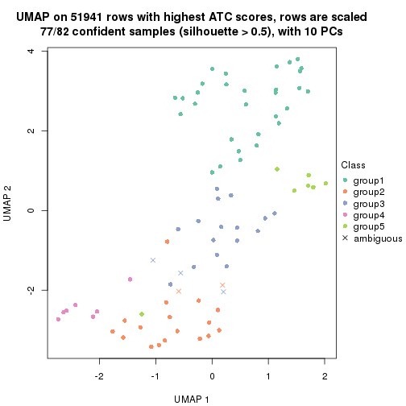</p>

</div>
<div id='tab-ATC-NMF-dimension-reduction-5'>
<pre><code class="r">dimension_reduction(res, k = 6, method = &quot;UMAP&quot;)
</code></pre>

<p></p>

</div>
</div>


Following heatmap shows how subgroups are split when increasing `k`:

```r
collect_classes(res)
```


Test correlation between subgroups and known annotations. If the known
annotation is numeric, one-way ANOVA test is applied, and if the known
annotation is discrete, chi-squared contingency table test is applied.

```r
test_to_known_factors(res)
```

```
#>          n disease.state(p) specimen(p) individual(p) k
#> ATC:NMF 80         1.97e-04    1.23e-15         0.997 2
#> ATC:NMF 77         9.19e-04    1.50e-13         0.876 3
#> ATC:NMF 80         6.06e-05    9.14e-16         0.626 4
#> ATC:NMF 77         1.10e-08    3.37e-19         0.349 5
#> ATC:NMF 75         1.04e-08    9.09e-19         0.445 6
```


If matrix rows can be associated to genes, consider to use `GO_Enrichment(res,
...)` to perform function enrichment for the signature genes.


 

## Session info


```r
sessionInfo()
```

```
#> R version 3.6.0 (2019-04-26)
#> Platform: x86_64-pc-linux-gnu (64-bit)
#> Running under: CentOS Linux 7 (Core)
#> 
#> Matrix products: default
#> BLAS:   /usr/lib64/libblas.so.3.4.2
#> LAPACK: /usr/lib64/liblapack.so.3.4.2
#> 
#> locale:
#>  [1] LC_CTYPE=en_GB.UTF-8       LC_NUMERIC=C               LC_TIME=en_GB.UTF-8       
#>  [4] LC_COLLATE=en_GB.UTF-8     LC_MONETARY=en_GB.UTF-8    LC_MESSAGES=en_GB.UTF-8   
#>  [7] LC_PAPER=en_GB.UTF-8       LC_NAME=C                  LC_ADDRESS=C              
#> [10] LC_TELEPHONE=C             LC_MEASUREMENT=en_GB.UTF-8 LC_IDENTIFICATION=C       
#> 
#> attached base packages:
#> [1] grid      parallel  stats     graphics  grDevices utils     datasets  methods   base     
#> 
#> other attached packages:
#>  [1] genefilter_1.66.0     ComplexHeatmap_2.1.1  markdown_1.1          knitr_1.26           
#>  [5] preprocessCore_1.46.0 cola_1.3.2            GEOquery_2.52.0       Biobase_2.44.0       
#>  [9] BiocGenerics_0.30.0   GetoptLong_0.1.7     
#> 
#> loaded via a namespace (and not attached):
#>  [1] bitops_1.0-6         matrixStats_0.55.0   bit64_0.9-7          doParallel_1.0.15   
#>  [5] RColorBrewer_1.1-2   httr_1.4.1           tools_3.6.0          backports_1.1.5     
#>  [9] R6_2.4.1             DBI_1.0.0            lazyeval_0.2.2       colorspace_1.4-1    
#> [13] withr_2.1.2          tidyselect_0.2.5     gridExtra_2.3        bit_1.1-14          
#> [17] compiler_3.6.0       xml2_1.2.2           microbenchmark_1.4-7 pkgmaker_0.28       
#> [21] slam_0.1-46          scales_1.1.0         readr_1.3.1          NMF_0.23.6          
#> [25] stringr_1.4.0        digest_0.6.23        pkgconfig_2.0.3      bibtex_0.4.2        
#> [29] highr_0.8            limma_3.40.6         rlang_0.4.2          GlobalOptions_0.1.1 
#> [33] RSQLite_2.1.2        impute_1.58.0        shape_1.4.4          mclust_5.4.5        
#> [37] dendextend_1.12.0    dplyr_0.8.3          RCurl_1.95-4.12      magrittr_1.5        
#> [41] Matrix_1.2-17        Rcpp_1.0.3           munsell_0.5.0        S4Vectors_0.22.1    
#> [45] viridis_0.5.1        lifecycle_0.1.0      stringi_1.4.3        plyr_1.8.4          
#> [49] blob_1.2.0           crayon_1.3.4         lattice_0.20-38      splines_3.6.0       
#> [53] annotate_1.62.0      circlize_0.4.9       hms_0.5.2            zeallot_0.1.0       
#> [57] pillar_1.4.2         rjson_0.2.20         rngtools_1.4         reshape2_1.4.3      
#> [61] codetools_0.2-16     stats4_3.6.0         XML_3.98-1.20        glue_1.3.1          
#> [65] evaluate_0.14        png_0.1-7            vctrs_0.2.0          foreach_1.4.7       
#> [69] polyclip_1.10-0      gtable_0.3.0         purrr_0.3.3          tidyr_1.0.0         
#> [73] clue_0.3-57          assertthat_0.2.1     ggplot2_3.2.1        xfun_0.11           
#> [77] gridBase_0.4-7       eulerr_6.0.0         xtable_1.8-4         skmeans_0.2-11      
#> [81] survival_2.44-1.1    viridisLite_0.3.0    tibble_2.1.3         iterators_1.0.12    
#> [85] AnnotationDbi_1.46.1 registry_0.5-1       memoise_1.1.0        IRanges_2.18.3      
#> [89] cluster_2.1.0        brew_1.0-6
```


